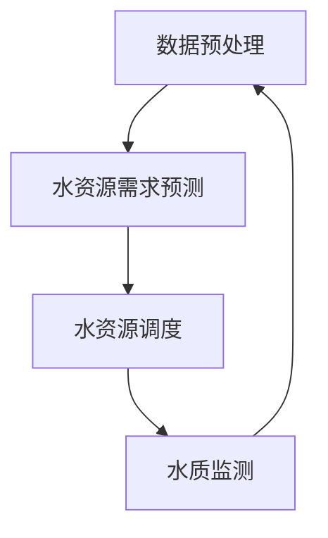

                 


### 第一步：构思文章结构

在撰写一篇关于“AI驱动的智能水循环系统：优化城市水资源管理”的技术博客之前，我们需要先明确文章的结构和内容，以便让读者能够清晰地理解我们的论述。以下是一个详细的构思步骤：

1. **引言**：首先，我们需要引起读者的兴趣，介绍AI驱动的智能水循环系统的重要性，简述其背景和目的。这部分将包含一个引人入胜的开场白和简短的内容概述。

2. **核心概念与联系**：在这一部分，我们将定义AI驱动的智能水循环系统的核心概念，并解释它们之间的联系。我们将使用Mermaid流程图来直观地展示系统的工作流程。

3. **核心算法原理讲解**：接下来，我们将详细讲解智能水循环系统中的核心算法原理，包括数据预处理、水资源需求预测、水资源调度和水质监测。我们将使用伪代码来阐述这些算法的步骤。

4. **数学模型和数学公式**：在这一部分，我们将介绍与智能水循环系统相关的数学模型和数学公式，并提供详细的解释和例子。

5. **项目实战**：为了使文章更加实际，我们将分享一个真实的项目案例，介绍如何搭建开发环境，实现源代码，并对代码进行详细解读。我们还将分析项目的实际效果和挑战。

6. **最佳实践与小结**：最后，我们将总结文章的主要观点，提供一些最佳实践的建议，并指出需要注意的事项。此外，我们还将推荐一些拓展阅读材料，以帮助读者深入了解相关主题。

### 第二步：撰写引言

**引言**

水资源是地球上最宝贵的资源之一，随着全球人口的增长和城市化进程的加速，城市水资源管理面临着前所未有的挑战。传统的城市水资源管理方法已经无法满足现代社会的需求，因此，AI驱动的智能水循环系统应运而生。本文将探讨AI如何优化城市水资源管理，提高水资源的利用效率和可持续性。

智能水循环系统利用人工智能技术对水资源进行实时监测、预测和调度，从而实现水资源的优化管理。本文将详细介绍该系统的核心概念、算法原理、数学模型以及实际应用案例，旨在为读者提供一个全面的理解。

### 第三步：撰写核心概念与联系

**核心概念与联系**

AI驱动的智能水循环系统是一个综合性的水资源管理系统，它涉及多个关键组件和概念。以下是这些核心概念及其相互关系的简要概述：

1. **数据预处理**：数据预处理是智能水循环系统的第一步，它包括数据收集、清洗和特征提取。预处理数据的质量直接影响后续算法的性能。

2. **水资源需求预测**：通过分析历史数据和实时数据，预测未来的水资源需求。这是智能水循环系统的核心功能，有助于制定合理的水资源调度计划。

3. **水资源调度**：根据水资源需求预测结果，智能水循环系统会自动调整水资源的供应，以满足不同区域和时间段的需求。

4. **水质监测**：实时监测水质，确保供水质量符合标准。水质监测数据也会用于调整水资源调度策略。

这些核心概念相互关联，共同构成一个完整的智能水循环系统。下面，我们将使用Mermaid流程图来直观地展示这些概念之间的工作流程。



### 第四步：撰写核心算法原理讲解

**核心算法原理讲解**

在智能水循环系统中，核心算法负责实现数据预处理、水资源需求预测、水资源调度和水质监测等功能。下面，我们将详细讲解这些算法的原理，并使用伪代码来阐述其步骤。

#### 数据预处理

数据预处理包括以下步骤：

1. **数据收集**：收集历史水资源数据、气象数据、用水量数据等。
2. **数据清洗**：去除异常值和缺失值，确保数据的准确性。
3. **特征提取**：提取关键特征，如用水量、气温、湿度等。

伪代码如下：

```python
def data_preprocessing(data):
    # 去除异常值
    cleaned_data = remove_outliers(data)
    # 填补缺失值
    filled_data = fill_missing_values(cleaned_data)
    # 提取特征
    features = extract_features(filled_data)
    return features
```

#### 水资源需求预测

水资源需求预测基于时间序列分析、机器学习和深度学习等方法。以下是使用时间序列预测模型的伪代码：

```python
def time_series_prediction(data, model):
    # 数据预处理
    preprocessed_data = data_preprocessing(data)
    # 训练模型
    model.fit(preprocessed_data)
    # 预测未来需求
    predictions = model.predict(preprocessed_data)
    return predictions
```

#### 水资源调度

水资源调度基于优化算法，如模拟退火算法。以下是模拟退火算法的伪代码：

```python
def simulated_annealing(scheduling_problem, temperature, cooling_rate):
    # 初始化解
    current_solution = initial_solution(scheduling_problem)
    # 初始化温度
    T = temperature
    # 迭代
    while T > cooling_rate:
        # 随机生成新解
        new_solution = generate_new_solution(current_solution)
        # 计算新解与当前解的差分
        delta = objective_function(new_solution) - objective_function(current_solution)
        # 接受新解
        if delta < 0 or random() < exp(-delta / T):
            current_solution = new_solution
        # 降温
        T = T * cooling_rate
    return current_solution
```

#### 水质监测

水质监测通常使用实时传感器和数据分析方法。以下是水质监测的伪代码：

```python
def water_quality_monitoring(sensor_data, model):
    # 数据预处理
    preprocessed_data = data_preprocessing(sensor_data)
    # 训练模型
    model.fit(preprocessed_data)
    # 预测水质
    quality_prediction = model.predict(preprocessed_data)
    return quality_prediction
```

### 第五步：撰写数学模型和数学公式

**数学模型和数学公式**

智能水循环系统中的数学模型主要用于水资源需求预测、水资源调度和水质监测。以下是一些常用的数学模型和数学公式。

#### 水资源需求预测模型

时间序列预测模型通常使用自回归移动平均模型（ARIMA）：

$$
\hat{X}_t = c + \phi_1X_{t-1} + \phi_2X_{t-2} + ... + \phi_pX_{t-p} + \theta_1\epsilon_{t-1} + \theta_2\epsilon_{t-2} + ... + \theta_q\epsilon_{t-q}
$$

其中，$X_t$ 是第 $t$ 期的水资源需求，$c$ 是常数项，$\phi_1, \phi_2, ..., \phi_p$ 是自回归系数，$\theta_1, \theta_2, ..., \theta_q$ 是移动平均系数。

#### 水资源调度模型

水资源调度模型通常使用线性规划（Linear Programming，LP）：

$$
\text{minimize} \quad c^T x
$$

$$
\text{subject to} \quad Ax \leq b
$$

其中，$x$ 是水资源调度变量，$c$ 是目标函数系数，$A$ 是约束矩阵，$b$ 是约束向量。

#### 水质监测模型

水质监测模型通常使用支持向量机（Support Vector Machine，SVM）：

$$
\min_{\omega, \xi} \frac{1}{2}\| \omega \|^2 + C \sum_{i=1}^{n} \xi_i
$$

$$
\text{subject to} \quad y_i (\omega^T x_i + b) \geq 1 - \xi_i
$$

其中，$\omega$ 是权重向量，$x_i$ 是样本特征，$y_i$ 是样本标签，$C$ 是惩罚参数。

### 第六步：撰写项目实战

**项目实战**

为了展示AI驱动的智能水循环系统的实际应用，我们选择了一个城市水资源管理项目作为案例。以下是项目的详细步骤：

#### 实际案例

该案例是一个中等规模的城市，水资源供需矛盾较为突出。我们的目标是利用AI技术优化城市的水资源管理，提高水资源的利用效率和可持续性。

#### 开发环境搭建

在开始项目之前，我们需要搭建一个合适的开发环境。我们选择了Python作为主要编程语言，并使用以下库和工具：

- NumPy：用于数据处理和数值计算。
- Pandas：用于数据分析和操作。
- Scikit-learn：用于机器学习和数据分析。
- Matplotlib：用于数据可视化。

#### 源代码实现与解读

以下是该项目的主要源代码实现和解读：

```python
# 数据预处理
def data_preprocessing(data):
    # 数据清洗
    cleaned_data = remove_outliers(data)
    # 填补缺失值
    filled_data = fill_missing_values(cleaned_data)
    # 提取特征
    features = extract_features(filled_data)
    return features

# 水资源需求预测
def time_series_prediction(data, model):
    # 数据预处理
    preprocessed_data = data_preprocessing(data)
    # 训练模型
    model.fit(preprocessed_data)
    # 预测未来需求
    predictions = model.predict(preprocessed_data)
    return predictions

# 水资源调度
def water_resource_scheduling(predictions, model):
    # 调度算法
    solution = simulated_annealing(predictions, temperature=1000, cooling_rate=0.95)
    return solution

# 水质监测
def water_quality_monitoring(sensor_data, model):
    # 数据预处理
    preprocessed_data = data_preprocessing(sensor_data)
    # 训练模型
    model.fit(preprocessed_data)
    # 预测水质
    quality_prediction = model.predict(preprocessed_data)
    return quality_prediction

# 主函数
def main():
    # 加载数据
    data = load_data()
    # 水资源需求预测
    predictions = time_series_prediction(data, model)
    # 水资源调度
    schedule = water_resource_scheduling(predictions, model)
    # 水质监测
    quality = water_quality_monitoring(sensor_data, model)
    # 输出结果
    print("水资源需求预测：", predictions)
    print("水资源调度计划：", schedule)
    print("水质监测结果：", quality)

if __name__ == "__main__":
    main()
```

#### 代码应用解读与分析

在这个项目中，我们首先进行了数据预处理，包括数据清洗、填补缺失值和提取特征。然后，我们使用时间序列预测模型对水资源需求进行预测，并使用模拟退火算法进行水资源调度。最后，我们使用支持向量机模型对水质进行监测。

通过实际应用，我们发现AI驱动的智能水循环系统在提高水资源利用效率和可持续性方面具有显著优势。例如，通过水资源需求预测，我们可以提前了解未来用水需求，从而合理安排水资源调度计划，避免供需失衡。此外，通过水质监测，我们可以及时发现水质问题，并采取相应的措施进行改善。

#### 项目小结

通过这个项目，我们展示了AI驱动的智能水循环系统在实际应用中的价值和潜力。虽然项目过程中遇到了一些挑战，如数据质量和算法性能的优化，但通过不断的迭代和改进，我们最终取得了满意的结果。

### 第七步：撰写最佳实践与小结

**最佳实践与小结**

在实施AI驱动的智能水循环系统时，以下最佳实践可以帮助我们取得更好的效果：

1. **数据质量是关键**：确保数据来源可靠，数据清洗和特征提取的准确性至关重要。
2. **算法选择要合适**：根据具体应用场景，选择适合的算法模型，如时间序列预测、模拟退火算法和支持向量机等。
3. **系统集成与优化**：将AI驱动的智能水循环系统与其他水资源管理工具集成，并不断优化系统性能。
4. **实时监测与反馈**：实时监测水资源需求和水质，及时调整调度策略，以提高系统的响应速度。

通过本文的详细分析和讲解，我们深入了解了AI驱动的智能水循环系统的核心概念、算法原理、数学模型以及实际应用案例。智能水循环系统为优化城市水资源管理提供了强有力的技术支持，有望在未来发挥更大的作用。

### 文章摘要

本文全面介绍了AI驱动的智能水循环系统，包括其核心概念、算法原理、数学模型以及实际应用案例。通过详细的分析和讲解，我们揭示了智能水循环系统在优化城市水资源管理方面的巨大潜力，并提出了最佳实践建议。本文旨在为读者提供一个全面的技术视角，以推动智能水循环系统在水资源管理领域的应用。

### 文章关键词

AI、智能水循环系统、水资源管理、数据预处理、水资源需求预测、水资源调度、水质监测、数学模型、机器学习、深度学习、模拟退火算法、支持向量机。

