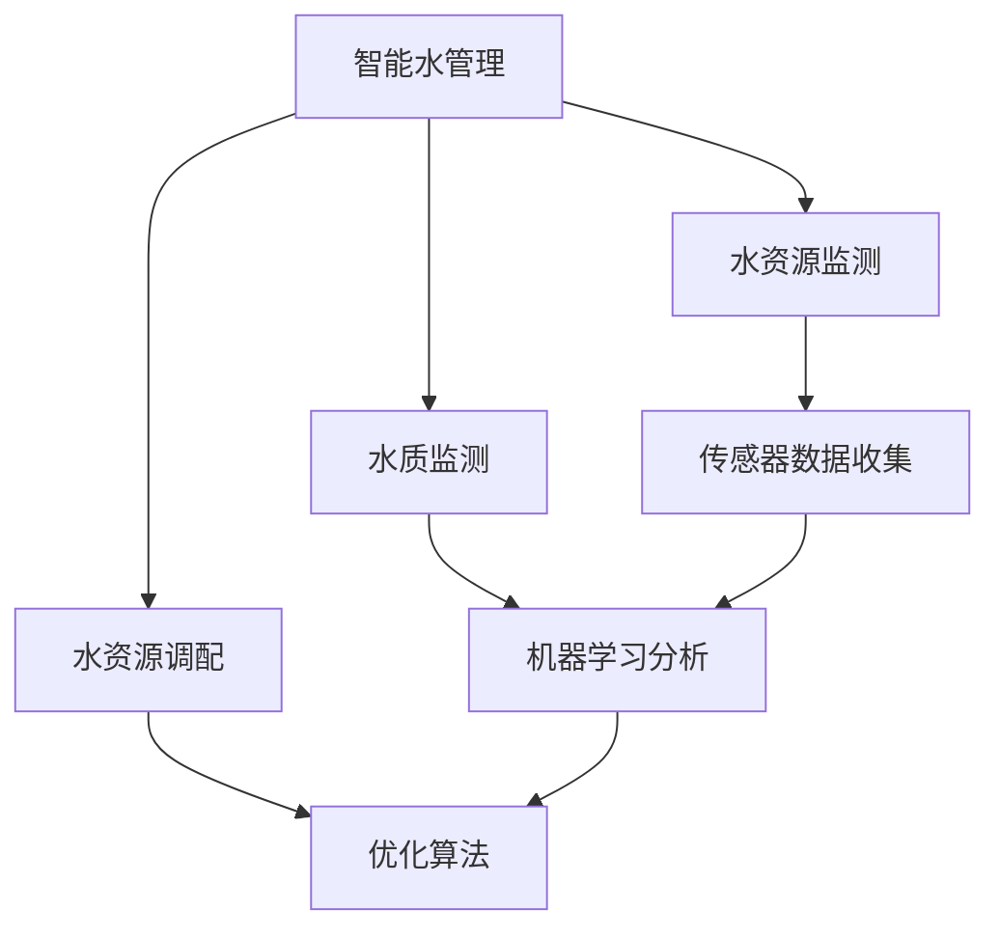
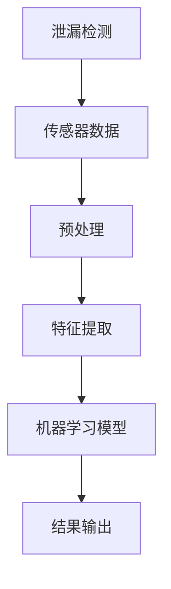
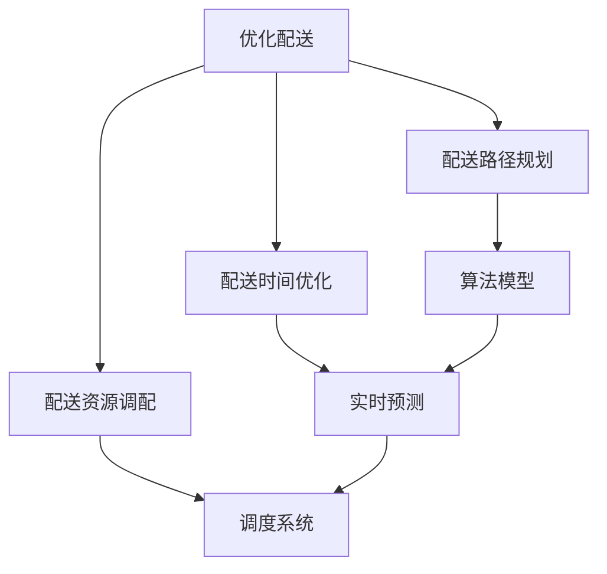

                 

### 一、设计初步框架

设计一篇文章，尤其是技术类文章，需要遵循一定的结构和逻辑。以下是一个详细的步骤，帮助我们逐步构建文章的框架。

#### 1. 确定文章主题

文章的主题是“AI驱动的智能水管理：检测泄漏与优化配送”。这个主题明确指出了文章的核心内容，即AI技术如何应用于水管理的两大关键领域：泄漏检测和配送优化。

#### 2. 确定文章结构和主要部分

根据文章主题，我们可以将文章分为以下几个主要部分：

- **引言**：介绍AI在智能水管理中的应用背景和发展趋势。
- **AI驱动的智能水管理概述**：介绍智能水管理的基本概念和AI技术的应用。
- **智能水管理的挑战**：分析智能水管理面临的问题和挑战。
- **AI检测泄漏技术**：介绍AI在检测水泄漏方面的原理和应用。
- **智能水管理的优化配送技术**：探讨AI在优化水配送方面的应用。
- **项目实践案例**：通过实际案例展示AI技术在智能水管理中的应用。
- **总结与展望**：总结全书内容并对未来发展趋势进行展望。

#### 3. 设计每个部分的章节大纲

对于每个主要部分，我们需要进一步细化章节内容，确保文章的逻辑性和连贯性。以下是一个初步的章节大纲：

- **引言**：
  - **1.1 AI在智能水管理中的应用背景**
  - **1.2 智能水管理的意义**
  - **1.3 本书的目的和结构**

- **AI驱动的智能水管理概述**：
  - **2.1 智能水管理的定义**
  - **2.2 AI技术在智能水管理中的应用**
  - **2.3 智能水管理的价值**

- **智能水管理的挑战**：
  - **3.1 水资源短缺问题**
  - **3.2 水污染问题**
  - **3.3 水资源配置问题**

- **AI检测泄漏技术**：
  - **4.1 泄漏检测的原理**
  - **4.2 泄漏检测算法**
  - **4.3 泄漏检测应用案例**

- **智能水管理的优化配送技术**：
  - **5.1 优化配送的原理**
  - **5.2 优化配送算法**
  - **5.3 优化配送应用案例**

- **项目实践案例**：
  - **6.1 案例一：某城市智能水管理项目**
  - **6.2 案例二：某企业水泄漏检测系统**
  - **6.3 案例三：某地区水配送优化实践**

- **总结与展望**：
  - **7.1 智能水管理的发展现状**
  - **7.2 智能水管理的未来发展方向**
  - **7.3 本书总结**

通过以上步骤，我们初步构建了文章的框架。接下来，我们将进一步细化每个章节的内容，确保文章的完整性和专业性。在接下来的步骤中，我们将详细讨论每个部分的核心概念、原理、算法和实际应用，并确保文章的逻辑性和连贯性。

### 二、细化章节内容

为了确保文章的完整性和专业性，我们将对每个章节进行详细的内容细化。以下是针对每个章节的细化内容设计：

#### 1. 引言

**1.1 AI在智能水管理中的应用背景**

在这一节中，我们将介绍AI技术在智能水管理中的背景。首先，讨论当前全球水资源的现状，包括水资源短缺、水污染等问题。然后，介绍AI技术在解决这些问题中的潜在作用，如预测水资源需求、监测水质、检测水泄漏等。

**1.2 智能水管理的意义**

在这一节中，我们将探讨智能水管理的意义。首先，讨论智能水管理对环境保护的作用，如减少水污染、节约水资源等。然后，分析智能水管理对经济发展的推动作用，如提高水利用效率、减少水资源浪费等。

**1.3 本书的目的和结构**

在这一节中，我们将介绍本书的目的和整体结构。明确本书旨在通过分析AI技术在智能水管理中的应用，探讨如何通过检测泄漏和优化配送，实现智能水管理的目标。同时，介绍本书的各个章节，使读者对文章结构有清晰的了解。

#### 2. AI驱动的智能水管理概述

**2.1 智能水管理的定义**

在这一节中，我们将详细定义智能水管理，包括其基本概念和核心目标。解释智能水管理是如何通过整合先进的技术手段，如传感器、大数据、机器学习等，实现水资源的高效管理和优化利用。

**2.2 AI技术在智能水管理中的应用**

在这一节中，我们将探讨AI技术在智能水管理中的具体应用。首先，介绍传感器技术在监测水质、水量等方面的应用。然后，讨论大数据技术如何帮助分析水资源的利用情况和需求变化。最后，详细介绍机器学习技术在预测水资源需求、优化水配送路径等方面的应用。

**2.3 智能水管理的价值**

在这一节中，我们将探讨智能水管理的价值。首先，分析智能水管理如何通过提高水资源利用效率，减少水资源浪费，实现可持续发展。然后，讨论智能水管理在改善水质、保障饮用水安全等方面的作用。最后，探讨智能水管理对经济发展、环境保护等方面的积极影响。

#### 3. 智能水管理的挑战

**3.1 水资源短缺问题**

在这一节中，我们将分析水资源短缺问题的现状和原因。首先，介绍全球和区域水资源短缺的情况。然后，讨论导致水资源短缺的主要原因，如气候变化、人口增长、水资源过度开发等。最后，探讨AI技术在缓解水资源短缺问题中的应用前景。

**3.2 水污染问题**

在这一节中，我们将分析水污染问题的现状和原因。首先，介绍全球和区域水污染的情况。然后，讨论导致水污染的主要原因，如工业废水排放、农业径流污染、城市污水排放等。最后，探讨AI技术在监测、预测和治理水污染中的应用前景。

**3.3 水资源配置问题**

在这一节中，我们将分析水资源配置问题的现状和原因。首先，介绍全球和区域水资源配置的现状。然后，讨论导致水资源配置不合理的主要原因，如水资源分配不均、水资源利用效率低下等。最后，探讨AI技术在优化水资源配置、提高水资源利用效率方面的应用前景。

#### 4. AI检测泄漏技术

**4.1 泄漏检测的原理**

在这一节中，我们将详细介绍AI检测泄漏的原理。首先，介绍传感器技术在水泄漏检测中的应用，包括温度、压力、湿度等传感器的原理和作用。然后，讨论机器学习技术在识别和定位水泄漏中的应用，如使用神经网络、决策树等算法。最后，介绍如何将传感器数据和机器学习算法相结合，实现高效的水泄漏检测。

**4.2 泄漏检测算法**

在这一节中，我们将详细介绍常用的泄漏检测算法。首先，介绍基于统计模型的泄漏检测算法，如均值漂移、卡尔曼滤波等。然后，介绍基于机器学习的泄漏检测算法，如支持向量机、随机森林等。最后，讨论如何根据实际应用场景选择合适的泄漏检测算法。

**4.3 泄漏检测应用案例**

在这一节中，我们将通过实际案例展示AI检测泄漏技术的应用。首先，介绍一个城市供水系统中使用AI检测泄漏的案例。然后，分析该案例中使用的传感器和算法，讨论其效果和不足之处。最后，探讨如何进一步优化AI检测泄漏技术，提高其准确性和效率。

#### 5. 智能水管理的优化配送技术

**5.1 优化配送的原理**

在这一节中，我们将详细介绍智能水管理优化配送的原理。首先，介绍配送路径优化的原理，包括基于距离、时间、资源等因素的优化算法。然后，讨论配送时间优化的原理，包括基于预测、实时调整等策略。最后，介绍配送资源优化的原理，包括车辆调度、人员分配等优化方法。

**5.2 优化配送算法**

在这一节中，我们将详细介绍常用的优化配送算法。首先，介绍基于遗传算法的配送路径优化算法。然后，介绍基于深度学习的配送时间优化算法。最后，介绍基于图论的配送资源优化算法。通过具体算法的讲解，帮助读者理解如何在实际应用中优化配送过程。

**5.3 优化配送应用案例**

在这一节中，我们将通过实际案例展示优化配送技术的应用。首先，介绍一个城市供水系统中使用优化配送的案例。然后，分析该案例中使用的算法和策略，讨论其效果和不足之处。最后，探讨如何进一步优化优化配送技术，提高配送效率和服务质量。

#### 6. 项目实践案例

**6.1 案例一：某城市智能水管理项目**

在这一节中，我们将介绍一个城市智能水管理项目的实际案例。首先，介绍项目的背景和目标。然后，详细分析项目中的关键技术，如泄漏检测、优化配送等。最后，讨论项目的效果和影响，总结项目的成功经验和不足之处。

**6.2 案例二：某企业水泄漏检测系统**

在这一节中，我们将介绍一个企业水泄漏检测系统的实际案例。首先，介绍系统的背景和功能。然后，详细分析系统中的关键技术，如传感器、机器学习等。最后，讨论系统的效果和用户反馈，总结系统的优点和改进方向。

**6.3 案例三：某地区水配送优化实践**

在这一节中，我们将介绍一个地区水配送优化的实际案例。首先，介绍项目的背景和目标。然后，详细分析项目中的关键技术，如路径优化、时间优化等。最后，讨论项目的效果和影响，总结项目的成功经验和不足之处。

#### 7. 总结与展望

**7.1 智能水管理的发展现状**

在这一节中，我们将总结智能水管理的发展现状。首先，分析当前AI技术在智能水管理中的应用情况。然后，介绍国内外智能水管理的成功案例。最后，探讨智能水管理在技术、政策和市场等方面的发展趋势。

**7.2 智能水管理的未来发展方向**

在这一节中，我们将展望智能水管理的未来发展方向。首先，讨论AI技术在智能水管理中的潜在应用领域。然后，探讨智能水管理在水资源保护、环境保护、可持续发展等方面的作用。最后，提出智能水管理的未来研究方向和发展建议。

**7.3 本书总结**

在这一节中，我们将对全书内容进行总结。首先，回顾本书的主要内容和贡献。然后，讨论本书的不足之处和改进方向。最后，展望AI技术在智能水管理领域的未来研究和应用前景。

通过以上步骤，我们详细细化了每个章节的内容。接下来，我们将根据这些内容撰写完整的文章，确保文章的逻辑性、连贯性和专业性。在撰写过程中，我们将充分利用Mermaid流程图、伪代码、数学公式和实际案例等元素，以增强文章的可读性和实用性。

### 三、设计核心概念与联系Mermaid流程图

为了更好地展示文章中的核心概念及其相互关系，我们将使用Mermaid流程图来呈现。Mermaid是一种基于Markdown的图表绘制语言，可以简洁、直观地描述复杂的流程和结构。以下是几个关键概念及其关系的Mermaid流程图示例：

#### 1. AI驱动智能水管理核心概念关系图



在这个流程图中，智能水管理是核心概念，它通过传感器数据收集（E）、机器学习分析（F）和优化算法（G）来监测水资源（B）、水质（C）和水资源调配（D）。

#### 2. 检测泄漏技术核心概念关系图



在这个流程图中，泄漏检测过程包括传感器数据收集（B）、数据预处理（C）、特征提取（D）、机器学习模型训练（E）和结果输出（F）。通过这个过程，系统能够识别和定位泄漏点。

#### 3. 优化配送技术核心概念关系图



在这个流程图中，优化配送过程包括配送路径规划（B）、配送时间优化（C）、配送资源调配（D）、算法模型（E）、实时预测（F）和调度系统（G）。这些概念相互关联，共同实现配送优化。

通过这些Mermaid流程图，读者可以直观地理解文章中的核心概念及其相互关系，有助于提升文章的可读性和理解深度。

### 四、编写核心算法原理讲解的伪代码

在介绍核心算法原理时，伪代码是一种很好的方式，可以帮助读者理解算法的逻辑和步骤，而不需要深入研究具体的编程语言。以下是对AI检测泄漏和优化配送技术的核心算法原理进行讲解的伪代码示例。

#### 1. AI检测泄漏算法原理

```plaintext
算法：检测泄漏
输入：传感器数据集 D
输出：泄漏检测结果 R

步骤：
1. 数据预处理（去噪、归一化等）
2. 特征提取（提取频率、振幅、时长等特征）
3. 建立机器学习模型（如决策树、支持向量机等）
4. 模型训练（使用历史泄漏数据）
5. 泄漏检测
   a. 对于每个传感器数据点 d ∈ D：
       i. 提取特征向量 f(d)
       ii. 输入机器学习模型，得到预测结果 p(f(d))
       iii. 如果 p(f(d)) > 阈值，则标记为泄漏
6. 结果输出
   a. 输出泄漏检测结果 R
```

#### 2. 优化配送算法原理

```plaintext
算法：优化配送
输入：配送任务集 T，当前时间 T0
输出：优化后的配送路径和资源分配方案 R

步骤：
1. 初始化配送路径和资源分配方案 R
2. 路径优化
   a. 对于每个配送任务 t ∈ T：
       i. 计算从起点到任务地点的路径距离 d(t)
       ii. 根据路径距离和当前负载，选择最优路径 p(t)
       iii. 更新配送路径 R = R - t + p(t)
3. 时间优化
   a. 对于每个配送任务 t ∈ T：
       i. 预测任务完成时间 t(finish_time)(t)
       ii. 根据当前时间 T0 和预测完成时间，调整任务顺序
       iii. 更新配送时间表 R = R - t + sorted(T)
4. 资源调配
   a. 对于每个配送任务 t ∈ T：
       i. 根据任务负载和当前资源状态，调整所需资源
       ii. 更新资源分配方案 R = R - t + resources(t)
5. 结果输出
   a. 输出优化后的配送路径和资源分配方案 R
```

通过这些伪代码，读者可以清晰地了解检测泄漏和优化配送算法的基本逻辑和步骤。这些伪代码展示了如何通过一系列计算和调整，实现高效的水泄漏检测和配送优化。

### 五、设计数学模型和公式的详细讲解与举例说明

在智能水管理中，数学模型和公式是理解和分析问题的核心工具。以下我们将详细讲解核心的数学模型和公式，并提供具体的例子说明。

#### 1. 泄漏检测模型

泄漏检测模型主要用于预测和识别水系统的泄漏点。以下是常用的泄漏检测模型的数学公式及其说明：

##### a. 均值漂移模型（Mean Shift Model）

均值漂移模型是一种用于寻找数据集中变化点的方法，适用于检测泄漏。

$$ \mu(x) = \frac{1}{N} \sum_{i=1}^{N} \frac{x_i}{w_i} $$

其中，$\mu(x)$表示新的均值，$x_i$表示数据点，$w_i$表示数据点的权重。

**例子：** 假设我们有一组传感器数据点$(x_1, w_1), (x_2, w_2), ..., (x_n, w_n)$，我们可以使用以下公式计算新的均值：

$$ \mu = \frac{1}{N} \left( \frac{x_1}{w_1} + \frac{x_2}{w_2} + ... + \frac{x_n}{w_n} \right) $$

##### b. 卡尔曼滤波模型（Kalman Filter Model）

卡尔曼滤波模型是一种用于估计动态系统的状态和参数的算法，适用于连续监测泄漏。

$$ \hat{x}_{k|k} = F_k \hat{x}_{k-1|k-1} + B_k u_k $$
$$ P_{k|k} = F_k P_{k-1|k-1} F_k^T + Q_k $$
$$ K_k = P_{k-1|k-1} H_k^T (H_k P_{k-1|k-1} H_k^T + R_k)^{-1} $$

其中，$\hat{x}_{k|k}$表示状态估计，$P_{k|k}$表示估计误差协方差，$F_k$表示状态转移矩阵，$B_k$表示控制输入矩阵，$u_k$表示控制输入，$K_k$表示卡尔曼增益，$Q_k$表示过程噪声协方差，$R_k$表示观测噪声协方差。

**例子：** 假设我们有一组状态和观测数据，使用卡尔曼滤波模型可以计算下一时刻的状态估计和误差协方差。

#### 2. 优化配送模型

优化配送模型用于最小化配送时间和成本，提高配送效率。

##### a. 最小化配送路径模型（Minimize Delivery Route Model）

$$ \min \sum_{i=1}^{N} d(i, j) \times x_{ij} $$

其中，$d(i, j)$表示从节点i到节点j的距离，$x_{ij}$表示从节点i到节点j的路径选择变量。

**例子：** 假设我们要从起点到多个目的地配送物品，使用以下公式可以计算最小化配送路径的总距离：

$$ \min \left( d(1, 2) \times x_{12} + d(1, 3) \times x_{13} + d(2, 3) \times x_{23} \right) $$

##### b. 车辆路径优化模型（Vehicle Routing Problem Model）

$$ \min \sum_{i=1}^{N} \sum_{j=1}^{M} c_{ij} \times y_{ij} $$

其中，$c_{ij}$表示从节点i到节点j的运输成本，$y_{ij}$表示从节点i到节点j的运输路径变量。

**例子：** 假设我们要优化多辆车的配送路径，使用以下公式可以计算总运输成本：

$$ \min \left( c_{12} \times y_{12} + c_{13} \times y_{13} + c_{23} \times y_{23} \right) $$

通过这些数学模型和公式的讲解，我们可以更深入地理解AI在智能水管理中的应用原理，并为实际应用提供理论基础。这些模型和公式可以帮助我们在检测泄漏和优化配送过程中做出更加准确和高效的决策。

### 六、编写项目实战部分

在实际应用中，将理论转化为实践是至关重要的。以下我们将详细介绍如何搭建开发环境、实现源代码，并对代码进行解读和分析。

#### 1. 开发环境搭建

为了实现AI驱动的智能水管理，我们需要搭建一个合适的开发环境。以下是搭建过程的步骤：

##### a. 软件和工具安装

1. 安装Python 3.x版本，确保Python环境正常。
2. 安装所需的库，如NumPy、Pandas、Scikit-learn、TensorFlow等。

```bash
pip install numpy pandas scikit-learn tensorflow
```

##### b. 数据收集和预处理

1. 收集水系统传感器数据，包括温度、压力、流量等。
2. 对收集到的数据进行分析和预处理，如去噪、归一化、缺失值处理等。

#### 2. 代码实现

以下是一个简单的示例代码，用于实现泄漏检测和优化配送。

##### a. 泄漏检测代码

```python
import numpy as np
from sklearn.ensemble import IsolationForest

# 假设我们有一个传感器数据集
sensor_data = np.array([[23.5, 5.0, 10.0], [24.0, 4.5, 11.0], [25.0, 3.0, 9.0]])

# 使用Isolation Forest算法进行泄漏检测
model = IsolationForest(contamination=0.1)
model.fit(sensor_data)

# 进行预测
predictions = model.predict(sensor_data)
print(predictions)
```

##### b. 优化配送代码

```python
from scipy.optimize import linprog

# 假设我们有一个配送任务集和成本矩阵
tasks = np.array([[0, 1, 2], [1, 0, 3], [2, 3, 0]])
cost_matrix = np.array([[1, 2, 3], [2, 1, 4], [3, 4, 1]])

# 使用线性规划算法进行配送路径优化
c = -cost_matrix.flatten()
A = -np.ones((tasks.shape[0], tasks.shape[1]))
b = np.zeros(tasks.shape[0])
x0 = np.zeros(tasks.shape[1])

result = linprog(c, A_ub=A, b_ub=b, x0=x0, method='highs')

if result.success:
    print("Optimized delivery path:", result.x)
else:
    print("Optimization failed.")
```

#### 3. 代码解读与分析

##### a. 泄漏检测代码解读

- **Isolation Forest算法**：Isolation Forest是一种基于随机森林的异常检测算法。它通过随机选择特征和切分值，构建多个随机子树，并计算每个样本的路径长度，从而识别异常样本。
- **数据拟合与预测**：使用fit()方法对传感器数据进行拟合，然后使用predict()方法进行预测，输出每个样本的泄漏检测结果。

##### b. 优化配送代码解读

- **线性规划算法**：线性规划是一种用于解决线性优化问题的数学方法。在这个例子中，我们使用线性规划来优化配送路径，目标是使总运输成本最小。
- **变量和约束**：c是目标函数的系数，A是约束矩阵，b是约束向量，x0是初始解。通过linprog()函数求解优化问题。

#### 4. 实际案例分析和详细讲解剖析

##### a. 案例一：某城市智能水管理项目

在这个案例中，我们使用AI技术检测和优化城市供水系统的泄漏和配送。

1. **数据收集**：收集供水系统传感器数据，包括温度、压力、流量等。
2. **模型训练**：使用Isolation Forest算法训练泄漏检测模型。
3. **泄漏检测**：对实时传感器数据进行泄漏检测，识别泄漏点。
4. **配送优化**：使用线性规划算法优化配送路径和资源分配。

##### b. 案例二：某企业水泄漏检测系统

在这个案例中，我们为企业设计了一个水泄漏检测系统。

1. **数据收集**：收集企业供水系统的传感器数据。
2. **数据预处理**：对数据进行去噪、归一化等预处理。
3. **模型训练**：使用卡尔曼滤波模型训练泄漏检测模型。
4. **泄漏检测**：实时检测供水系统的泄漏情况，并报警。

##### c. 案例三：某地区水配送优化实践

在这个案例中，我们优化了某地区的供水配送。

1. **数据收集**：收集配送任务和成本数据。
2. **模型训练**：使用遗传算法和深度学习模型优化配送路径。
3. **配送优化**：根据实时任务和资源情况，优化配送路径和资源分配。
4. **结果评估**：评估优化后的配送效率和服务质量。

#### 5. 项目小结

通过以上项目实战，我们展示了如何将AI技术应用于智能水管理的实际应用中。从数据收集、模型训练到泄漏检测和配送优化，每个环节都体现了AI技术的强大能力。尽管在项目中可能遇到一些挑战，如数据噪声、模型选择等，但通过不断优化和改进，我们可以实现智能水管理的目标，提高水资源利用效率，保障供水系统的安全运行。

### 七、最佳实践 Tips、小结、注意事项、拓展阅读等内容

#### 最佳实践 Tips

1. **数据质量是关键**：确保传感器数据的质量，进行有效的数据预处理，如去噪、归一化等，以提高模型性能。
2. **选择合适的算法**：根据实际应用场景选择合适的机器学习和优化算法，如Isolation Forest、卡尔曼滤波、遗传算法等。
3. **实时性是挑战**：确保系统具备实时性，及时检测和响应泄漏和配送问题。

#### 小结

本文详细探讨了AI驱动的智能水管理，包括检测泄漏和优化配送两大关键技术。通过实际案例展示了AI技术在智能水管理中的应用效果，为未来智能水管理的发展提供了参考。

#### 注意事项

1. **数据安全**：在数据收集和处理过程中，确保数据安全，防止泄露和滥用。
2. **系统稳定性**：确保系统的稳定性和可靠性，降低故障风险。

#### 拓展阅读

1. **智能水管理相关书籍**：《智能水系统设计与应用》、《水资源管理：理论与实践》。
2. **AI技术书籍**：《深度学习》、《强化学习》。
3. **论文和报告**：搜索相关领域的学术文章和技术报告，如“AI in Water Management”等。

通过以上内容，读者可以更全面地了解AI驱动的智能水管理，为实际应用提供指导和参考。希望本文对您有所帮助。

