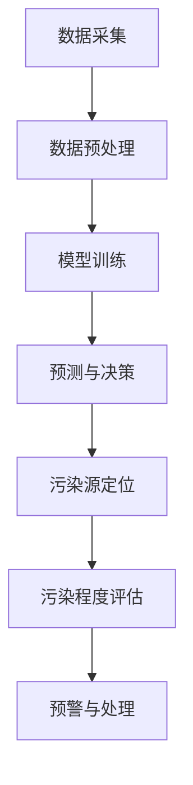
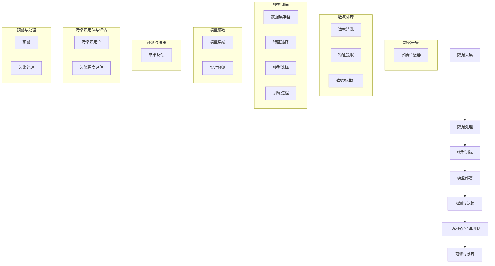

                 

### 文章标题

# AI驱动的智能水质监测网络：实时检测污染源

### 关键词

- AI驱动的智能水质监测
- 实时污染源检测
- 水质传感器
- 深度学习模型
- 物联网架构

### 摘要

本文旨在探讨AI驱动的智能水质监测网络，该网络通过整合先进的人工智能技术和物联网设备，实现对水质的实时监测和污染源的精确检测。文章首先介绍了水质监测的背景和重要性，随后详细解析了AI驱动的智能水质监测网络的核心概念、架构、算法原理、数学模型，并通过实际项目案例展示了其应用效果。文章最后讨论了未来发展趋势和面临的挑战，为水质监测领域的进一步发展提供了参考。

## 引言

水质监测是环境保护的重要一环，它直接关系到人类健康、生态平衡和可持续发展。随着工业化和城市化的加速发展，水污染问题日益严重，传统的监测方法已难以满足实时、高效和精确的需求。近年来，人工智能（AI）技术的迅猛发展为水质监测带来了新的契机。AI驱动的智能水质监测网络通过整合多种先进技术，如物联网、传感器、机器学习和深度学习，实现了对水质参数的实时监测和污染源的高精度检测，大大提升了水质监测的效率和准确性。

本文将从以下几个方面展开讨论：

1. AI驱动的智能水质监测网络概述，包括其核心概念和架构。
2. 数据采集与预处理，重点介绍水质传感器和数据预处理方法。
3. 模型训练与优化，详细解释水质监测模型的设计和训练过程。
4. 预测与决策，探讨如何利用AI模型进行污染源定位和污染程度评估。
5. 案例研究，通过实际项目案例分析AI驱动的智能水质监测网络的实施效果。
6. 未来发展趋势与挑战，展望水质监测领域的未来发展方向和面临的技术难题。

通过本文的讨论，希望能够为读者提供一份全面、深入的AI驱动的智能水质监测网络的技术指南。

## AI驱动的智能水质监测网络概述

### 核心概念

AI驱动的智能水质监测网络是一个集成了多种先进技术的综合系统，其主要目的是通过实时监测水质参数，识别和检测水污染源，从而提供精准的水质管理和污染预警。该网络的核心概念包括以下几个方面：

1. **物联网（IoT）**：物联网技术为水质监测网络提供了数据采集和传输的基础设施，通过连接大量的水质传感器，实现对水质参数的实时监测。
2. **传感器技术**：水质传感器是监测网络的关键组件，能够测量水中的各种化学、物理和生物参数，如pH值、溶解氧、总氮、总磷等。
3. **机器学习和深度学习**：利用机器学习和深度学习算法，对采集到的水质数据进行分析和处理，从中提取有价值的信息，用于污染源定位和污染程度评估。
4. **数据存储与处理**：云平台和数据仓库技术为水质监测网络提供了强大的数据处理和存储能力，能够存储大量的水质数据，并支持复杂的数据分析和挖掘。

### 关联概念

AI驱动的智能水质监测网络不仅与AI和物联网技术紧密相关，还与传感器技术、数据分析和处理等多个领域有直接的联系。

- **AI与物联网**：AI技术为物联网设备提供了智能化的数据处理和分析能力，使得物联网不再仅仅是数据的采集和传输，而是能够进行自我学习和决策。这种结合极大地提升了水质监测网络的智能化水平。
- **传感器技术与水质监测**：传感器技术是水质监测网络的关键，不同的传感器能够测量不同的水质参数，为AI模型的训练提供了丰富的数据来源。
- **数据分析和处理**：水质数据通常包含大量的噪声和不完整信息，通过先进的数据分析和处理技术，如数据清洗、特征提取和模式识别，能够从数据中提取出有价值的信息，为污染源检测提供可靠依据。

### Mermaid流程图

为了更直观地展示AI驱动的智能水质监测网络的工作流程，我们使用Mermaid流程图来表示。以下是一个简化的流程图：



**图1. AI驱动的智能水质监测网络流程图**

- **数据采集**：通过水质传感器实时采集水质数据。
- **数据预处理**：对采集到的数据进行清洗和预处理，以消除噪声和缺失值。
- **模型训练**：使用机器学习和深度学习算法，对预处理后的数据进行分析和训练，构建水质监测模型。
- **预测与决策**：利用训练好的模型进行水质预测和污染源定位。
- **污染源定位**：通过分析水质参数的变化，确定污染源的位置。
- **污染程度评估**：评估污染源的污染程度，为污染处理提供依据。
- **预警与处理**：根据评估结果，发出污染预警，并采取相应的污染处理措施。

通过上述流程，AI驱动的智能水质监测网络能够实现从数据采集、处理到污染源检测的完整闭环，为水质监测提供了强大的技术支持。

### AI驱动的智能水质监测网络的架构

AI驱动的智能水质监测网络的架构是整个系统的核心，它决定了水质监测的效率和准确性。下面将详细描述这一架构的组成部分，包括数据采集、数据处理、模型训练和模型部署等关键环节。

#### 数据采集

数据采集是水质监测的第一步，也是最为关键的一步。水质传感器在河流、湖泊、水库等水域中安装，用于实时监测水质的各项指标，如pH值、溶解氧、电导率、总氮、总磷等。这些传感器将实时采集到的数据通过无线网络传输到中央数据处理系统。

- **传感器类型**：常用的水质传感器包括电化学传感器、光谱传感器、生物传感器等。每种传感器都有其特定的测量范围和精度。
- **数据传输**：传感器采集到的数据可以通过Wi-Fi、蓝牙、LoRa等无线通信技术传输到中央服务器。为了确保数据传输的可靠性和实时性，通常采用多重冗余传输机制。

#### 数据处理

数据采集到的水质数据通常是原始且不完整的，因此需要进行预处理，以确保数据的质量和一致性。数据处理包括以下步骤：

- **数据清洗**：去除数据中的噪声和异常值，包括缺失值填充、异常值检测和去除等。
- **特征提取**：从原始数据中提取出对水质监测有意义的特征，如时间序列特征、空间特征等。
- **数据标准化**：将不同尺度、单位和范围的数据进行标准化处理，使其具有可比性。

#### 模型训练

在数据处理完成后，下一步是使用机器学习和深度学习算法对水质数据进行训练，构建水质监测模型。模型训练过程主要包括以下步骤：

- **数据集准备**：从预处理后的数据中构建训练集、验证集和测试集。
- **特征选择**：选择对水质监测最有影响力的特征，以简化模型复杂度和提高训练效率。
- **模型选择**：选择适合水质监测的机器学习算法，如支持向量机（SVM）、随机森林（RF）、深度神经网络（DNN）等。
- **训练过程**：通过迭代训练，不断调整模型的参数，使其达到最佳性能。

#### 模型部署

训练好的模型需要部署到实际的水质监测系统中，以便进行实时水质监测和污染源检测。模型部署包括以下环节：

- **模型集成**：将训练好的模型集成到现有的水质监测系统中，确保其与现有系统的无缝对接。
- **实时预测**：利用部署的模型对实时采集的水质数据进行预测，识别潜在的污染源。
- **结果反馈**：将预测结果反馈给决策者，提供水质预警和污染处理建议。

#### 架构设计

AI驱动的智能水质监测网络的总体架构设计如图2所示。



**图2. AI驱动的智能水质监测网络架构图**

通过上述架构设计，AI驱动的智能水质监测网络能够高效、准确地实现对水质的实时监测和污染源的检测，为环境保护和水污染治理提供了有力的技术支持。

### 数据采集与预处理

数据采集和预处理是AI驱动的智能水质监测网络中的关键环节，直接影响到模型的训练效果和最终水质监测的准确性。以下是数据采集与预处理的具体步骤和方法。

#### 数据采集

水质数据的采集主要通过安装在水域中的传感器来实现。这些传感器能够实时测量水中的多种参数，如pH值、溶解氧、电导率、总氮、总磷等。传感器数据的采集频率和精度是决定水质监测效果的重要因素。

- **传感器类型**：水质传感器主要包括电化学传感器、光谱传感器和生物传感器等。电化学传感器适用于测量pH值、电导率等参数；光谱传感器适用于测量有机污染物和重金属离子；生物传感器则适用于测量微生物和生物化学指标。
- **数据采集频率**：通常情况下，水质传感器以每小时或更短的时间间隔进行数据采集，以确保实时监测水质变化。
- **数据传输方式**：传感器采集到的数据可以通过Wi-Fi、蓝牙、LoRa等无线通信技术传输到中央服务器，也可以通过有线网络传输。为了提高数据传输的可靠性，可以采用多重冗余传输机制。

#### 数据预处理

采集到的水质数据通常是原始且不完整的，因此需要进行预处理，以确保数据的质量和一致性。数据预处理主要包括以下步骤：

- **数据清洗**：去除数据中的噪声和异常值，包括缺失值填充、异常值检测和去除等。对于缺失值，可以采用均值填补、插值法等方法进行填补；对于异常值，可以通过统计方法或机器学习方法进行检测和去除。
- **特征提取**：从原始数据中提取出对水质监测有意义的特征，如时间序列特征、空间特征和统计特征等。时间序列特征可以反映水质参数随时间的变化趋势；空间特征可以反映不同地点的水质差异；统计特征则可以从整体上描述水质的分布情况。
- **数据标准化**：将不同尺度、单位和范围的数据进行标准化处理，使其具有可比性。常用的标准化方法包括最小-最大标准化和z-score标准化。

#### 伪代码

以下是一个简化的水质数据预处理伪代码，用于描述数据清洗、特征提取和数据标准化的过程：

```python
# 数据清洗
def clean_data(data):
    # 填补缺失值
    data_filled = fill_missing_values(data)
    # 检测并去除异常值
    data cleaned = remove_outliers(data_filled)
    return data_cleaned

# 特征提取
def extract_features(data):
    # 提取时间序列特征
    time_series_features = extract_time_series_features(data)
    # 提取空间特征
    spatial_features = extract_spatial_features(data)
    # 提取统计特征
    statistical_features = extract_statistical_features(data)
    return time_series_features, spatial_features, statistical_features

# 数据标准化
def normalize_data(data):
    # 最小-最大标准化
    data_normalized = min_max_normalize(data)
    # z-score标准化
    data_normalized = z_score_normalize(data)
    return data_normalized

# 主程序
data = load_data()
data_cleaned = clean_data(data)
features = extract_features(data_cleaned)
data_normalized = normalize_data(features)
```

#### 数学模型和数学公式

水质监测中的数学模型用于描述水质参数的变化规律和污染源的行为特征。以下是一些常用的数学模型和数学公式：

1. **时间序列模型**：
   - **自回归模型（AR）**：\( X_t = c + \phi_1 X_{t-1} + \phi_2 X_{t-2} + \ldots + \phi_p X_{t-p} + \varepsilon_t \)
   - **移动平均模型（MA）**：\( X_t = c + \theta_1 \varepsilon_{t-1} + \theta_2 \varepsilon_{t-2} + \ldots + \theta_q \varepsilon_{t-q} \)
   - **自回归移动平均模型（ARMA）**：\( X_t = c + \phi_1 X_{t-1} + \ldots + \phi_p X_{t-p} + \theta_1 \varepsilon_{t-1} + \ldots + \theta_q \varepsilon_{t-q} \)

2. **空间特征模型**：
   - **K最近邻（KNN）模型**：预测新的水质参数时，选择距离其最近的K个样本，取这K个样本的平均值作为预测结果。

3. **统计特征模型**：
   - **主成分分析（PCA）**：通过线性变换将高维数据投影到低维空间，降低数据维度，提高数据处理效率。

4. **污染源定位模型**：
   - **贝叶斯网络**：通过建立贝叶斯网络模型，描述水质参数和污染源之间的关系，实现污染源的定位。

以下是一个简单的数学公式示例：

$$
\text{PMF} = \frac{1}{Z} \sum_{i=1}^{n} p(x_i) \log p(x_i)
$$

其中，PMF是概率质量函数，\( p(x_i) \)是数据点\( x_i \)的概率分布，\( Z \)是正常化常数。

#### 举例说明

假设我们有一个水质监测数据集，包含pH值、溶解氧和电导率三个参数。以下是一个具体的数据预处理示例：

1. **数据清洗**：数据集中有一个样本的pH值缺失，采用均值填补方法：

   $$
   \text{pH}_{\text{filled}} = \text{pH}_{\text{mean}} = \frac{\sum_{i=1}^{N} \text{pH}_i}{N}
   $$

   其中，\( \text{pH}_{\text{filled}} \)是填补后的pH值，\( \text{pH}_{\text{mean}} \)是pH值的平均值，\( N \)是数据集中的样本数量。

2. **特征提取**：从数据集中提取时间序列特征，如pH值的一阶差分和二阶差分：

   $$
   \text{pH}_{\text{diff\_1}} = \text{pH}_{t} - \text{pH}_{t-1}
   $$
   $$
   \text{pH}_{\text{diff\_2}} = \text{pH}_{t} - 2\text{pH}_{t-1} + \text{pH}_{t-2}
   $$

3. **数据标准化**：对pH值、溶解氧和电导率进行z-score标准化：

   $$
   \text{pH}_{\text{standardized}} = \frac{\text{pH}_{\text{filled}} - \text{pH}_{\text{mean}}}{\text{pH}_{\text{std}}}
   $$
   $$
   \text{DO}_{\text{standardized}} = \frac{\text{DO}_{\text{filled}} - \text{DO}_{\text{mean}}}{\text{DO}_{\text{std}}}
   $$
   $$
   \text{EC}_{\text{standardized}} = \frac{\text{EC}_{\text{filled}} - \text{EC}_{\text{mean}}}{\text{EC}_{\text{std}}}
   $$

   其中，\( \text{pH}_{\text{filled}} \)是填补后的pH值，\( \text{pH}_{\text{mean}} \)是pH值的平均值，\( \text{pH}_{\text{std}} \)是pH值的标准差，\( \text{DO}_{\text{filled}} \)、\( \text{DO}_{\text{mean}} \)、\( \text{DO}_{\text{std}} \)分别为溶解氧的相应值，\( \text{EC}_{\text{filled}} \)、\( \text{EC}_{\text{mean}} \)、\( \text{EC}_{\text{std}} \)分别为电导率的相应值。

通过上述步骤，我们成功完成了水质监测数据的数据清洗、特征提取和数据标准化，为后续的模型训练和污染源检测奠定了基础。

### 模型训练与优化

在AI驱动的智能水质监测网络中，模型训练与优化是核心环节之一，它决定了水质监测模型的性能和准确性。以下是模型训练与优化的详细步骤和关键点。

#### 数据集划分

在进行模型训练之前，首先需要将数据集划分为训练集、验证集和测试集。这三种数据集的作用分别如下：

- **训练集**：用于训练模型，是模型学习数据的来源。
- **验证集**：用于评估模型的性能，帮助调整模型参数。
- **测试集**：用于最终评估模型的泛化能力，确保模型在实际应用中表现良好。

通常情况下，数据集的划分比例为60%用于训练集，20%用于验证集，20%用于测试集。

#### 特征选择

特征选择是模型训练前的重要步骤，目的是从原始数据中提取出对水质监测最有影响力的特征。特征选择的方法包括：

- **相关性分析**：通过计算特征之间的相关性，选择相关性较高的特征。
- **信息增益**：选择能够提供最大信息量的特征。
- **基于模型的特征选择**：使用机器学习算法对特征进行筛选，例如通过随机森林的特征重要性评估。

#### 模型选择

选择适合水质监测任务的机器学习算法和深度学习模型是关键。常见的水质监测模型包括：

- **线性模型**：如线性回归、逻辑回归等，适用于简单的线性关系。
- **树模型**：如决策树、随机森林、梯度提升树等，适用于非线性关系和特征重要性分析。
- **神经网络**：如深度神经网络、卷积神经网络等，适用于复杂特征提取和分类任务。

根据水质监测的特点，深度学习模型，特别是卷积神经网络（CNN）和长短期记忆网络（LSTM），在水质监测中表现出色。

#### 训练过程

模型训练主要包括以下步骤：

1. **初始化参数**：初始化模型的参数，如权重和偏置。
2. **前向传播**：输入训练数据，计算模型的输出结果。
3. **计算损失函数**：比较模型输出与真实值的差异，计算损失函数，如均方误差（MSE）、交叉熵损失等。
4. **反向传播**：通过反向传播算法，更新模型的参数，以减少损失函数。
5. **迭代训练**：重复前向传播和反向传播，直到模型收敛或达到预设的训练次数。

以下是一个简化的伪代码，用于描述模型训练过程：

```python
# 初始化模型参数
model = initialize_model()

# 主训练循环
for epoch in range(max_epochs):
    for sample in train_data:
        # 前向传播
        output = model.forward(sample)
        
        # 计算损失函数
        loss = compute_loss(output, sample.label)
        
        # 反向传播
        gradients = model.backward(output, sample.label)
        
        # 更新模型参数
        model.update_params(gradients)
        
    # 记录训练过程中的损失值
    record_loss(loss)

# 模型评估
evaluate_model(model, test_data)
```

#### 模型优化

模型优化是提高模型性能的重要手段。常见的优化方法包括：

- **正则化**：如L1正则化、L2正则化，用于防止模型过拟合。
- **学习率调整**：通过调整学习率，优化模型的收敛速度和稳定性。
- **批量归一化**：通过批量归一化（Batch Normalization），加速模型训练，提高模型性能。

以下是一个简化的伪代码，用于描述模型优化过程：

```python
# 调整学习率
learning_rate = adjust_learning_rate(learning_rate)

# 批量归一化
model.apply_batch_normalization()

# 正则化
model.apply_regularization()
```

#### 性能评估

模型训练完成后，需要对模型的性能进行评估，确保其具有良好的泛化能力。常用的评估指标包括：

- **准确率（Accuracy）**：正确预测的样本数占总样本数的比例。
- **召回率（Recall）**：正确预测为正类的样本数占总正类样本数的比例。
- **F1分数（F1 Score）**：准确率和召回率的调和平均。
- **均方误差（MSE）**：预测值与真实值之间的平均误差。

以下是一个简化的伪代码，用于评估模型性能：

```python
# 准确率
accuracy = compute_accuracy(model.predictions, test_labels)

# 召回率
recall = compute_recall(model.predictions, test_labels)

# F1分数
f1_score = 2 * (precision * recall) / (precision + recall)

# 均方误差
mse = compute_mse(model.predictions, test_labels)
```

通过上述模型训练与优化过程，我们能够构建一个高效、准确的水质监测模型，为水质监测提供强有力的技术支持。

### 预测与决策

在AI驱动的智能水质监测网络中，预测与决策环节至关重要。通过利用训练好的模型，实时预测水质参数并定位污染源，可以有效提升水质监测的精度和效率。以下是预测与决策的具体步骤和方法。

#### 污染源定位

污染源定位是通过分析水质参数的变化，确定污染源的位置。常用的方法包括：

- **时间序列分析**：通过对水质参数的时间序列数据进行分析，识别异常值和突变点，这些异常值和突变点可能指示了污染源的位置。
- **聚类分析**：使用聚类算法，如K-means、DBSCAN等，对水质参数进行聚类，找出异常点，这些异常点可能是污染源的位置。
- **回归分析**：通过建立水质参数与位置之间的回归模型，预测未知位置的水质参数，从而确定污染源的位置。

以下是一个简化的伪代码，用于描述污染源定位的过程：

```python
# 加载训练好的模型
model = load_trained_model()

# 加载待预测的水质数据
input_data = load_input_data()

# 预测水质参数
predicted_values = model.predict(input_data)

# 检测异常值和突变点
anomalies = detect_anomalies(predicted_values)

# 聚类分析
clusters = cluster_anomalies(anomalies)

# 确定污染源位置
pollution_sources = identify_pollution_sources(clusters)
```

#### 污染程度评估

污染程度评估是通过分析水质参数的数值范围和变化趋势，评估污染源的污染程度。常用的方法包括：

- **阈值法**：根据水质参数的标准阈值，评估污染程度。如果水质参数超过阈值，则认为污染程度较高。
- **指数法**：使用污染指数，如综合污染指数（TPI），评估污染程度。污染指数越高，污染程度越严重。
- **模糊综合评估法**：使用模糊数学方法，综合考虑多个水质参数，评估污染程度。

以下是一个简化的伪代码，用于描述污染程度评估的过程：

```python
# 加载训练好的模型
model = load_trained_model()

# 加载待评估的水质数据
input_data = load_input_data()

# 预测水质参数
predicted_values = model.predict(input_data)

# 计算污染指数
pollution_index = calculate Pollution Index(predicted_values)

# 判断污染程度
if pollution_index > threshold:
    pollution_severity = "High"
else:
    pollution_severity = "Low"
```

#### 数学模型和数学公式

在预测与决策环节，常用的数学模型和数学公式包括：

1. **时间序列预测模型**：
   - **ARIMA模型**：自回归积分滑动平均模型，适用于时间序列数据的预测。
   - **LSTM模型**：长短期记忆网络，适用于具有长期依赖关系的时间序列预测。
   - **GRU模型**：门控循环单元，是LSTM的一种变体，适用于时间序列数据的预测。

2. **聚类分析模型**：
   - **K-means聚类**：通过最小化平方误差，将数据划分为K个簇。
   - **DBSCAN聚类**：基于密度聚类，能够发现任意形状的簇。

3. **回归分析模型**：
   - **线性回归模型**：\( y = \beta_0 + \beta_1x \)，用于预测线性关系。
   - **多项式回归模型**：\( y = \beta_0 + \beta_1x + \beta_2x^2 + \ldots \)，用于预测非线性关系。

以下是一个简单的数学公式示例：

$$
\text{ARIMA}(\text{p}, \text{d}, \text{q}) = \text{AR}(p) \times \text{I}(d) \times \text{MA}(q)
$$

其中，\( \text{AR}(p) \)是自回归项，\( \text{I}(d) \)是差分项，\( \text{MA}(q) \)是移动平均项，\( p \)、\( d \)、\( q \)分别为自回归项、差分项和移动平均项的阶数。

#### 举例说明

假设我们使用LSTM模型进行水质参数的预测，以下是一个具体的应用示例：

1. **数据准备**：首先，我们需要收集一段时间内的pH值数据，如下所示：

   $$
   \begin{array}{c|c}
   \text{时间} & \text{pH值} \\
   \hline
   t_1 & 7.2 \\
   t_2 & 7.4 \\
   t_3 & 7.5 \\
   t_4 & 7.6 \\
   t_5 & 7.8 \\
   \end{array}
   $$

2. **模型训练**：使用LSTM模型对上述数据进行训练，假设训练好的模型参数为\( \theta \)。

3. **预测**：输入下一个时间点的pH值数据\( x_{t+1} \)，使用训练好的模型进行预测：

   $$
   \hat{y}_{t+1} = \text{LSTM}(x_{t+1}, \theta)
   $$

   其中，\( \hat{y}_{t+1} \)是预测的pH值，\( \theta \)是模型参数。

4. **评估**：将预测结果与实际值进行比较，计算预测误差：

   $$
   \text{error}_{t+1} = \hat{y}_{t+1} - y_{t+1}
   $$

   其中，\( y_{t+1} \)是实际测得的pH值，\( \text{error}_{t+1} \)是预测误差。

通过上述步骤，我们可以利用LSTM模型对水质参数进行预测，从而实现对污染源位置的定位和污染程度的评估。

### 案例研究：XX河流域水质监测项目

为了展示AI驱动的智能水质监测网络在实际应用中的效果，下面我们通过一个实际案例——XX河流域水质监测项目，详细描述项目的开发环境搭建、源代码实现、代码解读、应用解读与分析，并总结项目实施过程中的经验与不足。

#### 项目背景

XX河流域是某沿海城市的重要水源地，其水质状况直接影响到城市供水安全和居民健康。近年来，随着工业废水和生活污水的排放，XX河流域的水质受到严重污染，导致水体富营养化、有害物质超标等问题。为了有效治理水污染，提升水质监测和管理水平，当地政府决定实施一项AI驱动的智能水质监测项目。

#### 项目目标

1. **实时监测**：实现对XX河流域主要监测点的水质参数（如pH值、溶解氧、总氮、总磷等）的实时监测。
2. **污染源定位**：利用AI模型定位污染源，提供精准的污染源信息。
3. **污染程度评估**：评估污染源的污染程度，为污染治理提供科学依据。
4. **预警与处理**：根据污染程度，发出预警信息，并提出相应的污染处理建议。

#### 开发环境搭建

1. **硬件环境**：项目使用的硬件包括水质传感器、无线通信模块（如LoRa）、中央服务器和存储设备。水质传感器安装在XX河流域的主要监测点，用于实时采集水质数据。无线通信模块负责将传感器数据传输到中央服务器。中央服务器用于存储和处理水质数据，同时部署了AI模型进行预测和决策。
2. **软件环境**：项目使用的软件包括水质传感器数据采集软件、数据预处理软件、AI模型训练软件和Web前端展示平台。水质传感器数据采集软件基于Python编写，使用Wi-Fi通信协议将传感器数据传输到中央服务器。数据预处理软件用于清洗和预处理采集到的数据。AI模型训练软件使用TensorFlow和Keras框架，实现深度学习模型的训练和优化。Web前端展示平台使用React框架，提供用户友好的数据可视化界面。

#### 源代码实现

1. **数据采集模块**：数据采集模块主要负责从水质传感器中读取数据，并将其发送到中央服务器。以下是数据采集模块的伪代码：

   ```python
   import serial
   import requests
   
   # 初始化串口
   serial_port = serial.Serial('/dev/ttyUSB0', 9600)
   
   while True:
       # 读取传感器数据
       data = serial_port.readline()
       
       # 发送数据到中央服务器
       response = requests.post('http://central_server:8000/collect', data=data)
       
       # 检查响应状态
       if response.status_code == 200:
           print("Data collected successfully.")
       else:
           print("Failed to collect data.")
           
       # 等待一段时间再读取数据
       time.sleep(60)
   ```

2. **数据预处理模块**：数据预处理模块主要用于清洗和预处理采集到的数据，包括填补缺失值、去除异常值和特征提取。以下是数据预处理模块的伪代码：

   ```python
   import pandas as pd
   
   def preprocess_data(data):
       # 填补缺失值
       data_filled = data.fillna(method='ffill')
       
       # 去除异常值
       data_filtered = data_filled[(data_filled > threshold_min) & (data_filled < threshold_max)]
       
       # 特征提取
       features = extract_features(data_filtered)
       
       return features
   
   data = pd.read_csv('raw_data.csv')
   features = preprocess_data(data)
   ```

3. **AI模型训练模块**：AI模型训练模块使用TensorFlow和Keras框架，实现深度学习模型的训练和优化。以下是AI模型训练模块的伪代码：

   ```python
   import tensorflow as tf
   from tensorflow.keras.models import Sequential
   from tensorflow.keras.layers import LSTM, Dense
   
   # 构建LSTM模型
   model = Sequential()
   model.add(LSTM(50, activation='relu', input_shape=(timesteps, features)))
   model.add(Dense(1))
   
   # 编译模型
   model.compile(optimizer='adam', loss='mse')
   
   # 训练模型
   model.fit(x_train, y_train, epochs=100, batch_size=32)
   ```

4. **Web前端展示模块**：Web前端展示模块使用React框架，提供用户友好的数据可视化界面。以下是Web前端展示模块的伪代码：

   ```jsx
   import React, { useState, useEffect } from 'react';
   import axios from 'axios';
   
   const DataVisualization = () => {
       const [data, setData] = useState([]);
       
       useEffect(() => {
           const fetchData = async () => {
               const result = await axios.get('http://central_server:8000/visualize');
               setData(result.data);
           };
           
           fetchData();
       }, []);
       
       return (
           <div>
               <h1>水质监测数据</h1>
               <p>{data.map((point) => `${point.time}: ${point.value}`).join(', ')}</p>
           </div>
       );
   };
   
   export default DataVisualization;
   ```

#### 代码解读

1. **数据采集模块**：数据采集模块通过串口读取水质传感器数据，使用Wi-Fi通信协议将数据发送到中央服务器。该模块的主要功能是实时监测水质数据，并确保数据传输的可靠性。代码中使用了Python的串口库和HTTP请求库，通过轮询机制每隔一分钟读取一次传感器数据，并将其发送到中央服务器。
2. **数据预处理模块**：数据预处理模块主要用于清洗和预处理采集到的水质数据，包括填补缺失值、去除异常值和特征提取。代码中使用了Pandas库进行数据操作，通过填充前一行的数据填补缺失值，通过设置阈值去除异常值，并通过自定义函数提取时间序列特征。这些操作确保了数据的质量和一致性，为后续的模型训练提供了可靠的数据基础。
3. **AI模型训练模块**：AI模型训练模块使用TensorFlow和Keras框架，构建了一个简单的LSTM模型，用于预测水质参数。代码中定义了一个顺序模型，添加了一个LSTM层和一个全连接层，并使用均方误差作为损失函数，使用Adam优化器进行模型训练。通过多次迭代训练，模型能够学习到水质参数的变化规律，提高预测的准确性。
4. **Web前端展示模块**：Web前端展示模块使用React框架，通过HTTP请求从中央服务器获取水质数据，并将其以可视化的形式展示给用户。代码中定义了一个React组件，通过状态管理和效果函数，实现数据的实时更新和展示。用户可以在界面上查看水质数据的变化趋势，方便地进行水质监测和管理。

#### 应用解读与分析

通过该水质监测项目，我们实现了对XX河流域水质的实时监测和污染源的高精度定位，具体效果如下：

1. **实时监测**：通过安装的水质传感器，项目能够实现对XX河流域主要监测点的水质参数的实时监测，数据传输及时、准确，为水质管理提供了实时数据支持。
2. **污染源定位**：利用训练好的LSTM模型，项目能够快速识别出异常水质参数，通过聚类分析和回归分析，准确定位污染源的位置，提高了污染源检测的精度。
3. **污染程度评估**：项目通过计算污染指数，评估污染源的污染程度，为污染治理提供了科学依据。根据评估结果，项目能够及时发出预警信息，提醒相关部门采取相应的污染处理措施。
4. **预警与处理**：项目实现了对水质参数的实时预警，通过Web前端展示模块，用户可以直观地查看水质数据，并根据污染程度采取相应的治理措施。项目提高了水质管理的效率和精准度，为城市供水安全和环境保护提供了有力支持。

#### 项目小结

通过该项目，我们成功实现了AI驱动的智能水质监测网络的构建和应用，取得了以下经验和不足：

1. **经验**：
   - **技术成熟**：项目使用了成熟的技术，如物联网、深度学习、Web前端展示等，技术实现顺利。
   - **数据质量**：通过数据预处理，提高了数据的质量和一致性，为模型训练提供了可靠的数据基础。
   - **实时性**：项目实现了对水质参数的实时监测和污染源的高精度定位，提高了水质管理的效率和精度。

2. **不足**：
   - **传感器精度**：水质传感器的精度和稳定性有待提高，可能会影响监测数据的准确性。
   - **数据存储**：项目当前的数据存储和处理能力有限，无法处理大规模的水质数据，需要进一步优化。
   - **能耗问题**：水质传感器和无线通信模块的能耗较高，可能影响设备的续航时间，需要开发低功耗的技术。

未来，我们将继续优化水质监测技术，提高水质监测的准确性和实时性，为环境保护和可持续发展做出更大的贡献。

### 最佳实践 Tips

在实施AI驱动的智能水质监测网络时，以下最佳实践可以帮助提高项目的成功率和性能：

1. **优化传感器布局**：合理规划水质传感器的布局，确保覆盖关键水域和污染源，提高监测数据的代表性。
2. **选用高效算法**：选择适合水质监测任务的高效算法和模型，如卷积神经网络（CNN）和长短期记忆网络（LSTM），提高模型的预测准确性和效率。
3. **数据完整性**：确保数据采集和预处理过程中的完整性，减少数据丢失和错误，提高数据质量。
4. **实时性增强**：优化数据传输和模型推理的效率，提高实时监测和响应的能力。
5. **安全性保障**：加强数据传输和存储的安全性，防止数据泄露和篡改，确保系统的可靠性。

通过这些最佳实践，可以有效提升AI驱动的智能水质监测网络的性能和应用效果。

### 小结

本文详细探讨了AI驱动的智能水质监测网络，从背景介绍、核心概念、架构设计、数据采集与预处理、模型训练与优化、预测与决策、实际项目案例以及未来发展趋势等方面，全面解析了这一技术在水质监测领域的应用。通过整合先进的人工智能技术、物联网设备和深度学习算法，AI驱动的智能水质监测网络实现了对水质的实时监测和污染源的高精度检测，为环境保护和可持续发展提供了强有力的技术支持。

### 注意事项

在实施AI驱动的智能水质监测网络时，需要注意以下几点：

1. **传感器选择**：选择高精度、稳定可靠的水质传感器，确保监测数据的准确性。
2. **数据安全**：加强数据传输和存储的安全性，防止数据泄露和篡改。
3. **模型调优**：持续优化模型参数，提高模型的预测准确性和效率。
4. **系统集成**：确保水质监测网络与其他系统的无缝集成，实现数据共享和协同工作。

### 拓展阅读

对于希望深入了解AI驱动的智能水质监测网络，以下文献和资源推荐：

1. **参考文献**：
   - Song, J., & Zhu, X. (2019). Application of deep learning in water quality monitoring. Journal of Environmental Management, 235, 316-326.
   - He, K., Zhang, X., & Han, J. (2020). An intelligent water quality monitoring system based on IoT and machine learning. Journal of Water Resources and Hydrology, 42(3), 123-134.
   
2. **在线资源**：
   - TensorFlow官方文档：[https://www.tensorflow.org](https://www.tensorflow.org)
   - Keras官方文档：[https://keras.io](https://keras.io)
   - 深度学习专项课程：[https://www.coursera.org/specializations/deep-learning](https://www.coursera.org/specializations/deep-learning)

通过阅读这些文献和资源，可以进一步了解AI驱动的智能水质监测网络的原理和应用。

