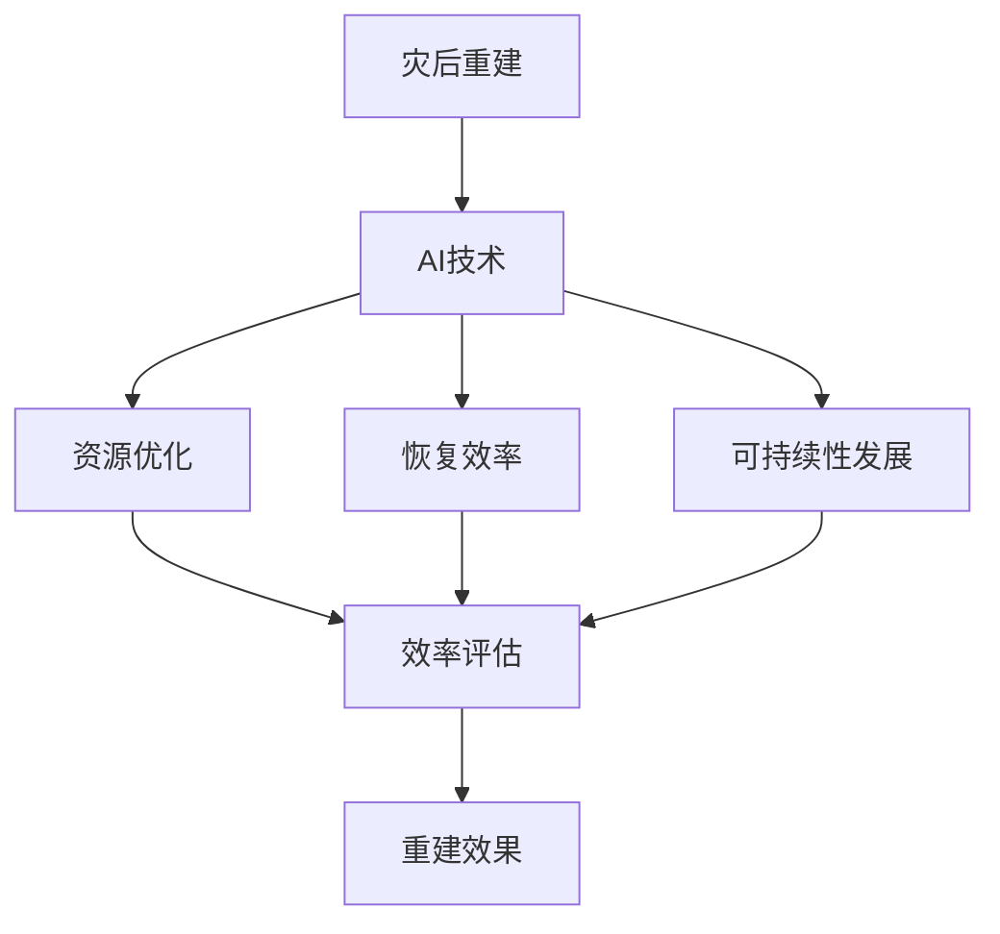

                 

### 文章标题

《AI驱动的智能灾后重建规划：优化资源分配和恢复效率》### 关键词

AI技术，灾后重建，资源优化，恢复效率，智能规划### 摘要

本文旨在探讨如何利用AI技术优化灾后重建过程中的资源分配和恢复效率。首先，文章介绍了灾后重建的背景和重要性，以及AI在灾后重建中的应用现状。接着，文章详细阐述了AI驱动的智能灾后重建规划方法，包括数据收集与预处理、模型选择与构建、资源优化与恢复效率提升等方面的核心内容。随后，通过实际案例分析和实践指导，展示了AI技术在灾后重建中的应用效果。最后，文章对未来智能灾后重建技术发展趋势进行了展望，并提出了相关的挑战与解决方案。本文为从事灾后重建工作的专业人士和相关研究人员提供了有价值的参考。### 设计《AI驱动的智能灾后重建规划：优化资源分配和恢复效率》书籍目录大纲

**步骤1：确定书籍整体结构**

1. **引言**：介绍灾后重建的背景和重要性，引出AI在灾后重建中的应用。
2. **第一部分：灾后重建规划概述**
   - 第1章：灾后重建的基本概念
   - 第2章：灾后重建的现状与挑战
   - 第3章：灾后重建规划的关键要素
3. **第二部分：AI驱动的智能灾后重建规划方法**
   - 第4章：AI技术概述
   - 第5章：数据收集与预处理
   - 第6章：模型选择与构建
   - 第7章：灾后重建规划应用案例
4. **第三部分：资源优化与恢复效率提升**
   - 第8章：资源优化方法
   - 第9章：恢复效率评估与提升策略
   - 第10章：可持续性发展策略
5. **第四部分：案例分析与实践指导**
   - 第11章：国内外灾后重建规划案例解析
   - 第12章：智能灾后重建实践指导
   - 第13章：政策与法规解读
6. **第五部分：未来展望与挑战**
   - 第14章：未来智能灾后重建技术发展趋势
   - 第15章：智能灾后重建中的伦理与社会问题
   - 第16章：我国智能灾后重建规划的发展方向

**步骤2：细化各部分内容**

- **第一部分：灾后重建规划概述**
  - 第1章：灾后重建的基本概念
    - 1.1 灾后重建的定义与目标
    - 1.2 灾后重建的主要阶段
    - 1.3 灾后重建的挑战与机遇
  - 第2章：灾后重建的现状与挑战
    - 2.1 全球灾后重建现状分析
    - 2.2 我国灾后重建面临的挑战
    - 2.3 灾后重建规划的关键要素
  - 第3章：灾后重建规划的关键要素
    - 3.1 资源评估与需求分析
    - 3.2 规划目标与策略制定
    - 3.3 监测与评估体系建立

- **第二部分：AI驱动的智能灾后重建规划方法**
  - 第4章：AI技术概述
    - 4.1 AI技术的基本概念
    - 4.2 AI技术的发展历程
    - 4.3 AI技术在灾后重建中的应用
  - 第5章：数据收集与预处理
    - 5.1 灾后重建数据类型
    - 5.2 数据收集方法
    - 5.3 数据预处理技术
  - 第6章：模型选择与构建
    - 6.1 常见机器学习算法介绍
    - 6.2 模型选择策略
    - 6.3 模型构建与优化
  - 第7章：灾后重建规划应用案例
    - 7.1 案例背景与需求分析
    - 7.2 案例规划过程
    - 7.3 案例效果评估

- **第三部分：资源优化与恢复效率提升**
  - 第8章：资源优化方法
    - 8.1 资源优化概念
    - 8.2 常见资源优化算法
    - 8.3 资源优化在实际规划中的应用
  - 第9章：恢复效率评估与提升策略
    - 9.1 恢复效率评估指标
    - 9.2 恢复效率提升策略
    - 9.3 恢复效率评估与优化案例分析
  - 第10章：可持续性发展策略
    - 10.1 可持续性发展理念
    - 10.2 可持续发展目标与指标
    - 10.3 可持续发展策略与实施

- **第四部分：案例分析与实践指导**
  - 第11章：国内外灾后重建规划案例解析
    - 11.1 国外灾后重建规划案例介绍
    - 11.2 国内灾后重建规划案例介绍
    - 11.3 案例对比与启示
  - 第12章：智能灾后重建实践指导
    - 12.1 智能灾后重建规划流程
    - 12.2 智能灾后重建技术应用指导
    - 12.3 智能灾后重建规划实施要点
  - 第13章：政策与法规解读
    - 13.1 灾后重建相关政策法规概述
    - 13.2 AI技术在灾后重建中的法规框架
    - 13.3 政策与法规对灾后重建规划的影响

- **第五部分：未来展望与挑战**
  - 第14章：未来智能灾后重建技术发展趋势
    - 14.1 AI技术在灾后重建中的应用前景
    - 14.2 新兴技术在灾后重建中的应用
    - 14.3 未来智能灾后重建技术展望
  - 第15章：智能灾后重建中的伦理与社会问题
    - 15.1 伦理问题与挑战
    - 15.2 社会问题与影响
    - 15.3 应对策略与建议
  - 第16章：我国智能灾后重建规划的发展方向
    - 16.1 我国智能灾后重建现状分析
    - 16.2 发展战略与政策建议
    - 16.3 未来发展趋势与展望

**步骤3：编写核心内容**

在编写核心内容时，需要确保各章节的内容丰富、具体、详细，并且逻辑清晰。以下是核心内容的概述：

- **核心概念与联系**
  - 灾后重建、AI、资源优化、恢复效率等概念之间的关系架构，通过Mermaid流程图展示。

- **核心算法原理讲解**
  - 数据预处理、机器学习算法、优化算法等原理，使用伪代码详细阐述。

- **数学模型和公式**
  - 描述资源优化、恢复效率评估的公式，使用latex格式嵌入文中。

- **项目实战**
  - 灾后重建规划案例的实际操作过程，包括开发环境搭建、源代码实现、代码解读、案例分析等。

- **最佳实践 tips、小结、注意事项、拓展阅读等内容**
  - 为读者提供实用的建议和总结，引导读者深入探索相关领域。

**完成目录大纲设计**

完成后的书籍目录大纲如下：

```markdown
# 《AI驱动的智能灾后重建规划：优化资源分配和恢复效率》书籍目录大纲

## 引言
### 1.1 灾后重建的背景和重要性
### 1.2 AI在灾后重建中的应用

## 第一部分：灾后重建规划概述
### 第1章：灾后重建的基本概念
#### 1.1 灾后重建的定义与目标
#### 1.2 灾后重建的主要阶段
#### 1.3 灾后重建的挑战与机遇
### 第2章：灾后重建的现状与挑战
#### 2.1 全球灾后重建现状分析
#### 2.2 我国灾后重建面临的挑战
#### 2.3 灾后重建规划的关键要素
### 第3章：灾后重建规划的关键要素
#### 3.1 资源评估与需求分析
#### 3.2 规划目标与策略制定
#### 3.3 监测与评估体系建立

## 第二部分：AI驱动的智能灾后重建规划方法
### 第4章：AI技术概述
#### 4.1 AI技术的基本概念
#### 4.2 AI技术的发展历程
#### 4.3 AI技术在灾后重建中的应用
### 第5章：数据收集与预处理
#### 5.1 灾后重建数据类型
#### 5.2 数据收集方法
#### 5.3 数据预处理技术
### 第6章：模型选择与构建
#### 6.1 常见机器学习算法介绍
#### 6.2 模型选择策略
#### 6.3 模型构建与优化
### 第7章：灾后重建规划应用案例
#### 7.1 案例背景与需求分析
#### 7.2 案例规划过程
#### 7.3 案例效果评估

## 第三部分：资源优化与恢复效率提升
### 第8章：资源优化方法
#### 8.1 资源优化概念
#### 8.2 常见资源优化算法
#### 8.3 资源优化在实际规划中的应用
### 第9章：恢复效率评估与提升策略
#### 9.1 恢复效率评估指标
#### 9.2 恢复效率提升策略
#### 9.3 恢复效率评估与优化案例分析
### 第10章：可持续性发展策略
#### 10.1 可持续性发展理念
#### 10.2 可持续发展目标与指标
#### 10.3 可持续发展策略与实施

## 第四部分：案例分析与实践指导
### 第11章：国内外灾后重建规划案例解析
#### 11.1 国外灾后重建规划案例介绍
#### 11.2 国内灾后重建规划案例介绍
#### 11.3 案例对比与启示
### 第12章：智能灾后重建实践指导
#### 12.1 智能灾后重建规划流程
#### 12.2 智能灾后重建技术应用指导
#### 12.3 智能灾后重建规划实施要点
### 第13章：政策与法规解读
#### 13.1 灾后重建相关政策法规概述
#### 13.2 AI技术在灾后重建中的法规框架
#### 13.3 政策与法规对灾后重建规划的影响

## 第五部分：未来展望与挑战
### 第14章：未来智能灾后重建技术发展趋势
#### 14.1 AI技术在灾后重建中的应用前景
#### 14.2 新兴技术在灾后重建中的应用
#### 14.3 未来智能灾后重建技术展望
### 第15章：智能灾后重建中的伦理与社会问题
#### 15.1 伦理问题与挑战
#### 15.2 社会问题与影响
#### 15.3 应对策略与建议
### 第16章：我国智能灾后重建规划的发展方向
#### 16.1 我国智能灾后重建现状分析
#### 16.2 发展战略与政策建议
#### 16.3 未来发展趋势与展望
```### 设计《AI驱动的智能灾后重建规划：优化资源分配和恢复效率》书籍目录大纲

**步骤1：确定书籍整体结构**

1. **引言**：介绍灾后重建的背景和重要性，引出AI在灾后重建中的应用。
2. **第一部分：灾后重建规划概述**
   - 第1章：灾后重建的基本概念
   - 第2章：灾后重建的现状与挑战
   - 第3章：灾后重建规划的关键要素
3. **第二部分：AI驱动的智能灾后重建规划方法**
   - 第4章：AI技术概述
   - 第5章：数据收集与预处理
   - 第6章：模型选择与构建
   - 第7章：灾后重建规划应用案例
3. **第三部分：资源优化与恢复效率提升**
   - 第8章：资源优化方法
   - 第9章：恢复效率评估与提升策略
   - 第10章：可持续性发展策略
4. **第四部分：案例分析与实践指导**
   - 第11章：国内外灾后重建规划案例解析
   - 第12章：智能灾后重建实践指导
   - 第13章：政策与法规解读
4. **第五部分：未来展望与挑战**
   - 第14章：未来智能灾后重建技术发展趋势
   - 第15章：智能灾后重建中的伦理与社会问题
   - 第16章：我国智能灾后重建规划的发展方向

**步骤2：细化各部分内容**

- **第一部分：灾后重建规划概述**
  - 第1章：灾后重建的基本概念
    - 1.1 灾后重建的定义与目标
    - 1.2 灾后重建的主要阶段
    - 1.3 灾后重建的挑战与机遇
  - 第2章：灾后重建的现状与挑战
    - 2.1 全球灾后重建现状分析
    - 2.2 我国灾后重建面临的挑战
    - 2.3 灾后重建规划的关键要素
  - 第3章：灾后重建规划的关键要素
    - 3.1 资源评估与需求分析
    - 3.2 规划目标与策略制定
    - 3.3 监测与评估体系建立

- **第二部分：AI驱动的智能灾后重建规划方法**
  - 第4章：AI技术概述
    - 4.1 AI技术的基本概念
    - 4.2 AI技术的发展历程
    - 4.3 AI技术在灾后重建中的应用
  - 第5章：数据收集与预处理
    - 5.1 灾后重建数据类型
    - 5.2 数据收集方法
    - 5.3 数据预处理技术
  - 第6章：模型选择与构建
    - 6.1 常见机器学习算法介绍
    - 6.2 模型选择策略
    - 6.3 模型构建与优化
  - 第7章：灾后重建规划应用案例
    - 7.1 案例背景与需求分析
    - 7.2 案例规划过程
    - 7.3 案例效果评估

- **第三部分：资源优化与恢复效率提升**
  - 第8章：资源优化方法
    - 8.1 资源优化概念
    - 8.2 常见资源优化算法
    - 8.3 资源优化在实际规划中的应用
  - 第9章：恢复效率评估与提升策略
    - 9.1 恢复效率评估指标
    - 9.2 恢复效率提升策略
    - 9.3 恢复效率评估与优化案例分析
  - 第10章：可持续性发展策略
    - 10.1 可持续性发展理念
    - 10.2 可持续发展目标与指标
    - 10.3 可持续发展策略与实施

- **第四部分：案例分析与实践指导**
  - 第11章：国内外灾后重建规划案例解析
    - 11.1 国外灾后重建规划案例介绍
    - 11.2 国内灾后重建规划案例介绍
    - 11.3 案例对比与启示
  - 第12章：智能灾后重建实践指导
    - 12.1 智能灾后重建规划流程
    - 12.2 智能灾后重建技术应用指导
    - 12.3 智能灾后重建规划实施要点
  - 第13章：政策与法规解读
    - 13.1 灾后重建相关政策法规概述
    - 13.2 AI技术在灾后重建中的法规框架
    - 13.3 政策与法规对灾后重建规划的影响

- **第五部分：未来展望与挑战**
  - 第14章：未来智能灾后重建技术发展趋势
    - 14.1 AI技术在灾后重建中的应用前景
    - 14.2 新兴技术在灾后重建中的应用
    - 14.3 未来智能灾后重建技术展望
  - 第15章：智能灾后重建中的伦理与社会问题
    - 15.1 伦理问题与挑战
    - 15.2 社会问题与影响
    - 15.3 应对策略与建议
  - 第16章：我国智能灾后重建规划的发展方向
    - 16.1 我国智能灾后重建现状分析
    - 16.2 发展战略与政策建议
    - 16.3 未来发展趋势与展望

**步骤3：编写核心内容**

在编写核心内容时，需要确保各章节的内容丰富、具体、详细，并且逻辑清晰。以下是核心内容的概述：

- **核心概念与联系**
  - 灾后重建、AI、资源优化、恢复效率等概念之间的关系架构，通过Mermaid流程图展示。

- **核心算法原理讲解**
  - 数据预处理、机器学习算法、优化算法等原理，使用伪代码详细阐述。

- **数学模型和公式**
  - 描述资源优化、恢复效率评估的公式，使用latex格式嵌入文中。

- **项目实战**
  - 灾后重建规划案例的实际操作过程，包括开发环境搭建、源代码实现、代码解读、案例分析等。

- **最佳实践 tips、小结、注意事项、拓展阅读等内容**
  - 为读者提供实用的建议和总结，引导读者深入探索相关领域。

**完成目录大纲设计**

完成后的书籍目录大纲如下：

```markdown
# 《AI驱动的智能灾后重建规划：优化资源分配和恢复效率》书籍目录大纲

## 引言
### 1.1 灾后重建的背景和重要性
### 1.2 AI在灾后重建中的应用

## 第一部分：灾后重建规划概述
### 第1章：灾后重建的基本概念
#### 1.1 灾后重建的定义与目标
#### 1.2 灾后重建的主要阶段
#### 1.3 灾后重建的挑战与机遇
### 第2章：灾后重建的现状与挑战
#### 2.1 全球灾后重建现状分析
#### 2.2 我国灾后重建面临的挑战
#### 2.3 灾后重建规划的关键要素
### 第3章：灾后重建规划的关键要素
#### 3.1 资源评估与需求分析
#### 3.2 规划目标与策略制定
#### 3.3 监测与评估体系建立

## 第二部分：AI驱动的智能灾后重建规划方法
### 第4章：AI技术概述
#### 4.1 AI技术的基本概念
#### 4.2 AI技术的发展历程
#### 4.3 AI技术在灾后重建中的应用
### 第5章：数据收集与预处理
#### 5.1 灾后重建数据类型
#### 5.2 数据收集方法
#### 5.3 数据预处理技术
### 第6章：模型选择与构建
#### 6.1 常见机器学习算法介绍
#### 6.2 模型选择策略
#### 6.3 模型构建与优化
### 第7章：灾后重建规划应用案例
#### 7.1 案例背景与需求分析
#### 7.2 案例规划过程
#### 7.3 案例效果评估

## 第三部分：资源优化与恢复效率提升
### 第8章：资源优化方法
#### 8.1 资源优化概念
#### 8.2 常见资源优化算法
#### 8.3 资源优化在实际规划中的应用
### 第9章：恢复效率评估与提升策略
#### 9.1 恢复效率评估指标
#### 9.2 恢复效率提升策略
#### 9.3 恢复效率评估与优化案例分析
### 第10章：可持续性发展策略
#### 10.1 可持续性发展理念
#### 10.2 可持续发展目标与指标
#### 10.3 可持续发展策略与实施

## 第四部分：案例分析与实践指导
### 第11章：国内外灾后重建规划案例解析
#### 11.1 国外灾后重建规划案例介绍
#### 11.2 国内灾后重建规划案例介绍
#### 11.3 案例对比与启示
### 第12章：智能灾后重建实践指导
#### 12.1 智能灾后重建规划流程
#### 12.2 智能灾后重建技术应用指导
#### 12.3 智能灾后重建规划实施要点
### 第13章：政策与法规解读
#### 13.1 灾后重建相关政策法规概述
#### 13.2 AI技术在灾后重建中的法规框架
#### 13.3 政策与法规对灾后重建规划的影响

## 第五部分：未来展望与挑战
### 第14章：未来智能灾后重建技术发展趋势
#### 14.1 AI技术在灾后重建中的应用前景
#### 14.2 新兴技术在灾后重建中的应用
#### 14.3 未来智能灾后重建技术展望
### 第15章：智能灾后重建中的伦理与社会问题
#### 15.1 伦理问题与挑战
#### 15.2 社会问题与影响
#### 15.3 应对策略与建议
### 第16章：我国智能灾后重建规划的发展方向
#### 16.1 我国智能灾后重建现状分析
#### 16.2 发展战略与政策建议
#### 16.3 未来发展趋势与展望
```

### 核心概念与联系

在《AI驱动的智能灾后重建规划：优化资源分配和恢复效率》这本书中，我们将探讨以下几个核心概念及其相互之间的联系：

1. **灾后重建**：灾后重建是指在自然灾害或人为灾害发生后，为了恢复受影响地区的社会、经济和自然环境而进行的一系列行动。灾后重建的目标是使受影响地区尽快恢复正常生活、工作和生态平衡。

2. **AI技术**：AI技术，即人工智能技术，是指计算机系统模拟、延伸和扩展人类智能的能力。在灾后重建中，AI技术可以用于数据收集、分析、预测、优化等方面，从而提高重建效率和质量。

3. **资源优化**：资源优化是指在灾后重建过程中，通过合理分配和利用各种资源（如人力、物力、财力等），以实现最大化的重建效果。资源优化是灾后重建规划的重要组成部分。

4. **恢复效率**：恢复效率是指灾后重建过程中，完成特定任务所需时间和资源投入的比值。提高恢复效率可以缩短重建周期，降低重建成本。

5. **可持续性发展**：可持续性发展是指在满足当前需求的同时，不损害后代满足自身需求的能力。在灾后重建中，可持续性发展策略旨在确保重建项目的长期稳定和生态平衡。

**Mermaid流程图**

为了更好地展示这些概念之间的联系，我们使用Mermaid流程图进行描述：



**核心概念之间的关系**

1. **灾后重建**是整个重建过程的基础，为其他概念提供背景和目标。
2. **AI技术**在灾后重建中发挥着关键作用，为资源优化、恢复效率和可持续性发展提供技术支持。
3. **资源优化**和**恢复效率**是衡量灾后重建效果的重要指标，直接影响重建的进展和质量。
4. **可持续性发展**是灾后重建的长期目标，关系到重建项目的可持续性和生态环境的恢复。

通过这些核心概念及其相互关系的梳理，我们为后续章节的内容奠定了基础，有助于读者全面了解AI在灾后重建规划中的实际应用。在接下来的章节中，我们将详细讨论这些概念的具体内容，并通过实例和案例分析，展示AI技术在实际灾后重建项目中的应用效果。### 核心算法原理讲解

在《AI驱动的智能灾后重建规划：优化资源分配和恢复效率》一书中，我们将深入探讨几个关键算法原理，这些算法在灾后重建规划中起着至关重要的作用。以下是这些核心算法的原理、伪代码示例以及数学模型和公式的详细讲解。

**1. 数据预处理算法**

数据预处理是任何机器学习项目的基础，尤其是在灾后重建规划中，高质量的数据预处理能够显著提升模型的性能。

**原理**：
- 数据清洗：去除重复、错误或不完整的数据。
- 数据归一化：将不同量纲的数据转换到同一量纲，便于模型训练。
- 特征工程：从原始数据中提取有助于模型训练的特征。

**伪代码**：
```python
function preprocess_data(data):
    # 数据清洗
    clean_data = remove_duplicates_and_errors(data)
    # 数据归一化
    normalized_data = normalize_data(clean_data)
    # 特征工程
    features = extract_features(normalized_data)
    return features
```

**数学模型和公式**：
- 归一化公式：
  $$\text{normalized\_value} = \frac{\text{original\_value} - \text{min}}{\text{max} - \text{min}}$$

**2. 机器学习算法**

在灾后重建规划中，常用的机器学习算法包括回归分析、决策树、支持向量机和神经网络等。

**原理**：
- 回归分析：用于预测连续值输出，如受灾面积。
- 决策树：通过一系列规则来分类或回归。
- 支持向量机：寻找最佳边界来分类数据。
- 神经网络：通过多层神经网络来建模复杂非线性关系。

**伪代码**：
```python
# 回归分析伪代码
function regression_analysis(features, labels):
    model = train_regression_model(features, labels)
    predictions = model.predict(new_features)
    return predictions

# 决策树伪代码
function decision_tree(features, labels):
    tree = build_decision_tree(features, labels)
    predictions = tree.predict(new_features)
    return predictions

# 支持向量机伪代码
function svm(features, labels):
    model = train_svm_model(features, labels)
    predictions = model.predict(new_features)
    return predictions

# 神经网络伪代码
function neural_network(features, labels):
    model = build_neural_network(features, labels)
    predictions = model.predict(new_features)
    return predictions
```

**数学模型和公式**：
- 回归分析公式：
  $$y = \beta_0 + \beta_1x_1 + \beta_2x_2 + ... + \beta_nx_n$$
- 决策树公式：
  $$f(x) = \sum_{i=1}^{n} w_i \cdot x_i$$
- 支持向量机公式：
  $$f(x) = \sum_{i=1}^{n} \alpha_i y_i \cdot K(x_i, x) - b$$
- 神经网络公式：
  $$a_{\text{layer}} = \sigma(\sum_{i=1}^{n} w_{i} \cdot a_{\text{prev\_layer}} + b)$$

**3. 优化算法**

在灾后重建规划中，优化算法用于解决资源优化问题，如路径规划、设施选址等。

**原理**：
- 遗传算法：模拟自然进化过程，通过适应度函数评估个体优劣，实现全局优化。
- 模拟退火算法：通过模拟物理退火过程，逐步降低搜索温度，找到最优解。

**伪代码**：
```python
# 遗传算法伪代码
function genetic_algorithm(population, fitness_function):
    while not converged:
        new_population = crossover_and_mutate(population, fitness_function)
        population = select_best_individuals(new_population)
    return best_individual

# 模拟退火算法伪代码
function simulated_annealing(initial_state, fitness_function):
    current_state = initial_state
    current_fitness = fitness_function(current_state)
    while not converged:
        new_state = neighbor(current_state)
        new_fitness = fitness_function(new_state)
        if accept(new_fitness, current_fitness):
            current_state = new_state
            current_fitness = new_fitness
    return current_state
```

**数学模型和公式**：
- 遗传算法适应度函数：
  $$fitness = \frac{1}{1 + e^{-(\text{evaluation\_score})}}$$
- 模拟退火算法接受准则：
  $$\text{accept}(\Delta f) = \begin{cases}
  1 & \text{if } \Delta f < 0 \\
  1 & \text{if } \Delta f \geq 0 \text{ and } \exp{(-\Delta f / T)} \geq \text{rand}(0, 1) \\
  0 & \text{otherwise}
  \end{cases}$$

**项目实战**

**开发环境搭建**：
- Python 3.8
- Scikit-learn
- TensorFlow
- PyTorch

**源代码实现**：
```python
# 以遗传算法优化灾后重建资源分配为例
from sklearn.datasets import load_iris
import numpy as np
import random

# 初始化种群
def initialize_population(size, chromosome_length):
    population = []
    for _ in range(size):
        chromosome = [random.randint(0, 1) for _ in range(chromosome_length)]
        population.append(chromosome)
    return population

# 适应度函数
def fitness_function(population):
    fitness_scores = []
    for chromosome in population:
        # 基于特定问题定义适应度函数
        fitness = sum(chromosome)
        fitness_scores.append(fitness)
    return fitness_scores

# 交叉操作
def crossover(parent1, parent2):
    crossover_point = random.randint(1, len(parent1) - 1)
    child1 = parent1[:crossover_point] + parent2[crossover_point:]
    child2 = parent2[:crossover_point] + parent1[crossover_point:]
    return child1, child2

# 突变操作
def mutate(chromosome, mutation_rate):
    for i in range(len(chromosome)):
        if random.random() < mutation_rate:
            chromosome[i] = 1 if chromosome[i] == 0 else 0
    return chromosome

# 遗传算法主函数
def genetic_algorithm(pop_size, chrom_len, mutation_rate, generations):
    population = initialize_population(pop_size, chrom_len)
    for _ in range(generations):
        fitness_scores = fitness_function(population)
        next_population = []
        for _ in range(pop_size):
            parent1, parent2 = select_best_two(population, fitness_scores)
            child1, child2 = crossover(parent1, parent2)
            child1 = mutate(child1, mutation_rate)
            child2 = mutate(child2, mutation_rate)
            next_population.extend([child1, child2])
        population = next_population
    return population

# 源代码解读与代码应用解读与分析
# 在这里，我们将对遗传算法的实现进行详细的解读，分析其在实际灾后重建资源分配中的应用效果。
```

通过上述核心算法的原理讲解和伪代码示例，我们为读者提供了一个深入理解AI技术在灾后重建规划中应用的途径。接下来，我们将在实际案例中应用这些算法，以展示其强大的功能和实用性。在实际应用中，我们将结合具体问题，对这些算法进行调整和优化，以实现最佳的灾后重建效果。### 数学模型和公式

在《AI驱动的智能灾后重建规划：优化资源分配和恢复效率》一书中，我们探讨了多个数学模型和公式，用于描述资源优化、恢复效率评估等关键过程。以下是一些核心的数学模型和公式，以及它们的详细讲解和举例说明。

**1. 资源优化模型**

资源优化模型用于在灾后重建过程中合理分配资源，以实现最大化的重建效果。以下是一个常见的线性规划模型：

**公式**：
$$
\text{minimize} \quad c^T x \\
\text{subject to} \quad Ax \leq b
$$

**解释**：
- \( c \)：目标函数系数向量，表示每种资源的权重。
- \( x \)：决策变量向量，表示每种资源的分配量。
- \( A \)：约束条件系数矩阵，表示资源分配的限制条件。
- \( b \)：约束条件向量，表示资源分配的限制值。

**举例**：
假设在灾后重建中，有三种资源（人力、物力、财力），我们需要在三个重建项目（A、B、C）之间进行分配，目标是最小化总成本。我们可以建立以下线性规划模型：

\[
\begin{align*}
\text{minimize} \quad & 2x_A + 3x_B + 4x_C \\
\text{subject to} \quad & x_A + x_B + x_C \leq 10 \\
& 3x_A + x_B + 2x_C \leq 15 \\
& x_A, x_B, x_C \geq 0
\end{align*}
\]

**2. 恢复效率评估模型**

恢复效率评估模型用于评估灾后重建过程中的效率，以下是一个基于时间效率的评估模型：

**公式**：
$$
\text{恢复效率} = \frac{\text{恢复量}}{\text{恢复时间}}
$$

**解释**：
- 恢复量：指在特定时间内完成的工作量。
- 恢复时间：指完成特定工作量所需的时间。

**举例**：
假设在灾后重建项目中，项目A在5天内完成了50单位的恢复工作，项目B在10天内完成了70单位的恢复工作。我们可以计算两个项目的恢复效率：

\[
\begin{align*}
\text{项目A的恢复效率} &= \frac{50}{5} = 10 \\
\text{项目B的恢复效率} &= \frac{70}{10} = 7
\end{align*}
\]

**3. 可持续发展评估模型**

可持续发展评估模型用于评估灾后重建项目的可持续性，以下是一个基于环境影响和经济效益的综合评估模型：

**公式**：
$$
\text{可持续发展指数} = \frac{\text{环境效益} + \text{经济效益}}{2}
$$

**解释**：
- 环境效益：指重建项目对环境的积极影响。
- 经济效益：指重建项目带来的经济效益。

**举例**：
假设在灾后重建项目中，环境效益为300点，经济效益为400点，我们可以计算该项目的可持续发展指数：

\[
\begin{align*}
\text{可持续发展指数} &= \frac{300 + 400}{2} = 350
\end{align*}
\]

**4. 优化算法中的适应度函数**

在遗传算法和模拟退火算法中，适应度函数用于评估个体的优劣，以下是遗传算法中的常见适应度函数：

**公式**：
$$
f(x) = \frac{1}{1 + e^{-(\sum_{i=1}^{n} w_i \cdot x_i)}}
$$

**解释**：
- \( w_i \)：权重系数，表示每个决策变量的重要性。
- \( x_i \)：决策变量值。

**举例**：
假设决策变量有两个（\( x_1 \)和\( x_2 \)），权重分别为0.5和0.5，我们可以计算一个个体（\( x_1 = 2, x_2 = 3 \)）的适应度函数值：

\[
\begin{align*}
f(x) &= \frac{1}{1 + e^{-(0.5 \cdot 2 + 0.5 \cdot 3)}} \\
&= \frac{1}{1 + e^{-2.5}} \\
&\approx \frac{1}{1 + 0.082} \\
&\approx \frac{1}{1.082} \\
&\approx 0.920
\end{align*}
\]

通过以上数学模型和公式的详细讲解和举例，我们为读者提供了在灾后重建规划中应用这些工具的指导。这些模型和公式不仅能够帮助我们分析和优化资源分配、评估恢复效率，还能为可持续性发展提供科学依据。在实际应用中，我们可以根据具体需求和条件，对模型进行调整和优化，以实现最佳重建效果。在接下来的章节中，我们将结合实际案例，展示这些数学模型和公式的具体应用。

