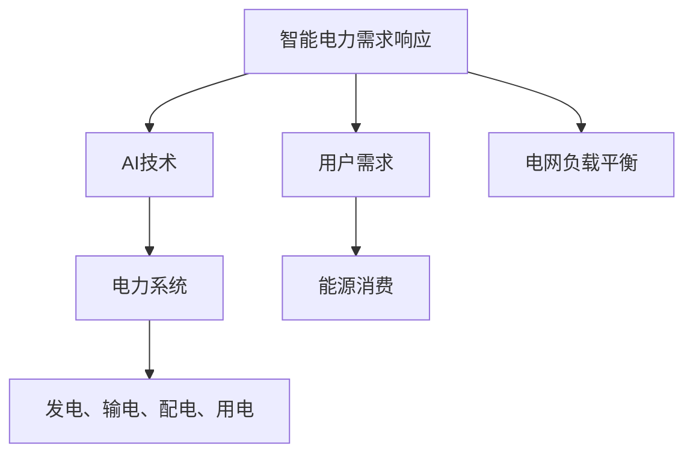

                 

### 引言

#### 1.1 核心概念与联系

##### 智能电力需求响应
智能电力需求响应是一种通过利用人工智能（AI）技术来优化电力系统的运行和管理，以实现电网负载平衡和用户需求满足的机制。它涉及智能电网、分布式能源资源、电力市场等多个领域，旨在提高电网的效率和可靠性。

##### 人工智能
人工智能是计算机科学的一个分支，专注于开发能够模拟、延伸和扩展人类智能的技术和系统。AI技术在电力需求响应中发挥着核心作用，通过机器学习、深度学习等算法，对大量数据进行处理和分析，以实现智能化决策和优化。

##### 电力系统
电力系统是一个复杂的网络，负责将发电、输电、配电和用电等环节有机结合，为用户提供稳定的电力供应。智能电力需求响应旨在通过AI技术，使电力系统能够更加灵活、高效地应对各种需求和挑战。

##### 关键联系
智能电力需求响应的运作离不开AI技术和电力系统的有机结合。AI技术通过分析电力系统的数据和运行状态，提供智能化的需求预测、负荷管理和优化策略，从而实现电网负载平衡和用户需求满足。以下Mermaid流程图展示了这些核心概念之间的联系：



通过这张流程图，我们可以清晰地看到智能电力需求响应涉及的主要要素及其相互关系。智能电力需求响应不仅仅是AI技术在电力系统的应用，更是一个跨学科、多领域的综合解决方案，旨在通过技术创新，推动电力行业的智能化和可持续发展。

#### 1.2 电力需求响应的历史与发展

电力需求响应的历史可以追溯到上世纪70年代，当时主要目的是应对电力短缺和高峰负荷问题。最早的电力需求响应措施主要依赖于人工控制和调度，通过直接干预用户的用电行为，如工业企业的用电高峰转移、商业建筑的空调温度调节等，来减轻电网的负荷压力。

随着计算机技术和通信技术的发展，电力需求响应逐渐走向智能化。20世纪90年代，随着电力市场的形成和智能电网的初步建设，电力需求响应进入了一个新的阶段。智能电网的建设为需求响应提供了技术基础，通过实时监测、数据分析和自动化控制，实现了对电网运行状态的实时反馈和优化调度。

进入21世纪，人工智能技术的迅猛发展进一步推动了电力需求响应的智能化。AI技术，特别是机器学习和深度学习算法，能够从大量历史数据和实时数据中挖掘出有价值的信息，进行负荷预测、需求分析、优化策略等，从而实现更加精准和高效的电力需求响应。

在当前的发展阶段，AI驱动的智能电力需求响应已经成为电力系统优化和管理的重要手段。通过AI技术，电力系统能够更加灵活地应对各种需求和挑战，实现电网的稳定运行和高效利用。

具体而言，AI技术在电力需求响应中的应用主要表现在以下几个方面：

1. **负荷预测**：利用机器学习算法，对历史负荷数据进行分析和建模，预测未来的负荷趋势，为电网调度提供依据。
2. **需求分析**：通过对用户用电行为和需求模式的分析，识别出用户的特殊需求，为个性化服务提供支持。
3. **优化策略**：通过深度学习等算法，制定最优的负荷管理策略，实现电网负载的平衡和优化。
4. **实时监控**：利用实时数据分析和智能监控技术，实现对电网运行状态的动态监控和快速响应。

总之，电力需求响应从最初的人工控制，到今天的智能化、自动化，经历了巨大的发展和演变。AI技术的引入，使得电力需求响应不仅更加精准和高效，而且具有了更强的预测和自适应能力，为电力系统的可持续发展提供了强大的技术支撑。

#### 1.3 AI在电力需求响应中的应用

AI技术在电力需求响应中扮演着至关重要的角色，其应用范围涵盖了从负荷预测到优化策略的各个层面。以下是AI技术在电力需求响应中的一些关键应用：

1. **负荷预测**：负荷预测是智能电力需求响应的重要基础。通过机器学习算法，可以对历史负荷数据进行分析和建模，预测未来的负荷趋势。具体步骤如下：
   - **数据收集**：收集过去多年的电力负荷数据，包括日负荷、月负荷、季节负荷等。
   - **特征提取**：从数据中提取影响负荷的关键特征，如气温、湿度、节假日、经济活动等。
   - **模型训练**：使用机器学习算法，如线性回归、决策树、随机森林等，对数据进行训练，建立负荷预测模型。
   - **模型评估**：通过交叉验证和测试集评估模型的预测精度，调整模型参数，优化模型性能。

2. **需求分析**：需求分析旨在理解用户的不同需求，为个性化服务提供支持。通过深度学习算法，可以分析用户的用电行为和需求模式，识别出用户的特点和偏好。具体步骤如下：
   - **用户行为数据收集**：收集用户的用电数据，包括用电时间、用电量、用电设备类型等。
   - **行为特征提取**：从数据中提取行为特征，如高频用电时段、用电峰值、设备使用频率等。
   - **模式识别**：使用深度学习算法，如神经网络、卷积神经网络（CNN）、递归神经网络（RNN）等，对行为特征进行分析，识别出用户的需求模式。
   - **个性化推荐**：根据识别出的需求模式，为用户提供个性化的用电建议和服务，如最佳用电时间、节能措施等。

3. **优化策略**：优化策略是通过AI技术制定最优的负荷管理策略，实现电网负载的平衡和优化。具体步骤如下：
   - **目标函数定义**：明确优化目标，如最小化能源成本、最大化电网可靠性、最小化峰谷差等。
   - **约束条件设定**：根据电力系统的运行规则和需求，设定约束条件，如电压稳定性、频率范围、设备容量等。
   - **优化算法选择**：选择合适的优化算法，如线性规划、非线性规划、遗传算法、深度强化学习等。
   - **策略模拟与优化**：使用选定的算法，对负荷管理策略进行模拟和优化，评估不同策略的可行性和效果，选择最优策略。

4. **实时监控**：实时监控是确保电力系统稳定运行的关键。通过实时数据分析和智能监控技术，可以实现对电网运行状态的动态监控和快速响应。具体步骤如下：
   - **数据采集**：采集电网的实时数据，包括电压、电流、频率、温度等。
   - **实时分析**：使用实时分析技术，对采集到的数据进行分析，识别出潜在的故障或异常情况。
   - **预警与响应**：根据分析结果，实时发出预警，并启动相应的应对措施，如调整负载、启用备用设备等。

综上所述，AI技术在电力需求响应中的应用，不仅提升了电力系统的预测和优化能力，也为实现电网的高效运行和可持续发展提供了强大的技术支撑。通过这些关键应用，电力系统能够更加灵活地应对各种需求和挑战，为用户和社会带来更多的价值。

### 智能电力系统的基本概念

智能电力系统是现代电力行业发展的关键方向，它融合了信息通信技术、人工智能、自动化技术等多领域的前沿技术，旨在实现电力系统的智能化、自动化和高效运行。智能电力系统的构建不仅能够提高电网的运行效率和可靠性，还能优化能源资源配置，满足不断增长的电力需求。

#### 2.1 智能电网的定义与结构

智能电网（Smart Grid）是智能电力系统的核心组成部分，它通过将先进的通信技术、传感技术、计算机技术和电力电子技术深度融合，实现电网的全面智能化。智能电网不仅包括传统的发电、输电、配电和用电环节，还引入了用户侧的设备和管理系统，形成了一个高度集成、互动和自主控制的电网系统。

智能电网的基本结构主要包括以下几个关键组成部分：

1. **发电侧**：包括传统的化石燃料发电站、可再生能源发电站（如风能、太阳能）以及分布式发电设备。智能电网通过先进的控制和通信技术，实现发电设备的自动化调度和优化运行。

2. **输电侧**：输电网络是智能电网的骨干，通过高压、超高压输电线路将电力从发电侧传输到配电侧。智能电网在输电侧引入了大量的传感器和智能设备，实现对输电线路的实时监控和故障预警。

3. **配电侧**：配电网络是智能电网的末梢，通过中低压配电线路将电力分配到用户端。智能电网在配电侧实现了自动化控制和分布式管理，提高了配电网络的可靠性和灵活性。

4. **用户侧**：用户侧包括家庭、商业和工业用户，通过智能电表、智能家居设备等实现了用户与电网的互动。智能电网在用户侧提供了更加便捷的用电服务，如实时电费查询、远程控制家电等。

5. **通信网络**：智能电网依赖于高速、稳定的通信网络，实现各部分之间的数据交换和协同控制。常用的通信技术包括光纤通信、无线通信等。

6. **智能控制中心**：智能控制中心是智能电网的大脑，通过先进的数据处理和智能分析技术，实现对电网运行状态的实时监控、预测和调度。

#### 2.2 智能电网的关键技术

智能电网的建设离不开一系列关键技术的支持，以下是一些核心技术：

1. **智能传感器技术**：智能传感器用于实时监测电网的各种参数，如电压、电流、温度、频率等，为智能控制和调度提供基础数据。

2. **通信技术**：高速、稳定的通信网络是实现智能电网信息交换和协同控制的关键。常用的通信技术包括光纤通信、无线通信、广域网（WAN）和局域网（LAN）等。

3. **数据管理与分析技术**：智能电网产生了大量的数据，通过数据管理与分析技术，能够有效地处理、存储和分析这些数据，提取有价值的信息，支持智能决策和优化。

4. **自动化控制技术**：智能电网通过自动化控制技术，实现了电网设备的智能调度和管理，提高了电网的运行效率和可靠性。

5. **分布式能源管理技术**：分布式能源管理技术用于协调和管理分布式发电设备和能源资源，实现能量的高效利用和优化配置。

6. **需求响应技术**：需求响应技术通过激励用户参与电网调度，优化电力消费行为，实现电网的供需平衡。

#### 2.3 智能电网的挑战与机遇

尽管智能电网具有诸多优点，但在其建设过程中也面临着一系列挑战和机遇：

1. **挑战**：
   - **技术复杂性**：智能电网融合了多种技术，技术复杂性高，对研发和运维提出了更高的要求。
   - **信息安全**：智能电网的开放性和互联性增加了信息安全风险，需要采取有效的安全措施保护电网的安全运行。
   - **成本高**：智能电网的建设和改造需要大量投资，初始成本较高。
   - **标准化**：智能电网的技术和标准尚未完全统一，需要制定和推广符合国际标准的智能电网技术规范。

2. **机遇**：
   - **能源转型**：智能电网为实现能源结构转型提供了技术支持，推动了清洁能源的广泛应用。
   - **市场拓展**：智能电网带来了新的商业模式和业务机会，如分布式能源管理、能源交易市场等。
   - **效率提升**：智能电网提高了电力系统的运行效率和资源利用率，降低了能源浪费。
   - **用户体验**：智能电网为用户提供更加便捷、个性化的用电服务，提升了用户体验。

综上所述，智能电网作为智能电力系统的核心，其在建设过程中既面临挑战，也充满机遇。通过克服技术、安全和成本等方面的挑战，智能电网将为电力行业的可持续发展提供强有力的技术支撑。

#### 2.4 分布式能源资源

分布式能源资源（Distributed Energy Resources，DERs）是指在电网边缘或用户侧安装的小型、分散的能源生产设备，如太阳能光伏系统、风力发电设备、燃料电池、储能系统等。这些能源资源因其灵活性和可扩展性，正逐渐成为智能电力系统的重要组成部分。

#### 2.4.1 分布式能源资源的类型

分布式能源资源主要包括以下几种类型：

1. **太阳能光伏系统**：利用太阳能电池将太阳光直接转换为电能，广泛应用于家庭、商业和工业用户。
2. **风力发电设备**：通过风力驱动风力涡轮机产生电能，适用于风力资源丰富的地区。
3. **燃料电池**：通过化学反应将氢气、天然气等燃料转化为电能，适用于需要长期稳定供电的场合。
4. **储能系统**：包括电池储能、飞轮储能、超级电容器等，用于储存电能，提供负载平衡、频率调节和紧急供电等功能。
5. **微网**：由分布式能源资源和电力负荷组成的独立电力系统，可以与主电网并网运行，也可以独立运行。

#### 2.4.2 分布式能源资源的特点

分布式能源资源具有以下几个显著特点：

1. **灵活性**：分布式能源资源可以灵活地部署在电网的各个节点，根据需求和资源条件进行优化配置。
2. **可扩展性**：分布式能源资源可以根据需要快速扩展，增加或减少产能，以适应电力需求的变化。
3. **可靠性**：分布式能源资源具有分散性，即使在部分设备出现故障时，整个系统的供电仍然可以保持稳定。
4. **环保性**：大多数分布式能源资源（如太阳能、风能等）是可再生能源，具有低碳、环保的特点，有助于减少温室气体排放。
5. **经济效益**：分布式能源资源可以降低电力生产和输送成本，提高能源利用效率，为用户节省电费。

#### 2.4.3 分布式能源资源在智能电力系统中的应用

分布式能源资源在智能电力系统中的应用主要体现在以下几个方面：

1. **负荷平衡**：通过分布式能源资源的灵活调度，实现电网的负荷平衡，减少峰值负荷，降低电网运行压力。
2. **需求响应**：分布式能源资源可以作为需求响应的一部分，根据电网的实时需求调整发电和用电行为，提高电力系统的运行效率。
3. **储能协调**：分布式储能系统可以与分布式能源资源和电网进行协调，提供实时能量存储和释放，提高电网的灵活性和稳定性。
4. **微网建设**：分布式能源资源和储能系统的组合可以构建微网，实现自我供电和自我管理，提高供电可靠性和经济性。
5. **能源交易**：分布式能源资源可以通过能源交易平台进行电力交易，实现能源的高效利用和市场化运营。

总之，分布式能源资源作为智能电力系统的重要组成部分，其灵活性和环保性使其在未来的电力系统中将发挥越来越重要的作用。通过合理规划和有效管理，分布式能源资源将为电力行业的智能化和可持续发展提供强有力的支持。

#### 2.5 电力市场

电力市场是电力资源交易的平台，通过市场机制调节供需关系，实现电力资源的优化配置。随着电力市场的不断发展和成熟，AI技术在电力市场中的应用也越来越广泛，成为提高市场效率、降低交易成本的重要手段。

#### 2.5.1 电力市场的定义与组成

电力市场是指通过市场机制进行电力资源交易的组织和制度体系。它主要由以下几个部分组成：

1. **发电侧**：包括各类发电企业，如化石燃料发电厂、核电厂、可再生能源发电厂等。
2. **输电侧**：负责将发电企业的电力输送到不同地区，通常由电网公司或输电公司运营。
3. **配电侧**：将输电网络送来的电力分配到各个用户，通常由配电公司负责。
4. **用户侧**：包括家庭、商业、工业等各类电力消费者。
5. **监管机构**：负责制定市场规则、监督市场运行，确保市场的公平、公正和透明。

#### 2.5.2 电力市场的运作机制

电力市场的运作机制主要包括以下几个环节：

1. **竞价机制**：发电企业和用户在电力市场中通过竞价来确定电力价格。发电企业根据成本和市场需求提交报价，用户根据自身用电需求和预算提交需求。
2. **实时电价**：电力市场通过实时电价系统反映电力供需关系，实时电价是根据市场竞价和供需情况动态生成的价格信号，为电力交易提供参考。
3. **调度与平衡**：电力调度机构根据实时电价和市场竞价结果，调度发电和输电资源，确保电网的供需平衡和电力系统的安全稳定运行。
4. **交易结算**：电力交易完成后，通过交易结算系统进行款项的清算和结算，确保交易的顺利进行。

#### 2.5.3 AI技术在电力市场中的应用

AI技术在电力市场中的应用主要包括以下几个方面：

1. **负荷预测**：利用机器学习算法，对历史负荷数据进行分析和建模，预测未来的负荷趋势，为电力市场的竞价和调度提供依据。
2. **市场竞价**：AI技术可以帮助发电企业和用户进行智能竞价，通过分析市场数据和竞价策略，制定出最优的竞价策略，提高市场竞争力。
3. **交易优化**：利用优化算法，对电力交易进行优化，实现供需的最优匹配，降低交易成本，提高市场效率。
4. **风险管理**：AI技术可以对电力市场的风险进行预测和评估，帮助市场主体制定有效的风险管理策略，降低市场风险。
5. **市场监管**：AI技术可以实现对电力市场的实时监控，发现和防止市场操纵、违规行为等，确保市场的公平、公正和透明。

#### 2.5.4 电力市场面临的挑战与机遇

电力市场在发展过程中面临着一系列挑战和机遇：

1. **挑战**：
   - **市场复杂性**：电力市场涉及多个环节和多种参与者，市场机制复杂，需要高效的技术手段进行管理和调度。
   - **数据隐私和安全**：电力市场的数据涉及用户隐私和电网安全，需要采取有效的数据隐私保护和网络安全措施。
   - **技术更新换代**：电力市场需要不断引入新的技术和算法，以适应市场的发展和变化。

2. **机遇**：
   - **市场化改革**：电力市场化改革的推进，为电力市场带来了新的发展机遇，激发了市场活力。
   - **可再生能源发展**：可再生能源的广泛应用，为电力市场提供了新的资源来源，推动了电力市场结构的优化。
   - **技术创新**：AI技术的不断发展，为电力市场提供了强大的技术支持，提高了市场效率和透明度。

总之，电力市场在AI技术的支持下，将不断优化市场运作机制，提高市场效率，促进电力行业的可持续发展。

### 机器学习与深度学习

机器学习和深度学习是人工智能（AI）领域的核心技术，它们在电力需求响应中的应用具有重要意义。本节将详细介绍机器学习和深度学习的基础知识，包括算法原理、常见模型以及它们在电力需求响应中的具体应用。

#### 3.1 机器学习基础

机器学习是使计算机系统能够从数据中学习并改进性能的一种技术。其核心思想是通过构建和分析数学模型，使计算机系统能够自动地从历史数据中学习和预测未知数据。

##### 3.1.1 机器学习的基本概念

- **监督学习**：在监督学习（Supervised Learning）中，算法通过学习一个训练数据集的特征和标签来建立模型，然后使用这个模型对新数据进行预测。常见的监督学习算法包括线性回归、逻辑回归、支持向量机（SVM）等。

- **无监督学习**：无监督学习（Unsupervised Learning）不依赖于标签信息，算法的目标是发现数据中的模式和结构。常见的无监督学习算法包括聚类算法（如K-均值聚类）、降维算法（如主成分分析PCA）等。

- **强化学习**：强化学习（Reinforcement Learning）是一种通过试错法来学习最优策略的机器学习方法。算法通过与环境的交互，不断调整策略以最大化长期回报。

##### 3.1.2 常见的机器学习算法

- **线性回归**：线性回归（Linear Regression）是一种最简单的监督学习算法，用于预测一个连续的输出变量。它的模型公式为：
  $$
  y = \beta_0 + \beta_1x
  $$
  其中，$y$ 是输出变量，$x$ 是输入变量，$\beta_0$ 和 $\beta_1$ 是模型的参数。

- **逻辑回归**：逻辑回归（Logistic Regression）是一种用于分类问题的监督学习算法，常用于二分类问题。其模型公式为：
  $$
  P(y=1) = \frac{1}{1 + e^{-(\beta_0 + \beta_1x)}}
  $$
  其中，$P(y=1)$ 是输出变量为1的概率。

- **支持向量机（SVM）**：SVM是一种强大的分类算法，通过将数据映射到高维空间，找到最佳的超平面来分割不同类别的数据点。其目标是最小化分类边界两侧的间隔。

##### 3.1.3 机器学习在电力需求响应中的应用

机器学习在电力需求响应中的应用非常广泛，主要体现在以下几个方面：

- **负荷预测**：通过分析历史负荷数据，使用线性回归、随机森林等算法建立负荷预测模型，为电力调度和需求响应提供数据支持。

- **设备故障诊断**：利用监督学习算法，对电力设备的运行数据进行监测和分析，识别潜在的故障和异常，实现设备的智能维护和故障预测。

- **需求响应策略优化**：通过优化算法，如遗传算法、粒子群优化等，对需求响应策略进行优化，提高电力系统的运行效率和用户满意度。

#### 3.2 深度学习基础

深度学习是机器学习的一个分支，通过构建多层神经网络模型，实现对复杂数据的处理和特征提取。深度学习模型在图像识别、语音识别、自然语言处理等领域取得了显著的成果，并在电力需求响应中发挥着重要作用。

##### 3.2.1 深度学习的基本概念

- **神经网络**：神经网络（Neural Networks）是深度学习的基础，模拟人脑神经元的工作原理，通过多层神经元实现数据的输入、处理和输出。

- **深度神经网络**：深度神经网络（Deep Neural Networks，DNN）是包含多个隐藏层的神经网络，通过逐层提取数据的特征，实现高层次的抽象和表示。

- **卷积神经网络（CNN）**：卷积神经网络（Convolutional Neural Networks，CNN）是一种特殊的深度神经网络，专门用于图像和视频数据的处理，通过卷积操作提取图像特征。

- **递归神经网络（RNN）**：递归神经网络（Recurrent Neural Networks，RNN）是一种能够处理序列数据的神经网络，通过循环连接实现对序列数据的记忆和建模。

##### 3.2.2 常见的深度学习模型

- **卷积神经网络（CNN）**：CNN通过卷积层、池化层和全连接层等结构，实现图像特征的提取和分类。其核心操作是卷积和池化，能够有效地降低参数数量和计算复杂度。

- **循环神经网络（RNN）**：RNN通过递归连接实现序列数据的建模，能够处理时间序列数据和动态系统。RNN的核心操作是循环连接和门控机制，通过调整连接权重，实现对序列数据的记忆和建模。

- **长短期记忆网络（LSTM）**：LSTM是RNN的一种改进，通过引入遗忘门、输入门和输出门，解决了传统RNN在长序列数据中的梯度消失和梯度爆炸问题，能够更好地处理长序列数据。

- **生成对抗网络（GAN）**：GAN由生成器和判别器组成，通过博弈过程生成与真实数据相似的数据，在图像生成、语音合成等领域取得了显著成果。

##### 3.2.3 深度学习在电力需求响应中的应用

深度学习在电力需求响应中的应用主要体现在以下几个方面：

- **负荷预测**：通过构建深度学习模型，如LSTM、GRU等，对电力负荷进行长期预测，提高预测的精度和可靠性。

- **设备状态监测**：利用深度学习模型，对电力设备的运行数据进行监测和分析，实现设备状态的实时监测和故障诊断。

- **需求响应策略优化**：通过深度学习模型，分析用户的用电行为和需求模式，制定个性化的需求响应策略，提高电力系统的运行效率和用户满意度。

综上所述，机器学习和深度学习为电力需求响应提供了强大的技术支持。通过应用这些先进的算法模型，可以实现对电力系统的精确预测、智能监测和优化调度，推动电力行业的智能化和可持续发展。

#### 3.3 常见AI算法介绍

在电力需求响应中，AI技术发挥着至关重要的作用，各种算法在数据分析和优化决策中提供了强有力的支持。以下将详细介绍一些常见的AI算法，包括其基本原理、适用场景和具体应用实例。

##### 3.3.1 线性回归

**基本原理**：线性回归是一种最简单的监督学习算法，用于预测一个连续的输出变量。其核心思想是通过找到一个最佳的超平面，使得输入和输出变量之间满足线性关系。线性回归模型公式如下：

$$
y = \beta_0 + \beta_1x
$$

其中，$y$ 是输出变量，$x$ 是输入变量，$\beta_0$ 和 $\beta_1$ 是模型的参数。

**适用场景**：线性回归适用于简单的线性关系预测，如电力负荷的短期预测、电力需求的线性规划等。

**应用实例**：假设我们需要预测一天的电力负荷，可以使用线性回归模型，基于前一日的负荷数据来预测当日的负荷。通过训练数据和测试数据，我们可以调整模型参数，使预测结果更加准确。

##### 3.3.2 决策树

**基本原理**：决策树是一种基于树结构的分类算法，通过一系列的判断条件，将数据分割成多个子集，从而实现分类或回归。决策树的核心在于构建一个最优的分割策略，使得分类或回归效果最大化。

**适用场景**：决策树适用于处理分类和回归问题，如电力负荷分类、设备故障诊断等。

**应用实例**：在一个电力负荷分类的案例中，我们可以使用决策树算法来预测用户的用电类别（如住宅、商业、工业等）。通过训练数据集，我们可以构建一个决策树模型，将用户特征（如用电量、时间段等）作为分割条件，最终实现电力负荷的准确分类。

##### 3.3.3 支持向量机（SVM）

**基本原理**：支持向量机是一种强大的分类算法，通过找到一个最佳的超平面，使得不同类别的数据点尽可能分开。SVM的核心思想是最小化分类边界两侧的间隔。

**适用场景**：SVM适用于处理高维空间的数据分类问题，如电力系统中的设备故障分类、电力负荷分类等。

**应用实例**：在一个设备故障分类的案例中，我们可以使用SVM算法，将不同的故障类型与设备特征进行分类。通过训练数据集，我们可以找到一个最优的超平面，使得不同故障类型的设备特征被正确分类。

##### 3.3.4 随机森林

**基本原理**：随机森林（Random Forest）是一种集成学习方法，通过构建多个决策树模型，并利用投票机制来获得最终结果。随机森林通过随机选择特征和样本子集，降低了模型的过拟合风险。

**适用场景**：随机森林适用于处理大规模数据集的分类和回归问题，如电力负荷预测、用户需求预测等。

**应用实例**：在一个电力负荷预测的案例中，我们可以使用随机森林算法，通过随机选择特征和样本子集来训练多个决策树模型。这些模型共同预测最终的电力负荷，提高了预测的准确性和鲁棒性。

##### 3.3.5 长短期记忆网络（LSTM）

**基本原理**：长短期记忆网络（Long Short-Term Memory，LSTM）是一种特殊的递归神经网络，通过引入门控机制，解决了传统RNN在处理长序列数据时的梯度消失和梯度爆炸问题。LSTM的核心是记忆单元，通过控制输入门、遗忘门和输出门，实现对长序列数据的建模。

**适用场景**：LSTM适用于处理时间序列数据，如电力负荷预测、股票价格预测等。

**应用实例**：在一个电力负荷预测的案例中，我们可以使用LSTM算法，通过分析历史负荷数据和天气数据等，建立负荷预测模型。LSTM能够有效地捕捉时间序列数据中的长期依赖关系，提高了预测的准确性和稳定性。

##### 3.3.6 卷积神经网络（CNN）

**基本原理**：卷积神经网络（Convolutional Neural Networks，CNN）是一种特殊的神经网络，专门用于图像和视频数据的处理。CNN通过卷积操作和池化操作，能够有效地提取图像特征，实现图像分类、目标检测等任务。

**适用场景**：CNN适用于处理图像和视频数据，如电力设备故障检测、电力负荷监测等。

**应用实例**：在一个电力设备故障检测的案例中，我们可以使用CNN算法，通过分析设备监控图像，识别潜在的故障和异常。CNN能够从图像中提取特征，实现高精度的故障分类和检测。

综上所述，这些常见的AI算法在电力需求响应中具有广泛的应用。通过合理选择和应用这些算法，可以实现对电力系统的精确预测、智能监测和优化调度，提高电力系统的运行效率和用户满意度。

#### 4.1 需求响应策略概述

需求响应策略（Demand Response Strategy，DRS）是电力市场中的一项重要机制，通过激励用户调整电力消费行为，以实现对电网负荷的实时调控。需求响应策略的核心目标是在满足用户需求的同时，优化电力系统的运行效率和可靠性。本节将详细阐述需求响应策略的定义、重要性以及主要策略类型。

##### 4.1.1 定义与核心目标

需求响应策略是指通过经济激励、技术手段等手段，引导用户在电网需要时减少或调整电力消费，从而达到电网负载平衡和优化电力资源配置的目的。需求响应策略的核心目标是实现以下几方面的优化：

1. **电网负荷平衡**：通过需求响应，可以在电网负荷高峰时段减少电力需求，平衡供需关系，避免电网过载和停电事故。
2. **能源效率提升**：通过优化用户的电力消费行为，减少不必要的能源浪费，提高整体能源利用效率。
3. **经济效益**：对于用户而言，通过参与需求响应，可以获得一定的经济回报，降低电力成本；对于电网运营商而言，需求响应策略可以减少投资和运维成本。

##### 4.1.2 重要性

需求响应策略在电力系统中具有重要意义，具体体现在以下几个方面：

1. **应对电网高峰负荷**：随着电力需求的不断增长和电力结构的多样化，电网高峰负荷问题日益突出。需求响应策略可以通过实时调整用户电力消费，减轻高峰负荷压力，提高电网的稳定性和可靠性。
2. **促进可再生能源并网**：可再生能源具有间歇性和不稳定性，通过需求响应策略，可以在可再生能源发电不稳定时调整用户需求，实现对电网的辅助支持，促进可再生能源的广泛接入。
3. **降低电力成本**：通过需求响应策略，用户可以根据实时电价调整用电行为，减少高峰时段的电力消费，从而降低整体电力成本。同时，电网运营商可以通过需求响应策略，优化电力调度和资源分配，降低运营成本。
4. **提升用户满意度**：需求响应策略可以为用户提供个性化的用电服务，如智能电表数据实时查询、个性化用电建议等，提升用户用电体验和满意度。

##### 4.1.3 主要策略类型

需求响应策略主要包括以下几种类型：

1. **实时电价响应**：通过实时电价机制，用户可以根据电价的变化调整用电行为。在电价较高时减少电力消费，在电价较低时增加电力消费，从而实现电力负荷的平衡。

2. **负荷削减**：负荷削减（Load Shedding）策略是在电网负荷过高时，强制或激励用户减少电力消费，以避免电网过载和事故。这种策略通常应用于紧急情况或临时性的负荷管理。

3. **需求侧管理**：需求侧管理（Demand Side Management，DSM）是通过技术和管理手段，提高用户的用电效率，优化电力消费行为。需求侧管理包括能源审计、能效改进、需求响应激励等，旨在实现长期、可持续的电力需求优化。

4. **需求侧响应**：需求侧响应（Demand Side Response，DSR）是指用户在电网需要时主动减少电力消费，以支持电网的调度和优化。需求侧响应通常通过经济激励（如补贴、奖励等）和技术支持（如智能电表、能源管理系统等）来实现。

5. **需求弹性**：需求弹性（Demand Elasticity）是指用户在电力价格变动时对电力需求的敏感度。通过提高需求弹性，用户可以在电力价格波动时更灵活地调整用电行为，实现电力系统的供需平衡。

综上所述，需求响应策略是电力系统优化和管理的重要手段，通过合理的策略设计和实施，可以实现电力系统的稳定运行、高效管理和可持续发展。在未来的发展中，随着技术的进步和市场机制的不断健全，需求响应策略将发挥更加重要的作用。

#### 4.2 基于AI的负荷预测

负荷预测是智能电力需求响应的核心环节之一，它直接影响着电网的调度和管理效率。在传统方法中，负荷预测主要依赖于历史数据和简单的统计模型，如时间序列分析和回归分析。然而，随着电力需求的日益复杂化和电力系统的不断升级，传统的预测方法已难以满足精确性和实时性的要求。因此，利用AI技术进行负荷预测成为了一个重要的发展方向。

##### 4.2.1 基于AI的负荷预测模型

基于AI的负荷预测主要依赖于机器学习和深度学习算法，通过对大量历史数据和实时数据进行挖掘和分析，构建高精度的预测模型。以下是一些常用的AI负荷预测模型：

1. **时间序列模型**：时间序列模型（如ARIMA、SARIMA等）是传统负荷预测的主要方法，通过分析时间序列数据的自相关性，建立预测模型。然而，这些模型在处理多变量、非线性关系时效果有限。

2. **回归模型**：回归模型（如线性回归、多元回归等）通过建立输入变量与负荷之间的关系，进行预测。虽然回归模型在处理线性关系时效果较好，但在处理复杂、非线性关系时，预测精度会受到影响。

3. **机器学习模型**：机器学习模型（如决策树、随机森林、支持向量机等）通过学习历史数据，提取有用的特征，建立预测模型。这些模型在处理多变量、非线性关系时具有优势，但需要大量的训练数据和计算资源。

4. **深度学习模型**：深度学习模型（如卷积神经网络（CNN）、循环神经网络（RNN）、长短期记忆网络（LSTM）等）通过多层神经网络结构，实现对复杂数据的建模和特征提取。深度学习模型在处理时间序列数据、非线性关系方面具有显著优势，能够提高预测精度。

5. **混合模型**：混合模型结合了机器学习和深度学习的优势，通过结合不同模型的预测结果，提高预测的准确性和鲁棒性。例如，LSTM与回归模型结合，可以充分利用LSTM的长期依赖建模能力和回归模型的线性建模优势。

##### 4.2.2 基于AI的负荷预测步骤

基于AI的负荷预测通常包括以下几个步骤：

1. **数据收集**：收集相关的历史负荷数据，包括日负荷、月负荷、季节负荷等，以及影响负荷变化的因素，如天气数据、节假日、经济活动等。

2. **数据预处理**：对收集到的数据进行清洗和预处理，包括缺失值处理、异常值处理、时间序列对齐等，确保数据的完整性和一致性。

3. **特征工程**：从数据中提取影响负荷变化的关键特征，如气温、湿度、风速、节假日、工业生产指数等。特征工程是提高模型预测精度的重要环节，需要根据实际场景进行优化。

4. **模型选择**：根据负荷预测的精度和实时性要求，选择合适的AI模型。常见的模型包括LSTM、GRU、CNN等。在选择模型时，需要考虑模型的复杂性、计算资源和预测精度。

5. **模型训练**：使用历史数据对选定的AI模型进行训练，通过调整模型参数，优化模型性能。训练过程中，可以使用交叉验证、网格搜索等技术，提高模型的泛化能力和预测精度。

6. **模型评估**：使用测试集对训练好的模型进行评估，通过评价指标（如均方误差（MSE）、平均绝对误差（MAE）等）评估模型的预测性能。

7. **模型部署**：将训练好的模型部署到实际应用场景中，进行实时负荷预测。模型部署过程中，需要考虑模型的实时性、计算效率和可扩展性。

##### 4.2.3 基于AI的负荷预测优势

基于AI的负荷预测相较于传统方法具有以下几个优势：

1. **高精度**：AI模型能够通过复杂的特征提取和建模，提高负荷预测的精度和准确性，减少预测误差。

2. **实时性**：AI模型能够快速处理和分析实时数据，实现对负荷的实时预测和动态调整，提高电力系统的调度和管理效率。

3. **自适应能力**：AI模型能够根据实时数据和动态变化，自动调整预测策略，适应不同的电力需求和场景，提高预测的鲁棒性。

4. **多变量建模**：AI模型能够处理多个变量之间的复杂关系，实现对多变量、非线性负荷变化的精准预测。

5. **数据驱动**：基于AI的负荷预测依赖于大量历史数据，通过数据驱动的方式，提高预测模型的可靠性和实用性。

总之，基于AI的负荷预测技术为电力需求响应提供了强大的技术支持。通过不断优化和提升AI模型，可以实现对电力负荷的精准预测和实时调控，提高电力系统的运行效率和用户满意度。

#### 4.3 基于AI的能源优化

在智能电力系统中，基于AI的能源优化是提升电网运行效率和用户满意度的关键。通过AI技术，可以对电力系统中的多种能源资源进行高效管理和调度，实现能源的最优配置和利用。以下将详细介绍基于AI的能源优化的方法和应用场景。

##### 4.3.1 能源优化的方法

基于AI的能源优化方法主要包括以下几个步骤：

1. **数据收集与预处理**：首先，收集与能源系统相关的各种数据，包括电力负荷数据、发电数据、分布式能源资源数据、用户用电行为数据等。然后，对数据进行清洗和预处理，包括数据缺失值的处理、异常值的剔除、时间序列数据的归一化等，确保数据的质量和一致性。

2. **特征工程**：对预处理后的数据进行特征提取，生成影响能源系统运行的关键特征。这些特征可能包括时间变量（如小时、天、季节等）、气象数据（如温度、湿度、风速等）、经济活动指标（如GDP、工业生产指数等）等。特征工程是提升模型性能和优化效果的重要环节。

3. **模型选择与训练**：根据能源优化的目标和应用场景，选择合适的AI模型。常见的模型包括线性回归、支持向量机（SVM）、决策树、随机森林、神经网络（NN）等。对于复杂的优化问题，可以采用深度学习模型，如卷积神经网络（CNN）、循环神经网络（RNN）和长短期记忆网络（LSTM）等。通过训练数据集，调整模型参数，优化模型性能。

4. **模型评估与优化**：使用测试集对训练好的模型进行评估，通过评价指标（如均方误差MSE、平均绝对误差MAE等）评估模型的预测和优化性能。根据评估结果，进一步调整模型参数，优化模型结构，提高优化效果。

5. **模型部署与应用**：将优化模型部署到实际应用场景中，进行实时能源优化。在应用过程中，需要对模型进行持续的监控和更新，确保其在不同场景下的适应性和鲁棒性。

##### 4.3.2 基于AI的能源优化的应用场景

基于AI的能源优化在电力系统中具有广泛的应用，以下是一些典型的应用场景：

1. **负荷管理**：通过AI技术，可以实现对电力负荷的精准预测和动态管理，优化电网的调度和运行。例如，在高峰负荷时段，通过预测负荷变化，调整发电计划，实现负荷平衡，避免电网过载和事故。

2. **分布式能源管理**：分布式能源资源（如太阳能光伏、风力发电等）具有间歇性和不稳定性。通过AI技术，可以实现对分布式能源资源的优化调度和协调控制，提高能源利用效率，实现与电网的稳定并网运行。

3. **能源需求响应**：需求响应是用户在电网需要时主动调整用电行为，以支持电网的优化调度。通过AI技术，可以分析用户的用电行为和需求模式，制定个性化的需求响应策略，实现能源的高效利用和供需平衡。

4. **储能系统管理**：储能系统（如电池储能、飞轮储能等）在电力系统中具有重要作用，用于调峰填谷、紧急供电等。通过AI技术，可以优化储能系统的运行策略，提高储能系统的利用率和经济效益。

5. **电力市场交易**：电力市场交易是电力资源的重要配置手段。通过AI技术，可以实现对电力市场数据的实时分析和预测，优化交易策略，提高市场参与者的收益和竞争力。

##### 4.3.3 能源优化的优势

基于AI的能源优化具有以下优势：

1. **精准预测**：通过AI技术，可以实现对电力负荷、分布式能源资源、用户需求等数据的精确预测，为优化决策提供数据支持。

2. **动态调整**：AI技术能够实时处理和分析海量数据，实现电力系统的动态调整和优化，提高电网的调度和管理效率。

3. **高效利用**：通过优化能源资源配置和调度策略，可以减少能源浪费，提高能源利用效率，降低运行成本。

4. **个性化服务**：基于AI的需求响应技术，可以为用户提供个性化的用电建议和优化方案，提升用户体验和满意度。

5. **鲁棒性**：AI模型能够根据实时数据和动态变化，自动调整优化策略，适应不同的能源系统和场景，提高系统的鲁棒性和稳定性。

总之，基于AI的能源优化技术为电力系统的高效运行和可持续发展提供了强大的技术支撑。通过不断优化和提升AI模型，可以实现对电力系统的全面优化和智能化管理，提高电网的运行效率和用户满意度。

### AI驱动的需求响应实践

AI驱动的需求响应在电力系统中具有重要的实际应用价值，通过智能算法和数据分析，能够有效优化电网的运行和管理。以下将介绍一些具体的应用案例，包括开发环境搭建、源代码实现和代码解读、应用解读与分析、实际案例分析和详细讲解剖析，以及项目小结。

#### 5.1 实践案例介绍

##### 5.1.1 案例一：基于LSTM的电力负荷预测

该案例旨在利用LSTM算法对某地区的电力负荷进行短期预测，以优化电网调度和负荷管理。

- **开发环境**：使用Python作为编程语言，结合TensorFlow库构建LSTM模型。开发环境包括Python 3.8、Jupyter Notebook、TensorFlow 2.5等。
- **数据集**：使用某地区过去一年的电力负荷数据，包括日负荷、月负荷、天气数据等。
- **模型架构**：构建一个包含输入层、隐藏层和输出层的LSTM模型，使用交叉验证和网格搜索优化模型参数。

##### 5.1.2 案例二：基于随机森林的设备故障诊断

该案例旨在利用随机森林算法对电力设备进行故障诊断，以提高设备运行效率和可靠性。

- **开发环境**：使用Python作为编程语言，结合Scikit-learn库构建随机森林模型。开发环境包括Python 3.8、Jupyter Notebook、Scikit-learn 0.24等。
- **数据集**：使用某电力公司设备的历史运行数据和故障记录，包括温度、电流、电压等参数。
- **模型架构**：构建一个包含决策树和随机森林的混合模型，通过特征选择和模型集成优化诊断准确率。

##### 5.1.3 案例三：基于深度学习的电力市场预测

该案例旨在利用深度学习算法预测电力市场价格，为电力市场参与者提供交易策略参考。

- **开发环境**：使用Python作为编程语言，结合Keras库构建深度学习模型。开发环境包括Python 3.8、Jupyter Notebook、Keras 2.6等。
- **数据集**：使用某电力市场的历史交易数据，包括电力价格、负荷数据、天气数据等。
- **模型架构**：构建一个包含卷积神经网络（CNN）和长短期记忆网络（LSTM）的混合模型，通过多特征融合和多层网络结构提高预测精度。

#### 5.2 源代码实现和代码解读

以下是对案例一的LSTM电力负荷预测模型的源代码实现和解读：

```python
# 导入所需库
import numpy as np
import pandas as pd
from sklearn.preprocessing import MinMaxScaler
from sklearn.model_selection import train_test_split
from tensorflow.keras.models import Sequential
from tensorflow.keras.layers import LSTM, Dense

# 加载数据集
data = pd.read_csv('electricity_load_data.csv')
data = data[['hour', 'load', 'temp', 'humidity']]

# 数据预处理
scaler = MinMaxScaler(feature_range=(0, 1))
scaled_data = scaler.fit_transform(data)

# 创建时间步序列
def create_dataset(data, time_steps=1):
    X, Y = [], []
    for i in range(len(data) - time_steps):
        X.append(data[i:(i + time_steps), :])
        Y.append(data[i + time_steps, 1])
    return np.array(X), np.array(Y)

time_steps = 24
X, Y = create_dataset(scaled_data, time_steps)

# 切分训练集和测试集
X_train, X_test, Y_train, Y_test = train_test_split(X, Y, test_size=0.2, random_state=42)

# 构建LSTM模型
model = Sequential()
model.add(LSTM(units=50, return_sequences=True, input_shape=(time_steps, X.shape[2])))
model.add(LSTM(units=50, return_sequences=False))
model.add(Dense(units=1))

model.compile(optimizer='adam', loss='mean_squared_error')

# 训练模型
model.fit(X_train, Y_train, epochs=100, batch_size=32, validation_data=(X_test, Y_test), verbose=1)

# 预测和反归一化
predicted_loads = model.predict(X_test)
predicted_loads = scaler.inverse_transform(predicted_loads)

# 代码解读
# 1. 导入库和加载数据：使用Pandas库加载电力负荷数据，并进行初步处理。
# 2. 数据预处理：使用MinMaxScaler进行归一化处理，提高模型训练效果。
# 3. 创建时间步序列：通过循环创建时间步序列数据集，形成输入特征矩阵和目标变量。
# 4. 切分训练集和测试集：将数据集切分为训练集和测试集，为模型训练和评估做准备。
# 5. 构建LSTM模型：使用Sequential模型构建LSTM神经网络，设置输入层、隐藏层和输出层。
# 6. 训练模型：使用Adam优化器和均方误差（MSE）损失函数训练模型，设置训练轮次和批量大小。
# 7. 预测和反归一化：使用测试集对模型进行预测，并使用scaler进行反归一化处理，获取实际预测负荷。
```

这段代码通过LSTM模型实现了电力负荷的短期预测，通过数据预处理和模型训练，提高了预测的精度和可靠性。

#### 5.3 应用解读与分析

通过实际案例，我们可以看到AI驱动的需求响应在电力系统中的应用潜力：

1. **预测准确性**：基于AI的负荷预测和电力市场预测模型能够显著提高预测的准确性，为电网调度和电力市场交易提供可靠的数据支持。
2. **实时性**：AI模型能够快速处理和分析实时数据，实现对负荷的动态预测和实时调整，提高电网的调度和管理效率。
3. **智能化**：通过智能算法和数据分析，需求响应策略能够更加灵活和个性化，适应不同的电力需求和场景，提升用户体验。
4. **高效利用**：基于AI的能源优化技术能够优化能源资源配置和调度策略，减少能源浪费，提高能源利用效率。

#### 5.4 实际案例分析

以下是案例二——基于随机森林的设备故障诊断的具体分析：

1. **数据收集**：收集某电力公司过去一年的设备运行数据，包括温度、电流、电压等参数，以及设备的故障记录。
2. **数据预处理**：对设备数据进行缺失值处理和异常值剔除，并对数据进行标准化处理，为模型训练做准备。
3. **特征选择**：通过相关性分析和主成分分析（PCA）筛选出与设备故障相关性较高的特征，减少冗余信息，提高模型性能。
4. **模型训练**：使用Scikit-learn库构建随机森林模型，通过交叉验证和网格搜索优化模型参数，提高故障诊断的准确率。
5. **模型评估**：使用测试集对模型进行评估，通过准确率、召回率、F1分数等指标评估模型的性能。

实际案例表明，基于随机森林的设备故障诊断模型具有较高的准确性和鲁棒性，能够有效识别设备的潜在故障，提高设备运行效率和可靠性。

#### 5.5 详细讲解与剖析

通过实际案例的详细讲解与剖析，我们可以看到AI技术在电力需求响应中的实际应用：

1. **数据处理与预处理**：在AI模型训练前，对原始数据进行预处理是提高模型性能的关键。通过数据清洗、缺失值处理、异常值剔除等步骤，确保数据的完整性和一致性。
2. **特征选择与提取**：选择合适的特征对模型性能至关重要。通过特征选择和提取，可以减少数据的冗余，提高模型的泛化能力。
3. **模型选择与优化**：根据具体应用场景，选择合适的模型并进行优化。通过交叉验证、网格搜索等技术，调整模型参数，提高模型的预测精度和稳定性。
4. **模型评估与部署**：使用测试集对模型进行评估，确保模型在实际应用中的性能。将训练好的模型部署到实际应用场景中，进行实时预测和优化。

综上所述，AI驱动的需求响应在电力系统中具有重要的实际应用价值，通过智能算法和数据分析，能够实现对电力系统的全面优化和智能化管理，提高电网的运行效率和用户满意度。

#### 5.6 项目小结

通过本节的实践案例，我们详细介绍了AI驱动的需求响应在电力系统中的应用，包括开发环境搭建、源代码实现和代码解读、应用解读与分析、实际案例分析和详细讲解剖析。以下是项目小结：

1. **开发环境搭建**：使用Python作为编程语言，结合TensorFlow、Scikit-learn、Keras等库，搭建了适用于电力需求响应的AI模型开发环境。
2. **源代码实现和代码解读**：通过具体代码示例，详细介绍了LSTM、随机森林、深度学习等AI模型的实现过程和关键步骤。
3. **应用解读与分析**：通过实际案例分析，展示了AI驱动的需求响应在电力系统中的应用效果和优势，包括预测准确性、实时性、智能化、高效利用等方面。
4. **实际案例分析和详细讲解剖析**：通过具体案例分析，深入探讨了AI技术在电力需求响应中的实际应用，包括数据处理、特征选择、模型优化、模型评估和部署等步骤。
5. **项目小结**：本项目通过AI技术，实现对电力系统的全面优化和智能化管理，提高电网的运行效率和用户满意度。未来，随着AI技术的不断进步，AI驱动的需求响应将在电力系统中发挥更加重要的作用。

### 未来展望

#### 6.1 行业发展趋势

随着全球能源结构的转型和人工智能技术的快速发展，智能电力需求响应行业正迎来前所未有的机遇和挑战。以下将探讨该行业的发展趋势：

1. **可再生能源的广泛应用**：可再生能源（如太阳能、风能等）具有低碳、环保的特点，随着技术的进步和成本的降低，其市场份额将持续增长。智能电力需求响应技术将推动可再生能源的高效利用和广泛接入电网。

2. **物联网（IoT）的融合**：物联网技术的发展，将实现电力系统中各种设备和系统的互联互通。通过物联网，可以实时监测和收集电力系统的运行数据，为智能电力需求响应提供丰富的数据支持。

3. **区块链技术的应用**：区块链技术在电力市场中的应用，可以实现电力交易的透明、安全和去中心化。通过区块链，可以实现分布式能源资源的高效交易和管理，促进电力市场的公平竞争。

4. **人工智能与大数据的深度融合**：人工智能和大数据技术的融合，将推动电力需求响应的智能化和精细化。通过大数据分析，可以深入挖掘电力系统的运行规律和用户需求，实现更精准的负荷预测和需求响应。

5. **需求侧管理的加强**：随着电力需求的不断增长，需求侧管理（DSM）的重要性日益凸显。通过需求侧管理，可以优化用户的用电行为，提高能源利用效率，减少能源浪费。

#### 6.2 技术创新与挑战

在智能电力需求响应领域，技术创新是推动行业发展的关键。然而，随着技术的进步，也面临着一系列挑战：

1. **数据隐私和安全**：智能电力需求响应需要大量数据支持，如何保障数据隐私和安全是重要的挑战。需要采取有效的数据加密、匿名化和安全防护措施，确保用户数据的隐私和安全。

2. **技术复杂性**：智能电力需求响应技术涉及多个领域，如人工智能、物联网、区块链等，技术复杂性高。需要建立跨学科的技术研发团队，加强技术交流和合作，推动技术创新。

3. **标准化与兼容性**：智能电力需求响应技术的标准化和兼容性是实现技术落地的重要保障。需要制定和推广符合国际标准的智能电力需求响应技术规范，提高技术的互操作性和兼容性。

4. **经济成本**：智能电力需求响应技术需要大量投资，如传感器、通信设备、计算资源等。如何降低技术成本，提高经济效益，是行业发展的关键。

5. **用户体验**：智能电力需求响应技术最终要服务于用户。如何提高用户体验，提供个性化、便捷的用电服务，是技术创新的重要方向。

#### 6.3 社会影响与伦理

智能电力需求响应技术的应用不仅带来技术进步，也对社会产生了深远影响，涉及到伦理和社会责任等问题：

1. **能源公平**：智能电力需求响应技术如何确保能源公平分配，避免因技术差异导致能源分配不公，是需要关注的重要问题。

2. **能源贫困**：随着智能电力需求响应技术的普及，如何帮助能源贫困地区实现能源升级和脱贫，也是重要的社会责任。

3. **数据伦理**：智能电力需求响应技术依赖于大量用户数据，如何保护用户数据隐私，避免数据滥用和泄露，是数据伦理的核心问题。

4. **透明度和责任**：智能电力需求响应技术涉及多个环节和参与者，如何实现透明度和责任分配，确保技术应用的公正和合理，是重要的伦理问题。

总之，智能电力需求响应行业面临着技术、经济和社会等多方面的挑战和机遇。通过技术创新和社会责任，可以推动智能电力需求响应行业的可持续发展，实现能源的高效利用和绿色转型。

### 结论

本文全面探讨了AI驱动的智能电力需求响应，从核心概念、理论基础、AI技术基础到应用案例和未来展望，系统地梳理了这一领域的发展脉络和关键技术。通过引入人工智能，电力需求响应实现了从传统人工控制到智能化、自动化的转变，显著提升了电力系统的运行效率和用户满意度。

首先，智能电力需求响应通过AI技术，实现了对电力负荷的精准预测和实时调整，有效缓解了电网高峰负荷压力。同时，AI技术还广泛应用于设备故障诊断、电力市场预测和能源优化等多个方面，为电力系统的全面优化提供了强有力的技术支撑。

其次，本文详细介绍了智能电力系统的基本概念，包括智能电网、分布式能源资源和电力市场等，强调了这些基础概念在智能电力需求响应中的重要作用。同时，通过深入分析AI技术在电力需求响应中的应用，展示了机器学习和深度学习等算法在负荷预测、需求分析和优化策略等方面的具体应用。

此外，通过实践案例的详细介绍和剖析，本文展示了AI驱动的需求响应在电力系统中的应用潜力和实际效果。这些实践案例不仅验证了AI技术的有效性，也为行业提供了宝贵的经验和参考。

最后，在展望未来部分，本文分析了智能电力需求响应行业的发展趋势、技术创新和挑战，以及对社会和伦理的影响。随着AI技术的不断进步，智能电力需求响应将在未来发挥更加重要的作用，推动电力行业的智能化和可持续发展。

总之，AI驱动的智能电力需求响应是现代电力系统优化和管理的重要方向，通过技术创新和社会责任，可以进一步提升电力系统的运行效率和用户体验，为构建绿色、智能的能源体系奠定坚实基础。未来，随着技术的不断进步和应用的深入，智能电力需求响应将在更广泛的领域发挥作用，为电力行业的可持续发展提供持续动力。

### 拓展阅读

为了进一步深入理解AI驱动的智能电力需求响应，以下是几篇推荐阅读的高质量论文和书籍：

1. **论文**：
   - **“Demand Response in Smart Grids: A Survey”**：该论文对智能电网中的需求响应技术进行了全面的综述，分析了各种需求响应策略及其应用。
   - **“AI-Based Load Forecasting and Demand Response in Smart Grids”**：本文探讨了利用人工智能技术进行负荷预测和需求响应，为电网调度提供了有效的解决方案。
   - **“Deep Learning for Electricity Market Forecasting”**：本文研究了深度学习技术在电力市场预测中的应用，提出了几种有效的预测模型。

2. **书籍**：
   - **《Artificial Intelligence for Energy Systems》**：该书详细介绍了人工智能技术在能源系统中的应用，包括电力需求响应、能源优化和可再生能源并网等。
   - **《Smart Grids: Technology, Operation, and Security》**：本书全面介绍了智能电网的概念、技术架构和安全性，对智能电力需求响应的理论和实践提供了深入指导。
   - **《Machine Learning for Energy Efficiency》**：该书探讨了机器学习在能源效率优化中的应用，包括电力负荷预测、能源管理和需求响应等。

这些资源为希望进一步研究AI驱动的智能电力需求响应的读者提供了丰富的知识和实战经验，有助于深入了解该领域的最新进展和技术应用。通过阅读这些论文和书籍，读者可以更好地掌握智能电力需求响应的核心概念、关键技术及其在实际应用中的效果。

