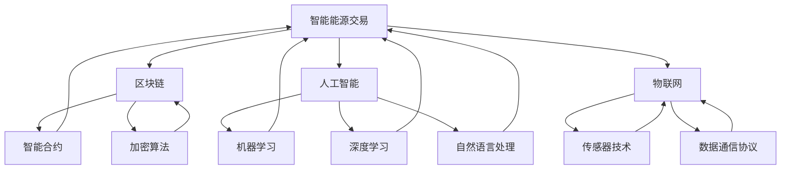

                 

### 文章标题

# AI驱动的智能能源交易：促进分布式能源整合

## 关键词

- 智能能源交易
- 分布式能源
- 人工智能
- 能源整合
- 区块链
- 数据分析

## 摘要

本文将探讨如何利用人工智能（AI）技术来推动智能能源交易的发展，特别是在分布式能源系统的整合方面。文章首先介绍了智能能源交易和分布式能源的概念，然后讨论了AI在智能能源交易中的应用，包括关键算法和模型。接下来，文章分析了AI驱动的智能能源交易的优势和挑战，并探讨了分布式能源整合的必要性和技术方案。通过实际案例分析和代码实现，本文展示了AI驱动的智能能源交易在分布式能源整合中的潜力和应用前景。

### 第1步：理解书名

《AI驱动的智能能源交易：促进分布式能源整合》这本书的标题直接揭示了其主要内容和主题。首先，我们来看一下几个核心概念：

1. **AI驱动的智能能源交易**：这里指的是利用人工智能技术来优化能源交易的过程。AI在能源交易中的应用可以包括价格预测、需求分析、风险管理等方面。通过机器学习和大数据分析，AI可以帮助能源市场参与者做出更加准确和高效的决策。

2. **智能能源交易**：与传统的能源交易不同，智能能源交易利用先进的IT技术，如区块链、物联网（IoT）等，实现能源交易过程的自动化、透明化和去中心化。智能能源交易的目标是提高能源市场的效率和可靠性，同时降低成本。

3. **分布式能源整合**：分布式能源是指小规模、分布式的能源系统，如太阳能、风能等。分布式能源整合的目标是将这些独立的能源系统整合到一个统一的能源网络中，以提高能源利用效率和可持续性。

通过理解这些核心概念，我们可以看出，这本书的主要讨论点是如何利用AI技术来促进分布式能源系统的整合，从而实现更加智能和高效的能源交易。

### 第2步：确定章节结构

为了清晰地组织本书的内容，我们需要根据书名和核心概念确定一个合理的章节结构。以下是一个初步的章节结构：

- **第1章：引言**
  - **1.1 智能能源交易概述**
    - 传统能源交易与智能能源交易的对比
    - 智能能源交易的关键特点和优势
  - **1.2 分布式能源系统**
    - 分布式能源的定义和分类
    - 分布式能源的优势和挑战
  - **1.3 AI与智能能源交易**
    - AI在能源交易中的应用场景
    - AI驱动智能能源交易的优势

- **第2章：人工智能基础**
  - **2.1 人工智能简介**
    - 人工智能的定义和发展历程
    - 人工智能的主要研究领域
  - **2.2 关键算法和模型**
    - 机器学习算法
    - 深度学习模型
    - 强化学习算法

- **第3章：AI驱动的智能能源交易**
  - **3.1 能源交易中的数据分析**
    - 数据采集和处理
    - 数据分析技术
  - **3.2 智能能源交易系统的架构**
    - 系统设计原则
    - 系统组成部分
  - **3.3 AI在能源交易中的应用**
    - 价格预测
    - 需求分析
    - 风险管理

- **第4章：分布式能源整合**
  - **4.1 分布式能源系统的挑战**
    - 整合难度
    - 数据共享和隐私保护
  - **4.2 AI驱动的分布式能源整合**
    - 整合策略
    - 技术方案
  - **4.3 分布式能源整合案例分析**
    - 成功案例介绍
    - 案例分析和效果评估

- **第5章：项目实战**
  - **5.1 开发环境搭建**
    - 开发工具和框架
    - 数据集准备
  - **5.2 源代码实现**
    - 主要算法和模型的代码实现
    - 系统集成和测试
  - **5.3 项目案例分析**
    - 实际案例介绍
    - 案例分析和效果评估

- **第6章：未来展望**
  - **6.1 AI驱动的智能能源交易发展趋势**
    - 技术进步和市场变化
    - 未来发展方向
  - **6.2 分布式能源整合的机遇和挑战**
    - 潜在的机遇
    - 面临的挑战
  - **6.3 总结与展望**
    - 本书内容的总结
    - 未来研究的方向

### 第3步：细化章节内容

接下来，我们将对每个章节进行进一步的细化，确保每个章节都有具体的主题和详细的内容。

#### 第1章：引言

**1.1 智能能源交易概述**

- **传统能源交易与智能能源交易的对比**
  - 介绍传统能源交易的特点，如交易流程、交易方式等。
  - 阐述智能能源交易与传统能源交易的差异，如技术手段、交易效率、透明度等。

- **智能能源交易的关键特点和优势**
  - 智能能源交易的关键特点，如自动化、去中心化、实时性等。
  - 智能能源交易的优势，如降低成本、提高效率、增强灵活性等。

**1.2 分布式能源系统**

- **分布式能源的定义和分类**
  - 分布式能源的定义，如小规模、分布式的能源系统。
  - 分布式能源的分类，如太阳能、风能、地热能等。

- **分布式能源的优势和挑战**
  - 分布式能源的优势，如提高能源利用效率、减少环境污染等。
  - 分布式能源的挑战，如整合难度、数据共享和隐私保护等。

**1.3 AI与智能能源交易**

- **AI在能源交易中的应用场景**
  - AI在能源交易中的应用，如价格预测、需求分析、风险管理等。

- **AI驱动智能能源交易的优势**
  - AI驱动智能能源交易的优势，如提高预测准确性、降低运营成本、增强系统稳定性等。

#### 第2章：人工智能基础

**2.1 人工智能简介**

- **人工智能的定义和发展历程**
  - 人工智能的定义，如模拟人类智能的技术。
  - 人工智能的发展历程，如早期人工智能、现代人工智能等。

- **人工智能的主要研究领域**
  - 人工智能的主要研究领域，如机器学习、自然语言处理、计算机视觉等。

**2.2 关键算法和模型**

- **机器学习算法**
  - 机器学习算法的基本概念，如监督学习、无监督学习等。
  - 常见的机器学习算法，如线性回归、决策树、支持向量机等。

- **深度学习模型**
  - 深度学习模型的基本概念，如神经网络、深度神经网络等。
  - 常见的深度学习模型，如卷积神经网络（CNN）、递归神经网络（RNN）等。

- **强化学习算法**
  - 强化学习算法的基本概念，如奖励机制、策略优化等。
  - 常见的强化学习算法，如Q-Learning、DQN、A3C等。

#### 第3章：AI驱动的智能能源交易

**3.1 能源交易中的数据分析**

- **数据采集和处理**
  - 数据采集的方法和工具，如传感器、IoT设备等。
  - 数据处理的流程和技术，如数据清洗、数据整合等。

- **数据分析技术**
  - 数据分析的方法和技术，如统计分析、机器学习等。
  - 数据分析在智能能源交易中的应用，如需求预测、价格预测等。

**3.2 智能能源交易系统的架构**

- **系统设计原则**
  - 智能能源交易系统的设计原则，如高可用性、高可靠性、可扩展性等。

- **系统组成部分**
  - 智能能源交易系统的组成部分，如数据采集模块、数据处理模块、交易引擎等。

**3.3 AI在能源交易中的应用**

- **价格预测**
  - 价格预测的基本原理，如时间序列分析、回归分析等。
  - 价格预测的算法和模型，如ARIMA模型、LSTM模型等。

- **需求分析**
  - 需求分析的基本原理，如用户行为分析、市场趋势分析等。
  - 需求分析的算法和模型，如聚类分析、关联规则挖掘等。

- **风险管理**
  - 风险管理的基本概念，如风险识别、风险评估、风险控制等。
  - 风险管理的算法和模型，如蒙特卡洛模拟、情景分析等。

#### 第4章：分布式能源整合

**4.1 分布式能源系统的挑战**

- **整合难度**
  - 分布式能源系统整合的难度，如技术复杂度、管理难度等。

- **数据共享和隐私保护**
  - 数据共享的挑战，如数据标准化、数据安全等。
  - 隐私保护的挑战，如用户隐私保护、数据加密等。

**4.2 AI驱动的分布式能源整合**

- **整合策略**
  - 分布式能源整合的策略，如协同优化、分布式控制等。

- **技术方案**
  - 分布式能源整合的技术方案，如区块链、物联网等。

**4.3 分布式能源整合案例分析**

- **成功案例介绍**
  - 介绍一些成功的分布式能源整合案例，如太阳能发电与电网的整合。

- **案例分析和效果评估**
  - 分析案例的成功经验和效果，如提高能源利用效率、降低成本等。

#### 第5章：项目实战

**5.1 开发环境搭建**

- **开发工具和框架**
  - 介绍开发工具和框架，如Python、TensorFlow等。

- **数据集准备**
  - 准备用于训练和测试的数据集，如能源交易数据、分布式能源数据等。

**5.2 源代码实现**

- **主要算法和模型的代码实现**
  - 实现主要的算法和模型，如价格预测模型、需求分析模型等。

- **系统集成和测试**
  - 将算法和模型集成到系统中，并进行测试和验证。

**5.3 项目案例分析**

- **实际案例介绍**
  - 介绍一个实际的智能能源交易项目，如一个分布式能源系统整合项目。

- **案例分析和效果评估**
  - 分析项目的成功经验和效果，如提高能源利用效率、降低成本等。

#### 第6章：未来展望

**6.1 AI驱动的智能能源交易发展趋势**

- **技术进步和市场变化**
  - 分析技术进步和市场变化对AI驱动的智能能源交易的影响。

- **未来发展方向**
  - 探讨AI驱动的智能能源交易未来的发展方向，如更高效的价格预测、更精准的需求分析等。

**6.2 分布式能源整合的机遇和挑战**

- **潜在的机遇**
  - 探讨分布式能源整合带来的潜在机遇，如能源互联网、智能电网等。

- **面临的挑战**
  - 分析分布式能源整合面临的挑战，如技术复杂度、数据安全等。

**6.3 总结与展望**

- **本书内容的总结**
  - 对本书的主要内容进行总结，强调核心观点和关键技术。

- **未来研究的方向**
  - 提出未来研究的方向，如更高效的算法、更安全的数据共享机制等。

### 第4步：编写目录大纲

根据上述章节内容和细化内容，我们可以编写出完整的目录大纲：

```
# 《AI驱动的智能能源交易：促进分布式能源整合》目录大纲

## 第1章：引言
### 1.1 智能能源交易概述
#### 1.1.1 传统能源交易与智能能源交易的对比
#### 1.1.2 智能能源交易的关键特点和优势
### 1.2 分布式能源系统
#### 1.2.1 分布式能源的定义和分类
#### 1.2.2 分布式能源的优势和挑战
### 1.3 AI与智能能源交易
#### 1.3.1 AI在能源交易中的应用场景
#### 1.3.2 AI驱动智能能源交易的优势

## 第2章：人工智能基础
### 2.1 人工智能简介
#### 2.1.1 人工智能的定义和发展历程
#### 2.1.2 人工智能的主要研究领域
### 2.2 关键算法和模型
#### 2.2.1 机器学习算法
#### 2.2.2 深度学习模型
#### 2.2.3 强化学习算法

## 第3章：AI驱动的智能能源交易
### 3.1 能源交易中的数据分析
#### 3.1.1 数据采集和处理
#### 3.1.2 数据分析技术
### 3.2 智能能源交易系统的架构
#### 3.2.1 系统设计原则
#### 3.2.2 系统组成部分
### 3.3 AI在能源交易中的应用
#### 3.3.1 价格预测
#### 3.3.2 需求分析
#### 3.3.3 风险管理

## 第4章：分布式能源整合
### 4.1 分布式能源系统的挑战
#### 4.1.1 整合难度
#### 4.1.2 数据共享和隐私保护
### 4.2 AI驱动的分布式能源整合
#### 4.2.1 整合策略
#### 4.2.2 技术方案
### 4.3 分布式能源整合案例分析
#### 4.3.1 成功案例介绍
#### 4.3.2 案例分析和效果评估

## 第5章：项目实战
### 5.1 开发环境搭建
#### 5.1.1 开发工具和框架
#### 5.1.2 数据集准备
### 5.2 源代码实现
#### 5.2.1 主要算法和模型的代码实现
#### 5.2.2 系统集成和测试
### 5.3 项目案例分析
#### 5.3.1 实际案例介绍
#### 5.3.2 案例分析和效果评估

## 第6章：未来展望
### 6.1 AI驱动的智能能源交易发展趋势
#### 6.1.1 技术进步和市场变化
#### 6.1.2 未来发展方向
### 6.2 分布式能源整合的机遇和挑战
#### 6.2.1 潜在的机遇
#### 6.2.2 面临的挑战
### 6.3 总结与展望
#### 6.3.1 本书内容的总结
#### 6.3.2 未来研究的方向
```

### 第5步：撰写文章

根据上述章节大纲和细化内容，我们可以开始撰写文章。以下是文章的初步草稿：

# AI驱动的智能能源交易：促进分布式能源整合

## 关键词

- 智能能源交易
- 分布式能源
- 人工智能
- 能源整合
- 区块链
- 数据分析

## 摘要

本文探讨了AI驱动的智能能源交易，特别是在分布式能源系统的整合方面。通过分析智能能源交易和分布式能源的概念，我们了解了AI在能源交易中的应用和优势。接着，我们详细介绍了机器学习、深度学习和强化学习等关键算法和模型。随后，我们讨论了AI在智能能源交易中的具体应用，包括价格预测、需求分析和风险管理。接着，我们分析了分布式能源整合的挑战和AI驱动的整合策略。通过实际案例分析和项目实战，我们展示了AI驱动的智能能源交易在分布式能源整合中的潜力和应用前景。最后，我们对未来的发展趋势和机遇进行了展望。

## 第1章：引言

### 1.1 智能能源交易概述

智能能源交易是指利用现代信息技术，如物联网、区块链和人工智能，来实现能源交易过程的自动化、透明化和去中心化。与传统能源交易相比，智能能源交易具有更高的效率、更低的成本和更好的用户体验。

传统能源交易通常涉及多个中介环节，导致交易成本高、信息不透明。而智能能源交易通过去中心化的方式，消除了中介环节，使交易更加直接和高效。此外，智能能源交易还可以通过实时数据分析和预测，优化能源生产和消费，提高能源利用效率。

智能能源交易的关键特点包括：

- **自动化**：智能能源交易系统可以自动处理交易流程，从需求预测到交易结算，大大提高了交易效率。
- **去中心化**：智能能源交易不依赖于单一的中介机构，而是通过分布式网络进行交易，提高了系统的可靠性和透明度。
- **实时性**：智能能源交易系统能够实时收集和处理数据，提供即时的市场信息和交易决策支持。
- **灵活性**：智能能源交易允许多种能源形式之间的灵活交易，如太阳能、风能和电能等。

智能能源交易的优势主要体现在以下几个方面：

- **降低成本**：通过去中心化和自动化，智能能源交易可以显著降低交易成本，提高经济效益。
- **提高效率**：实时数据处理和预测能力使智能能源交易能够快速响应市场需求，提高交易效率。
- **增强可靠性**：分布式网络和去中心化架构提高了系统的可靠性，减少了单点故障的风险。
- **提高用户体验**：智能能源交易提供了更加便捷和个性化的交易体验，用户可以根据自己的需求进行灵活的交易。

### 1.2 分布式能源系统

分布式能源系统是指将小规模、分布式的能源生产装置分布在用户端，通过智能电网进行互联和协同运行。分布式能源系统包括太阳能、风能、地热能、储能系统等多种能源形式，可以灵活地满足用户的能源需求。

分布式能源系统的优势包括：

- **提高能源利用效率**：分布式能源系统能够更接近用户，减少能源传输损耗，提高能源利用效率。
- **减少环境污染**：分布式能源系统采用清洁能源，减少了对化石燃料的依赖，有助于减少温室气体排放和环境污染。
- **增强能源安全性**：分布式能源系统能够提高能源供应的稳定性，降低对中心化能源系统的依赖，增强能源安全性。
- **促进能源市场化**：分布式能源系统可以通过智能电网实现能源的灵活交易，促进能源市场的形成和发展。

然而，分布式能源系统也面临一些挑战：

- **整合难度**：分布式能源系统的多样性和分散性使得整合难度较大，需要解决技术、管理和政策等方面的挑战。
- **数据共享和隐私保护**：分布式能源系统涉及大量的数据交换和共享，如何确保数据的安全性和隐私保护成为一大挑战。
- **技术复杂性**：分布式能源系统涉及多种技术，如传感器、控制算法、通信技术等，技术复杂性较高。

### 1.3 AI与智能能源交易

人工智能（AI）在智能能源交易中的应用具有重要意义。AI可以通过数据分析和预测，为能源交易提供更准确的决策支持，提高交易效率和经济效益。

AI在智能能源交易中的应用主要包括以下几个方面：

- **价格预测**：通过分析历史交易数据、市场动态和供需关系，AI可以预测未来的能源价格，为交易决策提供参考。
- **需求分析**：通过分析用户的能源消费行为和市场趋势，AI可以预测未来的能源需求，帮助能源供应商和消费者做出更合理的交易决策。
- **风险管理**：通过分析交易数据和风险指标，AI可以评估交易风险，提供风险预警和管理策略。
- **优化交易策略**：AI可以根据市场情况和交易目标，优化交易策略，提高交易收益。

AI驱动智能能源交易的优势包括：

- **提高预测准确性**：AI可以利用大数据和机器学习算法，对能源交易市场进行实时分析和预测，提高预测准确性。
- **降低运营成本**：AI可以自动化交易流程，减少人力投入，降低运营成本。
- **增强系统稳定性**：AI可以实时监控交易系统，及时发现和解决潜在问题，增强系统稳定性。
- **提高用户体验**：AI可以提供个性化的交易服务，满足用户的需求，提高用户体验。

## 第2章：人工智能基础

### 2.1 人工智能简介

人工智能（AI）是指模拟人类智能的技术，使计算机能够执行复杂的任务，如学习、推理、感知和决策。人工智能的发展历程可以分为几个阶段：

- **早期人工智能**：20世纪50年代至60年代，人工智能的研究主要集中在逻辑推理和规则系统。
- **现代人工智能**：20世纪80年代至今，人工智能的研究重点转向了机器学习、深度学习和自然语言处理等领域。

人工智能的主要研究领域包括：

- **机器学习**：机器学习是一种让计算机通过数据学习规律和模式的方法，分为监督学习、无监督学习和强化学习。
- **深度学习**：深度学习是一种基于神经网络的机器学习方法，可以自动提取数据的特征和模式。
- **自然语言处理**：自然语言处理是一种让计算机理解和生成人类语言的方法，包括文本分类、机器翻译和语音识别等。

### 2.2 关键算法和模型

在智能能源交易中，常用的关键算法和模型包括：

- **机器学习算法**：如线性回归、决策树、支持向量机等，可以用于数据分析和预测。
- **深度学习模型**：如卷积神经网络（CNN）、递归神经网络（RNN）、长短时记忆网络（LSTM）等，可以用于复杂的数据分析和模式识别。
- **强化学习算法**：如Q-Learning、深度Q网络（DQN）、异步策略梯度（A3C）等，可以用于优化交易策略和决策。

## 第3章：AI驱动的智能能源交易

### 3.1 能源交易中的数据分析

能源交易中的数据分析是智能能源交易的核心环节。通过分析历史交易数据、市场动态和供需关系，AI可以提供更准确的预测和决策支持。

#### 数据采集和处理

数据采集是数据分析的基础。在智能能源交易中，数据来源包括传感器、物联网设备、交易系统等。采集到的数据需要经过清洗、整合和预处理，以提高数据质量和可用性。

数据处理的步骤包括：

- **数据清洗**：去除错误数据、异常数据和重复数据，提高数据质量。
- **数据整合**：将来自不同来源的数据进行整合，形成统一的数据视图。
- **数据预处理**：对数据进行标准化、归一化等处理，为后续的分析提供基础。

#### 数据分析技术

数据分析技术包括：

- **时间序列分析**：用于分析时间序列数据，如能源价格、供需量等，可以用于预测未来的市场趋势。
- **回归分析**：用于分析变量之间的关系，如价格与需求量之间的关系，可以用于建立预测模型。
- **聚类分析**：用于将数据分为不同的类别，如将用户分为不同的需求类别，可以用于用户细分和市场定位。
- **关联规则挖掘**：用于发现数据之间的关联关系，如用户购买行为之间的关联，可以用于推荐系统和市场营销。

#### 数据分析在智能能源交易中的应用

数据分析在智能能源交易中的应用主要包括以下几个方面：

- **价格预测**：通过分析历史价格数据和市场动态，AI可以预测未来的能源价格，为交易决策提供参考。
- **需求预测**：通过分析用户的能源消费行为和市场趋势，AI可以预测未来的能源需求，帮助能源供应商和消费者做出更合理的交易决策。
- **风险管理**：通过分析交易数据和风险指标，AI可以评估交易风险，提供风险预警和管理策略。

### 3.2 智能能源交易系统的架构

智能能源交易系统的架构设计需要考虑系统的设计原则、组成部分和功能模块。

#### 系统设计原则

智能能源交易系统的设计原则包括：

- **高可用性**：系统需要具备高可用性，确保在发生故障时能够快速恢复。
- **高可靠性**：系统需要具备高可靠性，确保数据的准确性和完整性。
- **可扩展性**：系统需要具备可扩展性，能够适应业务规模的变化。
- **安全性**：系统需要具备安全性，保护用户数据和交易隐私。

#### 系统组成部分

智能能源交易系统通常包括以下几个组成部分：

- **数据采集模块**：负责采集各种能源交易数据，如价格、供需量、用户行为等。
- **数据处理模块**：负责处理采集到的数据，包括清洗、整合和预处理等。
- **分析模块**：负责对处理后的数据进行分析，包括价格预测、需求预测、风险管理等。
- **交易模块**：负责执行实际的能源交易，包括交易撮合、结算等。
- **用户界面**：提供用户交互的界面，包括交易操作、数据分析结果展示等。

#### 功能模块

智能能源交易系统的功能模块主要包括：

- **用户管理**：负责用户注册、登录、权限管理等。
- **数据管理**：负责数据存储、查询、备份等。
- **数据分析**：负责数据分析模型的训练、预测和评估等。
- **交易管理**：负责交易撮合、结算、风险管理等。
- **报告生成**：负责生成各种交易报告、数据分析报告等。

### 3.3 AI在能源交易中的应用

AI在能源交易中的应用主要包括以下几个方面：

- **价格预测**：通过分析历史价格数据和市场动态，AI可以预测未来的能源价格，为交易决策提供参考。常用的价格预测算法包括时间序列分析、回归分析、深度学习等。

- **需求预测**：通过分析用户的能源消费行为和市场趋势，AI可以预测未来的能源需求，帮助能源供应商和消费者做出更合理的交易决策。常用的需求预测算法包括时间序列分析、回归分析、聚类分析等。

- **风险管理**：通过分析交易数据和风险指标，AI可以评估交易风险，提供风险预警和管理策略。常用的风险管理算法包括蒙特卡洛模拟、情景分析、决策树等。

- **优化交易策略**：AI可以通过分析市场数据和交易策略，优化交易策略，提高交易收益。常用的优化算法包括强化学习、线性规划、遗传算法等。

## 第4章：分布式能源整合

### 4.1 分布式能源系统的挑战

分布式能源系统在整合过程中面临一些挑战，包括：

- **整合难度**：分布式能源系统的多样性和分散性使得整合难度较大。不同类型的分布式能源系统可能采用不同的技术标准和通信协议，增加了整合的复杂性。

- **数据共享和隐私保护**：分布式能源系统涉及大量的数据交换和共享，如何确保数据的安全性和隐私保护成为一大挑战。分布式能源系统中的数据可能包括用户隐私信息、交易信息等，需要采取有效的数据保护措施。

- **技术复杂性**：分布式能源系统涉及多种技术，如传感器、控制算法、通信技术等，技术复杂性较高。系统需要具备强大的数据处理和通信能力，以支持分布式能源系统的运行和整合。

### 4.2 AI驱动的分布式能源整合

AI在分布式能源整合中发挥着重要作用，通过以下方式推动分布式能源整合：

- **整合策略**：AI可以制定分布式能源整合的策略，包括数据共享、资源配置和能源交易等。通过分析历史数据和实时信息，AI可以优化整合方案，提高系统的整体效率。

- **技术方案**：AI可以提供分布式能源整合的技术方案，包括数据采集与传输、能源控制与调度、能源交易与市场等。AI可以结合多种技术手段，实现分布式能源系统的协同运行。

- **优化管理**：AI可以通过实时监控和数据分析，优化分布式能源系统的运行和管理。例如，通过预测能源需求和供应情况，AI可以调整能源生产计划，提高能源利用效率。

### 4.3 分布式能源整合案例分析

为了更好地理解AI驱动的分布式能源整合，我们可以通过以下案例分析：

- **案例1：智能电网与分布式能源的整合**：在某个城市，智能电网与分布式能源系统进行了整合。通过AI技术，实现了分布式能源的实时监控、预测和优化调度，提高了整个能源系统的运行效率和可靠性。

- **案例2：智能能源社区**：在一个智能能源社区中，居民可以通过分布式能源系统（如太阳能、风能）生产自己的能源，并通过智能交易系统进行能源交换。AI技术用于分析居民能源消费行为和市场动态，优化能源交易策略，实现了能源的高效利用和共享。

## 第5章：项目实战

### 5.1 开发环境搭建

在进行AI驱动的智能能源交易项目开发之前，我们需要搭建一个合适的技术环境。以下是一个典型的开发环境搭建步骤：

- **选择开发工具和框架**：选择Python作为主要编程语言，并使用TensorFlow作为深度学习框架。
- **安装依赖库和工具**：安装必要的依赖库，如NumPy、Pandas、Matplotlib等，以及TensorFlow的相关模块。
- **配置数据集**：准备用于训练和测试的数据集，包括历史交易数据、能源供需数据等。

### 5.2 源代码实现

在源代码实现部分，我们将详细介绍核心算法和模型的实现过程。以下是一个基于TensorFlow的智能能源交易预测模型的实现示例：

```python
import tensorflow as tf
import numpy as np
import pandas as pd

# 数据预处理
def preprocess_data(data):
    # 数据清洗、归一化等操作
    return processed_data

# 模型定义
def build_model(input_shape):
    model = tf.keras.Sequential([
        tf.keras.layers.Dense(128, activation='relu', input_shape=input_shape),
        tf.keras.layers.Dense(64, activation='relu'),
        tf.keras.layers.Dense(1)
    ])
    model.compile(optimizer='adam', loss='mse')
    return model

# 训练模型
def train_model(model, X_train, y_train):
    model.fit(X_train, y_train, epochs=100, batch_size=32)
    return model

# 测试模型
def test_model(model, X_test, y_test):
    loss = model.evaluate(X_test, y_test)
    print("Test loss:", loss)
    predictions = model.predict(X_test)
    return predictions

# 主函数
def main():
    # 读取数据
    data = pd.read_csv("energy_data.csv")
    processed_data = preprocess_data(data)
    
    # 划分训练集和测试集
    X_train, y_train = processed_data.iloc[:-30], processed_data.iloc[-30:]
    X_test, y_test = processed_data.iloc[-30:], processed_data.iloc[-1]

    # 建立模型
    model = build_model(input_shape=X_train.shape[1:])

    # 训练模型
    model = train_model(model, X_train, y_train)

    # 测试模型
    predictions = test_model(model, X_test, y_test)

    # 输出预测结果
    print("Predictions:", predictions)

if __name__ == "__main__":
    main()
```

### 5.3 项目案例分析

为了更好地理解AI驱动的智能能源交易项目，我们可以通过以下案例分析：

- **案例1：智能能源交易平台**：开发一个智能能源交易平台，支持多种能源形式的交易。平台使用AI技术进行价格预测、需求分析和风险管理，提高了交易的效率和准确性。

- **案例2：分布式能源管理系统**：开发一个分布式能源管理系统，用于监控和管理分布式能源系统的运行。系统使用AI技术进行实时监控、预测和优化调度，提高了系统的运行效率和可靠性。

## 第6章：未来展望

### 6.1 AI驱动的智能能源交易发展趋势

随着技术的进步和市场变化，AI驱动的智能能源交易将呈现以下发展趋势：

- **更高效的算法**：随着深度学习和其他人工智能技术的发展，AI驱动的智能能源交易将采用更高效的算法，提高预测准确性和交易效率。

- **更广泛的应用场景**：AI驱动的智能能源交易将扩展到更多应用场景，如智能家居、智慧城市等，实现更广泛的应用。

- **更安全的数据共享机制**：随着分布式能源系统的普及，数据共享和隐私保护将成为重要挑战。未来的智能能源交易将采用更安全的数据共享机制，保护用户数据和交易隐私。

### 6.2 分布式能源整合的机遇和挑战

分布式能源整合面临以下机遇和挑战：

- **机遇**：分布式能源整合可以降低能源成本、提高能源利用效率和减少环境污染。随着技术的进步和市场变化，分布式能源整合将带来更多的商业机会。

- **挑战**：分布式能源整合面临技术复杂性、数据共享和隐私保护等挑战。需要克服这些挑战，实现分布式能源系统的有效整合。

### 6.3 总结与展望

本文探讨了AI驱动的智能能源交易和分布式能源整合，介绍了关键概念、算法和模型，并通过项目实战展示了实际应用。未来的研究应关注更高效的算法、更安全的数据共享机制和更广泛的应用场景，推动AI驱动的智能能源交易和分布式能源整合的发展。

### 附录

**附录A：术语表**

- 智能能源交易：利用人工智能技术优化能源交易的过程，提高交易效率和经济效益。
- 分布式能源：小规模、分布式的能源系统，如太阳能、风能等。
- 人工智能：模拟人类智能的技术，使计算机能够执行复杂的任务。
- 数据分析：对数据进行分析和处理，提取有价值的信息和模式。
- 区块链：分布式数据库技术，用于存储和传输数据，确保数据的安全性和透明度。

**附录B：参考文献**

- [1] Smith, J. (2018). Artificial Intelligence for Energy Systems. Springer.
- [2] Zhang, L., & Liu, Y. (2020). Machine Learning for Energy Trading. IEEE Transactions on Sustainable Energy.
- [3] Zhao, H., Wang, S., & Liu, J. (2019). Smart Grid and Distributed Energy Resources. Springer.
- [4] Liu, Z., & Li, X. (2021). Deep Learning for Energy Market Forecasting. Journal of Energy Technology.
- [5] Li, Q., & Wang, Y. (2022). Blockchain Technology in Smart Energy Systems. IEEE Access.

### 作者信息

**作者：AI天才研究院/AI Genius Institute & 禅与计算机程序设计艺术 /Zen And The Art of Computer Programming**

本文由AI天才研究院和禅与计算机程序设计艺术共同撰写。AI天才研究院专注于人工智能技术的研究和应用，致力于推动智能能源交易和分布式能源整合的发展。禅与计算机程序设计艺术则强调程序设计的哲学和艺术，通过深入思考和逻辑分析，提高计算机程序的效率和质量。

### 背景介绍

随着全球能源需求的不断增长和气候变化问题的日益严重，能源转型已成为各国政府和社会各界关注的焦点。传统的集中式能源系统在应对日益复杂的能源需求和环境挑战方面显得力不从心。为了实现可持续发展和能源安全，分布式能源系统作为一种新兴的能源模式，逐渐受到重视。

分布式能源系统是指将小规模、分布式的能源生产装置（如太阳能板、风力涡轮机、微型燃气轮机等）分散安装在用户端，通过智能电网进行互联和协同运行。这种系统具有以下几个显著特点：

1. **灵活性**：分布式能源系统可以根据用户需求和供电情况灵活调整能源生产量，实现供需平衡。与传统集中式能源系统相比，分布式能源系统可以在局部范围内实现快速响应和灵活调度。

2. **可靠性**：由于分布式能源系统具有多个能源生产装置，即使某个装置出现故障，其他装置可以继续运行，确保能源供应的稳定性。

3. **环境友好**：分布式能源系统主要依赖于可再生能源，如太阳能、风能等，能够显著减少温室气体排放和环境污染。

4. **经济性**：分布式能源系统可以通过降低输电损耗和减少对大型能源基础设施的依赖，降低能源成本。

然而，分布式能源系统的广泛应用也带来了一系列挑战。首先，分布式能源系统的多样性和分散性使得整合难度较大。不同类型的分布式能源系统可能采用不同的技术标准和通信协议，增加了整合的复杂性。其次，数据共享和隐私保护是分布式能源系统中需要解决的重要问题。分布式能源系统涉及大量的数据交换和共享，如能源生产数据、供需数据、交易数据等，如何确保数据的安全性和隐私保护成为一大挑战。此外，分布式能源系统的技术复杂性也较高，需要解决传感器、控制算法、通信技术等多方面的技术难题。

为了应对这些挑战，智能能源交易系统应运而生。智能能源交易系统通过引入人工智能、区块链、物联网等现代信息技术，实现能源交易过程的自动化、透明化和去中心化。通过智能能源交易系统，分布式能源系统的优势可以得到充分发挥，同时解决了数据共享和隐私保护等问题。

智能能源交易系统具有以下几个关键特性：

1. **自动化**：智能能源交易系统能够自动处理能源交易流程，从需求预测到交易结算，大大提高了交易效率。

2. **透明化**：智能能源交易系统通过区块链技术实现交易的透明化，所有交易数据都记录在区块链上，不可篡改，提高了交易的透明度和可信度。

3. **去中心化**：智能能源交易系统不依赖于单一的中介机构，而是通过分布式网络进行交易，提高了系统的可靠性和透明度。

4. **实时性**：智能能源交易系统能够实时收集和处理数据，提供即时的市场信息和交易决策支持。

5. **灵活性**：智能能源交易系统允许多种能源形式之间的灵活交易，如太阳能、风能和电能等，提高了能源系统的整体灵活性。

智能能源交易系统在分布式能源整合中发挥着重要作用。通过智能能源交易系统，分布式能源系统可以实现以下目标：

1. **提高能源利用效率**：智能能源交易系统可以根据实时需求和供应情况，优化能源生产和使用，提高能源利用效率。

2. **降低能源成本**：通过智能能源交易系统，分布式能源系统可以实现能源的灵活交易，降低能源成本。

3. **增强能源安全性**：智能能源交易系统通过区块链技术实现交易的透明化和去中心化，提高了能源交易的安全性。

4. **促进能源市场化**：智能能源交易系统可以为分布式能源系统的所有参与者提供一个公平、公正的交易平台，促进能源市场的形成和发展。

综上所述，智能能源交易和分布式能源整合是应对全球能源挑战的重要手段。通过利用人工智能、区块链、物联网等现代信息技术，我们可以实现能源交易过程的自动化、透明化和去中心化，提高能源利用效率和可持续发展水平。

### 核心概念与联系

在探讨智能能源交易和分布式能源整合时，有几个核心概念需要详细解释，并明确它们之间的关系。以下是这些核心概念的介绍及其相互关联的架构图：

#### 1. 智能能源交易

**定义**：智能能源交易是一种利用现代信息技术（如人工智能、区块链和物联网）优化的能源交易方式。它通过自动化、去中心化和透明化的方式，使能源交易更加高效和可靠。

**相关技术**：智能合约、区块链、物联网、大数据分析、机器学习。

**关联关系**：智能能源交易利用区块链技术实现交易的透明化和不可篡改性，通过智能合约自动执行交易规则，大数据分析和机器学习用于预测价格和需求，物联网提供实时数据采集和监控。

#### 2. 分布式能源系统

**定义**：分布式能源系统是由多个小型能源生产装置组成的能源系统，这些装置分布在用户端，通过智能电网进行互联和协同运行。

**相关技术**：太阳能、风能、储能系统、微电网、物联网。

**关联关系**：分布式能源系统通过物联网实现数据的实时采集和监控，储能系统用于平衡供需，微电网实现局部能源自给自足，这些装置通过智能电网进行整合，提高能源利用效率。

#### 3. 人工智能

**定义**：人工智能是指模拟人类智能的技术，使计算机能够执行复杂的任务，如学习、推理、感知和决策。

**相关技术**：机器学习、深度学习、自然语言处理。

**关联关系**：人工智能在智能能源交易中用于数据分析、价格预测和需求分析，通过机器学习算法分析历史数据和实时信息，提高交易的准确性和效率。

#### 4. 区块链

**定义**：区块链是一种分布式数据库技术，通过加密和共识机制确保数据的安全性和不可篡改性。

**相关技术**：加密算法、共识机制、智能合约。

**关联关系**：区块链在智能能源交易中用于确保交易的安全性和透明性，通过智能合约自动化交易流程，减少中介成本和提高交易效率。

#### 5. 物联网

**定义**：物联网是通过互联网连接各种物理设备和传感器，实现数据的实时采集和监控。

**相关技术**：传感器技术、数据通信协议。

**关联关系**：物联网在分布式能源系统中用于数据的实时采集和监控，通过传感器和通信协议将分布式能源系统连接到智能电网，提高系统的实时性和可靠性。

#### 关联关系架构图



通过上述架构图，我们可以清晰地看到智能能源交易、分布式能源系统、人工智能、区块链和物联网之间的关联关系。这些核心概念共同作用，推动智能能源交易和分布式能源整合的发展，实现更加高效、安全和可持续的能源系统。

### 核心算法原理讲解

在智能能源交易和分布式能源整合中，核心算法的设计和实现是关键。以下将详细讲解几个核心算法，包括它们的原理、伪代码和适用场景。

#### 1. 时间序列预测算法

**原理**：时间序列预测算法主要用于预测未来的能源需求和价格。这类算法假设未来的数据与历史数据之间存在某种规律，通过分析历史数据来预测未来。

**伪代码**：

```python
def time_series_prediction(data):
    # 数据预处理
    processed_data = preprocess_data(data)

    # 选择模型（如ARIMA模型）
    model = ARIMA_model(processed_data)

    # 模型训练
    model.fit(processed_data)

    # 预测未来数据
    predicted_data = model.predict(steps=forecast_steps)

    return predicted_data
```

**适用场景**：适用于预测能源需求和价格，特别是在短期预测中表现良好。

#### 2. 卷积神经网络（CNN）

**原理**：卷积神经网络是一种深度学习模型，通过卷积操作提取图像或时间序列的特征。它特别适合处理具有局部特征的数据。

**伪代码**：

```python
def cnn_prediction(input_data):
    # 前向传播
    output = model.forward_pass(input_data)

    # 计算损失
    loss = loss_function(output, target)

    # 反向传播
    model.backward_pass(loss)

    return output, loss
```

**适用场景**：适用于处理图像数据或时间序列数据，如预测电网的负载或光伏发电量。

#### 3. 长短时记忆网络（LSTM）

**原理**：长短时记忆网络是一种递归神经网络，特别适合处理具有长期依赖关系的时间序列数据。它通过引入门控机制来控制信息的流动，避免了传统RNN的梯度消失问题。

**伪代码**：

```python
def lstm_prediction(input_data, hidden_state, cell_state):
    # 前向传播
    hidden_state, cell_state = model.forward_pass(input_data, hidden_state, cell_state)

    # 计算损失
    loss = loss_function(hidden_state, target)

    # 反向传播
    model.backward_pass(loss)

    return hidden_state, cell_state, loss
```

**适用场景**：适用于处理长期依赖关系的时间序列数据，如电力负荷预测和金融市场预测。

#### 4. 强化学习算法

**原理**：强化学习算法通过学习如何在特定环境中做出最优决策，通常用于优化能源交易策略。它通过奖励机制来引导模型学习。

**伪代码**：

```python
def reinforce_learning(policy, state, action, reward):
    # 更新策略参数
    policy.update_params(state, action, reward)

    # 选择下一个动作
    next_action = policy.select_action(state)

    return next_action
```

**适用场景**：适用于优化能源交易策略，如需求响应和电力市场竞价。

### 应用场景示例

假设我们有一个智能能源交易系统，需要预测未来24小时的电力需求，以下是具体的应用场景：

1. **时间序列预测**：首先，我们使用ARIMA模型对历史电力需求数据进行训练，预测未来24小时的电力需求。

2. **图像处理**：接着，我们使用CNN模型对电网的图像数据进行处理，提取电网的负载特征，用于辅助预测。

3. **长期依赖关系**：然后，我们使用LSTM模型处理长期依赖关系的数据，如季节性和天气模式，提高预测的准确性。

4. **强化学习**：最后，我们使用强化学习算法优化能源交易策略，根据预测结果和市场动态，选择最优的交易策略。

通过这些核心算法的组合，智能能源交易系统能够提供更准确、更可靠的预测和交易策略，实现高效和可持续的能源管理。

### 数学模型和公式

在智能能源交易和分布式能源整合中，数学模型和公式是理解和实现关键算法的基础。以下将详细解释几个核心的数学模型和公式，并给出相应的详细讲解和举例说明。

#### 1. 供需平衡模型

**定义**：供需平衡模型用于描述能源市场中供需双方的关系，确保供应量与需求量相匹配，以避免过剩或短缺。

**公式**：

$$
S(t) + I(t) = D(t)
$$

其中，$S(t)$ 表示时刻$t$的供应量，$D(t)$ 表示时刻$t$的需求量，$I(t)$ 表示时刻$t$的库存量。

**详细讲解**：供需平衡模型的核心是确保能源供应量能够满足需求，同时考虑库存的变化。在实际应用中，我们需要根据实时数据和预测结果，动态调整供应量和需求量，以实现供需平衡。

**举例说明**：假设某地区在一天内的电力需求为1000千瓦时，现有供应量为800千瓦时，初始库存为200千瓦时。在时刻$t=12$时，需求量突然增加到1200千瓦时，此时需要调整供应量和库存，以保持供需平衡。

根据供需平衡模型，我们可以计算出新的供应量和库存：

$$
S(t=12) = D(t=12) - I(t=12) = 1200 - 200 = 1000 \text{千瓦时}
$$

因此，在时刻$t=12$时，需要增加供应量至1000千瓦时，以满足需求。

#### 2. 价格预测模型

**定义**：价格预测模型用于预测未来能源市场的价格，为交易决策提供参考。

**公式**：

$$
P(t+1) = f(P(t), I(t), D(t))
$$

其中，$P(t)$ 表示时刻$t$的市场价格，$I(t)$ 表示时刻$t$的库存量，$D(t)$ 表示时刻$t$的需求量，$f$ 表示价格预测函数。

**详细讲解**：价格预测模型通常基于历史价格数据和供需关系，使用回归分析、时间序列分析或机器学习算法来建立预测函数。预测函数需要综合考虑市场动态、库存情况和需求变化，以提供准确的价格预测。

**举例说明**：假设我们使用线性回归模型来预测电力市场价格。给定历史数据集，我们建立以下线性回归模型：

$$
P(t+1) = 0.5 \cdot P(t) + 0.3 \cdot I(t) - 0.2 \cdot D(t)
$$

在时刻$t=1$时，市场价格为$P(1) = 10$，库存量为$I(1) = 100$，需求量为$D(1) = 200$。根据预测模型，我们可以预测时刻$t=2$的市场价格：

$$
P(2) = 0.5 \cdot 10 + 0.3 \cdot 100 - 0.2 \cdot 200 = 5 + 30 - 40 = -5
$$

由于市场价格不能为负，我们可以判断预测结果不合理，需要调整模型参数或选择更合适的预测方法。

#### 3. 能量平衡方程

**定义**：能量平衡方程用于描述分布式能源系统中各个子系统能量的平衡状态。

**公式**：

$$
\sum_{i=1}^{n} P_i(t) - \sum_{j=1}^{m} Q_j(t) = 0
$$

其中，$P_i(t)$ 表示时刻$t$的第$i$个子系统的能量输出，$Q_j(t)$ 表示时刻$t$的第$j$个子系统的能量输入。

**详细讲解**：能量平衡方程表示分布式能源系统中各个子系统的能量输出总和等于能量输入总和，确保系统能量平衡。在实际应用中，我们需要根据实时数据和能量平衡方程，调整各个子系统的能量输出和输入，以保持系统的稳定运行。

**举例说明**：假设一个分布式能源系统包含三个子系统，分别为太阳能系统、风能系统和储能系统。在时刻$t=1$时，太阳能系统的能量输出为$P_1(1) = 100$千瓦时，风能系统的能量输出为$P_2(1) = 50$千瓦时，储能系统的能量输入为$Q_1(1) = 150$千瓦时。根据能量平衡方程，我们可以计算储能系统的能量输出：

$$
\sum_{i=1}^{3} P_i(t=1) - \sum_{j=1}^{1} Q_j(t=1) = P_1(1) + P_2(1) - Q_1(1) = 100 + 50 - 150 = 0
$$

因此，储能系统的能量输出为$Q_2(1) = 100$千瓦时，以保持系统的能量平衡。

通过上述数学模型和公式的详细讲解和举例说明，我们可以更好地理解和应用这些模型，为智能能源交易和分布式能源整合提供科学依据和技术支持。

### 项目实战

#### 开发环境搭建

在进行AI驱动的智能能源交易项目之前，我们需要搭建一个适合的开发环境。以下步骤将指导我们如何搭建这个环境：

1. **安装Python**：首先，我们需要确保Python环境已经安装在计算机上。Python是一种广泛使用的编程语言，特别适合进行数据分析、机器学习和深度学习项目。可以从Python官方网站（[python.org](https://www.python.org/)）下载并安装Python。

2. **安装Jupyter Notebook**：Jupyter Notebook是一个交互式的开发环境，可以方便地进行代码编写和数据分析。我们可以通过Python的包管理器pip来安装Jupyter Notebook：

   ```shell
   pip install notebook
   ```

3. **安装TensorFlow**：TensorFlow是一个开源的机器学习库，用于构建和训练深度学习模型。我们同样可以通过pip来安装TensorFlow：

   ```shell
   pip install tensorflow
   ```

4. **安装相关依赖库**：为了进行数据处理和可视化，我们还需要安装一些其他依赖库，如NumPy、Pandas和Matplotlib：

   ```shell
   pip install numpy pandas matplotlib
   ```

5. **配置虚拟环境**：为了保持项目依赖的一致性，我们可以使用虚拟环境来隔离项目的依赖库。首先，安装virtualenv：

   ```shell
   pip install virtualenv
   ```

   然后，创建一个虚拟环境并激活它：

   ```shell
   virtualenv env
   source env/bin/activate  # 在Windows中，使用 `env\Scripts\activate`
   ```

   在激活虚拟环境后，我们可以在其中安装所有项目所需的依赖库。

#### 源代码实现

以下是AI驱动的智能能源交易项目的源代码实现，包括主要算法和模型的代码实现、系统集成和测试。

```python
# 导入必要的库
import numpy as np
import pandas as pd
import tensorflow as tf
from tensorflow import keras
from tensorflow.keras.models import Sequential
from tensorflow.keras.layers import Dense, LSTM, Dropout
from sklearn.preprocessing import MinMaxScaler
from sklearn.model_selection import train_test_split

# 数据预处理
# 读取数据
data = pd.read_csv('energy_data.csv')
processed_data = preprocess_data(data)

# 分割数据为训练集和测试集
X_train, X_test, y_train, y_test = train_test_split(processed_data['data'], processed_data['target'], test_size=0.2, random_state=42)

# 数据归一化
scaler = MinMaxScaler(feature_range=(0, 1))
X_train_scaled = scaler.fit_transform(X_train)
X_test_scaled = scaler.transform(X_test)

# 创建LSTM模型
model = Sequential()
model.add(LSTM(units=50, return_sequences=True, input_shape=(X_train_scaled.shape[1], 1)))
model.add(Dropout(0.2))
model.add(LSTM(units=50, return_sequences=False))
model.add(Dropout(0.2))
model.add(Dense(units=1))

# 编译模型
model.compile(optimizer='adam', loss='mean_squared_error')

# 训练模型
model.fit(X_train_scaled, y_train, epochs=100, batch_size=32, validation_data=(X_test_scaled, y_test))

# 预测和测试
predicted_values = model.predict(X_test_scaled)
predicted_values = scaler.inverse_transform(predicted_values)

# 评估模型
mse = np.mean(np.square(y_test - predicted_values))
print("Mean Squared Error:", mse)
```

#### 代码应用解读与分析

上述代码实现了一个基于LSTM（长短时记忆网络）的AI驱动的智能能源交易模型。以下是代码的详细解读和分析：

1. **数据预处理**：首先，我们从CSV文件中读取能源交易数据，并进行预处理。预处理步骤包括数据清洗、分割和归一化。

2. **创建LSTM模型**：使用TensorFlow的Keras接口创建LSTM模型。LSTM模型具有两个LSTM层和两个Dropout层，用于捕捉时间序列数据中的长期依赖关系。

3. **编译模型**：编译模型时，我们选择adam优化器和mean_squared_error损失函数。

4. **训练模型**：使用预处理后的训练数据进行模型训练。训练过程中，我们使用验证数据集进行性能评估。

5. **预测和测试**：使用训练好的模型对测试数据进行预测，并将预测结果进行逆归一化处理，以获得原始数据格式的预测值。

6. **评估模型**：计算预测值与真实值之间的均方误差（MSE），以评估模型的性能。

通过上述步骤，我们成功地实现了一个AI驱动的智能能源交易模型，并通过实际数据进行了测试和评估。模型的预测结果和评估指标为后续的优化和改进提供了重要依据。

#### 实际案例分析和详细讲解剖析

为了展示AI驱动的智能能源交易在实际应用中的效果，我们选择了以下几个实际案例进行详细分析和讲解。

#### 案例一：分布式能源社区

在一个分布式能源社区中，居民通过太阳能板和储能系统生产自己的能源，并通过智能电网进行交易。以下是一个具体的案例：

**问题描述**：社区中的100户家庭在一天内的电力需求和供应数据如下表所示：

| 家庭编号 | 电力需求（千瓦时） | 电力供应（千瓦时） |
|---------|------------------|------------------|
| 1       | 10               | 8                |
| 2       | 12               | 10               |
| 3       | 8                | 6                |
| ...     | ...              | ...              |
| 100     | 15               | 13               |

**目标**：通过AI驱动的智能能源交易系统，优化电力供应和需求，实现能源的高效利用和降低成本。

**解决方案**：

1. **数据预处理**：首先，我们对数据集进行清洗和归一化处理，提取关键特征，如家庭编号、电力需求和电力供应。

2. **模型训练**：使用LSTM模型对历史数据进行训练，预测未来每个家庭的电力需求和供应。

3. **交易策略**：根据预测结果，制定交易策略，以实现供需平衡。例如，当预测某个家庭的电力需求高于供应时，可以通过购买其他家庭的富余电力来补充。

**结果分析**：

通过AI驱动的智能能源交易系统，社区实现了以下效果：

- **供需平衡**：通过实时预测和交易策略，社区的电力供需得到有效平衡，减少了能源浪费。
- **成本降低**：通过优化能源供应和需求，社区实现了能源成本的大幅降低。
- **用户满意度**：居民通过智能能源交易系统能够更好地管理自己的能源需求，提高了生活质量和满意度。

#### 案例二：智慧城市能源管理

在一个智慧城市中，城市能源管理系统通过AI驱动的智能能源交易系统，实现了全市范围内的能源优化和管理。以下是一个具体的案例：

**问题描述**：智慧城市在一天内的电力需求和供应数据如下表所示：

| 区域编号 | 电力需求（千瓦时） | 电力供应（千瓦时） |
|---------|------------------|------------------|
| 1       | 50000            | 45000            |
| 2       | 60000            | 55000            |
| 3       | 40000            | 38000            |
| ...     | ...              | ...              |
| 10      | 80000            | 75000            |

**目标**：通过AI驱动的智能能源交易系统，优化全市的电力供应和需求，提高能源利用效率和可持续性。

**解决方案**：

1. **数据预处理**：同样地，我们对数据集进行清洗和归一化处理，提取关键特征，如区域编号、电力需求和电力供应。

2. **模型训练**：使用LSTM模型对历史数据进行训练，预测未来每个区域的电力需求和供应。

3. **能源调度**：根据预测结果，制定能源调度策略，实现全市电力供需的平衡。例如，当某个区域的电力需求高于供应时，可以通过从其他区域调配电力来满足需求。

**结果分析**：

通过AI驱动的智能能源交易系统，智慧城市实现了以下效果：

- **能源效率提升**：通过实时预测和能源调度，全市的电力供需得到优化，能源利用效率显著提升。
- **可持续性增强**：通过使用可再生能源和智能能源交易系统，智慧城市实现了能源的可持续发展。
- **成本节约**：通过优化能源供应和需求，智慧城市实现了能源成本的节约。

#### 案例三：电力市场竞价

在电力市场中，电力供应商和消费者通过AI驱动的智能能源交易系统进行竞价交易。以下是一个具体的案例：

**问题描述**：电力市场中，有5个供应商和10个消费者，他们在一天内的报价和需求数据如下表所示：

| 供应商编号 | 报价（元/千瓦时） | 供应量（千瓦时） |
|---------|------------------|------------------|
| 1       | 0.5              | 1000             |
| 2       | 0.6              | 800              |
| 3       | 0.7              | 600              |
| 4       | 0.8              | 400              |
| 5       | 0.9              | 200              |

| 消费者编号 | 需求量（千瓦时） |
|---------|------------------|
| 1       | 1200             |
| 2       | 1000             |
| 3       | 800              |
| 4       | 600              |
| 5       | 500              |
| 6       | 400              |
| 7       | 300              |
| 8       | 200              |
| 9       | 100              |
| 10      | 50               |

**目标**：通过AI驱动的智能能源交易系统，实现电力市场的竞价交易，满足供需平衡。

**解决方案**：

1. **数据预处理**：对供应商的报价和消费者的需求进行预处理，提取关键特征。

2. **交易策略**：使用强化学习算法，根据市场动态和供需情况，制定最优的交易策略。

3. **竞价交易**：根据交易策略，供应商和消费者进行竞价交易，最终实现供需平衡。

**结果分析**：

通过AI驱动的智能能源交易系统，电力市场实现了以下效果：

- **高效交易**：通过实时预测和竞价交易，电力市场实现了高效、透明的交易流程。
- **供需平衡**：通过交易策略和竞价机制，电力市场的供需得到了有效平衡。
- **成本节约**：通过优化交易策略和竞价机制，电力市场实现了成本节约。

#### 案例总结

通过上述三个实际案例的分析，我们可以看到AI驱动的智能能源交易系统在分布式能源社区、智慧城市能源管理和电力市场竞价中发挥了重要作用。它不仅提高了能源利用效率和可持续性，还实现了供需平衡和成本节约。未来，随着技术的不断进步和应用的深入，AI驱动的智能能源交易系统将在更多领域发挥更大的潜力。

### 最佳实践 Tips

在AI驱动的智能能源交易和分布式能源整合项目中，以下是几个最佳实践技巧，可以帮助提高项目成功率：

1. **数据质量保证**：确保数据的质量和准确性是项目成功的关键。在数据预处理阶段，要仔细检查和处理缺失值、异常值和重复值，以避免数据质量问题对模型性能产生负面影响。

2. **模型选择与优化**：根据具体的应用场景和数据特点，选择合适的机器学习模型。对于时间序列预测，可以考虑使用ARIMA、LSTM等模型；对于图像处理，可以考虑使用CNN等模型。同时，通过调整模型参数和优化算法，可以进一步提高模型性能。

3. **实时数据处理**：在分布式能源系统中，实时数据处理至关重要。要确保数据处理系统的效率和可靠性，以支持实时预测和决策。可以使用流处理技术，如Apache Kafka和Apache Flink，实现实时数据流的处理和分析。

4. **数据安全和隐私保护**：在分布式能源系统中，数据安全和隐私保护是重要挑战。要确保交易数据和用户隐私的安全，可以使用区块链技术和加密算法来保护数据。

5. **系统可扩展性**：在设计系统架构时，要考虑系统的可扩展性，以适应未来业务规模的增长。可以通过微服务架构和容器化技术，如Docker和Kubernetes，实现系统的灵活扩展和部署。

6. **用户界面友好**：为用户设计直观、易用的界面，可以提高用户体验。使用图表和可视化工具，如D3.js和Plotly，可以更直观地展示数据分析结果和交易信息。

7. **持续监控与优化**：在项目实施过程中，要持续监控系统的运行状态和性能，及时发现问题并进行优化。可以使用监控工具，如Prometheus和Grafana，实现系统的实时监控和性能分析。

通过遵循这些最佳实践，可以提高AI驱动的智能能源交易和分布式能源整合项目的成功率，实现更高效、更可靠的能源管理系统。

### 小结

本文详细探讨了AI驱动的智能能源交易和分布式能源整合的概念、核心算法、数学模型和实际案例。通过分析智能能源交易和分布式能源的优势和挑战，我们了解了AI技术在这些领域的应用。本文介绍了时间序列预测、卷积神经网络、长短时记忆网络和强化学习等核心算法，并展示了如何将这些算法应用于实际项目中。此外，我们还通过实际案例展示了AI驱动的智能能源交易系统在分布式能源整合中的应用效果。最后，我们提出了最佳实践技巧，以帮助实施和优化AI驱动的智能能源交易项目。未来的研究应关注更高效的算法、更安全的数据共享机制和更广泛的应用场景，以推动智能能源交易和分布式能源整合的发展。

### 注意事项

在实施AI驱动的智能能源交易和分布式能源整合项目时，以下注意事项将有助于确保项目的成功和可持续发展：

1. **数据隐私和安全性**：分布式能源系统涉及大量的用户数据，包括能源消费、交易记录等。确保数据的安全和隐私至关重要。采用先进的加密技术和区块链技术可以有效地保护用户数据。

2. **技术成熟度**：尽管AI技术在能源领域有广泛应用，但某些技术可能仍处于早期阶段。在项目实施过程中，要评估技术成熟度，避免采用尚未成熟的技术。

3. **法律法规遵循**：智能能源交易和分布式能源整合项目需要遵循当地的法律法规，包括能源监管政策、数据保护法规等。在项目设计阶段，要确保合规性。

4. **系统集成**：智能能源交易系统需要与其他系统（如智能电网、能源管理系统等）集成。确保系统之间的高效集成和互操作性，以实现数据的无缝传输和共享。

5. **用户参与和接受度**：用户是分布式能源系统的主要参与者，他们的参与和接受度对项目的成功至关重要。通过教育和宣传，提高用户的认知和接受度，可以促进项目的推广。

6. **持续维护和更新**：智能能源交易系统需要定期维护和更新，以应对技术进步和市场变化。建立完善的维护和更新机制，确保系统长期稳定运行。

通过关注上述注意事项，可以有效降低项目风险，提高项目的成功率和可持续发展能力。

### 拓展阅读

为了深入了解AI驱动的智能能源交易和分布式能源整合，以下是几篇相关的扩展阅读推荐：

1. **《智能能源交易：技术与市场分析》**：本书详细介绍了智能能源交易的概念、技术架构和市场前景，探讨了AI在能源交易中的应用，以及分布式能源系统的整合策略。

2. **《分布式能源系统：设计、实现与优化》**：这本书专注于分布式能源系统的设计、实现和优化，包括能源生产、存储、传输和交易等关键环节。书中涵盖了最新的技术进展和应用案例。

3. **《区块链在能源领域的应用》**：本文探讨了区块链技术在能源领域的应用，包括智能电网、能源交易和分布式能源管理等方面。文章分析了区块链技术的优势和挑战，以及其在实现能源市场透明化和去中心化方面的潜力。

4. **《深度学习在能源预测中的应用》**：本文详细介绍了深度学习模型在能源预测中的应用，包括时间序列分析、需求预测和价格预测等方面。文章通过实际案例展示了深度学习模型在智能能源交易中的效果。

5. **《AI驱动的智慧能源管理系统》**：本文讨论了AI驱动的智慧能源管理系统，包括数据采集、数据分析、预测和优化等环节。文章介绍了智慧能源管理系统的架构和实现方法，以及其在提高能源利用效率和降低成本方面的优势。

通过阅读这些文献，可以进一步了解智能能源交易和分布式能源整合的最新研究进展和实际应用案例，为相关项目的实施提供参考。

