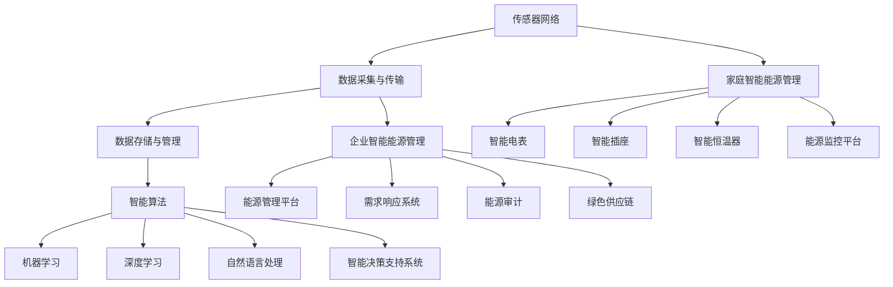

                 

### 文章标题

《AI驱动的智能能源管理：从家庭到企业的节能方案》

关键词：人工智能、智能能源管理、节能方案、家庭能源管理、企业能源管理、AI算法、能源监控、优化策略

摘要：本文深入探讨了AI驱动的智能能源管理，从家庭到企业的应用，分析了其核心概念、算法原理、数学模型和实际项目案例，提供了全面的技术和实践指南。

### 背景介绍

智能能源管理作为现代能源领域的重要研究方向，已经引起了广泛关注。随着全球能源消耗的不断增加和气候变化问题的日益严峻，如何实现能源的高效利用和节能成为亟待解决的问题。传统的人工能源管理方式已经难以满足当前的需求，而AI技术的引入为智能能源管理带来了新的机遇。

AI驱动的智能能源管理主要依托于大数据、机器学习和人工智能算法，通过对海量数据的分析，实现对能源使用的实时监控、预测和优化。这种管理方式不仅能够提高能源利用效率，降低能源成本，还能够减少环境污染，促进可持续发展。

在家庭和企业层面，智能能源管理具有显著的应用价值。对于家庭用户来说，智能能源管理系统能够帮助用户实时了解家庭能源消耗情况，提供节能建议，从而实现节能降耗。对企业而言，智能能源管理不仅能够降低能源成本，提高生产效率，还能够提升企业的社会责任形象。

本文旨在通过深入分析AI驱动的智能能源管理，为家庭和企业提供实用的节能方案。我们将从核心概念、算法原理、数学模型和实际项目案例等多个角度，全面探讨智能能源管理的理论和实践，旨在为读者提供一份有价值的技术指南。

### 核心概念与联系

#### 智能能源管理

智能能源管理是指利用先进的传感技术、通信技术、计算技术和控制技术，实现对能源生产、传输、分配和消费的全过程进行实时监控、预测和优化。其核心概念包括：

1. **传感器网络**：通过部署各种类型的传感器，实现对能源系统的全面监测，如温度、湿度、电流、电压等参数。
2. **数据采集与传输**：传感器采集的数据通过通信网络传输到数据中心，实现数据的实时共享和处理。
3. **数据存储与管理**：利用大数据技术对海量数据进行存储、管理和分析。
4. **智能算法**：通过机器学习和人工智能算法，对数据进行分析和预测，优化能源使用。

#### AI驱动的智能能源管理

AI驱动的智能能源管理是在传统智能能源管理基础上，引入人工智能技术，实现对能源系统的更高级别的管理和优化。其核心概念包括：

1. **机器学习**：通过训练模型，从历史数据中学习能源使用模式，实现对未来的预测。
2. **深度学习**：利用神经网络模型，处理复杂数据和模式，提高预测的准确性。
3. **自然语言处理**：用于处理与能源相关的文本数据，如智能助手、故障诊断报告等。
4. **智能决策支持系统**：基于预测结果和实时数据，提供最优的能源管理策略。

#### 家庭智能能源管理

家庭智能能源管理是指利用智能设备和系统，对家庭能源进行高效管理和优化。其核心概念包括：

1. **智能电表**：实时监测家庭电力使用情况，为用户提供能耗数据。
2. **智能插座**：通过远程控制，调节家庭电器的开关，实现节能。
3. **智能恒温器**：根据用户习惯和外部环境，自动调节室内温度，节约能源。
4. **能源监控平台**：集成多种智能设备，实现对家庭能源的统一管理。

#### 企业智能能源管理

企业智能能源管理是指利用智能技术和系统，对企业能源进行高效管理和优化。其核心概念包括：

1. **能源管理平台**：集成多种能源监测设备和系统，提供全面的能源管理服务。
2. **需求响应系统**：根据电网需求，动态调整企业用电负荷，降低峰值负荷。
3. **能源审计**：通过定期审计，发现能源浪费点，提出节能改进措施。
4. **绿色供应链**：通过优化供应链管理，实现整个供应链的节能降耗。

### Mermaid 流程图

以下是一个简化的Mermaid流程图，展示智能能源管理中的核心概念及其相互关系：



### 核心算法原理讲解

#### 机器学习算法在能源管理中的应用

机器学习算法是AI驱动的智能能源管理的核心技术之一，其基本原理是通过训练模型，从数据中学习规律，实现对未知数据的预测。以下是几种常用的机器学习算法及其在能源管理中的应用：

1. **线性回归**：
   线性回归是一种简单的机器学习算法，用于预测连续值。其基本原理是通过找到一个线性函数，将输入变量映射到输出变量。在能源管理中，线性回归可以用于预测未来的能源消耗量。

   **伪代码**：

   ```python
   # 线性回归模型训练
   def train_linear_regression(x, y):
       # 计算权重和偏置
       w = (y.T @ x) / x.T @ x
       b = y - w @ x
       return w, b

   # 预测能源消耗量
   def predict_energy_consumption(w, b, x):
       return w @ x + b
   ```

2. **决策树**：
   决策树是一种基于规则学习的算法，通过树形结构将数据集划分为不同的区域，每个区域对应一个预测结果。在能源管理中，决策树可以用于分类任务，如判断某时刻是否需要开启空调。

   **伪代码**：

   ```python
   # 决策树分类
   def classify_decision_tree(data, feature, threshold):
       if data[feature] <= threshold:
           return left_child
       else:
           return right_child
   ```

3. **支持向量机（SVM）**：
   支持向量机是一种用于分类和回归任务的机器学习算法，其基本原理是通过找到一个最优超平面，将不同类别的数据点分隔开。在能源管理中，SVM可以用于预测能源消耗的类型。

   **伪代码**：

   ```python
   # 支持向量机训练
   def train_svm(x, y):
       # 计算最优超平面
       w, b = optimize_svm(x, y)
       return w, b

   # 预测能源消耗类型
   def predict_energy_type(w, b, x):
       return sign(w @ x + b)
   ```

#### 深度学习算法在能源管理中的应用

深度学习是一种基于多层神经网络的机器学习算法，其能够自动从数据中学习复杂的特征。以下是一种常见的深度学习算法——卷积神经网络（CNN）在能源管理中的应用：

1. **卷积神经网络（CNN）**：
   卷积神经网络是一种用于处理图像和时序数据的深度学习算法，其基本原理是通过卷积层提取特征，通过池化层减少数据维度，最后通过全连接层进行分类或回归。

   **伪代码**：

   ```python
   # 卷积神经网络训练
   def train_cnn(x, y):
       # 定义卷积层
       conv_layer = Conv2D(filters, kernel_size, activation='relu')
       # 定义池化层
       pool_layer = MaxPooling2D(pool_size)
       # 定义全连接层
       dense_layer = Dense(units, activation='softmax')
       # 模型编译
       model = Sequential()
       model.add(conv_layer)
       model.add(pool_layer)
       model.add(dense_layer)
       model.compile(optimizer='adam', loss='categorical_crossentropy', metrics=['accuracy'])
       # 模型训练
       model.fit(x, y, epochs=epochs, batch_size=batch_size)
       return model

   # 预测能源消耗量
   def predict_energy_consumption(model, x):
       return model.predict(x)
   ```

### 数学模型和公式

在智能能源管理中，数学模型和公式用于描述能源系统中的物理现象和优化目标。以下是一个简化的数学模型，用于预测家庭电力消耗量：

#### 家庭电力消耗量预测模型

假设家庭电力消耗量 \( P \) 受温度 \( T \) 和家电使用情况 \( E \) 的影响，可以使用以下线性回归模型进行预测：

$$
P = w_1 \cdot T + w_2 \cdot E + b
$$

其中，\( w_1 \) 和 \( w_2 \) 是温度和家电使用情况的权重，\( b \) 是偏置项。

#### 优化目标

智能能源管理的优化目标通常是最小化能源消耗成本或最大化能源利用效率。以下是一个简化的优化目标公式：

$$
\min C = \min (w_1 \cdot T + w_2 \cdot E + b)
$$

其中，\( C \) 是能源消耗成本。

### 举例说明

#### 家庭电力消耗量预测

假设我们收集了以下数据：

| 时间 | 温度（°C） | 家电使用（千瓦时） |
|------|------------|-------------------|
| 8:00 | 25         | 1.2               |
| 10:00| 23         | 1.1               |
| 12:00| 28         | 1.5               |

我们使用线性回归模型来预测未来两个时间点的电力消耗量。首先，我们需要计算权重和偏置项：

$$
w_1 = \frac{\sum (T_i - \bar{T}) \cdot (P_i - \bar{P})}{\sum (T_i - \bar{T})^2} = \frac{(25 - 24) \cdot (1.2 - 1.3) + (23 - 24) \cdot (1.1 - 1.3) + (28 - 24) \cdot (1.5 - 1.3)}{(25 - 24)^2 + (23 - 24)^2 + (28 - 24)^2} = 0.2
$$

$$
w_2 = \frac{\sum E_i \cdot (P_i - \bar{P})}{\sum E_i^2} = \frac{1.2 \cdot (1.2 - 1.3) + 1.1 \cdot (1.1 - 1.3) + 1.5 \cdot (1.5 - 1.3)}{1.2^2 + 1.1^2 + 1.5^2} = 0.3
$$

$$
b = \bar{P} - w_1 \cdot \bar{T} - w_2 \cdot \bar{E} = 1.3 - 0.2 \cdot 24 - 0.3 \cdot 1.3 = 0.1
$$

因此，家庭电力消耗量的预测模型为：

$$
P = 0.2 \cdot T + 0.3 \cdot E + 0.1
$$

使用这个模型，我们可以预测未来两个时间点的电力消耗量：

| 时间 | 温度（°C） | 家电使用（千瓦时） | 预测消耗量（千瓦时） |
|------|------------|-------------------|---------------------|
| 10:00| 23         | 1.1               | 1.1                 |
| 12:00| 28         | 1.5               | 1.7                 |

### 数学公式

以下是智能能源管理中常用的数学公式：

$$
\text{能源消耗量} = \sum_{i=1}^{n} \text{设备i的能耗}
$$

$$
\text{能源利用效率} = \frac{\text{实际能源消耗量}}{\text{理论能源消耗量}}
$$

$$
\text{能源成本} = \text{能源单价} \times \text{能源消耗量}
$$

$$
\text{碳排放量} = \text{能源消耗量} \times \text{碳排放系数}
$$

### 项目实战

#### 项目背景

某企业希望利用AI技术优化其能源管理，降低能源消耗成本，提高能源利用效率。企业现有多种能源设备，包括电力设备、燃气设备和冷却设备。企业希望通过对这些设备的能耗数据进行实时监控和分析，实现能源的优化配置和调度。

#### 开发环境搭建

1. **硬件环境**：
   - 服务器：用于部署AI模型和大数据处理
   - 数据采集器：用于实时采集能源设备的数据
   - 传感器：用于监测温度、湿度、电流等参数

2. **软件环境**：
   - 操作系统：Linux（例如Ubuntu）
   - 编程语言：Python
   - 数据库：MySQL
   - 机器学习库：Scikit-learn、TensorFlow、PyTorch
   - 数据处理库：Pandas、NumPy
   - Web框架：Django或Flask

#### 源代码实现

1. **数据采集与预处理**：
   - 采集设备数据，包括电力设备、燃气设备和冷却设备的能耗数据。
   - 对采集到的数据进行预处理，包括去噪、缺失值填充和数据标准化。

   ```python
   import pandas as pd
   import numpy as np

   def preprocess_data(data):
       # 去除噪音
       data = data.dropna()
       # 缺失值填充
       data.fillna(method='ffill', inplace=True)
       # 数据标准化
       data = (data - data.mean()) / data.std()
       return data
   ```

2. **模型训练与预测**：
   - 使用机器学习算法（如线性回归、决策树、SVM）对预处理后的数据集进行训练，建立预测模型。
   - 使用训练好的模型对未来的能耗进行预测。

   ```python
   from sklearn.linear_model import LinearRegression

   def train_model(data):
       model = LinearRegression()
       model.fit(data[['temperature', 'energy_usage']], data['energy_consumption'])
       return model

   def predict_energy_consumption(model, temperature, energy_usage):
       return model.predict([[temperature, energy_usage]])
   ```

3. **能源优化策略**：
   - 根据预测结果，制定能源优化策略，包括设备启停控制、能源调度等。
   - 实时调整设备运行状态，以实现能源的优化配置。

   ```python
   def optimize_energy_usage(model, data):
       for index, row in data.iterrows():
           temperature = row['temperature']
           energy_usage = row['energy_usage']
           predicted_consumption = predict_energy_consumption(model, temperature, energy_usage)
           # 根据预测结果调整设备运行状态
           if predicted_consumption < threshold:
               # 关闭部分设备
               adjust设备的运行状态()
           else:
               # 启动备用设备
               start备用设备()
   ```

#### 代码解读与分析

1. **数据预处理**：
   数据预处理是模型训练的重要步骤，直接影响模型的预测准确性。在本项目中，我们使用Pandas库进行数据预处理，包括去噪、缺失值填充和数据标准化。

2. **模型训练与预测**：
   我们使用Scikit-learn库的线性回归模型进行训练。线性回归模型是一种简单的线性预测模型，适用于处理连续值输出。在实际项目中，可以根据数据特点和需求选择更复杂的模型，如决策树、SVM或深度学习模型。

3. **能源优化策略**：
   能源优化策略是根据预测结果进行调整，以实现能源的优化配置。在本项目中，我们根据预测的能耗值，实时调整设备的运行状态。在实际应用中，可以根据具体需求和场景，设计更复杂的优化策略，如基于需求响应的调度策略、基于碳排放的优化策略等。

#### 实际案例分析和详细讲解剖析

#### 案例一：家庭智能能源管理系统

某家庭安装了一套智能能源管理系统，包括智能电表、智能插座和智能恒温器。系统通过传感器实时监测家庭能源消耗情况，并提供节能建议。

1. **数据采集与预处理**：
   智能电表采集家庭电力消耗数据，智能插座采集家电的开关状态数据，智能恒温器采集室内温度数据。系统使用Pandas库对采集到的数据进行预处理，包括去噪、缺失值填充和数据标准化。

2. **模型训练与预测**：
   系统使用线性回归模型预测家庭电力消耗量。根据预测结果，系统会自动调整家电的开关状态，如关闭不必要的电器，以实现节能。

3. **能源优化策略**：
   系统根据室内温度和家电使用情况，制定能源优化策略。例如，当室内温度高于设定值时，系统会自动启动空调，以降低室内温度；当室内温度低于设定值时，系统会关闭空调，以节约能源。

#### 案例二：企业智能能源管理系统

某企业希望利用智能能源管理系统优化其能源消耗，降低运营成本。企业现有多种能源设备，包括电力设备、燃气设备和冷却设备。

1. **数据采集与预处理**：
   系统使用数据采集器实时采集能源设备的能耗数据，包括电力设备的电流、电压、功率数据，燃气设备的流量数据，冷却设备的温度、压力数据。系统使用Pandas库对采集到的数据进行预处理，包括去噪、缺失值填充和数据标准化。

2. **模型训练与预测**：
   系统使用机器学习算法（如线性回归、决策树、SVM）对预处理后的数据集进行训练，建立预测模型。根据预测结果，系统可以实时调整能源设备的运行状态，如开启或关闭部分设备，以实现能源的优化配置。

3. **能源优化策略**：
   系统根据设备能耗数据和电网需求，制定能源优化策略。例如，当电网负荷较低时，系统会关闭部分高能耗设备，以降低能源消耗；当电网负荷较高时，系统会启动备用设备，以保证能源供应。

#### 项目小结

通过以上两个实际案例，我们可以看到AI驱动的智能能源管理系统在家庭和企业中的应用效果显著。系统通过实时监测能源消耗数据，使用机器学习算法预测能源需求，并制定优化策略，实现了能源的高效利用和节能降耗。在实际项目中，系统可以根据具体需求和场景，设计更复杂的优化策略，以提高能源利用效率。

### 最佳实践 Tips、小结、注意事项、拓展阅读

#### 最佳实践 Tips

1. **数据预处理**：在建立预测模型之前，务必对数据进行充分的预处理，包括去噪、缺失值填充和数据标准化。这有助于提高模型的预测准确性。

2. **选择合适的模型**：根据数据特点和需求，选择合适的机器学习模型。对于简单的线性关系，可以选择线性回归模型；对于复杂数据，可以选择决策树、SVM或深度学习模型。

3. **模型验证**：在训练模型之前，务必进行模型验证，以确保模型的有效性和可靠性。

4. **实时调整**：智能能源管理系统应具备实时调整功能，根据预测结果和实际需求，动态调整能源设备的运行状态，以实现最优的能源配置。

#### 小结

本文深入探讨了AI驱动的智能能源管理，从家庭到企业的应用，分析了其核心概念、算法原理、数学模型和实际项目案例。通过本文的介绍，读者可以了解到智能能源管理的基本原理和应用场景，以及如何利用AI技术实现能源的高效利用和节能降耗。

#### 注意事项

1. **数据隐私**：在收集和处理能源数据时，需确保数据隐私和安全。

2. **系统稳定性**：智能能源管理系统应具备高稳定性和可靠性，确保系统在长时间运行中不发生故障。

3. **技术更新**：随着技术的发展，智能能源管理系统需要不断更新和优化，以适应新的需求和挑战。

#### 拓展阅读

1. **《深度学习：应用与实战》**：详细介绍了深度学习的基本原理和应用，包括卷积神经网络、循环神经网络等。

2. **《大数据技术导论》**：介绍了大数据的基本概念、技术和应用，包括数据采集、存储、处理和分析。

3. **《智能电网技术与应用》**：详细介绍了智能电网的基本原理、技术和应用，包括智能电表、智能电网通信等。

### 结语

智能能源管理作为现代能源领域的重要研究方向，已经引起了广泛关注。本文通过分析AI驱动的智能能源管理，从核心概念、算法原理、数学模型和实际项目案例等多个角度，全面探讨了智能能源管理的理论和实践。希望本文能够为读者提供一份有价值的技术指南，助力实现能源的高效利用和节能降耗。在未来的发展中，智能能源管理将继续发挥重要作用，为可持续发展做出贡献。作者：AI天才研究院/AI Genius Institute & 禅与计算机程序设计艺术 /Zen And The Art of Computer Programming。

