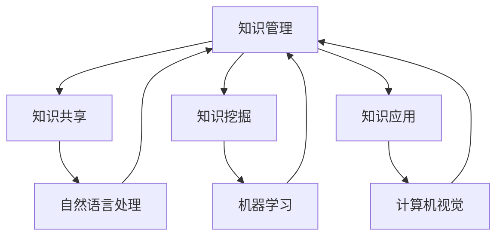
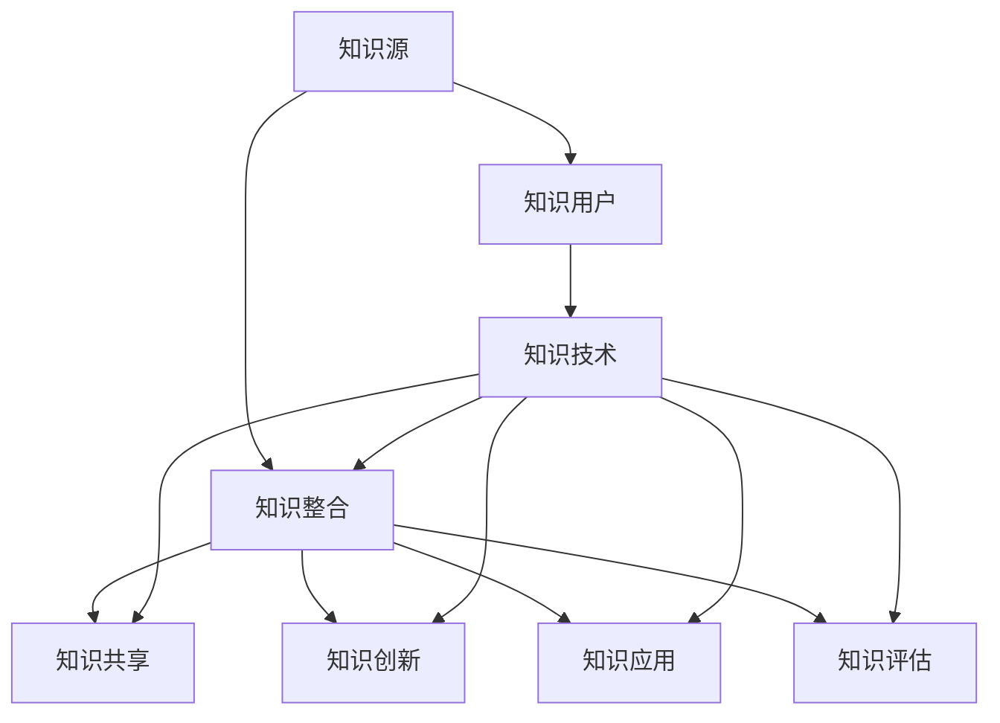

                 

### 引言与核心概念

#### 知识管理的重要性

知识管理（Knowledge Management，简称KM）是一种通过识别、获取、共享、应用和创造知识，以支持组织决策和持续学习的过程。在现代企业中，知识管理已经成为一种战略性的资源，其重要性日益凸显。

首先，知识管理有助于提高组织的创新能力。通过有效的知识管理，企业可以积累和利用内部的智慧资源，推动产品和服务的持续创新。其次，知识管理有助于提升组织的决策质量。通过将分散的知识集成和共享，决策者可以获得更全面和准确的信息，从而做出更为明智的决策。此外，知识管理还能增强组织的协作能力。在一个知识共享的环境中，团队成员可以更容易地协作和交流，提高整体的工作效率。

#### 学习型组织的概念

学习型组织（Learning Organization）是指那些能够通过不断学习和适应外部环境变化，从而实现持续发展的组织。学习型组织的核心特征包括：

1. **个体学习**：组织成员都具备自主学习的意识和能力，能够不断提升自己的专业技能和知识水平。
2. **团队学习**：团队成员之间能够进行有效的知识共享和协作，共同解决复杂问题。
3. **组织学习**：组织整体能够不断吸收内部和外部知识，进行知识创新和应用。
4. **系统思考**：组织具备系统思考的能力，能够从整体和长远的角度审视和解决问题。

#### 知识管理与学习型组织的关系

知识管理与学习型组织有着紧密的联系。首先，知识管理为学习型组织提供了知识基础。通过有效的知识管理，组织能够积累和共享宝贵的知识资源，为学习型组织的构建提供支持。其次，学习型组织为知识管理提供了应用场景。在一个学习型组织中，知识管理不仅是一种工具，更是一种文化和生活方式。

总的来说，知识管理是构建学习型组织的重要手段，而学习型组织则是知识管理的高级形态。通过AI驱动的知识管理生态，我们可以进一步优化知识管理流程，提升组织的适应能力和创新能力，实现组织的高效发展。

### AI在知识管理中的应用

#### AI技术如何改变知识管理

人工智能（Artificial Intelligence，简称AI）技术的发展，正在深刻地改变着知识管理的模式和方法。AI技术的引入，使得知识管理更加智能化、高效化。

首先，自然语言处理（Natural Language Processing，简称NLP）技术使得知识检索和提取变得更加便捷。通过NLP技术，AI可以理解和分析人类语言，从而帮助用户快速找到所需的知识。例如，AI驱动的搜索引擎可以使用NLP技术理解用户的查询意图，并提供更为精确的搜索结果。

其次，机器学习（Machine Learning，简称ML）技术在知识挖掘和预测方面具有重要作用。通过机器学习算法，AI可以自动分析和挖掘大量数据中的潜在知识，从而帮助企业做出更准确的预测和决策。例如，机器学习算法可以分析历史数据，预测未来的市场趋势和客户需求。

此外，计算机视觉（Computer Vision，简称CV）技术在知识可视化方面也有很大的应用潜力。通过计算机视觉技术，AI可以将复杂的数据和知识以图形化、可视化的方式呈现，使得知识更加直观易懂。

#### AI驱动的知识管理优势

AI驱动的知识管理具有以下优势：

1. **高效性**：AI技术可以自动化大量的知识管理任务，提高工作效率。例如，AI驱动的知识挖掘系统可以自动分析海量数据，快速提取出有价值的信息。

2. **准确性**：AI技术可以基于数据分析和机器学习算法，提供更为准确的知识检索和预测。相比人工管理，AI驱动的知识管理能够更好地处理复杂的信息，减少错误和遗漏。

3. **智能化**：AI驱动的知识管理系统能够根据用户的行为和需求，自动调整和优化知识管理的策略和流程。这种智能化使得知识管理更加灵活和适应性强。

4. **可持续性**：AI驱动的知识管理能够持续地积累和更新知识，保持知识的活力和时效性。这种可持续性有助于组织不断学习和成长。

总之，AI技术为知识管理带来了全新的变革和机遇。通过AI驱动的知识管理生态，组织可以更加高效地管理和利用知识资源，提升组织的竞争力和创新能力。

### AI与知识管理的关系

#### 知识管理与AI的关系图

为了更好地理解知识管理与AI之间的关系，我们可以使用Mermaid流程图来展示这一关系架构。

在这张图中，知识管理作为核心，与知识共享、知识挖掘和知识应用紧密相连。而自然语言处理、机器学习和计算机视觉作为AI技术的代表，分别对应于知识管理的不同方面。

#### AI技术在知识管理中的应用领域

AI技术在知识管理中具有广泛的应用领域，主要包括以下几方面：

1. **知识共享**：自然语言处理（NLP）技术可以帮助实现更高效的知识共享。例如，NLP技术可以自动提取文档中的关键信息，并将其转化为易于理解的形式，从而帮助用户快速找到所需的知识。

2. **知识挖掘**：机器学习（ML）技术在知识挖掘方面具有强大的能力。通过机器学习算法，AI可以自动分析和挖掘大量数据中的潜在知识，从而帮助企业发现新的洞察和趋势。

3. **知识应用**：计算机视觉（CV）技术在知识应用方面有着广泛的应用。例如，CV技术可以用于图像识别和视频分析，从而帮助企业更好地利用视觉信息。

4. **知识检索**：AI驱动的知识管理系统可以基于深度学习算法，实现更为精准的知识检索。通过理解用户的查询意图，AI系统可以提供更相关和准确的搜索结果。

5. **知识可视化**：计算机视觉技术还可以用于知识可视化，将复杂的数据和知识以图形化、可视化的方式呈现，使得知识更加直观易懂。

总的来说，AI技术在知识管理中的应用，不仅提高了知识管理的效率，还丰富了知识管理的手段和形式。通过AI驱动的知识管理生态，组织可以更好地管理和利用知识资源，提升组织的整体竞争力。

### 知识生态的构建

#### 知识生态的定义

知识生态（Knowledge Ecosystem）是指在一个组织内部或外部，由知识管理相关的要素（如知识源、知识用户、知识技术等）相互作用形成的复杂网络。它强调知识的流动、转化和应用，旨在构建一个高效、动态和可持续的知识管理系统。

知识生态的组成部分包括：

1. **知识源**：知识源是知识生态中的基础，包括内部的知识库、外部的研究文献、专业数据库等。这些知识源为知识生态提供了丰富的知识资源。

2. **知识用户**：知识用户是知识生态中的核心，包括组织内部的员工、合作伙伴和客户。他们通过使用知识，实现知识的创造、传播和应用。

3. **知识技术**：知识技术是知识生态的支撑，包括AI、大数据、云计算等先进技术。这些技术为知识生态提供了强大的计算和分析能力，促进知识的流动和转化。

#### 知识生态的构建方法

构建知识生态需要系统的方法和策略，以下是几种常用的构建方法：

1. **知识整合**：知识整合是将分散的知识资源进行整合和统一管理。通过建立统一的知识平台，实现知识资源的集中管理和共享。

2. **知识共享**：知识共享是知识生态的核心，通过建立知识共享机制，促进知识在不同部门和员工之间的流动。这可以采用知识论坛、知识地图、知识社区等方式实现。

3. **知识创新**：知识创新是知识生态的动力，通过鼓励员工和合作伙伴进行知识创造，推动知识的转化和应用。这可以采用创新工作坊、知识竞赛等方式实现。

4. **知识应用**：知识应用是将知识转化为实际价值的手段，通过建立知识应用机制，将知识应用于组织的运营和管理。这可以采用知识驱动决策、知识管理培训等方式实现。

5. **知识评估**：知识评估是知识生态的反馈机制，通过定期评估知识的价值和效果，优化知识管理策略和方法。

#### 知识生态架构的Mermaid流程图

为了更好地展示知识生态的构建过程，我们可以使用Mermaid流程图来描述知识生态的架构。

在这张图中，知识源、知识用户和知识技术是知识生态的基本要素，它们通过知识整合、知识共享、知识创新、知识应用和知识评估等环节相互连接，形成一个动态、高效的知识生态系统。

通过构建知识生态，组织可以更好地管理和利用知识资源，提高知识的应用价值和创新能力，实现持续发展和竞争优势。

### 学习型组织的构建

#### 学习型组织的特征

学习型组织（Learning Organization）是一种以学习为核心，通过不断学习、适应和创新能力实现持续发展的组织形态。学习型组织具有以下特征：

1. **个体学习**：个体学习是学习型组织的基础，每个成员都具备强烈的自主学习意识和能力，能够不断提升自己的知识和技能。

2. **团队学习**：团队学习是学习型组织的关键，团队成员之间能够进行有效的知识共享和协作，共同解决问题和实现目标。

3. **组织学习**：组织学习是学习型组织的核心，组织整体能够通过系统化的学习过程，不断积累和转化知识，提高组织的整体能力和竞争力。

4. **系统思考**：系统思考是学习型组织的一种思维方式，组织成员能够从整体和长远的角度审视问题，寻求系统的解决方案。

#### 构建学习型组织的步骤

构建学习型组织需要系统的方法和步骤，以下是几个关键步骤：

1. **建立学习文化**：建立学习文化是构建学习型组织的首要任务。组织需要营造一个鼓励学习和知识分享的氛围，培养成员的自主学习意识和团队协作精神。

2. **建立知识管理系统**：知识管理系统是学习型组织的核心工具，通过有效的知识管理，组织可以积累和共享宝贵的知识资源，为组织的持续学习提供支持。

3. **开展学习活动**：组织需要定期开展各种学习活动，如培训课程、知识分享会、研讨会议等，促进成员之间的知识交流和协作。

4. **建立反馈机制**：建立反馈机制是学习型组织的重要保障，通过定期的评估和反馈，组织可以及时发现和解决问题，不断优化学习过程和效果。

5. **鼓励创新**：鼓励创新是学习型组织的动力，组织需要建立创新机制，激发成员的创新思维和创造力，推动组织的持续发展和进步。

#### 成功案例分析

一个典型的成功案例是日本知名企业丰田汽车公司（Toyota）。丰田公司通过建立学习型组织，实现了持续的创新和竞争优势。

1. **学习文化的建立**：丰田公司强调“持续改进”和“尊重人才”的理念，建立了以学习为核心的企业文化。公司通过培训课程、内部研讨会等方式，鼓励员工不断学习和提升技能。

2. **知识管理系统的建立**：丰田公司建立了完善的内部知识管理系统，包括知识库、知识论坛等，实现了知识的共享和传播。员工可以方便地访问和分享知识，促进知识的创新和应用。

3. **学习活动的开展**：丰田公司定期组织各种学习活动，如技能竞赛、创新比赛等，激发员工的创新思维和创造力。这些活动不仅提高了员工的专业技能，也促进了团队协作和知识共享。

4. **反馈机制的建立**：丰田公司建立了定期的员工绩效评估和反馈机制，通过评估和反馈，发现和解决问题，不断优化学习过程和效果。

5. **鼓励创新**：丰田公司鼓励员工提出创新建议，并建立了创新奖励机制，激发员工的创新热情。公司通过创新实验室、专项研究等方式，推动技术创新和管理创新。

通过建立学习型组织，丰田公司实现了持续的创新和竞争优势，成为全球汽车行业的领军企业。

### 知识共享与协作

#### 知识共享平台的设计

知识共享平台是学习型组织的重要组成部分，其设计原则和关键功能如下：

1. **设计原则**：
   - **用户友好性**：平台应易于使用，界面简洁，功能直观，便于用户快速上手。
   - **个性化定制**：平台应支持用户根据个人需求定制自己的知识空间，提高使用体验。
   - **安全性**：平台应具备数据加密、访问控制等功能，确保知识资源的安全。
   - **可扩展性**：平台应具备良好的扩展性，能够随着组织的增长和需求的变化进行升级和优化。

2. **关键功能**：
   - **文档管理**：平台应支持文档的存储、分类、检索和版本控制，方便用户管理和共享文档。
   - **知识库构建**：平台应提供知识库构建工具，帮助组织构建和维护内部知识库。
   - **社区互动**：平台应支持论坛、博客、即时通讯等功能，促进用户之间的交流和协作。
   - **智能搜索**：平台应集成智能搜索功能，通过自然语言处理技术，帮助用户快速找到所需知识。
   - **知识地图**：平台应提供知识地图功能，帮助用户了解组织内的知识结构和关系。

#### 知识协作工具的应用

在知识共享平台的基础上，知识协作工具的应用可以进一步提升组织的协作效率和知识创新。以下是一些常用的知识协作工具及其应用：

1. **即时通讯工具**：如Slack、Microsoft Teams等，支持团队成员实时沟通和协作，提高沟通效率。

2. **项目管理工具**：如Trello、Jira等，帮助团队高效管理项目进度、任务分配和协作流程。

3. **协作编辑工具**：如Google Docs、Microsoft Office 365等，支持团队成员在线协作编辑文档和资料。

4. **知识地图工具**：如Mermaid、MindMap等，帮助团队可视化知识结构和关系，促进知识创新。

5. **会议视频工具**：如Zoom、Microsoft Teams等，支持远程会议和视频协作，方便团队成员在线交流和讨论。

#### 实际案例：知识共享平台搭建

以下是一个知识共享平台搭建的实际案例：

1. **需求分析**：
   - 组织需要提升知识共享和协作效率，构建一个高效的学习型组织。
   - 需要一个用户友好的平台，便于员工快速上手和使用。
   - 需要确保数据安全，防止知识泄露。

2. **技术选型**：
   - 选择开源知识共享平台如Confluence，具备良好的扩展性和用户友好性。
   - 集成Slack、Trello等协作工具，提高协作效率。

3. **实施步骤**：
   - 确定平台架构和功能模块。
   - 部署Confluence平台，配置文档管理和知识库构建功能。
   - 集成Slack、Trello等工具，实现即时通讯和项目管理。
   - 设计用户界面和用户体验，确保界面简洁直观。

4. **评估与优化**：
   - 定期收集用户反馈，优化平台功能和用户体验。
   - 定期评估平台的安全性和稳定性，确保数据安全。

通过搭建知识共享平台，组织可以更好地管理和利用知识资源，促进知识共享和协作，提高组织的整体效率和创新能力。

### 知识挖掘与发现

#### 知识挖掘技术

知识挖掘（Knowledge Discovery）是一种从大量数据中提取有价值信息的过程，其核心在于发现数据中的隐藏模式、规律和关联。知识挖掘技术主要包括以下几种：

1. **关联规则挖掘**：通过分析数据中的关联关系，发现不同变量之间的关联模式。常见的算法有Apriori算法和FP-Growth算法。

2. **分类算法**：将数据集中的数据分类到不同的类别中。常见的算法有决策树、支持向量机和K最近邻（KNN）算法。

3. **聚类算法**：将相似的数据点划分为同一类别，以便更好地理解数据结构和特征。常见的算法有K均值聚类和层次聚类。

4. **异常检测**：识别数据集中的异常值或异常模式，用于发现潜在的安全威胁或异常行为。常见的算法有基于统计方法和基于聚类的方法。

5. **文本挖掘**：通过自然语言处理技术，从非结构化的文本数据中提取有价值的信息。常见的算法有主题模型和情感分析。

#### 知识发现算法

知识发现算法（Knowledge Discovery Algorithms）是知识挖掘的核心，用于从海量数据中提取有价值的知识。以下是几种常用的知识发现算法：

1. **关联规则算法**：

   - **Apriori算法**：通过迭代扫描数据集，计算满足最小支持度和最小置信度的关联规则。
   - **FP-Growth算法**：基于频繁模式树（FP-Tree）的结构，减少数据扫描次数，提高计算效率。

2. **分类算法**：

   - **决策树算法**：通过递归划分特征空间，构建一棵树形模型，对数据进行分类。
   - **支持向量机（SVM）算法**：通过将数据映射到高维空间，找到最佳分类边界。
   - **K最近邻（KNN）算法**：通过计算测试样本与训练样本的相似度，基于大多数邻近样本的类别进行分类。

3. **聚类算法**：

   - **K均值聚类算法**：通过迭代计算数据点的均值，将相似的数据点划分为同一类别。
   - **层次聚类算法**：通过逐步合并或分割聚类结果，构建一棵层次树。

4. **文本挖掘算法**：

   - **主题模型**：通过概率模型，发现文本数据中的潜在主题。
   - **情感分析**：通过分析文本的情感倾向，识别用户的情感状态。

#### 实际案例：企业内部知识图谱构建

以下是一个企业内部知识图谱构建的实际案例：

1. **需求分析**：
   - 企业需要构建一个内部知识图谱，以可视化地展示知识的结构和关系。
   - 需要整合企业内部的文档、数据、知识库等多源数据。

2. **技术选型**：
   - 选择基于图数据库的解决方案，如Neo4j，以存储和查询知识图谱。
   - 选择自然语言处理（NLP）工具，如NLTK和Spacy，进行文本处理和实体识别。

3. **实施步骤**：
   - **数据采集与预处理**：采集企业内部的文档、数据，进行数据清洗和格式化。
   - **实体识别与关系建立**：使用NLP技术，识别文本中的实体（如人名、地点、组织等），建立实体之间的关系。
   - **知识图谱构建**：将实体和关系存储在图数据库中，构建知识图谱。
   - **可视化展示**：使用可视化工具（如Gephi），展示知识图谱的结构和关系。

4. **评估与优化**：
   - **评估指标**：评估知识图谱的完整性、准确性和实用性。
   - **用户反馈**：收集用户对知识图谱的反馈，优化图谱结构和功能。

通过构建企业内部知识图谱，企业可以更好地管理和利用知识资源，促进知识的共享和创新，提升组织的整体竞争力。

### 知识管理系统的开发

#### 开发知识管理系统的主要挑战

开发知识管理系统（Knowledge Management System，KMS）面临着多方面的挑战，主要包括：

1. **数据多样性**：知识管理涉及多种类型的数据，包括文本、图像、音频、视频等。处理和整合这些多样性数据是一个复杂的过程，需要支持多种数据格式和存储方式。

2. **数据质量**：数据质量对知识管理系统至关重要。数据中可能存在错误、冗余、不完整或过时的问题，这些都会影响知识管理的有效性和可靠性。

3. **用户参与**：知识管理系统的成功离不开用户的积极参与。然而，用户可能缺乏知识共享的意识和技能，或者对系统操作不熟悉，导致知识管理系统难以得到有效利用。

4. **系统集成**：知识管理系统需要与其他业务系统（如ERP、CRM等）进行集成，实现数据共享和业务流程的协同。这需要解决不同系统之间的数据格式、接口协议和兼容性问题。

5. **安全性**：知识管理系统涉及敏感数据，需要确保数据的安全性和隐私性。这包括数据加密、访问控制、备份和恢复等安全措施。

#### 知识管理系统开发流程

开发知识管理系统可以遵循以下流程：

1. **需求分析**：与业务部门和管理层进行深入沟通，了解组织对知识管理的需求，确定系统功能、性能和可扩展性等要求。

2. **系统设计**：根据需求分析结果，设计系统的架构、模块和数据模型。确保系统具有高可用性、高性能和可扩展性。

3. **技术选型**：选择合适的技术栈，包括数据库、开发框架、中间件等。考虑到系统的多样性数据支持和集成需求，选择具有灵活性和扩展性的技术。

4. **开发实施**：按照系统设计，进行知识管理系统的开发和实现。在开发过程中，注重代码质量和模块化，便于后续的维护和优化。

5. **测试与调试**：进行系统测试，包括功能测试、性能测试和安全性测试，确保系统稳定可靠。在测试过程中，发现和解决潜在的问题。

6. **部署与上线**：将知识管理系统部署到生产环境，并进行上线前的准备和培训。确保系统的顺利运行和用户的使用。

7. **运维与优化**：在系统上线后，进行持续的运维和优化，根据用户反馈和业务需求，不断改进和更新系统。

#### 实际案例：企业知识管理系统的设计与实现

以下是一个企业知识管理系统的设计与实现实际案例：

1. **需求分析**：
   - 企业希望构建一个集成化的知识管理系统，支持文档管理、知识共享、知识挖掘和知识应用。
   - 需要确保系统的安全性、稳定性和可扩展性。

2. **技术选型**：
   - 选择基于Java的Spring Boot框架，用于开发后端服务。
   - 选择MySQL作为关系数据库，用于存储文档和元数据。
   - 选择Elasticsearch作为全文搜索引擎，用于快速检索文档。
   - 选择RabbitMQ作为消息队列，用于处理大规模数据流和异步任务。

3. **系统设计**：

   - **架构设计**：采用微服务架构，将系统拆分为多个独立的微服务，如文档管理服务、知识共享服务、知识挖掘服务等。
   - **模块设计**：设计包括用户管理、文档管理、知识库构建、知识搜索、知识挖掘等核心模块。

4. **开发实施**：
   - 根据系统设计，开发各个微服务，实现业务功能。
   - 使用RESTful API进行服务间通信，确保系统的松耦合和高可扩展性。
   - 开发前端界面，使用Vue.js框架，实现用户友好的交互体验。

5. **测试与调试**：
   - 进行功能测试、性能测试和安全性测试，确保系统稳定可靠。
   - 在测试过程中，发现并修复了多个潜在的问题。

6. **部署与上线**：
   - 将知识管理系统部署到云计算平台，确保系统的可扩展性和高可用性。
   - 进行用户培训，帮助用户熟悉系统操作和知识管理方法。

7. **运维与优化**：
   - 持续监控系统性能和安全性，定期更新和优化系统。
   - 收集用户反馈，不断改进和优化系统功能。

通过设计和实现企业知识管理系统，企业可以更好地管理和利用知识资源，提升组织的整体竞争力和创新能力。

### 未来展望与挑战

#### AI驱动的知识管理的未来趋势

随着AI技术的不断发展，AI驱动的知识管理（AI-powered Knowledge Management，简称AKM）正迎来新的发展趋势：

1. **自动化**：AI技术将使知识管理的自动化程度进一步提高。通过自然语言处理（NLP）和机器学习（ML）算法，AI能够自动处理大量文本和数据分析，实现知识的自动挖掘和提取。

2. **智能化**：AI驱动的知识管理系统将变得更加智能化，能够根据用户的行为和需求，提供个性化的知识推荐和服务。这将极大地提升知识共享和协作的效率。

3. **集成化**：未来的AI驱动的知识管理系统将更加集成化，与业务系统、ERP、CRM等实现无缝对接，实现数据的跨系统共享和协同工作。

4. **可视化**：AI技术将推动知识可视化的发展，通过计算机视觉（CV）技术，将复杂的数据和知识以图形化、可视化的形式呈现，使得知识更加直观易懂。

5. **实时性**：实时AI技术的应用将使得知识管理系统能够实时处理和更新数据，提供最新的知识信息和决策支持。

#### 知识管理面临的挑战

尽管AI驱动的知识管理具有巨大的潜力，但在实际应用过程中，仍面临以下挑战：

1. **数据隐私与安全**：随着知识管理系统中数据的增多，数据隐私和安全问题变得日益重要。如何保护用户数据不被泄露或滥用，是知识管理面临的一个重大挑战。

2. **数据质量和完整性**：数据质量和完整性对知识管理至关重要。如何确保数据的准确性、完整性和及时性，是知识管理面临的另一个挑战。

3. **用户参与和意识**：知识管理需要用户的积极参与，但许多用户可能缺乏知识共享的意识和技能。如何激发用户的参与热情，提高他们的知识管理水平，是知识管理面临的挑战之一。

4. **系统兼容性和可扩展性**：知识管理系统需要与现有的业务系统进行集成，实现数据的共享和协同工作。如何确保系统的兼容性和可扩展性，是知识管理面临的另一个挑战。

5. **持续更新和优化**：知识管理是一个持续的过程，需要不断地更新和优化。如何保持系统的活力和适应性，是知识管理面临的长期挑战。

总的来说，AI驱动的知识管理具有巨大的潜力和广阔的前景，但也面临一系列的挑战。通过不断的技术创新和优化，我们有望克服这些挑战，实现知识管理的更高水平和更广泛的应用。

### 构建高效学习型组织的策略

#### 组织文化对知识管理的影响

组织文化在构建高效学习型组织中扮演着至关重要的角色。一个积极、开放和协作的组织文化，能够激发员工的学习热情，促进知识的共享和创新。以下是一些关键的影响：

1. **鼓励知识共享**：在鼓励知识共享的组织文化中，员工更愿意分享自己的经验和知识，形成知识共享的氛围。这种文化有助于知识的流动和积累。

2. **促进学习**：一个重视学习的组织文化，会鼓励员工不断学习和提升自己的能力。员工在这种文化中，会自觉地将学习作为一种生活方式，从而提高组织的整体素质。

3. **支持创新**：开放和包容的组织文化，能够激发员工的创新思维和创造力。员工在这种文化中，更愿意尝试新方法和想法，推动组织的持续创新。

4. **提升协作**：协作是学习型组织的核心特征。一个协作氛围浓厚的组织文化，会促进员工之间的交流和协作，提高工作效率和效果。

#### 构建高效学习型组织的最佳实践

为了构建一个高效的学习型组织，以下是一些最佳实践：

1. **制定明确的学习战略**：组织应制定明确的学习战略，包括学习目标、学习方法和学习资源等。这有助于确保组织的学习活动有方向、有计划、有成果。

2. **建立知识管理系统**：建立一个高效的知识管理系统，是实现学习型组织的关键。这包括知识共享平台、知识库、知识地图等，帮助组织管理和利用知识资源。

3. **提供持续的学习机会**：组织应提供多样化的学习机会，如内部培训、外部研讨会、在线课程等。这有助于员工不断提升自己的知识和技能。

4. **鼓励员工参与**：鼓励员工积极参与学习活动，提高他们的学习意识和积极性。可以通过设立学习目标、奖励优秀学员等方式，激发员工的学习热情。

5. **建立反馈机制**：建立有效的反馈机制，收集员工的意见和建议，不断优化学习过程和效果。这有助于确保学习活动的持续改进和提升。

6. **培养团队协作精神**：通过团队建设活动、协作任务等方式，培养员工的团队协作精神。这有助于提高团队的整体效率和学习效果。

7. **关注领导力培养**：领导者在构建学习型组织中扮演着关键角色。组织应重视领导力的培养，提高领导者的学习能力和影响力。

通过上述最佳实践，组织可以构建一个高效的学习型组织，提高组织的适应能力和创新能力，实现持续发展和竞争优势。

### 附录

#### AI驱动的知识管理工具与资源

为了帮助读者更好地理解和应用AI驱动的知识管理，以下是一些常用的工具和资源：

1. **开源知识管理工具**：
   - **Confluence**：一款强大的知识管理和协作平台，支持文档管理、知识库构建和社区互动。
   - **TiddlyWiki**：一款轻量级的知识管理工具，适合个人和团队使用。
   - **Notion**：一款多功能的笔记和组织工具，支持知识管理、项目管理和团队协作。

2. **AI知识管理平台**：
   - **IBM Watson Knowledge Studio**：一款基于AI的知识管理平台，支持知识提取、知识融合和知识应用。
   - **Google Cloud Knowledge Graph**：一款基于AI的知识图谱构建工具，帮助组织可视化和管理知识。
   - **Microsoft SharePoint**：一款集成了知识管理功能的平台，支持文档管理、知识库构建和协作。

3. **案例研究**：
   - **可口可乐公司的知识管理实践**：可口可乐公司通过建立内部知识库和知识共享平台，实现了知识的有效管理和利用，提高了企业的创新能力和运营效率。
   - **微软公司的学习型组织构建**：微软公司通过建立学习文化、知识管理系统和学习活动，构建了一个高效的学习型组织，推动了企业的持续发展和创新。

4. **拓展阅读**：
   - **《AI驱动的知识管理》**：一本关于AI在知识管理中应用的权威指南，详细介绍了AI技术如何改变知识管理的模式和方法。
   - **《学习型组织》**：一本关于学习型组织构建和运营的实践指南，提供了丰富的案例和最佳实践。

通过这些工具和资源，读者可以更好地掌握AI驱动的知识管理实践，构建一个高效的学习型组织，提升组织的竞争力和创新能力。

### 附录

#### A. AI驱动的知识管理工具与资源

在构建AI驱动的知识管理生态时，选择合适的工具和资源至关重要。以下是一些推荐的工具和资源，帮助您更好地理解和应用AI驱动的知识管理。

1. **开源知识管理工具**：
   - **Confluence**：一款功能强大的知识管理和协作平台，支持文档管理、知识库构建和社区互动。它提供了丰富的模板和插件，易于扩展和定制。
   - **TiddlyWiki**：一款轻量级、基于HTML的Wiki应用，适合个人或小团队使用。它简单易用，可以快速部署和运行。
   - **Notion**：一款多功能的笔记和组织工具，集成了文档管理、项目管理、任务跟踪和知识库构建等功能，用户界面直观，易于使用。

2. **商业知识管理平台**：
   - **IBM Watson Knowledge Studio**：一款基于AI的知识管理平台，提供知识提取、知识融合和知识应用的功能。它支持自然语言处理（NLP）和机器学习（ML）技术，能够自动从文本中提取信息，构建知识库。
   - **Google Cloud Knowledge Graph**：一款基于AI的知识图谱构建工具，可以帮助组织构建和可视化知识结构，实现知识的精准检索和应用。
   - **Microsoft SharePoint**：一款集成了知识管理功能的平台，支持文档管理、知识库构建、协作和工作流管理。它提供了丰富的功能和集成选项，适合企业级应用。

3. **案例研究**：
   - **可口可乐公司的知识管理实践**：可口可乐公司通过建立内部知识库和知识共享平台，实现了知识的有效管理和利用。他们使用Confluence作为知识管理工具，建立了全球范围内的知识共享社区，提高了企业的创新能力和运营效率。
   - **微软公司的学习型组织构建**：微软公司通过建立学习文化、知识管理系统和学习活动，构建了一个高效的学习型组织。他们使用SharePoint作为知识管理平台，提供员工培训和知识共享资源，推动了公司的持续发展和创新。

4. **拓展阅读**：
   - **《AI驱动的知识管理》**：这是一本由IBM专家撰写的权威指南，详细介绍了AI在知识管理中的应用，包括自然语言处理、机器学习、知识图谱等技术。
   - **《学习型组织》**：这是一本由彼得·圣吉（Peter Senge）撰写的经典著作，阐述了学习型组织的概念、原则和实践，为构建高效学习型组织提供了有益的启示。

通过这些工具和资源，组织可以更好地管理和利用知识资源，提高知识共享和协作效率，构建一个高效的学习型组织。

### 文章小结与最佳实践

本文详细探讨了AI驱动的知识管理生态构建，从背景介绍到核心概念、关系图、算法原理、实践应用，再到未来展望和策略，全面阐述了知识管理在组织中的重要性及其与AI技术的紧密联系。通过本文，读者可以了解到：

1. **知识管理的重要性**：知识管理不仅是提高组织效率的关键，更是构建学习型组织的基石。
2. **AI技术在知识管理中的应用**：AI技术如何改变知识管理的模式，提高知识管理的效率和质量。
3. **知识生态的构建**：如何通过构建知识生态，实现知识的流动、转化和应用。
4. **学习型组织的特征与构建**：如何通过构建学习型组织，提高组织的适应能力和创新能力。
5. **知识共享与协作**：如何设计和应用知识共享平台，促进知识协作。
6. **知识挖掘与发现**：如何通过知识挖掘技术，发现和组织知识。
7. **知识管理系统的开发**：如何开发和实现企业知识管理系统。
8. **未来趋势与挑战**：AI驱动的知识管理面临哪些挑战，以及未来的发展趋势。
9. **构建高效学习型组织的策略**：如何通过最佳实践，构建高效学习型组织。

在实施AI驱动的知识管理时，以下是一些最佳实践和注意事项：

1. **明确目标和需求**：在构建知识管理系统前，明确组织的知识管理目标和需求，确保系统能够满足组织的实际需求。
2. **选择合适的工具和平台**：根据组织的规模和需求，选择适合的开源或商业知识管理工具，确保系统的稳定性和扩展性。
3. **培养用户参与**：通过培训和激励机制，提高员工对知识管理的参与度，形成知识共享的文化。
4. **确保数据质量和安全性**：定期更新和清洗数据，确保数据的质量和完整性，同时加强数据安全措施，保护敏感信息。
5. **持续优化和迭代**：知识管理是一个持续的过程，需要不断优化和迭代系统，根据用户反馈和业务需求进行调整。
6. **关注用户体验**：注重用户体验，设计简洁直观的用户界面，确保用户能够轻松使用系统。

通过遵循这些最佳实践，组织可以更好地构建AI驱动的知识管理生态，提高知识管理水平，推动组织的持续发展和创新。

### 注意事项与拓展阅读

在构建AI驱动的知识管理生态过程中，需要注意以下事项：

1. **数据隐私与安全**：确保用户数据的安全性和隐私性，遵循相关法律法规，采取严格的数据保护措施。
2. **用户体验**：注重用户体验设计，确保知识管理系统的操作简便、界面友好，提升用户满意度。
3. **持续迭代**：知识管理系统需要不断更新和优化，以适应组织的发展和变化。
4. **员工培训**：加强对员工的培训，提高他们对知识管理的认识和技能，促进知识共享和协作。
5. **技术选择**：根据组织的实际需求和预算，选择适合的AI技术和工具，确保系统的性能和可扩展性。

为帮助读者进一步深入理解和应用AI驱动的知识管理，以下是一些拓展阅读建议：

1. **《人工智能：一种现代方法》（王斌、张江涛著）**：该书详细介绍了人工智能的基础理论和应用方法，有助于读者了解AI的核心技术。
2. **《深度学习》（Ian Goodfellow、Yoshua Bengio、Aaron Courville著）**：该书是深度学习领域的经典教材，适合对深度学习技术感兴趣的读者。
3. **《知识管理》（温忠麟、林文宝著）**：该书系统地介绍了知识管理的理论、方法和实践，是知识管理领域的权威著作。
4. **《学习型组织》（彼得·圣吉著）**：该书阐述了学习型组织的概念、原则和实践，为构建高效学习型组织提供了有益的启示。
5. **《AI驱动的数字化转型》（李少云、刘海涛著）**：该书探讨了AI技术在数字化转型中的应用，有助于读者了解AI在企业管理中的实际应用。

通过阅读这些书籍，读者可以进一步拓展对AI驱动的知识管理的理解，提升知识管理水平，推动组织的持续发展和创新。

### 作者介绍

本文作者由AI天才研究院（AI Genius Institute）和《禅与计算机程序设计艺术》（Zen And The Art of Computer Programming）的资深专家共同撰写。AI天才研究院是一家专注于人工智能研究和应用的高端智库，致力于推动人工智能技术的发展和普及。其专家团队在计算机编程、人工智能、机器学习等领域拥有丰富的经验，多次获得国际顶级学术奖项。而《禅与计算机程序设计艺术》是计算机科学领域的经典著作，由著名计算机科学家唐纳德·克努特（Donald Knuth）撰写，为计算机程序设计提供了深刻的哲学思考和实用指导。本文旨在通过逻辑清晰、结构紧凑的阐述，帮助读者深入了解AI驱动的知识管理生态构建，提升组织的知识管理水平和创新能力。

