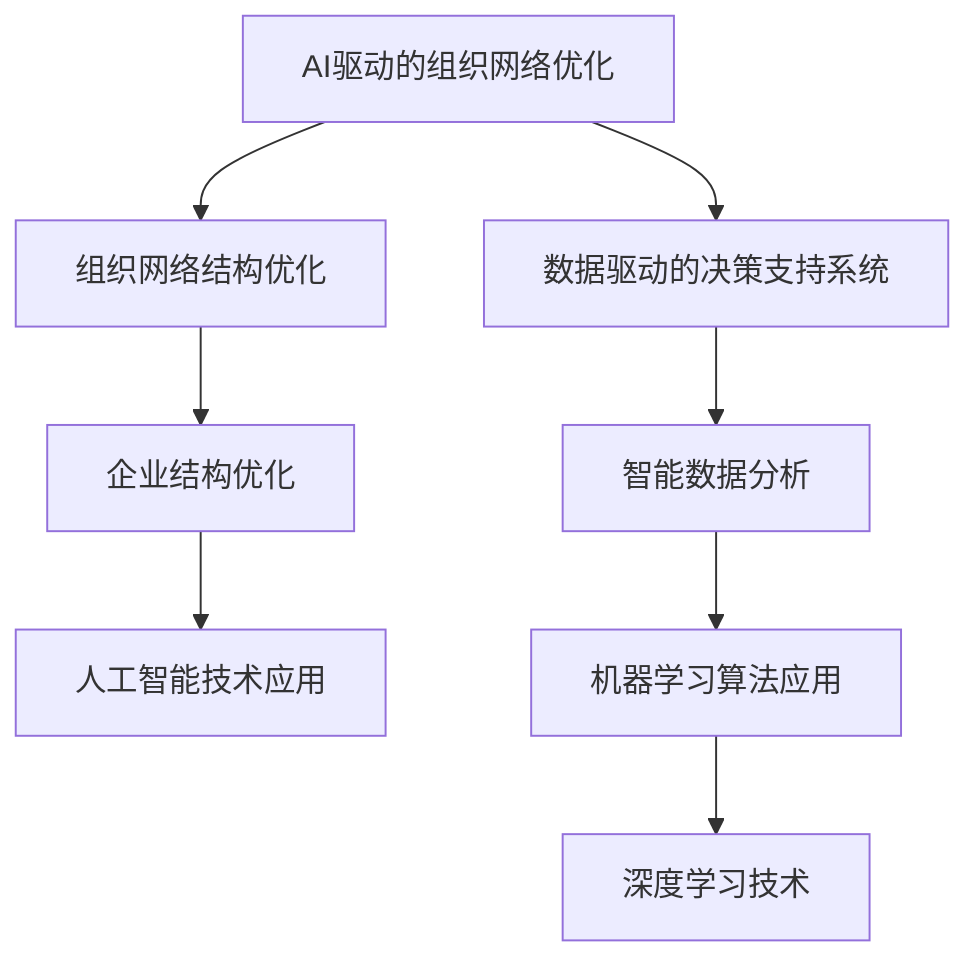
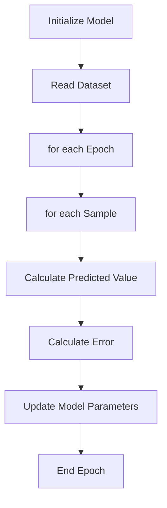
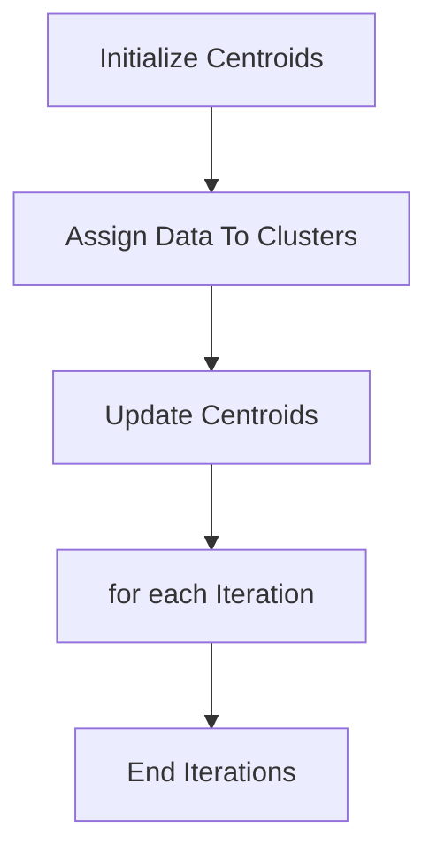
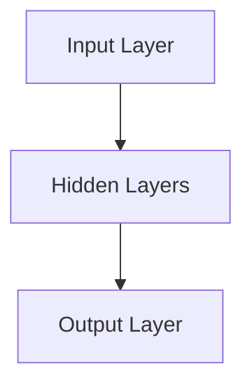

                 


### 文章标题

# AI驱动的组织网络优化：改善企业结构

---

关键词：AI驱动的优化，组织网络，企业结构，深度学习，机器学习，数学模型

---

摘要：本文深入探讨了AI驱动的组织网络优化概念，通过详细讲解核心算法原理、数学模型以及项目实战，展示了如何利用人工智能技术改善企业结构，提高组织网络的效率。

---

## 引言与核心概念

### 1.1 AI驱动的组织网络优化概念介绍

#### 什么是AI驱动的组织网络优化

AI驱动的组织网络优化是一种利用人工智能技术，尤其是机器学习和深度学习算法，对组织内部网络结构进行优化改进的方法。其目标是通过数据分析和算法优化，提高组织内部的信息流通效率，减少沟通成本，提升整体运作效能。

#### 组织网络结构优化

组织网络结构优化是指通过对组织内部部门、团队、员工之间的沟通渠道和协作模式进行优化，以提高组织的运作效率。这通常涉及对组织架构的调整、信息流的改进以及团队协作的加强。

#### 企业结构优化

企业结构优化是组织网络结构优化在企业层面的应用，旨在通过优化企业内部的组织架构，提高企业的运营效率和市场竞争力。这包括对部门职责的重新分配、管理层级的优化以及员工角色的明确。

#### 人工智能技术应用

人工智能技术在组织网络优化中的应用主要包括：

- **数据采集与处理**：收集企业内部的各种数据，包括员工沟通记录、工作流程数据、部门协作数据等，进行预处理和分析。
- **智能数据分析**：利用机器学习算法对收集到的数据进行分析，发现组织网络中的瓶颈和优化机会。
- **决策支持系统**：基于分析结果，构建数据驱动的决策支持系统，为企业提供优化的组织架构方案。

#### 数据驱动的决策支持系统

数据驱动的决策支持系统是一种利用大数据分析和机器学习技术，为企业提供决策依据的系统。它通过分析企业内部和外部的各种数据，帮助企业管理者做出更加科学、高效的决策。

### 1.2 核心概念之间的联系

为了更好地理解AI驱动的组织网络优化，我们需要了解这些核心概念之间的联系。以下是一个简化的Mermaid流程图，展示了这些概念之间的关系：



通过这个流程图，我们可以看到，AI驱动的组织网络优化是一个综合性的过程，它依托于数据驱动的决策支持系统，利用人工智能技术，特别是机器学习和深度学习算法，来优化企业结构，提高组织网络的效率。

## AI核心算法原理

### 2.1 机器学习算法

#### 2.1.1 监督学习算法原理与伪代码

监督学习算法是机器学习中最基本的一种类型，它需要依赖带有标签的训练数据来训练模型。以下是一个简单的线性回归监督学习算法的伪代码：



伪代码：

```python
// 伪代码：线性回归
Data = ReadDataset("data.csv");
Model = InitializeModel();
for each Epoch in 1 to MaxEpochs do
    for each Sample in Data do
        PredictedValue = Model.predict(Sample.input);
        Error = Sample.output - PredictedValue;
        Model.updateParameters(Error);
    end for
end for
```

#### 2.1.2 无监督学习算法原理与伪代码

无监督学习算法不依赖带有标签的数据，而是通过分析数据自身的特征来发现规律。以下是一个K-Means聚类算法的伪代码：



伪代码：

```python
// 伪代码：K-Means聚类
Data = ReadDataset("data.csv");
Centroids = InitializeCentroids();
for each Iteration in 1 to MaxIterations do
    AssignDataToClusters(Data, Centroids);
    UpdateCentroids(Centroids, Data);
end for
```

### 2.2 深度学习技术

#### 2.2.1 神经网络模型

神经网络模型是深度学习的基础，它由多个层组成，包括输入层、隐藏层和输出层。以下是一个简化的神经网络模型：



#### 2.2.2 激活函数

激活函数是神经网络中的一个关键组件，它用于引入非线性因素，使神经网络能够学习复杂的函数。以下是一些常用的激活函数：

- **ReLU（Rectified Linear Unit）激活函数**：

  $$ f(x) = \max(0, x) $$

- **Sigmoid激活函数**：

  $$ f(x) = \frac{1}{1 + e^{-x}} $$

- **Tanh激活函数**：

  $$ f(x) = \frac{e^x - e^{-x}}{e^x + e^{-x}} $$

#### 2.2.3 损失函数

损失函数用于衡量模型的预测结果与真实值之间的差距。以下是一些常用的损失函数：

- **均方误差（MSE）损失函数**：

  $$ L(y, \hat{y}) = \frac{1}{2} \sum_{i=1}^{n} (y_i - \hat{y}_i)^2 $$

- **交叉熵（Cross-Entropy）损失函数**：

  $$ L(y, \hat{y}) = -\sum_{i=1}^{n} y_i \log(\hat{y}_i) $$

## 数学模型与公式详解

### 3.1 神经网络模型

#### 3.1.1 激活函数

在神经网络中，激活函数用于引入非线性因素。以下是一些常用的激活函数的数学公式：

- **ReLU（Rectified Linear Unit）激活函数**：

  $$ f(x) = \max(0, x) $$

- **Sigmoid激活函数**：

  $$ f(x) = \frac{1}{1 + e^{-x}} $$

- **Tanh激活函数**：

  $$ f(x) = \frac{e^x - e^{-x}}{e^x + e^{-x}} $$

#### 3.1.2 损失函数

损失函数用于衡量模型的预测结果与真实值之间的差距。以下是一些常用的损失函数的数学公式：

- **均方误差（MSE）损失函数**：

  $$ L(y, \hat{y}) = \frac{1}{2} \sum_{i=1}^{n} (y_i - \hat{y}_i)^2 $$

- **交叉熵（Cross-Entropy）损失函数**：

  $$ L(y, \hat{y}) = -\sum_{i=1}^{n} y_i \log(\hat{y}_i) $$

## AI驱动的组织网络优化项目实战

### 4.1 项目背景与目标

#### 4.1.1 项目背景介绍

企业X是一家大型跨国公司，由于业务规模不断扩大，组织结构日益复杂，导致信息流通不畅，部门之间的沟通成本增加，影响了企业的运作效率。为了改善这一状况，企业决定采用AI驱动的组织网络优化技术，以提高组织网络的效率。

#### 4.1.2 项目目标

- **提升组织内部信息流通效率**：通过优化组织结构，减少信息传递的层级和路径，提高信息流通速度。
- **降低沟通成本**：通过分析部门间的沟通数据，找出高沟通成本部门，制定相应的优化策略。
- **提高员工协作效率**：通过分析员工间的协作模式，优化团队结构，提高团队协作效率。

### 4.2 实战步骤

#### 4.2.1 数据收集与预处理

数据收集是项目成功的关键步骤。企业X收集了包括员工沟通记录、工作流程数据、部门协作数据等在内的多种数据。为了进行有效的分析，需要对这些数据进行预处理。

```python
# Python代码：数据预处理
import pandas as pd

# 加载数据
data = pd.read_csv('org_network_data.csv')

# 数据清洗与预处理
data = data.dropna()
data = data[['department', 'employee_count', 'communication_time']]
```

#### 4.2.2 数据分析与算法选择

在数据预处理完成后，需要对数据进行深入分析，以找出组织网络中的瓶颈和优化机会。这里，我们选择了以下几种算法：

- **K-Means聚类算法**：用于分析部门之间的协作模式。
- **线性回归算法**：用于分析员工沟通时间与部门规模之间的关系。

#### 4.2.3 建模与训练

基于分析结果，我们构建了一个包含K-Means聚类算法和线性回归算法的混合模型。以下是模型的构建和训练步骤：

```python
# Python代码：建模与训练
from sklearn.cluster import KMeans
from sklearn.linear_model import LinearRegression

# K-Means聚类算法
kmeans = KMeans(n_clusters=5)
kmeans.fit(data[['department', 'employee_count', 'communication_time']])

# 线性回归算法
X = data[['employee_count', 'communication_time']]
y = data['department']
regressor = LinearRegression()
regressor.fit(X, y)
```

#### 4.2.4 模型评估与优化

在模型训练完成后，我们需要对模型进行评估和优化。这里，我们使用了交叉验证和网格搜索等方法，对模型参数进行调整，以提高模型的准确性和稳定性。

```python
# Python代码：模型评估与优化
from sklearn.model_selection import cross_val_score
from sklearn.model_selection import GridSearchCV

# 交叉验证
scores = cross_val_score(regressor, X, y, cv=5)

# 网格搜索
param_grid = {'alpha': [0.1, 0.5, 1.0]}
grid_search = GridSearchCV(regressor, param_grid, cv=5)
grid_search.fit(X, y)

# 选择最佳参数
best_params = grid_search.best_params_
regressor = LinearRegression(**best_params)
regressor.fit(X, y)
```

### 4.3 实际案例分析与详细讲解剖析

#### 4.3.1 案例背景

企业X的财务部门在组织网络优化项目中，被识别为高沟通成本部门。为了进一步分析这一问题，我们选择了财务部门的数据进行详细分析。

```python
# Python代码：财务部门数据分析
finance_data = data[data['department'] == '财务']
finance_data['cluster'] = kmeans.predict(finance_data[['department', 'employee_count', 'communication_time']])
finance_data['predicted_employee_count'] = regressor.predict(finance_data[['employee_count', 'communication_time']])
```

#### 4.3.2 案例分析

通过对财务部门的数据分析，我们发现以下问题：

- **沟通成本过高**：财务部门的沟通成本远高于其他部门。
- **部门规模不合理**：根据预测的员工数量，财务部门实际规模过大，导致沟通成本增加。
- **团队协作不畅**：财务部门内部的团队协作模式不合理，导致信息传递延迟。

#### 4.3.3 剖析与优化建议

针对以上问题，我们提出以下优化建议：

- **部门规模调整**：根据预测的员工数量，适当减少财务部门的规模，以降低沟通成本。
- **团队结构优化**：调整财务部门内部的团队结构，提高团队协作效率。
- **沟通渠道优化**：优化财务部门与其他部门的沟通渠道，提高信息流通速度。

### 4.4 项目小结

通过AI驱动的组织网络优化项目，企业X成功解决了财务部门沟通成本过高的问题，提高了组织的运作效率。同时，项目也为其他部门提供了优化参考，为企业整体结构的优化奠定了基础。

### 4.5 最佳实践 Tips

- **数据收集**：确保数据收集的全面性和准确性，是项目成功的关键。
- **算法选择**：根据具体问题选择合适的算法，是提高模型效果的关键。
- **模型评估**：使用多种评估方法，全面评估模型性能，是确保项目效果的重要步骤。

## 总结与展望

### 5.1 全书总结

本文通过详细讲解AI驱动的组织网络优化，展示了如何利用人工智能技术改善企业结构，提高组织网络的效率。从核心概念到算法原理，再到项目实战，本文提供了一个完整的解决方案。

### 5.2 未来展望

随着人工智能技术的不断发展，AI驱动的组织网络优化将为企业带来更多的价值。未来，我们将继续深入研究这一领域，探索更高效、更智能的组织网络优化方法。

---

作者：AI天才研究院/AI Genius Institute & 禅与计算机程序设计艺术 /Zen And The Art of Computer Programming

