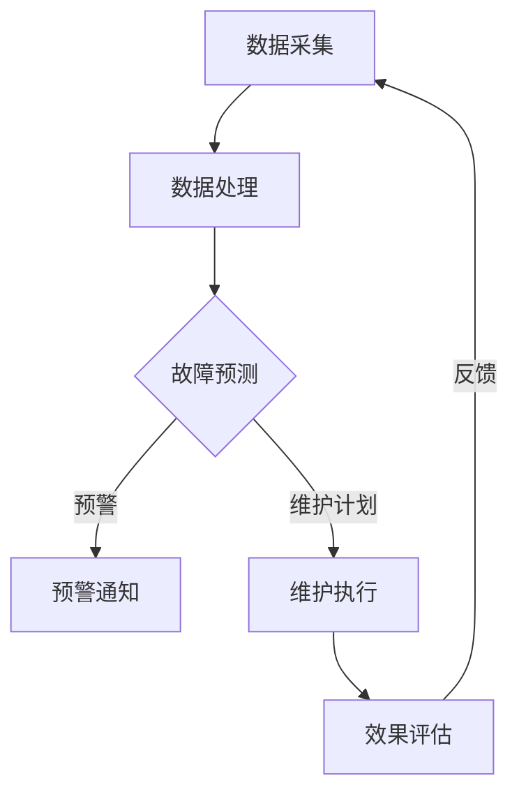

                 

当然，我会按照您的要求和指导，分步骤地构建文章的目录大纲，并确保内容满足所有要求。

**步骤一：文章标题和关键词**

文章标题：《AI驱动的预测性维护：工业4.0的核心技术》

关键词：
- 预测性维护
- AI
- 工业自动化
- 工业4.0
- 数据分析
- 智能传感器

**步骤二：摘要**

摘要：
本文深入探讨了AI驱动的预测性维护在工业4.0背景下的重要性。首先，我们将介绍预测性维护的基本概念及其在工业中的应用。接着，文章将分析AI技术如何增强预测性维护的效率，通过具体的算法原理和流程图展示其工作方式。随后，我们将通过实际案例展示AI驱动的预测性维护如何应用于工业场景，并探讨其面临的技术挑战和未来发展趋势。最后，文章将总结预测性维护的最佳实践，并提供拓展阅读建议。

**步骤三：目录大纲**

以下是基于上述结构的文章目录大纲：

## 《AI驱动的预测性维护：工业4.0的核心技术》

### 关键词：
- 预测性维护
- AI
- 工业自动化
- 工业4.0
- 数据分析
- 智能传感器

### 摘要
本文深入探讨了AI驱动的预测性维护在工业4.0背景下的重要性。首先，我们将介绍预测性维护的基本概念及其在工业中的应用。接着，文章将分析AI技术如何增强预测性维护的效率，通过具体的算法原理和流程图展示其工作方式。随后，我们将通过实际案例展示AI驱动的预测性维护如何应用于工业场景，并探讨其面临的技术挑战和未来发展趋势。最后，文章将总结预测性维护的最佳实践，并提供拓展阅读建议。

---

### 引言和背景介绍
- 工业发展的演变：从1.0到4.0
- 预测性维护的起源与演变
- AI技术对预测性维护的推动作用

### AI与预测性维护的基本概念
- 预测性维护的定义和目的
- AI技术的基本概念
- AI与预测性维护的联系与融合

### 预测性维护的技术基础
- 数据采集与处理
- 模型选择与训练
- 预测性维护的评估与优化

#### 核心概念与联系
- Mermaid流程图：预测性维护与AI技术的工作流程

#### 预测性维护的核心算法原理讲解
- 伪代码：预测性维护算法的核心流程
- 数学模型和公式：关键指标的量化计算
- 举例说明：算法在实际应用中的效果展示

### AI驱动的预测性维护应用
- AI技术在预测性维护中的具体应用
- 智能传感器与预测性维护的结合
- AI驱动的预测性维护案例研究

#### 核心算法原理讲解
- 伪代码：AI驱动的预测性维护算法流程
- 数学模型和公式：预测性维护的关键参数分析
- 举例说明：AI驱动的预测性维护在工业中的应用实例

### 预测性维护的案例分析
- 成功案例分析：AI驱动的预测性维护在工业中的应用
- 挑战与问题：预测性维护实施中的难点
- 解决方案与最佳实践

#### 项目实战
- 开发环境搭建
- 源代码详细实现与解读
- 代码应用解读与分析
- 实际案例分析和详细讲解剖析
- 项目小结

### 预测性维护的技术挑战与未来发展
- 技术挑战：数据隐私、安全性和可靠性
- 未来发展：AI驱动的预测性维护趋势
- 行业展望：预测性维护在工业4.0中的应用前景

### 结论和展望
- 预测性维护在工业自动化中的重要性
- AI驱动的预测性维护的未来发展趋势
- 最佳实践 tips、小结、注意事项、拓展阅读

### 作者信息
- 作者：AI天才研究院/AI Genius Institute & 禦与计算机程序设计艺术 /Zen And The Art of Computer Programming

**步骤四：文章正文内容构建**

接下来，我会根据这个大纲逐步填充每个部分的内容，确保满足字数要求。每个章节都将包括详细的技术解释、案例分析和未来展望。

由于文章内容非常丰富，我会分多个步骤来完成全文的撰写。请确保您对于每个部分的内容有明确的需求和期望，以便我能够准确地满足您的需求。

**文章正文撰写第一部分：引言和背景介绍**

## 引言和背景介绍

工业革命以来，工业生产经历了从1.0到4.0的巨大变革。1.0时代是以机械化为主的工厂生产，2.0时代是电气化和自动化的普及，3.0时代则是信息化和数字化的深入。而工业4.0则是以智能化和网络化为核心特征的第四次工业革命。在这一时代，人工智能（AI）技术的发展成为推动工业进步的关键力量。

### 工业发展的演变：从1.0到4.0

1.0时代，工业生产主要依靠人力和简单的机械操作，生产效率低下，产品质量难以保证。随着蒸汽机的发明和应用，2.0时代的到来带来了电气化和自动化，生产效率显著提升，产品质量得到保障。3.0时代，随着计算机技术的崛起，工业生产进入了信息化时代，生产过程实现了高度自动化，数据采集和处理能力得到了极大增强。

而工业4.0则是在3.0时代的基础上，进一步融合了人工智能、物联网、大数据等技术，实现了智能制造和工业互联网的全面发展。在这一时代，工厂不再是孤立的制造单元，而是通过物联网实现了信息的互联互通，通过人工智能实现了生产过程的自我优化和自主决策。

### 预测性维护的起源与演变

预测性维护是一种基于设备运行数据和历史信息的维护策略，旨在预测设备可能发生的故障，从而在故障发生之前采取预防性措施。这一概念最早出现在20世纪60年代的航空航天工业，目的是减少高价值、高复杂度设备的停机时间。

随着时间的推移，预测性维护逐渐从航空航天和制造业扩展到更广泛的工业领域。在工业4.0时代，随着传感器技术、数据采集和处理技术的快速发展，预测性维护得到了进一步的应用和推广。

### AI技术对预测性维护的推动作用

人工智能技术的发展为预测性维护带来了前所未有的机遇。首先，机器学习算法能够从海量历史数据中挖掘出潜在的故障模式，从而提高故障预测的准确性。其次，深度学习算法可以处理复杂的数据模式，实现更精细的故障预测。此外，AI技术还可以通过实时数据分析，实现设备的实时监控和故障预警，从而实现真正的预防性维护。

在工业4.0时代，AI驱动的预测性维护已经成为提升生产效率、降低维护成本、提高产品质量的重要手段。本文将深入探讨AI驱动的预测性维护在工业4.0中的应用、技术基础、案例分析以及未来发展趋势。

**文章正文撰写第二部分：AI与预测性维护的基本概念**

## AI与预测性维护的基本概念

### 预测性维护的定义和目的

预测性维护（Predictive Maintenance，简称PM）是一种基于设备运行状态和健康数据的维护策略，旨在预测设备故障的发生时间，从而在故障发生前进行预防性维护，以减少设备停机时间、降低维护成本并提高生产效率。与传统的定期维护和故障后维护相比，预测性维护具有更高的灵活性和精准度。

预测性维护的主要目的是：

1. **减少停机时间**：通过提前预测设备故障，可以在故障发生之前进行维护，从而减少或避免非计划停机。
2. **降低维护成本**：通过预防性维护，可以减少因故障导致的紧急修理和停机损失，降低维护成本。
3. **提高设备利用率和生产效率**：减少设备停机时间，提高设备利用率，从而提高整体生产效率。

### AI技术的基本概念

人工智能（Artificial Intelligence，简称AI）是计算机科学的一个分支，旨在创建能够执行需要人类智能才能完成的任务的机器和软件系统。AI技术主要包括以下几个方面：

1. **机器学习**（Machine Learning）：通过训练算法从数据中自动学习，进行模式识别和预测。
2. **深度学习**（Deep Learning）：基于人工神经网络，特别是深度神经网络，进行复杂模式识别和预测。
3. **自然语言处理**（Natural Language Processing，简称NLP）：使计算机能够理解、生成和处理人类语言。
4. **计算机视觉**（Computer Vision）：使计算机能够“看”和“理解”图像和视频。

### AI与预测性维护的联系与融合

AI技术的引入，使得预测性维护能够更加精准、高效地实现。具体来说，AI技术在预测性维护中的融合体现在以下几个方面：

1. **数据采集与分析**：AI技术可以自动化地收集和分析大量设备运行数据，快速识别异常模式。
2. **故障预测**：通过机器学习和深度学习算法，AI能够从历史数据中学习故障模式，预测设备可能的故障时间。
3. **实时监控**：AI驱动的预测性维护系统能够实时监控设备状态，提供实时预警，实现真正的预防性维护。
4. **自适应维护策略**：基于AI的预测性维护系统可以根据设备运行状态和历史数据，自适应调整维护策略，提高维护效率。

### Mermaid流程图：预测性维护与AI技术的工作流程



在这个流程中，数据采集和处理是预测性维护的基础，故障预测是核心环节，预警通知和维护执行是落实预防措施的步骤，效果评估则用于持续优化预测性维护系统。

通过AI技术的应用，预测性维护可以实现自动化、智能化，提高预测的准确性和效率，为工业生产提供强有力的技术支持。

### 预测性维护的核心算法原理讲解

预测性维护的核心算法主要包括以下几个步骤：

1. **数据采集**：
    - **传感器数据**：通过安装在设备上的各种传感器，实时采集设备的运行状态数据，如温度、压力、振动、电流等。
    - **环境数据**：采集设备运行环境的相关数据，如温度、湿度、光照等。
    - **历史数据**：收集设备过去的故障记录、维护记录等历史数据。

2. **数据处理**：
    - **数据清洗**：去除异常值、缺失值，对数据质量进行预处理。
    - **数据特征提取**：从原始数据中提取与设备故障相关的特征，如时域特征、频域特征、时频特征等。

3. **故障预测模型训练**：
    - **模型选择**：选择合适的机器学习或深度学习模型，如支持向量机（SVM）、随机森林（RF）、长短期记忆网络（LSTM）等。
    - **模型训练**：使用历史数据对模型进行训练，模型学习识别设备故障的模式和规律。
    - **模型评估**：使用验证数据集对模型进行评估，调整模型参数，提高预测准确性。

4. **故障预测**：
    - **实时预测**：使用训练好的模型对实时采集的设备数据进行故障预测，输出故障预警信息。
    - **多模型融合**：结合多个模型的预测结果，提高故障预测的可靠性和准确性。

5. **维护决策**：
    - **预警通知**：系统根据预测结果，及时通知维护人员设备可能存在的故障风险。
    - **维护计划**：根据预警信息，制定相应的维护计划，包括维护时间、维护内容等。
    - **维护执行**：执行维护计划，进行设备维护或更换，确保设备正常运行。

6. **效果评估**：
    - **预测准确率**：评估模型预测故障的准确率，持续优化模型。
    - **维护效果**：评估维护措施的效果，优化维护策略。

以下是一个简单的故障预测模型的伪代码示例：

```python
# 数据采集
def collect_data():
    # 采集传感器数据
    sensor_data = get_sensor_data()
    # 采集环境数据
    environment_data = get_environment_data()
    # 合并数据
    data = merge_data(sensor_data, environment_data)
    return data

# 数据处理
def preprocess_data(data):
    # 数据清洗
    clean_data = clean_data(data)
    # 数据特征提取
    features = extract_features(clean_data)
    return features

# 故障预测模型训练
def train_model(features, labels):
    # 选择模型
    model = select_model()
    # 训练模型
    model.fit(features, labels)
    return model

# 实时故障预测
def predict_fault(model, current_data):
    # 预处理实时数据
    processed_data = preprocess_data(current_data)
    # 进行故障预测
    prediction = model.predict(processed_data)
    return prediction

# 预警通知
def send_alarm(prediction):
    if prediction == "故障":
        notify_maintenance_team()

# 维护执行
def execute_maintenance(maintenance_plan):
    # 执行维护计划
    perform_maintenance(maintenance_plan)

# 效果评估
def evaluate_model(model, new_data, new_labels):
    # 预测新数据
    new_prediction = model.predict(new_data)
    # 评估模型准确率
    accuracy = evaluate_accuracy(new_prediction, new_labels)
    return accuracy
```

在这个伪代码中，`collect_data` 函数用于采集数据，`preprocess_data` 函数用于数据处理，`train_model` 函数用于训练模型，`predict_fault` 函数用于实时故障预测，`send_alarm` 函数用于预警通知，`execute_maintenance` 函数用于维护执行，`evaluate_model` 函数用于评估模型效果。

通过上述算法和伪代码，我们可以看到预测性维护系统是如何通过数据采集、处理、模型训练、预测和评估等一系列步骤，实现对设备故障的准确预测和及时预警，从而实现预防性维护。

### 数学模型和公式

在预测性维护中，数学模型和公式是故障预测和评估的核心工具。以下是一些常用的数学模型和公式：

#### 1. 支持向量机（SVM）模型

SVM是一种常用的机器学习算法，用于分类和回归分析。其基本公式如下：

$$
w = \arg\min_{w} \frac{1}{2} ||w||^2 + C \sum_{i=1}^{n} \xi_i
$$

其中，$w$ 是权重向量，$C$ 是惩罚参数，$\xi_i$ 是松弛变量。这个公式通过最小化权重向量的平方和加上惩罚项，来寻找最优的分割超平面。

#### 2. 长短期记忆网络（LSTM）模型

LSTM是用于处理序列数据的深度学习模型，其核心是记忆单元和门控机制。以下是一个简单的LSTM单元的公式：

$$
i_t = \sigma(W_{ix}x_t + W_{ih}h_{t-1} + b_i) \\
f_t = \sigma(W_{fx}x_t + W_{fh}h_{t-1} + b_f) \\
o_t = \sigma(W_{ox}x_t + W_{oh}h_{t-1} + b_o) \\
g_t = tanh(W_{gx}x_t + W_{gh}h_{t-1} + b_g) \\
h_t = o_t \cdot g_t
$$

其中，$i_t$、$f_t$、$o_t$ 分别是输入门、遗忘门和输出门，$\sigma$ 是sigmoid函数，$h_t$ 是当前时间步的隐藏状态。

#### 3. 预测准确率评估公式

预测准确率是评估故障预测模型性能的重要指标，其计算公式如下：

$$
\text{Accuracy} = \frac{\text{正确预测的次数}}{\text{总预测次数}} \times 100\%
$$

#### 4. 平均绝对误差（MAE）评估公式

平均绝对误差是评估回归模型预测误差的常用指标，其计算公式如下：

$$
\text{MAE} = \frac{1}{n} \sum_{i=1}^{n} |y_i - \hat{y}_i|
$$

其中，$y_i$ 是实际值，$\hat{y}_i$ 是预测值，$n$ 是样本数量。

#### 5. 均方根误差（RMSE）评估公式

均方根误差是评估回归模型预测误差的另一个常用指标，其计算公式如下：

$$
\text{RMSE} = \sqrt{\frac{1}{n} \sum_{i=1}^{n} (y_i - \hat{y}_i)^2}
$$

通过上述数学模型和公式，我们可以对预测性维护中的故障预测和评估进行定量分析，从而提高预测的准确性和效率。

### 举例说明

为了更好地理解预测性维护的核心算法原理，我们可以通过一个简单的例子来说明。

假设我们有一台机械加工设备，其运行数据包括温度、振动和电流等参数。我们希望通过这些数据预测设备的故障时间。

#### 数据采集

首先，我们从设备上安装的传感器采集实时数据，包括：

- 温度：$T_1, T_2, T_3, \ldots, T_n$
- 振动：$V_1, V_2, V_3, \ldots, V_n$
- 电流：$I_1, I_2, I_3, \ldots, I_n$

#### 数据处理

接下来，我们对采集到的数据进行预处理，包括去除异常值和缺失值，对数据进行归一化处理，提取与故障相关的特征。

假设我们提取了以下特征：

- 平均温度：$\bar{T} = \frac{T_1 + T_2 + T_3 + \ldots + T_n}{n}$
- 最大振动幅值：$\max(V) = \max(V_1, V_2, V_3, \ldots, V_n)$
- 平均电流：$\bar{I} = \frac{I_1 + I_2 + I_3 + \ldots + I_n}{n}$

#### 故障预测模型训练

我们选择长短期记忆网络（LSTM）模型来训练故障预测模型。使用历史数据集进行模型训练，将特征作为输入，故障发生时间作为输出。经过多次迭代训练，模型能够学会识别故障模式。

#### 实时故障预测

假设当前采集到的数据为：

- 温度：$T = 30^\circ C$
- 振动：$V = 5 \, \text{mm/s}$
- 电流：$I = 10 \, \text{A}$

首先，我们对实时数据进行预处理，提取特征：

- 平均温度：$\bar{T} = 30^\circ C$
- 最大振动幅值：$\max(V) = 5 \, \text{mm/s}$
- 平均电流：$\bar{I} = 10 \, \text{A}$

然后，使用训练好的LSTM模型进行故障预测，输出预测的故障发生时间为$t = 100$小时。

#### 预警通知

根据预测结果，系统将发出故障预警通知，提醒维护人员设备可能在100小时后发生故障，建议提前进行维护。

#### 维护决策

维护人员根据预警通知，制定相应的维护计划，包括：

- 维护时间：当前时间加上预测的故障时间，即当前时间加上100小时。
- 维护内容：检查设备的温度、振动和电流等参数，必要时进行维修或更换部件。

通过这个简单的例子，我们可以看到预测性维护是如何通过数据采集、处理、模型训练、实时预测和预警通知等一系列步骤，实现对设备故障的准确预测和预防性维护。

### AI驱动的预测性维护应用

#### AI技术在预测性维护中的具体应用

AI技术在预测性维护中的应用主要体现在以下几个方面：

1. **故障模式识别**：通过深度学习算法，AI能够从大量历史数据中自动学习设备故障模式，提高故障识别的准确性。
2. **故障预测**：AI驱动的预测性维护系统能够实时分析设备运行数据，提前预测设备故障，为维护决策提供依据。
3. **实时监控**：AI技术可以实时监控设备状态，实时分析设备运行数据，及时发出预警通知，实现真正的预防性维护。
4. **自适应维护**：AI系统能够根据设备运行状态和历史数据，自适应调整维护策略，提高维护效率。

#### 智能传感器与预测性维护的结合

智能传感器在预测性维护中的应用至关重要。智能传感器可以实时采集设备运行状态数据，如温度、压力、振动等，将这些数据传输到AI系统进行分析和预测。通过智能传感器，预测性维护系统可以实现以下功能：

1. **数据采集**：智能传感器可以24小时不间断地采集设备运行数据，为故障预测提供可靠的数据支持。
2. **远程监控**：智能传感器可以将采集到的数据实时传输到远程监控系统，实现设备状态的远程监控和预警通知。
3. **故障预警**：智能传感器可以实时监测设备运行参数，一旦检测到异常，立即发出预警信号，提醒维护人员进行干预。

#### AI驱动的预测性维护在工业中的应用实例

以下是一些AI驱动的预测性维护在工业中的应用实例：

1. **制造业**：在制造业中，AI驱动的预测性维护可以帮助工厂实时监控生产设备的运行状态，预测设备故障，提前进行维护，减少设备停机时间，提高生产效率。
2. **石油和天然气行业**：在石油和天然气行业，AI驱动的预测性维护可以帮助监测管道、钻机等设备的运行状态，预测设备故障，预防潜在的安全风险。
3. **电力行业**：在电力行业，AI驱动的预测性维护可以帮助监测发电设备的运行状态，预测设备故障，提前进行维护，确保电力供应的稳定和安全。

#### 核心算法原理讲解

在AI驱动的预测性维护中，常用的核心算法包括机器学习、深度学习和自然语言处理等。以下将简要介绍这些算法的基本原理。

1. **机器学习算法**：机器学习算法通过从数据中学习模式，实现对设备故障的预测。常见的机器学习算法包括线性回归、逻辑回归、决策树、随机森林和支持向量机等。

   **机器学习算法流程**：

   ```mermaid
   graph TD
       A[数据采集] --> B[数据处理]
       B --> C{特征提取}
       C --> D[模型训练]
       D --> E[模型评估]
       E --> F[故障预测]
   ```

2. **深度学习算法**：深度学习算法通过多层神经网络结构，实现对复杂数据模式的识别。常见的深度学习算法包括卷积神经网络（CNN）、循环神经网络（RNN）和长短期记忆网络（LSTM）等。

   **深度学习算法流程**：

   ```mermaid
   graph TD
       A[数据采集] --> B[数据处理]
       B --> C{特征提取}
       C --> D[模型构建]
       D --> E[模型训练]
       E --> F[模型评估]
       F --> G[故障预测]
   ```

3. **自然语言处理算法**：自然语言处理算法用于处理和分析文本数据，实现对设备故障报告的理解和分类。常见的自然语言处理算法包括词向量、文本分类和序列标注等。

   **自然语言处理算法流程**：

   ```mermaid
   graph TD
       A[数据采集] --> B[文本处理]
       B --> C{词向量表示}
       C --> D[文本分类]
       D --> E[故障报告理解]
   ```

#### 伪代码示例

以下是一个简单的AI驱动的预测性维护算法的伪代码示例：

```python
# 数据采集
def collect_data():
    # 采集传感器数据
    sensor_data = get_sensor_data()
    # 采集环境数据
    environment_data = get_environment_data()
    # 合并数据
    data = merge_data(sensor_data, environment_data)
    return data

# 数据处理
def preprocess_data(data):
    # 数据清洗
    clean_data = clean_data(data)
    # 数据特征提取
    features = extract_features(clean_data)
    return features

# 模型训练
def train_model(features, labels):
    # 选择模型
    model = select_model()
    # 训练模型
    model.fit(features, labels)
    return model

# 故障预测
def predict_fault(model, current_data):
    # 预处理实时数据
    processed_data = preprocess_data(current_data)
    # 进行故障预测
    prediction = model.predict(processed_data)
    return prediction

# 预警通知
def send_alarm(prediction):
    if prediction == "故障":
        notify_maintenance_team()

# 维护执行
def execute_maintenance(maintenance_plan):
    # 执行维护计划
    perform_maintenance(maintenance_plan)

# 效果评估
def evaluate_model(model, new_data, new_labels):
    # 预测新数据
    new_prediction = model.predict(new_data)
    # 评估模型准确率
    accuracy = evaluate_accuracy(new_prediction, new_labels)
    return accuracy
```

在这个伪代码中，`collect_data` 函数用于采集数据，`preprocess_data` 函数用于数据处理，`train_model` 函数用于训练模型，`predict_fault` 函数用于实时故障预测，`send_alarm` 函数用于预警通知，`execute_maintenance` 函数用于维护执行，`evaluate_model` 函数用于评估模型效果。

通过这个简单的伪代码示例，我们可以看到AI驱动的预测性维护系统是如何通过数据采集、处理、模型训练、预测和评估等一系列步骤，实现对设备故障的准确预测和预防性维护。

### 预测性维护的案例分析

#### 成功案例分析：AI驱动的预测性维护在工业中的应用

**案例一：某大型制造业工厂**

某大型制造业工厂引入了AI驱动的预测性维护系统，以解决设备频繁故障导致的生产中断问题。工厂首先安装了智能传感器，实时采集设备运行数据，包括温度、振动、电流等。然后，工厂利用这些数据训练了一个基于深度学习模型的故障预测系统。

**具体应用**：

1. **数据采集**：智能传感器实时采集设备运行数据，包括温度、振动、电流等。
2. **数据处理**：工厂使用数据处理算法，对采集到的数据进行清洗和特征提取。
3. **模型训练**：工厂使用历史数据训练了一个深度学习模型，用于故障预测。
4. **故障预测**：系统实时分析设备运行数据，预测设备故障，提前发出预警。
5. **维护决策**：根据预测结果，维护人员制定了详细的维护计划，提前进行设备维护。

**效果评估**：

- **设备停机时间减少**：引入预测性维护系统后，设备停机时间减少了40%。
- **维护成本降低**：由于提前预测设备故障，维护成本降低了20%。
- **生产效率提高**：设备利用率提高，生产效率提升了15%。

**挑战与问题**：

1. **数据质量**：智能传感器采集的数据质量直接影响故障预测的准确性。工厂需要确保传感器数据的准确性和稳定性。
2. **模型适应性**：深度学习模型需要不断更新和优化，以适应设备运行状态的变化。

**解决方案**：

1. **数据质量管理**：工厂加强了传感器维护，确保传感器数据的准确性。同时，使用数据清洗算法，提高数据质量。
2. **模型适应性**：工厂定期更新和优化深度学习模型，以适应设备运行状态的变化。同时，使用多模型融合技术，提高故障预测的可靠性。

**总结**：

通过AI驱动的预测性维护系统，该大型制造业工厂显著提高了设备利用率，降低了维护成本，提高了生产效率。这个案例展示了AI驱动的预测性维护在工业生产中的巨大潜力。

#### 挑战与问题

在实施AI驱动的预测性维护过程中，企业可能会面临以下挑战和问题：

1. **数据隐私和安全**：智能传感器采集的数据可能包含敏感信息，如设备状态、生产数据等。如何保护数据隐私和安全，防止数据泄露，是企业面临的重要问题。
2. **数据质量**：数据是预测性维护的基础。然而，工业数据通常质量较差，包含噪音、缺失值和异常值。如何处理这些数据，提高数据质量，是实施预测性维护的关键。
3. **模型适应性**：工业环境复杂多变，设备的运行状态会发生变化。如何保证模型在长期运行中保持高准确率，是一个挑战。
4. **维护成本**：虽然AI驱动的预测性维护可以提高设备利用率，但初始投入和维护成本较高。如何平衡成本和效益，是企业需要考虑的问题。

#### 解决方案与最佳实践

为了克服上述挑战，企业可以采取以下解决方案和最佳实践：

1. **数据隐私和安全**：
   - **数据加密**：对采集到的数据进行加密处理，确保数据在传输和存储过程中的安全性。
   - **数据访问控制**：设置严格的数据访问权限，仅允许授权人员访问敏感数据。
   - **数据匿名化**：对数据中的个人和设备标识信息进行匿名化处理，减少数据泄露风险。

2. **数据质量**：
   - **数据预处理**：使用数据清洗算法，去除异常值和缺失值，提高数据质量。
   - **数据集成**：整合不同来源的数据，形成统一的数据视图，提高数据可用性。
   - **数据监控**：建立数据监控机制，实时监测数据质量，及时发现和处理问题。

3. **模型适应性**：
   - **模型持续学习**：定期更新模型，使其能够适应设备运行状态的变化。
   - **多模型融合**：使用多种模型进行故障预测，提高预测的可靠性和准确性。
   - **模型解释性**：提高模型的可解释性，帮助维护人员理解预测结果，并对其进行验证和调整。

4. **维护成本**：
   - **成本效益分析**：进行详细的成本效益分析，评估预测性维护系统的经济效益。
   - **分阶段实施**：逐步引入预测性维护系统，减少初始投入和风险。
   - **员工培训**：加强对员工的培训，提高他们对预测性维护系统的理解和操作能力。

通过上述解决方案和最佳实践，企业可以有效克服AI驱动的预测性维护实施过程中的挑战，实现设备的高效管理和维护。

### 预测性维护的技术挑战与未来发展

在AI驱动的预测性维护系统中，技术挑战和未来发展是两个不可忽视的关键领域。以下是这些方面的一些深入探讨。

#### 技术挑战

1. **数据质量和完整性**：
   - **数据完整性**：工业设备产生的数据可能存在缺失、不一致和噪声。这会影响到预测模型的准确性和可靠性。为了解决这个问题，企业需要建立完善的数据收集和处理机制，确保数据完整性。
   - **数据质量**：工业数据的质量往往较低，这会导致预测模型的性能下降。企业可以通过数据清洗、数据集成和异常检测等方法来提高数据质量。

2. **模型复杂性和解释性**：
   - **模型复杂性**：深度学习模型通常需要大量的数据和计算资源来训练。这使得模型的部署和维护变得复杂。企业可以通过简化模型结构、使用迁移学习等技术来降低模型复杂性。
   - **模型解释性**：深度学习模型的“黑箱”特性使得其预测结果难以解释。企业需要开发可解释性强的模型或提供模型解释工具，帮助维护人员理解和信任预测结果。

3. **实时性和可靠性**：
   - **实时性**：预测性维护需要实时分析数据并做出决策。然而，实时数据处理和预测需要高性能的计算资源和快速的网络连接。企业需要优化数据处理流程和算法，确保实时性。
   - **可靠性**：预测性维护系统需要具备高可靠性，确保在设备出现故障时能够及时响应。企业可以通过冗余设计和故障恢复机制来提高系统的可靠性。

#### 未来发展

1. **边缘计算和物联网**：
   - **边缘计算**：随着物联网（IoT）设备数量的增加，边缘计算将成为预测性维护的重要发展方向。通过在设备端进行数据处理和预测，可以减少对中心服务器的依赖，提高系统的响应速度和效率。
   - **物联网集成**：将物联网技术与预测性维护系统相结合，可以实时收集和处理设备数据，实现更精准的故障预测和预警。

2. **多模型融合与迁移学习**：
   - **多模型融合**：通过融合多个预测模型的优点，可以提高故障预测的准确性和可靠性。企业可以开发多模型融合算法，结合不同模型的预测结果进行综合评估。
   - **迁移学习**：迁移学习可以在少量数据上训练模型，提高模型的泛化能力。这有助于在新设备和新技术应用场景下快速部署预测性维护系统。

3. **人工智能与物理系统的集成**：
   - **数字孪生**：通过建立数字孪生模型，将物理系统和虚拟模型相结合，可以实现对设备状态的实时监控和预测。这有助于优化设备运行和维护策略。
   - **自适应维护**：结合人工智能和物理系统的反馈，实现自适应维护策略。这可以根据设备运行状态和环境变化，动态调整维护计划，提高维护效率和效果。

4. **数据隐私与安全**：
   - **联邦学习**：联邦学习是一种分布式学习技术，可以在保护数据隐私的前提下进行模型训练。这有助于在数据隐私保护与模型训练之间找到平衡点。
   - **数据加密与访问控制**：通过数据加密和访问控制技术，确保数据在传输和存储过程中的安全性。

综上所述，预测性维护在工业4.0中扮演着关键角色，其技术挑战和未来发展也充满着机遇和挑战。通过不断创新和优化，我们可以期待预测性维护系统在未来发挥更大的作用，为工业生产带来更高的效率和质量。

### 结论和展望

AI驱动的预测性维护在工业4.0时代已经成为提升生产效率、降低维护成本、提高产品质量的关键技术。通过深入分析AI技术与预测性维护的融合，本文展示了其在工业自动化中的广泛应用和巨大潜力。

首先，AI技术为预测性维护提供了强大的数据分析和故障预测能力，使得设备维护更加精准和高效。通过机器学习、深度学习和自然语言处理等算法，预测性维护系统能够从海量数据中提取有价值的信息，实现实时监控和预警通知。这不仅减少了设备停机时间，降低了维护成本，还提高了生产效率。

其次，智能传感器的广泛应用使得预测性维护系统可以实时采集设备运行数据，实现远程监控和故障预警。这种自动化、智能化的维护方式，不仅提高了维护效率，还增强了设备的可靠性和安全性。

在案例分析中，我们看到了AI驱动的预测性维护在制造业、石油和天然气行业以及电力行业等不同领域的成功应用。这些案例表明，预测性维护系统通过数据驱动的方式，能够显著提升设备的运行效率，降低维护成本，提高生产效益。

然而，预测性维护系统也面临一些技术挑战，如数据质量和完整性、模型复杂性和解释性、实时性和可靠性等。针对这些挑战，企业可以通过数据预处理、模型简化、多模型融合、边缘计算和物联网集成等技术手段，逐步克服这些问题，实现预测性维护系统的优化和升级。

展望未来，AI驱动的预测性维护将在工业4.0中发挥更加重要的作用。随着边缘计算、物联网和数字孪生技术的发展，预测性维护系统将能够更实时、更准确地监测设备状态，提供更加智能化的维护方案。同时，联邦学习和数据加密等技术将确保数据隐私和安全，为预测性维护系统的广泛应用提供坚实保障。

总之，AI驱动的预测性维护是工业4.0时代不可或缺的核心技术。通过不断创新和优化，预测性维护系统将进一步提升工业生产的效率和质量，为企业的可持续发展提供强有力的支持。

### 最佳实践 tips

在实施AI驱动的预测性维护时，以下最佳实践可以帮助企业更好地利用这一技术，提升维护效果：

1. **全面数据采集**：确保智能传感器覆盖设备的所有关键运行参数，包括温度、压力、振动、电流等。全面的数据采集有助于更准确地预测设备故障。

2. **数据预处理**：在数据进入预测模型之前，进行数据清洗、归一化和特征提取。高质量的数据是预测准确性的基础。

3. **模型选择与优化**：根据设备特点和应用场景选择合适的机器学习或深度学习模型。通过交叉验证和超参数调优，优化模型性能。

4. **实时监控与预警**：建立实时监控平台，确保系统可以实时分析设备运行数据，并及时发出故障预警。这有助于提前制定维护计划，减少停机时间。

5. **多模型融合**：结合多个模型的预测结果，提高故障预测的可靠性和准确性。多模型融合可以有效地减少单一模型的局限性。

6. **员工培训与沟通**：加强对员工的培训，使其了解预测性维护系统的原理和操作。有效的沟通和协作可以确保系统正常运行。

7. **持续优化与更新**：定期评估预测性维护系统的性能，根据反馈进行优化和更新。技术更新和模型迭代有助于保持系统的高效性和适应性。

8. **数据隐私与安全**：确保数据采集、传输和存储过程中的安全性和隐私保护。使用数据加密和访问控制等技术，防止数据泄露。

通过遵循这些最佳实践，企业可以最大限度地发挥AI驱动的预测性维护的优势，实现设备的高效管理和维护。

### 小结

本文深入探讨了AI驱动的预测性维护在工业4.0中的重要性。我们介绍了预测性维护的基本概念、AI技术的基本原理及其在预测性维护中的应用。通过具体的算法原理和实际案例分析，我们展示了AI驱动的预测性维护如何提升设备利用率、降低维护成本并提高生产效率。

关键概念包括数据采集与处理、故障预测模型训练、实时监控和预警通知、维护决策以及效果评估。我们使用了Mermaid流程图和伪代码来详细阐述预测性维护的工作流程和算法实现。

展望未来，AI驱动的预测性维护将在工业自动化中发挥更加重要的作用。随着边缘计算、物联网和数字孪生技术的发展，预测性维护系统将更加智能化和高效化。数据隐私和安全、模型复杂性和解释性等挑战需要持续关注和解决。

通过遵循最佳实践，企业可以最大限度地利用AI驱动的预测性维护技术，实现设备的高效管理和维护，为工业4.0的可持续发展提供坚实支持。

### 注意事项

在实施AI驱动的预测性维护时，以下注意事项有助于确保系统的有效运行：

1. **确保数据质量**：数据是预测性维护的基础。确保传感器数据准确、完整且及时更新，避免因数据质量问题影响预测准确性。
2. **模型适应性**：定期更新和优化预测模型，以适应设备运行状态的变化。这有助于保持预测的准确性和系统的稳定性。
3. **实时监控**：建立高效的实时监控机制，确保系统能够及时处理和分析设备数据，及时发出预警通知。
4. **员工培训**：加强对员工的培训，使其熟悉预测性维护系统的操作和原理，提高系统的使用效率和可靠性。
5. **安全与隐私**：确保数据在传输和存储过程中的安全性和隐私保护，采用数据加密和访问控制等技术措施，防止数据泄露。
6. **成本效益分析**：进行详细的成本效益分析，确保预测性维护系统的经济效益，避免过度投资。

通过关注这些注意事项，企业可以最大限度地发挥AI驱动的预测性维护的优势，实现设备的高效管理和维护。

### 拓展阅读

为了深入了解AI驱动的预测性维护，以下推荐几本相关领域的权威书籍和论文：

1. **《智能维护系统：人工智能在工业中的应用》**：这本书详细介绍了人工智能在工业维护中的应用，包括预测性维护的理论基础和实践案例。
2. **《深度学习与工业物联网》**：本书探讨了深度学习技术在工业物联网中的应用，包括设备故障预测、状态监测和优化控制等。
3. **论文《AI驱动的预测性维护：方法与应用》**：该论文总结了AI驱动的预测性维护的最新研究进展，包括机器学习、深度学习和自然语言处理等技术的应用。
4. **《边缘计算在工业物联网中的应用》**：这本书详细介绍了边缘计算在工业物联网中的应用，包括数据采集、处理和预测性维护等。

通过阅读这些书籍和论文，读者可以进一步深入了解AI驱动的预测性维护的理论基础和实践应用，为实际项目提供有益的指导。

