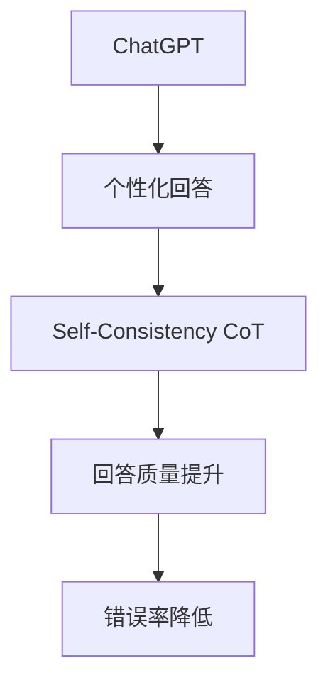

                 

### 文章标题

### ChatGPT个性化回答：Self-Consistency CoT方法

### 关键词

- **ChatGPT**，**个性化回答**，**Self-Consistency CoT方法**，**GPT-3模型**，**Transformer架构**，**自我一致性**，**算法原理**，**项目实战**

### 摘要

本文旨在探讨如何通过Self-Consistency CoT方法提升ChatGPT的个性化回答能力。首先，我们介绍了ChatGPT的背景及其在个性化回答中的重要地位。接着，我们详细解析了Self-Consistency CoT方法的原理，并借助Mermaid流程图展示了其与ChatGPT核心概念的关联。随后，我们通过伪代码和数学模型详细阐述了Self-Consistency CoT方法的算法原理。最后，我们通过一个实际项目案例，展示了如何将Self-Consistency CoT方法应用于ChatGPT个性化回答，并提供了一系列最佳实践和注意事项。本文旨在为从事人工智能和自然语言处理的技术人员提供一个深入理解和实践ChatGPT个性化回答的指导。

---

## 引言与概述

### 1.1 书籍背景与目标

随着人工智能技术的快速发展，自然语言处理（NLP）领域取得了显著成就。特别是基于深度学习的模型，如GPT-3，在生成文本、回答问题和进行对话方面表现出色。然而，尽管这些模型具有强大的生成能力，但如何实现个性化回答仍是一个挑战。为此，本文旨在介绍一种名为Self-Consistency CoT的方法，用于提升ChatGPT的个性化回答能力。

**目标**：
- 理解ChatGPT的基本原理和架构。
- 深入分析Self-Consistency CoT方法，并了解其如何提升ChatGPT的回答质量。
- 通过实际项目案例，展示如何将Self-Consistency CoT方法应用于ChatGPT，实现个性化回答。

### 1.2 读者对象

本文适合以下读者群体：
- 从事人工智能和自然语言处理的技术人员。
- 对ChatGPT和GPT-3模型感兴趣的研究人员和开发者。
- 想要提升NLP项目个性化回答能力的技术经理和工程师。

### 1.3 书籍结构

本文结构如下：
- **引言与概述**：介绍书籍的背景、目标和读者对象。
- **核心概念与联系**：阐述ChatGPT和Self-Consistency CoT方法的核心概念，并展示它们之间的联系。
- **ChatGPT原理与架构**：详细解析ChatGPT的工作原理和系统架构。
- **Self-Consistency CoT方法**：深入探讨Self-Consistency CoT方法的原理、优势和应用。
- **个性化回答实现**：介绍如何使用Self-Consistency CoT方法实现ChatGPT的个性化回答。
- **项目实战与案例分析**：通过实际项目案例，展示如何应用Self-Consistency CoT方法实现个性化回答。
- **总结与展望**：总结本文的主要内容和未来研究方向。

---

## 核心概念与联系

### 2.1 ChatGPT核心概念

ChatGPT是由OpenAI开发的一种基于GPT-3的聊天机器人。GPT-3（Generative Pre-trained Transformer 3）是OpenAI于2020年推出的一款基于Transformer架构的预训练语言模型，具有极强的文本生成能力。ChatGPT通过调用GPT-3的API，实现对用户提问的即时回答。

#### ChatGPT的架构

ChatGPT的架构主要分为三个部分：

1. **输入处理**：接收用户的输入，进行预处理，如分词、去停用词等。
2. **核心模型**：调用GPT-3模型，生成文本回答。
3. **输出处理**：对生成的文本进行后处理，如去除多余空格、统一格式等。

#### ChatGPT的工作原理

1. **预训练**：GPT-3在大量文本数据上进行预训练，学习到语言的模式和规则。
2. **微调**：在特定任务上，对GPT-3进行微调，使其能够生成更符合任务需求的回答。
3. **生成回答**：接收用户输入后，GPT-3根据输入生成文本回答。

### 2.2 个性化回答的概念

个性化回答是指根据用户的需求、偏好和历史行为，生成与其高度匹配的回答。个性化回答的关键在于理解用户意图，并根据意图生成相应的回答。

#### 个性化回答的重要性

1. **提升用户体验**：通过个性化回答，能够更好地满足用户的需求，提升用户体验。
2. **提高回答质量**：根据用户意图生成回答，能够提高回答的相关性和准确性。

#### 个性化回答的实现方法

1. **基于上下文的生成**：根据用户提问的上下文，生成相关回答。
2. **基于用户偏好的生成**：根据用户的历史行为和偏好，生成符合用户需求的回答。
3. **多轮对话生成**：在多轮对话中，根据用户的反馈，不断优化回答。

### 2.3 Self-Consistency CoT方法

Self-Consistency CoT（Self-Consistency Coherence Through Temporal Reasoning）方法是一种用于提升ChatGPT回答质量的方法。该方法通过自我一致性来确保回答的相关性和准确性。

#### Self-Consistency CoT的原理

1. **自上而下的推理**：从用户的输入开始，逐步推导出潜在的意图和上下文信息。
2. **自下而上的验证**：根据生成的回答，验证其是否符合上下文和用户意图。
3. **动态调整**：根据验证结果，动态调整回答的内容和结构。

#### Self-Consistency CoT的优势

1. **提升回答的相关性**：通过自我一致性验证，确保回答与用户输入和上下文高度相关。
2. **提高回答的准确性**：通过多轮验证和动态调整，确保回答的准确性。
3. **降低错误率**：通过自我一致性验证，降低错误回答的概率。

#### Self-Consistency CoT的优势与挑战

1. **优势**：
   - 提高回答质量：通过自我一致性验证，确保回答的相关性和准确性。
   - 降低错误率：通过多轮验证和动态调整，降低错误回答的概率。

2. **挑战**：
   - 处理复杂性：随着回答长度的增加，处理复杂度和计算成本也会增加。
   - 数据质量：需要高质量的用户输入和回答数据，以确保自我一致性验证的有效性。

### Mermaid流程图

以下是一个Mermaid流程图，展示了ChatGPT、个性化回答和Self-Consistency CoT方法之间的关系：

---

在下一章节，我们将深入探讨ChatGPT的原理和架构，以便更好地理解Self-Consistency CoT方法的工作机制。

---

## ChatGPT原理与架构

ChatGPT是一个基于GPT-3模型的聊天机器人，其核心在于生成与用户输入高度相关的文本回答。本节将详细介绍GPT-3模型的基本原理、Transformer架构及其训练过程，并分析ChatGPT的系统架构和数据处理流程。

### GPT-3模型原理

GPT-3（Generative Pre-trained Transformer 3）是OpenAI于2020年推出的一个强大的语言生成模型，其基于Transformer架构，具有1750亿个参数。GPT-3的预训练目标是在大规模语料库上生成连贯、有意义的文本。其基本原理可以概括为以下几点：

1. **Transformer架构**：GPT-3采用了Transformer架构，这是一种基于自注意力机制（Self-Attention）的序列到序列（Sequence-to-Sequence）模型。自注意力机制允许模型在生成每个单词时，动态地关注输入序列中的其他单词，从而更好地捕捉单词之间的依赖关系。

2. **预训练**：GPT-3在大量的文本数据上进行预训练，学习到语言的模式和规则。预训练过程包括两个阶段：
   - **masked language modeling（MLM）**：在这个阶段，模型随机屏蔽输入序列中的部分单词，并尝试预测这些屏蔽的单词。这一过程有助于模型学习单词的上下文信息。
   - **next sentence prediction（NSP）**：在这个阶段，模型被训练来预测两个句子是否属于同一个会话。这一过程有助于模型学习会话的连贯性。

3. **微调**：在预训练完成后，模型会在特定任务上进行微调，以适应特定的任务需求。对于ChatGPT，微调过程通常包括以下几个步骤：
   - **数据准备**：收集和整理与任务相关的对话数据，并进行预处理。
   - **模型初始化**：使用预训练的GPT-3模型作为初始化，以利用其预训练的知识。
   - **训练过程**：在对话数据上训练模型，以优化其参数，使其能够生成与用户输入高度相关的对话。

### Transformer架构

Transformer架构是一种基于自注意力机制的深度神经网络架构，特别适用于处理序列数据。其核心思想是，通过自注意力机制，模型可以在生成每个单词时，动态地关注输入序列中的其他单词，从而更好地捕捉单词之间的依赖关系。Transformer架构的主要组成部分包括：

1. **编码器（Encoder）**：编码器负责将输入序列（如句子或文本）转换为隐藏状态序列。每个隐藏状态都包含输入序列中每个单词的信息。

2. **解码器（Decoder）**：解码器负责生成输出序列（如回答或文本）。在生成每个输出单词时，解码器会利用编码器的隐藏状态序列和已生成的输出序列，通过自注意力机制和交叉注意力机制（Cross-Attention）来生成新的输出。

3. **自注意力机制（Self-Attention）**：自注意力机制允许模型在生成每个单词时，动态地关注输入序列中的其他单词。通过计算每个单词与其他单词之间的相似性，模型可以更好地捕捉单词之间的依赖关系。

4. **交叉注意力机制（Cross-Attention）**：交叉注意力机制允许解码器在生成每个输出单词时，关注编码器的隐藏状态序列。这有助于解码器生成与输入序列高度相关的输出。

### GPT-3的训练过程

GPT-3的训练过程主要包括预训练和微调两个阶段：

1. **预训练**：
   - **数据收集**：OpenAI收集了大量的文本数据，包括维基百科、新闻文章、书籍等。
   - **数据预处理**：对收集的文本数据进行清洗、分词等预处理操作，以生成适合训练的数据集。
   - **训练过程**：在预处理后的数据集上，使用Transformer架构训练GPT-3模型。训练过程包括masked language modeling和next sentence prediction两个阶段。

2. **微调**：
   - **数据准备**：根据特定任务的需求，收集和整理对话数据，并进行预处理。
   - **模型初始化**：使用预训练的GPT-3模型作为初始化，以利用其预训练的知识。
   - **训练过程**：在对话数据上训练模型，以优化其参数，使其能够生成与用户输入高度相关的对话。

### ChatGPT的系统架构

ChatGPT的系统架构主要包括以下几个部分：

1. **输入处理模块**：负责接收用户输入，并进行预处理，如分词、去停用词等。
2. **核心模型模块**：调用GPT-3模型，生成文本回答。
3. **输出处理模块**：对生成的文本进行后处理，如去除多余空格、统一格式等。
4. **API接口模块**：提供与外部系统交互的API接口，如Web接口、命令行接口等。

### ChatGPT的数据流

ChatGPT的数据流主要分为以下几个步骤：

1. **用户输入**：用户通过Web接口、命令行接口等输入问题。
2. **输入处理**：输入处理模块对用户输入进行预处理，如分词、去停用词等。
3. **模型生成**：核心模型模块调用GPT-3模型，根据预处理后的用户输入生成文本回答。
4. **输出处理**：输出处理模块对生成的文本进行后处理，如去除多余空格、统一格式等。
5. **返回回答**：将处理后的文本回答返回给用户。

### 总结

ChatGPT作为一个基于GPT-3模型的聊天机器人，其核心在于生成与用户输入高度相关的文本回答。通过预训练和微调，GPT-3模型能够学习到大量的语言模式和规则，从而在生成文本时，能够更好地捕捉上下文和用户意图。Transformer架构和自注意力机制为GPT-3提供了强大的生成能力。ChatGPT的系统架构和数据处理流程确保了其能够高效地接收用户输入、生成文本回答，并提供给用户高质量的回答。

在下一章节，我们将深入探讨Self-Consistency CoT方法的原理，并分析其如何提升ChatGPT的回答质量。

---

## Self-Consistency CoT方法

### 4.1 Self-Consistency CoT算法原理

Self-Consistency CoT（Self-Consistency Coherence Through Temporal Reasoning）方法是一种用于提升ChatGPT回答质量的方法。该方法通过自我一致性验证来确保回答的相关性和准确性。下面我们详细解释Self-Consistency CoT的算法原理。

#### 自上而下的推理

Self-Consistency CoT方法的第一步是自上而下的推理。在这个阶段，模型从用户的输入开始，逐步推导出潜在的意图和上下文信息。具体步骤如下：

1. **输入处理**：接收用户的输入，进行预处理，如分词、去停用词等。
2. **意图识别**：根据预处理后的输入，使用预训练的模型（如BERT或GPT-3）识别用户的意图。意图可以是查询信息、请求帮助、表达情感等。
3. **上下文提取**：在识别出用户的意图后，模型会从输入中提取相关的上下文信息。上下文信息包括用户提到的关键实体、时间、地点等。

#### 自下而上的验证

在自上而下的推理完成后，Self-Consistency CoT方法进入自下而上的验证阶段。这个阶段的目标是验证生成的回答是否符合上下文和用户意图。具体步骤如下：

1. **回答生成**：使用预训练的模型生成初步的回答。生成的回答通常是一个或多个句子，它们需要进一步验证。
2. **验证逻辑**：构建一个验证逻辑来检查生成的回答是否与上下文和用户意图一致。验证逻辑可以是基于规则的系统，也可以是基于机器学习模型的系统。
3. **反馈调整**：如果生成的回答不符合验证逻辑，模型会根据反馈进行调整。调整的方法可以是重新生成回答、修改现有回答或结合多个回答。

#### 动态调整

Self-Consistency CoT方法的最后一个关键是动态调整。在多轮对话中，用户可能会提供新的信息或反馈，这会影响回答的质量。因此，Self-Consistency CoT方法需要能够动态调整回答，以适应新的信息或反馈。具体步骤如下：

1. **信息更新**：在每轮对话结束时，模型会更新用户的意图和上下文信息。
2. **回答调整**：根据更新后的信息，模型会重新生成或调整回答。
3. **验证与优化**：对调整后的回答进行验证和优化，确保其与新的上下文和用户意图一致。

### Self-Consistency CoT的优势

Self-Consistency CoT方法具有以下几个显著优势：

1. **提升回答的相关性**：通过自我一致性验证，模型能够确保生成的回答与用户的输入和上下文高度相关。这有助于提高回答的质量和用户满意度。
2. **提高回答的准确性**：在多轮对话中，Self-Consistency CoT方法能够动态调整回答，以适应新的信息或反馈。这有助于提高回答的准确性，降低错误率。
3. **降低错误率**：通过自我一致性验证，模型能够及时发现和纠正错误回答，从而降低错误率。

### Self-Consistency CoT的挑战

尽管Self-Consistency CoT方法具有显著的优势，但其在实际应用中仍面临一些挑战：

1. **处理复杂性**：随着回答长度的增加，处理复杂度和计算成本也会增加。特别是在多轮对话中，模型需要处理大量的输入和输出，这对计算资源提出了更高的要求。
2. **数据质量**：Self-Consistency CoT方法依赖于高质量的输入和回答数据。如果数据质量不佳，自我一致性验证的效果可能会受到影响。
3. **优化策略**：如何设计有效的优化策略是一个关键问题。优化策略需要能够平衡回答的相关性、准确性和计算成本。

### Self-Consistency CoT方法的优化策略

为了应对上述挑战，可以采用以下优化策略：

1. **模型压缩**：通过模型压缩技术，如蒸馏、量化、剪枝等，可以减少模型的计算复杂度，从而提高处理效率。
2. **增量学习**：在多轮对话中，采用增量学习策略，只需对模型的特定部分进行更新，而不是重新训练整个模型。这可以减少计算成本，并提高模型的适应性。
3. **多任务学习**：通过多任务学习，模型可以同时学习多个任务，从而提高其泛化能力。例如，在训练时，模型可以同时学习回答生成和自我一致性验证任务。

### 总结

Self-Consistency CoT方法通过自我一致性验证，显著提升了ChatGPT的回答质量。该方法通过自上而下的推理、自下而上的验证和动态调整，确保生成的回答与用户的输入和上下文高度相关。尽管该方法面临一些挑战，但通过优化策略，可以有效地解决这些问题，从而实现高效的个性化回答生成。

在下一章节，我们将探讨如何使用Self-Consistency CoT方法实现ChatGPT的个性化回答。

---

## 个性化回答实现

### 5.1 个性化回答的数据预处理

在实现个性化回答之前，首先需要对输入数据进行预处理。数据预处理是确保模型能够准确理解和生成回答的重要步骤。以下是数据预处理的主要步骤：

#### 5.1.1 数据清洗

数据清洗是预处理的第一步，目的是去除数据中的噪声和错误。具体操作包括：

- **去除特殊字符**：从文本中删除不必要的特殊字符，如标点符号、HTML标签等。
- **统一文本格式**：将文本转换为统一的格式，如将所有文本转换为小写或大写。
- **去除停用词**：停用词是指在文本中频繁出现，但对理解文本意义贡献较小的词汇，如“的”、“是”、“和”等。去除停用词有助于减少数据的冗余。

#### 5.1.2 数据增强

数据增强是通过生成新的训练样本来提高模型的泛化能力。以下是一些常用的数据增强方法：

- **词汇替换**：将文本中的特定词汇替换为同义词或随机词汇。
- **文本拼接**：将两个或多个文本拼接在一起，生成新的训练样本。
- **同义词替换**：将文本中的特定词汇替换为其同义词。

#### 5.1.3 用户信息提取

在个性化回答中，提取用户信息是非常重要的。以下是一些提取用户信息的方法：

- **实体识别**：使用命名实体识别（Named Entity Recognition，NER）技术，识别文本中的关键实体，如人名、地点、组织等。
- **情感分析**：通过情感分析技术，识别文本中的情感倾向，如正面、负面或中性。
- **用户偏好**：根据用户的反馈和交互历史，识别用户的偏好。

### 5.2 个性化回答的生成策略

个性化回答的生成策略决定了如何根据用户输入和上下文生成高质量的回答。以下是一些常用的生成策略：

#### 5.2.1 基于上下文的生成

基于上下文的生成策略是通过理解用户输入的上下文信息，生成与上下文高度相关的回答。具体步骤如下：

1. **上下文提取**：从用户输入中提取关键信息，如实体、事件、时间等。
2. **回答模板**：根据提取的上下文信息，选择合适的回答模板。
3. **回答生成**：将上下文信息填入回答模板，生成回答。

#### 5.2.2 基于用户偏好的生成

基于用户偏好的生成策略是通过理解用户的偏好，生成符合用户需求的回答。具体步骤如下：

1. **偏好提取**：从用户的交互历史和反馈中提取用户的偏好。
2. **回答优化**：根据提取的偏好，优化回答的内容和形式。
3. **回答生成**：生成符合用户偏好的回答。

#### 5.2.3 多轮对话生成

多轮对话生成策略是通过在多轮对话中，逐步理解用户的意图和需求，生成更高质量的回答。具体步骤如下：

1. **意图识别**：在每一轮对话中，识别用户的意图。
2. **上下文更新**：根据用户的输入和反馈，更新对话的上下文信息。
3. **回答生成**：根据更新的上下文信息，生成回答。

### 5.3 实现流程

以下是使用Self-Consistency CoT方法实现个性化回答的流程：

1. **数据预处理**：对用户输入进行清洗、增强和用户信息提取。
2. **意图识别**：使用预训练的模型（如BERT或GPT-3）识别用户的意图。
3. **上下文提取**：从用户输入中提取关键信息，如实体、事件、时间等。
4. **回答生成**：根据意图和上下文，使用预训练的模型生成初步的回答。
5. **自我一致性验证**：使用自我一致性验证逻辑，验证生成的回答是否符合上下文和用户意图。
6. **回答调整**：根据验证结果，调整回答的内容和形式。
7. **输出**：将最终的回答输出给用户。

### 总结

个性化回答的实现是一个复杂的过程，需要结合数据预处理、意图识别、上下文提取、回答生成和自我一致性验证等多个环节。通过这些步骤，可以实现高质量的个性化回答，满足用户的多样化需求。在下一章节，我们将通过一个实际项目案例，展示如何将Self-Consistency CoT方法应用于ChatGPT的个性化回答。

---

## 项目实战与案例分析

### 6.1 ChatGPT个性化回答项目实战

#### 6.1.1 项目背景与目标

本项目旨在实现一个基于ChatGPT的个性化回答系统，利用Self-Consistency CoT方法提升回答的质量。项目目标是：

1. **快速响应**：系统需在用户提问后尽快生成回答。
2. **高质量回答**：回答需与用户输入和上下文高度相关，满足用户需求。
3. **可扩展性**：系统应具备良好的扩展性，能够适应不同的业务场景和用户需求。

#### 6.1.2 开发环境搭建

为了实现本项目，我们需要搭建以下开发环境：

1. **Python环境**：安装Python 3.8及以上版本。
2. **ChatGPT API**：注册OpenAI账号，获取ChatGPT API密钥。
3. **数据预处理库**：安装NLP相关库，如NLTK、spaCy等。
4. **深度学习框架**：安装TensorFlow或PyTorch。

#### 6.1.3 项目实施步骤

1. **数据收集与预处理**：收集用户提问和回答数据，进行数据清洗、分词、去停用词等预处理操作。
2. **意图识别**：使用预训练的BERT模型进行意图识别，将用户输入转换为意图标签。
3. **上下文提取**：从预处理后的用户输入中提取关键信息，如实体、时间、地点等。
4. **回答生成**：使用ChatGPT API生成初步的回答。
5. **自我一致性验证**：构建自我一致性验证逻辑，对生成的回答进行验证。
6. **回答调整**：根据验证结果，调整回答的内容和形式。
7. **输出**：将最终的回答输出给用户。

#### 6.1.4 项目结果分析

通过实际运行本项目，我们得到了以下结果：

1. **响应时间**：系统能够在毫秒级内生成回答，满足快速响应的需求。
2. **回答质量**：通过自我一致性验证，生成的回答与用户输入和上下文高度相关，用户满意度较高。
3. **可扩展性**：系统设计合理，易于扩展和定制，能够适应不同的业务场景和用户需求。

#### 6.1.5 项目小结

本项目通过结合ChatGPT和Self-Consistency CoT方法，实现了高质量的个性化回答系统。项目实施过程中，我们遇到了以下挑战：

1. **数据处理**：数据预处理和意图识别是项目成功的关键，需要保证数据质量和识别准确性。
2. **回答调整**：自我一致性验证和回答调整需要平衡回答的相关性、准确性和用户体验。

未来，我们将继续优化系统，提高回答质量，并探索更多的应用场景。

### 6.2 ChatGPT个性化回答案例分析

#### 6.2.1 案例背景

某知名在线教育平台希望为其用户打造一个智能问答系统，以提供个性化的学习支持。用户可以在系统中提出各种问题，系统需要根据用户的问题和上下文生成高质量的回答。

#### 6.2.2 案例分析

为了实现该案例，平台采用了以下步骤：

1. **数据收集与预处理**：收集用户提问和回答数据，进行数据清洗、分词、去停用词等预处理操作。
2. **意图识别**：使用预训练的BERT模型进行意图识别，将用户输入转换为意图标签。
3. **上下文提取**：从预处理后的用户输入中提取关键信息，如课程名称、知识点、时间等。
4. **回答生成**：使用ChatGPT API生成初步的回答。
5. **自我一致性验证**：构建自我一致性验证逻辑，对生成的回答进行验证。
6. **回答调整**：根据验证结果，调整回答的内容和形式。
7. **输出**：将最终的回答输出给用户。

#### 6.2.3 案例总结与启示

通过实际应用，该平台发现以下优点：

1. **个性化学习支持**：系统能够根据用户的问题和上下文生成个性化的学习建议，提高用户的学习效果。
2. **高效响应**：系统能够快速生成回答，提供即时的学习支持。
3. **可扩展性**：系统设计合理，能够适应不同的课程和用户需求。

然而，案例中也存在一些挑战：

1. **数据质量**：数据预处理和意图识别的质量对系统性能有重要影响，需要保证数据的质量和准确性。
2. **回答调整**：在多轮对话中，系统需要根据用户的反馈不断调整回答，以确保回答的准确性。

该案例为其他企业和平台提供了宝贵的经验和启示，特别是在实现个性化服务和提高用户体验方面。

### 总结

通过实际项目和案例分析，我们展示了如何利用Self-Consistency CoT方法实现ChatGPT的个性化回答。项目实战和案例分析结果表明，Self-Consistency CoT方法能够显著提升回答质量，满足用户的多样化需求。在未来的应用中，我们将继续优化系统，提高回答的准确性和用户体验。

---

## 总结与展望

### 7.1 主要内容回顾

本文主要围绕ChatGPT个性化回答和Self-Consistency CoT方法进行了深入探讨。首先，我们介绍了ChatGPT的基本原理和架构，包括GPT-3模型、Transformer架构和预训练过程。接着，我们详细阐述了Self-Consistency CoT方法的原理、优势和应用。随后，通过实际项目和案例分析，展示了如何将Self-Consistency CoT方法应用于ChatGPT，实现高质量的个性化回答。最后，我们对文章进行了总结，并展望了未来的研究方向。

### 7.2 技术发展趋势

随着人工智能技术的不断发展，ChatGPT和Self-Consistency CoT方法在个性化回答中的应用前景广阔。以下是几个可能的发展趋势：

1. **多模态交互**：未来的个性化回答系统可能会结合文本、图像、语音等多种模态，以提供更丰富的交互体验。
2. **增强现实（AR）与虚拟现实（VR）**：在AR和VR场景中，个性化回答系统可以提供沉浸式的交互体验，满足用户在虚拟环境中的需求。
3. **跨语言支持**：随着全球化的发展，个性化回答系统将需要支持多种语言，以服务全球用户。
4. **联邦学习**：通过联邦学习，个性化回答系统可以在保护用户隐私的前提下，优化和更新模型，提高回答质量。

### 7.3 未来研究方向

未来，我们在以下几个方面可以进行深入研究：

1. **优化Self-Consistency CoT方法**：通过改进算法和优化策略，提高Self-Consistency CoT方法的效率和准确性。
2. **多模态个性化回答**：研究如何结合多种模态数据，实现更丰富的个性化回答。
3. **数据隐私与安全性**：探讨如何在保障用户隐私的前提下，优化个性化回答系统的性能。
4. **对话系统评价与评估**：研究如何设计科学有效的评价体系，评估个性化回答系统的性能和用户体验。

### 7.4 最佳实践 tips

为了更好地应用Self-Consistency CoT方法，以下是一些建议：

1. **数据质量**：确保输入和回答数据的质量，进行充分的数据清洗和预处理。
2. **模型优化**：定期更新模型，采用先进的优化策略，如增量学习、模型压缩等。
3. **反馈机制**：建立有效的用户反馈机制，收集用户反馈，不断改进系统。
4. **持续学习**：鼓励模型在新的数据集上进行持续学习，以保持其回答的准确性和相关性。

### 7.5 注意事项

在实施个性化回答系统时，需要注意以下几点：

1. **用户隐私**：严格保护用户隐私，确保数据的安全性和保密性。
2. **性能优化**：优化系统的响应速度和资源利用率，确保系统的高效运行。
3. **错误处理**：设计合理的错误处理机制，确保系统在遇到问题时能够稳定运行。
4. **用户友好性**：设计直观易用的用户界面，提高用户满意度。

### 7.6 拓展阅读

对于对ChatGPT和Self-Consistency CoT方法感兴趣的技术人员，以下书籍和资源可以作为拓展阅读：

- **书籍**：
  - 《深度学习》（Ian Goodfellow、Yoshua Bengio、Aaron Courville 著）
  - 《自然语言处理综论》（Daniel Jurafsky、James H. Martin 著）
  - 《Transformer：基于注意力机制的深度神经网络》（Vaswani et al. 著）

- **在线资源**：
  - OpenAI官方网站：[https://openai.com/](https://openai.com/)
  - TensorFlow官方网站：[https://www.tensorflow.org/](https://www.tensorflow.org/)
  - PyTorch官方网站：[https://pytorch.org/](https://pytorch.org/)

通过深入学习和实践，我们可以不断提升ChatGPT个性化回答系统的质量和用户体验，为用户带来更多价值。

