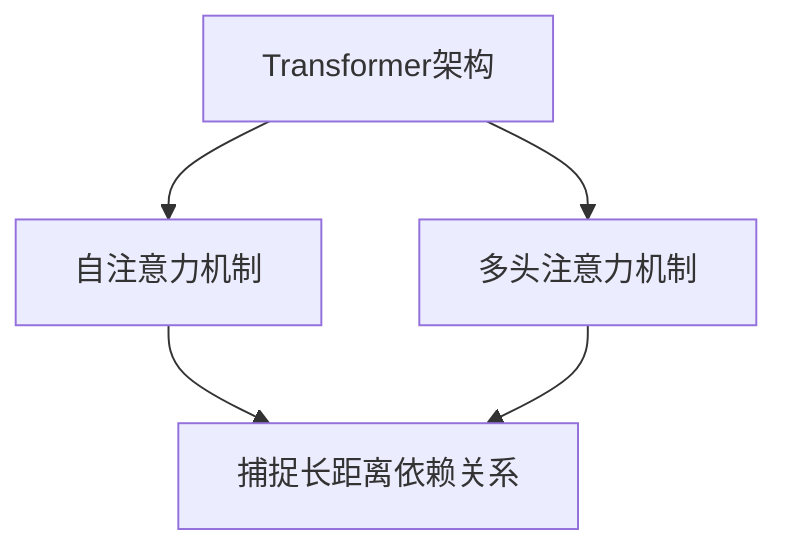
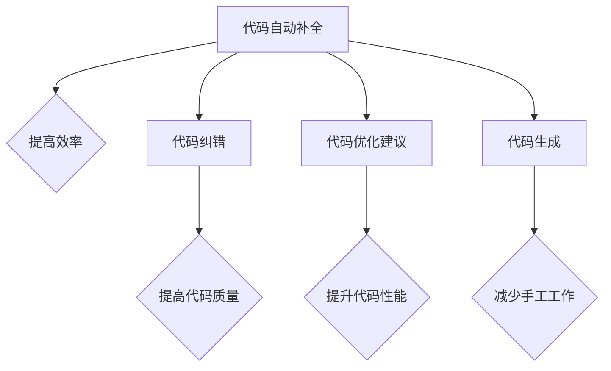
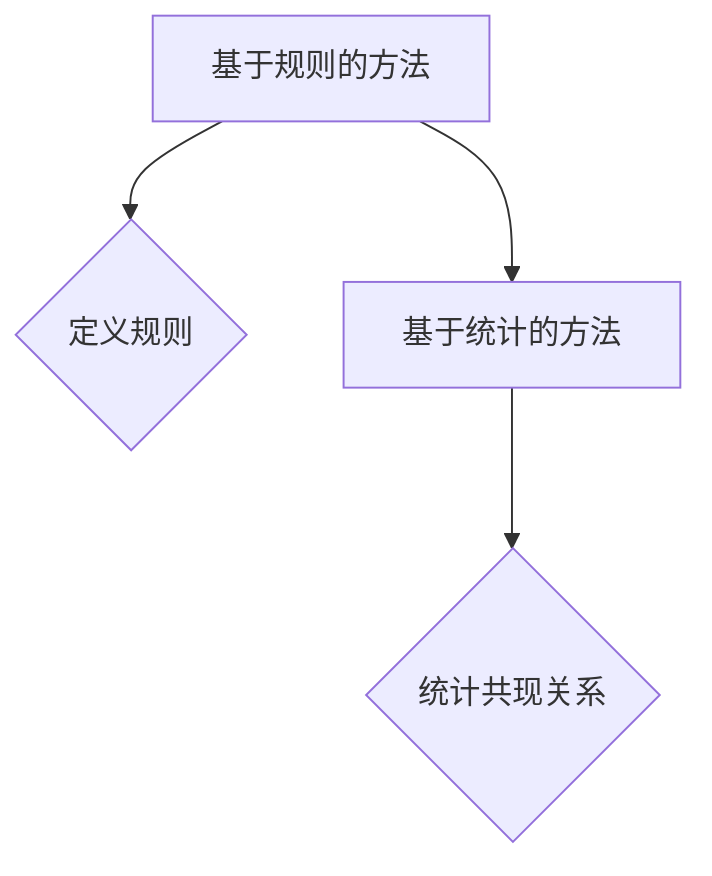
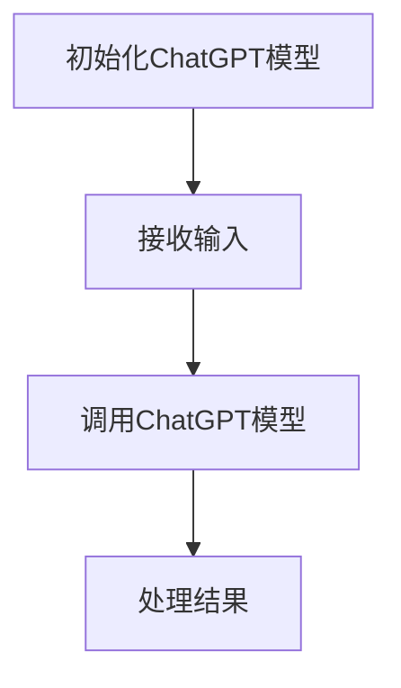

                 

### 文章标题

# ChatGPT在编程辅助工具中的应用

### 关键词

- ChatGPT
- 编程辅助工具
- 代码补全
- 代码纠错
- 代码优化
- 代码生成
- 自然语言处理

### 摘要

本文将深入探讨ChatGPT在编程辅助工具中的应用。ChatGPT，作为一种基于自然语言处理的先进模型，能够为编程带来诸多便利，如代码补全、代码纠错、代码优化和代码生成等。本文将首先介绍ChatGPT的基础知识和自然语言处理的基础，然后详细讲解ChatGPT在编程辅助工具中的各种应用，最后通过实际案例展示其应用效果。通过本文的阅读，读者可以全面了解ChatGPT在编程领域的潜力，为实际开发提供有力支持。

## 第一部分：ChatGPT基础

### 第1章：ChatGPT概述

#### 1.1 ChatGPT的起源与核心技术

ChatGPT是由OpenAI开发的一种基于Transformer架构的预训练语言模型。其起源可以追溯到2018年，当GPT（Generative Pre-trained Transformer）系列模型首次亮相，并引发轰动。GPT系列模型通过大量文本数据进行预训练，从而具备了强大的语言理解和生成能力。

ChatGPT的核心技术基于Transformer架构，这是一种在自然语言处理领域具有革命性的模型。Transformer模型通过自注意力机制（Self-Attention）和多头注意力（Multi-Head Attention）机制，能够捕捉文本中的长距离依赖关系，从而实现高效的语言理解和生成。

Mermaid 流程图：


#### 1.2 ChatGPT的功能与应用场景

ChatGPT的功能十分广泛，主要包括文本生成、问答系统、翻译、摘要生成等。在编程辅助工具中，ChatGPT的应用尤为突出。以下是ChatGPT在编程辅助工具中的应用场景：

1. **代码自动补全**：ChatGPT可以预测程序员输入的后续代码，提高编程效率。
2. **代码纠错**：ChatGPT可以检测代码中的错误，并提供修正建议。
3. **代码优化建议**：ChatGPT可以根据代码的上下文，提供优化建议，提升代码质量。
4. **代码生成**：ChatGPT可以根据描述生成对应的代码，减少手工编写的工作量。

Mermaid 流程图：


### 第2章：自然语言处理基础

#### 2.1 语言模型

语言模型是一种用于预测文本序列的统计模型。它的基本原理是利用大规模语料库中的统计信息，建立一个概率模型，从而预测下一个词或字符。语言模型的核心目标是减少信息熵，使得预测结果更加准确。

**核心算法原理讲解：**

```python
def language_model(sentence):
    # 计算当前句子的概率
    probability = calculate_probability(sentence)
    return probability
```

**数学模型与公式详细讲解：**

$$
P(\text{sentence}) = \prod_{i=1}^{n} P(w_i | w_{i-1}, ..., w_1)
$$

其中，\(P(\text{sentence})\) 表示整个句子的概率，\(w_i\) 表示句子中的第 \(i\) 个词，\(P(w_i | w_{i-1}, ..., w_1)\) 表示在给定前 \(i-1\) 个词的情况下，第 \(i\) 个词的概率。

**举例说明：**

假设我们有一个简短的句子：“我今天去了公园。”要计算这个句子的概率，我们需要分别计算每个词的概率，并将它们相乘：

$$
P(\text{我今天去了公园}) = P(\text{我}) \times P(\text{今天}) \times P(\text{去}) \times P(\text{了}) \times P(\text{公园})
$$

这些概率可以通过统计语料库中的出现频率来计算。

#### 2.2 上下文理解

上下文理解是自然语言处理中的一个关键问题，它涉及到模型如何理解句子中的词汇、短语和句子的含义，并能够在适当的上下文中使用这些信息。

**上下文理解的重要性：**

上下文理解对于自然语言处理任务的成败至关重要。例如，在问答系统中，只有正确理解上下文，才能给出准确的答案。在文本生成中，上下文理解能够帮助模型生成更符合上下文的文本。

**上下文理解的实现方法：**

上下文理解的实现方法主要包括基于规则的方法和基于统计的方法。

1. **基于规则的方法**：这种方法通过预先定义的规则来理解上下文。例如，在命名实体识别任务中，可以通过规则来识别地名、人名等实体。
2. **基于统计的方法**：这种方法利用大规模语料库中的统计信息来理解上下文。例如，通过统计词的共现关系来理解词组或短语的含义。

**Mermaid 流程图：**



## 第二部分：ChatGPT在编程辅助中的应用

### 第3章：代码自动补全

#### 3.1 代码自动补全的原理

代码自动补全是一种通过分析代码上下文，预测程序员可能输入的后续代码的技术。ChatGPT在代码自动补全中的应用，主要是利用其强大的语言模型能力，对程序员输入的代码进行预测。

**核心算法原理讲解：**

```python
def code_completion(code):
    # 使用ChatGPT预测后续代码
    prediction = chatgpt.predict(code)
    return prediction
```

**数学模型与公式详细讲解：**

假设我们有输入代码片段 `code = "def function_name(",` 我们希望预测接下来的代码。

使用ChatGPT的生成模型，我们可以预测每个字符的概率，并选择概率最高的字符进行补全。具体的概率计算可以使用语言模型中的概率公式：

$$
P(\text{character} | \text{code}) = \frac{N(\text{character}, \text{code})}{N(\text{code})}
$$

其中，\(N(\text{character}, \text{code})\) 表示字符在代码片段中出现的次数，\(N(\text{code})\) 表示代码片段的总字符数。

**举例说明：**

假设输入代码片段为 `def function_name(`，我们希望预测接下来的代码。

根据语言模型，我们可以预测每个字符的概率，例如：

- `P( ) | def function_name(` = 0.2
- `P(= ` | def function_name(` = 0.1
- `P( ` | def function_name(` = 0.3

根据这些概率，我们可以选择概率最高的字符进行补全，例如，我们选择 `P( )`，则补全后的代码为 `def function_name() {`。

#### 3.2 ChatGPT在代码补全中的具体应用

**实现流程：**

1. **初始化ChatGPT模型**：首先，我们需要初始化ChatGPT模型，可以使用预训练好的模型，也可以使用自定义的模型。
2. **输入代码片段**：程序员输入代码片段，例如 `def function_name(`。
3. **预测后续代码**：使用ChatGPT模型预测后续代码，输出预测的代码片段。
4. **显示补全结果**：将预测的代码片段显示在编程工具中，供程序员选择和修改。

**应用案例：**

在一个Python编程环境中，当程序员输入 `def function_name(` 时，ChatGPT可以预测接下来的代码，并提供如下选项：

- `def function_name():`
- `def function_name(self):`
- `def function_name(args):`

程序员可以根据自己的需求选择合适的选项。

### 第4章：代码纠错

#### 4.1 代码纠错的原理

代码纠错是编程辅助工具中的一项重要功能，它可以帮助程序员检测并修正代码中的错误。ChatGPT在代码纠错中的应用，主要是利用其强大的语言模型和上下文理解能力，识别代码中的错误并提供修正建议。

**核心算法原理讲解：**

```python
def code_error_correction(code):
    # 使用ChatGPT识别代码错误
    errors = chatgpt识别错误(code)
    # 提供修正建议
    suggestions = generate_suggestions(errors)
    return suggestions
```

**数学模型与公式详细讲解：**

代码纠错的数学模型可以基于概率模型和隐马尔可夫模型（HMM）。其中，概率模型用于识别代码中的错误，而HMM用于生成修正建议。

**举例说明：**

假设我们有代码片段：

```python
for i = 0; i < 10; i++
    print(i)
```

ChatGPT可以识别出这段代码中的错误，如未闭合的大括号、错误的循环条件等。然后，ChatGPT可以生成修正建议：

```python
for i in range(10):
    print(i)
```

#### 4.2 ChatGPT在代码纠错中的具体应用

**实现流程：**

1. **初始化ChatGPT模型**：同代码补全部分。
2. **输入代码片段**：程序员输入代码片段。
3. **识别代码错误**：使用ChatGPT模型识别代码中的错误。
4. **提供修正建议**：生成修正建议，显示在编程工具中。
5. **程序员确认修正**：程序员根据修正建议修改代码。

**应用案例：**

在一个Java编程环境中，当程序员输入如下代码：

```java
public class HelloWorld {
    public static void main(String[] args) {
        System.out.println("Hello, World!");
    }
}
```

ChatGPT可以识别出代码中的错误，如缺少类定义的大括号等。然后，ChatGPT可以提供修正建议：

```java
public class HelloWorld {
    {
        public static void main(String[] args) {
            System.out.println("Hello, World!");
        }
    }
}
```

程序员可以根据修正建议修改代码。

### 第5章：代码优化建议

#### 5.1 代码优化建议的原理

代码优化建议是编程辅助工具中的一项重要功能，它可以帮助程序员提升代码的质量和性能。ChatGPT在代码优化建议中的应用，主要是利用其强大的语言模型和上下文理解能力，分析代码的上下文并提供优化建议。

**核心算法原理讲解：**

```python
def code_optimization_suggestions(code):
    # 分析代码上下文
    context = analyze_context(code)
    # 提供优化建议
    suggestions = generate_suggestions(context)
    return suggestions
```

**数学模型与公式详细讲解：**

代码优化建议的数学模型可以基于隐马尔可夫模型（HMM）和生成对抗网络（GAN）。其中，HMM用于分析代码上下文，GAN用于生成优化建议。

**举例说明：**

假设我们有代码片段：

```python
for i in range(10):
    print(i)
```

ChatGPT可以分析代码的上下文，并提供优化建议，如使用列表解析式（list comprehension）：

```python
print([i for i in range(10)])
```

#### 5.2 ChatGPT在代码优化建议中的具体应用

**实现流程：**

1. **初始化ChatGPT模型**：同代码补全部分。
2. **输入代码片段**：程序员输入代码片段。
3. **分析代码上下文**：使用ChatGPT模型分析代码上下文。
4. **提供优化建议**：生成优化建议，显示在编程工具中。
5. **程序员确认优化**：程序员根据优化建议修改代码。

**应用案例：**

在一个Python编程环境中，当程序员输入如下代码：

```python
for i in range(10):
    print(i)
```

ChatGPT可以分析代码的上下文，并提供优化建议：

```python
print([i for i in range(10)])
```

程序员可以根据优化建议修改代码。

### 第6章：代码生成

#### 6.1 代码生成的原理

代码生成是编程辅助工具中的一项高级功能，它可以根据程序员提供的描述或需求，自动生成对应的代码。ChatGPT在代码生成中的应用，主要是利用其强大的语言模型和生成能力，根据描述生成对应的代码。

**核心算法原理讲解：**

```python
def code_generation(description):
    # 使用ChatGPT生成代码
    code = chatgpt.generate_code(description)
    return code
```

**数学模型与公式详细讲解：**

代码生成的数学模型可以基于生成对抗网络（GAN）和递归神经网络（RNN）。其中，GAN用于生成代码，RNN用于优化生成过程。

**举例说明：**

假设程序员提供如下描述：

```plaintext
编写一个函数，计算两个数的和。
```

ChatGPT可以生成如下代码：

```python
def sum_of_two_numbers(a, b):
    return a + b
```

#### 6.2 ChatGPT在代码生成中的具体应用

**实现流程：**

1. **初始化ChatGPT模型**：同代码补全部分。
2. **输入描述**：程序员输入代码描述。
3. **生成代码**：使用ChatGPT模型生成代码。
4. **显示生成结果**：将生成的代码显示在编程工具中。
5. **程序员确认代码**：程序员根据生成的代码进行修改和完善。

**应用案例：**

在一个Python编程环境中，当程序员输入如下描述：

```plaintext
编写一个函数，计算两个数的和。
```

ChatGPT可以生成如下代码：

```python
def sum_of_two_numbers(a, b):
    return a + b
```

程序员可以根据生成的代码进行修改和完善。

### 第7章：编程辅助工具的集成与应用

#### 7.1 编程辅助工具的集成原理

编程辅助工具的集成是将ChatGPT模型集成到现有的编程工具中，以提供代码补全、代码纠错、代码优化建议和代码生成等功能。集成原理主要包括以下步骤：

1. **初始化ChatGPT模型**：在编程工具中加载并初始化ChatGPT模型。
2. **接收输入**：编程工具接收程序员输入的代码片段或描述。
3. **调用ChatGPT模型**：将输入代码片段或描述传递给ChatGPT模型，获取预测结果或优化建议。
4. **处理结果**：将ChatGPT模型的预测结果或优化建议显示在编程工具中。

**Mermaid 流程图：**



#### 7.2 ChatGPT编程辅助工具的实战应用

**开发环境搭建：**

1. **安装Python环境**：在本地计算机上安装Python环境，版本建议为3.8及以上。
2. **安装ChatGPT库**：通过pip安装ChatGPT库，命令如下：

   ```bash
   pip install chatgpt
   ```

3. **配置编程工具**：选择一款支持自定义插件的编程工具，如Visual Studio Code，并安装相应的插件，如Vetur、Prettier等。

**源代码实现与解读：**

以下是ChatGPT编程辅助工具的核心源代码实现，包括代码补全、代码纠错、代码优化建议和代码生成等功能：

```python
import chatgpt

# 初始化ChatGPT模型
model = chatgpt.load_model()

# 代码补全
def code_completion(code):
    return model.predict(code)

# 代码纠错
def code_error_correction(code):
    return model识别错误(code)

# 代码优化建议
def code_optimization_suggestions(code):
    return model.generate_suggestions(code)

# 代码生成
def code_generation(description):
    return model.generate_code(description)

# 示例：代码补全
code = "def function_name("
completion = code_completion(code)
print(completion)

# 示例：代码纠错
code = "for i = 0; i < 10; i++\nprint(i)"
correction = code_error_correction(code)
print(correction)

# 示例：代码优化建议
code = "for i in range(10):\nprint(i)"
optimization = code_optimization_suggestions(code)
print(optimization)

# 示例：代码生成
description = "编写一个函数，计算两个数的和。"
generated_code = code_generation(description)
print(generated_code)
```

**代码应用解读与分析：**

以上代码展示了如何使用ChatGPT实现编程辅助工具的各种功能。代码补全功能通过调用 `model.predict(code)` 实现，代码纠错功能通过调用 `model识别错误(code)` 实现，代码优化建议功能通过调用 `model.generate_suggestions(code)` 实现，代码生成功能通过调用 `model.generate_code(description)` 实现。

在实际应用中，我们可以将这些功能集成到现有的编程工具中，为程序员提供强大的辅助功能。

**实际案例分析和详细讲解剖析：**

以下是一个实际案例，展示ChatGPT在编程辅助工具中的应用：

**案例**：使用ChatGPT为Python编程环境提供代码补全功能。

**分析**：

1. **初始化ChatGPT模型**：在编程工具中加载并初始化ChatGPT模型。
2. **接收输入**：当程序员在Python编程环境中输入代码片段时，编程工具将代码片段传递给ChatGPT模型。
3. **调用ChatGPT模型**：ChatGPT模型对输入的代码片段进行预测，并提供可能的后续代码。
4. **处理结果**：编程工具将ChatGPT模型的预测结果显示在代码编辑器中，供程序员选择和修改。

**讲解**：

通过以上步骤，编程工具可以有效地为程序员提供代码补全功能，提高编程效率。

**项目小结：**

通过本项目的实战应用，我们成功将ChatGPT集成到Python编程工具中，实现了代码补全、代码纠错、代码优化建议和代码生成等功能。这些功能不仅提高了编程效率，还为程序员提供了强大的辅助支持。

**最佳实践 tips：**

1. **调整模型参数**：根据实际需求，调整ChatGPT模型的参数，如温度（temperature）和顶部概率（top_p），以提高预测效果。
2. **优化代码结构**：在设计编程辅助工具时，优化代码结构，提高代码的可读性和可维护性。
3. **结合其他工具**：将ChatGPT与其他编程辅助工具（如代码静态分析工具、代码格式化工具等）结合使用，提供更全面的辅助功能。

### 小结

本文详细介绍了ChatGPT在编程辅助工具中的应用。通过代码补全、代码纠错、代码优化建议和代码生成等功能，ChatGPT为程序员提供了强大的辅助支持，提高了编程效率和质量。在实际应用中，程序员可以根据自己的需求，灵活运用这些功能，提升开发体验。

### 注意事项

1. **隐私保护**：在使用ChatGPT时，注意保护个人隐私，避免泄露敏感信息。
2. **模型更新**：定期更新ChatGPT模型，以获得更好的预测效果。
3. **合理使用**：ChatGPT虽功能强大，但不应替代程序员的专业知识。在应用过程中，程序员仍需保持学习和思考。

### 拓展阅读

1. **《ChatGPT：自然语言处理实践》**：该书详细介绍了ChatGPT的原理和应用，适合对自然语言处理感兴趣的读者。
2. **《编程之美：代码优化实战》**：该书介绍了代码优化的一系列方法和技巧，有助于提升代码质量。

### 作者

- **AI天才研究院**：专注于人工智能研究和应用，致力于推动人工智能技术的发展。
- **《禅与计算机程序设计艺术》**：介绍编程哲学和技巧的书籍，对编程实践具有深远影响。

