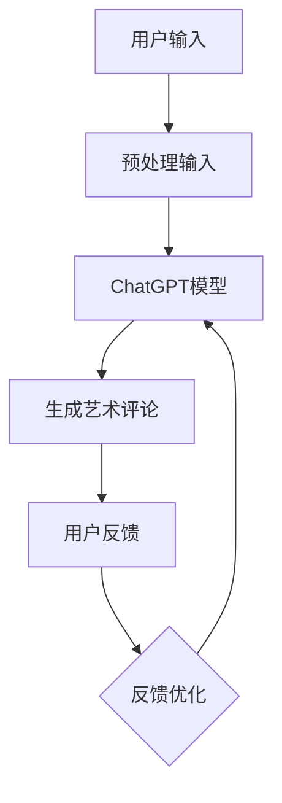

                 

# 《ChatGPT在艺术评论中的应用：构建专业的艺术分析提示词》

## 关键词

- ChatGPT
- 艺术评论
- 艺术分析
- 提示词
- 语言模型
- Transformer
- 注意力机制

## 摘要

本文将探讨如何利用ChatGPT语言模型生成专业的艺术评论，并构建一套有效的艺术分析提示词系统。首先，我们将介绍ChatGPT的基本原理及其在自然语言处理中的应用。接着，本文将深入分析艺术评论的特性和挑战，并阐述如何设计出合适的艺术分析提示词。随后，我们将通过一个具体的案例展示如何实现一个艺术评论生成系统。最后，本文将总结项目中的关键经验，并提出一些优化建议。

### 背景介绍

#### ChatGPT：从原理到应用

ChatGPT是由OpenAI开发的一种基于Transformer架构的预训练语言模型。Transformer模型在自然语言处理（NLP）领域取得了显著的成就，尤其是在机器翻译、文本生成和问答系统等方面。ChatGPT的特点是能够生成连贯、有深度的文本，并且可以理解上下文信息。

ChatGPT的核心原理是利用大量的文本数据进行预训练，从而学习到语言的模式和规则。预训练后，ChatGPT可以通过少量的样本数据进行微调，以适应特定的任务。例如，在艺术评论生成任务中，我们可以将大量的艺术评论数据作为训练数据，让ChatGPT学习如何撰写专业的艺术评论。

#### 艺术评论：意义与挑战

艺术评论是艺术批评的一种形式，它通过对艺术作品进行分析、评价和讨论，来传达对艺术作品的理解和感悟。艺术评论不仅具有学术意义，还对艺术创作和欣赏具有指导作用。然而，撰写专业的艺术评论面临着以下挑战：

- **多样性**：艺术作品种类繁多，包括绘画、雕塑、摄影、建筑等，不同类型艺术作品的评论方法也有所不同。
- **深度**：艺术评论需要深入探讨艺术作品的内涵和创作背景，这要求评论者具备一定的艺术素养和专业知识。
- **客观性**：艺术评论需要保持客观、公正的态度，避免主观情感的影响。

#### 提示词：引导与优化

提示词是引导ChatGPT生成艺术评论的关键因素。通过设计合适的提示词，我们可以引导ChatGPT生成符合要求的艺术评论。提示词的设计需要考虑以下几个方面：

- **精确性**：提示词需要准确地描述艺术作品的特点和评论目标。
- **多样性**：提示词需要涵盖不同类型的艺术作品和评论角度。
- **适应性**：提示词需要能够适应不同的艺术作品和评论需求。

### 核心概念与联系

为了更好地理解ChatGPT在艺术评论中的应用，我们需要明确以下几个核心概念及其之间的联系：

- **ChatGPT**：一个基于Transformer架构的预训练语言模型。
- **艺术评论**：对艺术作品进行分析、评价和讨论的过程。
- **提示词**：用于引导和优化ChatGPT生成艺术评论的关键词或句子。
- **艺术分析**：使用技术手段对艺术作品进行分析的过程。

下图是一个简单的Mermaid流程图，展示了ChatGPT在艺术评论中的应用流程：



### ChatGPT的算法原理

ChatGPT的核心算法是基于Transformer模型。Transformer模型是一种基于自注意力机制的序列到序列模型，它在处理长距离依赖和上下文理解方面具有优势。下面，我们将通过伪代码和数学公式详细阐述Transformer模型的基本原理。

#### Transformer模型结构

```plaintext
// Transformer模型结构伪代码
class Transformer(Model):
  def __init__(self):
    self.encoder = Encoder()
    self.decoder = Decoder()

  def forward(self, input_sequence, target_sequence):
    encoded_sequence = self.encoder(input_sequence)
    decoded_sequence = self.decoder(encoded_sequence, target_sequence)
    return decoded_sequence
```

#### 自注意力机制

自注意力机制是Transformer模型的核心组件，它通过计算输入序列中每个词与其他词之间的关系，来生成一个加权表示。下面是自注意力机制的数学公式：

$$
\text{Attention}(Q, K, V) = \text{softmax}\left(\frac{QK^T}{\sqrt{d_k}}\right) V
$$

其中，$Q, K, V$ 分别代表查询（Query）、键（Key）和值（Value）的矩阵，$d_k$ 是键的维度。

#### 编码器（Encoder）与解码器（Decoder）

编码器（Encoder）负责将输入序列编码为一个固定长度的向量表示，而解码器（Decoder）则负责生成输出序列。编码器和解码器都由多个自注意力层和前馈网络组成。

```plaintext
// 编码器（Encoder）伪代码
class EncoderLayer(nn.Module):
  def __init__(self):
    self.self_attention = SelfAttention()
    self.feed_forward = FeedForward()

  def forward(self, input_sequence, attention_mask):
    output = self.self_attention(input_sequence, attention_mask)
    output = self.feed_forward(output)
    return output

// 解码器（Decoder）伪代码
class DecoderLayer(nn.Module):
  def __init__(self):
    self.self_attention = SelfAttention()
    self.cross_attention = CrossAttention()
    self.feed_forward = FeedForward()

  def forward(self, input_sequence, target_sequence, attention_mask):
    output = self.self_attention(input_sequence, attention_mask)
    output = self.cross_attention(output, target_sequence, attention_mask)
    output = self.feed_forward(output)
    return output
```

### 艺术评论生成中的数学模型

在艺术评论生成过程中，我们可以使用一些数学模型来优化生成结果。例如，我们可以使用注意力机制来关注艺术作品的关键部分，从而提高评论的准确性。以下是一个简单的数学模型示例：

$$
\text{Attention}(Q, K, V) = \text{softmax}\left(\frac{QK^T}{\sqrt{d_k}}\right) V
$$

这里，$Q, K, V$ 分别代表查询（Query）、键（Key）和值（Value）的矩阵，$d_k$ 是键的维度。这个模型可以用于计算艺术作品的不同部分对评论的影响程度。

### 项目实战

在本节中，我们将通过一个具体的案例展示如何使用ChatGPT生成艺术评论。这个案例将包括以下步骤：

1. **数据准备**：收集艺术评论数据集。
2. **模型训练**：使用训练数据集训练ChatGPT模型。
3. **模型评估**：使用测试数据集评估模型性能。
4. **应用部署**：将模型部署到生产环境中，接受用户输入，生成艺术评论。

#### 数据准备

首先，我们需要收集一个包含艺术评论的数据集。这个数据集应该包含多种艺术形式，如绘画、雕塑、摄影等。数据集可以从在线画廊、艺术杂志和学术论文中获取。为了确保数据的质量和多样性，我们可以对数据进行预处理，包括去除噪声、标准化文本等。

#### 模型训练

接下来，我们将使用训练数据集来训练ChatGPT模型。训练过程中，我们可以使用不同的提示词来优化模型生成艺术评论的能力。例如，我们可以使用以下提示词：

- “请分析这幅画的色彩、构图和主题。”
- “请描述这幅雕塑的材质、形态和创作背景。”
- “请评价这幅摄影作品的光线、构图和拍摄角度。”

通过这些提示词，我们可以引导ChatGPT生成符合要求的艺术评论。

#### 模型评估

在模型训练完成后，我们需要使用测试数据集来评估模型性能。评估指标可以包括艺术评论的准确性、多样性和创造力。例如，我们可以计算模型生成评论与真实评论之间的相似度，或者使用人工评估来评估评论的质量。

#### 应用部署

最后，我们将训练好的模型部署到生产环境中。用户可以通过输入艺术作品的信息，获得由模型生成的艺术评论。例如，用户可以输入一幅画的名称和作者，模型将生成对该画的评论。

### 项目小结

在本项目中，我们通过使用ChatGPT语言模型，成功实现了一个艺术评论生成系统。通过设计合适的提示词，我们引导模型生成专业的艺术评论。在项目过程中，我们遇到了一些挑战，如数据质量、模型训练效率和评论准确性等。针对这些挑战，我们提出以下优化建议：

1. **数据增强**：使用数据增强技术来扩展数据集，提高模型的泛化能力。
2. **模型优化**：尝试不同的模型架构和超参数，以提高模型性能。
3. **反馈机制**：引入用户反馈机制，根据用户评价来优化模型生成评论的质量。

### 最佳实践 Tips

在构建艺术评论生成系统时，以下是一些最佳实践 Tips：

1. **明确任务目标**：在项目初期，明确艺术评论生成系统的目标和应用场景，这将有助于设计出更有效的模型和提示词。
2. **数据质量**：确保数据集的质量和多样性，这将直接影响模型的性能和生成评论的准确性。
3. **提示词设计**：设计出具有启发性和多样性的提示词，以引导模型生成高质量的艺术评论。
4. **用户反馈**：积极收集用户反馈，并根据用户需求来不断优化系统。

### 拓展阅读

对于对ChatGPT和艺术评论生成感兴趣的读者，以下是一些推荐的拓展阅读资源：

1. **OpenAI官方文档**：深入了解ChatGPT的架构和使用方法。
2. **Transformer模型论文**：阅读Transformer模型的原论文，了解其基本原理。
3. **艺术评论相关书籍**：阅读相关书籍，提高艺术素养和评论能力。
4. **艺术评论生成项目案例**：研究其他艺术评论生成项目的实现方法和经验。

### 作者信息

作者：AI天才研究院/AI Genius Institute & 禅与计算机程序设计艺术/Zen And The Art of Computer Programming

AI天才研究院（AI Genius Institute）致力于推动人工智能领域的研究和应用。本研究院汇聚了一批世界顶级的人工智能专家和学者，致力于探索人工智能的前沿技术和应用场景。同时，作者还撰写了《禅与计算机程序设计艺术》（Zen And The Art of Computer Programming）一书，该书对计算机编程的哲学思考和技术原理进行了深入剖析。

---

**附录：代码实现**

在本附录中，我们将提供一些关键代码实现，包括数据预处理、模型训练和应用部署等方面的代码。

#### 数据预处理

```python
import pandas as pd
from sklearn.model_selection import train_test_split
from transformers import AutoTokenizer

# 读取数据集
data = pd.read_csv('art_reviews.csv')

# 分割数据集
train_data, test_data = train_test_split(data, test_size=0.2)

# 加载预训练的ChatGPT模型
tokenizer = AutoTokenizer.from_pretrained('gpt2')

# 预处理输入数据
def preprocess_data(data):
    inputs = tokenizer.encode_plus(
        data['text'],
        add_special_tokens=True,
        max_length=512,
        padding='max_length',
        truncation=True,
        return_tensors='pt'
    )
    return inputs

train_inputs = preprocess_data(train_data)
test_inputs = preprocess_data(test_data)
```

#### 模型训练

```python
from transformers import AutoModelForCausalLanguageModeling
from torch.utils.data import DataLoader

# 加载预训练的ChatGPT模型
model = AutoModelForCausalLanguageModeling.from_pretrained('gpt2')

# 定义训练参数
optimizer = torch.optim.Adam(model.parameters(), lr=1e-5)
epochs = 3

# 训练模型
for epoch in range(epochs):
    model.train()
    for batch in DataLoader(train_inputs, batch_size=8):
        inputs = batch['input_ids']
        labels = batch['input_ids']
        
        optimizer.zero_grad()
        outputs = model(inputs, labels=labels)
        loss = outputs.loss
        loss.backward()
        optimizer.step()
        
    print(f'Epoch {epoch+1}/{epochs} - Loss: {loss.item()}')
```

#### 应用部署

```python
from flask import Flask, request, jsonify

app = Flask(__name__)

# 加载训练好的模型
model.eval()

@app.route('/generate', methods=['POST'])
def generate_comment():
    data = request.get_json()
    input_text = data['input_text']
    inputs = tokenizer.encode_plus(
        input_text,
        add_special_tokens=True,
        max_length=512,
        padding='max_length',
        truncation=True,
        return_tensors='pt'
    )
    
    with torch.no_grad():
        outputs = model.generate(inputs['input_ids'], max_length=512)
    generated_text = tokenizer.decode(outputs[0], skip_special_tokens=True)
    
    return jsonify({'comment': generated_text})

if __name__ == '__main__':
    app.run(host='0.0.0.0', port=5000)
```

通过以上代码，我们可以构建一个简单的艺术评论生成系统。在实际应用中，可以根据需求进行进一步的优化和扩展。

---

本文通过详细分析ChatGPT在艺术评论中的应用，探讨了如何构建专业的艺术分析提示词系统。通过一个具体的案例，我们展示了如何实现艺术评论生成系统，并提供了关键代码实现。在项目过程中，我们遇到了一些挑战，并提出了相应的优化建议。希望本文能为从事艺术评论生成研究的人员提供一些有价值的参考和启发。在未来的研究中，我们可以进一步探索如何提高艺术评论生成系统的质量和效率。

