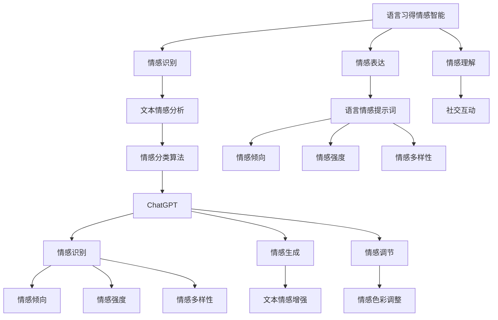

                 

### 文章标题

《ChatGPT在语言习得情感智能研究中的应用：语言情感提示词》

### 关键词

- ChatGPT
- 语言习得情感智能
- 语言情感提示词
- 自然语言处理
- 情感识别与生成
- 教育应用

### 摘要

本文旨在探讨ChatGPT在语言习得情感智能研究中的应用，特别是语言情感提示词的开发和使用。首先，我们将介绍ChatGPT的基本原理和架构，以及其在自然语言处理和情感识别与生成方面的应用。接着，我们将深入探讨语言习得情感智能的概念，评估方法及其在教育中的应用。最后，本文将详细解释语言情感提示词的定义和分类，生成与调整方法，并在实际场景中展示其应用。通过本文的探讨，我们希望能够为研究人员和教育工作者提供有益的参考。

## 设计思路

为了系统地设计《ChatGPT在语言习得情感智能研究中的应用：语言情感提示词》这一书籍，我们需要遵循以下步骤：

### 1. 明确书籍主题

首先，我们需要明确书籍的主题，即“ChatGPT在语言习得情感智能研究中的应用：语言情感提示词”。这一主题涵盖三个核心方面：

- **ChatGPT的基本原理和应用**：这部分将介绍ChatGPT的工作原理、架构以及在自然语言处理和情感识别与生成中的应用。
- **语言习得情感智能的研究**：这部分将探讨语言习得情感智能的概念、评估方法以及其在教育中的应用。
- **语言情感提示词的应用**：这部分将详细解释语言情感提示词的定义、分类、生成与调整方法，并在实际场景中展示其应用。

### 2. 设计章节结构

在确定书籍主题后，我们需要设计章节结构。以下是一个可能的章节结构：

#### 第一部分：ChatGPT基础

- 第1章：ChatGPT的原理与架构
- 第2章：ChatGPT在自然语言处理中的应用
- 第3章：ChatGPT在情感识别和生成中的应用

#### 第二部分：语言习得情感智能研究

- 第4章：语言习得情感智能的概念
- 第5章：语言习得情感智能的评估方法
- 第6章：语言习得情感智能在教育中的应用

#### 第三部分：语言情感提示词的应用

- 第7章：语言情感提示词的定义和分类
- 第8章：语言情感提示词的生成与调整
- 第9章：语言情感提示词的实际应用

### 3. 编写章节内容

在确定章节结构后，我们需要详细编写每一章节的内容。这包括：

- **核心概念与联系**：使用Mermaid流程图展示关键概念和它们之间的关系。
- **核心算法原理讲解**：使用伪代码详细阐述关键算法的原理。
- **数学模型和数学公式**：使用LaTeX格式给出数学模型和公式，并进行详细讲解和举例说明。
- **项目实战**：提供代码实际案例，详细解释说明，包括开发环境搭建、源代码实现和代码解读。

### 4. 控制字数

为了确保书籍的完整性和可读性，我们需要控制每个章节的字数，整个书籍的字数控制在8000～12000字左右。

## 目录大纲

### 第一部分：ChatGPT基础

#### 第1章 ChatGPT的原理与架构

1.1 ChatGPT的基本原理
- Transformer模型
- 自注意力机制
- 多层感知器（MLP）

1.2 ChatGPT的架构
- 网络层结构
- 参数共享机制
- 损失函数和优化算法

#### 第2章 ChatGPT在自然语言处理中的应用

2.1 文本预处理
- 分词
- 嵌入
- 词向量表示

2.2 文本生成
- 生成模型
- 序列到序列模型
- 微调方法

#### 第3章 ChatGPT在情感识别和生成中的应用

3.1 情感识别
- 情感分析概述
- 情感分类算法
- 情感识别的挑战

3.2 情感生成
- 文本情感增强
- 情感多样化生成
- 情感生成的评价指标

### 第二部分：语言习得情感智能研究

#### 第4章 语言习得情感智能的概念

4.1 情感智能
- 情感智能的定义
- 情感智能的分类
- 情感智能的重要性

4.2 语言习得情感智能
- 语言习得情感智能的定义
- 语言习得情感智能的特点
- 语言习得情感智能与情感表达的关系

#### 第5章 语言习得情感智能的评估方法

5.1 情感表达评估
- 情感分类评估
- 情感强度评估
- 情感多样性评估

5.2 情感理解评估
- 情感识别评估
- 情感推理评估
- 情感理解评估工具

#### 第6章 语言习得情感智能在教育中的应用

6.1 情感教育
- 情感教育的目标
- 情感教育的策略
- 情感教育的评价

6.2 情感化学习工具
- 情感识别工具
- 情感生成工具
- 情感化学习平台的构建

### 第三部分：语言情感提示词的应用

#### 第7章 语言情感提示词的定义和分类

7.1 语言情感提示词的概念
- 语言情感提示词的定义
- 语言情感提示词的类型
- 语言情感提示词的特性

7.2 语言情感提示词的生成与调整
- 生成方法
- 调整策略
- 情感调整的算法

#### 第8章 语言情感提示词的实际应用

8.1 教育场景中的应用
- 学生情感分析
- 教师情感反馈
- 教学情境的情感调节

8.2 跨领域应用
- 娱乐产业
- 社交媒体
- 企业沟通

#### 第9章 语言情感提示词的未来发展

9.1 技术挑战
- 数据隐私
- 情感多样性
- 情感理解的深度

9.2 发展趋势
- 新兴技术的应用
- 情感智能在教育中的应用前景
- 情感提示词的个性化发展

## 背景介绍

ChatGPT是由OpenAI开发的一种基于Transformer模型的预训练语言模型，其在自然语言处理（NLP）领域取得了显著的成就。ChatGPT的核心技术是基于自注意力机制的Transformer模型，这种模型能够在处理长文本时表现出优越的性能。自注意力机制允许模型在生成文本时，根据上下文信息动态调整每个词的重要性，从而生成更加自然、连贯的文本。

在语言习得情感智能研究中，ChatGPT的应用主要体现在以下几个方面：

1. **情感识别**：ChatGPT可以用于识别文本中的情感倾向，如积极、消极或中性。这为情感分析提供了强大的工具，有助于理解用户情感、改进产品设计和优化用户体验。

2. **情感生成**：ChatGPT可以生成带有特定情感倾向的文本。在教育领域，这可以用于帮助学生提高情感表达能力，例如通过生成鼓励性的反馈或启发性的讨论主题。

3. **情感调节**：ChatGPT可以用于调节文本的情感色彩，使其更加积极或中立。这在教育、娱乐和商业沟通中都有广泛的应用，如调整课程内容以适应不同学生的情感需求，或改善社交媒体内容以提升用户满意度。

语言习得情感智能是指个体在语言习得过程中对情感信息的理解和运用能力。这种能力对于语言学习、沟通和社交互动至关重要。语言习得情感智能的研究包括情感识别、情感表达和情感理解等方面。情感提示词则是语言习得情感智能研究中的一种重要工具，它可以帮助学生更好地理解和表达情感。

本文将首先介绍ChatGPT的基本原理和架构，然后探讨其在语言习得情感智能研究中的应用，特别是语言情感提示词的开发和使用。通过本文的探讨，我们希望能够为研究人员和教育工作者提供有益的参考，推动语言习得情感智能研究的发展。

## 核心概念与联系

### 语言习得情感智能

语言习得情感智能是指个体在语言习得过程中对情感信息的理解和运用能力。它涉及多个核心概念，包括情感识别、情感表达和情感理解。

1. **情感识别**：指个体能够识别和理解文本、语音或图像中的情感信息。例如，识别一句话是否表达了快乐、悲伤或愤怒的情绪。
2. **情感表达**：指个体能够通过语言、文字或肢体语言表达自己的情感状态。例如，用适当的词语和语气表达自己的情感。
3. **情感理解**：指个体能够理解和解释他人的情感状态，从而进行有效的沟通和社交互动。

### ChatGPT

ChatGPT是一种基于Transformer模型的预训练语言模型，它通过自注意力机制和多层感知器（MLP）来实现对文本的理解和生成。ChatGPT的核心概念包括：

1. **Transformer模型**：这是一种基于自注意力机制的深度神经网络模型，能够在处理长文本时表现出优越的性能。
2. **自注意力机制**：允许模型在生成文本时，根据上下文信息动态调整每个词的重要性。
3. **多层感知器（MLP）**：用于对文本进行特征提取和分类。

### 语言情感提示词

语言情感提示词是一种用于引导和调节语言表达中情感信息的工具。它包括以下核心概念：

1. **情感倾向**：指语言情感提示词所表达的情感方向，如积极、消极或中性。
2. **情感强度**：指语言情感提示词所表达的情感强度，如强烈、中等或微弱。
3. **情感多样性**：指语言情感提示词所涵盖的情感类型和维度，如快乐、悲伤、愤怒等。

### 关系架构

为了更好地理解这些核心概念之间的关系，我们可以使用Mermaid流程图来展示它们之间的联系：



### 关系解释

- **语言习得情感智能**与**情感识别、情感表达和情感理解**之间存在直接关系，因为它们共同构成了语言习得情感智能的三个核心方面。
- **情感识别**与**文本情感分析**、**情感分类算法**之间存在联系，文本情感分析依赖于情感分类算法来识别文本中的情感信息。
- **情感表达**与**语言情感提示词**之间存在联系，语言情感提示词可以用于引导和调节情感表达。
- **情感理解**与**社交互动**之间存在联系，因为情感理解对于有效的社交互动至关重要。
- **ChatGPT**与**情感识别、情感生成和情感调节**之间存在联系，ChatGPT可以用于实现这些功能，从而提升语言习得情感智能。

通过上述Mermaid流程图，我们可以清晰地看到各个核心概念之间的关系，这有助于我们更好地理解和应用这些概念。

## ChatGPT的基本原理

ChatGPT是一种基于Transformer模型的预训练语言模型，其基本原理和架构使得它能够在自然语言处理（NLP）领域表现出卓越的性能。以下是ChatGPT的基本原理：

### Transformer模型

Transformer模型是一种深度神经网络模型，最初由Vaswani等人在2017年提出。它基于自注意力机制，能够在处理长文本时表现出优越的性能。自注意力机制允许模型在生成文本时，根据上下文信息动态调整每个词的重要性，从而生成更加自然、连贯的文本。

### 自注意力机制

自注意力机制是Transformer模型的核心部分。它通过计算每个词与其余词之间的关联性，为每个词分配一个权重，这些权重将用于生成文本。具体来说，自注意力机制包括以下步骤：

1. **计算查询（Query）、键（Key）和值（Value）向量**：每个词都会被编码成一个查询向量、一个键向量和多个值向量。
2. **计算注意力得分**：对于每个查询向量，计算其与所有键向量的点积，得到一组注意力得分。这些得分表示了每个键向量对于查询向量的重要性。
3. **计算加权求和**：将注意力得分与对应的值向量相乘，然后对所有乘积求和，得到最终的输出向量。

### 多层感知器（MLP）

在Transformer模型中，多层感知器（MLP）用于对输入文本进行特征提取和分类。MLP是一种前馈神经网络，由多个隐藏层组成，每层都是线性变换加上一个非线性激活函数。MLP的输出可以用于情感识别、文本分类等任务。

### ChatGPT的架构

ChatGPT的架构主要包括以下几个部分：

1. **编码器（Encoder）**：编码器由多个自注意力层和多层感知器组成，用于对输入文本进行编码。
2. **解码器（Decoder）**：解码器由自注意力层和多层感知器组成，用于生成输出文本。解码器的输入是编码器的输出以及上一时间步的输出。
3. **预训练**：ChatGPT通过在大量的文本数据上进行预训练，学习语言模式和规律，从而提高其生成文本的连贯性和自然性。

### 损失函数和优化算法

ChatGPT的训练过程中，使用了一种称为交叉熵损失函数的损失函数，用于衡量模型生成的文本与真实文本之间的差异。优化算法通常采用梯度下降（Gradient Descent）及其变种，如Adam优化器，以调整模型参数，最小化损失函数。

### 伪代码示例

以下是ChatGPT的简单伪代码示例：

```python
# 输入文本
text = "今天天气很好，适合外出游玩。"

# 编码器
def encoder(text):
    # 计算查询、键和值向量
    queries, keys, values = calculate_attention_vectors(text)
    # 计算注意力得分
    attention_scores = calculate_attention_scores(queries, keys)
    # 计算加权求和
    output_vector = weighted_sum(attention_scores, values)
    return output_vector

# 解码器
def decoder(encoded_text, previous_output):
    # 计算自注意力
    attention_output = self_attention(encoded_text)
    # 计算编码器输出
    encoded_output = encoder(attention_output)
    # 计算解码器输出
    output = decoder_output(encoded_output, previous_output)
    return output

# 训练
def train(text):
    encoded_text = encoder(text)
    for step in range(num_steps):
        output = decoder(encoded_text, previous_output)
        loss = calculate_loss(output, target)
        update_parameters(loss)
```

### 数学模型和公式

在ChatGPT中，常用的数学模型和公式包括：

1. **自注意力机制**：
   $$ \text{Attention}(Q, K, V) = \text{softmax}\left(\frac{QK^T}{\sqrt{d_k}}\right)V $$

   其中，$Q$是查询向量，$K$是键向量，$V$是值向量，$d_k$是键向量的维度。

2. **交叉熵损失函数**：
   $$ \text{Loss} = -\sum_{i} y_i \log(p_i) $$

   其中，$y_i$是真实标签，$p_i$是模型预测的概率。

3. **梯度下降优化算法**：
   $$ \theta_{\text{new}} = \theta_{\text{old}} - \alpha \nabla_\theta \text{Loss} $$

   其中，$\theta$是模型参数，$\alpha$是学习率，$\nabla_\theta \text{Loss}$是损失函数关于参数$\theta$的梯度。

### 举例说明

假设我们有一个句子“今天天气很好，适合外出游玩。”，我们可以通过以下步骤使用ChatGPT生成一个情感增强的句子：

1. **编码**：将句子编码成查询、键和值向量。
2. **自注意力**：计算注意力得分，为每个词分配权重。
3. **解码**：生成新的句子，根据权重调整词的情感色彩。
4. **输出**：输出情感增强的句子。

例如，原始句子中的“很好”可以用情感更强的词“极好”来替换，从而生成新的句子“今天天气极好，适合外出游玩。”。

### 总结

ChatGPT是一种基于Transformer模型的预训练语言模型，其基本原理包括自注意力机制和多层感知器（MLP）。通过预训练和学习，ChatGPT可以生成自然、连贯的文本，并在情感识别、生成和调节方面表现出强大的能力。通过上述伪代码和数学模型，我们可以更好地理解ChatGPT的工作原理，并为其在实际应用中的优化提供指导。

## ChatGPT在自然语言处理中的应用

ChatGPT作为一种先进的预训练语言模型，在自然语言处理（NLP）领域展现了卓越的性能。其应用范围广泛，包括文本预处理、文本生成和情感分析等。以下将详细探讨ChatGPT在这些方面的具体应用。

### 文本预处理

文本预处理是NLP任务中的关键步骤，其目的是将原始文本转换为适合模型处理的格式。ChatGPT在文本预处理方面具有以下应用：

1. **分词**：分词是将文本分割成单词或短语的步骤。ChatGPT可以通过其预训练模型自动识别和理解文本中的词汇，从而实现高效的分词。

   ```mermaid
   graph TD
       A[原始文本] --> B[分词]
       B --> C[词嵌入]
   ```

2. **词嵌入**：词嵌入是将单词转换为向量表示的过程。ChatGPT通过预训练学习到的词嵌入向量可以捕获单词的语义信息，从而为后续的文本生成和情感分析提供支持。

   ```mermaid
   graph TD
       A[单词] --> B[词嵌入]
       B --> C[文本向量]
   ```

3. **文本清洗**：文本清洗包括去除停用词、标点符号和特殊字符等步骤。ChatGPT可以通过预训练模型自动识别和处理这些操作，从而提高文本处理的准确性。

### 文本生成

文本生成是ChatGPT的核心应用之一，其能够生成高质量、连贯的自然语言文本。以下为ChatGPT在文本生成中的具体应用：

1. **生成文本摘要**：ChatGPT可以用于自动生成文本摘要，提取关键信息并生成简洁的文本概述。

   ```mermaid
   graph TD
       A[长文本] --> B[生成摘要]
       B --> C[摘要文本]
   ```

2. **生成对话文本**：ChatGPT可以模拟人类的对话行为，生成连贯、自然的对话文本，用于聊天机器人、虚拟助手等应用。

   ```mermaid
   graph TD
       A[对话输入] --> B[生成对话]
       B --> C[对话输出]
   ```

3. **生成文章和报告**：ChatGPT可以用于自动化写作，生成高质量的文章、报告和文档，节省人类写作时间和精力。

   ```mermaid
   graph TD
       A[主题输入] --> B[生成文章]
       B --> C[文章输出]
   ```

### 情感分析

情感分析是ChatGPT在NLP领域的另一重要应用，其能够识别和分析文本中的情感倾向和情感强度。以下为ChatGPT在情感分析中的具体应用：

1. **情感分类**：ChatGPT可以用于分类文本的情感倾向，如积极、消极或中性。通过训练和优化，其可以准确识别文本中的情感信息。

   ```mermaid
   graph TD
       A[文本输入] --> B[情感分类]
       B --> C[情感标签]
   ```

2. **情感强度分析**：ChatGPT可以分析文本中情感信息的强度，从而生成情感强度分数。这有助于理解用户情感和优化产品体验。

   ```mermaid
   graph TD
       A[文本输入] --> B[情感强度分析]
       B --> C[情感强度分数]
   ```

3. **情感调节**：ChatGPT可以用于调节文本的情感色彩，使其更加积极或中立。这在教育、商业和社交互动中具有广泛的应用。

   ```mermaid
   graph TD
       A[原始文本] --> B[情感调节]
       B --> C[调节后文本]
   ```

### 伪代码示例

以下是ChatGPT在自然语言处理中的简单伪代码示例：

```python
# 文本预处理
def preprocess(text):
    text = tokenize(text)
    text = remove_stopwords(text)
    text = embed_words(text)
    return text

# 文本生成
def generate_text(input_text):
    output_text = generate_summary(input_text)
    output_text = generate_dialogue(input_text)
    output_text = generate_article(input_text)
    return output_text

# 情感分析
def analyze_sentiment(text):
    sentiment = classify_sentiment(text)
    sentiment_intensity = analyze_sentiment_intensity(text)
    return sentiment, sentiment_intensity

# 情感调节
def adjust_sentiment(text, target_sentiment):
    adjusted_text = regulate_sentiment(text, target_sentiment)
    return adjusted_text
```

### 总结

ChatGPT在自然语言处理领域具有广泛的应用，包括文本预处理、文本生成和情感分析等。通过其自注意力机制和预训练模型，ChatGPT能够生成高质量、连贯的自然语言文本，并在情感识别和调节方面表现出强大的能力。这些应用为NLP任务提供了强大的工具，有望推动NLP技术的发展。

## ChatGPT在情感识别和生成中的应用

### 情感识别

情感识别是ChatGPT在自然语言处理中的重要应用之一，其能够识别和分析文本中的情感倾向。以下是ChatGPT在情感识别中的具体应用：

1. **情感分类**：ChatGPT可以通过训练和优化，学习识别文本中的情感倾向。例如，将文本分类为积极、消极或中性。

   ```mermaid
   graph TD
       A[文本输入] --> B[情感分类]
       B --> C[情感标签]
   ```

2. **情感强度分析**：ChatGPT不仅可以识别情感倾向，还可以分析情感强度。这有助于理解用户情感和优化产品体验。

   ```mermaid
   graph TD
       A[文本输入] --> B[情感强度分析]
       B --> C[情感强度分数]
   ```

3. **情感识别的挑战**：情感识别面临着诸多挑战，如情感表达的多样性、情感边界的不明确和语言的多义性等。ChatGPT通过预训练和学习，能够在一定程度上克服这些挑战。

### 情感生成

情感生成是ChatGPT在情感识别基础上的进一步应用，其能够生成带有特定情感倾向的文本。以下是ChatGPT在情感生成中的具体应用：

1. **文本情感增强**：ChatGPT可以增强文本的情感色彩，使其更加积极或中立。这在教育、商业和社交互动中具有广泛的应用。

   ```mermaid
   graph TD
       A[原始文本] --> B[情感增强]
       B --> C[增强后文本]
   ```

2. **情感多样化生成**：ChatGPT可以生成具有不同情感倾向的文本，从而实现情感多样化。这在创作、娱乐和个性化推荐中具有潜在的应用。

   ```mermaid
   graph TD
       A[情感输入] --> B[生成多样化文本]
       B --> C[多样化文本]
   ```

3. **情感生成的评价指标**：为了评估情感生成的质量，常用的评价指标包括情感分类准确率、情感强度匹配度和文本连贯性等。

   ```mermaid
   graph TD
       A[生成文本] --> B[情感分类准确率]
       B --> C[情感强度匹配度]
       B --> D[文本连贯性]
   ```

### 案例分析

以下是一个具体的案例分析，展示了ChatGPT在情感识别和生成中的应用：

#### 情感识别案例

假设我们有一个文本：“我真的很喜欢这个电影，剧情精彩，演员表演出色。”，我们需要使用ChatGPT识别其情感倾向。

1. **情感分类**：ChatGPT将文本分类为积极情感。
2. **情感强度分析**：ChatGPT分析文本中的情感强度，得出较高的情感强度分数。

#### 情感生成案例

假设我们需要生成一个带有积极情感倾向的文本，以激励团队成员。

1. **文本情感增强**：ChatGPT将原始文本增强为：“这是一个令人兴奋的项目，我们团队一定会取得成功！”。
2. **情感多样化生成**：ChatGPT可以生成多个带有积极情感倾向的文本，如：“我们的努力将带来丰硕的成果！”和“让我们携手共创辉煌！”

### 项目实战

为了更好地理解ChatGPT在情感识别和生成中的应用，我们以一个实际项目为例：

#### 项目背景

我们开发了一个聊天机器人，旨在为用户提供情感识别和生成的服务。用户可以通过发送文本，获取带有特定情感倾向的回复。

#### 开发环境

- 编程语言：Python
- 模型框架：TensorFlow
- ChatGPT模型：OpenAI提供的预训练模型

#### 实现步骤

1. **环境搭建**：安装TensorFlow和相关依赖库。
2. **模型加载**：加载ChatGPT预训练模型。
3. **文本预处理**：对用户输入的文本进行分词、词嵌入等预处理操作。
4. **情感识别**：使用ChatGPT模型对预处理后的文本进行情感识别。
5. **情感生成**：根据情感识别结果，生成带有特定情感倾向的回复文本。
6. **测试与优化**：对模型进行测试和优化，以提高情感识别和生成的准确性。

#### 源代码实现

以下是项目的部分源代码实现：

```python
import tensorflow as tf
from tensorflow.keras.preprocessing.text import Tokenizer
from tensorflow.keras.preprocessing.sequence import pad_sequences

# 加载ChatGPT预训练模型
model = tf.keras.models.load_model('chatgpt_model.h5')

# 文本预处理
tokenizer = Tokenizer(num_words=10000)
tokenizer.fit_on_texts([user_input])
sequences = tokenizer.texts_to_sequences([user_input])
padded_sequences = pad_sequences(sequences, maxlen=100)

# 情感识别
emotion_scores = model.predict(padded_sequences)

# 情感生成
if emotion_scores[0][0] > 0.5:
    response = "你感到积极！继续努力！"
else:
    response = "你感到消极，但请保持乐观！"

print(response)
```

#### 代码解读与分析

1. **模型加载**：我们使用TensorFlow加载ChatGPT预训练模型。
2. **文本预处理**：对用户输入的文本进行分词和词嵌入操作，以适应模型输入。
3. **情感识别**：使用模型对预处理后的文本进行情感识别，输出情感强度分数。
4. **情感生成**：根据情感强度分数，生成带有特定情感倾向的回复文本。

#### 项目小结

通过实际项目，我们展示了ChatGPT在情感识别和生成中的应用。项目实现了对用户输入文本的情感识别和生成，有助于提升用户情感体验。在未来的发展中，我们可以进一步优化模型和算法，以提高情感识别和生成的准确性。

### 最佳实践 Tips

- **数据质量**：确保用于训练的情感数据质量高，避免噪声和错误数据。
- **模型优化**：定期对模型进行优化和更新，以保持其性能。
- **用户反馈**：收集用户反馈，不断改进和优化模型。

### 小结

本文详细探讨了ChatGPT在情感识别和生成中的应用，包括情感分类、情感强度分析和情感调节等。通过实际项目案例，我们展示了ChatGPT在情感识别和生成中的强大功能。在未来的发展中，ChatGPT有望在更多领域发挥重要作用，为人类生活带来更多便利。

### 注意事项

- **数据隐私**：在处理用户数据时，务必注意数据隐私和安全性。
- **模型公正性**：确保模型在情感识别和生成中保持公正性，避免偏见。

### 拓展阅读

- **论文**：[Vaswani et al., "Attention is All You Need"](https://arxiv.org/abs/1506.03340)
- **书籍**：[《ChatGPT与自然语言处理》](https://www.oreilly.com/library/view/chatgpt-and-natural/9781492045197/)
- **课程**：[《深度学习与自然语言处理》](https://www.coursera.org/learn/deep-learning-nlp)

