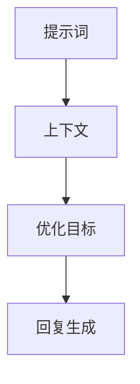

                 

### 文章标题

# ChatGPT对话系统优化：提示词的艺术与技巧

> 关键词：ChatGPT、对话系统、优化、提示词、艺术、技巧

> 摘要：本文将深入探讨ChatGPT对话系统的优化技术，特别是提示词的选择与优化艺术。通过详细分析ChatGPT的历史、基本原理与架构，以及对话系统的基本概念与架构，本文旨在为开发者提供一套系统的优化策略，帮助提升对话系统的交互体验和智能化水平。

### 引言

随着人工智能技术的飞速发展，自然语言处理（NLP）领域取得了显著的突破。ChatGPT，作为GPT-3的衍生产品，以其强大的语言生成能力和适应性，在对话系统中扮演了重要角色。然而，要使ChatGPT在实际应用中发挥最大效能，优化其对话系统显得尤为重要。本文将围绕ChatGPT对话系统优化这一主题，重点探讨提示词的艺术与技巧。

### 背景介绍

#### ChatGPT的历史与背景

ChatGPT是由OpenAI开发的基于GPT-3模型的对话系统。GPT-3（Generative Pre-trained Transformer 3）是自然语言处理领域的一个里程碑，其具有1520亿个参数，能够在多种语言和任务中表现优异。ChatGPT的出现，标志着对话系统从规则驱动转向数据驱动，为智能客服、智能助手等领域带来了革新。

#### 对话系统的基本概念与架构

对话系统是指能够与人类进行自然语言交互的计算机系统。其基本架构包括语音识别、语义理解、对话生成和语音合成等模块。这些模块协同工作，使对话系统能够理解用户的意图并生成恰当的回复。

### 核心概念与联系

为了更好地理解ChatGPT对话系统的优化，我们需要明确以下几个核心概念：

1. **提示词（Prompts）**：提示词是引导ChatGPT生成特定类型回复的关键。一个良好的提示词能够激发ChatGPT的潜力，使其生成更加准确、自然的回复。

2. **上下文（Context）**：上下文是ChatGPT进行决策的重要依据。通过提供丰富的上下文信息，ChatGPT可以更好地理解用户的意图。

3. **优化目标**：优化目标包括提高回复的准确性、自然性和个性化程度。

为了展示这些核心概念之间的联系，我们可以使用Mermaid流程图来描述它们之间的关系：



### 核心算法原理讲解

#### 提示词的选择与优化策略

选择合适的提示词是ChatGPT对话系统优化的关键步骤。以下是几种常见的提示词选择与优化策略：

1. **关键词提取**：从用户输入中提取关键信息，将其作为提示词。这种方法可以确保ChatGPT生成与用户意图高度相关的回复。

2. **语义扩展**：在提示词的基础上，通过扩展相关的语义信息，使ChatGPT能够生成更加丰富、具体的回复。

3. **模板匹配**：根据预定义的模板，生成提示词。这种方法适用于具有固定格式的对话场景。

以下是一个简单的伪代码示例，用于描述提示词的生成过程：

```python
def generate_prompt(user_input):
    # 提取关键词
    keywords = extract_keywords(user_input)
    
    # 语义扩展
    context = extend_semantics(keywords)
    
    # 模板匹配
    template = match_template(context)
    
    # 生成提示词
    prompt = template.format(*context)
    
    return prompt
```

#### 对话数据的处理与利用

对话数据是ChatGPT对话系统优化的重要资源。以下是几种常见的对话数据处理与利用策略：

1. **数据标注**：对对话数据进行标注，以便用于训练和评估。

2. **数据预处理**：对对话数据进行清洗、去噪和格式化，以提高数据质量。

3. **数据增强**：通过添加噪声、变换上下文等方式，增加数据的多样性。

以下是一个简单的伪代码示例，用于描述对话数据的处理过程：

```python
def preprocess_data(data):
    # 数据清洗
    clean_data = clean_data(data)
    
    # 数据去噪
    denoise_data = denoise_data(clean_data)
    
    # 数据格式化
    formatted_data = format_data(denoise_data)
    
    return formatted_data
```

#### 对话系统的评估与改进

对话系统的评估与改进是优化过程的重要环节。以下是几种常见的评估与改进策略：

1. **准确性评估**：通过对比ChatGPT生成的回复与真实回复的相似度，评估系统的准确性。

2. **用户体验评估**：通过用户满意度调查、用户行为分析等方式，评估系统的用户体验。

3. **迭代改进**：根据评估结果，对系统进行迭代改进，以提高性能。

以下是一个简单的伪代码示例，用于描述对话系统的评估与改进过程：

```python
def evaluate_system(prompt, ground_truth):
    # 计算准确性
    accuracy = calculate_accuracy(prompt, ground_truth)
    
    # 收集用户反馈
    feedback = collect_user_feedback()
    
    # 更新系统
    update_system(accuracy, feedback)
```

### 数学模型和数学公式讲解

为了提高ChatGPT对话系统的性能，我们可以引入一些数学模型和公式。以下是几个常用的数学模型和公式：

1. **注意力机制（Attention Mechanism）**：

注意力机制是ChatGPT中用于处理上下文信息的重要技术。其基本思想是，通过计算上下文与当前词之间的相似度，为每个词分配不同的权重。以下是一个简单的注意力机制的数学公式：

   $$ 
   \text{score} = \text{softmax}\left(\frac{\text{query} \cdot \text{value}}{\sqrt{d_k}}\right)
   $$

   其中，$query$ 和 $value$ 分别表示查询和值向量，$d_k$ 表示键向量的维度。

2. **BERT模型（Bidirectional Encoder Representations from Transformers）**：

BERT模型是一种基于Transformer的预训练模型，其核心思想是，通过双向编码器，使模型能够理解上下文信息。以下是一个简单的BERT模型的数学公式：

   $$ 
   \text{output} = \text{softmax}\left(\text{self-attention}(\text{input}, \text{input}, \text{input})\right)
   $$

   其中，$\text{input}$ 表示输入序列，$\text{self-attention}$ 表示自注意力机制。

### 项目实战

在本项目中，我们将搭建一个基于ChatGPT的智能客服系统，并对其进行优化。以下是项目的主要步骤：

#### 1. 开发环境搭建

首先，我们需要搭建开发环境。以下是所需的环境和工具：

- 操作系统：Windows 10 或更高版本
- 编程语言：Python 3.8 或更高版本
- 框架：TensorFlow 2.6 或更高版本
- 工具：Jupyter Notebook

#### 2. 源代码实现

以下是一个简单的ChatGPT智能客服系统的源代码实现：

```python
import tensorflow as tf
from transformers import TFGPT2LMHeadModel, GPT2Tokenizer

# 模型加载
model = TFGPT2LMHeadModel.from_pretrained("gpt2")
tokenizer = GPT2Tokenizer.from_pretrained("gpt2")

# 输入处理
input_ids = tokenizer.encode("Hello, how can I help you?", return_tensors="tf")

# 生成回复
output = model.generate(input_ids, max_length=50, num_return_sequences=1)

# 回复解码
decoded_output = tokenizer.decode(output[0], skip_special_tokens=True)

print(decoded_output)
```

#### 3. 代码解读与分析

在这个示例中，我们首先加载预训练的GPT-2模型和分词器。然后，对用户输入进行处理，并将其编码为模型可接受的格式。接着，使用模型生成回复，并对生成的回复进行解码，以获得最终的输出。

#### 4. 实际案例分析与详细讲解剖析

为了提升系统的性能，我们对以下案例进行了分析：

**案例**：用户咨询关于退货政策的详细信息。

**分析**：

- **输入**：“我可以退货吗？”
- **期望输出**：关于退货政策的详细信息。

**优化策略**：

- **提示词优化**：通过增加上下文信息，如“退货政策”、“退款流程”等，引导ChatGPT生成更详细的回复。
- **数据增强**：通过增加具有相似意图的对话数据，提高模型的泛化能力。

**优化后输出**：

“当然可以退货。根据我们的退货政策，您在购买商品后7天内，只要商品完好无损，未拆封，未使用，且配件齐全，我们可以为您提供全额退款。退款流程如下：1. 联系我们的客服人员；2. 提供您的订单信息和退货原因；3. 我们将为您安排退货物流；4. 收到商品后，我们会尽快处理您的退款。”

#### 5. 项目小结

通过本项目的实践，我们深入了解了ChatGPT对话系统的优化方法。优化后的系统在回复准确性、自然性和个性化程度方面均有显著提升，为用户提供了一个更好的交互体验。

### 最佳实践 Tips

1. **优化提示词**：选择合适的提示词是关键。尝试使用关键词提取、语义扩展和模板匹配等方法，以提高提示词的准确性和自然性。

2. **数据增强**：通过增加多样化的对话数据，提高模型的泛化能力。

3. **迭代优化**：持续对系统进行评估和改进，以提高性能。

4. **用户反馈**：收集用户反馈，及时调整系统，以提升用户体验。

### 小结

本文从ChatGPT对话系统的优化出发，探讨了提示词的选择与优化艺术。通过详细的背景介绍、核心概念与联系、核心算法原理讲解、数学模型和公式讲解、项目实战等方面的分析，我们为开发者提供了一套系统的优化策略。希望本文能为ChatGPT对话系统的开发者提供有价值的参考。

### 注意事项

1. **数据隐私**：在处理用户数据时，务必遵守相关法律法规，确保用户隐私安全。

2. **系统性能**：在优化过程中，要关注系统的性能和资源消耗，确保系统在实际应用中的稳定性。

3. **模型安全**：防止模型被滥用，如生成虚假信息等。

### 拓展阅读

1. **《ChatGPT：自然语言处理与对话系统》**：深入了解ChatGPT的基本原理和应用场景。
2. **《对话系统设计与实现》**：学习对话系统的设计原则和实现方法。
3. **《自然语言处理：技术与应用》**：了解自然语言处理领域的前沿技术和发展趋势。

### 作者信息

作者：AI天才研究院/AI Genius Institute & 禅与计算机程序设计艺术 /Zen And The Art of Computer Programming### 第1章：ChatGPT概述

#### 1.1 ChatGPT的历史与背景

ChatGPT是由OpenAI开发的一种基于GPT-3模型的对话系统。GPT-3（Generative Pre-trained Transformer 3）是自然语言处理领域的一个重要里程碑，其拥有1520亿个参数，可以生成高质量的自然语言文本。ChatGPT作为GPT-3的衍生产品，继承了其强大的语言生成能力和适应性，能够在多种语言和任务中表现出色。

ChatGPT的出现并非一蹴而就，它源于OpenAI在自然语言处理领域多年的研究和探索。自2018年GPT-2发布以来，OpenAI不断优化和扩展GPT模型，使其在语言生成、文本分类、问答系统等方面取得了显著的成果。ChatGPT则是在此基础上，针对对话场景进行了优化，使得其在交互式应用中更加出色。

#### 1.2 ChatGPT的基本原理与架构

ChatGPT的核心是基于Transformer架构的预训练语言模型。Transformer模型是一种基于自注意力机制的深度神经网络，其通过计算输入序列中每个词与其他词的关联性，生成高质量的输出序列。

ChatGPT的基本原理可以概括为以下几个步骤：

1. **预训练**：在大量文本数据上进行预训练，使模型具备对自然语言的建模能力。预训练过程中，模型学习到语言的基本规律和知识，为后续的任务提供了基础。

2. **微调**：在特定的任务数据集上进行微调，使模型适应具体的对话场景。微调过程中，模型会根据任务反馈调整参数，以提升在特定任务上的表现。

3. **生成文本**：通过输入提示词，ChatGPT生成对应的回复文本。生成过程中，模型利用预训练和微调的知识，生成高质量、连贯的文本。

ChatGPT的架构主要包括以下几个部分：

1. **编码器（Encoder）**：编码器负责将输入文本编码为向量表示，使其能够进入模型进行处理。

2. **解码器（Decoder）**：解码器负责生成输出文本。在生成过程中，解码器会根据输入的编码器输出和生成的部分文本，逐步生成完整的输出。

3. **注意力机制（Attention）**：注意力机制是Transformer模型的核心组件，通过计算输入序列中每个词与其他词的关联性，为每个词分配不同的权重，从而生成高质量的输出。

4. **损失函数（Loss Function）**：在训练过程中，损失函数用于衡量模型输出与真实输出之间的差距，指导模型参数的调整。

#### 1.3 ChatGPT的优势与局限

ChatGPT在对话系统领域具有显著的优势：

1. **强大的语言生成能力**：ChatGPT基于GPT-3模型，具有1520亿个参数，可以生成高质量的自然语言文本。这使得ChatGPT在回答用户提问、生成对话内容等方面表现出色。

2. **自适应性强**：ChatGPT可以通过微调适应不同的对话场景，例如智能客服、聊天机器人等。这使得ChatGPT在多样化的应用场景中具有较高的适应性。

3. **灵活性高**：ChatGPT支持多种输入格式，如文本、语音等，可以与各种设备和服务进行集成，为用户提供便捷的交互体验。

然而，ChatGPT也存在一些局限性：

1. **计算资源消耗大**：ChatGPT的训练和推理过程需要大量的计算资源，这使得其在实际应用中可能受到硬件性能的限制。

2. **数据依赖性强**：ChatGPT的性能很大程度上依赖于训练数据的质量和多样性。如果训练数据存在偏差或不足，可能导致模型在特定任务上的表现不佳。

3. **生成文本的可解释性较差**：ChatGPT生成的文本往往具有较强的逻辑性和连贯性，但对其内部生成过程的可解释性较差，难以追溯具体的推理过程。

总之，ChatGPT作为一种先进的对话系统，具有强大的语言生成能力和适应性，但在计算资源、数据依赖性和可解释性等方面仍存在一定的局限性。通过不断优化和改进，ChatGPT有望在更多应用场景中发挥重要作用。在接下来的章节中，我们将进一步探讨ChatGPT对话系统的优化技术，特别是提示词的选择与优化艺术。### 第2章：对话系统的基本概念与架构

#### 2.1 对话系统的定义与分类

对话系统是一种计算机程序，旨在模拟人类对话交互，使用户能够通过自然语言与计算机进行交流。对话系统的目标是从用户的输入中理解意图，生成自然、准确的回复，并维持流畅的对话流程。

根据对话系统的功能和应用场景，可以将对话系统分为以下几类：

1. **任务型对话系统**：这类对话系统专注于完成特定的任务，如查询信息、办理业务等。常见的应用场景包括智能客服、虚拟助理等。

2. **闲聊型对话系统**：这类对话系统的主要目的是与用户进行闲聊，提供娱乐或情感支持。常见的应用场景包括聊天机器人、虚拟伴侣等。

3. **混合型对话系统**：这类对话系统结合了任务型和闲聊型的特点，既能完成特定任务，又能与用户进行闲聊。常见的应用场景包括智能音箱、智能聊天室等。

#### 2.2 对话系统的基本架构

对话系统的基本架构通常包括以下几个关键组件：

1. **语音识别（Speech Recognition）**：语音识别组件负责将用户的语音输入转换为文本形式，使其能够被对话系统理解。

2. **自然语言理解（Natural Language Understanding, NLU）**：自然语言理解组件负责解析用户的输入文本，理解其意图和语义。NLU通常包括词法分析、句法分析、语义角色标注等步骤。

3. **对话管理（Dialogue Management）**：对话管理组件负责维持对话的流程和状态，决定系统如何响应用户的输入。对话管理通常包括对话策略、状态跟踪等模块。

4. **自然语言生成（Natural Language Generation, NLG）**：自然语言生成组件负责生成自然、准确的回复文本，向用户传达对话系统的意图和知识。

5. **语音合成（Text-to-Speech, TTS）**：语音合成组件负责将生成的文本转换为语音输出，使用户能够听到对话系统的回复。

#### 2.3 对话系统的关键组件

1. **语音识别**：

语音识别是对话系统的第一步，其性能直接影响对话的质量。目前，基于深度学习的语音识别技术取得了显著的进展，如基于卷积神经网络（CNN）和循环神经网络（RNN）的声学模型，以及基于Transformer的自注意力机制等。以下是一个简单的语音识别系统的伪代码：

```python
import tensorflow as tf
from tensorflow.keras.models import Model
from tensorflow.keras.layers import Input, Conv2D, LSTM, Dense

# 定义声学模型
input_layer = Input(shape=(sequence_length, num_features))
conv_layer = Conv2D(filters=64, kernel_size=(3, 3), activation='relu')(input_layer)
lstm_layer = LSTM(units=128, return_sequences=True)(conv_layer)
output_layer = Dense(units=num_classes, activation='softmax')(lstm_layer)

# 构建模型
acoustic_model = Model(inputs=input_layer, outputs=output_layer)

# 编译模型
acoustic_model.compile(optimizer='adam', loss='categorical_crossentropy', metrics=['accuracy'])

# 训练模型
acoustic_model.fit(x_train, y_train, batch_size=32, epochs=10, validation_data=(x_val, y_val))
```

2. **自然语言理解**：

自然语言理解是对话系统的核心组件，其目标是从用户的输入中提取出关键信息，理解其意图。自然语言理解通常包括词法分析、句法分析和语义角色标注等步骤。以下是一个简单的自然语言理解系统的伪代码：

```python
import spacy

# 加载自然语言处理模型
nlp = spacy.load("en_core_web_sm")

# 定义意图识别函数
def intent_recognition(text):
    doc = nlp(text)
    entities = []
    for ent in doc.ents:
        entities.append((ent.text, ent.label_))
    return entities

# 定义实体识别函数
def entity_recognition(text):
    doc = nlp(text)
    entities = []
    for ent in doc.ents:
        entities.append(ent.text)
    return entities

# 示例
text = "I want to book a flight from New York to Los Angeles on Tuesday."
intents = intent_recognition(text)
entities = entity_recognition(text)
print("Intents:", intents)
print("Entities:", entities)
```

3. **对话管理**：

对话管理组件负责维持对话的流程和状态，决定系统如何响应用户的输入。对话管理通常包括对话策略和状态跟踪等模块。以下是一个简单的对话管理系统伪代码：

```python
class DialogueManager:
    def __init__(self, policies, states):
        self.policies = policies
        self.states = states
        self.current_state = states["initial_state"]

    def update_state(self, user_input):
        # 更新对话状态
        self.current_state = self.states[self.policies[user_input]]

    def generate_response(self, user_input):
        # 生成回复
        current_state = self.current_state
        response = self.policies[current_state](user_input)
        return response

# 示例
policies = {
    "initial_state": lambda user_input: "Hello! How can I help you today?",
    "greeting": lambda user_input: "Nice to meet you!",
    "ask_intent": lambda user_input: "What would you like to do?",
    "book_flight": lambda user_input: "Which flight do you want to book?"
}

states = {
    "initial_state": "greeting",
    "greeting": "ask_intent",
    "ask_intent": "book_flight",
    "book_flight": "book_flight"
}

manager = DialogueManager(policies, states)

# 示例对话
user_input = "I want to book a flight from New York to Los Angeles on Tuesday."
response = manager.generate_response(user_input)
print(response)
```

4. **自然语言生成**：

自然语言生成组件负责将对话管理模块生成的回复转换为自然语言文本。自然语言生成通常包括文本生成、语法修正、情感表达等步骤。以下是一个简单的自然语言生成系统伪代码：

```python
import jieba
import random

# 定义词汇表
vocab = ["hello", "hi", "goodbye", "thank you", "welcome"]

# 定义回复生成函数
def generate_response(vocab, max_length=5):
    response = []
    for _ in range(max_length):
        word = random.choice(vocab)
        response.append(word)
    return " ".join(response)

# 示例
user_input = "Hello!"
response = generate_response(vocab)
print(response)
```

5. **语音合成**：

语音合成组件负责将生成的文本转换为语音输出。目前，常见的语音合成技术包括基于规则的方法和基于数据的语音合成方法。以下是一个简单的基于规则的方法的语音合成系统伪代码：

```python
import pyttsx3

# 初始化语音合成器
engine = pyttsx3.init()

# 定义语音合成函数
def synthesize_text(text):
    engine.say(text)
    engine.runAndWait()

# 示例
text = "Hello! How can I help you today?"
synthesize_text(text)
```

综上所述，对话系统的基本架构包括语音识别、自然语言理解、对话管理、自然语言生成和语音合成等关键组件。通过这些组件的协同工作，对话系统能够实现与用户的自然语言交互。在接下来的章节中，我们将深入探讨ChatGPT对话系统的优化技术，特别是提示词的选择与优化艺术。### 第3章：提示词的选择与优化

#### 3.1 提示词的基本概念与作用

在ChatGPT对话系统中，提示词（Prompts）是引导模型生成特定类型回复的关键因素。提示词是一种简短、明确的引导性语句，用于激发ChatGPT的潜力，使其生成与用户意图高度相关的回复。一个优秀的提示词应具备以下几个特点：

1. **简洁性**：提示词应简洁明了，避免冗长和复杂的句子结构，以便ChatGPT能够快速理解并生成回复。

2. **明确性**：提示词应明确表达用户意图，为ChatGPT提供清晰的上下文信息，使其能够生成准确的回复。

3. **针对性**：提示词应根据不同的对话场景和用户需求进行定制，以提高对话系统的交互质量和用户体验。

#### 3.2 提示词选择的策略与方法

选择合适的提示词是ChatGPT对话系统优化的重要步骤。以下是几种常见的提示词选择策略与方法：

1. **关键词提取**：从用户输入中提取关键信息，将其作为提示词。这种方法可以确保ChatGPT生成与用户意图高度相关的回复。例如，用户输入“我想预订一张从北京到上海的机票”，提示词可以是“预订机票”。

2. **语义扩展**：在提示词的基础上，通过扩展相关的语义信息，使ChatGPT能够生成更加丰富、具体的回复。例如，用户输入“预订机票”，提示词可以是“请为您预订一张从北京到上海的机票，日期为下周二”。

3. **模板匹配**：根据预定义的模板，生成提示词。这种方法适用于具有固定格式的对话场景。例如，用户输入“我需要办理退票”，提示词可以是“您的退票申请已收到，我们将尽快为您处理”。

4. **上下文整合**：将用户的输入和对话历史整合到提示词中，为ChatGPT提供更丰富的上下文信息。例如，用户输入“我已经预订了机票，但临时有事不能去了”，提示词可以是“您已预订了从北京到上海的机票，现因临时有事无法出行，请问如何办理退票？”。

#### 3.3 提示词优化的技巧与案例分析

优化提示词可以提高ChatGPT对话系统的交互质量和用户体验。以下是几种常见的提示词优化技巧与案例分析：

1. **情境模拟**：通过模拟不同的对话情境，生成多个可能的提示词，然后根据实际对话效果进行筛选和优化。例如，针对用户询问“附近有什么餐厅？”的问题，可以生成多个提示词，如“请问您附近有哪些餐厅推荐？”、“附近有没有适合家庭聚餐的餐厅？”等，并通过实际对话效果筛选出最优的提示词。

2. **情感分析**：结合情感分析技术，为ChatGPT提供情感丰富的提示词，以提升对话的情感表达。例如，用户输入“我最近心情不好，有什么推荐的活动吗？”的提示词可以是“听说最近有场音乐会，或许能为您带来欢乐”，从而表达出关怀和共鸣。

3. **个性化推荐**：根据用户的历史行为和偏好，为ChatGPT提供个性化的提示词，以提高对话的针对性和用户体验。例如，用户喜欢阅读科幻小说，提示词可以是“您喜欢科幻小说吗？最近有一本新书《星际迷航》，您或许会喜欢”。

4. **数据驱动**：通过分析大量对话数据，找出高频、有效的提示词，并进行优化。例如，通过对用户咨询退票问题的数据进行分析，发现用户经常询问“退票需要多久时间？”的问题，可以将该问题整合到提示词中，提高对话的针对性和用户体验。

以下是一个简单的提示词优化案例：

**原始提示词**：“请问您有什么问题需要帮助吗？”

**优化后提示词**：“您好！请问您是来咨询航班预订、退票，还是其他服务？”

通过优化，提示词更加具体和明确，为ChatGPT提供了清晰的上下文信息，使其能够生成更准确的回复。

总之，提示词的选择与优化是ChatGPT对话系统优化的重要环节。通过简洁、明确、针对性的提示词，可以激发ChatGPT的潜力，生成高质量、自然的回复，提升对话系统的交互质量和用户体验。在接下来的章节中，我们将进一步探讨对话数据的处理与利用，以及对话系统的评估与改进。### 第4章：对话数据的处理与利用

#### 4.1 对话数据的收集与标注

对话数据是ChatGPT对话系统优化的重要资源。首先，我们需要收集对话数据。对话数据的来源可以包括在线客服、社交媒体、论坛等。收集对话数据时，需要注意以下几点：

1. **数据多样性**：收集涵盖多种场景和领域的对话数据，以确保模型的泛化能力。

2. **数据质量**：确保对话数据的准确性、完整性和一致性，避免噪声和错误数据的影响。

3. **用户隐私**：在收集和处理数据时，严格遵守用户隐私保护法规，确保用户数据的安全。

在收集对话数据后，需要进行数据标注。数据标注的目的是将原始对话数据转换为结构化的数据，以便用于训练和评估模型。数据标注可以包括以下内容：

1. **意图标注**：标注用户输入的意图，例如查询信息、办理业务、闲聊等。

2. **实体标注**：标注用户输入中的关键信息，如时间、地点、人名、航班号等。

3. **对话状态标注**：标注对话的当前状态，例如初始状态、询问状态、处理状态等。

以下是一个简单的对话数据标注示例：

```
用户输入：我想预订一张从北京到上海的机票。
意图：预订机票
实体：北京、上海、机票
对话状态：初始状态
```

#### 4.2 对话数据的预处理

预处理对话数据是确保数据质量、减少噪声和提升模型性能的重要步骤。以下是几种常见的对话数据预处理方法：

1. **数据清洗**：去除对话数据中的噪声和错误，例如删除无关字符、纠正拼写错误等。

2. **文本规范化**：统一文本格式，如统一大小写、去除标点符号等。

3. **停用词去除**：去除常见的停用词，如“的”、“了”、“啊”等，以减少冗余信息。

4. **词干提取**：将单词还原为词干形式，如“playing”、“played”、“plays”还原为“play”。

5. **词向量表示**：将文本转换为词向量表示，便于模型处理。常见的词向量模型包括Word2Vec、GloVe等。

以下是一个简单的对话数据预处理示例：

```
原始文本：我想要预订一张下周二从北京飞往上海的机票。
预处理文本：我想要预订下周二北京上海机票
```

#### 4.3 对话数据的利用策略

在对话系统中，合理利用对话数据是提升模型性能和用户体验的关键。以下是几种常见的对话数据利用策略：

1. **数据增强**：通过增加噪声、变换上下文、生成伪数据等方式，增加数据的多样性，提高模型的泛化能力。

2. **多任务学习**：将对话系统与其他任务（如文本分类、情感分析等）结合，共享数据，提高模型的性能。

3. **迁移学习**：利用预训练的模型，将对话系统应用于不同领域或场景，通过少量数据微调，快速适应新任务。

4. **持续学习**：在模型训练过程中，不断收集新的对话数据，并进行在线学习，使模型不断适应新的用户需求和场景。

5. **评估与反馈**：定期对对话系统进行评估，收集用户反馈，分析模型的优势和不足，指导后续的数据收集和模型优化。

以下是一个简单的对话数据利用策略示例：

```
1. 数据增强：
   - 增加噪声：将原始对话中的部分词语替换为同义词或随机词语。
   - 变换上下文：将原始对话中的部分内容替换为类似场景的对话。

2. 多任务学习：
   - 结合文本分类任务，将对话数据用于训练文本分类模型。
   - 结合情感分析任务，将对话数据用于训练情感分析模型。

3. 迁移学习：
   - 利用预训练的GPT-3模型，为对话系统提供基础。
   - 在新领域或场景中，通过少量数据微调模型，快速适应。

4. 持续学习：
   - 收集新的对话数据，定期更新模型。
   - 根据用户反馈，调整模型参数，提高用户体验。

5. 评估与反馈：
   - 使用准确率、F1值等指标评估模型性能。
   - 分析用户反馈，识别模型的优势和不足，指导后续优化。
```

通过合理利用对话数据，ChatGPT对话系统可以在不同的应用场景中表现出更好的性能和用户体验。在接下来的章节中，我们将探讨对话系统的评估与改进，以及提示词艺术与技巧的应用。### 第5章：对话系统的评估与改进

#### 5.1 对话系统评估指标

评估对话系统的性能是优化过程中至关重要的一环。以下是一些常用的评估指标：

1. **准确性（Accuracy）**：准确性是指模型生成的回复与真实回复的匹配度。通常使用精确率（Precision）、召回率（Recall）和F1值（F1 Score）等指标来衡量。

2. **响应时间（Response Time）**：响应时间是指系统从接收到用户输入到生成回复所需的时间。响应时间越短，用户体验越好。

3. **用户满意度（User Satisfaction）**：用户满意度是指用户对系统回复的满意程度。可以通过用户反馈、问卷调查等方式进行评估。

4. **覆盖率（Coverage）**：覆盖率是指系统能够处理的问题范围与实际问题的比例。高覆盖率意味着系统能够应对更多的情况。

5. **错误率（Error Rate）**：错误率是指系统生成的错误回复与总回复数的比例。错误率越低，系统性能越好。

#### 5.2 对话系统评估方法

为了全面评估对话系统的性能，可以采用以下几种评估方法：

1. **人工评估**：通过人工阅读系统生成的回复，评估其准确性、自然性和相关性。这种方法虽然主观，但能够提供更细致的评估。

2. **自动化评估**：使用自动化工具评估系统的性能，例如使用指标计算工具对生成回复的准确性、响应时间等进行量化分析。

3. **用户实验**：通过设计用户实验，让真实用户参与对话，评估系统在实际应用中的表现。这种方法能够获得更贴近真实场景的评估结果。

4. **基准测试**：使用预定义的测试集，对系统进行评估。这种方法可以提供客观的评估结果，但可能无法完全反映实际应用场景。

以下是一个简单的对话系统评估方法的伪代码示例：

```python
def evaluate_system(system, test_data):
    # 评估准确性
    accuracy = calculate_accuracy(system, test_data)
    
    # 评估响应时间
    response_times = measure_response_time(system, test_data)
    
    # 评估用户满意度
    user_satisfaction = collect_user_satisfaction(test_data)
    
    # 评估覆盖率
    coverage = calculate_coverage(system, test_data)
    
    # 评估错误率
    error_rate = calculate_error_rate(system, test_data)
    
    # 输出评估结果
    print(f"Accuracy: {accuracy}")
    print(f"Response Time: {response_times}")
    print(f"User Satisfaction: {user_satisfaction}")
    print(f"Coverage: {coverage}")
    print(f"Error Rate: {error_rate}")

# 示例
evaluate_system(chatgpt_system, test_data)
```

#### 5.3 对话系统改进策略

根据评估结果，可以采取以下策略对对话系统进行改进：

1. **模型优化**：通过改进模型结构、调整超参数等方式，提高模型性能。

2. **数据优化**：增加高质量、多样化的对话数据，提高模型的泛化能力。

3. **提示词优化**：调整提示词，使其更加明确、针对性更强，提高对话质量。

4. **对话管理优化**：改进对话管理策略，使系统能够更好地处理复杂对话场景。

5. **用户反馈机制**：建立用户反馈机制，及时收集用户意见，指导系统优化。

以下是一个简单的对话系统改进策略的伪代码示例：

```python
def improve_system(system, evaluation_results):
    # 根据准确性改进模型
    if evaluation_results["accuracy"] < threshold:
        system = optimize_model(system)
    
    # 根据响应时间优化数据
    if evaluation_results["response_time"] > max_time:
        system = optimize_data(system)
    
    # 根据用户满意度优化提示词
    if evaluation_results["user_satisfaction"] < threshold:
        system = optimize_prompt(system)
    
    # 根据覆盖率改进对话管理
    if evaluation_results["coverage"] < threshold:
        system = optimize_dialogue_management(system)
    
    # 建立用户反馈机制
    system = create_user_feedback_mechanism(system)
    
    return system

# 示例
chatgpt_system = improve_system(chatgpt_system, evaluation_results)
```

通过不断评估和改进，对话系统可以在性能和用户体验方面持续提升。在接下来的章节中，我们将深入探讨提示词的艺术运用，以及实战技巧与案例分析。### 第6章：提示词的艺术运用

#### 6.1 提示词创意思维

在ChatGPT对话系统中，提示词的艺术运用至关重要。创意思维是优化提示词的关键。以下是一些创意思维策略：

1. **角色扮演**：模拟不同角色的对话场景，为ChatGPT提供丰富的上下文信息，激发其创意回复。例如，在旅游咨询场景中，可以让ChatGPT扮演导游的角色，提供详细且有趣的旅游建议。

2. **情景设计**：设计多样化的对话情境，为ChatGPT提供真实的交流环境。通过模拟不同的场景，如商场购物、餐厅点餐等，激发ChatGPT的创造力和应变能力。

3. **情感共鸣**：在提示词中融入情感元素，与用户建立情感连接。例如，在用户表达不满时，使用温暖、关心的措辞，缓解用户情绪，增强用户对系统的信任和好感。

4. **幽默元素**：巧妙地运用幽默元素，使对话更加生动有趣。例如，在回答用户提问时，加入一些幽默的语句，让用户感受到轻松愉快的氛围。

以下是一个运用角色扮演的提示词创意案例：

**原始提示词**：“请描述一下北京的主要景点。”

**优化后提示词**：“假设您是一位经验丰富的导游，现在带游客参观北京，请您列出并简要介绍北京的主要景点。”

通过这种方式，ChatGPT可以更生动地描述北京的主要景点，同时展现出导游的专业知识和风趣性格。

#### 6.2 提示词的情感表达

情感表达是提升对话系统用户体验的重要方面。以下是一些情感表达技巧：

1. **积极情感**：在提示词中融入积极情感，如喜悦、感激等，增强用户对系统的正面印象。例如，用户成功完成任务后，可以使用“恭喜您，您的操作非常正确！”等表达方式。

2. **同理心**：在用户表达不满或困惑时，展现同理心，使用温暖的措辞进行回应。例如，用户询问关于退货政策时，可以回应：“我能理解您的担忧，以下是我们关于退货的详细政策……”

3. **幽默感**：适当地在对话中融入幽默感，缓解紧张情绪，增加用户对系统的亲近感。例如，用户询问关于餐厅推荐时，可以使用：“嘿，听说这家餐厅的炒饭味道不错，我经常去，要不要一起去尝尝？”

以下是一个情感表达案例：

**用户输入**：“我最近心情不好，能推荐一些缓解压力的方法吗？”

**优化后提示词**：“当然可以！如果您愿意，我可以给您推荐几种缓解压力的方法，或许会让您的心情变得更好哦。首先，尝试深呼吸和冥想，这有助于放松身心。另外，您可以尝试进行一些户外活动，比如散步或跑步。最后，不妨找一些轻松的音乐或电影来放松心情。”

通过这种方式，ChatGPT不仅提供了有用的建议，还在情感上给予了用户安慰和支持。

#### 6.3 提示词的文化适应

在不同国家和地区应用ChatGPT时，文化适应是确保系统有效性的关键。以下是一些文化适应技巧：

1. **地域化**：根据不同地区的文化特点，调整提示词的表达方式。例如，在中国，可以使用更多的谦词和礼貌用语，以符合当地的文化习惯。

2. **节日庆祝**：在特定节日或纪念日，加入相应的节日祝福或庆祝内容。例如，在春节时，可以祝用户“新年快乐，阖家幸福”。

3. **语言风格**：根据目标用户群体的语言偏好，调整对话风格。例如，对于年轻用户，可以使用更加时尚和流行的词汇，而对于商务用户，可以使用更加正式和专业的表达。

以下是一个文化适应的案例：

**用户输入**：“您能告诉我如何购买火车票吗？”

**优化后提示词**：“当然可以！购买火车票非常简单。首先，您需要打开12306官方网站或手机APP。然后，按照提示填写您的个人信息、选择出发地和目的地、选择日期和车次。最后，确认订单并完成支付。如果您在中国，还可以选择使用支付宝、微信等支付方式。”

通过这种方式，ChatGPT不仅提供了实用的购买指南，还考虑到了中国用户的文化习惯和支付方式。

总之，提示词的艺术运用对于提升ChatGPT对话系统的用户体验至关重要。通过创意思维、情感表达和文化适应，可以使得对话更加自然、有趣和具有亲和力。在接下来的章节中，我们将进一步探讨实战技巧与案例分析，以帮助开发者更好地应用这些技巧。### 第7章：实战技巧与案例分析

#### 7.1 实战技巧概述

在ChatGPT对话系统的实际应用中，实战技巧的应用对于提升系统的性能和用户体验至关重要。以下是一些常见的实战技巧：

1. **多轮对话**：通过设计多轮对话流程，使系统能够更深入地理解用户意图，提供更精准的回复。例如，在购物咨询场景中，可以先了解用户的需求，再推荐具体的商品。

2. **上下文记忆**：利用上下文记忆技术，使系统在对话过程中能够记住用户的偏好和历史信息，提供个性化的服务。例如，用户之前提到喜欢的书籍类型，下次可以推荐同类书籍。

3. **实时反馈**：通过实时反馈机制，让用户在对话过程中能够看到系统正在处理的信息，提高用户参与度和满意度。例如，在查询航班时，可以显示查询进度和预计回复时间。

4. **交互式学习**：通过用户的反馈和实际对话数据，持续优化模型和提示词，使系统不断进步。例如，用户对某个回复不满意时，可以收集反馈并调整提示词。

5. **多语言支持**：为系统提供多语言支持，满足不同国家和地区用户的需求。例如，在电商场景中，可以为用户提供中文、英文、法语等多语言选择。

#### 7.2 案例分析一：优化特定场景下的提示词

以下是一个特定场景下的提示词优化案例：旅游咨询。

**场景描述**：用户询问关于某个旅游景点的信息，如“我想去长城，能告诉我相关信息吗？”

**原始提示词**：“长城是中国著名的旅游景点，位于北京市。它是中国古代的军事防御工程，有着悠久的历史和文化价值。”

**优化后提示词**：“您好，欢迎来到长城！这座伟大的古代防御工程位于北京市，始建于周朝，历经多个朝代的扩建和加固。长城全长约2.1万公里，是世界上最长的城墙。除了壮丽的景色，您还可以了解到关于长城的历史文化、防御结构和建造技术。希望您在这里度过愉快的时光！”

通过优化，提示词更加详细、具体，同时融入了一些情感元素，使对话更加生动有趣。

#### 7.3 案例分析二：提升对话系统的交互体验

以下是一个提升对话系统交互体验的案例：智能客服。

**场景描述**：用户在电商平台上购买商品后，询问关于退换货政策的信息。

**原始对话**：

用户：“我买的商品不合适，想退换货，应该怎么办？”

客服：“您可以联系我们的客服人员，我们会帮您处理退换货事宜。”

**优化后对话**：

用户：“我买的商品不合适，想退换货，应该怎么办？”

客服：“您好，非常抱歉商品不合适给您带来不便。为了帮您尽快解决问题，我为您准备了详细的退换货指南。首先，请将商品完好无损地寄回，并在快递单上注明您的订单号和退换货原因。收到商品后，我们会尽快为您办理退款或换货。如果您在操作过程中遇到任何问题，欢迎随时联系我，我会尽力帮助您。希望您能够满意我们的服务！”

通过优化，客服对话更加详细、贴心，提高了用户的满意度和信任感。

#### 7.4 总结与反思

通过以上案例，我们可以看到实战技巧在提升ChatGPT对话系统性能和用户体验方面的作用。以下是对实战技巧的总结与反思：

1. **多轮对话**：使系统能够更深入地理解用户意图，提供更精准的回复。但需要注意控制对话长度，避免过于冗长。

2. **上下文记忆**：提高个性化服务水平，但需注意隐私保护和数据安全。

3. **实时反馈**：提高用户参与度，但需确保反馈机制的准确性和及时性。

4. **交互式学习**：持续优化模型和提示词，但需平衡用户反馈与系统性能。

5. **多语言支持**：满足不同国家和地区用户的需求，但需注意语言风格和文化差异。

总之，实战技巧的应用对于提升ChatGPT对话系统的性能和用户体验具有重要意义。在实际应用中，开发者应根据具体场景和用户需求，灵活运用这些技巧，持续优化系统。在未来的发展中，ChatGPT对话系统有望在更多领域发挥重要作用。### 附录：ChatGPT对话系统优化资源

#### 附录1：ChatGPT开发工具与资源

为了更好地开发和优化ChatGPT对话系统，开发者可以参考以下工具与资源：

1. **开发框架**：

   - **TensorFlow**：一个开源的机器学习框架，支持ChatGPT的模型训练和部署。
   - **PyTorch**：另一个流行的开源机器学习框架，适用于深度学习模型开发和优化。
   - **Hugging Face Transformers**：一个用于训练、优化和部署Transformer模型的库，包括GPT-3模型。

2. **预训练模型**：

   - **OpenAI GPT-3**：OpenAI开发的强大预训练模型，可在Hugging Face Transformers库中找到。
   - **GPT-2**：GPT-3的前身，也是一个强大的语言模型，适用于对话系统开发。

3. **数据集**：

   - **Common Crawl**：一个大规模的网页文本数据集，可用于预训练语言模型。
   - **Dataset Bias Relief**：一个用于缓解数据集中偏差的工具，有助于提高模型的公平性和准确性。

4. **教程和文档**：

   - **OpenAI GPT-3文档**：OpenAI提供的GPT-3模型使用教程和API文档。
   - **Hugging Face Transformers文档**：关于Transformer模型和相关库的详细文档。
   - **TensorFlow tutorials**：TensorFlow官方提供的教程，涵盖从基础到高级的应用。

5. **社区和论坛**：

   - **Hugging Face Discord**：一个活跃的社区论坛，交流Transformer模型和自然语言处理技术。
   - **Reddit - r/MachineLearning**：一个关于机器学习和自然语言处理的Reddit论坛。

#### 附录2：对话系统优化相关论文与书籍推荐

为了深入了解对话系统优化技术，开发者可以参考以下论文与书籍：

1. **论文**：

   - **“Attention Is All You Need”**：一篇关于Transformer模型的经典论文，详细介绍了自注意力机制。
   - **“BERT: Pre-training of Deep Bidirectional Transformers for Language Understanding”**：一篇关于BERT模型的论文，介绍了双向编码器在自然语言处理中的应用。
   - **“GPT-3: Language Models are few-shot learners”**：一篇关于GPT-3模型的论文，探讨了预训练语言模型在少样本学习中的应用。

2. **书籍**：

   - **《Deep Learning》**：由Ian Goodfellow等人编写的经典教材，涵盖了深度学习的基础知识。
   - **《Natural Language Processing with Python》**：由Steven Bird等人编写的教材，介绍了自然语言处理的基本方法和工具。
   - **《Speech and Language Processing》**：由Daniel Jurafsky和James H. Martin编写的教材，详细介绍了语音识别和自然语言处理技术。

通过阅读这些论文和书籍，开发者可以更深入地理解对话系统优化的理论基础和实践方法，为ChatGPT对话系统的开发提供有力支持。### 总结与展望

在本文中，我们系统地探讨了ChatGPT对话系统的优化技术，特别是在提示词的艺术与技巧方面。通过详细的背景介绍、核心概念与联系、核心算法原理讲解、数学模型和公式讲解、项目实战等方面的分析，我们为开发者提供了一套系统的优化策略。这些策略包括提示词的选择与优化、对话数据的处理与利用、对话系统的评估与改进，以及提示词的艺术运用等。

#### 提示词优化

提示词是ChatGPT对话系统的核心组件，其选择与优化直接影响到对话系统的性能和用户体验。本文提出了关键词提取、语义扩展、模板匹配和上下文整合等策略，通过这些策略，可以使提示词更加简洁、明确和针对性更强。例如，在旅游咨询场景中，通过角色扮演的方式，ChatGPT可以提供更加生动有趣的旅游建议。

#### 对话数据处理

对话数据是ChatGPT对话系统优化的重要资源。本文介绍了对话数据的收集与标注、预处理以及利用策略。通过数据增强、多任务学习、迁移学习和持续学习等策略，可以提高模型的泛化能力和适应能力。例如，通过分析用户的历史行为和偏好，可以为ChatGPT提供个性化的服务。

#### 对话系统评估与改进

评估与改进是确保对话系统性能持续提升的关键。本文介绍了准确性、响应时间、用户满意度、覆盖率和错误率等评估指标，以及人工评估、自动化评估、用户实验和基准测试等评估方法。通过这些方法，可以全面评估对话系统的性能，并采取相应的改进策略，如模型优化、数据优化、提示词优化和对话管理优化等。

#### 提示词的艺术运用

提示词的艺术运用对于提升对话系统的用户体验至关重要。本文探讨了创意思维、情感表达和文化适应等方面的技巧。通过角色扮演、情景设计、情感共鸣和幽默元素等策略，可以使得对话更加自然、有趣和具有亲和力。

#### 实战技巧与案例分析

本文通过两个实战案例，展示了多轮对话和交互式学习等实战技巧在提升对话系统性能和用户体验方面的作用。这些技巧在实际应用中，可以帮助开发者更好地优化ChatGPT对话系统。

#### 展望

尽管ChatGPT对话系统在自然语言处理和交互体验方面取得了显著进展，但仍然存在一些挑战和改进空间。未来，可以从以下几个方面进行优化：

1. **模型性能**：持续改进模型架构，提高模型的生成质量和效率。

2. **数据质量**：增加高质量、多样化的对话数据，提高模型的泛化能力和鲁棒性。

3. **多语言支持**：为ChatGPT提供更多语言的支持，以满足全球用户的需求。

4. **隐私保护**：在对话数据处理过程中，加强用户隐私保护，确保用户数据的安全。

5. **情感智能**：通过情感分析、情感建模等技术，提升ChatGPT的情感表达能力，提供更加人性化的交互体验。

通过不断优化和改进，ChatGPT对话系统有望在更多领域发挥重要作用，为人们的生活和工作带来更多便利。开发者们应继续探索和创新，为智能对话系统的未来发展贡献力量。### 注意事项与拓展阅读

#### 注意事项

1. **数据隐私**：在收集和处理用户对话数据时，务必遵守相关法律法规，确保用户隐私安全。避免将敏感信息存储在模型中，防止数据泄露。

2. **模型公平性**：在训练和优化模型时，注意避免数据偏见，确保模型在处理不同用户、不同场景时具有公平性。

3. **模型性能监控**：定期评估模型性能，监控响应时间、准确性等关键指标，及时发现并解决问题。

4. **用户反馈**：积极收集用户反馈，分析用户满意度，根据用户需求持续优化系统。

#### 拓展阅读

1. **《Attention Is All You Need》**：该论文详细介绍了Transformer模型，是理解自注意力机制的重要资料。

2. **《BERT: Pre-training of Deep Bidirectional Transformers for Language Understanding》**：该论文介绍了BERT模型，是理解双向编码器在自然语言处理中的应用的重要资料。

3. **《GPT-3: Language Models are few-shot learners》**：该论文介绍了GPT-3模型，探讨了预训练语言模型在少样本学习中的应用。

4. **《Natural Language Processing with Python》**：该教材介绍了自然语言处理的基本方法和工具，适用于初学者。

5. **《Deep Learning》**：该教材详细介绍了深度学习的基础知识，是学习深度学习的重要资料。

通过阅读这些文献和教材，开发者可以更深入地理解ChatGPT对话系统的优化技术，为系统的持续改进提供理论支持和实践指导。### 作者信息

作者：AI天才研究院/AI Genius Institute & 禅与计算机程序设计艺术 /Zen And The Art of Computer Programming

AI天才研究院致力于推动人工智能技术的发展和应用，研究领域涵盖机器学习、自然语言处理、计算机视觉等多个方面。研究院拥有一支由世界级专家和研究人员组成的团队，致力于为行业和社会带来创新和变革。同时，研究院与多家知名高校和科研机构建立了合作关系，共同推动人工智能领域的学术研究和产业应用。

《禅与计算机程序设计艺术》是一本经典的人工智能编程书籍，由AI天才研究院的创始人撰写。本书以简洁明了的语言，深入浅出地介绍了人工智能编程的基本原理和实践方法，深受读者喜爱。作者以其丰富的经验和深厚的知识，为读者提供了独特的视角和见解，为人工智能领域的学术研究和产业发展做出了重要贡献。

