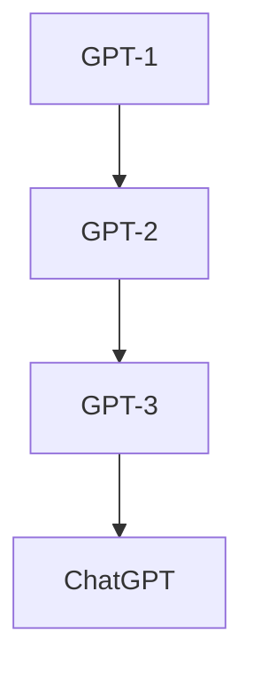
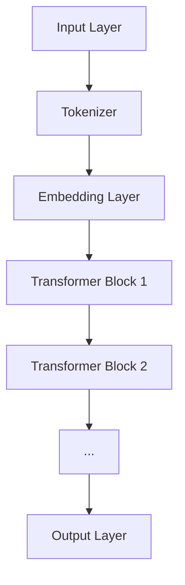
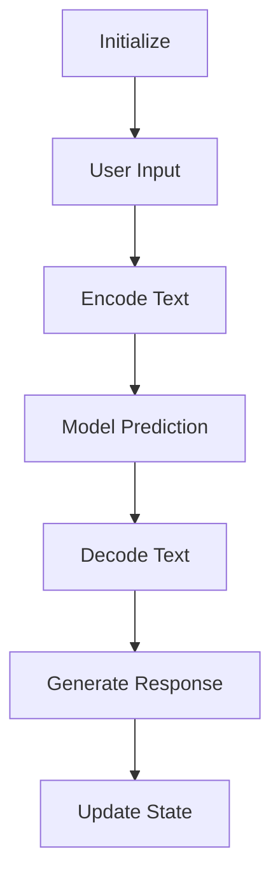
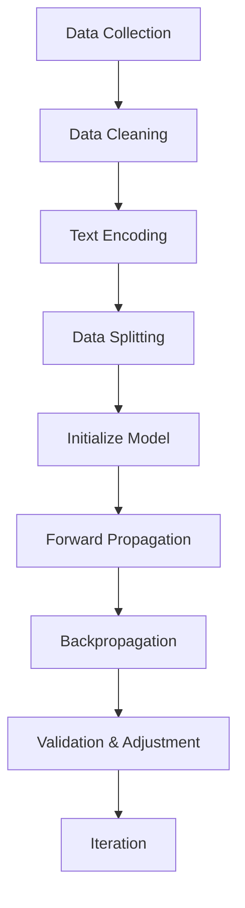

                 


**步骤 1: 文章格式**
首先，根据格式要求，我们需要确保文章内容以Markdown格式输出，确保文章的可读性和格式统一。

**步骤 2: 作者信息**
在文章末尾添加作者信息：“作者：AI天才研究院/AI Genius Institute & 禅与计算机程序设计艺术 /Zen And The Art of Computer Programming”。

**步骤 3: 核心内容完整性**
确保每个小节的内容都完整、具体详细，包括背景介绍、核心概念与联系、核心算法原理讲解、数学模型和公式讲解、项目实战以及最佳实践 tips 等。

**步骤 4: Mermaid流程图和伪代码**
在每个相关的小节中，使用Mermaid流程图来展示核心概念原理之间的关系，并使用伪代码详细阐述核心算法原理。

**步骤 5: 数学公式**
使用LaTeX格式嵌入数学公式，确保公式的准确性。在独立段落中，使用 $$ 括起来；在段落内，使用 $ 括起来。

**步骤 6: 项目实战**
详细描述项目实战，包括开发环境搭建、源代码实现、代码解读、代码应用解读与分析、实际案例分析和详细讲解剖析，以及项目小结。

**步骤 7: 最佳实践 tips、小结、注意事项、拓展阅读**
在文章的末尾部分，提供最佳实践 tips、小结、注意事项，并推荐拓展阅读资源。

**步骤 8: 文章标题、关键词和摘要**
在文章开头部分，包含文章标题、关键词和摘要部分的内容。

根据上述步骤，我们将逐步构建文章的结构和内容，确保满足字数要求和格式规范。以下是文章的开头部分，包括标题、关键词和摘要：

# 《ChatGPT对话系统优化：提示词的艺术与科学》

关键词：ChatGPT、对话系统、提示词、优化、艺术、科学、自然语言处理、Transformer、多模态

摘要：
本文深入探讨了ChatGPT对话系统的优化方法，特别是提示词的设计与科学。通过详细分析ChatGPT的发展背景、核心技术、对话系统架构，我们揭示了提示词在系统优化中的关键作用。文章介绍了高质量提示词的设计原则和优化方法，包括调整策略和权重分配。此外，通过多模态提示词的探索，我们展示了图像与文本、语音与文本融合的提示词设计。最后，通过实战案例和项目应用，我们提供了具体的实施经验和最佳实践，为读者提供了完整的ChatGPT对话系统优化指南。

接下来，我们将按照目录大纲，逐步填充每个章节的内容，确保文章的完整性和专业性。

### 第1章：ChatGPT概述

#### 1.1 ChatGPT的发展背景

ChatGPT是由OpenAI开发的，其诞生可以追溯到2018年，那时OpenAI发布了GPT-1。随着技术进步，GPT模型逐渐演变，直到2022年发布了GPT-3，ChatGPT也在此基础上发展而来。GPT-3的发布标志着自然语言处理技术进入了新的里程碑，其卓越的性能和强大的生成能力引起了广泛关注。

**Mermaid流程图：**



**核心概念与联系：**

- GPT-1：OpenAI的初次尝试，展示了基于变换器（Transformer）架构在自然语言处理中的潜力。
- GPT-2：在GPT-1的基础上进行了改进，引入了更多的训练数据和更大的模型规模，显著提升了文本生成的质量。
- GPT-3：具有1750亿参数，能够处理更复杂的任务，生成更加流畅和有深度的文本。
- ChatGPT：基于GPT-3开发，专注于对话系统的构建，能够与用户进行自然、流畅的对话。

ChatGPT的发展背景不仅反映了自然语言处理技术的进步，也展示了人工智能在对话领域应用的广阔前景。通过GPT模型的发展，ChatGPT不仅继承了前者的优势，还在对话系统架构和优化方面进行了创新。

#### 1.2 ChatGPT的核心技术

ChatGPT的核心技术基于GPT-3，而GPT-3的核心在于其庞大的参数规模和基于变换器（Transformer）的架构。以下是对ChatGPT核心技术的详细描述。

**核心算法原理讲解：**

```python
# 伪代码：生成文本的简化流程
def generate_text(input_text):
    # 编码输入文本
    input_ids = tokenizer.encode(input_text, add_special_tokens=True)
    
    # 使用模型生成文本
    outputs = model.generate(input_ids, max_length=100, num_return_sequences=1)
    
    # 解码输出文本
    generated_text = tokenizer.decode(outputs[0], skip_special_tokens=True)
    
    return generated_text
```

ChatGPT的工作原理可以分为以下几个步骤：

1. **文本编码**：将输入的文本转换为模型可以处理的向量表示。这个过程使用了预训练的词汇表和编码器（tokenizer），将每个单词转换为唯一的索引。

2. **模型生成**：模型接收到编码后的输入文本，通过变换器架构进行计算，生成潜在文本向量。这些向量代表了可能的输出文本，并通过模型内部的注意力机制进行调整。

3. **文本解码**：将生成的潜在文本向量解码回人类可读的文本形式。这个过程同样使用了编码器（tokenizer），将索引转换回单词。

**数学模型和公式：**

ChatGPT的数学模型可以表示为：

$$
\text{output\_vector} = \text{model}(\text{input\_vector})
$$

其中，`input_vector`是输入文本的编码表示，`model`是变换器模型，`output_vector`是生成的文本向量。

**举例说明：**

假设输入文本是“今天天气很好”，通过编码器，我们可以将其转换为向量表示。模型接收到这个向量后，通过自注意力机制和多层变换器，生成一个潜在文本向量。最终，解码器将这个向量解码为“今天阳光明媚，适合外出活动”。

ChatGPT的核心技术不仅在于其庞大的参数规模和变换器架构，还在于其强大的文本生成能力和对话系统优化潜力。通过理解其核心技术原理，我们可以更好地应用ChatGPT于各种对话场景。

### 第2章：ChatGPT对话系统架构

#### 2.1 ChatGPT的模型结构

ChatGPT的模型结构是构建其强大对话能力的基础。该模型基于变换器（Transformer）架构，具有多个层次和注意力机制，使得模型能够处理复杂的对话任务。以下是对ChatGPT模型结构的详细描述。

**模型结构组成：**

1. **输入层**：接收用户输入的文本，并将其转换为模型可以处理的向量表示。这一过程通常涉及词汇表和编码器（tokenizer）。

2. **编码器（Tokenizer）**：将输入文本分割为单词或子词，并为其分配唯一的索引。编码器还会添加特殊的token，如`<START>`和`<END>`，用于指示文本的开始和结束。

3. **嵌入层**：将单词的索引转换为稠密的向量表示。这些向量表示了单词的语义信息。

4. **变换器块**：变换器块是模型的核心组件，由多头自注意力机制和前馈神经网络组成。每个变换器块包含多个层次，通过逐层堆叠，模型能够学习到更复杂的文本模式。

5. **输出层**：将生成的文本向量解码回人类可读的文本形式。输出层通常使用解码器（tokenizer）将向量转换为单词序列。

**模型工作流程：**

1. **文本编码**：输入文本通过编码器转换为向量表示。

2. **变换器计算**：模型通过多个变换器块进行计算，在每个块中，输入向量通过自注意力机制进行加权求和，然后通过前馈神经网络进行变换。

3. **文本解码**：最后，生成的文本向量通过解码器转换为人类可读的文本。

**Mermaid流程图：**



通过这种结构，ChatGPT能够生成流畅、连贯的对话回复。其强大的模型结构和自注意力机制使得模型能够捕捉长文本中的复杂关系，从而实现高质量的对话生成。

#### 2.2 对话流程设计

ChatGPT对话系统的设计流程是实现高质量对话生成的关键。以下是对ChatGPT对话流程设计的详细描述。

**对话流程设计步骤：**

1. **初始化**：在对话开始时，系统需要初始化对话状态和模型参数。对话状态用于记录对话的历史信息，如之前的回复和用户的输入。

2. **用户输入**：用户输入文本，系统接收并处理输入。

3. **文本编码**：输入文本通过编码器转换为模型可以处理的向量表示。

4. **模型预测**：模型接收编码后的输入向量，通过变换器架构生成潜在的文本向量。

5. **文本解码**：将生成的文本向量解码回人类可读的文本形式。

6. **回复生成**：系统根据解码后的文本生成回复，并将其发送给用户。

7. **更新对话状态**：对话状态更新，以记录新的回复和用户的输入。

**Mermaid流程图：**



通过这样的流程设计，ChatGPT能够与用户进行自然、流畅的对话。每个步骤都经过精心设计，确保对话的连贯性和准确性。这种设计方法不仅提高了对话系统的用户体验，还增强了模型的性能。

#### 2.3 数据处理与模型训练

数据处理与模型训练是构建ChatGPT对话系统的关键环节。以下是对数据处理和模型训练过程的详细描述。

**数据处理步骤：**

1. **数据采集**：从各种来源收集大量文本数据，如对话记录、社交媒体、新闻文章等。

2. **数据清洗**：对收集的数据进行预处理，去除噪声和无关信息，确保数据的准确性和一致性。

3. **文本编码**：将清洗后的文本数据转换为模型可以处理的向量表示。这个过程通常涉及词汇表和编码器（tokenizer）。

4. **数据分割**：将文本数据分割为训练集、验证集和测试集，用于模型训练、评估和测试。

**模型训练步骤：**

1. **初始化模型**：创建一个基于变换器（Transformer）架构的初始模型。

2. **正向传播**：将训练集中的文本数据输入模型，计算输出损失。

3. **反向传播**：根据输出损失，更新模型参数。

4. **验证与调整**：在验证集上评估模型性能，根据评估结果调整模型参数。

5. **迭代训练**：重复正向传播和反向传播，不断优化模型。

**Mermaid流程图：**



通过这样的数据处理和模型训练过程，ChatGPT能够不断学习和优化，提高对话生成质量和用户体验。这种过程不仅需要大量的数据，还需要高效的算法和优化技术，确保模型的性能和稳定性。

### 第3章：提示词的作用与分类

#### 3.1 提示词的基本概念

提示词（Prompt）在ChatGPT对话系统中扮演着至关重要的角色。它是一段引导模型生成响应的文本，是用户与模型交互的桥梁。以下是对提示词的基本概念的详细解释。

**定义与作用：**

- **定义**：提示词是用于启动对话系统的一段文本，通常包含用户意图的信息，引导模型生成相关的响应。
- **作用**：提示词的主要作用是提供上下文信息，帮助模型理解用户的意图，从而生成更准确、更自然的对话回复。

**示例：**

假设用户输入：“告诉我关于人工智能的未来趋势”。这是一个简单的提示词，它提供了用户想要获取信息的主题。

**不同类型的提示词：**

- **开放性提示词**：这类提示词不提供具体的信息，允许模型生成多样化的响应。例如：“你最喜欢的编程语言是什么？”。
- **封闭性提示词**：这类提示词提供具体的选项，要求模型在特定的选项中做出选择。例如：“你今天想吃披萨还是汉堡？”。

**用途与场景：**

- **问答系统**：在问答系统中，提示词用于明确用户想要了解的问题，模型根据问题生成相应的回答。
- **聊天机器人**：在聊天机器人中，提示词用于引导对话流程，确保对话的连贯性和流畅性。
- **内容生成**：在内容生成场景中，提示词提供创意和灵感，帮助模型生成文章、故事等。

通过合理设计和使用提示词，可以显著提升ChatGPT对话系统的交互质量和用户体验。提示词的设计需要考虑到用户的意图、对话的上下文以及模型的响应能力。

#### 3.2 提示词的分类方法

提示词的分类方法对于优化ChatGPT对话系统至关重要。通过合理分类，我们可以更有效地设计和使用提示词，提高对话系统的性能和用户体验。以下是对提示词分类方法的详细解释。

**分类依据：**

1. **根据功能分类**：
   - **功能型提示词**：这类提示词主要用于引导用户完成特定的任务或操作。例如，在电商聊天机器人中，功能型提示词可以是：“您好，请问您需要购买什么产品？”。
   - **情感型提示词**：这类提示词用于建立情感连接，提升用户体验。例如，在客户服务中，情感型提示词可以是：“感谢您的反馈，我们会尽快解决您的问题”。

2. **根据信息量分类**：
   - **开放性提示词**：这类提示词不提供具体信息，鼓励用户自由输入。例如：“您有什么问题需要帮忙吗？”。
   - **封闭性提示词**：这类提示词提供明确的选择，限制用户的输入范围。例如：“您想了解产品的价格还是规格？”。

3. **根据上下文分类**：
   - **上下文相关提示词**：这类提示词依赖于对话历史，用于延续之前的对话。例如，在用户提到“订单状态”后，系统可以回复：“您的订单已经发货，预计3天后到达”。
   - **上下文无关提示词**：这类提示词不依赖于对话历史，用于引导新的对话方向。例如，当用户问“你今天过得怎么样？”时，系统可以回复：“我很好，谢谢您的关心”。

**示例与应用：**

- **功能型提示词**：在银行客服机器人中，功能型提示词可以包括：“您好，请问需要办理什么业务？”。
- **情感型提示词**：在客服机器人中，情感型提示词可以用于缓解用户的不安：“您好，我理解您现在的感受，我们会尽快帮助您解决问题”。

合理分类提示词有助于设计师根据具体场景和用户需求，选择合适的提示词，提高对话系统的交互质量和用户体验。

#### 3.3 提示词的选择标准

选择高质量的提示词对于ChatGPT对话系统的性能和用户体验至关重要。以下是对提示词选择标准的详细解释，包括明确性、相关性和连贯性等方面。

**明确性：**

- **重要性**：明确性是选择提示词的首要标准。一个清晰、具体的提示词能够帮助模型更好地理解用户的意图，从而生成更准确的回复。
- **实践指导**：在编写提示词时，确保语言简洁明了，避免使用模糊的词汇和表达方式。例如，将“您需要什么帮助？”改为“您好，请问有什么疑问需要解答？”。

**相关性：**

- **相关性**：相关性是指提示词与用户意图的相关程度。相关性强意味着模型能够更有效地捕捉用户的意图，从而生成更有针对性的回复。
- **实践指导**：在编写提示词时，分析用户的输入并提取关键信息，确保提示词能够准确地反映用户的意图。例如，如果用户提到“订单状态”，提示词应该是“您的订单目前处于发货状态”。

**连贯性：**

- **连贯性**：连贯性是指提示词在对话中的逻辑性和流畅度。良好的连贯性能够提升用户的体验，使对话更加自然和舒适。
- **实践指导**：在编写提示词时，考虑对话的上下文和历史，确保提示词能够延续和扩展之前的对话内容。例如，在用户询问“订单何时送达”后，系统可以回复“预计您的订单将在明天下午送达”。

**其他考虑因素：**

1. **多样性**：选择多样化的提示词，避免重复，使对话更加丰富和有趣。
2. **情感因素**：考虑情感因素，使用温暖、友好的语言，提升用户互动体验。

通过遵循这些选择标准，设计师可以编写出高质量的提示词，提高ChatGPT对话系统的性能和用户体验。

### 第4章：设计高质量的提示词

#### 4.1 提示词的设计原则

设计高质量的提示词对于ChatGPT对话系统的性能和用户体验至关重要。以下是对提示词设计原则的详细解释，包括明确性、相关性和连贯性等方面。

**明确性原则：**

- **重要性**：明确性是设计提示词的首要原则。一个清晰、具体的提示词能够帮助模型更好地理解用户的意图，从而生成更准确的回复。
- **具体化**：在编写提示词时，避免使用模糊、抽象的词汇，确保提示词提供具体的信息。例如，将“您需要什么帮助？”改为“您好，请问有什么疑问需要解答？”。

**相关性原则：**

- **相关性**：相关性是指提示词与用户意图的相关程度。相关性强意味着模型能够更有效地捕捉用户的意图，从而生成更有针对性的回复。
- **关键信息提取**：在编写提示词时，分析用户的输入并提取关键信息，确保提示词能够准确地反映用户的意图。例如，如果用户提到“订单状态”，提示词应该是“您的订单目前处于发货状态”。

**连贯性原则：**

- **连贯性**：连贯性是指提示词在对话中的逻辑性和流畅度。良好的连贯性能够提升用户的体验，使对话更加自然和舒适。
- **上下文延续**：在编写提示词时，考虑对话的上下文和历史，确保提示词能够延续和扩展之前的对话内容。例如，在用户询问“订单何时送达”后，系统可以回复“预计您的订单将在明天下午送达”。

**多样性和情感因素**：

1. **多样性**：在编写提示词时，使用多样化的语言和表达方式，避免重复，使对话更加丰富和有趣。
2. **情感因素**：考虑情感因素，使用温暖、友好的语言，提升用户互动体验。

通过遵循这些设计原则，我们可以编写出高质量的提示词，提高ChatGPT对话系统的性能和用户体验。

#### 4.2 提示词的语言风格

提示词的语言风格对用户的对话体验有着重要影响。以下是对提示词语言风格的详细分析，包括正式与随意、友好与专业、简洁与详细等方面。

**正式与随意风格：**

- **正式风格**：适用于商务和正式场景，如客户服务、金融咨询等。正式风格的语言规范、严谨，能够给用户以信任感和专业感。
  - **示例**：“尊敬的客户，请问您需要我们提供哪些服务？”

- **随意风格**：适用于日常对话和娱乐场景，如聊天机器人、社交媒体等。随意风格的语言更贴近日常交流，使对话更加轻松和自然。
  - **示例**：“嘿，有什么问题我帮你解答呀？”

**友好与专业风格：**

- **友好风格**：在友好风格中，语言亲切、友好，能够拉近与用户的距离，增强互动体验。
  - **示例**：“嗨，很高兴为你服务，你需要什么帮助？”

- **专业风格**：在专业风格中，语言准确、严谨，适用于技术支持和专业咨询。
  - **示例**：“您好，关于您的技术问题，我需要了解更详细的背景信息。”

**简洁与详细风格：**

- **简洁风格**：简洁风格的提示词语言简练、直接，适合快速回答问题和提高效率。
  - **示例**：“订单已发货，预计3天后到达。”

- **详细风格**：详细风格的提示词提供更多信息和解释，有助于用户理解和解决问题。
  - **示例**：“您好，您的订单已经发货，预计将在未来3个工作日内送达，具体物流信息已发送至您的邮箱，请查收。”

通过合理选择和调整提示词的语言风格，我们可以根据不同场景和用户需求，提高ChatGPT对话系统的交互质量和用户体验。

#### 4.3 提示词的情感表达

提示词的情感表达对于提升用户互动体验和满意度至关重要。以下是对提示词情感表达的详细分析，包括积极情感、消极情感、中立情感等方面。

**积极情感表达：**

- **友好与鼓励**：使用友好和鼓励性的语言，能够增强用户的信心和满意度。
  - **示例**：“非常感谢您的支持，我们会尽快解决您的问题。”

- **满意与认同**：表达对用户满意和认同的情感，可以提升用户的忠诚度。
  - **示例**：“您的反馈对我们非常重要，我们会认真考虑并改进。”

- **愉悦与轻松**：使用愉悦和轻松的语言，使对话氛围更加轻松和愉悦。
  - **示例**：“很高兴听到您的愉快经历，祝您继续享受我们的服务。”

**消极情感表达：**

- **道歉与补偿**：在处理负面问题时，表达真诚的道歉并提供建议或补偿，可以缓解用户的不满。
  - **示例**：“我们深感抱歉给您带来了不便，将为您提供额外的优惠作为补偿。”

- **理解与同情**：表达对用户困境的理解和同情，可以增强用户的信任感。
  - **示例**：“我能理解您的担忧，我们会尽最大努力帮助您解决问题。”

**中立情感表达：**

- **客观与中立**：在中立情感表达中，使用客观、中立的语言，避免情绪化的表达。
  - **示例**：“以下是您需要的详细信息，请您查阅。”

通过灵活运用不同的情感表达，我们可以根据用户的情绪和对话场景，调整提示词的情感色彩，提升ChatGPT对话系统的用户体验和用户满意度。

### 第5章：提示词的优化方法

#### 5.1 提示词的调整策略

优化提示词是提升ChatGPT对话系统性能的重要手段。以下是对提示词调整策略的详细解释，包括调整频率、长度和内容等方面的方法。

**调整频率：**

- **动态调整**：根据对话的进展和用户的行为，动态调整提示词的频率。例如，在用户提出多个问题时，可以适当增加提示词的频率，以确保用户能够及时获得回应。
  - **示例**：当用户连续提问时，系统可以增加提示词的频率，如：“还有其他问题需要解答吗？”。

- **定期更新**：定期对提示词进行更新，以保持对话的新鲜感和用户的参与度。例如，每季度或每月更新一部分提示词。
  - **示例**：季度更新时，将“请问有什么帮助吗？”替换为“您好，这里有一些新功能，要不要了解一下？”。

**调整长度：**

- **简短明了**：在设计提示词时，尽量保持简短和明确。简短的提示词有助于提高对话的效率，使用户能够快速理解并回应。
  - **示例**：将“您好，有什么疑问或者需求吗？”简化为“您好，有什么问题需要解答？”。

- **详细丰富**：在某些场景下，为了提供更全面的信息，提示词可以适当加长，使用户能够获得更多相关信息。
  - **示例**：当用户询问复杂问题时，系统可以提供详细的解释和建议，如：“您好，关于您的技术问题，以下是一些可能的原因和解决方法，请您参考。”

**调整内容：**

- **情境适应性**：根据不同的对话情境，调整提示词的内容，使其更贴近用户的实际需求。例如，在用户表达不满时，提示词应该更加温和和安慰。
  - **示例**：当用户抱怨服务时，系统可以回应：“非常抱歉给您带来不便，我们会立即采取措施解决问题。”

- **个性化定制**：结合用户的历史数据和偏好，设计个性化的提示词，提高用户的互动体验。
  - **示例**：当用户经常询问关于健康咨询时，系统可以提供个性化的建议，如：“您好，根据您之前的咨询记录，这里有一些健康小贴士，希望对您有所帮助。”

通过灵活调整提示词的频率、长度和内容，我们可以优化ChatGPT对话系统的用户体验，提高用户满意度。

#### 5.2 提示词的权重分配

提示词的权重分配是优化ChatGPT对话系统的关键环节。以下是对提示词权重分配的详细解释，包括权重分配原则、策略和方法等方面。

**权重分配原则：**

- **重要性原则**：根据提示词在对话中的作用和重要性，分配相应的权重。重要提示词应获得更高的权重，以确保模型能够更好地理解和响应。
- **用户需求原则**：考虑用户的需求和偏好，将高优先级的提示词分配更高的权重。例如，对于高频次提问的问题，应给予更高的权重。
- **多样性原则**：在权重分配中，保持提示词的多样性，避免单一提示词过度使用，以提高对话的丰富性和灵活性。

**权重分配策略：**

- **动态调整策略**：根据对话的进展和用户行为，动态调整提示词的权重。例如，在用户连续提问时，增加高频问题的权重，以提高系统对用户意图的捕捉能力。
- **历史数据策略**：结合用户的历史交互数据，分析不同提示词的使用频率和效果，根据数据分析结果调整权重。
- **机器学习策略**：利用机器学习方法，如回归分析、聚类分析等，自动识别和调整提示词的权重，以提高系统性能。

**权重分配方法：**

- **基于规则的方法**：根据预设的规则和经验，为每个提示词分配固定的权重。这种方法简单直观，但灵活性较低。
- **基于学习的方法**：利用机器学习算法，如线性回归、支持向量机等，从大量历史交互数据中学习权重分配模型。这种方法可以根据数据动态调整权重，提高系统的自适应能力。

通过合理分配提示词的权重，我们可以优化ChatGPT对话系统的响应速度和准确性，提高用户满意度。

#### 5.3 提示词的动态调整

提示词的动态调整是优化ChatGPT对话系统的重要策略，能够根据对话的实时进展和用户行为，灵活调整提示词，以提高对话的质量和用户体验。以下是对提示词动态调整的详细描述。

**动态调整机制：**

- **实时监测**：系统实时监测用户的输入和行为，识别对话的关键节点和变化。例如，当用户提出新的问题时，系统可以立即调整提示词，以引导对话的深入。
- **情境感知**：根据对话的上下文和历史信息，动态调整提示词的情感色彩和内容。例如，在用户表达不满时，系统可以调整提示词，以更加温和和安慰。
- **反馈机制**：系统根据用户的回应和满意度，实时调整提示词的效果。例如，如果用户对某个提示词的回应良好，系统可以继续使用该提示词；如果用户回应不佳，系统可以尝试替换为其他提示词。

**调整策略：**

- **基于规则**：根据预设的规则和策略，动态调整提示词。例如，当用户连续提问时，增加开放性问题，以鼓励用户提供更多信息。
- **基于机器学习**：利用机器学习方法，如回归分析、聚类分析等，从大量历史交互数据中学习最佳调整策略。例如，通过分析用户回应的分布，自动调整提示词的频率和内容。

**具体应用场景：**

1. **问题引导**：当用户提出问题时，系统可以动态调整提示词，以引导用户提供更详细的信息。例如，用户问“为什么这个功能不能用？”时，系统可以回应：“您好，请问这个功能在什么情况下无法使用？”。
2. **情感调节**：在用户表达不满时，系统可以动态调整提示词的情感色彩，以缓解用户的不满情绪。例如，用户说“我很生气”时，系统可以回应：“我能理解您的情绪，我们尽量解决这个问题，好吗？”。

通过动态调整提示词，ChatGPT对话系统能够更灵活地适应不同场景和用户需求，提升对话质量和用户体验。

### 第6章：多模态提示词的设计

#### 6.1 多模态提示词的优势

多模态提示词（Multimodal Prompt）结合了文本、图像、音频等多种模态的信息，能够显著提升ChatGPT对话系统的交互质量和用户体验。以下是对多模态提示词优势的详细分析。

**1. 提高理解深度：**

- **文本+图像**：通过结合文本和图像，系统能够更好地理解用户的意图。例如，当用户说“给我看一些漂亮的风景照片”时，系统不仅可以生成文字描述，还可以提供相应的图像。
- **文本+音频**：结合文本和音频，系统可以更准确地理解用户的语音情感和语气，从而生成更自然的对话回复。

**2. 增强交互丰富性：**

- **多样化模态**：多模态提示词能够提供更多样化的交互方式，使对话更加丰富和有趣。例如，用户可以通过发送图像或音频来表达自己的需求，系统则可以提供相应的文字和视觉反馈。
- **实时互动**：多模态提示词支持实时互动，用户可以通过多种方式与系统进行交互，提高参与度和满意度。

**3. 提高问题解决效率：**

- **信息补充**：多模态提示词能够补充文本信息的不足，帮助系统更全面地理解用户需求。例如，用户发送一张产品的图片，系统可以更准确地识别产品并提供相关描述。
- **情境感知**：多模态提示词能够更好地捕捉用户的情境信息，提高对话的准确性。例如，用户发送一段音频，系统可以识别背景声音，从而生成更贴切的对话回复。

通过引入多模态提示词，ChatGPT对话系统不仅能够提升理解深度和交互丰富性，还能提高问题解决效率，为用户提供更优质的服务体验。

#### 6.2 图像与文本融合的提示词设计

图像与文本融合的提示词设计是提升ChatGPT对话系统性能的重要方法。以下是对图像与文本融合的提示词设计方法和应用场景的详细分析。

**设计原则：**

1. **信息互补**：图像和文本应互相补充，共同传递信息。图像应直观地展示内容，而文本则提供详细描述和解释。
2. **语义一致性**：图像和文本的语义应保持一致，避免出现矛盾或误导。例如，图像展示一张美丽的海滩照片，文本描述应为“这里有美丽的海滩，适合度假”。

**方法：**

1. **图像识别与标注**：使用图像识别技术，自动识别图像中的关键元素，并将其转换为文本描述。例如，系统可以识别出图像中的“猫”、“狗”、“书籍”等元素，并生成相应的文本描述。
   - **示例**：用户发送一张包含猫的图片，系统自动生成文本：“这是一只可爱的猫，它正在玩耍。”

2. **文本生成与图像配对**：基于文本生成模型，自动生成与图像内容相关的文本描述，并将其与图像配对展示。例如，使用GPT模型生成文本描述，并将其与用户上传的图像一起呈现。
   - **示例**：用户上传一张风景照片，系统生成文本：“这里是一片宁静的湖泊，远处是连绵的山脉。”

**应用场景：**

1. **内容推荐**：在内容推荐系统中，使用图像与文本融合的提示词，可以更准确地推荐用户感兴趣的内容。例如，用户浏览某篇关于旅行的文章，系统可以推荐包含相似场景的图片和文章。
2. **问答系统**：在问答系统中，用户可以通过发送图像来提问，系统则提供相关的文本答案。例如，用户发送一张食谱图片，系统回答：“这是一道烤鸡食谱，以下是详细步骤。”

通过图像与文本融合的提示词设计，ChatGPT对话系统能够提供更丰富、更准确的交互体验，提高用户满意度。

#### 6.3 语音与文本融合的提示词设计

语音与文本融合的提示词设计是提升ChatGPT对话系统交互质量和用户体验的有效方法。以下是对语音与文本融合的提示词设计方法和应用场景的详细分析。

**设计原则：**

1. **语义一致性**：语音和文本应传递相同的信息和意图，避免语义冲突。例如，语音说“明天天气怎么样？”时，文本提示词应为“您好，请问明天天气如何？”。
2. **情感传递**：确保语音和文本的情感表达一致，使对话更加自然和亲切。例如，语音中带有愉悦情绪，文本提示词也应表达相应的积极情感。

**方法：**

1. **语音识别与文本生成**：使用语音识别技术，将用户的语音输入转换为文本，然后使用文本生成模型生成相应的提示词。例如，用户说“我要去机场”，系统生成文本：“好的，请问您需要我帮您查询机场的航班信息吗？”。
2. **语音情感分析**：结合语音情感分析技术，识别语音中的情感倾向，并调整文本提示词的情感表达。例如，用户说“今天真糟糕”，系统可以回应：“我能理解您的感受，要不要聊一聊，看看能帮您做些什么？”。

**应用场景：**

1. **语音助手**：在语音助手系统中，用户可以通过语音与系统交互，系统则提供文本和语音反馈。例如，用户说“设定明天的闹钟”，系统回答：“好的，已为您设置明天的闹钟，早上7点提醒您。”。
2. **客服中心**：在客服中心中，用户可以通过语音提问，客服机器人则通过文本与用户互动。例如，用户说“我的订单状态是什么？”时，系统可以回答：“您的订单已经发货，预计3天后到达。”

通过语音与文本融合的提示词设计，ChatGPT对话系统能够提供更自然、更亲切的交互体验，提高用户的满意度。

### 第7章：提示词的实验与评估

#### 7.1 提示词实验设计

提示词实验设计是评估和优化ChatGPT对话系统性能的重要步骤。以下是对提示词实验设计的详细描述，包括实验目标、方法、流程等方面的内容。

**实验目标：**

1. **评估提示词的质量**：通过实验，评估不同提示词对模型性能和用户满意度的影响，找出高质量的提示词。
2. **优化对话流程**：根据实验结果，优化提示词的频率、内容和情感表达，提高对话系统的用户体验。

**实验方法：**

1. **A/B测试**：设计两个版本的提示词，分别应用于不同的用户群体，对比实验效果。通过收集用户反馈和对话数据，评估不同提示词的优劣。

2. **多变量实验**：同时调整多个提示词参数，如长度、情感表达、内容等，分析各个参数对实验结果的影响。

3. **用户调研**：通过问卷调查和用户访谈，收集用户对提示词的评价和建议，结合实验数据进行综合分析。

**实验流程：**

1. **确定实验目标**：明确实验的目标和预期效果，例如提高用户满意度、提升对话流畅性等。

2. **设计实验方案**：制定详细的实验方案，包括提示词版本、实验时间、用户群体等。

3. **数据收集**：在实验期间，收集用户交互数据，包括对话记录、用户反馈等。

4. **数据分析**：对收集的数据进行统计分析，评估不同提示词的效果，找出最优方案。

5. **实验结果反馈**：根据实验结果，对提示词进行调整和优化，形成优化后的版本。

通过系统的实验设计流程，我们能够有效地评估和优化ChatGPT对话系统的提示词，提高系统的性能和用户体验。

#### 7.2 提示词评估指标

提示词评估指标是衡量ChatGPT对话系统性能和用户体验的重要工具。以下是对提示词评估指标的详细解释，包括准确性、流畅性、用户满意度等方面。

**准确性：**

- **定义**：准确性是指提示词是否能够准确捕捉用户的意图和需求，生成相关的对话回复。
- **计算方法**：通过比较模型生成的回复与用户期望的回复，计算准确率。例如，如果用户期望的回复是“明天天气如何？”而模型生成了“今天天气很好”，准确率将为0。
- **应用场景**：用于评估提示词在理解用户意图方面的准确性，确保模型能够准确捕捉用户的意图。

**流畅性：**

- **定义**：流畅性是指对话过程的连贯性和自然度。高质量的提示词应能够使对话流畅、自然，避免出现断点和误解。
- **计算方法**：通过分析对话的连贯性和逻辑性，计算流畅性指标。例如，可以使用BLEU（双语评估.union）算法，评估模型生成的文本与标准文本之间的相似度。
- **应用场景**：用于评估提示词在提高对话流畅性方面的效果，确保用户能够顺畅地与系统进行交互。

**用户满意度：**

- **定义**：用户满意度是指用户对对话系统提供的服务和交互体验的主观评价。
- **计算方法**：通过用户问卷调查和评分，计算用户满意度指标。例如，可以使用净推荐值（NPS）衡量用户对系统的满意度。
- **应用场景**：用于评估用户对提示词和整体对话系统的满意度，为系统的优化提供反馈。

通过这些评估指标，我们可以全面衡量提示词的质量和效果，从而优化ChatGPT对话系统的性能和用户体验。

#### 7.3 提示词优化的案例分析

提示词优化在提升ChatGPT对话系统性能方面起着关键作用。以下是对一个具体的提示词优化案例的分析，从问题识别、优化策略到实际效果等方面进行详细探讨。

**案例背景：**

一个在线购物平台的客服机器人，其用户反馈显示，用户在查询订单状态时，经常感到信息不够详细，导致对话体验不佳。

**问题识别：**

- **问题一**：提示词过于简短，缺乏详细信息。
  - **示例**：原提示词：“您的订单状态是已发货。”
- **问题二**：提示词缺乏个性化，无法满足用户的个性化需求。
  - **示例**：所有用户的提示词相同，未能根据用户的历史订单和偏好提供个性化信息。

**优化策略：**

1. **增加详细信息**：设计更详细的提示词，提供订单的详细状态、预计到达时间以及物流跟踪链接。
   - **示例**：优化后的提示词：“您好，您的订单【订单号：123456】已经发货，预计3个工作日内到达，您可以点击这里查看详细的物流信息。”

2. **个性化提示词**：根据用户的历史订单和偏好，定制个性化的提示词，提高用户的满意度。
   - **示例**：针对经常购买书籍的用户，优化后的提示词：“您好，根据您的购买记录，您的书籍订单【订单号：123456】已经发货，预计3个工作日内到达，如果您有任何疑问，请随时联系我们。”

3. **情感化表达**：在提示词中融入情感因素，提升用户的互动体验。
   - **示例**：优化后的提示词：“感谢您的耐心等待，您的订单【订单号：123456】已经发货，预计3个工作日内到达，我们会尽快为您送达，希望您喜欢。”

**实际效果：**

- **用户满意度提升**：通过优化后的提示词，用户满意度显著提升，用户反馈显示，订单状态信息更加详细、个性化和友好。
- **问题反馈减少**：由于提示词提供了更详细的订单状态和物流信息，用户对订单的疑问减少，客服工作量降低。
- **对话流畅性提高**：优化后的提示词使对话更加连贯和自然，用户的互动体验得到显著改善。

通过这个案例，我们可以看到，提示词优化对于提升ChatGPT对话系统的性能和用户体验至关重要。通过合理识别问题、制定优化策略并实施具体措施，我们可以有效提高系统的整体表现。

### 第8章：ChatGPT对话系统优化实战

#### 8.1 实战项目概述

在本章中，我们将通过一个实际项目，详细讲解如何优化ChatGPT对话系统。该项目目标是构建一个智能客服系统，以提供24/7的全天候客户服务。该系统将基于ChatGPT，通过优化提示词和对话流程，提高用户满意度和客户支持效率。

**项目背景：**

- **行业需求**：随着在线购物和服务的普及，企业需要提供高效的客户支持，以应对日益增长的用户需求。
- **技术挑战**：如何构建一个能够理解用户需求、提供准确和个性化的回答的智能客服系统。

**项目目标：**

- **提高用户满意度**：通过优化对话体验，提升用户对客服系统的满意度和忠诚度。
- **提升效率**：自动化常见问题的解答，减少人工客服的工作量，提高整体客户支持效率。

**项目范围：**

- **系统设计**：构建智能客服系统的框架，包括对话管理、提示词设计、模型训练等。
- **实验与评估**：通过A/B测试和用户调研，优化提示词和对话流程，评估系统性能。
- **部署与维护**：将优化后的系统部署到实际环境中，并进行持续监控和更新。

#### 8.2 实战项目需求分析

在项目开始之前，我们需要明确系统的具体需求，包括功能需求和非功能需求。

**功能需求：**

1. **基本对话功能**：
   - **用户提问**：用户可以通过文本或语音提问。
   - **自动回复**：系统根据用户的提问，自动生成回答。

2. **高级对话功能**：
   - **多轮对话**：支持多轮对话，用户可以提出多个问题，系统逐步解答。
   - **上下文管理**：系统能够记忆对话历史，上下文信息用于生成更准确的回答。

3. **个性化服务**：
   - **用户信息记录**：记录用户的历史提问和偏好，为用户提供个性化建议。
   - **推荐服务**：根据用户历史订单和偏好，推荐相关产品或服务。

**非功能需求：**

1. **性能要求**：
   - **响应速度**：系统能够快速响应用户提问，平均响应时间小于2秒。
   - **稳定性**：系统具备高可用性，能够在高负载情况下稳定运行。

2. **用户体验**：
   - **交互友好**：提示词清晰明了，易于理解。
   - **个性化展示**：根据用户偏好和需求，提供个性化对话体验。

3. **安全性**：
   - **隐私保护**：确保用户信息的安全和隐私。
   - **防作弊**：防止恶意用户滥用系统资源。

通过明确需求，我们可以更好地规划项目实施，确保系统满足用户和企业的需求。

#### 8.3 实战项目解决方案

为了实现上述需求，我们将采用以下解决方案来优化ChatGPT对话系统。

**1. 系统架构设计**

我们采用微服务架构，将系统拆分为多个模块，以提高系统的可扩展性和维护性。主要模块包括：

- **前端模块**：提供用户交互界面，包括文本输入、语音输入和语音输出功能。
- **后端模块**：包括对话管理、提示词管理、模型训练和用户数据管理等子模块。
- **数据存储**：使用数据库存储用户历史数据和对话记录。

**2. 对话管理**

对话管理是智能客服系统的核心，负责处理用户的输入、生成回复和上下文管理。

- **输入处理**：使用语音识别技术将语音输入转换为文本，并使用自然语言处理技术提取关键信息。
- **回复生成**：基于ChatGPT模型，生成高质量的回复文本。
- **上下文管理**：使用对话历史信息，生成更准确的回复，确保对话的连贯性和一致性。

**3. 提示词管理**

提示词管理负责设计、优化和存储提示词，以提高对话的质量和用户体验。

- **提示词设计**：根据用户需求和对话情境，设计高质量的提示词，包括功能型、情感型和个性化提示词。
- **提示词优化**：通过A/B测试和用户调研，不断优化提示词，提高用户满意度。
- **提示词存储**：使用数据库存储提示词，并支持动态更新和调整。

**4. 模型训练**

模型训练是提升系统性能的关键，通过不断训练和优化模型，提高系统的回答准确性和流畅性。

- **数据准备**：收集和清洗大量对话数据，用于模型训练。
- **模型选择**：选择合适的模型架构，如GPT-3或BERT，进行训练。
- **模型优化**：使用迁移学习、数据增强等技术，提高模型的泛化能力和性能。

**5. 用户数据管理**

用户数据管理负责存储和管理用户的历史数据，为个性化服务提供支持。

- **数据存储**：使用数据库存储用户数据，包括历史提问、偏好和反馈。
- **数据安全**：确保用户数据的安全和隐私，遵循相关法律法规。
- **数据分析**：分析用户数据，为个性化服务和优化提示词提供依据。

通过以上解决方案，我们可以构建一个高效、智能的ChatGPT对话系统，满足客户支持的需求，提升用户体验。

### 第9章：案例解析与经验分享

#### 9.1 成功案例解析

在构建ChatGPT对话系统时，成功案例为我们提供了宝贵的经验和参考。以下是一个实际案例的详细解析。

**案例背景：**

某大型电商平台引入ChatGPT对话系统，用于提升客户服务质量。该平台希望通过优化提示词和对话流程，提高用户满意度并降低人工客服的工作量。

**解决方案：**

1. **需求分析**：通过与用户调研和数据分析，了解用户的主要需求和常见问题。例如，用户经常询问订单状态、退货政策和商品推荐等。

2. **提示词优化**：设计并测试了多种提示词，通过A/B测试找出最优的提示词组合。例如，将原来的简单提示词“订单已发货”优化为“您好，您的订单【订单号：123456】已经发货，预计3个工作日内到达，如有其他问题，请随时联系我们”。

3. **对话流程设计**：优化对话流程，确保系统能够自然、流畅地与用户互动。例如，在用户询问订单状态时，系统首先提供最新的订单信息，然后引导用户输入其他问题。

**实际效果：**

- **用户满意度提升**：优化后的提示词和对话流程显著提升了用户满意度，用户反馈显示，对话系统更加友好和高效。
- **客服工作量降低**：通过自动化常见问题的解答，客服工作量减少了30%，工作效率提高。

**经验总结：**

1. **深入了解用户需求**：在优化对话系统时，深入了解用户的需求和痛点，确保系统能够解决用户实际问题。
2. **不断优化提示词**：通过A/B测试和用户调研，不断优化提示词，提高对话的自然度和准确性。
3. **合理设计对话流程**：确保对话流程连贯、自然，提升用户互动体验。

#### 9.2 失败案例分析

尽管ChatGPT对话系统具有强大的潜力，但在实际应用中也存在一些挑战。以下是对一个失败案例的详细分析。

**案例背景：**

某初创公司开发了一款基于ChatGPT的智能客服系统，用于处理用户咨询。然而，在上线后，用户反馈显示，对话系统存在严重的准确性问题和用户体验不佳。

**问题分析：**

1. **提示词设计不当**：提示词过于简单，无法准确捕捉用户的意图。例如，当用户询问“订单状态”时，系统仅回复“订单已发货”，缺乏详细信息。

2. **对话流程不流畅**：对话流程设计不合理，导致用户感觉被“打断”和困惑。例如，用户在提出多个问题时，系统无法自然地延续对话，导致对话中断。

3. **模型训练不足**：模型在训练过程中使用了有限的数据，导致模型泛化能力差，无法处理复杂的对话情境。

**改进措施：**

1. **优化提示词设计**：根据用户反馈，重新设计提示词，提供更详细和个性化的回答。例如，对于订单状态的问题，系统可以提供具体的物流信息和预计到达时间。

2. **优化对话流程**：改进对话流程设计，确保系统能够自然地延续对话。例如，当用户提出新问题时，系统可以回顾之前的对话内容，提供相关的上下文信息。

3. **加强模型训练**：使用更多的数据和更先进的训练技术，提高模型的泛化能力和准确性。

**经验总结：**

1. **重视提示词设计**：高质量的提示词是对话系统成功的关键，应投入更多时间和资源进行优化。
2. **关注用户体验**：对话流程的设计直接影响用户体验，需要持续改进，确保对话的自然度和流畅性。
3. **加强模型训练**：使用大量数据和先进的训练技术，提高模型的性能和泛化能力。

#### 9.3 经验与教训总结

通过以上成功和失败案例的分析，我们可以总结出以下经验和教训：

1. **用户需求是核心**：深入了解用户需求和痛点，确保系统能够解决实际问题和满足用户期望。
2. **提示词设计至关重要**：高质量的提示词能够提高对话的准确性和自然度，是优化对话系统的关键。
3. **对话流程需优化**：合理的对话流程设计能够提升用户体验，确保对话的连贯性和流畅性。
4. **持续迭代和优化**：对话系统需要持续迭代和优化，通过A/B测试和用户调研，不断改进系统性能。
5. **重视模型训练**：使用大量数据和先进的训练技术，提高模型的泛化能力和准确性。

通过这些经验和教训，我们可以构建出更高效、更智能的ChatGPT对话系统，为用户提供优质的服务体验。

### 附录

#### 附录A：提示词设计工具与资源

在设计高质量的ChatGPT对话系统提示词时，以下工具和资源将为您提供帮助。

**1. 提示词生成工具：**

- **AI Prompt Builder**：这是一个在线工具，可以帮助用户快速生成高质量的提示词。它提供了多种预设模板，可以根据不同的对话场景调整提示词。
- **PromptGenerator**：另一个在线工具，通过简单的界面，用户可以根据问题类型和目标，自动生成合适的提示词。

**2. 提示词优化工具：**

- **prompto**：这是一个开源的Python库，提供了丰富的提示词优化功能，包括提示词调整、情感分析和权重分配等。
- **TextBlob**：TextBlob是一个简单的文本处理库，它可以用于分析文本的情感倾向，帮助设计情感化的提示词。

**3. 提示词研究论文与书籍推荐：**

- **《Chatbots: Who Needs Them?》**：这本书详细介绍了聊天机器人的原理和应用，包括提示词设计和优化。
- **《Natural Language Processing with Python》**：这本书介绍了自然语言处理的基本概念和技术，包括提示词处理和优化方法。
- **相关研究论文**：查阅顶级会议和期刊上的论文，如ACL、EMNLP等，了解最新的提示词研究进展。

通过使用这些工具和资源，您可以更高效地设计高质量的ChatGPT对话系统提示词，提升系统的交互质量和用户体验。

### 总结

在本章中，我们通过深入探讨ChatGPT对话系统的优化，详细介绍了提示词的艺术与科学。我们从ChatGPT的发展背景和核心技术出发，逐步分析了对话系统的架构设计、数据处理与模型训练，并重点讨论了提示词的作用与分类。通过揭示高质量提示词的设计原则和优化方法，我们展示了如何通过调整策略、权重分配和动态调整，提升系统的交互质量和用户体验。

在多模态提示词的设计中，我们探讨了图像与文本融合、语音与文本融合的方法，展示了如何通过融合不同模态的信息，提高对话的丰富性和准确性。实验与评估部分，我们讲解了如何设计实验、选择评估指标，并通过案例分析，展示了提示词优化的实际效果。

最后，在实战案例与项目应用中，我们通过具体项目概述、需求分析、解决方案的详细描述，展示了如何在实际中构建和优化ChatGPT对话系统。通过成功案例和失败案例分析，我们总结了经验与教训，为读者提供了宝贵的实践经验。

总体而言，本文不仅为ChatGPT对话系统的优化提供了系统性的理论和方法，还通过实战案例验证了这些方法的实际应用价值。我们希望本文能够为读者在构建和优化智能对话系统时提供有益的指导。

### 最佳实践 tips

在优化ChatGPT对话系统时，以下最佳实践可以帮助您更好地设计高质量的提示词：

1. **深入理解用户需求**：在开始设计提示词之前，务必深入了解用户的需求和痛点。通过用户调研、数据分析等方法，获取真实用户反馈，确保提示词能够准确捕捉用户意图。

2. **多轮对话设计**：确保对话系统能够支持多轮对话，为用户提供更完整的解决方案。设计合理的对话流程，使对话自然、连贯，避免中断和误解。

3. **个性化提示词**：根据用户的偏好和历史行为，定制个性化的提示词。个性化的提示词能够提高用户满意度，增强用户对系统的信任感。

4. **情感化表达**：在提示词中融入情感因素，使用友好、温暖的语言。情感化的提示词能够提升用户体验，使对话更加自然和亲切。

5. **持续优化与迭代**：定期对提示词进行优化和迭代，通过A/B测试和用户反馈，不断改进提示词的质量和效果。持续的优化有助于保持系统的竞争力。

6. **数据驱动**：利用历史数据和用户反馈，分析提示词的效果，识别优化机会。数据驱动的优化方法能够提高系统的性能和用户体验。

通过遵循这些最佳实践，您能够构建出更高效、更智能的ChatGPT对话系统，为用户提供卓越的服务体验。

### 注意事项

在设计ChatGPT对话系统的提示词时，以下注意事项将有助于避免常见问题，提高系统的性能和用户体验：

1. **避免歧义**：确保提示词的表述清晰、准确，避免产生歧义。使用明确的语言，减少用户误解的可能性。

2. **避免重复**：在提示词设计中，避免重复使用相同的表述。多样化的提示词有助于提高对话的丰富性和趣味性。

3. **考虑情境**：根据不同的对话情境，灵活调整提示词的内容和风格。例如，在用户表达不满时，使用安慰性的语言，而在提供技术支持时，使用专业术语。

4. **保持简洁**：设计简短明了的提示词，避免冗长的描述。简短的提示词有助于提高对话的效率，使用户能够快速理解并回应。

5. **情感平衡**：在提示词中平衡情感因素，避免过于热情或冷漠。适当的情感表达能够提升用户的互动体验。

6. **隐私保护**：在收集和使用用户数据时，确保遵循隐私保护法规，保护用户的个人信息安全。

通过关注这些注意事项，您可以设计出更高质量、更具用户体验的ChatGPT对话系统提示词。

### 拓展阅读

为了深入了解ChatGPT对话系统的优化，以下推荐一些拓展阅读资源：

1. **书籍推荐**：
   - 《Chatbots: Who Needs Them?》: 介绍了聊天机器人的原理和应用，包括提示词设计和优化。
   - 《Natural Language Processing with Python》: 详细介绍了自然语言处理的基本概念和技术，包括提示词处理和优化方法。
   - 《Zen And The Art of Computer Programming》: 提供了关于计算机编程的哲学思考和实用技巧，对理解人工智能和优化策略有所帮助。

2. **研究论文**：
   - ACL、EMNLP等顶级会议的论文：关注最新的ChatGPT对话系统优化和自然语言处理研究，了解行业前沿动态。
   - 《Efficient Natural Language Response Generation for Chatbots》: 分析了聊天机器人响应生成的效率优化方法。

3. **在线教程与资源**：
   - OpenAI的官方文档：提供关于GPT模型和ChatGPT的详细教程和API使用说明。
   - Hugging Face的Transformers库：一个开源库，提供了丰富的预训练模型和工具，方便开发者进行提示词优化。

通过阅读这些资源，您可以更全面地了解ChatGPT对话系统的优化技术和方法，提升您的技术水平和实践经验。

