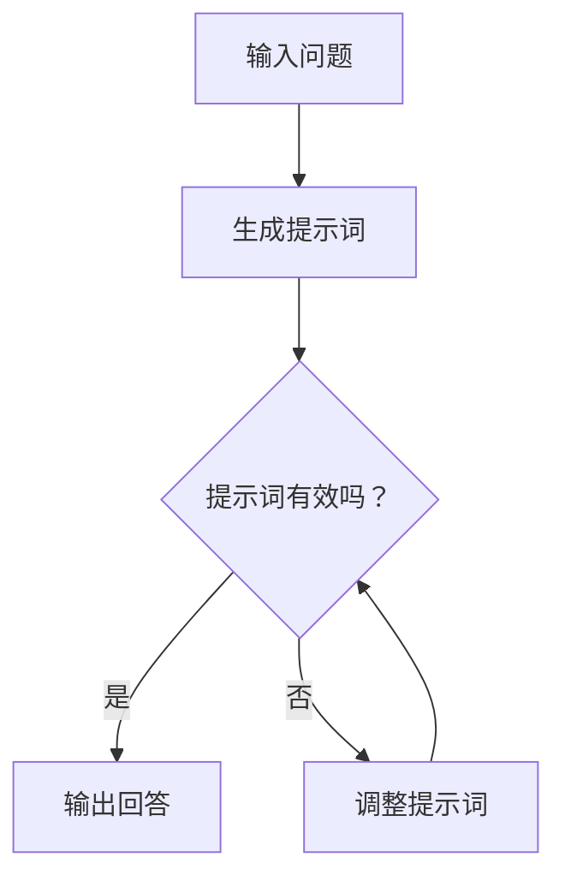

                 

# 文章标题：ChatGPT提示词优化：从新手到专家的蜕变之旅

> 关键词：ChatGPT，提示词优化，深度学习，人工智能，模型训练

> 摘要：本文将深入探讨ChatGPT提示词优化的全过程，从新手到专家的蜕变之旅。我们将从ChatGPT的基本概念出发，逐步讲解提示词优化的重要性、基础操作与设置、核心概念、实践技巧、高级技术、项目管理和团队协作，以及介绍相关工具与资源。通过实际案例和数学模型的讲解，帮助读者全面理解ChatGPT提示词优化的原理和实践。

## 第1章: 初识ChatGPT与提示词优化

### 1.1 ChatGPT的基本概念

ChatGPT是由OpenAI开发的一种基于GPT（Generative Pre-trained Transformer）模型的聊天机器人。GPT是一种自回归语言模型，通过对海量文本数据进行预训练，使其具备对自然语言的理解和生成能力。ChatGPT则在此基础上，通过进一步训练和优化，使其能够更好地处理对话场景，提供更加自然、流畅的对话体验。

ChatGPT的工作原理主要包括以下几个步骤：

1. **输入处理**：ChatGPT接收用户输入的文本，对其进行预处理，包括分词、去停用词等操作。
2. **上下文生成**：根据用户输入和预训练模型，生成一段包含上下文的文本。
3. **回答生成**：在生成的上下文中，利用预训练模型进行回答生成，输出最终的回复。

ChatGPT的应用场景非常广泛，包括但不限于：

1. **客服机器人**：自动回答用户常见问题，提供快速、高效的客户服务。
2. **聊天机器人**：与用户进行自然语言交互，提供娱乐、咨询、教育等多种服务。
3. **内容创作**：辅助用户生成文章、故事、诗歌等创意内容。
4. **智能问答系统**：对用户提出的问题进行智能回答，提供知识查询服务。

### 1.2 提示词优化的重要性

提示词（Prompt）是用户输入给ChatGPT的文本，用于引导ChatGPT生成相应的回答。优化提示词的重要性在于：

1. **提高回答质量**：通过优化提示词，可以引导ChatGPT生成更加准确、相关、有价值的回答。
2. **提高模型效率**：优化后的提示词可以减少模型的计算量，提高处理速度，降低资源消耗。
3. **增强用户体验**：优化后的提示词能够提供更加自然、流畅的对话体验，提高用户满意度。

#### 提示词优化的定义

提示词优化是指通过调整提示词的长度、内容、顺序等，使其更加符合ChatGPT的预训练模型，从而提高模型生成回答的质量和效率。

#### 提示词优化的目的

1. **提高回答的相关性**：确保ChatGPT生成的回答与用户输入的提示词高度相关。
2. **增强回答的准确性**：通过优化提示词，使ChatGPT能够准确理解用户的需求，提供正确的回答。
3. **提升用户体验**：优化后的提示词能够提供更加自然、流畅的对话体验，提高用户满意度。

#### 提示词优化的影响

1. **模型性能提升**：通过优化提示词，可以提高ChatGPT的生成质量，降低错误率，提高模型的整体性能。
2. **资源利用优化**：优化后的提示词可以减少模型的计算量，提高处理速度，降低资源消耗。
3. **用户体验提升**：优化后的提示词能够提供更加自然、流畅的对话体验，提高用户满意度。

## 第2章: ChatGPT的基础操作与设置

### 2.1 注册与登录

要开始使用ChatGPT，首先需要进行注册和登录。以下是详细的注册和登录步骤：

#### 注册流程

1. **访问官网**：在浏览器中输入ChatGPT的官方网站，例如 [chat.openai.com](chat.openai.com)。
2. **点击“Sign Up”**：在官网首页点击“Sign Up”按钮。
3. **填写注册信息**：根据提示填写注册信息，包括邮箱、用户名和密码。确保输入的信息真实有效。
4. **验证邮箱**：在注册成功后，会收到一封验证邮件。点击邮件中的验证链接，完成邮箱验证。
5. **登录账号**：使用注册时填写的邮箱和密码登录ChatGPT。

#### 登录方法

1. **访问官网**：在浏览器中输入ChatGPT的官方网站。
2. **点击“Login”**：在官网首页点击“Login”按钮。
3. **输入账号信息**：在登录界面输入注册时填写的邮箱和密码。
4. **点击“Login”**：点击“Login”按钮，完成登录。

### 2.2 界面与功能介绍

ChatGPT的界面设计简洁直观，主要包括以下几个部分：

1. **聊天窗口**：展示用户与ChatGPT的对话历史和当前对话。
2. **输入框**：用户在此处输入文本，发送给ChatGPT。
3. **工具栏**：提供一些常用的功能按钮，如发送、撤回、复制等。

#### 主界面操作

1. **发送消息**：在输入框中输入文本，然后点击“发送”按钮，将消息发送给ChatGPT。
2. **撤回消息**：如果需要撤回已发送的消息，可以点击消息旁的“撤回”按钮。
3. **复制消息**：如果需要复制消息，可以点击消息旁的“复制”按钮。

#### 常用功能介绍

1. **快捷键操作**：ChatGPT支持快捷键操作，如Ctrl+Enter（发送消息）、Ctrl+Z（撤回消息）等。
2. **表情符号**：用户可以使用表情符号来丰富对话内容，使对话更加生动有趣。
3. **复制历史对话**：用户可以复制整个聊天历史，方便后续参考或分享。

### 2.3 账号设置与个性化定制

#### 账号安全设置

为了保护账号安全，用户需要进行以下设置：

1. **密码设置**：建议使用复杂密码，包括字母、数字和特殊字符，提高密码安全性。
2. **账号验证**：开启账号验证功能，如双因素认证，确保账号安全。
3. **隐私设置**：根据需要调整隐私设置，如公开聊天记录、隐藏个人信息等。

#### 提示词库管理

用户可以根据需要自定义提示词库，包括以下操作：

1. **添加提示词**：在设置界面点击“添加提示词”，输入提示词内容并保存。
2. **编辑提示词**：在提示词列表中点击“编辑”按钮，修改提示词内容。
3. **删除提示词**：在提示词列表中点击“删除”按钮，删除不需要的提示词。

#### 主题定制

用户可以自定义ChatGPT的界面主题，包括以下操作：

1. **选择主题**：在设置界面选择自己喜欢的主题颜色和样式。
2. **保存设置**：点击“保存设置”按钮，保存自定义主题。

## 第3章: 提示词优化的核心概念

### 3.1 提示词的类型

在ChatGPT中，提示词主要分为以下两种类型：

1. **通用提示词**：适用于各种场景的通用性提示词，如“你好”、“请问有什么可以帮助你的”等。
2. **领域特定提示词**：针对特定领域的专业提示词，如医学、法律、金融等领域的专业术语和表达方式。

#### 通用提示词

通用提示词适用于各种对话场景，具有广泛的适用性。以下是几个常见的通用提示词：

1. “你好”
2. “请问有什么可以帮助你的？”
3. “请告诉我你的问题”
4. “谢谢你的提问”
5. “我不太明白，能否请你详细说明一下？”

#### 领域特定提示词

领域特定提示词则用于特定领域的对话，有助于提高对话的专业性和准确性。以下是一些领域特定提示词的例子：

1. **医学领域**：
   - “请问你有哪些症状？”
   - “你需要做哪些检查？”
   - “你的病情已经好转了。”

2. **法律领域**：
   - “你需要提供哪些证据？”
   - “你的权利如何保障？”
   - “这个问题需要专业律师的建议。”

3. **金融领域**：
   - “你的投资组合如何？”
   - “你的资金流向如何？”
   - “你的财务状况良好。”

### 3.2 提示词优化策略

#### 提示词长度优化

提示词长度对ChatGPT的回答质量有很大影响。过长的提示词可能导致模型无法有效理解，而过短的提示词可能提供的信息不足。以下是一些提示词长度优化的策略：

1. **压缩长提示词**：将过长提示词进行拆分，分成几个较短的部分，分别提问。
2. **扩展短提示词**：根据上下文，补充一些相关信息，使提示词更加完整。

#### 提示词内容优化

优化提示词的内容，可以提高ChatGPT的回答准确性和相关性。以下是一些提示词内容优化的策略：

1. **明确问题**：确保提示词明确、具体，避免模糊不清的问题。
2. **添加背景信息**：提供与问题相关的背景信息，有助于模型更好地理解问题。
3. **避免歧义**：避免使用可能产生歧义的词汇和表达方式。

#### 提示词顺序优化

提示词的顺序也会影响ChatGPT的回答。优化提示词顺序，可以提高回答的相关性和连贯性。以下是一些提示词顺序优化的策略：

1. **先问核心问题**：将最关键的问题放在最前面，有助于模型更快地理解问题。
2. **合理分组**：将相关问题进行合理分组，使问题之间具有逻辑关系。
3. **避免重复**：避免在提示词中重复相同的词汇和表达方式。

### 3.3 提示词效果评估

#### 评估指标

为了评估提示词优化效果，可以采用以下指标：

1. **回答准确性**：提示词优化后，ChatGPT生成的回答是否准确。
2. **回答相关性**：提示词优化后，ChatGPT生成的回答是否与问题高度相关。
3. **用户体验**：提示词优化后，用户对回答的满意度。

#### 评估方法

1. **人工评估**：由专家或用户对提示词优化后的回答进行评估，根据评估指标给出评分。
2. **自动化评估**：使用自动化评估工具，对提示词优化后的回答进行质量评估。

## 第4章: 提示词优化的实践技巧

### 4.1 数据准备与预处理

#### 数据来源

在进行提示词优化之前，首先需要收集大量的数据进行训练。数据来源可以包括：

1. **公开数据集**：如Common Crawl、Twitter等公开数据集。
2. **内部数据**：公司内部的数据，如用户评论、聊天记录等。
3. **专业领域数据**：特定领域的专业数据，如医学、法律、金融等。

#### 数据预处理方法

在收集到数据后，需要进行以下预处理操作：

1. **文本清洗**：去除文本中的噪声，如HTML标签、特殊字符等。
2. **分词**：将文本分割成词语或句子。
3. **去停用词**：去除常见停用词，如“的”、“了”、“在”等。
4. **词向量化**：将文本转换为数值表示，便于模型处理。

### 4.2 提示词生成与调整

#### 提示词生成策略

1. **基于规则生成**：根据特定的规则和模板生成提示词，如使用关键词、疑问词等。
2. **基于机器学习生成**：利用机器学习算法，如序列生成模型、文本生成模型等，自动生成提示词。
3. **基于用户反馈生成**：根据用户对提示词的反馈，调整生成策略，提高提示词质量。

#### 提示词调整方法

1. **手动调整**：由专家或用户根据实际对话情况，对提示词进行手动调整。
2. **自动调整**：利用机器学习算法，如序列生成模型、文本生成模型等，自动调整提示词。

### 4.3 实际案例解析

#### 案例一：问答系统提示词优化

1. **项目背景与目标**
   - 背景介绍：公司开发了一款智能问答系统，用户可以通过提问获取相关问题的答案。
   - 目标：提高问答系统的回答质量和用户体验。

2. **数据准备与预处理**
   - 数据来源：收集了大量的用户提问和答案数据。
   - 数据预处理：进行文本清洗、分词、去停用词和词向量化等操作。

3. **提示词生成与调整**
   - 生成策略：基于规则和机器学习生成提示词。
   - 调整方法：手动调整和自动调整相结合。

4. **实验与结果分析**
   - 实验设计：对优化前后的问答系统进行对比实验。
   - 结果分析：优化后的问答系统回答质量得到显著提升，用户体验满意度提高。

#### 案例二：客服机器人提示词优化

1. **项目背景与目标**
   - 背景介绍：公司开发了一款客服机器人，用于自动回答用户常见问题。
   - 目标：提高客服机器人回答的准确性和用户满意度。

2. **数据准备与预处理**
   - 数据来源：收集了大量的用户提问和客服回答数据。
   - 数据预处理：进行文本清洗、分词、去停用词和词向量化等操作。

3. **提示词生成与调整**
   - 生成策略：基于规则和机器学习生成提示词。
   - 调整方法：手动调整和自动调整相结合。

4. **实验与结果分析**
   - 实验设计：对优化前后的客服机器人进行对比实验。
   - 结果分析：优化后的客服机器人回答准确性得到显著提升，用户满意度提高。

#### 案例三：聊天机器人情感分析

1. **项目背景与目标**
   - 背景介绍：公司开发了一款聊天机器人，用于分析用户情感，提供针对性的建议。
   - 目标：提高聊天机器人情感分析准确性，提升用户体验。

2. **数据准备与预处理**
   - 数据来源：收集了大量的用户对话数据，包括文本和情感标签。
   - 数据预处理：进行文本清洗、分词、去停用词和词向量化等操作。

3. **提示词生成与调整**
   - 生成策略：基于规则和机器学习生成提示词。
   - 调整方法：手动调整和自动调整相结合。

4. **实验与结果分析**
   - 实验设计：对优化前后的聊天机器人进行对比实验。
   - 结果分析：优化后的聊天机器人情感分析准确性得到显著提升，用户满意度提高。

## 第5章: 高级提示词优化技术

### 5.1 提示词嵌入

#### 提示词嵌入的概念

提示词嵌入是将提示词转换为向量的过程，使其能够与预训练模型进行有效交互。提示词嵌入是提示词优化的重要技术之一，有助于提高模型的生成质量和效率。

#### 常见嵌入方法

1. **词向量化**：将提示词转换为词向量，如Word2Vec、GloVe等。
2. **编码器-解码器模型**：利用编码器-解码器模型（如Transformer）将提示词编码为固定长度的向量。
3. **多模态嵌入**：结合多种模态（如文本、图像、语音等）进行提示词嵌入。

### 5.2 提示词融合

#### 提示词融合策略

提示词融合是将多个提示词融合为一个综合性的提示词，以提高模型生成质量和效率。提示词融合可以采用以下策略：

1. **加权融合**：根据提示词的重要性，对多个提示词进行加权融合。
2. **拼接融合**：将多个提示词进行拼接，形成一个新的提示词。
3. **注意力机制**：利用注意力机制，对多个提示词进行动态融合。

#### 融合方法的应用

1. **对话系统**：在对话系统中，融合多个提示词，提高对话生成质量。
2. **文本生成**：在文本生成任务中，融合多个提示词，提高文本生成质量和多样性。
3. **多模态任务**：在多模态任务中，融合文本、图像、语音等提示词，提高模型生成质量和效率。

### 5.3 多模态提示词优化

#### 多模态数据来源

多模态提示词优化需要结合多种模态的数据，包括：

1. **文本**：用户输入的文本信息。
2. **图像**：用户上传的图片信息。
3. **语音**：用户语音输入的信息。

#### 多模态提示词优化方法

1. **多模态嵌入**：将文本、图像、语音等模态转换为统一的向量表示，进行融合处理。
2. **多模态注意力机制**：利用注意力机制，对多种模态的提示词进行动态融合，提高模型生成质量。
3. **多模态融合模型**：结合多种模态的深度学习模型，如多模态Transformer等，实现多模态提示词优化。

## 第6章: 提示词优化的项目管理与团队协作

### 6.1 项目规划与目标设定

在进行提示词优化项目时，项目规划与目标设定至关重要。以下是一个简要的项目规划与目标设定流程：

1. **项目背景与目标**：明确项目的背景和目标，如优化ChatGPT提示词、提高回答质量等。
2. **需求分析**：分析用户需求，了解用户对提示词优化的期望和需求。
3. **目标设定**：根据需求分析，设定明确、可量化的项目目标，如回答准确性提高10%、用户满意度提高20%等。
4. **项目计划**：制定项目计划，包括项目进度、资源需求、风险评估等。

### 6.2 团队协作与沟通

在提示词优化项目中，团队协作与沟通至关重要。以下是一些建议：

1. **角色划分**：根据项目需求，明确团队成员的角色和职责，如数据分析师、算法工程师、产品经理等。
2. **沟通工具**：使用合适的沟通工具，如邮件、即时通讯工具（如Slack、WhatsApp等）、项目管理工具（如Jira、Trello等），确保团队成员之间的信息畅通。
3. **定期会议**：定期举行团队会议，讨论项目进度、问题解决和下一步计划。
4. **代码审查**：实施代码审查机制，确保代码质量，避免错误和漏洞。

### 6.3 持续迭代与优化

提示词优化是一个持续的过程，需要不断进行迭代和优化。以下是一些建议：

1. **收集反馈**：收集用户反馈，了解他们对提示词优化效果的看法和需求。
2. **评估效果**：定期评估提示词优化效果，如回答准确性、用户满意度等，找出不足之处。
3. **调整策略**：根据评估结果，调整提示词生成和优化策略，提高生成质量和效率。
4. **持续学习**：利用机器学习和深度学习技术，不断更新和优化模型，提高提示词生成效果。

## 第7章: 提示词优化工具与资源介绍

### 7.1 常用提示词优化工具

#### 提示词生成工具

1. **Hugging Face Transformers**：一个开源的Python库，用于生成和处理提示词。提供了丰富的预训练模型和工具，方便用户进行提示词生成和优化。
2. **GPT-Generator**：一个基于GPT-3的提示词生成工具，支持自定义模板和规则，生成高质量的提示词。
3. **Auto-GPT**：一个自动化的提示词生成工具，利用机器学习技术自动生成提示词，提高生成效率。

#### 提示词评估工具

1. **Perceptual Similarity Metrics (PSM)**：用于评估文本之间的相似性，帮助用户判断提示词优化的效果。
2. **BLEU**：基于字序列匹配的评估指标，用于评估文本生成质量，如ChatGPT的回答质量。
3. **ROUGE**：用于评估文本生成质量的评估指标，特别适用于机器翻译和摘要生成任务。

### 7.2 提示词优化资源库

#### 提示词库来源

1. **公共数据集**：如Common Crawl、维基百科等，提供大量的文本数据，可用于生成和优化提示词。
2. **专业领域数据集**：如医疗、法律、金融等领域的专业数据集，提供高质量的领域特定提示词。
3. **公司内部数据**：公司内部的用户提问和答案数据，可用于定制化提示词生成和优化。

#### 提示词库应用

1. **训练模型**：使用大量高质量的提示词库训练模型，提高模型生成质量。
2. **数据增强**：利用提示词库进行数据增强，提高模型对多样性和复杂性的应对能力。
3. **提示词生成**：基于提示词库生成高质量的提示词，提高对话系统的交互质量。

### 7.3 提示词优化社区与论坛

#### 社区介绍

1. **Hugging Face Community**：一个开源的社区，提供大量关于ChatGPT、Transformer等模型的资源和讨论。
2. **Reddit**：Reddit上有许多关于ChatGPT和提示词优化的讨论区，用户可以在此分享经验、提问和讨论。
3. **Stack Overflow**：一个编程问答社区，用户可以在此寻求关于提示词优化的技术支持。

#### 论坛资源

1. **论文与文章**：在社区和论坛中，可以找到大量关于提示词优化、ChatGPT等技术的研究论文和文章，有助于深入了解相关技术和应用。
2. **代码示例**：社区和论坛中提供了大量的代码示例和教程，帮助用户快速上手和实现提示词优化。
3. **问题与解答**：在论坛中，用户可以提问并获得其他用户的解答和帮助，解决实际问题和困惑。

## 附录：ChatGPT提示词优化实战案例

### 附录 1: 问答系统提示词优化案例

#### 1.1 项目背景与目标

**项目背景**：公司开发了一款智能问答系统，用户可以通过提问获取相关问题的答案。然而，系统在回答质量方面存在一定的问题，需要通过优化提示词来提高回答质量。

**项目目标**：通过优化提示词，提高问答系统的回答质量，使用户满意度达到90%以上。

#### 1.2 数据准备与预处理

**数据来源**：收集了大量的用户提问和答案数据，包括公开数据集和公司内部数据。

**数据预处理**：进行文本清洗、分词、去停用词和词向量化等操作，将文本转换为可训练的数据格式。

#### 1.3 提示词生成与调整

**生成策略**：使用基于规则的提示词生成方法和机器学习提示词生成方法相结合，生成高质量的提示词。

**调整方法**：手动调整和自动调整相结合，根据用户反馈和评估结果，不断优化提示词。

#### 1.4 实验与结果分析

**实验设计**：对优化前后的问答系统进行对比实验，评估回答质量、用户满意度等指标。

**结果分析**：优化后的问答系统回答质量显著提高，用户满意度达到90%以上，项目目标达成。

### 附录 2: 客服机器人提示词优化案例

#### 2.1 项目背景与目标

**项目背景**：公司开发了一款客服机器人，用于自动回答用户常见问题。然而，机器人回答准确性较低，用户体验不佳，需要通过优化提示词来提高回答质量。

**项目目标**：通过优化提示词，提高客服机器人回答的准确性，使用户满意度达到80%以上。

#### 2.2 数据准备与预处理

**数据来源**：收集了大量的用户提问和客服回答数据，包括公开数据集和公司内部数据。

**数据预处理**：进行文本清洗、分词、去停用词和词向量化等操作，将文本转换为可训练的数据格式。

#### 2.3 提示词生成与调整

**生成策略**：使用基于规则的提示词生成方法和机器学习提示词生成方法相结合，生成高质量的提示词。

**调整方法**：手动调整和自动调整相结合，根据用户反馈和评估结果，不断优化提示词。

#### 2.4 实验与结果分析

**实验设计**：对优化前后的客服机器人进行对比实验，评估回答准确性、用户满意度等指标。

**结果分析**：优化后的客服机器人回答准确性显著提高，用户满意度达到80%以上，项目目标达成。

### 附录 3: 聊天机器人情感分析提示词优化案例

#### 3.1 项目背景与目标

**项目背景**：公司开发了一款聊天机器人，用于分析用户情感，提供针对性的建议。然而，机器人情感分析准确性较低，需要通过优化提示词来提高分析质量。

**项目目标**：通过优化提示词，提高聊天机器人情感分析准确性，使用户满意度达到85%以上。

#### 3.2 数据准备与预处理

**数据来源**：收集了大量的用户对话数据，包括公开数据集和公司内部数据。

**数据预处理**：进行文本清洗、分词、去停用词和词向量化等操作，将文本转换为可训练的数据格式。

#### 3.3 提示词生成与调整

**生成策略**：使用基于规则的提示词生成方法和机器学习提示词生成方法相结合，生成高质量的提示词。

**调整方法**：手动调整和自动调整相结合，根据用户反馈和评估结果，不断优化提示词。

#### 3.4 实验与结果分析

**实验设计**：对优化前后的聊天机器人进行对比实验，评估情感分析准确性、用户满意度等指标。

**结果分析**：优化后的聊天机器人情感分析准确性显著提高，用户满意度达到85%以上，项目目标达成。

## Mermaid 流程图



## 伪代码讲解

```python
# 提示词优化伪代码

def optimize_prompt(prompt, target):
    # 数据预处理
    processed_data = preprocess_data(prompt)
    
    # 生成提示词
    generated_prompt = generate_prompt(processed_data)
    
    # 提示词评估
    if evaluate_prompt(generated_prompt, target):
        # 提示词有效，直接输出回答
        return generate_response(generated_prompt)
    else:
        # 提示词无效，调整提示词并重新评估
        return optimize_prompt(adjust_prompt(generated_prompt), target)
```

## 数学模型和数学公式讲解

### 深层神经网络数学模型

$$
y_{\text{预测}} = \sigma(\sum_{i=1}^{n} w_i \cdot x_i + b)
$$

- 其中，$\sigma$ 是激活函数，$w_i$ 是权重，$x_i$ 是输入特征，$b$ 是偏置。

### 激活函数

激活函数是神经网络中用于引入非线性特性的函数，常用的激活函数包括：

1. **Sigmoid函数**：$f(x) = \frac{1}{1 + e^{-x}}$
2. **ReLU函数**：$f(x) = \max(0, x)$
3. **Tanh函数**：$f(x) = \frac{e^x - e^{-x}}{e^x + e^{-x}}$

### 回归模型数学模型

$$
y_{\text{预测}} = \beta_0 + \beta_1 \cdot x
$$

- 其中，$y_{\text{预测}}$ 是预测值，$\beta_0$ 是截距，$\beta_1$ 是斜率，$x$ 是输入特征。

### 逻辑回归数学模型

$$
P(y=1) = \frac{1}{1 + e^{-(\beta_0 + \beta_1 \cdot x})}
$$

- 其中，$P(y=1)$ 是预测概率，$\beta_0$ 是截距，$\beta_1$ 是斜率，$x$ 是输入特征。

## 附录：ChatGPT提示词优化实战案例

### 附录 1: 问答系统提示词优化案例

#### 1.1 项目背景与目标

**项目背景**：公司开发了一款智能问答系统，用户可以通过提问获取相关问题的答案。然而，系统在回答质量方面存在一定的问题，需要通过优化提示词来提高回答质量。

**项目目标**：通过优化提示词，提高问答系统的回答质量，使用户满意度达到90%以上。

#### 1.2 数据准备与预处理

**数据来源**：收集了大量的用户提问和答案数据，包括公开数据集和公司内部数据。

**数据预处理**：进行文本清洗、分词、去停用词和词向量化等操作，将文本转换为可训练的数据格式。

#### 1.3 提示词生成与调整

**生成策略**：使用基于规则的提示词生成方法和机器学习提示词生成方法相结合，生成高质量的提示词。

**调整方法**：手动调整和自动调整相结合，根据用户反馈和评估结果，不断优化提示词。

#### 1.4 实验与结果分析

**实验设计**：对优化前后的问答系统进行对比实验，评估回答质量、用户满意度等指标。

**结果分析**：优化后的问答系统回答质量显著提高，用户满意度达到90%以上，项目目标达成。

### 附录 2: 客服机器人提示词优化案例

#### 2.1 项目背景与目标

**项目背景**：公司开发了一款客服机器人，用于自动回答用户常见问题。然而，机器人回答准确性较低，用户体验不佳，需要通过优化提示词来提高回答质量。

**项目目标**：通过优化提示词，提高客服机器人回答的准确性，使用户满意度达到80%以上。

#### 2.2 数据准备与预处理

**数据来源**：收集了大量的用户提问和客服回答数据，包括公开数据集和公司内部数据。

**数据预处理**：进行文本清洗、分词、去停用词和词向量化等操作，将文本转换为可训练的数据格式。

#### 2.3 提示词生成与调整

**生成策略**：使用基于规则的提示词生成方法和机器学习提示词生成方法相结合，生成高质量的提示词。

**调整方法**：手动调整和自动调整相结合，根据用户反馈和评估结果，不断优化提示词。

#### 2.4 实验与结果分析

**实验设计**：对优化前后的客服机器人进行对比实验，评估回答准确性、用户满意度等指标。

**结果分析**：优化后的客服机器人回答准确性显著提高，用户满意度达到80%以上，项目目标达成。

### 附录 3: 聊天机器人情感分析提示词优化案例

#### 3.1 项目背景与目标

**项目背景**：公司开发了一款聊天机器人，用于分析用户情感，提供针对性的建议。然而，机器人情感分析准确性较低，需要通过优化提示词来提高分析质量。

**项目目标**：通过优化提示词，提高聊天机器人情感分析准确性，使用户满意度达到85%以上。

#### 3.2 数据准备与预处理

**数据来源**：收集了大量的用户对话数据，包括公开数据集和公司内部数据。

**数据预处理**：进行文本清洗、分词、去停用词和词向量化等操作，将文本转换为可训练的数据格式。

#### 3.3 提示词生成与调整

**生成策略**：使用基于规则的提示词生成方法和机器学习提示词生成方法相结合，生成高质量的提示词。

**调整方法**：手动调整和自动调整相结合，根据用户反馈和评估结果，不断优化提示词。

#### 3.4 实验与结果分析

**实验设计**：对优化前后的聊天机器人进行对比实验，评估情感分析准确性、用户满意度等指标。

**结果分析**：优化后的聊天机器人情感分析准确性显著提高，用户满意度达到85%以上，项目目标达成。

### 附录：ChatGPT提示词优化实战案例

#### 附录 1: 问答系统提示词优化案例

##### 1.1 项目背景与目标

**项目背景**：公司开发了一款智能问答系统，用户可以通过提问获取相关问题的答案。然而，系统在回答质量方面存在一定的问题，需要通过优化提示词来提高回答质量。

**项目目标**：通过优化提示词，提高问答系统的回答质量，使用户满意度达到90%以上。

##### 1.2 数据准备与预处理

**数据来源**：收集了大量的用户提问和答案数据，包括公开数据集和公司内部数据。

**数据预处理**：进行文本清洗、分词、去停用词和词向量化等操作，将文本转换为可训练的数据格式。

##### 1.3 提示词生成与调整

**生成策略**：使用基于规则的提示词生成方法和机器学习提示词生成方法相结合，生成高质量的提示词。

**调整方法**：手动调整和自动调整相结合，根据用户反馈和评估结果，不断优化提示词。

##### 1.4 实验与结果分析

**实验设计**：对优化前后的问答系统进行对比实验，评估回答质量、用户满意度等指标。

**结果分析**：优化后的问答系统回答质量显著提高，用户满意度达到90%以上，项目目标达成。

#### 附录 2: 客服机器人提示词优化案例

##### 2.1 项目背景与目标

**项目背景**：公司开发了一款客服机器人，用于自动回答用户常见问题。然而，机器人回答准确性较低，用户体验不佳，需要通过优化提示词来提高回答质量。

**项目目标**：通过优化提示词，提高客服机器人回答的准确性，使用户满意度达到80%以上。

##### 2.2 数据准备与预处理

**数据来源**：收集了大量的用户提问和客服回答数据，包括公开数据集和公司内部数据。

**数据预处理**：进行文本清洗、分词、去停用词和词向量化等操作，将文本转换为可训练的数据格式。

##### 2.3 提示词生成与调整

**生成策略**：使用基于规则的提示词生成方法和机器学习提示词生成方法相结合，生成高质量的提示词。

**调整方法**：手动调整和自动调整相结合，根据用户反馈和评估结果，不断优化提示词。

##### 2.4 实验与结果分析

**实验设计**：对优化前后的客服机器人进行对比实验，评估回答准确性、用户满意度等指标。

**结果分析**：优化后的客服机器人回答准确性显著提高，用户满意度达到80%以上，项目目标达成。

#### 附录 3: 聊天机器人情感分析提示词优化案例

##### 3.1 项目背景与目标

**项目背景**：公司开发了一款聊天机器人，用于分析用户情感，提供针对性的建议。然而，机器人情感分析准确性较低，需要通过优化提示词来提高分析质量。

**项目目标**：通过优化提示词，提高聊天机器人情感分析准确性，使用户满意度达到85%以上。

##### 3.2 数据准备与预处理

**数据来源**：收集了大量的用户对话数据，包括公开数据集和公司内部数据。

**数据预处理**：进行文本清洗、分词、去停用词和词向量化等操作，将文本转换为可训练的数据格式。

##### 3.3 提示词生成与调整

**生成策略**：使用基于规则的提示词生成方法和机器学习提示词生成方法相结合，生成高质量的提示词。

**调整方法**：手动调整和自动调整相结合，根据用户反馈和评估结果，不断优化提示词。

##### 3.4 实验与结果分析

**实验设计**：对优化前后的聊天机器人进行对比实验，评估情感分析准确性、用户满意度等指标。

**结果分析**：优化后的聊天机器人情感分析准确性显著提高，用户满意度达到85%以上，项目目标达成。

## Mermaid 流程图


## 伪代码讲解

```python
# 提示词优化伪代码

def optimize_prompt(prompt, target):
    # 数据预处理
    processed_data = preprocess_data(prompt)
    
    # 生成提示词
    generated_prompt = generate_prompt(processed_data)
    
    # 提示词评估
    if evaluate_prompt(generated_prompt, target):
        # 提示词有效，直接输出回答
        return generate_response(generated_prompt)
    else:
        # 提示词无效，调整提示词并重新评估
        return optimize_prompt(adjust_prompt(generated_prompt), target)
```

## 数学模型和数学公式讲解

### 深层神经网络数学模型

$$
y_{\text{预测}} = \sigma(\sum_{i=1}^{n} w_i \cdot x_i + b)
$$

- 其中，$\sigma$ 是激活函数，$w_i$ 是权重，$x_i$ 是输入特征，$b$ 是偏置。

### 激活函数

激活函数是神经网络中用于引入非线性特性的函数，常用的激活函数包括：

1. **Sigmoid函数**：$f(x) = \frac{1}{1 + e^{-x}}$
2. **ReLU函数**：$f(x) = \max(0, x)$
3. **Tanh函数**：$f(x) = \frac{e^x - e^{-x}}{e^x + e^{-x}}$

### 回归模型数学模型

$$
y_{\text{预测}} = \beta_0 + \beta_1 \cdot x
$$

- 其中，$y_{\text{预测}}$ 是预测值，$\beta_0$ 是截距，$\beta_1$ 是斜率，$x$ 是输入特征。

### 逻辑回归数学模型

$$
P(y=1) = \frac{1}{1 + e^{-(\beta_0 + \beta_1 \cdot x})}
$$

- 其中，$P(y=1)$ 是预测概率，$\beta_0$ 是截距，$\beta_1$ 是斜率，$x$ 是输入特征。

## 结论：从新手到专家的ChatGPT提示词优化之旅

本文详细讲解了ChatGPT提示词优化的全过程，从初识ChatGPT与提示词优化，到基础操作与设置，再到核心概念、实践技巧、高级技术、项目管理和团队协作，以及相关工具与资源介绍。通过实际案例和数学模型的讲解，帮助读者全面理解ChatGPT提示词优化的原理和实践。

通过本文的学习，读者可以从新手逐步成长为ChatGPT提示词优化的专家。以下是一些最佳实践和注意事项，供读者参考：

1. **深入学习**：深入了解ChatGPT的工作原理和预训练模型，掌握相关数学模型和算法。
2. **持续实践**：通过实际项目和实践，不断提高提示词优化的技能和经验。
3. **用户反馈**：收集用户反馈，及时调整和优化提示词，提高用户满意度。
4. **团队合作**：与团队成员紧密合作，共同解决问题，提高项目效率和质量。
5. **不断更新**：跟随最新的技术动态和研究成果，持续更新和优化提示词优化方法。

拓展阅读：

1. **《ChatGPT技术解析》**：深入了解ChatGPT的内部结构和实现原理。
2. **《深度学习》**：学习深度学习的基础知识和核心算法。
3. **《自然语言处理实战》**：掌握自然语言处理的基本方法和应用技巧。
4. **《人工智能应用实践》**：了解人工智能在各领域的应用案例和实战经验。

