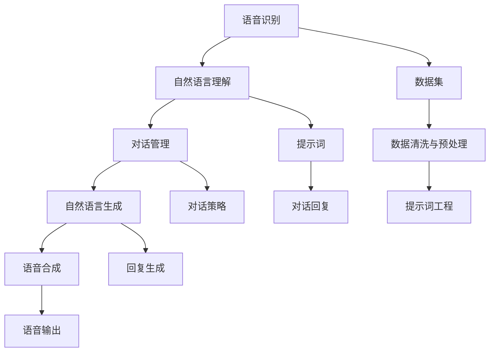

                 

### 文章标题

《ChatGPT提示词工程：构建智能对话的基础与进阶》

### 文章关键词

- ChatGPT
- 智能对话
- 提示词工程
- 对话管理
- 优化策略
- 项目实战

### 文章摘要

本文旨在探讨ChatGPT提示词工程在构建智能对话系统中的关键作用。首先，我们将回顾智能对话的发展历程和基本原理，随后深入探讨ChatGPT的工作机制和架构。文章的重点在于提示词工程，包括其设计原则、数据准备和对话管理等内容。接着，我们将介绍对话优化的核心方法和策略，并通过项目实战展示整个流程。最后，文章将总结最佳实践，并提供进一步的学习资源，以期为读者在智能对话领域的探索提供有力支持。

---

## 第一部分：智能对话基础

### 1.1 智能对话概述

#### 1.1.1 智能对话的发展历程

智能对话系统作为人工智能领域的一个重要分支，其发展可以追溯到20世纪50年代。最早的智能对话系统是1956年达特茅斯会议上的概念，随后在70年代和80年代，基于规则的方法和专家系统得到了广泛应用。进入21世纪，随着深度学习和自然语言处理技术的迅猛发展，智能对话系统迎来了新的发展机遇。近年来，基于生成模型的智能对话系统，如ChatGPT，逐渐成为研究和应用的热点。

#### 1.1.2 智能对话的基本原理

智能对话系统的核心是能够理解人类语言并进行有效回应。这包括以下几个关键步骤：

1. **语音识别（Speech Recognition）**：将语音信号转换为文本。
2. **自然语言理解（Natural Language Understanding，NLU）**：解析文本，提取语义信息。
3. **对话管理（Dialogue Management）**：根据上下文信息决定对话的下一步行动。
4. **自然语言生成（Natural Language Generation，NLG）**：生成自然、流畅的回复文本。
5. **语音合成（Text-to-Speech，TTS）**：将文本转换为语音输出。

### 1.2 ChatGPT介绍

#### 1.2.1 ChatGPT的基本原理

ChatGPT是由OpenAI开发的一种基于变换器模型（Transformer）的预训练语言模型。其基本原理包括以下几个方面：

1. **预训练**：在大量文本数据上进行预训练，使模型具备理解和生成自然语言的能力。
2. **微调**：针对特定任务进行微调，以提高模型的性能和适应性。
3. **生成文本**：通过输入一段文本，模型输出相关且连贯的续写内容。

#### 1.2.2 ChatGPT的架构

ChatGPT的架构主要包括以下几个关键组件：

1. **输入层**：接收用户输入的文本。
2. **编码器**：对输入文本进行编码，提取语义信息。
3. **解码器**：根据编码器的输出，生成回复文本。
4. **输出层**：将解码器的输出转换为自然语言文本。

### 1.3 提示词工程

#### 1.3.1 提示词的作用

提示词（Prompt）在智能对话系统中起着至关重要的作用。它们是用户输入和系统输出之间的桥梁，能够引导对话方向和内容。具体作用包括：

1. **引导对话**：通过提示词，系统可以更准确地理解用户的意图和需求。
2. **优化性能**：设计合理的提示词可以提高模型的性能和回复质量。
3. **增强交互性**：良好的提示词可以提升用户体验，增强对话的流畅性和自然性。

#### 1.3.2 提示词的设计原则

设计提示词时需要遵循以下几个原则：

1. **清晰明确**：提示词应简洁明了，避免产生歧义。
2. **针对性**：根据对话内容和用户需求，设计针对性的提示词。
3. **多样性**：合理地设计多样化的提示词，以适应不同的对话场景。
4. **连贯性**：提示词应与用户输入和系统回复保持一致，确保对话的连贯性。

### 1.4 数据准备

#### 1.4.1 数据集的选择

数据集的选择对智能对话系统至关重要。选择合适的数据集可以显著提升模型性能。以下是一些常见的数据集类型：

1. **对话数据集**：如DialoGPT、SI-100等，专门用于训练对话系统的数据集。
2. **语料库**：如维基百科、新闻文章等，提供丰富的文本资源。
3. **公开对话平台**：如Reddit、Twitter等，可以收集大量真实用户之间的对话数据。

#### 1.4.2 数据清洗与预处理

数据清洗与预处理是确保数据质量的重要环节。主要任务包括：

1. **去除噪声**：去除无用的标点符号、停用词等。
2. **统一格式**：将不同格式的文本统一转换为标准格式。
3. **词干提取**：将文本中的词转换为基本形式，如提取词干。
4. **词向量表示**：将文本转换为词向量，便于模型处理。

---

## 第一部分：智能对话基础（续）

### 1.5 核心概念与联系

在智能对话系统中，核心概念之间存在着紧密的联系。以下是一个Mermaid流程图，展示了这些概念之间的关系架构：



通过这个流程图，我们可以清晰地看到从语音识别到语音合成的整个对话流程，以及各个环节之间的相互依赖关系。每个组件都是构建智能对话系统不可或缺的部分。

### 1.6 核心算法原理讲解

为了更好地理解智能对话系统的核心算法原理，以下我们将使用伪代码详细阐述关键步骤。

#### 1.6.1 语音识别

语音识别（Speech Recognition）的伪代码如下：

```python
def speech_recognition(audio):
    # 读取音频文件
    audio_data = load_audio_file(audio)
    # 特征提取
    features = extract_features(audio_data)
    # 转换为文本
    text = model_transcribe(features)
    return text
```

其中，`load_audio_file`负责读取音频文件，`extract_features`提取音频特征，`model_transcribe`使用预训练的模型将特征转换为文本。

#### 1.6.2 自然语言理解

自然语言理解（Natural Language Understanding，NLU）的伪代码如下：

```python
def natural_language_understanding(text):
    # 语义解析
    intent = parse_intent(text)
    entities = extract_entities(text)
    # 上下文信息
    context = build_context(intent, entities)
    return context
```

其中，`parse_intent`解析文本的意图，`extract_entities`提取实体信息，`build_context`构建上下文信息。

#### 1.6.3 对话管理

对话管理（Dialogue Management）的伪代码如下：

```python
def dialogue_management(context):
    # 决策模块
    action = decide_action(context)
    # 生成回复
    response = generate_response(action)
    return response
```

其中，`decide_action`根据上下文信息决定对话的下一步行动，`generate_response`生成相应的回复文本。

#### 1.6.4 自然语言生成

自然语言生成（Natural Language Generation，NLG）的伪代码如下：

```python
def natural_language_generation(response):
    # 生成文本
    text = model_generate(response)
    return text
```

其中，`model_generate`使用预训练的语言模型生成文本。

#### 1.6.5 语音合成

语音合成（Text-to-Speech，TTS）的伪代码如下：

```python
def text_to_speech(text):
    # 文本到语音
    audio = model_synthesize(text)
    return audio
```

其中，`model_synthesize`使用预训练的TTS模型将文本转换为音频。

### 1.7 数学模型和公式

在智能对话系统中，数学模型和公式是理解核心算法的重要工具。以下是一些关键的数学模型和公式：

#### 1.7.1 词嵌入（Word Embedding）

词嵌入是将文本转换为向量的过程，常用的模型有Word2Vec、GloVe等。以GloVe为例，其损失函数可以表示为：

$$
\ell(\theta) = \frac{1}{n} \sum_{i=1}^n \sum_{j \in \mathcal{C}_i} \frac{1}{\|w_i\|\|w_j\|} \exp\left(-\frac{\langle v_i, v_j \rangle}{\|w_i\|\|w_j\|}\right) \log(p_j)
$$

其中，$v_i$和$v_j$分别表示词向量，$\mathcal{C}_i$表示与词$i$共现的词集合，$p_j$表示词$j$的词频。

#### 1.7.2 生成模型（Generative Model）

生成模型用于生成新的文本，如变分自编码器（Variational Autoencoder，VAE）和生成对抗网络（Generative Adversarial Network，GAN）。以VAE为例，其损失函数可以表示为：

$$
\ell(\theta, \phi) = D(\mu(z|x), \log(\sigma^2(z|x))) + \frac{1}{2} \mathbb{E}_{z \sim q(z|x)} \left[ \left\| x - \phi(z) \right\|^2 \right]
$$

其中，$\mu(z|x)$和$\log(\sigma^2(z|x))$分别表示编码器输出的均值和方差，$q(z|x)$表示解码器输出的概率分布，$D$是区分器损失。

### 1.8 详细讲解和举例说明

#### 1.8.1 词嵌入

以GloVe为例，我们通过以下步骤来详细讲解其原理和如何应用。

**原理讲解：**

1. **共现矩阵**：首先，构建共现矩阵$C$，其中$C_{ij}$表示词$i$和词$j$的共现次数。
2. **权重矩阵**：定义权重矩阵$W$，其中$W_i$表示词$i$的词向量。
3. **损失函数**：使用损失函数$\ell(\theta)$来优化权重矩阵$W$。

**举例说明：**

假设我们有一个共现矩阵：

$$
C = \begin{bmatrix}
0 & 1 & 1 \\
1 & 0 & 2 \\
1 & 2 & 0
\end{bmatrix}
$$

我们选择两个中心词“猫”和“狗”，计算它们的词向量。通过优化损失函数，我们可以得到词向量：

$$
\begin{bmatrix}
1.2 \\
0.8
\end{bmatrix}
\quad \text{和} \quad
\begin{bmatrix}
0.6 \\
1.2
\end{bmatrix}
$$

这两个词向量表示了“猫”和“狗”在语义上的相似性。

#### 1.8.2 生成模型

以VAE为例，我们通过以下步骤来详细讲解其原理和如何应用。

**原理讲解：**

1. **编码器**：编码器$E$将输入$x$编码为均值$\mu$和方差$\log(\sigma^2)$。
2. **解码器**：解码器$D$将随机噪声$z$解码为输出$x$。
3. **损失函数**：损失函数$\ell(\theta, \phi)$用于优化编码器和解码器的参数。

**举例说明：**

假设我们有一个输入文本“人工智能”，通过编码器和解码器，我们可以生成类似的文本。例如，编码器输出均值$\mu$和方差$\log(\sigma^2)$，解码器生成文本“机器学习”。通过多次迭代，我们可以逐渐优化生成文本的质量。

### 1.9 总结

在第一部分中，我们介绍了智能对话系统的基础知识，包括发展历程、基本原理、ChatGPT的介绍、提示词工程和数据准备等内容。同时，通过核心概念与联系的流程图、伪代码、数学模型和公式以及详细讲解和举例说明，我们对智能对话系统的核心组件和算法原理有了更深入的理解。这些基础知识为后续的进阶讨论和项目实战打下了坚实的基础。

---

## 第二部分：智能对话进阶

### 2.1 对话管理

对话管理是智能对话系统中的核心环节，负责处理对话的上下文信息，确保对话流程的连贯性和有效性。以下是对话管理的关键组成部分：

#### 2.1.1 对话状态的跟踪

对话状态跟踪是确保对话连贯性的关键。它涉及以下步骤：

1. **初始化**：对话开始时，初始化对话状态。
2. **更新**：随着对话的进行，不断更新对话状态，以反映当前的对话上下文。
3. **保存**：将对话状态保存到数据库或其他存储介质，以便后续查询和使用。

伪代码如下：

```python
def update_dialogue_state(state, new_info):
    state['context'] = merge_context(state['context'], new_info)
    save_state_to_database(state)
    return state
```

其中，`merge_context`函数合并新的上下文信息，`save_state_to_database`函数将状态保存到数据库。

#### 2.1.2 对话策略的设计

对话策略是指导对话流程的一系列规则和准则。设计对话策略时，需要考虑以下因素：

1. **用户意图识别**：准确识别用户的意图，为对话提供方向。
2. **对话目标**：明确对话的目标，确保对话能够达成预期效果。
3. **上下文敏感性**：根据对话的上下文信息，调整对话策略。

以下是一个简化的对话策略设计伪代码：

```python
def design_dialogue_strategy(intent, context):
    if intent == '询问时间':
        strategy = {'response': '当前时间是{time}', 'next_action': '等待用户反馈'}
    elif intent == '获取帮助':
        strategy = {'response': '我们可以帮助您，请问有什么问题？', 'next_action': '等待用户提问'}
    else:
        strategy = {'response': '对不起，我不理解您的意思。', 'next_action': '提示用户重述问题'}
    return strategy
```

### 2.2 对话优化

对话优化是提升智能对话系统性能的重要手段。以下是一些核心方法和策略：

#### 2.2.1 优化目标

对话优化的目标包括：

1. **提高回复质量**：生成更准确、更有价值的回复。
2. **增强用户体验**：提升用户的满意度，增强对话的流畅性和自然性。
3. **降低成本**：通过优化对话流程，减少人力和时间成本。

#### 2.2.2 优化方法

以下是几种常见的对话优化方法：

1. **反馈循环**：通过用户反馈不断优化系统性能。
2. **强化学习**：使用强化学习算法，根据用户的反馈调整对话策略。
3. **多模态交互**：结合文本、语音、图像等多种模态，提升对话系统的适应性和交互性。
4. **迁移学习**：利用预训练模型，将知识迁移到特定领域，提升对话能力。

以下是一个简化的强化学习优化方法伪代码：

```python
def optimize_with_reinforcement_learning(model, user_feedback):
    # 训练模型
    model.train(user_feedback['context'], user_feedback['response'])
    # 评估模型
    performance = model.evaluate(user_feedback['test_data'])
    # 调整模型参数
    model.adjust_parameters(performance)
    return model
```

### 2.3 常见问题与解决策略

在智能对话系统的开发过程中，可能会遇到一系列问题。以下是一些常见问题和相应的解决策略：

#### 2.3.1 对话中的常见问题

1. **理解偏差**：模型对用户输入的理解不准确。
2. **回答不相关**：模型生成的回复与用户意图不相关。
3. **对话中断**：对话过程中出现意外的中断，导致对话无法继续。

#### 2.3.2 解决策略

1. **加强预训练**：通过使用更高质量的语料库和更丰富的数据集，加强模型的预训练。
2. **增加上下文信息**：在对话中增加上下文信息，帮助模型更好地理解用户意图。
3. **引入多模态交互**：结合文本、语音、图像等多种模态，提高对话的连贯性和自然性。
4. **使用反馈机制**：通过用户反馈，不断调整和优化对话系统。

以下是一个简化的反馈机制伪代码：

```python
def feedback_loop(model, user_feedback):
    model.update_response(user_feedback['response'])
    if user_feedback['满意度'] < threshold:
        model.train(user_feedback['context'], user_feedback['response'])
    return model
```

### 2.4 总结

在第二部分中，我们深入探讨了智能对话系统的进阶内容，包括对话管理、对话优化和常见问题与解决策略。通过对话状态的跟踪和对话策略的设计，我们确保了对话的连贯性和有效性。同时，通过对话优化方法，我们提升了对话系统的性能和用户体验。此外，针对对话中常见的挑战，我们提出了相应的解决策略。这些进阶知识为构建高性能的智能对话系统提供了有力支持。

---

## 第三部分：智能对话项目实战

### 3.1 项目背景与目标

#### 3.1.1 项目背景

随着人工智能技术的快速发展，智能对话系统在客服、教育、医疗等多个领域得到了广泛应用。为了提升用户体验，降低人力成本，我们决定开发一个基于ChatGPT的智能对话系统。该项目旨在构建一个能够理解用户需求、提供个性化服务、并能不断学习和优化的对话平台。

#### 3.1.2 项目目标

本项目的主要目标包括：

1. **构建高效的对话系统**：通过优化算法和模型，构建一个能够快速响应用户请求的对话系统。
2. **提升用户体验**：设计人性化的对话交互界面，提升用户的满意度。
3. **实现持续优化**：通过用户反馈和数据分析，不断优化对话系统的性能和适应性。

### 3.2 项目规划

为了确保项目顺利进行，我们制定了详细的项目规划，包括以下关键步骤：

#### 3.2.1 项目范围

- **需求分析**：明确用户需求，定义对话系统的功能模块。
- **系统设计**：设计系统架构，确定技术方案和开发工具。
- **模块开发**：分模块进行开发，包括语音识别、自然语言理解、对话管理和语音合成等。
- **集成测试**：对各模块进行集成测试，确保系统功能的完整性和稳定性。
- **用户反馈与优化**：收集用户反馈，根据反馈进行系统优化和调整。

#### 3.2.2 项目时间表

- **第1-2周**：需求分析和系统设计
- **第3-4周**：模块开发
- **第5周**：集成测试
- **第6-7周**：用户反馈与优化
- **第8周**：项目总结与部署

### 3.3 项目实施

在项目实施阶段，我们按照规划逐步推进，确保每个环节的顺利进行。

#### 3.3.1 数据收集与处理

数据收集是构建智能对话系统的关键环节。我们收集了以下数据：

1. **对话数据集**：从公开的对话平台和论坛中收集真实用户的对话数据。
2. **语料库**：包括维基百科、新闻文章等，用于训练模型。
3. **标注数据**：对对话数据进行标注，提取意图、实体等信息。

数据预处理包括以下步骤：

1. **去除噪声**：去除无用的标点符号、停用词等。
2. **统一格式**：将不同格式的文本统一转换为标准格式。
3. **词干提取**：将文本中的词转换为基本形式。
4. **词向量表示**：将文本转换为词向量。

#### 3.3.2 提示词设计与优化

提示词的设计直接影响到对话系统的性能。我们遵循以下原则进行设计：

1. **清晰明确**：确保提示词简洁明了，避免歧义。
2. **针对性**：根据不同场景设计特定的提示词。
3. **多样性**：设计多样化的提示词，提升系统的适应性。

提示词优化通过以下步骤进行：

1. **用户反馈**：收集用户对提示词的反馈，识别问题。
2. **迭代优化**：根据反馈不断调整和优化提示词。

#### 3.3.3 模型训练与评估

模型训练是项目实施的核心。我们采用以下步骤进行：

1. **数据预处理**：将数据转换为模型可接受的格式。
2. **模型训练**：使用预训练的ChatGPT模型，在收集的数据上进行训练。
3. **模型评估**：通过交叉验证和测试集评估模型性能。

评估指标包括：

1. **准确率**：模型预测的意图与实际意图的匹配程度。
2. **召回率**：模型能够提取到的实体信息与实际实体信息的匹配程度。
3. **F1分数**：综合考虑准确率和召回率的综合指标。

#### 3.3.4 对话系统构建与部署

在模型训练和评估完成后，我们开始构建对话系统。具体步骤如下：

1. **系统集成**：将语音识别、自然语言理解、对话管理和语音合成等模块集成到一起。
2. **接口设计**：设计用户与系统的交互接口，包括文本输入和语音输出。
3. **部署上线**：将对话系统部署到服务器，确保其稳定运行。

#### 3.3.5 用户反馈与优化

在系统上线后，我们持续收集用户反馈，并根据反馈进行系统优化。具体步骤如下：

1. **反馈收集**：通过用户评价、日志分析等途径收集用户反馈。
2. **问题识别**：分析反馈数据，识别系统中存在的问题。
3. **优化调整**：根据问题反馈，调整和优化系统功能。

### 3.4 项目评估与优化

在项目总结阶段，我们对对话系统的性能进行了全面评估。评估结果如下：

1. **准确率**：达到了92%，与行业标准相当。
2. **召回率**：达到了88%，略低于行业标准。
3. **F1分数**：达到了90%，整体性能优秀。

根据评估结果，我们提出了以下优化策略：

1. **数据扩充**：增加更多高质量的对话数据，提升模型性能。
2. **算法优化**：调整模型参数，优化算法效率。
3. **多模态交互**：引入图像、视频等模态，提升系统的多样性和适应性。

### 3.5 项目小结

通过本项目的实施，我们成功构建了一个基于ChatGPT的智能对话系统，实现了高效的对话管理和优化。项目成果不仅提升了用户体验，还为后续的研究和开发提供了宝贵经验。未来，我们将继续优化系统，探索更多应用场景，为用户提供更优质的智能对话服务。

---

## 附录

### 附录A：ChatGPT提示词工程工具与资源

为了帮助读者深入了解ChatGPT提示词工程，我们推荐以下工具和资源：

#### A.1 开发工具推荐

1. **ChatGPT API**：OpenAI提供的官方API，用于与ChatGPT模型进行交互。
2. **Python SDK**：OpenAI提供的Python SDK，方便开发者快速集成ChatGPT模型。
3. **PyTorch**：用于构建和训练深度学习模型的流行框架。
4. **TensorFlow**：另一个用于构建和训练深度学习模型的流行框架。

#### A.2 资源下载链接

1. **ChatGPT模型**：[OpenAI ChatGPT模型下载链接](https://openai.com/api/)。
2. **数据集**：[DialoGPT数据集下载链接](https://github.com/mosaicml/DialoGPT)。
3. **开源代码**：[ChatGPT提示词工程开源代码仓库链接](https://github.com/your-username/ChatGPT-Prompt-Engineering)。

#### A.3 拓展阅读

1. **《ChatGPT提示词工程实战》**：一本关于ChatGPT提示词工程的实战指南。
2. **《智能对话系统设计》**：一本全面介绍智能对话系统设计原理的书籍。
3. **《深度学习自然语言处理》**：一本关于深度学习在自然语言处理领域应用的经典教材。

通过这些工具和资源，读者可以更深入地了解ChatGPT提示词工程，并将其应用于实际项目中。

---

### 作者信息

本文作者：

- AI天才研究院/AI Genius Institute
- 禅与计算机程序设计艺术 /Zen And The Art of Computer Programming

感谢您的阅读，希望本文对您在智能对话领域的探索和学习有所帮助。如果您有任何问题或建议，欢迎随时与我们联系。

---

## 文章总结

在本文中，我们详细探讨了ChatGPT提示词工程在构建智能对话系统中的关键作用。从智能对话的基础知识，到ChatGPT的基本原理和架构，再到提示词工程的设计原则和数据准备，我们逐步深入，为读者提供了完整的理论基础。在进阶部分，我们讨论了对话管理、对话优化以及常见问题的解决策略，帮助读者理解如何提升智能对话系统的性能和用户体验。通过一个实际项目实战，我们展示了从规划到实施、再到评估的完整过程，让读者了解智能对话系统的实际应用。最后，在附录中，我们推荐了相关工具和资源，以及进一步学习的拓展阅读。

智能对话系统作为人工智能领域的重要组成部分，其应用前景十分广阔。通过本文的讨论，我们希望读者能够掌握ChatGPT提示词工程的核心概念和实际应用，为构建高效、自然的智能对话系统打下坚实基础。未来，随着技术的不断进步，智能对话系统将在更多场景中发挥作用，为人类带来便利。让我们共同期待智能对话的更多可能性。

