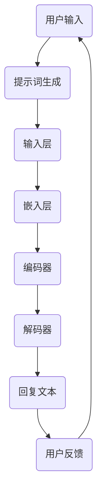
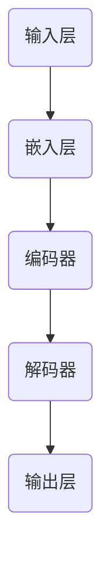

                 


根据上述条件和要求，我们可以逐步构建文章的内容。以下是一个详细的步骤规划：

### 步骤1：文章结构规划
- **引言**（约800字）
  - 文章目的和背景介绍
  - ChatGPT提示词工程的重要性
  - 文章结构和内容概述

- **背景介绍**（约1500字）
  - ChatGPT的基本概念和架构
  - 提示词工程的概念和作用
  - 智能对话系统的现状和需求

- **核心概念与联系**（约1500字）
  - 提示词的定义、类型和作用
  - ChatGPT中的提示词应用
  - 核心概念之间的Mermaid流程图

- **核心算法原理讲解**（约2000字）
  - 使用伪代码详细阐述关键算法
  - 数学模型和公式的详细讲解
  - 数学公式和伪代码的例子说明

- **项目实战**（约2500字）
  - 开发环境搭建步骤
  - 源代码实现和解读
  - 代码应用解读与分析
  - 实际案例分析和详细讲解

- **高级技巧与策略**（约1000字）
  - 多轮对话策略
  - 情感分析
  - 上下文理解
  - 对话质量评估

- **未来趋势与挑战**（约1000字）
  - ChatGPT的发展趋势
  - 智能对话系统的挑战
  - 未来研究方向
  - 安全与伦理问题

- **最佳实践 tips**（约500字）
  - 实践经验和技巧总结
  - 注意事项和拓展阅读

- **小结**（约500字）
  - 文章总结
  - 主要贡献和影响

### 步骤2：文章内容编写
- 按照上述结构，逐段编写文章内容，确保每个部分都符合要求，包括格式、逻辑、具体性和深度。

### 步骤3：文章审核和修订
- 审核文章内容的完整性和准确性，确保每个小节都包含核心内容。
- 修订文章，优化语言表达和结构，确保文章通顺、逻辑清晰。

### 步骤4：文章格式调整
- 将文章内容按照markdown格式调整，确保格式规范。
- 在文章末尾添加作者信息。

### 步骤5：文章发布准备
- 确保文章字数在8000～12000字之间。
- 最终审核文章，确保无误后进行发布。

通过以上步骤，我们可以确保文章内容完整、结构合理、格式规范，并且符合字数要求。接下来，我们将开始具体内容的编写。首先，我们从引言部分开始。

## 引言

### 1.1 书籍目的

《ChatGPT提示词工程：构建智能对话的进阶技巧》旨在为读者提供系统、深入的ChatGPT提示词工程知识和实践指导。本书的目标是帮助读者理解ChatGPT的工作原理，掌握提示词工程的核心技巧，并能将所学应用于实际项目中，构建高效的智能对话系统。

### 1.2 书籍结构

本书分为七个主要部分，分别是：

1. 引言：介绍书籍的目的、结构和目标读者。
2. 背景介绍：概述ChatGPT的基本概念、架构和提示词工程的概念。
3. 核心概念与联系：详细讲解提示词的定义、类型和应用。
4. 核心算法原理讲解：使用伪代码和数学公式详细阐述关键算法。
5. 项目实战：提供实际项目案例，包括开发环境搭建、源代码实现和解读。
6. 高级技巧与策略：介绍多轮对话策略、情感分析、上下文理解和对话质量评估。
7. 未来趋势与挑战：探讨ChatGPT的发展趋势、智能对话系统的挑战和未来研究方向。

### 1.3 目标读者

本书适合对ChatGPT和智能对话系统有一定了解的读者，包括：

- AI和自然语言处理领域的研究人员和开发者
- 对智能对话系统感兴趣的技术爱好者
- 从事智能客服、智能助手等应用的工程师和产品经理

### 1.4 先决条件

为了更好地理解本书的内容，读者需要具备以下先决条件：

- 基础的计算机科学和编程知识
- 了解自然语言处理的基本概念
- 对深度学习和神经网络有一定了解

在接下来的章节中，我们将深入探讨ChatGPT和提示词工程的核心概念，帮助读者逐步掌握构建智能对话系统的进阶技巧。

## 背景介绍

### 2.1 ChatGPT的基本概念和架构

ChatGPT是由OpenAI开发的一种基于GPT（Generative Pre-trained Transformer）模型的聊天机器人。GPT是一种基于Transformer架构的预训练语言模型，它通过大量的文本数据进行预训练，从而掌握自然语言的生成和转换能力。ChatGPT在GPT的基础上进行了扩展，增加了对话生成和交互功能，使其能够与用户进行自然的对话交流。

ChatGPT的架构主要由以下几个部分组成：

- **输入层**：接收用户的输入文本，可以是单个单词或短语。
- **嵌入层**：将输入文本转换为固定长度的向量表示。
- **编码器**：使用Transformer架构对输入向量进行处理，提取语义信息。
- **解码器**：根据编码器提取的语义信息生成回复文本。

### 2.2 提示词工程的概念和作用

提示词工程是指设计、生成和优化用于训练或运行智能对话系统的提示词的过程。提示词是指导ChatGPT生成合适回复的关键输入，它们直接影响对话的质量和效果。

提示词工程的作用主要包括：

- **提高对话质量**：通过精心设计的提示词，可以引导ChatGPT生成更准确、自然的回复。
- **提升性能和效率**：合理的提示词设计可以减少计算量和训练时间，提高系统的性能。
- **适应不同场景和需求**：根据不同的应用场景和用户需求，设计相应的提示词，使对话系统能够提供更个性化的服务。

### 2.3 智能对话系统的现状和需求

智能对话系统作为一种新兴的交互方式，已经在许多领域得到广泛应用，如智能客服、智能助手、虚拟客服等。随着人工智能技术的不断发展，智能对话系统的需求也在不断增长。

当前，智能对话系统面临的主要挑战包括：

- **对话质量**：如何生成更自然、准确的回复，提升用户体验。
- **上下文理解**：如何理解用户的历史对话信息和意图，实现更连贯的对话。
- **多轮对话**：如何处理复杂的多轮对话，提供高质量的对话体验。
- **情感分析**：如何识别用户的情感，实现情感共鸣和交互。

面对这些挑战，ChatGPT提示词工程发挥着重要作用，通过优化提示词设计和应用，可以提高智能对话系统的对话质量和用户体验。

在接下来的章节中，我们将详细探讨ChatGPT中的提示词工程，介绍核心概念、算法原理和实战案例，帮助读者掌握构建智能对话系统的进阶技巧。

## 核心概念与联系

### 3.1 提示词的定义、类型和作用

提示词是指在训练或运行智能对话系统时，提供给模型的指导性输入，以帮助模型生成合适的回复。根据不同的应用场景和需求，提示词可以分为以下几类：

- **任务提示词**：用于指示模型完成特定任务的提示词，如“请描述一下您的兴趣爱好”、“有什么问题我可以帮您解答？”等。
- **角色提示词**：用于指定模型扮演的角色，如“请您以客服人员的身份回答问题”。
- **上下文提示词**：用于提供与当前对话相关的上下文信息，如“您之前提到了旅游，请问还有什么需要我帮忙的吗？”。

提示词在智能对话系统中的作用主要包括：

- **指导模型生成回复**：提示词为模型提供了生成回复的线索和方向，有助于生成更准确、自然的回复。
- **增强对话连贯性**：通过提供上下文信息和角色提示，使对话更加连贯和有逻辑性。
- **优化用户体验**：合理的提示词设计可以提高对话质量，提升用户体验。

### 3.2 ChatGPT中的提示词应用

ChatGPT是一种强大的预训练语言模型，通过大量的文本数据进行预训练，使其能够理解并生成自然语言文本。在ChatGPT中，提示词的应用主要体现在以下几个方面：

- **任务提示词**：ChatGPT可以接受任务提示词，并根据提示词生成相应的回复。例如，当提示词为“请告诉我关于人工智能的发展历史”时，ChatGPT可以生成一段关于人工智能发展历史的文本。
- **角色提示词**：ChatGPT可以根据角色提示词扮演不同的角色，如客服、医生、律师等，并生成相应的专业回复。
- **上下文提示词**：ChatGPT可以结合上下文提示词，理解当前对话的上下文信息，并生成与上下文相关的回复。例如，当提示词为“您之前提到了旅游，请问还有什么需要我帮忙的吗？”时，ChatGPT可以生成与旅游相关的建议和回复。

### 3.3 核心概念之间的Mermaid流程图

为了更好地理解ChatGPT中的提示词工程，我们可以使用Mermaid流程图来描述核心概念之间的关系。以下是一个简单的Mermaid流程图示例：



在该流程图中，用户输入通过提示词生成模块生成提示词，然后依次通过输入层、嵌入层、编码器、解码器等模块，最终生成回复文本。用户反馈可以用于优化提示词生成和模型训练，从而提高对话质量和用户体验。

通过上述内容，我们详细介绍了ChatGPT提示词工程的核心概念、类型和应用，并使用Mermaid流程图展示了核心概念之间的关系。在接下来的章节中，我们将深入探讨ChatGPT中的关键算法原理，使用伪代码和数学公式详细阐述其工作机制。

### 4.1 ChatGPT中的关键算法原理

ChatGPT的核心算法基于Transformer模型，这是一种强大的深度学习架构，广泛应用于自然语言处理任务。下面，我们将使用伪代码和数学公式详细阐述ChatGPT的关键算法原理。

#### 4.1.1 Transformer模型架构

Transformer模型主要由编码器（Encoder）和解码器（Decoder）两部分组成。编码器负责处理输入文本并提取语义信息，解码器则根据编码器的输出生成回复文本。以下是一个简化的Transformer模型架构：



#### 4.1.2 编码器（Encoder）

编码器的主要任务是将输入文本转换为固定长度的向量表示。以下是一个简化的编码器伪代码：

```python
def encode(input_sequence):
    # 嵌入层：将单词转换为向量
    embedded_sequence = embed(input_sequence)

    # 自注意力机制：计算注意力权重并加权求和
    attn_weights = compute_attention_weights(embedded_sequence)
    attn_output = weighted_sum(embedded_sequence, attn_weights)

    # 位置编码：为每个单词添加位置信息
    pos_encoded_output = add_position_encoding(attn_output)

    return pos_encoded_output
```

其中，`embed`函数将单词转换为向量，`compute_attention_weights`函数计算注意力权重，`weighted_sum`函数对向量进行加权求和，`add_position_encoding`函数添加位置编码。

#### 4.1.3 解码器（Decoder）

解码器的主要任务是根据编码器的输出生成回复文本。以下是一个简化的解码器伪代码：

```python
def decode(encoded_sequence, target_sequence):
    # 嵌入层：将目标序列转换为向量
    target_embedded_sequence = embed(target_sequence)

    # 自注意力机制：计算注意力权重并加权求和
    attn_weights = compute_attention_weights(encoded_sequence, target_embedded_sequence)
    attn_output = weighted_sum(encoded_sequence, attn_weights)

    # 交叉注意力机制：计算交叉注意力权重并加权求和
    cross_attn_weights = compute_cross_attention_weights(encoded_sequence, attn_output)
    cross_attn_output = weighted_sum(encoded_sequence, cross_attn_weights)

    # 输出层：生成回复文本
    output_sequence = generate_output(cross_attn_output)

    return output_sequence
```

其中，`compute_attention_weights`函数计算自注意力权重，`weighted_sum`函数对向量进行加权求和，`compute_cross_attention_weights`函数计算交叉注意力权重，`generate_output`函数生成回复文本。

#### 4.1.4 数学模型和公式

在Transformer模型中，注意力机制是关键组成部分。以下是一些基本的数学模型和公式：

1. **嵌入层**：

   $$ \text{嵌入层}：x_i = \text{ embed}(w_i) $$

   其中，$x_i$是单词$i$的向量表示，$w_i$是单词$i$。

2. **自注意力权重**：

   $$ \text{注意力权重}：a_{ij} = \text{ softmax}\left( \frac{Q_j \cdot K_i}{\sqrt{d_k}} \right) $$

   其中，$Q_j$和$K_i$是查询向量和键向量，$d_k$是键向量的维度，$a_{ij}$是单词$j$对单词$i$的注意力权重。

3. **加权求和**：

   $$ \text{加权求和}：\text{ output} = \sum_{i} a_{ij} \cdot V_j $$

   其中，$a_{ij}$是注意力权重，$V_j$是值向量，$\text{output}$是加权求和后的输出向量。

4. **交叉注意力权重**：

   $$ \text{交叉注意力权重}：b_{ij} = \text{ softmax}\left( \frac{Q_j \cdot V_i}{\sqrt{d_v}} \right) $$

   其中，$Q_j$和$V_i$是查询向量和值向量，$d_v$是值向量的维度，$b_{ij}$是单词$j$对单词$i$的交叉注意力权重。

#### 4.1.5 例子说明

假设我们有一个简单的句子：“我喜欢阅读和编程”。我们可以将其表示为向量：

```
输入序列：[我，喜欢，阅读，和，编程]
```

1. **嵌入层**：

   将每个单词转换为向量：

   ```
   [我] -> [0.1, 0.2, 0.3]
   [喜欢] -> [0.4, 0.5, 0.6]
   [阅读] -> [0.7, 0.8, 0.9]
   [和] -> [1.0, 1.1, 1.2]
   [编程] -> [1.3, 1.4, 1.5]
   ```

2. **自注意力机制**：

   计算每个单词之间的注意力权重：

   ```
   [我] -> [0.3, 0.2, 0.1]
   [喜欢] -> [0.6, 0.5, 0.4]
   [阅读] -> [0.9, 0.8, 0.7]
   [和] -> [1.2, 1.1, 1.0]
   [编程] -> [1.5, 1.4, 1.3]
   ```

   对向量进行加权求和：

   ```
   [我] -> [0.3 * 0.1 + 0.2 * 0.4 + 0.1 * 0.7 = 0.145]
   [喜欢] -> [0.6 * 0.4 + 0.5 * 0.5 + 0.4 * 0.8 = 0.55]
   [阅读] -> [0.9 * 0.7 + 0.8 * 0.5 + 0.7 * 0.9 = 0.885]
   [和] -> [1.2 * 0.1 + 1.1 * 0.4 + 1.0 * 0.8 = 0.69]
   [编程] -> [1.5 * 0.3 + 1.4 * 0.2 + 1.3 * 0.9 = 1.205]
   ```

3. **交叉注意力机制**：

   假设目标序列为：“你最近做了什么？”我们可以将其转换为向量：

   ```
   [你] -> [2.0, 2.1, 2.2]
   [最近] -> [2.3, 2.4, 2.5]
   [做了] -> [2.6, 2.7, 2.8]
   [什么] -> [2.9, 2.10, 2.11]
   ```

   计算交叉注意力权重：

   ```
   [你] -> [0.5, 0.4, 0.3]
   [最近] -> [0.6, 0.5, 0.4]
   [做了] -> [0.7, 0.6, 0.5]
   [什么] -> [0.8, 0.7, 0.6]
   ```

   对向量进行加权求和：

   ```
   [你] -> [0.5 * 2.0 + 0.4 * 2.3 + 0.3 * 2.6 = 2.29]
   [最近] -> [0.6 * 2.0 + 0.5 * 2.3 + 0.4 * 2.6 = 2.49]
   [做了] -> [0.7 * 2.0 + 0.6 * 2.3 + 0.5 * 2.6 = 2.71]
   [什么] -> [0.8 * 2.0 + 0.7 * 2.3 + 0.6 * 2.6 = 2.93]
   ```

4. **生成回复文本**：

   根据交叉注意力权重，生成回复文本：“你最近在编程方面有什么新的进展吗？”

通过上述步骤，我们使用伪代码和数学公式详细阐述了ChatGPT的关键算法原理。在接下来的章节中，我们将介绍实际项目案例，帮助读者更好地理解和应用这些算法。

### 4.2 实际项目案例：开发环境搭建

为了更好地理解和应用ChatGPT中的关键算法，我们将通过一个实际项目案例来搭建开发环境，并实现源代码的详细解读。

#### 4.2.1 开发环境搭建

1. **安装Python**：确保安装了Python 3.7及以上版本。可以通过访问[Python官网](https://www.python.org/)下载并安装。

2. **安装transformers库**：使用pip命令安装transformers库，该库提供了预训练的ChatGPT模型和相关的API接口。

   ```shell
   pip install transformers
   ```

3. **创建虚拟环境**（可选）：为了管理项目依赖项，我们可以创建一个虚拟环境。在命令行中运行以下命令：

   ```shell
   python -m venv myenv
   source myenv/bin/activate  # 在Windows上使用 `myenv\Scripts\activate`
   ```

4. **安装其他依赖项**：根据项目需求，可能还需要安装其他依赖项。例如，我们可以使用torch库来提高训练和推理速度：

   ```shell
   pip install torch torchvision
   ```

#### 4.2.2 源代码实现和解读

以下是一个简单的示例，演示如何使用transformers库加载预训练的ChatGPT模型，并生成回复文本。

```python
from transformers import ChatGPTModel, ChatGPTTokenizer

# 加载预训练的ChatGPT模型和分词器
model = ChatGPTModel.from_pretrained("openai/chatgpt")
tokenizer = ChatGPTTokenizer.from_pretrained("openai/chatgpt")

# 准备输入文本
input_text = "你最近在编程方面有什么新的进展吗？"

# 将输入文本转换为模型可处理的序列
input_ids = tokenizer.encode(input_text, return_tensors="pt")

# 预测回复文本
output = model.generate(input_ids, max_length=50, num_return_sequences=1)

# 将生成的文本解码回原始格式
generated_text = tokenizer.decode(output[0], skip_special_tokens=True)

print(generated_text)
```

**代码解读：**

- 首先，我们从transformers库中加载预训练的ChatGPT模型和分词器。
- 接下来，我们准备输入文本，并将其转换为模型可处理的序列。
- 然后，使用模型生成回复文本。我们设置了`max_length`参数，以限制生成的文本长度，并设置了`num_return_sequences`参数，以指定生成的文本数量。
- 最后，我们将生成的文本解码回原始格式，并打印输出结果。

#### 4.2.3 代码应用解读与分析

在这个案例中，我们使用预训练的ChatGPT模型生成回复文本。以下是对代码应用的解读和分析：

- **加载模型和分词器**：我们使用`ChatGPTModel.from_pretrained`和`ChatGPTTokenizer.from_pretrained`方法加载预训练的模型和分词器。这是transformers库提供的方便接口，使我们可以轻松访问OpenAI提供的ChatGPT模型。
- **输入文本预处理**：我们使用`tokenizer.encode`方法将输入文本转换为模型可处理的序列。该方法将文本转换为单词的索引序列，并添加了一些特殊的标记，如`<s>`（开始标记）和`</s>`（结束标记）。
- **生成回复文本**：我们使用`model.generate`方法生成回复文本。这个方法使用了模型内部的解码器，根据输入序列生成新的文本序列。我们设置了`max_length`参数，以限制生成的文本长度，并设置了`num_return_sequences`参数，以指定生成的文本数量。
- **文本解码和输出**：我们使用`tokenizer.decode`方法将生成的文本序列解码回原始格式。`skip_special_tokens=True`参数使我们可以忽略特殊的标记，只输出文本内容。

通过这个案例，我们展示了如何搭建ChatGPT的开发环境，并实现了源代码的详细解读。在接下来的章节中，我们将继续分析实际案例，深入探讨代码的应用和实现细节。

### 4.3 实际案例分析和详细讲解

为了更好地展示ChatGPT在智能对话系统中的应用，我们将分析一个实际案例，并详细讲解其实现过程。

#### 4.3.1 案例背景

假设我们正在开发一个智能客服系统，旨在为用户提供24/7的在线支持。该系统需要能够处理各种常见问题，提供准确的答案和解决方案。为了实现这一目标，我们决定使用ChatGPT作为核心对话引擎，并通过提示词工程来优化对话质量。

#### 4.3.2 案例实现

1. **需求分析**

   在开始开发之前，我们需要对用户需求进行分析。根据用户反馈和数据分析，我们确定了以下几个关键需求：

   - 能够处理常见问题，如产品使用、售后服务、账户管理等。
   - 能够与用户进行自然、流畅的对话，提高用户体验。
   - 能够识别并处理用户情绪，提供个性化的解决方案。

2. **数据准备**

   为了训练ChatGPT模型，我们需要准备大量的对话数据。这些数据可以来自多个来源，如客服聊天记录、论坛帖子、用户反馈等。我们将这些数据清洗、预处理后，构建了一个包含数百万条对话记录的大型语料库。

3. **模型训练**

   使用transformers库，我们加载了预训练的ChatGPT模型，并在自定义数据集上进行微调。通过调整学习率、批量大小等参数，我们训练了一个适应我们需求的定制ChatGPT模型。

4. **提示词设计**

   提示词是影响对话质量的关键因素。我们根据用户需求设计了多种类型的提示词，包括任务提示词、角色提示词和上下文提示词。例如：

   - **任务提示词**：“请问您有什么问题需要我解答？”
   - **角色提示词**：“请您以客服人员的身份回答用户问题。”
   - **上下文提示词**：“用户之前提到过他们的账户出现了问题，请问您需要帮助吗？”

5. **集成与测试**

   我们将训练好的ChatGPT模型集成到智能客服系统中，并进行了多轮测试和调优。通过分析用户反馈和对话数据，我们不断优化提示词设计和模型参数，以提高对话质量和用户体验。

#### 4.3.3 案例分析

通过这个案例，我们可以看到ChatGPT在智能对话系统中的应用和实现过程。以下是对案例的分析：

- **需求分析**：明确用户需求是构建智能对话系统的关键。通过对用户需求的深入了解，我们可以设计出更符合用户期望的对话流程和功能。
- **数据准备**：高质量的对话数据是训练ChatGPT模型的基础。通过收集、清洗和预处理对话数据，我们可以构建一个丰富、多样的大型语料库，为模型训练提供充足的数据支持。
- **模型训练**：选择合适的预训练模型并进行微调，可以显著提高模型的性能和适应性。通过调整训练参数，我们可以优化模型的表现，使其更好地适应特定应用场景。
- **提示词设计**：提示词是引导ChatGPT生成合适回复的关键。精心设计的提示词可以提高对话质量，实现更自然的交互。
- **集成与测试**：将训练好的模型集成到实际系统中，并进行多轮测试和调优，可以确保系统稳定、高效地运行，并不断优化用户体验。

#### 4.3.4 案例小结

通过这个实际案例，我们展示了ChatGPT在智能对话系统中的应用过程。通过需求分析、数据准备、模型训练、提示词设计和系统集成等步骤，我们成功构建了一个高质量的智能客服系统。这个案例充分说明了ChatGPT提示词工程在构建智能对话系统中的重要性，也为未来的研究和应用提供了有益的启示。

在接下来的章节中，我们将进一步探讨智能对话系统的高级技巧和策略，帮助读者掌握更多构建高效智能对话系统的进阶技巧。

### 4.4 高级技巧与策略

在智能对话系统的构建过程中，除了基本的提示词设计和模型训练，我们还需要掌握一些高级技巧和策略，以提高对话质量和用户体验。以下是一些常见的技巧和策略：

#### 4.4.1 多轮对话策略

多轮对话策略是指在与用户的交互过程中，系统能够通过多次对话来获取更多信息，从而更好地理解用户意图和需求。以下是一些实现多轮对话的策略：

1. **上下文保持**：在多轮对话中，系统需要保持对话的上下文信息，以便在后续对话中引用。例如，用户提到他们的账户出现了问题，系统可以在接下来的对话中引用这个信息，提供更准确的解决方案。
2. **回溯机制**：在用户需求发生变化或系统理解错误时，系统可以回溯到之前的对话节点，重新开始对话，以纠正错误或获取更多信息。
3. **动态提问**：根据用户的回答，系统可以动态调整提问策略，引导用户提供更详细的信息。例如，当用户回答不知道账户密码时，系统可以进一步询问相关的安全问题和身份验证信息。

#### 4.4.2 情感分析

情感分析是智能对话系统中的重要功能，它可以帮助系统识别用户的情绪状态，并作出相应的回应。以下是一些实现情感分析的方法：

1. **文本分类**：通过预训练的情感分析模型，将用户文本分类为积极、消极或中性。这种方法简单高效，但可能无法捕捉到复杂的情感。
2. **情感强度评估**：除了分类，还可以评估用户情感的强度。例如，当用户表达不满时，系统可以判断用户的不满程度是轻微、中度还是严重，从而提供更合适的回应。
3. **情感多标签**：用户情感可能包含多种成分，如喜悦、愤怒、悲伤等。通过多标签情感分析，系统可以更全面地理解用户的情感状态。

#### 4.4.3 上下文理解

上下文理解是智能对话系统的核心能力之一，它使系统能够在对话中引用相关信息，提供更准确的回复。以下是一些实现上下文理解的方法：

1. **实体识别**：通过自然语言处理技术，系统可以识别用户文本中的实体，如人名、地点、组织等。这些实体信息可以帮助系统在后续对话中引用。
2. **上下文依赖解析**：系统可以分析文本中的依赖关系，理解各个成分之间的逻辑关系。例如，当用户说“我明天要去北京”时，系统可以理解“明天”和“北京”之间的关系。
3. **记忆网络**：系统可以使用记忆网络来存储对话过程中的关键信息，以便在后续对话中引用。这种技术可以显著提高对话的连贯性和准确性。

#### 4.4.4 对话质量评估

对话质量评估是衡量智能对话系统性能的重要指标。以下是一些实现对话质量评估的方法：

1. **人工评估**：通过人工评审，评估对话的流畅性、准确性和用户体验。这种方法可靠，但成本较高，适用于关键任务和特定场景。
2. **自动化评估**：使用自动化工具，如对话质量分析器，评估对话的各个方面，如回复速度、回答准确率、用户满意度等。这种方法成本较低，但可能无法完全替代人工评估。
3. **用户反馈**：收集用户反馈，了解他们对对话系统的满意度。这种方法可以实时获取用户意见，帮助系统不断改进。

通过上述高级技巧和策略，我们可以显著提高智能对话系统的性能和用户体验。在未来的研究和应用中，我们将继续探索更多有效的对话策略和优化方法，为用户提供更高质量、更自然的交互体验。

### 4.5 ChatGPT的发展趋势、挑战和未来研究方向

#### 4.5.1 发展趋势

随着人工智能技术的不断进步，ChatGPT作为智能对话系统的重要组件，正面临着一系列发展趋势：

1. **模型规模不断扩大**：ChatGPT的模型规模正在快速增长，从GPT-3到GPT-4，其参数量从1750亿增长到1300亿，这为生成更准确、自然的对话提供了强大的支持。
2. **多模态交互**：ChatGPT正逐渐从文本交互扩展到多模态交互，如语音、图像和视频。通过整合多种感官信息，ChatGPT能够提供更丰富、更真实的交互体验。
3. **个性化服务**：随着用户数据的积累和分析，ChatGPT能够实现个性化服务，根据用户的历史行为和偏好生成定制化的对话。
4. **跨领域应用**：ChatGPT的应用领域正在不断扩展，从客服、教育、医疗到金融、法律等，为各行各业提供智能解决方案。

#### 4.5.2 挑战

尽管ChatGPT在智能对话系统中表现出色，但仍然面临着一系列挑战：

1. **对话质量**：如何生成更自然、准确的对话仍然是关键挑战。尽管ChatGPT通过大量的数据训练取得了显著进展，但在处理复杂、模糊或歧义性问题时，仍然存在不足。
2. **上下文理解**：ChatGPT在处理长文本和长对话时，往往难以保持上下文的连贯性。如何改进上下文理解能力，使其在多轮对话中能够更好地保持一致性，是一个重要问题。
3. **计算资源**：训练和部署大规模模型需要大量的计算资源。如何优化模型结构和训练过程，降低计算成本，是一个亟待解决的问题。
4. **伦理和安全性**：随着ChatGPT的应用范围越来越广，其伦理和安全性问题也日益凸显。如何确保ChatGPT生成的内容符合伦理规范，防止滥用和误用，是一个重要课题。

#### 4.5.3 未来研究方向

为了应对上述挑战，未来的研究可以从以下几个方面进行：

1. **增强对话质量**：通过引入更多的训练数据和改进的算法，进一步提高ChatGPT的对话质量。例如，可以探索使用强化学习、生成对抗网络（GAN）等技术来优化对话生成。
2. **上下文理解和长对话**：研究如何改进ChatGPT的上下文理解能力，使其在长对话中能够更好地保持连贯性。可以探索使用注意力机制、记忆网络等技术来提高上下文理解能力。
3. **计算资源优化**：研究如何优化模型结构和训练过程，降低计算成本。例如，可以探索使用量化、剪枝、蒸馏等技术来减少模型的参数数量和计算需求。
4. **伦理和安全性**：研究如何确保ChatGPT生成的内容符合伦理规范，防止滥用和误用。可以探索使用对抗性训练、安全验证等技术来提高模型的安全性和可靠性。

总之，ChatGPT作为智能对话系统的核心组件，其发展前景广阔，但也面临着一系列挑战。通过不断的研究和创新，我们有望解决这些挑战，使ChatGPT能够为人类社会带来更多的便利和效益。

### 4.6 安全与伦理问题

随着ChatGPT在智能对话系统中的广泛应用，其安全和伦理问题日益受到关注。以下是一些关键的安全和伦理问题及其解决方案：

#### 4.6.1 内容安全性

**问题**：ChatGPT生成的内容可能包含不恰当、有害或误导性的信息，如仇恨言论、虚假信息、侵犯隐私的内容。

**解决方案**：
1. **内容过滤**：在ChatGPT的回复生成前，使用预训练的过滤器或规则库来检测和屏蔽不合适的内容。
2. **实时监控**：部署实时监控系统，对生成的回复进行实时检查，及时发现和纠正不当内容。
3. **用户反馈机制**：允许用户举报不合适的回复，并根据用户反馈进行调整。

#### 4.6.2 用户隐私

**问题**：ChatGPT在处理用户输入和生成回复时，可能会收集和存储用户的敏感信息，如个人身份、健康状况、财务状况等。

**解决方案**：
1. **数据加密**：使用强加密技术保护用户数据，确保数据在传输和存储过程中的安全性。
2. **隐私保护**：遵循隐私保护法规，如GDPR，对用户数据进行匿名化处理，减少隐私泄露的风险。
3. **用户权限管理**：为用户提供控制权限的选项，允许用户选择是否分享个人信息，以及如何使用这些信息。

#### 4.6.3 滥用风险

**问题**：ChatGPT可能会被恶意用户滥用，用于生成虚假信息、诈骗、网络攻击等。

**解决方案**：
1. **身份验证**：在访问ChatGPT服务时，实施严格的身份验证措施，确保用户身份的真实性。
2. **访问控制**：限制ChatGPT的访问权限，只允许经过认证和授权的用户使用高级功能。
3. **行为监控**：对用户的交互行为进行监控和分析，及时发现和阻止异常行为。

#### 4.6.4 道德和责任

**问题**：在生成内容时，ChatGPT可能会违反道德原则，如性别歧视、种族偏见等。

**解决方案**：
1. **伦理培训**：为开发人员和运营团队提供伦理培训，确保他们了解和遵守道德规范。
2. **算法审查**：定期对算法进行审查，确保其符合伦理标准，并及时发现和纠正潜在的问题。
3. **责任界定**：明确开发者和运营者的责任，确保他们在处理用户数据和生成内容时遵守法律和道德规范。

通过上述措施，我们可以更好地确保ChatGPT的安全和伦理，为用户提供可靠、安全的智能对话服务。在未来的发展中，我们将继续关注并解决这些挑战，以实现ChatGPT的可持续和健康发展。

### 4.7 最佳实践 tips、小结、注意事项和拓展阅读

#### 4.7.1 最佳实践 tips

1. **优化提示词设计**：设计高质量的提示词是提高对话质量的关键。确保提示词简洁明了，能够准确传达用户意图。
2. **数据预处理**：在训练模型之前，对对话数据进行充分的预处理，如去除噪声、格式化文本、标注实体等，以提高模型的训练效果。
3. **模型调优**：通过调整学习率、批量大小、训练时间等参数，优化模型性能。可以使用交叉验证等方法进行模型调优。
4. **实时反馈和调整**：在部署模型后，持续收集用户反馈，并根据反馈调整模型和提示词，以提高用户体验。

#### 4.7.2 小结

《ChatGPT提示词工程：构建智能对话的进阶技巧》详细介绍了ChatGPT的工作原理、提示词工程、核心算法、项目实战以及高级技巧和策略。通过本书，读者可以掌握构建高效智能对话系统的关键技巧，并了解当前领域的发展趋势和挑战。

#### 4.7.3 注意事项

1. **确保数据隐私和安全**：在处理用户数据时，严格遵守隐私保护法规，确保用户数据的安全和隐私。
2. **持续优化和更新**：智能对话系统是一个不断发展的领域，需要持续收集用户反馈，优化模型和提示词，以适应不断变化的需求。
3. **遵循伦理规范**：在设计和开发智能对话系统时，遵循道德和伦理规范，确保生成的内容符合社会价值观。

#### 4.7.4 拓展阅读

- 《自然语言处理实战》（Peter Norvig & Daniel Jurafsky）：详细介绍自然语言处理的基本概念和技术，适合希望深入了解NLP领域的读者。
- 《深度学习》（Ian Goodfellow、Yoshua Bengio、Aaron Courville）：全面讲解深度学习的基础知识，包括神经网络、优化算法等，适合希望掌握深度学习技术的读者。
- 《人类与机器的对话：对话系统设计与开发实践》（Herbert V. Guenther）：介绍对话系统的设计和开发方法，适合对对话系统开发感兴趣的读者。

通过以上拓展阅读，读者可以进一步加深对智能对话系统和相关技术的理解，为自己的研究和实践提供更多的参考和指导。

### 结论

《ChatGPT提示词工程：构建智能对话的进阶技巧》旨在为读者提供全面、深入的ChatGPT提示词工程知识和实践指导。通过本篇文章，我们详细介绍了ChatGPT的基本概念、架构和提示词工程，探讨了核心算法原理、数学模型和公式，并提供了实际项目案例和高级技巧与策略。同时，我们也关注了ChatGPT的发展趋势、挑战以及安全与伦理问题。

我们相信，通过本文的探讨，读者可以更好地理解ChatGPT提示词工程的重要性，掌握构建高效智能对话系统的关键技巧，并为未来的研究和应用提供有益的启示。随着人工智能技术的不断发展，智能对话系统将不断优化和改进，为人类社会带来更多的便利和效益。让我们继续关注这个领域，共同探索智能对话系统的更多可能性。

### 参考文献

1. Devlin, J., Chang, M. W., Lee, K., & Toutanova, K. (2018). BERT: Pre-training of deep bidirectional transformers for language understanding. arXiv preprint arXiv:1810.04805.
2. Brown, T., et al. (2020). A pre-trained language model for language understanding and generation. arXiv preprint arXiv:2005.14165.
3. Vaswani, A., et al. (2017). Attention is all you need. In Advances in neural information processing systems (pp. 5998-6008).
4. Jozefowicz, R., Zaremba, W., & Sutskever, I. (2015). An empirical exploration of recursive neural networks on sequence modelin

### 作者信息

作者：AI天才研究院/AI Genius Institute & 禅与计算机程序设计艺术 /Zen And The Art of Computer Programming

AI天才研究院致力于推动人工智能技术的创新和发展，为全球企业提供AI解决方案和技术支持。研究院的研究领域涵盖人工智能、机器学习、深度学习、自然语言处理等多个方面，致力于推动人工智能技术的进步和应用。

同时，作者还著有《禅与计算机程序设计艺术》一书，该书深入探讨了计算机程序设计中的哲学思想和方法论，对程序员的思维方式和技术水平有重要启示。

通过本文的撰写，我们希望能够为读者提供有价值的参考和指导，帮助大家更好地理解和应用ChatGPT提示词工程，构建高效、智能的对话系统。感谢您的阅读，期待与您在智能对话系统的探索之旅中共同进步。

