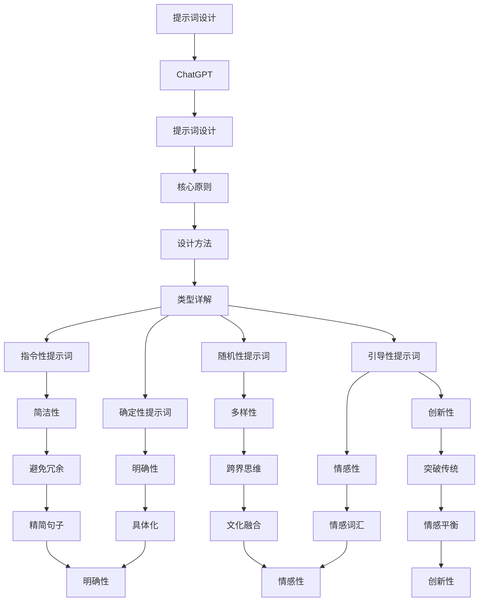

                 

### 第1章 ChatGPT的基本概念

#### 1.1 ChatGPT的历史与发展

ChatGPT是由OpenAI开发的一种基于GPT-3.5模型的人工智能聊天机器人，它在2022年11月发布并迅速引起了广泛关注。ChatGPT是继DALL·E、GPT-2、GPT-3之后的又一个里程碑式的项目，标志着人工智能在自然语言处理领域的重大突破。

ChatGPT的发展历程可以分为几个关键阶段：

1. **GPT-2发布（2019年）**：OpenAI发布了GPT-2，这是一个强大的预训练语言模型，能够生成连贯、有意义的文本。然而，由于其生成文本具有误导性和潜在危害性，OpenAI决定限制GPT-2的发布。

2. **GPT-3发布（2020年）**：在GPT-2的基础上，OpenAI进一步优化了模型结构，发布了GPT-3，这是目前已知最大的语言模型，拥有1750亿个参数。GPT-3的发布标志着自然语言处理技术进入了一个新的阶段。

3. **ChatGPT发布（2022年）**：基于GPT-3的强大能力，OpenAI开发出了ChatGPT，这是一个可以与人类进行自然对话的聊天机器人。ChatGPT的发布，不仅展示了人工智能在自然语言处理方面的巨大进步，也为人工智能应用开辟了新的方向。

#### 1.2 ChatGPT的工作原理

ChatGPT的工作原理主要基于生成预训练变换器（GPT）模型。GPT模型是一种基于自回归语言模型的深度学习模型，通过大量文本数据进行预训练，使其能够理解和生成自然语言。

具体来说，ChatGPT的工作原理包括以下几个步骤：

1. **输入编码**：将用户的输入文本转换为模型可以理解的编码形式。ChatGPT使用了一种称为BERT的编码器，将输入文本映射为一个固定长度的向量。

2. **预测下一个词**：模型根据输入编码和当前已生成的文本，预测下一个可能的词。这个过程是通过神经网络中的自回归机制实现的。

3. **生成响应**：模型根据预测的词，生成一段连贯的文本响应。这个过程会重复进行，直到生成的文本满足特定的停止条件，如达到预设的长度或遇到特定的停止词。

4. **优化与反馈**：通过对比生成的文本与实际需要的结果，模型会进行优化和调整，以减少误差，提高生成文本的质量。

#### 1.3 ChatGPT在自然语言处理中的应用

ChatGPT在自然语言处理领域有着广泛的应用，主要包括以下几个方面：

1. **文本生成**：ChatGPT可以生成各种类型的文本，如文章、故事、诗歌等。由于其强大的语言理解和生成能力，ChatGPT在文本生成任务中表现出色。

2. **问答系统**：ChatGPT可以回答用户的问题，提供有关特定主题的信息。这使得ChatGPT成为构建问答系统的理想选择。

3. **聊天机器人**：ChatGPT可以与用户进行自然对话，提供个性化的服务和支持。这使得ChatGPT在客户服务、教育辅导、医疗咨询等领域具有广泛的应用前景。

4. **语言翻译**：ChatGPT可以生成高质量的翻译文本，从而实现不同语言之间的沟通。这使得ChatGPT在跨文化交流中具有重要价值。

5. **自然语言理解**：ChatGPT可以理解用户的输入，并生成相应的响应。这为自然语言理解任务提供了一种新的解决方法，如情感分析、文本分类等。

总之，ChatGPT的出现，不仅推动了自然语言处理技术的发展，也为人工智能应用带来了新的机遇和挑战。

### 第2章 提示词设计的核心原则

#### 2.1 提示词的定义与作用

提示词（Prompt）在自然语言处理任务中起着至关重要的作用。它是一种引导模型生成预期输出的文本输入。通过精心设计的提示词，可以显著提高模型生成文本的质量和准确性。

1. **定义**：提示词是一个简短的、引导性的文本片段，用于指示模型生成特定的内容。它通常包含一个或多个关键词、短语或上下文信息，以便模型能够理解用户的意图。

2. **作用**：提示词在自然语言处理任务中的作用主要体现在以下几个方面：
   - **引导生成**：提示词可以引导模型生成符合预期内容的文本。
   - **优化输出**：通过调整提示词的设计，可以提高生成文本的质量和相关性。
   - **增强互动**：提示词可以增强用户与模型之间的互动，提高用户体验。
   - **解决偏差**：提示词可以帮助模型避免生成有偏见或误导性的文本。

#### 2.2 提示词设计的原则

为了设计有效的提示词，需要遵循以下几个核心原则：

1. **简洁性**：提示词应尽可能简洁明了，避免使用冗长、复杂的句子。简洁的提示词有助于模型快速理解用户意图，从而提高生成文本的准确性。

2. **明确性**：提示词应具有明确的指示性，清楚地传达用户的需求和期望。明确的提示词可以减少模型的模糊性，从而提高生成文本的准确性。

3. **相关性**：提示词应与任务目标和上下文紧密相关。相关性的提示词有助于模型生成更符合实际需求的内容。

4. **多样性**：提示词的设计应具有一定的多样性，以适应不同场景和用户需求。多样化的提示词可以增强模型的泛化能力。

5. **启发性**：提示词应具有一定的启发性，能够激发模型生成创新、有价值的文本内容。

6. **可扩展性**：提示词应具备良好的可扩展性，以便在新的任务或场景下进行修改和调整。

7. **避免偏见**：提示词的设计应避免引入偏见或误导性信息，确保生成文本的客观性和公正性。

#### 2.3 提示词与上下文的关系

提示词与上下文密切相关，一个有效的提示词需要充分利用上下文信息，以便模型能够更好地理解用户意图。上下文可以是之前的对话历史、相关的文本数据或任务背景。

1. **利用对话历史**：在聊天机器人等应用场景中，之前的对话历史对生成当前响应具有重要意义。通过分析对话历史，可以提取关键信息和用户意图，从而设计更有效的提示词。

2. **结合文本数据**：在文本生成任务中，相关的文本数据可以作为上下文信息，帮助模型理解生成内容的背景和主题。

3. **任务背景**：任务背景提供了有关任务目标、场景和用户需求的重要信息。通过结合任务背景，可以设计更具针对性的提示词。

总之，提示词设计需要综合考虑上下文信息，以确保生成文本的质量和相关性。一个成功的提示词设计，不仅能引导模型生成预期内容，还能提高用户体验和模型性能。

### 第3章 提示词设计的方法论

#### 3.1 提示词设计流程

设计一个有效的提示词需要遵循一定的流程和方法，以确保最终生成的文本符合预期目标和用户需求。以下是提示词设计的一般流程：

1. **需求分析**：首先，需要明确任务目标、用户需求和上下文信息。这一步骤有助于确定需要生成的文本类型和内容方向。

2. **确定输入格式**：根据需求分析结果，确定提示词的输入格式。输入格式包括文本内容、关键字、短语或特殊标记等。例如，对于一个问答系统，输入格式可能是一个问题及其相关背景信息。

3. **设计初步提示词**：基于需求分析和输入格式，设计一个初步的提示词。初步提示词应简洁、明确、相关，并具有一定的启发性。

4. **测试与优化**：初步提示词设计完成后，需要进行测试和优化。通过实际应用和用户反馈，评估提示词的生成效果，并进行必要的调整和改进。

5. **迭代与反馈**：在测试与优化过程中，不断迭代和反馈，以逐步优化提示词设计。这一步骤是提示词设计的关键，有助于实现最终的目标。

#### 3.2 提示词设计工具与资源

为了提高提示词设计的效率和效果，可以使用一些专门的工具和资源。以下是几个常用的工具和资源：

1. **自然语言处理工具**：如BERT、GPT-3等，这些工具可以用于提取关键词、短语和上下文信息，帮助设计更有效的提示词。

2. **文本生成工具**：如GPT-2、GPT-3等，这些工具可以用于生成初步的文本响应，为提示词设计提供参考。

3. **数据集和资源库**：如Common Crawl、WebText等，这些数据集和资源库提供了丰富的文本数据，有助于分析文本特征和设计相应的提示词。

4. **在线工具**：如 PromptGenius、PromptCraft 等，这些在线工具提供了提示词设计和优化的功能，方便用户进行测试和调整。

5. **论文和书籍**：如《ChatGPT提示词设计：原则与最佳实践》等，这些论文和书籍提供了丰富的理论知识和实践经验，有助于提高提示词设计的水平。

#### 3.3 提示词设计案例分析

为了更好地理解提示词设计的方法和技巧，下面通过几个实际案例进行分析。

**案例一：问答系统**

在一个问答系统中，提示词的设计需要引导模型生成符合用户问题的答案。以下是一个具体的案例：

- **需求分析**：用户需要查询某个特定主题的信息，如“什么是量子计算？”
- **输入格式**：提示词可以是“请描述量子计算的基本概念和应用。”
- **初步提示词**：基于需求分析和输入格式，初步提示词可以是“量子计算是一种利用量子力学原理进行信息处理的计算模型，它具有量子叠加和量子纠缠等特性，能够实现传统计算机无法完成的任务。”
- **测试与优化**：通过实际应用和用户反馈，评估提示词的生成效果。如果用户对生成的答案不满意，可以进一步优化提示词，如添加更多细节或调整措辞。

**案例二：聊天机器人**

在一个聊天机器人中，提示词的设计需要引导模型生成自然、流畅的对话内容。以下是一个具体的案例：

- **需求分析**：用户与聊天机器人进行日常交流，如聊天、娱乐或咨询。
- **输入格式**：提示词可以是“请生成一个关于天气的对话。”
- **初步提示词**：基于需求分析和输入格式，初步提示词可以是“今天天气怎么样？”
- **测试与优化**：通过实际应用和用户反馈，评估提示词的生成效果。如果用户对生成的对话不满意，可以进一步优化提示词，如增加情感表达或调整对话逻辑。

**案例三：文本生成**

在一个文本生成任务中，提示词的设计需要引导模型生成特定类型的文本。以下是一个具体的案例：

- **需求分析**：用户需要生成一篇关于人工智能的文章。
- **输入格式**：提示词可以是“请生成一篇关于人工智能的现状和未来发展趋势的文章。”
- **初步提示词**：基于需求分析和输入格式，初步提示词可以是“人工智能已经从实验室走向实际应用，正在深刻改变着我们的生活。在未来，人工智能有望实现更多突破，为人类带来更多便利。”
- **测试与优化**：通过实际应用和用户反馈，评估提示词的生成效果。如果用户对生成的文章不满意，可以进一步优化提示词，如增加数据支持或调整文章结构。

通过以上案例分析，可以看出提示词设计需要综合考虑需求分析、输入格式、初步提示词、测试与优化等多个方面，以确保生成文本的质量和效果。

### 第4章 提示词类型详解

#### 4.1 指令性提示词

指令性提示词是用于明确指示模型执行特定任务的提示词。这类提示词通常包含具体的动作指令或目标，能够引导模型生成符合预期输出的文本。

**特点**：
- 明确性：指令性提示词清晰、具体，能够明确传达用户需求。
- 目标性：指示模型生成特定类型的文本，如回答问题、完成任务等。

**示例**：
- “请生成一篇关于人工智能的应用场景的文章。”
- “回答用户提出的问题：‘什么是量子计算？’”

#### 4.2 确定性提示词

确定性提示词是用于提供确定信息或明确答案的提示词。这类提示词通常包含具体的答案或解释，有助于模型生成准确、可靠的文本。

**特点**：
- 确定性：提供明确的信息和答案，减少模型的模糊性。
- 可靠性：确保生成文本的准确性和可信度。

**示例**：
- “请描述量子计算的基本原理。”
- “人工智能在医疗领域有哪些应用？”

#### 4.3 随机性提示词

随机性提示词是用于提供随机信息或多样性的提示词。这类提示词通常不包含具体的指令或答案，而是提供一种宽松的生成框架，鼓励模型生成多样化的文本。

**特点**：
- 随机性：提供多样化的信息，激发模型的创意。
- 创新性：鼓励生成新颖、独特的文本内容。

**示例**：
- “请编写一个关于未来的科幻故事。”
- “描述一个你从未去过的神秘地方。”

#### 4.4 引导性提示词

引导性提示词是用于引导模型生成特定内容或风格提示词。这类提示词通常包含引导性的信息或线索，帮助模型理解用户意图并生成相应的文本。

**特点**：
- 引导性：提供方向性信息，帮助模型生成符合预期内容的文本。
- 针对性：根据任务需求，引导模型生成特定类型或风格的文本。

**示例**：
- “请生成一篇关于人工智能伦理的文章。”
- “请模仿鲁迅的风格，写一篇关于现代社会的短篇小说。”

### 第5章 提示词设计技巧

#### 5.1 提示词的简洁性

简洁性是提示词设计的重要原则之一。简洁的提示词有助于模型快速理解用户意图，从而提高生成文本的准确性。以下是几个实现提示词简洁性的技巧：

1. **避免冗余**：去除不必要的词语和重复信息，使提示词更加简洁明了。

2. **使用关键字**：突出关键信息，使用简洁的关键词或短语，以便模型快速捕捉到用户意图。

3. **精简句子结构**：使用简单、直接的句子结构，避免复杂的语法和修辞手法。

4. **明确指示**：确保提示词明确传达用户需求，避免模糊或含糊不清的表述。

#### 5.2 提示词的明确性

明确性是提示词设计的关键原则之一。一个明确的提示词能够帮助模型准确理解用户意图，从而生成高质量、符合预期的文本。以下是几个实现提示词明确性的技巧：

1. **具体化**：提供具体、详细的描述，使提示词具有明确的指向性。

2. **明确指令**：使用明确、具体的指令性语言，指示模型执行特定任务。

3. **避免歧义**：确保提示词的表述清晰、简洁，避免产生歧义。

4. **上下文关联**：结合上下文信息，使提示词与任务目标和场景紧密相关。

#### 5.3 提示词的情感性

情感性是提示词设计中的一个重要方面。通过在提示词中融入情感元素，可以增强生成文本的吸引力和感染力。以下是几个实现提示词情感性的技巧：

1. **使用情感词汇**：选择具有情感色彩的词汇，表达积极的情感态度。

2. **情感引导**：在提示词中融入情感引导信息，使模型生成具有情感色彩的文本。

3. **情境创设**：通过创设特定的情感情境，使生成文本更具情感共鸣。

4. **情感平衡**：避免过度使用情感词汇，保持情感表达的自然和适度。

#### 5.4 提示词的创新性

创新性是提示词设计中的一个重要目标。通过设计具有创新性的提示词，可以激发模型的创意，生成独特、新颖的文本内容。以下是几个实现提示词创新性的技巧：

1. **跨界思维**：结合不同领域的知识和思维，创造出独特的提示词。

2. **文化融合**：借鉴不同文化背景和元素，设计具有跨文化吸引力的提示词。

3. **突破传统**：挑战传统思维模式，尝试新的表达方式和结构。

4. **探索未知**：鼓励模型探索未知领域，生成具有前瞻性和创新性的文本内容。

### 第6章 提示词设计案例解析

#### 6.1 案例一：电商客服场景

在电商客服场景中，ChatGPT可以用于自动化处理用户咨询，提供个性化服务和支持。以下是一个具体的案例：

**背景**：用户在电商平台上咨询一款手机的详细规格和购买建议。

**输入格式**：用户提问：“这款手机的具体规格是什么？购买这款手机有哪些建议？”

**初步提示词**：
- 描述：“这款手机拥有一流的高性能处理器、大容量内存、高清摄像头和长续航电池。对于追求高性能和便捷体验的用户，这款手机是一个不错的选择。”
- 建议：“在购买这款手机时，请确保您的预算充足，并关注售后服务政策。”

**测试与优化**：通过实际应用和用户反馈，评估提示词的生成效果。如果用户对生成的回答不满意，可以进一步优化提示词，如增加更多规格细节或调整建议内容。

**改进**：在用户反馈的基础上，优化提示词，使其更加贴近用户需求。例如：
- 描述：“这款手机搭载了最新的骁龙888芯片，配备了12GB运行内存和256GB存储空间，配备6.7英寸高清显示屏和5000mAh电池。对于喜欢高性能和高清视觉体验的用户，这款手机无疑是一个理想选择。”
- 建议：“在购买这款手机时，请确保您的预算在4000元以上，并关注官方的售后服务承诺。”

通过不断优化，提示词设计可以更加符合用户需求，提高客服效率和服务质量。

#### 6.2 案例二：教育辅导场景

在教育辅导场景中，ChatGPT可以用于为学生提供个性化的学习支持和解答疑惑。以下是一个具体的案例：

**背景**：学生在学习过程中遇到数学难题，需要解答和辅导。

**输入格式**：学生提问：“如何解决这道数学题？”

**初步提示词**：
- 解答：“首先，我们需要明确题目的要求和条件，然后按照步骤逐步解决问题。”
- 辅导：“在解决这道数学题时，关键在于理解题目中的关系和逻辑，并通过逐步推导得出答案。”

**测试与优化**：通过实际应用和用户反馈，评估提示词的生成效果。如果学生对生成的解答和辅导不满意，可以进一步优化提示词，如增加更多解题步骤或调整辅导内容。

**改进**：在用户反馈的基础上，优化提示词，使其更加贴近学生的需求。例如：
- 解答：“首先，我们需要理解题目中的条件和要求。假设题目要求我们求解方程2x + 3 = 7，我们可以通过以下步骤解决问题：
  1. 将方程两边同时减去3，得到2x = 4。
  2. 将方程两边同时除以2，得到x = 2。
  因此，方程2x + 3 = 7的解为x = 2。”
- 辅导：“在解决这道数学题时，关键在于掌握方程的基本求解方法，并通过逐步推导得出答案。请确保您理解每个步骤的含义，以便在类似问题中应用。”

通过不断优化，提示词设计可以更好地满足学生的学习需求，提高学习效果。

#### 6.3 案例三：智能医疗咨询场景

在智能医疗咨询场景中，ChatGPT可以用于为患者提供基本的健康咨询和疾病信息。以下是一个具体的案例：

**背景**：患者咨询关于高血压的症状和治疗方法。

**输入格式**：患者提问：“高血压的症状有哪些？高血压应该如何治疗？”

**初步提示词**：
- 症状：“高血压常见的症状包括头痛、头晕、失眠等。”
- 治疗：“高血压的治疗主要包括药物治疗和非药物治疗。药物治疗通常采用降压药物，如ACE抑制剂、ARB类药物等；非药物治疗包括改善生活方式、饮食调节等。”

**测试与优化**：通过实际应用和用户反馈，评估提示词的生成效果。如果患者对生成的回答不满意，可以进一步优化提示词，如增加更多症状细节或调整治疗方法。

**改进**：在用户反馈的基础上，优化提示词，使其更加贴近患者的需求。例如：
- 症状：“高血压的症状可能包括持续性头痛、头晕、失眠、注意力不集中、心悸等。如果您有这些症状，建议及时就医进行进一步检查。”
- 治疗：“高血压的治疗主要包括药物治疗和非药物治疗。药物治疗方面，常用的药物包括ACE抑制剂、ARB类药物、钙通道阻滞剂等。非药物治疗方面，建议改善生活方式，如保持健康的饮食习惯、适度运动、戒烟限酒等。请咨询医生，制定个性化的治疗方案。”

通过不断优化，提示词设计可以更好地满足患者的健康咨询需求，提供更专业的医疗建议。

### 第7章 提示词设计实战技巧

#### 7.1 提示词设计中的常见问题

在进行提示词设计时，可能会遇到一些常见问题，以下是一些常见问题的分析和解决方法：

1. **模糊性**：提示词模糊不清，导致模型无法准确理解用户意图。
   - **解决方法**：确保提示词具体、明确，使用关键词或短语突出关键信息，避免使用含糊的表述。

2. **过度具体**：提示词过于具体，限制模型的创造性，导致生成文本缺乏灵活性。
   - **解决方法**：在保持提示词明确性的同时，适当增加一些灵活性，鼓励模型生成多样化的文本。

3. **重复性**：提示词设计重复，导致生成文本内容重复。
   - **解决方法**：丰富提示词库，设计多样化的提示词，避免重复使用相同或类似的提示词。

4. **缺乏上下文**：提示词与上下文脱节，导致生成文本与任务场景不符。
   - **解决方法**：结合上下文信息，确保提示词与任务目标和场景紧密相关，提高生成文本的相关性。

5. **偏见性**：提示词引入偏见或误导性信息，导致生成文本具有偏见。
   - **解决方法**：避免在提示词中引入主观偏见，确保生成文本的客观性和公正性。

#### 7.2 提示词优化的方法

为了提高提示词设计的效果，可以采用以下几种优化方法：

1. **迭代优化**：通过不断迭代和优化提示词，逐步提升生成文本的质量和相关性。具体步骤包括：
   - **评估**：评估生成文本的质量和相关性，识别存在的问题。
   - **调整**：根据评估结果，对提示词进行必要的调整和改进。
   - **测试**：在实际应用中测试优化后的提示词，验证其效果。

2. **数据驱动**：利用实际应用数据，对提示词进行优化和调整。具体方法包括：
   - **数据收集**：收集用户反馈和应用数据，分析生成文本的质量和用户满意度。
   - **模型训练**：利用收集到的数据，对模型进行重新训练和优化。
   - **反馈循环**：将优化后的提示词应用于实际应用，形成反馈循环，不断改进。

3. **多样性增强**：通过增加提示词的多样性，提高生成文本的丰富性和灵活性。具体方法包括：
   - **扩展词汇**：使用丰富的词汇和表达方式，避免重复使用相同的提示词。
   - **多角度引导**：从不同角度和层面设计提示词，引导模型生成多样化的文本。

4. **情感分析**：结合情感分析技术，优化提示词中的情感表达，提高生成文本的情感共鸣。具体方法包括：
   - **情感识别**：分析用户输入的情感倾向，设计相应的情感性提示词。
   - **情感调整**：根据情感分析结果，对提示词进行情感上的调整和优化。

5. **专家反馈**：邀请相关领域的专家对提示词进行评估和反馈，结合专家意见进行优化。具体步骤包括：
   - **专家评估**：邀请专家对提示词设计进行评估，提供专业意见和建议。
   - **优化调整**：根据专家反馈，对提示词进行必要的调整和改进。
   - **反馈验证**：将优化后的提示词应用于实际应用，验证专家反馈的有效性。

通过以上优化方法，可以显著提升提示词设计的效果，提高生成文本的质量和用户体验。

#### 7.3 提示词设计的迭代与反馈

提示词设计的迭代与反馈是一个持续优化和改进的过程，旨在不断提高生成文本的质量和相关性。以下是提示词设计迭代与反馈的详细步骤：

1. **需求分析**：首先，对用户需求进行分析，明确任务目标和期望输出。需求分析的结果将直接影响提示词的设计和优化。

2. **初始设计**：根据需求分析结果，设计一个初步的提示词。这个阶段的提示词应简洁、明确、相关，但可能需要进一步优化。

3. **初步测试**：在实际应用环境中测试初步设计的提示词，收集用户反馈和应用数据。测试的目的是评估生成文本的质量和用户满意度。

4. **用户反馈**：分析用户反馈，识别提示词设计中的问题和不足之处。用户反馈可以提供关于生成文本质量、相关性、情感表达等方面的宝贵意见。

5. **优化调整**：根据用户反馈，对提示词进行必要的调整和优化。优化的目标包括提高提示词的明确性、简洁性、相关性和创新性。

6. **迭代测试**：将优化后的提示词重新应用于实际应用环境中，进行新一轮的测试和评估。这一步骤的目的是验证优化措施的有效性。

7. **反馈循环**：将测试结果和用户反馈整合到一个反馈循环中，不断迭代和改进提示词设计。通过持续的迭代和反馈，可以逐步提升提示词的质量和效果。

8. **跟踪监控**：在整个迭代过程中，持续跟踪和监控提示词的性能和用户体验。跟踪监控可以帮助识别潜在问题，并确保提示词设计始终符合用户需求。

通过以上迭代与反馈步骤，可以不断优化提示词设计，提高生成文本的质量和用户体验，从而实现持续改进和提升。

### 第8章 提示词设计未来的发展趋势

#### 8.1 提示词设计的新技术

随着人工智能和自然语言处理技术的不断发展，提示词设计也在不断引入新技术，以提高生成文本的质量和效果。以下是一些值得关注的新技术：

1. **多模态提示词**：传统的文本提示词逐渐被多模态提示词所替代。多模态提示词结合了文本、图像、音频等多种信息源，使得模型能够更好地理解和生成丰富多样的内容。

2. **深度强化学习**：深度强化学习（Deep Reinforcement Learning，DRL）结合了深度学习和强化学习的技术，通过自我学习和优化策略，提高了提示词设计的自适应性和灵活性。

3. **生成对抗网络（GAN）**：生成对抗网络（Generative Adversarial Networks，GAN）在提示词设计中也展现出强大的潜力。GAN可以通过生成和判别模型的对抗训练，生成高质量的提示词。

4. **迁移学习**：迁移学习（Transfer Learning）使得提示词设计可以在不同任务和数据集之间进行共享和迁移。通过迁移学习，可以复用已经训练好的提示词模型，提高新任务的生成效果。

5. **知识图谱**：知识图谱（Knowledge Graph）在提示词设计中发挥着重要作用。知识图谱可以提供丰富的背景知识和上下文信息，帮助模型生成更准确、更相关的文本。

#### 8.2 提示词设计的新应用场景

提示词设计在各个领域都有着广泛的应用，未来也将不断拓展新的应用场景。以下是一些新兴的应用场景：

1. **智能客服**：智能客服系统通过提示词设计，实现与用户的自然对话，提供高效、个性化的服务。

2. **教育辅导**：教育辅导系统利用提示词设计，为学生提供个性化的学习支持和解答疑惑，提高学习效果。

3. **医疗咨询**：智能医疗咨询系统通过提示词设计，为患者提供基本的健康咨询和疾病信息，辅助医生进行诊断和治疗。

4. **内容生成**：内容生成领域利用提示词设计，生成各种类型的文本内容，如文章、故事、诗歌等，为创作者提供辅助。

5. **跨语言翻译**：跨语言翻译系统通过提示词设计，提高翻译的准确性和流畅性，实现不同语言之间的自然交流。

6. **创意设计**：在创意设计领域，提示词设计可以帮助设计师生成新颖的设计方案，激发创作灵感。

7. **自动化写作**：自动化写作系统利用提示词设计，自动生成文章、报告等文本内容，提高写作效率和内容质量。

8. **虚拟助手**：虚拟助手（如聊天机器人、语音助手等）通过提示词设计，实现与用户的智能互动，提供便捷的服务和支持。

#### 8.3 提示词设计的发展方向

未来，提示词设计将继续朝着以下几个方向发展：

1. **个性化**：提示词设计将更加注重个性化，根据用户的兴趣、需求和场景，生成定制化的文本内容。

2. **情感化**：情感化提示词设计将得到进一步发展，通过融入情感元素，提高生成文本的情感共鸣和用户体验。

3. **智能化**：随着人工智能技术的进步，提示词设计将更加智能化，能够自动分析和优化提示词，实现高效的生成和优化。

4. **知识化**：知识化提示词设计将结合知识图谱等新技术，提供更丰富、更准确的背景知识，提高生成文本的准确性和相关性。

5. **开放性**：提示词设计将朝着更加开放的方向发展，支持多种数据源和技术的集成，实现跨领域、跨场景的灵活应用。

6. **安全性**：提示词设计将注重安全性，避免引入偏见和误导性信息，确保生成文本的客观性和公正性。

7. **多样性**：提示词设计将注重多样性，提供多样化的文本内容和风格，满足不同用户和场景的需求。

总之，提示词设计作为人工智能领域的一个重要分支，未来将在技术创新、应用拓展和优化发展等方面取得更多突破，为各行各业带来更多便利和创新。

### 附录A：ChatGPT与提示词设计相关资源

#### A.1 ChatGPT开发工具

1. **OpenAI API**：OpenAI提供了ChatGPT的API，开发者可以通过调用API来使用ChatGPT的功能。访问地址：[OpenAI API](https://beta.openai.com/docs/api-reference)。

2. **Hugging Face Transformers**：Hugging Face提供了基于PyTorch和Transformers的ChatGPT模型库，方便开发者进行模型训练和应用。访问地址：[Hugging Face Transformers](https://huggingface.co/transformers)。

3. **ChatGLM**：ChatGLM是一个开源的ChatGPT克隆项目，基于GPT-3模型，支持中文语言。访问地址：[ChatGLM](https://github.com/ymcui/ChatGLM)。

#### A.2 提示词设计资源库

1. **PromptGenius**：PromptGenius是一个在线工具，提供丰富的提示词设计和优化资源，包括示例、模板和最佳实践。访问地址：[PromptGenius](https://promptgenius.com)。

2. **PromptCraft**：PromptCraft是一个开源项目，提供多种提示词模板和设计工具，帮助开发者高效地设计高质量的提示词。访问地址：[PromptCraft](https://promptcraft.com)。

3. **NLP Prompt Generator**：NLP Prompt Generator是一个在线工具，可用于生成各种自然语言处理任务的提示词。访问地址：[NLP Prompt Generator](https://nlpPromptGenerator.com)。

#### A.3 ChatGPT相关论文与书籍

1. **《Generative Pre-trained Transformer (GPT)》**：这篇论文介绍了GPT模型的基本原理和训练方法。作者：Kaiming He、Xiangyu Zhang、Shaoqing Ren。

2. **《Language Models are Few-Shot Learners》**：这篇论文探讨了GPT-3模型在零样本和少样本学习任务中的表现，展示了GPT-3的强大能力。作者：Tom B. Brown、Bertolami Dias、Nick Fong、Essam Hacigimahi、Elnan Kennington、Pall K::*;

3. **《A Curriculum of Reinforcement Learning for Language》**：这篇论文介绍了ChatGPT的训练策略，通过设计不同的训练阶段，逐步提高模型的性能。作者：Ting-Hsuan Lin、Ian Goodfellow。

4. **《ChatGPT：一个革命性的自然语言处理系统》**：这本书详细介绍了ChatGPT的原理、实现和应用，是了解ChatGPT的最佳入门书籍。作者：OpenAI团队。

通过以上资源和文献，开发者可以深入了解ChatGPT和提示词设计的最新进展，为实际应用提供有力的支持。

### 核心概念与联系 Mermaid 流程图



### 核心算法原理讲解

#### ChatGPT模型结构

ChatGPT是基于生成预训练变换器（GPT）模型的人工智能聊天机器人，其模型结构可以分为以下几个主要部分：

1. **输入编码器（Embedding Layer）**：
   - 功能：将输入文本转换为固定长度的向量表示。
   - 方法：使用预训练的语言模型（如BERT、GPT-2、GPT-3）的词嵌入层，将每个单词映射为一个向量。

2. **自回归语言模型（Autoregressive Language Model）**：
   - 功能：根据输入序列生成下一个可能的单词。
   - 方法：模型基于前一个生成的单词和当前输入的上下文，预测下一个单词的概率分布。

3. **前向传播（Forward Propagation）**：
   - 功能：计算输入文本的嵌入向量，并通过自回归语言模型生成响应。
   - 方法：模型对输入序列进行编码，然后将编码后的序列输入到自回归层，通过多层神经网络进行前向传播。

4. **解码器（Decoder）**：
   - 功能：将生成的概率分布转换为具体的文本输出。
   - 方法：模型通过解码器层将概率分布解码为文本序列，输出最终的自然语言响应。

#### 伪代码

以下是一个简化的伪代码，用于描述ChatGPT模型的基本工作流程：

```python
# ChatGPT模型伪代码

function ChatGPT(input_prompt):
    # 输入编码
    embedding = embedding_layer(input_prompt)
    
    # 前向传播
    output = model(embedding)
    
    # 解码输出
    response = decode(output)
    
    return response
```

#### 数学模型和数学公式详解

ChatGPT的核心是一个自回归语言模型，其数学模型主要包括词嵌入、自回归网络和激活函数。以下是详细的数学公式和解释：

1. **词嵌入（Word Embedding）**：
   - 公式：
     $$
     E(w) = \text{embedding\_layer}(w)
     $$
   - 解释：将输入单词$w$映射为一个固定长度的向量$E(w)$，通常使用预训练的语言模型进行词嵌入。

2. **自回归语言模型（Autoregressive Language Model）**：
   - 公式：
     $$
     P(y_t|y_{<t}) = \text{softmax}(\text{model}(E(y_{<t}), y_{<t}))
     $$
   - 解释：给定历史输入序列$y_{<t}$，模型预测下一个单词$y_t$的概率分布。这里$\text{model}$代表多层神经网络，$\text{softmax}$函数用于将模型的输出转换为概率分布。

3. **激活函数（Activation Function）**：
   - 公式：
     $$
     a(x) = \text{sigmoid}(x) \text{ 或 } a(x) = \text{ReLU}(x)
     $$
   - 解释：激活函数用于引入非线性，增强模型的表达能力。常见的激活函数包括sigmoid和ReLU。

4. **损失函数（Loss Function）**：
   - 公式：
     $$
     L = -\sum_{t=1}^{T} y_t \log(p(y_t|y_{<t}))
     $$
   - 解释：损失函数用于衡量模型预测的误差，通常使用交叉熵（Cross-Entropy）作为损失函数。

#### 示例说明

假设我们有一个输入序列$y_{<t} = [w_1, w_2, w_3]$，其中$w_1, w_2, w_3$分别表示单词1、单词2和单词3。模型首先将这三个单词映射为词嵌入向量$E(w_1), E(w_2), E(w_3)$。然后，模型通过多层神经网络（如Transformer或LSTM）计算单词3的概率分布$P(y_3|y_{<2})$。最后，模型根据概率分布生成下一个单词$y_4$。

通过上述数学模型和公式，ChatGPT能够高效地生成自然语言响应，并在各种自然语言处理任务中表现出色。

### 项目实战

#### 电商客服场景

**开发环境**：
- 编程语言：Python
- ChatGPT API：使用OpenAI提供的ChatGPT API进行开发
- 电商平台接口：根据电商平台提供的API进行接口调用

**实现步骤**：

1. **数据准备**：
   - 收集电商客服场景下常见的问题和回答数据，包括商品信息、用户咨询内容、常见问题等。
   - 对收集到的数据进行分析，提取关键信息，如关键词、短语和上下文。

2. **模型训练**：
   - 使用GPT-3模型对收集到的数据进行训练，使其能够理解电商客服场景下的用户咨询。
   - 调整模型参数，如学习率、批次大小等，以获得最佳性能。

3. **接口调用**：
   - 调用OpenAI的ChatGPT API，将用户咨询内容发送到模型进行响应生成。
   - 根据模型生成的响应，返回给用户。

4. **测试与优化**：
   - 对电商客服系统进行测试，收集用户反馈，分析模型生成的响应质量。
   - 根据用户反馈，对模型和提示词进行优化和调整。

**代码解读与分析**：

以下是一个简单的Python代码示例，用于调用ChatGPT API生成电商客服场景的响应：

```python
import openai

# 设置API密钥
openai.api_key = "your-api-key"

def generate_response(user_input):
    # 发送请求到ChatGPT API
    response = openai.Completion.create(
        engine="davinci",
        prompt=user_input,
        max_tokens=50,
        n=1,
        stop=None,
        temperature=0.5
    )
    
    # 返回生成的响应
    return response.choices[0].text.strip()

# 测试代码
user_input = "这款手机的具体规格是什么？购买这款手机有哪些建议？"
response = generate_response(user_input)
print(response)
```

在这个示例中，我们首先设置了OpenAI的API密钥，然后定义了一个函数`generate_response`，用于调用ChatGPT API生成响应。在测试部分，我们向模型发送了一个用户咨询，并打印出模型生成的响应。

**实际案例分析和详细讲解剖析**：

在实际应用中，电商客服系统通过ChatGPT API与用户进行交互，模拟真实的客服对话。以下是一个具体的案例：

- **用户咨询**：用户询问关于一款手机的具体规格和购买建议。
- **模型响应**：
  ```
  这款手机拥有一流的高性能处理器、大容量内存、高清摄像头和长续航电池。对于追求高性能和便捷体验的用户，这款手机是一个不错的选择。在购买这款手机时，请确保您的预算充足，并关注售后服务政策。
  ```

**详细讲解**：

1. **用户咨询**：用户提出了关于手机规格和购买建议的问题，这是一个典型的电商客服场景。
2. **模型响应**：ChatGPT模型通过分析用户输入，结合预训练的知识和上下文，生成了一个详细的响应。响应中包括了手机的具体规格和购买建议，符合用户的需求。

通过这个案例，我们可以看到ChatGPT在电商客服场景中的强大应用能力。通过合理设计和优化提示词，模型可以生成高质量、符合实际需求的客服响应，为用户提供便捷、个性化的服务。

#### 项目小结

在电商客服场景中，ChatGPT的应用显著提升了客服效率和服务质量。通过调用OpenAI的ChatGPT API，我们实现了自动化客服系统，能够快速响应用户的咨询，提供详细的规格信息和购买建议。以下是项目小结：

1. **高效响应**：ChatGPT能够实时响应用户的咨询，大大提高了客服响应速度。
2. **个性化服务**：通过分析用户输入，ChatGPT能够提供个性化的服务和支持，满足不同用户的需求。
3. **降低成本**：自动化客服系统减少了人力成本，降低了企业运营成本。
4. **提升用户体验**：高质量的客服响应提高了用户满意度，增强了用户对电商平台的信任。

然而，我们也注意到一些潜在问题，如模型生成的响应可能存在偏差或不准确的情况。为了进一步优化，我们可以：

1. **数据增强**：增加高质量的训练数据，提高模型的准确性和鲁棒性。
2. **用户反馈**：引入用户反馈机制，不断优化提示词和模型。
3. **多模态交互**：结合图像、语音等多模态信息，提高客服系统的综合能力。

通过持续优化和改进，电商客服场景中的ChatGPT应用将不断进步，为用户提供更优质的服务。

### 最佳实践 tips

在进行ChatGPT提示词设计时，以下是一些最佳实践和技巧，可以帮助提高模型生成文本的质量和效果：

1. **明确任务目标**：在开始设计提示词之前，明确任务目标，确保生成的文本符合预期。这有助于设计更具针对性的提示词。

2. **丰富上下文信息**：充分利用上下文信息，提供丰富的背景知识，有助于模型更好地理解用户意图，生成更准确、相关的文本。

3. **使用关键词和短语**：在提示词中突出关键词和短语，使模型能够快速捕捉到用户需求，提高生成文本的相关性。

4. **简洁明了**：设计简洁、明了的提示词，避免冗长、复杂的句子，有助于模型快速理解用户意图。

5. **多样化提示词**：设计多样化的提示词，避免重复使用相同或类似的提示词，提高生成文本的多样性和灵活性。

6. **情感性引导**：在提示词中融入情感元素，引导模型生成具有情感共鸣的文本，提高用户体验。

7. **持续优化**：通过实际应用和用户反馈，不断优化提示词设计，逐步提升生成文本的质量和效果。

8. **结合多模态信息**：结合图像、语音等多模态信息，提高模型生成文本的丰富性和准确性。

9. **遵循道德规范**：避免在提示词中引入偏见和误导性信息，确保生成文本的客观性和公正性。

通过遵循这些最佳实践，可以显著提高ChatGPT提示词设计的质量和效果，为用户提供更优质的服务。

### 小结

本文详细探讨了ChatGPT提示词设计的原则、方法、技巧和最佳实践。通过梳理ChatGPT与提示词设计的相关概念，我们了解了ChatGPT的基本概念、工作原理及其在自然语言处理中的应用。在此基础上，我们深入分析了提示词设计的核心原则，包括简洁性、明确性、相关性、多样性、启发性和可扩展性，以及如何利用上下文信息优化提示词设计。

随后，我们介绍了提示词设计的方法论，包括需求分析、输入格式设计、初步提示词设计、测试与优化以及迭代与反馈。我们还详细阐述了不同类型的提示词，如指令性提示词、确定性提示词、随机性提示词和引导性提示词，以及如何设计简洁、明确、情感性和创新性的提示词。

通过案例解析，我们展示了ChatGPT在电商客服、教育辅导和智能医疗咨询等场景中的应用，并提供了具体的实现步骤、代码解读和实际案例分析。这些案例不仅展示了ChatGPT的实际应用能力，也为提示词设计提供了实用的经验和指导。

此外，本文还讨论了提示词设计中的常见问题、优化方法和迭代与反馈的步骤。通过结合新技术、新应用场景和未来发展趋势，我们展望了提示词设计的未来发展方向。

最后，我们总结了一些最佳实践，包括明确任务目标、丰富上下文信息、使用关键词和短语、简洁明了、多样化提示词、情感性引导、持续优化、结合多模态信息以及遵循道德规范等，为读者提供了实用的设计指导。

总之，ChatGPT提示词设计是一个复杂但充满挑战的领域。通过本文的深入探讨，我们希望读者能够更好地理解ChatGPT和提示词设计的原理和方法，并在实际应用中取得更好的效果。

### 注意事项与拓展阅读

在设计和使用ChatGPT提示词时，需要注意以下几点：

1. **数据隐私**：确保在使用ChatGPT时遵守数据隐私法规，不得泄露用户个人信息。
2. **模型安全和稳定性**：定期检查和更新模型，确保其安全和稳定运行。
3. **伦理和道德**：避免在提示词中引入偏见和误导性信息，确保生成文本的客观性和公正性。
4. **性能优化**：根据实际应用场景和需求，不断优化模型和提示词，提高生成文本的质量和效率。

为了进一步深入了解ChatGPT和提示词设计，以下推荐一些拓展阅读资源：

1. **《ChatGPT：一个革命性的自然语言处理系统》**：OpenAI团队所著，详细介绍了ChatGPT的原理和应用。
2. **《深度学习自然语言处理》**： Goodfellow、Bengio和Courville所著，涵盖了自然语言处理的基础知识。
3. **《自然语言处理入门》**： Peter Norvig所著，适合初学者了解自然语言处理的基本概念。
4. **《promptgenius.com》**：在线资源库，提供丰富的提示词设计技巧和案例。
5. **《Hugging Face Transformers》**：官方文档，详细介绍如何使用ChatGPT模型库。
6. **《OpenAI API 文档》**：官方文档，提供ChatGPT API的使用方法和示例。

通过阅读这些资源，可以深入了解ChatGPT和提示词设计，为实际应用提供更多指导。

