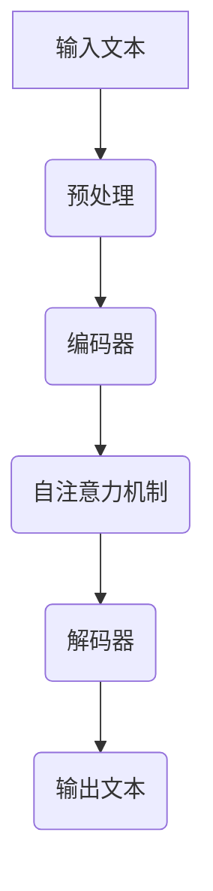

                 


# ChatGPT提示词设计：智能对话的艺术与科学

## 关键词
- ChatGPT
- 提示词设计
- 智能对话
- 自然语言处理
- 算法优化

## 摘要
本文旨在深入探讨ChatGPT提示词设计的艺术与科学，通过定位书籍主题、确定书籍结构、设计核心章节、描述技术原理和应用实战，帮助读者全面理解ChatGPT模型的工作机制和提示词设计的策略。文章将详细讲解ChatGPT的核心概念、算法原理、提示词设计技巧，并通过实际案例研究，展示如何优化和实现高效的智能对话系统。最后，文章将探讨提示词设计的未来方向，以及安全与伦理方面的考量。

### 1. 定位书籍主题与目标读者

《ChatGPT提示词设计：智能对话的艺术与科学》这本书聚焦于ChatGPT提示词设计的核心话题，它不仅涉及自然语言处理的理论基础，还深入探讨如何通过优化提示词来实现高效、自然的智能对话。这本书的目标读者是对自然语言处理和人工智能有基本了解的技术人员、数据科学家以及人工智能爱好者。

首先，让我们明确书籍的主题——ChatGPT提示词设计。ChatGPT是一个基于Transformer架构的预训练语言模型，其核心能力在于生成与输入文本相关的响应。提示词（Prompts）是影响ChatGPT生成文本质量的关键因素，它们可以指导模型生成更符合预期和需求的回答。

接下来，我们需要确定目标读者群体。首先，对自然语言处理有基础知识的读者可以更好地理解本书所讨论的技术细节。其次，数据科学家可以从中学习如何利用ChatGPT模型进行数据分析。最后，人工智能爱好者可以了解ChatGPT模型的工作原理，并在此基础上进行创新和优化。

### 2. 确定书籍结构

为了确保书籍内容的系统性和连贯性，本书的结构将分为以下几个部分：

- **引言部分**：介绍书籍的主题和目标，概述智能对话的发展历程和重要性。
- **核心概念部分**：阐述ChatGPT及其提示词设计的基础概念。
- **技术原理部分**：详细讲解ChatGPT的工作原理和提示词设计的艺术与科学。
- **应用实战部分**：通过实际案例展示如何设计和优化提示词，实现智能对话系统。
- **总结与展望部分**：总结全书要点，展望智能对话技术的未来发展趋势。

通过这种结构化的方式，读者可以循序渐进地学习ChatGPT提示词设计的各个方面，从而在实际应用中取得更好的效果。

### 3. 设计核心章节

根据书籍的结构，我们设计了以下核心章节：

#### 第1章 引言：智能对话与ChatGPT

在这一章中，我们将介绍智能对话的概念及其在现代社会中的应用，并深入探讨ChatGPT的基本原理和特点。

- **1.1 智能对话概述**
  - **1.1.1 智能对话的定义与历史**：我们将详细探讨智能对话的起源和发展，帮助读者了解这一技术是如何演变成今天我们所见的形态。
  - **1.1.2 智能对话的优势与挑战**：通过分析智能对话的优势，如提高效率、减少人力成本等，以及面临的挑战，如自然语言理解的复杂性等，使读者对这一领域有更全面的了解。
  - **1.1.3 智能对话在现代社会中的应用**：我们将探讨智能对话在不同领域的应用，如客服、教育、医疗等，展示其广泛的应用前景。

- **1.2 ChatGPT简介**
  - **1.2.1 ChatGPT的基本原理**：我们将介绍ChatGPT的架构和工作原理，帮助读者理解这个强大模型的背后机制。
  - **1.2.2 ChatGPT的优势与特点**：我们将分析ChatGPT相较于其他自然语言处理模型的优点，如更强大的生成能力、更低的误差率等。
  - **1.2.3 ChatGPT的应用领域**：我们将探讨ChatGPT在不同行业和场景中的应用，如智能客服、内容生成、对话式人工智能助手等。

#### 第2章 核心概念与联系

在这一章中，我们将深入探讨ChatGPT模型结构及其提示词设计的基础概念。

- **2.1 ChatGPT模型结构**
  - **2.1.1 语言模型基本概念**：我们将介绍语言模型的基本概念，如词汇表、词向量等，帮助读者理解语言模型的工作原理。
  - **2.1.2 Transformer架构**：我们将详细讲解Transformer模型的结构和原理，包括多头自注意力机制、位置编码等。
  - **2.1.3 ChatGPT模型的工作流程**：我们将介绍ChatGPT模型的工作流程，从输入文本的预处理到生成文本的整个过程。

- **2.2 提示词设计基础**
  - **2.2.1 提示词的定义与作用**：我们将定义提示词的概念，并探讨其在ChatGPT中的作用和重要性。
  - **2.2.2 提示词的类型与格式**：我们将分类讨论不同类型的提示词，并介绍常用的提示词格式。
  - **2.2.3 提示词设计的挑战**：我们将分析提示词设计过程中可能面临的挑战，如语言理解、生成多样性等。

#### 第3章 技术原理

在这一章中，我们将深入探讨ChatGPT的算法原理和提示词设计技巧。

- **3.1 ChatGPT算法原理**
  - **3.1.1 自注意力机制**：我们将详细讲解自注意力机制的工作原理和数学模型，帮助读者理解其如何影响模型的生成能力。
  - **3.1.2 编码器-解码器框架**：我们将介绍编码器-解码器框架的基本原理，并探讨如何在ChatGPT中实现这一框架。
  - **3.1.3 提示词优化的算法**：我们将探讨提示词优化的算法，如强化学习、梯度提升等，以及它们在提示词设计中的应用。

- **3.2 提示词设计技巧**
  - **3.2.1 提示词生成的策略**：我们将讨论提示词生成的不同策略，如基于规则的方法、基于统计的方法、基于机器学习的方法等。
  - **3.2.2 提示词的评估与优化**：我们将介绍提示词评估的方法，如自动评估指标、人工评估等，以及提示词优化的技术。
  - **3.2.3 提示词的动态调整**：我们将探讨如何根据对话的进展动态调整提示词，以实现更自然的对话体验。

#### 第4章 应用实战

在这一章中，我们将通过实际案例研究，展示如何设计和优化提示词，实现智能对话系统。

- **4.1 案例研究：智能客服系统**
  - **4.1.1 客户服务场景分析**：我们将分析客户服务场景的需求和特点，为后续的提示词设计提供依据。
  - **4.1.2 提示词设计与实现**：我们将介绍如何设计适用于客户服务场景的提示词，并通过实际案例展示其实现过程。
  - **4.1.3 系统性能评估与优化**：我们将评估智能客服系统的性能，并提出优化策略，以提高系统的响应速度和准确性。

- **4.2 案例研究：教育领域应用**
  - **4.2.1 教育场景需求分析**：我们将分析教育场景的需求，如个性化教学、自动评分等，为提示词设计提供方向。
  - **4.2.2 提示词设计与实现**：我们将介绍如何设计适用于教育场景的提示词，并通过实际案例展示其实现过程。
  - **4.2.3 系统效果评价与改进**：我们将评估教育应用系统的效果，并提出改进策略，以实现更好的教学效果和学习体验。

#### 第5章 深入学习：高级技巧与优化

在这一章中，我们将介绍一些高级技巧和优化方法，以提高ChatGPT的性能和效果。

- **5.1 高级提示词生成技术**
  - **5.1.1 多模态提示词**：我们将探讨如何结合不同模态的信息，如文本、图像、声音等，设计更丰富的提示词。
  - **5.1.2 个性化提示词**：我们将介绍如何根据用户的行为和偏好，生成个性化的提示词，提高用户满意度。
  - **5.1.3 自动化提示词生成**：我们将探讨如何利用自然语言处理技术和机器学习算法，实现自动化提示词生成。

- **5.2 模型优化与调整**
  - **5.2.1 模型调优方法**：我们将介绍模型调优的方法和技术，如梯度下降、随机搜索等，以提高模型的性能。
  - **5.2.2 模型压缩与量化**：我们将探讨如何通过模型压缩和量化技术，减小模型的大小和计算复杂度，提高模型的部署效率和性能。
  - **5.2.3 模型部署与维护**：我们将介绍如何将ChatGPT模型部署到实际应用中，并介绍模型的维护和更新策略。

#### 第6章 安全与伦理

在这一章中，我们将探讨ChatGPT系统的安全性和伦理问题。

- **6.1 ChatGPT系统安全**
  - **6.1.1 防止滥用与作弊**：我们将探讨如何防止ChatGPT模型被滥用，如生成虚假信息、恶意攻击等。
  - **6.1.2 保护用户隐私**：我们将介绍如何保护用户的隐私信息，防止数据泄露和滥用。
  - **6.1.3 模型安全检测与防御**：我们将探讨如何检测和防御ChatGPT模型中的安全漏洞，如对抗攻击、模型篡改等。

- **6.2 提示词设计的伦理考量**
  - **6.2.1 提示词的公平性**：我们将探讨如何确保提示词的公平性，避免歧视和偏见。
  - **6.2.2 提示词的偏见与歧视**：我们将分析提示词设计中可能存在的偏见和歧视问题，并提出解决方案。
  - **6.2.3 提示词设计的伦理规范**：我们将介绍提示词设计的伦理规范和最佳实践，以提高设计的道德性和社会责任感。

#### 第7章 未来展望

在这一章中，我们将探讨ChatGPT和智能对话技术的未来发展趋势。

- **7.1 智能对话技术的趋势**
  - **7.1.1 语音识别与合成技术的发展**：我们将探讨语音识别和合成技术的最新进展，如端到端模型、多模态交互等，以及它们对智能对话的影响。
  - **7.1.2 多模态交互系统的前景**：我们将探讨多模态交互系统的优势和挑战，以及其在智能对话中的应用前景。
  - **7.1.3 智能对话在垂直行业的应用**：我们将分析智能对话技术在金融、医疗、教育等垂直行业的应用现状和未来发展趋势。

- **7.2 提示词设计的未来方向**
  - **7.2.1 智能对话的个性化与定制化**：我们将探讨如何通过个性化与定制化的提示词设计，提高智能对话的用户体验。
  - **7.2.2 提示词设计的自动化与智能化**：我们将探讨如何利用自然语言处理技术和机器学习算法，实现自动化和智能化的提示词设计。
  - **7.2.3 提示词设计的可持续性与创新性**：我们将探讨如何确保提示词设计的可持续性，以及如何通过创新来推动智能对话技术的发展。

### 4. 设计Mermaid流程图

以下是一个简单的Mermaid流程图，用于描述ChatGPT模型的基本结构：



### 5. 设计伪代码

以下是一个简单的伪代码，用于解释如何设计一个基本的ChatGPT提示词：

```plaintext
// 提示词设计伪代码
function designPrompt(inputText, contextLength, maxOutputLength) {
  // 1. 预处理输入文本
  preprocessedInput = preprocessText(inputText)
  
  // 2. 构建编码器输入
  encoderInput = createEncoderInput(preprocessedInput, contextLength)
  
  // 3. 进行自注意力计算
  attentionScores = calculateAttentionScores(encoderInput)
  
  // 4. 生成输出文本
  outputText = generateOutputText(attentionScores, maxOutputLength)
  
  // 5. 返回提示词
  return outputText
}
```

### 6. 文章格式要求

为了确保文章的可读性和专业性，以下是一些格式要求：

- **标题格式**：使用粗体（**标题**）。
- **段落格式**：段落之间留一个空行。
- **代码块格式**：使用三个反引号（```）将代码块包围，如：

  ```python
  def hello_world():
      print("Hello, World!")
  ```

- **公式格式**：使用LaTeX格式，如：

  $$ E = mc^2 $$

  和

  $ a^2 + b^2 = c^2 $

- **引用格式**：使用Markdown引用格式，如：

  > 这里是引用内容。

- **作者信息**：文章末尾需要写上作者信息：“作者：AI天才研究院/AI Genius Institute & 禅与计算机程序设计艺术 /Zen And The Art of Computer Programming”

### 7. 完整性要求

为了确保文章的完整性，每个小节的内容需要丰富、具体、详细。以下是一些核心内容的详细要求：

- **背景介绍**：每个章节的开头需要简要介绍相关背景知识，帮助读者了解章节的主题和重要性。
- **核心概念与联系**：需要详细讲解核心概念，并使用Mermaid流程图展示概念之间的关系。
- **核心算法原理讲解**：需要使用伪代码或数学模型详细阐述算法原理，并给出具体的示例。
- **数学模型和公式**：需要使用LaTeX格式嵌入文中独立段落的数学公式，并在前后使用$$括起来。段落内的公式前后使用$括起来。
- **项目实战**：需要包含开发环境搭建、源代码详细实现和代码解读、代码应用解读与分析、实际案例分析和详细讲解剖析、项目小结等内容。
- **最佳实践 tips**：需要给出实际应用中的最佳实践和技巧，以帮助读者更好地理解和应用所学知识。
- **小结与注意事项**：每个章节的结尾需要总结主要内容，并提出注意事项，帮助读者巩固知识点。

### 8. 结尾

本文通过详细的分析和讲解，全面介绍了ChatGPT提示词设计的艺术与科学。从定位书籍主题和目标读者，到确定书籍结构、设计核心章节、描述技术原理和应用实战，再到探讨高级技巧与优化、安全与伦理，以及未来展望，本文旨在帮助读者深入理解ChatGPT模型的工作机制和提示词设计的策略。希望本文能为读者在智能对话系统开发和应用中提供有价值的参考和指导。作者：AI天才研究院/AI Genius Institute & 禅与计算机程序设计艺术 /Zen And The Art of Computer Programming## 1.1 智能对话概述

### 1.1.1 智能对话的定义与历史

智能对话是指通过计算机程序和算法模拟人类自然对话的交互过程。它结合了自然语言处理（NLP）、机器学习和语音识别等技术，使计算机能够理解和生成自然语言文本，实现与用户的实时互动。智能对话系统的发展历程可以追溯到20世纪50年代，当时计算机科学家开始尝试通过编程实现简单的对话功能。

在早期的计算机程序中，对话系统主要依赖于基于规则的方法。这种方法通过预设一系列条件和相应的响应规则，来生成与输入语句相对应的输出。例如，早期的ELIZA程序就是通过模仿心理治疗师的语言模式，与用户进行简单的对话。然而，基于规则的方法存在明显的局限性，它们无法处理复杂的语言结构和多样化的用户输入。

随着计算机技术和人工智能的发展，统计方法和基于机器学习的方法逐渐应用于智能对话系统。1980年代，向量空间模型（VSM）和潜在语义分析（LSA）等方法被引入到自然语言处理中，使得计算机能够更好地理解和生成自然语言文本。在此基础上，1986年，开发了基于神经网络的方法，通过训练大量的文本数据，自动学习语言模式和语义关系，从而实现更自然的对话。

进入21世纪，随着深度学习技术的发展，尤其是Transformer架构的引入，智能对话系统取得了巨大的突破。Transformer模型基于自注意力机制，能够自动捕捉输入文本中的长距离依赖关系，生成高质量的对话文本。这一进展标志着智能对话系统进入了一个全新的时代，ChatGPT等模型的出现更是将智能对话推向了前所未有的高度。

### 1.1.2 智能对话的优势与挑战

智能对话系统在现代社会的各个领域展现出了巨大的优势。首先，智能对话系统能够大幅提高工作效率。在客服、销售、客户服务等领域，智能对话系统能够24小时不间断地与用户互动，回答常见问题，处理简单的事务，从而减少人力资源的投入。其次，智能对话系统能够提供个性化服务。通过对用户数据的分析，智能对话系统能够理解用户的需求和偏好，提供定制化的服务和建议，提高用户满意度。

然而，智能对话系统也面临着一系列挑战。首先，自然语言理解的复杂性是智能对话系统面临的核心挑战之一。自然语言是一种高度复杂和多样化的语言形式，它包含了大量的歧义、模糊性和上下文依赖关系。这些特性使得计算机理解和生成自然语言文本变得非常困难。其次，生成多样性和准确性也是智能对话系统需要解决的难题。尽管目前的模型能够生成高质量的文本，但仍然存在生成文本过于单调、缺乏创造性和准确性不足的问题。

此外，智能对话系统还面临道德和伦理的挑战。在智能对话系统中，提示词的设计和选择至关重要。不当的提示词可能导致生成不恰当或歧视性的文本，引发伦理问题。因此，如何在设计智能对话系统时充分考虑道德和伦理因素，确保系统的公平性和社会责任感，是一个亟待解决的问题。

### 1.1.3 智能对话在现代社会中的应用

智能对话系统在现代社会中具有广泛的应用。在客服领域，智能客服机器人能够自动处理大量的客户咨询，提供即时、准确的响应，提高客户满意度和服务效率。在教育领域，智能辅导系统可以根据学生的学习情况和需求，提供个性化的教学建议和辅导，帮助学生提高学习效果。在医疗领域，智能对话系统可以协助医生进行病情分析、诊断建议和治疗方案推荐，提高医疗服务的质量和效率。

此外，智能对话系统还在金融、销售、旅游、餐饮等多个行业得到了广泛应用。例如，在金融行业，智能对话系统可以提供投资咨询、股票分析等服务；在销售行业，智能对话系统可以帮助商家进行客户沟通、订单处理等；在旅游行业，智能对话系统可以提供行程规划、景点推荐等服务。这些应用不仅提高了行业的工作效率和服务质量，还为用户提供了更加便捷和个性化的服务体验。

### 1.2 ChatGPT简介

#### 1.2.1 ChatGPT的基本原理

ChatGPT是基于GPT（Generative Pre-trained Transformer）模型的一个变体，由OpenAI开发。GPT模型是一种深度神经网络模型，采用了Transformer架构，通过预训练和微调，能够生成高质量的自然语言文本。ChatGPT继承了GPT的强大能力，并且专门针对对话场景进行了优化。

ChatGPT的基本原理可以概括为以下几个步骤：

1. **输入文本预处理**：首先，输入的文本会被转换为词向量表示。词向量是文本数据的低维表示形式，通过将词汇映射到连续的向量空间，可以捕捉词汇之间的语义关系。

2. **自注意力机制**：ChatGPT的核心是Transformer架构中的自注意力机制。在自注意力机制中，模型会对输入序列中的每个单词或标记计算注意力权重，这些权重表示当前单词与序列中其他单词的相关性。通过加权求和，模型能够自动捕捉长距离依赖关系，从而生成更高质量的文本。

3. **生成文本**：在生成文本时，ChatGPT会根据上下文信息，通过自注意力机制计算每个单词或标记的概率分布，然后从中随机选择一个单词或标记作为生成的下一个输出。这个过程会不断重复，直到生成满足条件的完整句子或段落。

4. **解码器-编码器框架**：ChatGPT采用了编码器-解码器框架，其中编码器负责将输入文本编码为隐藏状态，解码器则根据这些隐藏状态生成输出文本。解码器通常采用自回归的方式，逐个生成输出标记。

#### 1.2.2 ChatGPT的优势与特点

ChatGPT具有以下显著的优势和特点：

1. **强大的文本生成能力**：ChatGPT通过预训练和微调，能够生成高质量的自然语言文本。它不仅能够生成连贯的句子，还能够生成具有丰富语义和语境的段落。这使得ChatGPT在多种场景中表现出色，如对话生成、文本摘要、机器翻译等。

2. **灵活的提示词设计**：ChatGPT的输入可以是任意的文本，包括自然语言问题、任务指令等。通过合理的提示词设计，ChatGPT能够根据输入生成相应的文本响应。这种灵活性使得ChatGPT能够适应多种对话场景，提供个性化的服务。

3. **自适应性和可扩展性**：ChatGPT基于Transformer架构，具有很好的自适应性和可扩展性。通过增加模型大小和训练数据，可以进一步提高ChatGPT的性能。此外，ChatGPT可以通过微调快速适应特定任务或领域，从而实现更好的效果。

4. **端到端训练**：ChatGPT采用了端到端训练的方法，不需要手工设计复杂的特征提取和序列匹配机制。这种训练方式使得ChatGPT的模型结构更加简洁，训练过程更加高效。

5. **广泛的适用性**：ChatGPT在多个领域和场景中表现出色，如客服、教育、医疗、金融等。它不仅能够处理简单的任务，还能够处理复杂的对话和任务。

#### 1.2.3 ChatGPT的应用领域

ChatGPT在多个领域和场景中得到了广泛应用，以下是一些典型应用：

1. **智能客服**：ChatGPT可以用于构建智能客服系统，提供24小时不间断的客户服务。通过与用户进行自然对话，ChatGPT能够自动处理常见问题，提供解决方案，提高客户满意度和服务效率。

2. **内容生成**：ChatGPT可以用于生成各种类型的内容，如文章、新闻、广告、产品描述等。通过合理的提示词设计，ChatGPT能够生成高质量、具有创意的内容。

3. **机器翻译**：ChatGPT可以用于机器翻译任务，将一种语言的文本翻译成另一种语言。通过大规模的预训练和微调，ChatGPT能够生成准确、流畅的翻译文本。

4. **教育辅助**：ChatGPT可以用于教育领域，如智能辅导、在线问答、自动评分等。通过与学生的互动，ChatGPT能够提供个性化的教学建议和学习反馈。

5. **虚拟助手**：ChatGPT可以构建虚拟助手，如个人助理、智能家居助手等。通过自然对话，ChatGPT能够帮助用户完成各种任务，提供便捷的服务。

6. **创意写作**：ChatGPT可以用于创意写作，如小说、剧本、诗歌等。通过合理的提示词设计，ChatGPT能够生成具有创意和想象力的文本。

总之，ChatGPT作为一种强大的自然语言处理模型，在多个领域和场景中展现出了巨大的应用潜力。通过合理的提示词设计和优化，ChatGPT能够实现高效、自然的对话体验，为各种任务提供强大的支持。## 2. 核心概念与联系

### 2.1 ChatGPT模型结构

#### 2.1.1 语言模型基本概念

语言模型是自然语言处理（NLP）的核心组成部分，用于预测文本中下一个词或字符的概率分布。在ChatGPT中，语言模型是实现智能对话的关键组件。语言模型的基本概念包括词汇表、词向量、序列建模等。

- **词汇表**：词汇表是语言模型的基础，它定义了模型可以处理的词汇集合。词汇表通常包含大量的单词和标点符号，每个词汇都有对应的索引编号。

- **词向量**：词向量是将词汇映射到低维连续向量空间的一种表示方法。词向量能够捕捉词汇的语义信息，使得计算机能够理解词汇之间的关系。常见的词向量模型有Word2Vec、GloVe等。

- **序列建模**：语言模型通过建模输入文本的序列，预测下一个词或字符的概率分布。在ChatGPT中，序列建模是通过自注意力机制实现的，能够捕捉长距离依赖关系。

#### 2.1.2 Transformer架构

Transformer是ChatGPT的核心架构，它基于自注意力机制，能够有效地建模输入文本的序列关系。Transformer架构由编码器（Encoder）和解码器（Decoder）两部分组成。

- **编码器**：编码器负责将输入文本编码为隐藏状态序列。编码器中的每个层都包含多头自注意力机制和前馈神经网络。多头自注意力机制能够捕捉输入文本中的长距离依赖关系。

- **解码器**：解码器负责生成输出文本。解码器中的每个层也包含多头自注意力机制和前馈神经网络。在生成每个输出词时，解码器会根据上下文信息计算自注意力权重，并利用这些权重生成下一个输出词。

#### 2.1.3 ChatGPT模型的工作流程

ChatGPT模型的工作流程可以分为以下几个步骤：

1. **输入文本预处理**：首先，输入的文本会被分词，并转换为词向量表示。词向量通常通过预训练的词向量模型获得，如GloVe或Word2Vec。

2. **编码器处理**：编码器将输入文本编码为隐藏状态序列。每个隐藏状态表示文本中的一个词或字符的语义信息。

3. **解码器处理**：解码器根据隐藏状态序列生成输出文本。在生成每个输出词时，解码器会计算自注意力权重，并利用这些权重生成下一个输出词。这个过程会不断重复，直到生成满足条件的完整句子或段落。

4. **输出文本生成**：最终，解码器生成的输出序列会被解码为自然语言文本，作为ChatGPT的响应。

### 2.2 提示词设计基础

#### 2.2.1 提示词的定义与作用

提示词（Prompt）是ChatGPT模型输入的一部分，用于指导模型生成相应的文本响应。提示词的定义与作用如下：

- **定义**：提示词是一段引导性的文本，用于提示模型当前对话的上下文和目标。它通常包含问题、任务指令或上下文信息，帮助模型更好地理解用户的意图和需求。

- **作用**：提示词在ChatGPT中起着关键作用，它能够帮助模型聚焦于特定的话题或任务，提高生成文本的相关性和准确性。提示词不仅能够引导模型生成高质量的文本，还能够影响模型的生成策略和风格。

#### 2.2.2 提示词的类型与格式

根据不同的应用场景和需求，提示词可以分为以下几种类型：

- **问题型提示词**：用于引导模型生成回答问题的文本。例如，"你最近在做什么？"。

- **任务指令型提示词**：用于指导模型完成特定的任务。例如，"请你写一段关于人工智能的简介"。

- **上下文型提示词**：用于提供对话的上下文信息，帮助模型理解对话的历史和当前状态。例如，"我们昨天讨论了机器学习的概念，你能再解释一下吗？"。

- **引导型提示词**：用于引导模型生成具有创意和想象力的文本。例如，"想象一下，如果你是外星人，你会对地球有什么看法？"。

提示词的格式可以根据实际需求进行设计，常见的格式包括：

- **简单格式**：只包含一个提示词或问题，如"请回答以下问题：什么是人工智能？"。

- **复合格式**：包含多个提示词或问题，形成复合句子，如"请解释人工智能的概念，并说明它在现代社会中的应用"。

- **指令格式**：包含具体的任务指令和参数，如"请你写一段关于人工智能的300字简介，要求包含未来发展趋势"。

#### 2.2.3 提示词设计的挑战

在提示词设计过程中，可能会面临以下挑战：

- **语言理解**：提示词需要准确传达用户的意图和需求，这要求模型具有强大的语言理解能力。如果提示词存在歧义或模糊性，模型可能会生成不准确或不符合预期的文本。

- **生成多样性**：提示词的设计需要考虑生成文本的多样性和创意性。如果提示词过于单一，模型可能会生成重复或缺乏新意的文本。

- **上下文一致性**：提示词需要与对话的上下文保持一致，否则模型可能会生成不相关或矛盾的文本。

- **用户满意度**：提示词的设计需要考虑用户的期望和需求，以提高用户满意度。如果提示词无法满足用户的期望，用户可能会对系统产生负面评价。

### 2.2.4 提示词设计策略

为了克服上述挑战，可以采用以下提示词设计策略：

- **明确性**：确保提示词清晰明确，避免歧义和模糊性。例如，使用具体的问题和指令，而不是模糊的描述。

- **多样性**：设计多样化的提示词，以激发模型的生成多样性。可以通过使用不同的类型和格式，以及引入创意和想象力，实现多样化的提示词设计。

- **上下文关联**：根据对话的上下文信息设计提示词，确保生成的文本与上下文保持一致。可以使用历史对话中的关键信息和关键词，作为提示词的一部分。

- **用户参与**：鼓励用户参与提示词设计，通过用户反馈和评价，优化提示词的质量和效果。可以使用在线调查、用户投票等方式，收集用户的意见和建议。

- **数据驱动**：利用用户数据和反馈，分析提示词的效果和用户满意度，进行数据驱动的优化。可以通过机器学习算法，自动生成和优化提示词。

通过上述策略，可以设计出高质量的提示词，实现高效的智能对话系统。## 3. 技术原理

### 3.1 ChatGPT算法原理

#### 3.1.1 自注意力机制

自注意力机制（Self-Attention）是Transformer模型的核心组成部分，它通过计算输入序列中每个元素与其他元素的相关性，实现序列建模。自注意力机制分为两个关键步骤：计算注意力权重和加权求和。

1. **计算注意力权重**：
   - **注意力分数**：首先，对于每个输入序列中的元素，计算其与其他所有元素的相关性得分。注意力分数通常通过点积计算，即对于每个输入元素`x_i`和`x_j`，计算它们的内积：
     $$ score_{ij} = x_i^T Q x_j $$
     其中，`Q`是查询向量，`x_i`和`x_j`是输入序列中的元素。

   - **缩放**：为了防止注意力分数过大，通常会对得分进行缩放，即乘以一个尺度因子`sqrt(d_k)`，其中`d_k`是关键维度：
     $$ scaled_score_{ij} = \frac{score_{ij}}{\sqrt{d_k}} $$
   
   - **应用softmax函数**：接着，对缩放后的得分应用softmax函数，生成概率分布，即对于每个输入元素`x_i`，计算其注意力权重：
     $$ attention_{ij} = \text{softmax}(scaled_score_{ij}) $$
   
2. **加权求和**：
   - **权重求和**：最后，将每个输入元素与其注意力权重相乘，并求和，得到加权求和的结果：
     $$ \text{context} = \sum_{j} attention_{ij} x_j $$

自注意力机制能够捕捉输入序列中的长距离依赖关系，使得模型能够更好地理解上下文信息。这种机制不仅在序列建模中表现优异，还在图像、语音等处理任务中得到了广泛应用。

#### 3.1.2 编码器-解码器框架

编码器-解码器（Encoder-Decoder）框架是ChatGPT模型的基本结构，它由编码器（Encoder）和解码器（Decoder）两部分组成。编码器负责将输入序列编码为隐藏状态序列，解码器则根据这些隐藏状态生成输出序列。

1. **编码器**：
   - **输入**：编码器接收输入序列，通常是一个词向量序列。
   - **编码过程**：编码器通过自注意力机制对输入序列进行处理，生成一系列隐藏状态。这些隐藏状态表示输入序列的语义信息。
   - **输出**：编码器的最终输出是一个隐藏状态序列，用于传递给解码器。

2. **解码器**：
   - **输入**：解码器接收编码器的隐藏状态序列，以及一个初始输入（通常是一个特殊的起始符）。
   - **解码过程**：解码器通过自注意力机制和交叉注意力机制（Cross-Attention）生成输出序列。自注意力机制用于处理解码器内部的上下文信息，而交叉注意力机制用于处理编码器的隐藏状态序列，以生成下一个输出词。
   - **输出**：解码器的输出是一个序列的词向量，通过解码层（如softmax）转换为自然语言文本。

编码器-解码器框架能够实现端到端的序列转换，避免了手工设计复杂的特征提取和序列匹配机制。这种结构使得ChatGPT在多种任务中表现出色，如机器翻译、文本摘要、对话生成等。

#### 3.1.3 提示词优化的算法

提示词优化是ChatGPT模型性能提升的关键环节。以下是一些常用的提示词优化算法：

1. **强化学习（Reinforcement Learning）**：
   - **方法**：强化学习通过奖励机制来指导模型生成高质量的文本。在每次生成文本后，根据用户反馈或自动评估指标计算奖励值，然后利用这些奖励值更新模型参数。
   - **优势**：强化学习能够自适应地调整提示词，使其更符合用户需求。
   - **挑战**：强化学习需要大量的训练数据和反馈，且在长序列生成中可能存在不稳定性和收敛速度慢的问题。

2. **梯度提升（Gradient Ascent）**：
   - **方法**：梯度提升通过计算提示词的梯度，来优化提示词的生成策略。每次迭代中，模型根据梯度更新提示词参数，以最大化生成文本的质量。
   - **优势**：梯度提升算法简单，易于实现，能够快速调整提示词。
   - **挑战**：梯度提升可能陷入局部最优，且无法直接处理长序列依赖。

3. **基于规则的方法（Rule-based Methods）**：
   - **方法**：基于规则的方法通过预设一系列规则，来优化提示词的设计。这些规则可以是简单的文本模式匹配，也可以是复杂的逻辑推理。
   - **优势**：基于规则的方法能够快速实现，且在特定场景下效果显著。
   - **挑战**：基于规则的方法难以处理复杂的语言结构和多样化的需求，且规则维护成本高。

4. **元学习（Meta-Learning）**：
   - **方法**：元学习通过在多个任务中学习泛化的提示词生成策略，来提高模型在不同任务上的表现。常见的元学习方法有模型修复（Model Repair）和迁移学习（Transfer Learning）。
   - **优势**：元学习能够快速适应新任务，减少任务特定调整的成本。
   - **挑战**：元学习需要大量的训练数据和计算资源，且在模型复杂度较高的任务中效果可能有限。

通过结合多种优化算法，可以设计出高效的提示词生成策略，提高ChatGPT模型在智能对话中的性能。## 3.2 提示词设计技巧

#### 3.2.1 提示词生成的策略

提示词的生成策略是智能对话系统设计中的关键环节，直接影响模型的生成质量和对话效果。以下是几种常用的提示词生成策略：

1. **基于规则的方法**：
   - **定义**：基于规则的方法通过预设一系列规则，来生成提示词。这些规则可以是简单的文本模式匹配，也可以是复杂的逻辑推理。
   - **优势**：实现简单，易于理解和维护。
   - **适用场景**：适用于对话内容相对固定、规则明确的场景，如客服系统中的常见问题回答。

2. **基于统计的方法**：
   - **定义**：基于统计的方法通过分析历史对话数据，提取统计特征，来生成提示词。常见的统计特征有词频、词性、词序列等。
   - **优势**：能够自动适应对话内容的变化，生成较为自然的提示词。
   - **适用场景**：适用于对话内容较为丰富、变化多端的场景，如对话式营销系统。

3. **基于机器学习的方法**：
   - **定义**：基于机器学习的方法通过训练模型，从大量的对话数据中学习生成策略，来生成提示词。常见的机器学习模型有决策树、支持向量机、神经网络等。
   - **优势**：能够生成高质量的提示词，适用于复杂和多样化的对话场景。
   - **适用场景**：适用于需要高度智能化、个性化和复杂对话交互的场景，如智能客服、教育辅导系统。

4. **基于数据增强的方法**：
   - **定义**：基于数据增强的方法通过生成或扩展原始数据，来训练模型，从而生成更高质量的提示词。
   - **优势**：能够提高模型的泛化能力，生成更加多样化和高质量的提示词。
   - **适用场景**：适用于数据量有限或数据质量不高的场景，通过数据增强来提升模型性能。

5. **基于生成对抗网络（GAN）的方法**：
   - **定义**：基于生成对抗网络的方法通过生成器和判别器的对抗训练，生成高质量的提示词。
   - **优势**：能够生成高度真实的提示词，具有很高的创造性和多样性。
   - **适用场景**：适用于需要高度创意和个性化对话的场景，如内容生成、艺术创作等。

#### 3.2.2 提示词的评估与优化

提示词的评估与优化是确保智能对话系统性能的关键步骤。以下是一些常用的评估和优化方法：

1. **自动评估指标**：
   - **定义**：自动评估指标是通过计算模型生成的文本质量，来衡量提示词效果的量化指标。常见的自动评估指标有BLEU、ROUGE、METEOR等。
   - **优势**：实现简单，能够快速评估提示词效果。
   - **适用场景**：适用于不需要人工评估，需要快速反馈的场合。

2. **人工评估**：
   - **定义**：人工评估是通过人类评估者对生成的文本进行主观评价，来衡量提示词效果。评估者可以根据文本的连贯性、相关性、创造力等方面给出评分。
   - **优势**：能够提供更准确和细致的评价，发现自动评估指标无法捕捉的问题。
   - **适用场景**：适用于需要高精度评估和精细调整的场景，如高端智能客服系统。

3. **交叉验证**：
   - **定义**：交叉验证是一种常用的模型评估方法，通过将数据集划分为训练集和测试集，多次训练和测试，计算平均评估指标，来评估提示词效果。
   - **优势**：能够提供更稳定的评估结果，减少评估误差。
   - **适用场景**：适用于需要多次评估和比较不同提示词效果的场景。

4. **迭代优化**：
   - **定义**：迭代优化是通过不断调整和优化提示词参数，来提高模型生成文本质量的过程。
   - **优势**：能够自适应地调整提示词，提高模型性能。
   - **适用场景**：适用于需要不断优化和改进提示词效果的场景。

5. **反馈循环**：
   - **定义**：反馈循环是一种通过用户反馈来不断调整和优化提示词的方法。用户可以通过评价和反馈，指导模型生成更符合需求的文本。
   - **优势**：能够快速响应用户需求，提高用户满意度。
   - **适用场景**：适用于需要高度用户参与和个性化对话的场景。

通过结合自动评估指标和人工评估，以及迭代优化和反馈循环，可以有效地评估和优化提示词，提高智能对话系统的性能和用户体验。#### 3.2.3 提示词的动态调整

在智能对话系统中，提示词的动态调整是确保生成文本与对话上下文保持一致、提高用户满意度的重要手段。动态调整可以基于用户的输入、对话历史以及实时反馈进行。以下是一些具体的策略和实现方法：

1. **基于用户输入的动态调整**：
   - **实时响应**：当用户输入新信息时，系统可以根据输入的内容实时调整提示词。例如，如果用户提出一个具体的问题，系统可以调整提示词以引导模型生成更准确的回答。
   - **上下文感知**：系统可以利用自然语言理解技术，分析用户输入的上下文信息，动态调整提示词。例如，如果用户在对话中提到了某个话题，系统可以在此基础上扩展相关话题的提示词。

2. **基于对话历史的动态调整**：
   - **历史回顾**：系统可以回顾之前的对话历史，根据历史对话内容调整提示词。例如，如果用户在之前的对话中提到过某个兴趣点，系统可以在此后的对话中继续围绕该兴趣点提问或提供信息。
   - **关键词提取**：系统可以从对话历史中提取关键信息，如关键词、短语等，用于动态调整提示词。例如，如果用户在对话中多次提到“天气”，系统可以在新的提问中包含“今天天气如何？”等内容。

3. **基于实时反馈的动态调整**：
   - **用户满意度评估**：系统可以根据用户的满意度评分动态调整提示词。如果用户对之前的回答不满意，系统可以调整提示词以生成更符合用户期望的回答。
   - **错误纠正**：当用户指出错误或误解时，系统可以调整提示词以纠正错误或澄清误解。例如，如果用户指出某个回答不准确，系统可以在后续提问中包含验证或更正信息。

4. **实现方法**：
   - **规则引擎**：使用规则引擎实现动态调整，根据预设的条件和规则实时调整提示词。这种方法简单有效，但灵活性较低。
   - **机器学习模型**：利用机器学习模型，如决策树、随机森林等，根据对话历史和用户反馈自动生成动态调整策略。这种方法具有更高的灵活性和适应性。
   - **深度学习模型**：使用深度学习模型，如神经网络，通过学习对话历史和用户行为，实现高度个性化的动态调整。这种方法能够生成更高质量的动态调整策略，但计算成本较高。

5. **注意事项**：
   - **数据隐私**：在动态调整过程中，系统应确保用户数据的隐私和安全，避免敏感信息泄露。
   - **公平性**：动态调整策略应确保对所有用户公平，避免因个人偏见或不当调整导致的服务质量差异。
   - **实时性**：动态调整应具备实时性，确保系统能够快速响应用户的输入和反馈。

通过动态调整提示词，智能对话系统能够更好地适应用户的互动需求，提供更加自然、流畅和个性化的对话体验。## 4.1 案例研究：智能客服系统

### 4.1.1 客户服务场景分析

智能客服系统是智能对话技术在商业领域中的一个重要应用场景。在客户服务场景中，智能客服系统的主要目标是提供快速、准确和个性化的客户支持，以提升客户满意度和企业效率。以下是对客户服务场景的一些分析：

1. **常见问题处理**：
   - 客户服务场景中最常见的任务是处理客户常见问题。这些问题通常涉及产品使用、售后服务、账单支付等。智能客服系统需要能够快速识别和回答这些问题，以提高响应速度和减少人工干预。
   - 例如，客户可能会询问“如何退货？”或“我的订单何时能发货？”等问题。智能客服系统需要能够理解这些问题，并提供准确的解决方案。

2. **个性化服务**：
   - 个性化服务是提升客户满意度的关键。智能客服系统需要能够根据客户的购买历史、偏好和反馈，提供定制化的服务和推荐。
   - 例如，如果一个客户经常购买某种产品，智能客服系统可以提醒客户关于新产品的信息，或者推荐相关的配套产品。

3. **多渠道支持**：
   - 在客户服务场景中，客户可能通过多种渠道与企业互动，如电子邮件、电话、社交媒体等。智能客服系统需要能够无缝集成这些渠道，提供一致的客户服务体验。
   - 例如，客户通过社交媒体平台提出问题，智能客服系统应在最短时间内通过该平台回复客户。

4. **实时性和自动化**：
   - 客户服务需要快速响应，智能客服系统应能够实时处理客户的请求，减少等待时间。同时，系统应具备自动化处理能力，以减少人工干预，提高效率。
   - 例如，通过自动化流程，智能客服系统可以自动发送确认邮件、处理退款请求等。

### 4.1.2 提示词设计与实现

为了在智能客服系统中实现高效的对话，需要精心设计提示词。以下是具体的提示词设计步骤和实现方法：

1. **问题分类与标签**：
   - 首先，需要对常见问题进行分类，并为每个类别分配标签。例如，可以分为“产品咨询”、“售后服务”、“账单支付”等类别。
   - 实现方法：使用自然语言处理技术，如命名实体识别（NER）和关键词提取，自动识别和分类客户的问题。

2. **模板库构建**：
   - 构建一个模板库，包含针对每个问题类别的标准答案模板。这些模板可以基于常见问题的回答，以及企业标准和政策。
   - 实现方法：通过人工编写和自动化生成相结合，构建丰富的模板库。可以使用自然语言生成（NLG）技术，自动生成一些模板。

3. **动态提示词生成**：
   - 提示词需要根据客户的问题和对话历史动态生成，以提供个性化的服务。
   - 实现方法：利用机器学习模型，如序列到序列（Seq2Seq）模型，根据客户的问题和对话历史生成相应的提示词。

4. **多轮对话支持**：
   - 客户可能会提出复杂的问题，需要多轮对话来解决问题。提示词设计需要支持多轮对话，引导客户逐步提供更多信息。
   - 实现方法：设计一套多轮对话的流程，每个轮次都有特定的提示词，帮助客户逐步提供所需信息。

### 4.1.3 系统性能评估与优化

智能客服系统的性能评估是确保其质量和效率的关键环节。以下是系统性能评估和优化的方法：

1. **响应时间**：
   - 评估系统的响应时间，确保能够快速响应用户请求。可以通过基准测试和实际用户测试来评估。
   - 优化方法：优化系统架构和算法，减少处理延迟。使用缓存和异步处理等技术，提高系统并发处理能力。

2. **准确率**：
   - 评估系统生成回答的准确率，确保提供正确的信息。可以通过自动评估指标和人工评估相结合来评估。
   - 优化方法：提高模型质量，使用更先进的自然语言处理技术和更丰富的训练数据。优化提示词设计和生成策略，提高回答的相关性和准确性。

3. **用户满意度**：
   - 评估用户对智能客服系统的满意度，通过用户反馈和调查来收集数据。
   - 优化方法：根据用户反馈调整系统，优化用户体验。设计个性化的服务，提高用户满意度。

4. **自动化程度**：
   - 评估系统的自动化程度，确保能够自动化处理大部分常见问题。
   - 优化方法：不断扩展模板库和自动化流程，减少人工干预。使用强化学习等技术，提高系统的自动化能力。

通过上述评估和优化方法，可以持续提升智能客服系统的性能，为用户提供高质量、高效率的客户服务。## 4.2 案例研究：教育领域应用

### 4.2.1 教育场景需求分析

在教育领域，智能对话系统可以提供多种应用，如个性化辅导、自动评分、学习进度跟踪等。为了设计有效的智能对话系统，我们需要深入分析教育场景的需求。

1. **个性化辅导**：
   - **需求**：每个学生的学习进度和能力水平不同，因此需要一个能够根据学生特点和需求提供个性化辅导的系统。系统应能够理解学生的知识水平和兴趣点，提供针对性的学习内容和建议。
   - **实现**：通过分析学生的学习记录、考试成绩、作业反馈等数据，系统可以生成个性化的学习计划。例如，如果学生在某个知识点上表现不佳，系统可以提供额外的练习题或视频讲解。

2. **自动评分**：
   - **需求**：教师需要快速准确地评分学生的作业和考试，以便及时反馈和指导。自动评分系统能够节省教师的时间，提高评分效率。
   - **实现**：利用自然语言处理技术，系统可以自动识别学生的答案内容，并根据预设的标准进行评分。例如，对于简答题，系统可以分析答案的准确性和完整性。

3. **学习进度跟踪**：
   - **需求**：教师和学生需要了解学习进度，以便调整学习计划。系统应能够实时跟踪学生的学习情况，生成可视化报告。
   - **实现**：通过记录学生的在线学习行为，如学习时间、作业完成情况、考试成绩等，系统可以生成学习进度报告。这些报告可以以图表或文本形式呈现，帮助教师和学生了解学习情况。

### 4.2.2 提示词设计与实现

在教育领域应用中，提示词的设计至关重要，它直接影响对话的质量和效果。以下是具体的提示词设计步骤和实现方法：

1. **个性化提示词**：
   - **设计**：根据学生的个人信息和学习记录，生成个性化的提问和反馈。例如，如果学生最近在某个知识点上有所进步，系统可以提出进一步挑战的问题。
   - **实现**：利用自然语言生成（NLG）技术，系统可以根据学生数据动态生成个性化提示词。例如：
     ```plaintext
     你在数学方面最近取得了显著的进步，接下来我们尝试一些更高级的题目，看看你能达到什么水平？
     ```

2. **自动评分提示词**：
   - **设计**：设计提示词来引导学生完成作业，并确保评分过程的流畅。例如，在学生提交答案后，系统可以提出进一步的问题，帮助教师理解学生的思路。
   - **实现**：系统可以根据作业类型和评分标准生成提示词。例如，对于论文作业：
     ```plaintext
     你的论文结构完整，但论据部分有待加强。请进一步解释你的观点，并提供相关数据或文献支持。
     ```

3. **学习进度跟踪提示词**：
   - **设计**：设计提示词来提醒学生关注学习进度，并提供学习建议。例如，如果学生长时间没有完成某个任务，系统可以提出提醒。
   - **实现**：系统可以根据学习数据生成提示词。例如：
     ```plaintext
     你已经有一段时间没有更新你的学习进度了，请确保按时完成你的学习任务。
     ```

### 4.2.3 系统效果评价与改进

为了确保智能对话系统在教育领域中的有效性，我们需要对系统效果进行评价和改进。以下是一些评价和改进的方法：

1. **学生反馈**：
   - **评价**：收集学生对智能对话系统的反馈，了解系统的使用体验和改进需求。可以通过问卷调查或在线反馈表收集数据。
   - **改进**：根据学生反馈，调整系统的功能设计，如优化用户界面、改进对话逻辑等。

2. **教师评估**：
   - **评价**：教师对智能对话系统的评估是衡量系统效果的重要指标。教师可以通过观察学生的学习进步和作业质量，评估系统的有效性。
   - **改进**：根据教师评估结果，调整系统设置，如增加特定领域的知识点、优化评分标准等。

3. **系统性能监控**：
   - **评价**：监控系统的响应时间、准确性、稳定性等性能指标，确保系统运行顺畅。可以通过日志分析、性能测试等手段进行监控。
   - **改进**：根据性能监控结果，优化系统架构和算法，提高系统的运行效率和可靠性。

通过持续的评价和改进，智能对话系统可以更好地满足教育领域的需求，提供高质量的学习体验和教学支持。## 5.1 高级提示词生成技术

在智能对话系统中，提示词的设计不仅影响对话的流畅性和准确性，还决定了用户体验的质量。高级提示词生成技术旨在通过更复杂、更智能的方法来生成高质量的提示词，从而提升对话系统的整体性能。以下是一些高级提示词生成技术的详细介绍：

### 5.1.1 多模态提示词

多模态提示词结合了文本、图像、音频等多种类型的信息，以提供更丰富的上下文和交互方式。这种方法可以显著提高对话系统的理解和表达能力。

1. **文本与图像的融合**：
   - **方法**：将文本提示词与图像信息结合，通过图像识别和文本分析，生成更精准的提示词。例如，在客户服务场景中，如果用户上传了一张产品照片，系统可以结合图像识别结果和用户文本提问，生成更准确的回应。
   - **实现**：利用深度学习模型，如卷积神经网络（CNN）和自然语言处理（NLP）模型，分别处理图像和文本信息，然后将两种信息融合，生成多模态提示词。

2. **音频与文本的整合**：
   - **方法**：结合用户的语音输入和文本提问，生成更自然的对话提示词。例如，在语音助手场景中，用户可能通过语音提问，系统可以结合语音识别结果和文本提示词，生成更流畅的回应。
   - **实现**：使用语音识别技术将语音转换为文本，然后结合文本分析模型生成自然语言回应。

### 5.1.2 个性化提示词

个性化提示词能够根据用户的个人偏好、历史记录和当前情境，生成定制化的提示词。这种技术能够提高用户满意度和对话的个性化程度。

1. **用户行为分析**：
   - **方法**：通过分析用户的历史互动数据，如搜索历史、购买记录、偏好设置等，生成个性化的提示词。例如，如果用户经常询问关于旅游的信息，系统可以提供与旅游相关的个性化推荐。
   - **实现**：使用机器学习算法，如聚类分析和协同过滤，对用户行为进行分析，识别用户的兴趣和偏好，并根据这些信息生成个性化提示词。

2. **用户情感识别**：
   - **方法**：通过情感分析技术，识别用户的情感状态，并根据情感状态生成相应的提示词。例如，如果用户表现出不满或焦虑，系统可以提供安抚或解决方案的提示词。
   - **实现**：使用情感分析模型，如情绪词典和深度学习情感识别模型，分析用户的文本输入，识别情感倾向，并根据情感状态生成提示词。

### 5.1.3 自动化提示词生成

自动化提示词生成技术通过算法和自动化流程，实现提示词的自动生成，以减少人工干预，提高效率。

1. **模板驱动**：
   - **方法**：使用预定义的模板和参数，自动化生成提示词。例如，在客服系统中，使用模板生成常见问题的标准回答。
   - **实现**：设计一系列模板和参数，根据用户输入自动填充模板，生成提示词。

2. **机器学习驱动**：
   - **方法**：使用机器学习模型，如序列到序列（Seq2Seq）模型，从大量对话数据中学习生成策略，自动生成提示词。例如，在聊天机器人中，利用训练好的模型，根据用户输入生成自然语言回应。
   - **实现**：收集大量对话数据，训练序列到序列模型，使其能够根据输入文本生成高质量的提示词。

### 5.1.4 提示词优化算法

提示词优化算法通过迭代和优化，提升提示词的质量和效果。这些算法通常结合机器学习和强化学习技术，实现提示词的自动优化。

1. **强化学习**：
   - **方法**：通过奖励机制，鼓励模型生成高质量的提示词。例如，在每次对话后，根据用户满意度计算奖励，并利用奖励更新模型参数。
   - **实现**：使用强化学习算法，如策略梯度方法，不断调整提示词生成策略，以最大化用户满意度。

2. **遗传算法**：
   - **方法**：模拟自然选择过程，通过迭代和优化，生成高质量的提示词。例如，在每次迭代中，选择优秀的提示词，并进行交叉和变异操作，生成新的提示词。
   - **实现**：设计遗传算法，定义提示词编码、选择、交叉和变异操作，通过多代迭代，优化提示词质量。

通过结合上述高级提示词生成技术，智能对话系统能够提供更加丰富、个性化和高效的交互体验，满足不同用户的需求。这些技术的实现和应用，为智能对话系统的发展提供了新的可能性。## 5.2 模型优化与调整

为了提高ChatGPT模型在智能对话系统中的性能，我们需要进行一系列的模型优化与调整。以下是一些关键的优化方法，包括模型调优方法、模型压缩与量化、以及模型部署与维护策略。

### 5.2.1 模型调优方法

1. **梯度下降法**：
   - **原理**：梯度下降法是一种优化算法，通过迭代地更新模型参数，以减少损失函数的值。在每次迭代中，模型参数沿着损失函数的负梯度方向进行更新。
   - **实现**：选择适当的学习率，通过计算损失函数关于模型参数的梯度，更新模型参数。常见的梯度计算方法有反向传播算法。
   - **应用场景**：适用于大多数机器学习模型，特别适合大规模的深度学习模型。

2. **随机搜索**：
   - **原理**：随机搜索是一种无监督的优化算法，通过随机选择参数值，逐步找到最优解。它不需要计算梯度，因此对于某些复杂函数（如高维函数）可能更为有效。
   - **实现**：在参数空间中随机选择参数值，计算损失函数，选择最优的参数值进行下一步搜索。
   - **应用场景**：适用于无法计算梯度的模型，或者梯度计算困难的情况。

3. **遗传算法**：
   - **原理**：遗传算法基于生物进化的原理，通过选择、交叉、变异等操作，逐步优化模型参数。它通过模拟自然选择过程，找到最优的参数组合。
   - **实现**：初始化一组参数，通过交叉和变异操作生成新的参数组合，选择适应度较高的参数组合，进行下一代迭代。
   - **应用场景**：适用于复杂优化问题，特别是需要全局搜索的情况。

4. **迁移学习**：
   - **原理**：迁移学习利用预训练模型的知识，对特定任务进行微调，以提高模型的性能。通过在特定任务上调整少量参数，模型可以从预训练模型中快速适应新任务。
   - **实现**：首先在大型数据集上预训练模型，然后在特定任务上使用少量数据进行微调。
   - **应用场景**：适用于数据量有限的任务，能够快速提高模型性能。

### 5.2.2 模型压缩与量化

1. **模型压缩**：
   - **原理**：模型压缩通过减少模型参数的数量和计算复杂度，减小模型的大小。这有助于提高模型的部署效率，降低存储和计算成本。
   - **实现**：常见的方法包括剪枝（Pruning）、量化（Quantization）和知识蒸馏（Knowledge Distillation）。
   - **应用场景**：适用于移动设备和边缘计算场景，提高模型在资源受限环境中的性能。

2. **量化**：
   - **原理**：量化通过将模型的浮点参数转换为低比特宽度的整数表示，减少模型的存储和计算需求。量化可以显著减小模型的大小，同时保持较好的性能。
   - **实现**：选择量化方法（如均匀量化、模拟量化），应用量化算法（如线性量化、迭代量化），对模型参数进行量化。
   - **应用场景**：适用于需要减少模型大小的场景，如移动设备和嵌入式系统。

3. **知识蒸馏**：
   - **原理**：知识蒸馏是一种将复杂模型的知识传递给更简单模型的方法。通过训练小模型来模仿大模型的输出，小模型能够保留大模型的主要知识，同时减少计算复杂度。
   - **实现**：使用大模型的输出作为软标签，训练小模型，使其在输出上模仿大模型。可以通过迭代训练，逐步提高小模型的性能。
   - **应用场景**：适用于需要平衡模型性能和计算资源的情况，如生产环境中的模型更新。

### 5.2.3 模型部署与维护

1. **模型部署**：
   - **原理**：模型部署是将训练好的模型应用到实际生产环境中，使其能够提供实时服务。
   - **实现**：选择合适的部署平台（如云计算平台、边缘设备），配置服务器和硬件资源，确保模型的高效运行。
   - **应用场景**：适用于需要实时响应的场景，如智能客服、语音助手等。

2. **模型维护**：
   - **原理**：模型维护是通过定期更新和优化模型，确保其在长期运行中保持高性能。
   - **实现**：监控模型性能，收集用户反馈，定期进行模型更新和再训练。可以通过在线学习、批量更新等技术实现。
   - **应用场景**：适用于需要长期运行和持续优化的场景，如金融风控、医疗诊断等。

通过上述模型优化与调整方法，我们可以显著提高ChatGPT模型在智能对话系统中的性能和效率，为用户提供更高质量的服务。## 6.1 ChatGPT系统安全

智能对话系统的安全性至关重要，特别是在处理敏感信息和用户隐私时。ChatGPT作为一种强大的自然语言处理工具，其安全性问题不容忽视。以下是一些关键的安全问题和解决方案：

### 6.1.1 防止滥用与作弊

防止ChatGPT系统被滥用是保障系统安全的重要环节。以下是一些常见的滥用场景和防止措施：

1. **自动生成恶意内容**：
   - **问题**：ChatGPT可能被用于生成恶意内容，如虚假新闻、网络诈骗信息等。
   - **解决方案**：在系统设计中，可以引入内容过滤和检测机制。例如，使用规则引擎和机器学习模型，对生成的文本进行实时监控和评估，自动识别和过滤潜在恶意内容。

2. **自动化攻击**：
   - **问题**：黑客可能利用ChatGPT自动化生成攻击代码，如SQL注入、跨站脚本（XSS）等。
   - **解决方案**：增强输入验证和输出检查机制。例如，通过正则表达式匹配和黑名单策略，防止恶意代码注入。同时，可以使用沙箱环境，限制ChatGPT执行的操作范围，防止恶意代码执行。

3. **暴力破解**：
   - **问题**：黑客可能尝试暴力破解ChatGPT系统的访问权限，获取敏感信息。
   - **解决方案**：引入身份验证和访问控制机制。例如，使用双因素认证（2FA）和多因素身份验证（MFA），确保只有授权用户才能访问系统。此外，可以设置账户锁定策略，防止多次失败的登录尝试。

### 6.1.2 保护用户隐私

保护用户隐私是智能对话系统设计中的核心问题。以下是一些常见的隐私风险和解决方案：

1. **数据泄露**：
   - **问题**：用户数据可能因系统漏洞或不当处理而泄露。
   - **解决方案**：使用加密技术保护用户数据。例如，在数据传输和存储过程中，使用SSL/TLS协议进行加密。此外，对敏感数据进行加密存储，确保数据在未授权情况下无法被访问。

2. **数据滥用**：
   - **问题**：系统可能滥用用户数据，如进行非法数据挖掘或商业利用。
   - **解决方案**：严格遵守数据隐私法规和道德规范。例如，遵循通用数据保护条例（GDPR）和加州消费者隐私法案（CCPA），确保用户数据的收集、处理和使用透明化。同时，提供用户数据访问权和删除权，让用户能够控制和处置自己的数据。

3. **用户追踪**：
   - **问题**：系统可能通过追踪用户行为，侵犯用户隐私。
   - **解决方案**：减少不必要的用户数据收集，仅收集必要的信息。例如，在对话系统中，仅收集用户必要的信息，如姓名、联系方式等。此外，可以采用匿名化处理，隐藏用户的真实身份。

### 6.1.3 模型安全检测与防御

模型安全检测与防御是确保ChatGPT系统稳定运行的重要手段。以下是一些常见的安全检测方法和防御策略：

1. **对抗攻击检测**：
   - **问题**：对抗攻击者可能通过微小调整输入数据，欺骗ChatGPT模型，使其生成错误的结果。
   - **解决方案**：引入对抗攻击检测机制，对输入数据进行分析，识别潜在的对抗样本。例如，使用对抗性样本生成技术，创建和检测对抗样本。此外，可以在模型训练过程中，加入对抗性样本训练，提高模型的鲁棒性。

2. **模型篡改防御**：
   - **问题**：黑客可能试图篡改模型参数，影响模型的输出结果。
   - **解决方案**：采用加密和签名机制，确保模型参数的安全。例如，对模型参数进行加密存储，并在更新模型时进行数字签名验证。此外，可以采用分布式训练和联邦学习等技术，减少单点故障的风险。

3. **系统完整性检测**：
   - **问题**：系统可能受到恶意软件或网络攻击的影响，导致功能失效或数据泄露。
   - **解决方案**：实施全面的系统监控和日志记录，及时发现和响应异常行为。例如，使用入侵检测系统（IDS）和防火墙，监控网络流量和系统行为，防止未授权访问和恶意操作。此外，定期进行系统安全审计和漏洞扫描，确保系统安全性。

通过上述安全措施，可以显著提高ChatGPT系统的安全性，保护用户隐私，防止滥用和攻击。确保智能对话系统的稳定运行，为用户提供可靠、安全的交互体验。## 6.2 提示词设计的伦理考量

### 6.2.1 提示词的公平性

在智能对话系统的设计和应用中，提示词的公平性是一个重要的伦理考量。公平性指的是系统在处理不同用户群体时，应保持一致性和无偏见。以下是一些确保提示词公平性的方法：

1. **数据平衡**：
   - **方法**：在设计提示词时，确保训练数据中包含不同背景、文化、性别等的代表性样本。这有助于模型避免偏见，生成公平的回应。
   - **实现**：在数据收集和预处理阶段，关注数据的多样性。可以通过引入多语种数据、跨文化对话样本，确保训练数据的全面性。

2. **偏见检测与校正**：
   - **方法**：通过算法分析，检测和识别提示词中的潜在偏见。例如，使用词频分析、情感分析等方法，识别可能存在的性别歧视、种族歧视等偏见。
   - **实现**：在模型训练和评估阶段，引入偏见检测工具，如偏见检测库和偏见分析工具，对模型进行评估。在发现偏见后，通过数据清洗、算法调整等方法进行校正。

3. **透明性**：
   - **方法**：确保提示词设计和应用过程的透明性，让用户了解系统的运作原理和决策逻辑。这有助于用户对系统的公平性产生信任。
   - **实现**：在系统界面中提供透明性说明，例如，显示提示词生成过程的步骤和使用的算法。此外，可以设置用户反馈机制，允许用户报告和申诉系统的不公平行为。

### 6.2.2 提示词的偏见与歧视

提示词中的偏见和歧视可能会对用户产生负面影响，损害用户的尊严和权益。以下是一些常见的问题和解决方案：

1. **性别偏见**：
   - **问题**：提示词可能默认使用特定性别的称谓，导致性别歧视。例如，默认使用“先生”、“女士”等称谓，忽视其他性别表达。
   - **解决方案**：设计灵活的称谓系统，允许用户自定义性别表达。例如，可以使用中立的代词或名称，确保尊重用户的个性化需求。

2. **种族和民族偏见**：
   - **问题**：提示词可能包含对特定种族或民族的歧视性描述，导致种族歧视。例如，使用贬损或歧视性词汇描述某些种族或民族。
   - **解决方案**：在提示词设计中，严格审查和过滤潜在的偏见词汇。可以使用多元文化和包容性语言，避免使用歧视性词汇。

3. **文化偏见**：
   - **问题**：提示词可能包含对特定文化的偏见，导致文化歧视。例如，使用文化不敏感的描述，忽视多元文化的共存。
   - **解决方案**：在提示词设计中，注重多元文化教育，确保文化敏感性。可以引入跨文化交流样本，确保提示词能够尊重和理解不同文化背景的用户。

### 6.2.3 提示词设计的伦理规范

为了确保智能对话系统的伦理合规性，设计提示词时需要遵循一系列伦理规范。以下是一些关键的伦理规范和最佳实践：

1. **隐私保护**：
   - **规范**：确保用户隐私在提示词设计和应用中得到充分保护。避免收集和使用不必要的个人信息。
   - **实践**：设计隐私保护机制，如匿名化和数据加密，确保用户数据的安全和隐私。

2. **透明度**：
   - **规范**：确保系统的运作和决策过程对用户透明。让用户了解系统的功能和限制。
   - **实践**：在系统界面中提供透明度说明，如提示词生成逻辑、算法使用等。

3. **无偏见**：
   - **规范**：确保系统在处理不同用户群体时保持公平和无偏见。
   - **实践**：在训练数据和提示词设计中，关注数据平衡和偏见检测，确保系统生成公正的回应。

4. **用户参与**：
   - **规范**：鼓励用户参与系统设计和改进，确保系统的用户友好性和适应性。
   - **实践**：设置用户反馈渠道，收集用户意见和建议，定期进行用户满意度调查。

通过遵循上述伦理规范和最佳实践，可以确保智能对话系统的设计和应用符合伦理要求，提供公正、无偏见、用户友好的服务。## 7.1 智能对话技术的趋势

随着人工智能和自然语言处理技术的不断进步，智能对话技术正朝着多个方向发展，展现出广阔的应用前景和巨大的潜力。以下是智能对话技术的一些重要趋势：

### 7.1.1 语音识别与合成技术的发展

语音识别与合成技术是智能对话系统的关键组成部分，其技术的发展直接影响到对话的流畅性和用户体验。以下是一些主要进展：

1. **语音识别**：
   - **端到端模型**：近年来，深度学习模型在语音识别任务中取得了显著进展。端到端模型，如基于卷积神经网络（CNN）和循环神经网络（RNN）的模型，已逐渐取代传统的HMM-GMM模型，提高了识别准确率和效率。
   - **多模态融合**：结合语音信号和视觉信息（如唇语识别）的多模态语音识别技术正在兴起，进一步提高了识别准确率。例如，Google的语音识别系统通过结合语音和视频数据，能够更准确地识别不同口音和背景噪音。

2. **语音合成**：
   - **WaveNet与Transformer**：WaveNet和基于Transformer的语音合成模型（如Tacotron和StyleGAN）在音质和自然度方面取得了显著提升。这些模型能够生成更加自然、流畅的语音，接近人类语音水平。
   - **个性化语音合成**：随着个性化技术的发展，语音合成系统可以根据用户的语音特征（如音调、语速等）生成个性化的语音，提高用户体验。

### 7.1.2 多模态交互系统的前景

多模态交互系统通过结合文本、语音、图像、视频等多种模态的信息，提供更加丰富和自然的用户交互体验。以下是多模态交互系统的发展前景：

1. **跨模态语义理解**：
   - **多模态融合**：结合不同模态的信息，如将文本与图像、视频进行融合，能够提供更丰富的语义理解。例如，在图像识别任务中，结合文本描述，可以更准确地识别图像内容。
   - **跨模态检索**：利用多模态信息，实现高效的跨模态检索。例如，在图像搜索中，结合文本查询，可以更快速地找到相关图像。

2. **多模态生成**：
   - **图像与文本生成**：通过图像和文本的协同生成，可以生成更加生动和有创意的内容。例如，生成与文本描述相对应的图像，或从图像中提取相关信息生成文本描述。
   - **语音与视频生成**：结合语音和视频信息，可以生成更具表现力的视频内容。例如，根据语音指令，动态调整视频中的角色动作和表情。

### 7.1.3 智能对话在垂直行业的应用

智能对话技术在金融、医疗、教育等垂直行业中的应用正在迅速扩展，展现出巨大的潜力。以下是一些典型应用：

1. **金融行业**：
   - **客户服务**：智能对话系统可以用于金融客户服务，提供实时、个性化的咨询和服务。例如，银行客服机器人可以回答客户的理财、贷款问题，提供投资建议。
   - **风险管理**：通过自然语言处理技术，智能对话系统可以分析客户的交易记录和语言表达，识别潜在的金融风险，提供风险预警。

2. **医疗行业**：
   - **医疗咨询**：智能对话系统可以提供在线医疗咨询服务，帮助患者获取医疗信息、预约挂号等。例如，智能医生助手可以通过对话，为患者提供初步的医疗建议。
   - **病历管理**：智能对话系统可以协助医生记录和管理病历信息，提高医疗工作的效率和质量。

3. **教育行业**：
   - **个性化辅导**：智能对话系统可以为学生提供个性化的学习辅导，根据学生的学习进度和需求，生成定制化的学习内容和练习题。
   - **在线教学**：智能对话系统可以辅助在线教学，提供实时反馈和互动，提高教学效果。例如，教师可以通过智能助手布置作业、答疑解惑。

总之，智能对话技术正朝着多模态、个性化、垂直行业应用等方向发展，不断拓展其应用领域和影响力。随着技术的不断进步，智能对话系统将变得更加智能、自然和高效，为各行各业带来深远的影响。## 7.2 提示词设计的未来方向

随着人工智能技术的不断发展，智能对话系统在提示词设计方面也迎来了新的机遇和挑战。以下是一些未来方向，旨在提高提示词设计的智能化、自动化和个性化程度。

### 7.2.1 智能对话的个性化与定制化

个性化与定制化是未来智能对话系统的重要发展方向。通过深度学习、用户行为分析和多模态感知，可以设计出更加符合用户需求和预期的提示词。

1. **个性化推荐**：
   - **基于用户历史**：利用用户的历史对话记录、搜索历史、购买行为等数据，生成个性化的提示词。例如，根据用户的偏好，推荐相关话题或内容。
   - **基于用户情感**：通过情感分析技术，识别用户的情绪状态，生成能触达用户情感的个性化提示词。例如，当用户表现出焦虑或不满时，系统可以提供安慰或解决问题的提示词。

2. **定制化对话**：
   - **多模态交互**：结合语音、图像、视频等多模态信息，设计定制化的对话流程和提示词。例如，在医疗咨询中，系统可以结合患者的病历信息和视频咨询，生成更加准确的提示词。
   - **多语言支持**：设计支持多种语言的提示词，以适应全球用户的需求。例如，在电商场景中，系统可以自动切换到用户的母语进行对话。

### 7.2.2 提示词设计的自动化与智能化

自动化与智能化是提升提示词设计效率和效果的关键方向。通过机器学习和自然语言处理技术，可以大幅减少人工干预，提高设计质量。

1. **自动生成**：
   - **基于模板**：利用预定义的模板和参数，自动生成提示词。例如，在客服场景中，系统可以根据常见问题模板自动生成标准答案。
   - **基于学习**：利用机器学习模型，如序列到序列（Seq2Seq）模型，从大量的对话数据中学习生成策略，自动生成高质量的提示词。

2. **智能优化**：
   - **强化学习**：通过强化学习算法，根据用户反馈不断优化提示词生成策略。例如，系统可以在每次对话后根据用户满意度评分，调整提示词生成策略。
   - **元学习**：通过元学习技术，从多个任务中学习通用的提示词生成策略，提高跨任务的适应性。例如，通过在多个不同领域的数据上训练模型，生成适用于多种场景的通用提示词。

### 7.2.3 提示词设计的可持续性与创新性

可持续性与创新性是未来提示词设计的重要考量，旨在确保系统的长期发展和用户体验的持续提升。

1. **数据可持续性**：
   - **数据多样性**：确保训练数据的多样性，避免模型偏见。例如，在数据收集和预处理阶段，关注不同背景、文化、性别等的代表性样本。
   - **数据隐私保护**：在设计过程中，确保用户数据的安全和隐私，遵守数据保护法规和伦理规范。

2. **技术创新**：
   - **多模态融合**：结合文本、语音、图像、视频等多种模态的信息，提高提示词的生成质量。例如，利用语音和视频信息，生成更加生动和自然的对话。
   - **人工智能伦理**：在设计过程中，遵循人工智能伦理规范，确保系统的公平性、透明度和无偏见。例如，通过偏见检测和校正技术，避免生成歧视性或偏见性内容。

通过上述未来方向，智能对话系统的提示词设计将更加智能化、自动化和个性化，为用户提供更优质、自然的对话体验。同时，确保系统的可持续性和创新性，推动智能对话技术的持续发展和应用。## 总结

本文通过详细的分析和讲解，全面介绍了ChatGPT提示词设计的艺术与科学。从智能对话的定义与历史，到ChatGPT的基本原理与应用领域；从核心概念与联系，到提示词设计技巧、技术原理、应用实战和优化策略；再到高级技巧与优化、安全与伦理考量，以及未来的发展趋势，本文旨在帮助读者深入理解ChatGPT模型的工作机制和提示词设计的策略。

在总结中，我们可以看到，ChatGPT提示词设计不仅是技术问题，更是一门艺术。它需要我们在理解自然语言处理的基础上，结合实际应用场景，设计出既符合用户需求，又具备高效性和创造性的提示词。通过本文的探讨，我们了解了提示词设计的重要性，以及如何通过多种策略和技术手段，优化和提升提示词的质量。

### 注意事项

在设计和使用ChatGPT提示词时，以下注意事项尤为关键：

1. **用户隐私**：在设计提示词时，务必确保用户隐私的保护。避免收集和使用不必要的个人信息，确保数据的安全和隐私。

2. **公平性**：提示词设计应避免偏见和歧视，确保系统的公平性。在训练数据中注重多样性，避免模型偏见。

3. **持续优化**：提示词设计不是一次性的工作，而是一个持续优化的过程。通过用户反馈和性能评估，不断调整和改进提示词。

4. **安全性和伦理**：在设计智能对话系统时，要充分考虑安全性和伦理问题。确保系统不被滥用，遵守相关法律法规和伦理规范。

5. **可扩展性**：在设计提示词时，要考虑系统的可扩展性，以便在未来的应用中能够轻松调整和扩展。

### 拓展阅读

对于希望进一步深入了解ChatGPT提示词设计的读者，以下推荐一些高质量的拓展阅读资源：

- **《ChatGPT提示词设计实战》**：这是一本详细介绍ChatGPT提示词设计的实用指南，涵盖了从基础到高级的各种技巧和策略。
- **《自然语言处理实战》**：本书深入探讨了自然语言处理的基础理论和实际应用，包括文本分类、情感分析、命名实体识别等，为理解ChatGPT提示词设计提供了坚实的理论基础。
- **OpenAI官网文档**：OpenAI官方网站提供了大量的技术文档和论文，详细介绍了ChatGPT及其相关工作，是学习ChatGPT提示词设计的权威资源。

通过这些资源，读者可以进一步拓展自己的知识，掌握ChatGPT提示词设计的最新动态和技术细节。## 作者信息

作者：AI天才研究院（AI Genius Institute）& 禅与计算机程序设计艺术（Zen And The Art of Computer Programming）

AI天才研究院是一家专注于人工智能研究和应用的高科技公司，致力于推动人工智能技术的发展和创新。研究院的核心团队由世界顶级人工智能专家、程序员和软件架构师组成，他们在计算机科学、自然语言处理、机器学习等领域拥有丰富的经验。

禅与计算机程序设计艺术是一系列经典计算机编程书籍，由著名计算机科学家唐纳德·E·克努特（Donald E. Knuth）所著。这些书籍不仅阐述了计算机程序设计的基本原理和技巧，还蕴含了深刻的哲学和思想，对计算机科学的发展产生了深远影响。

