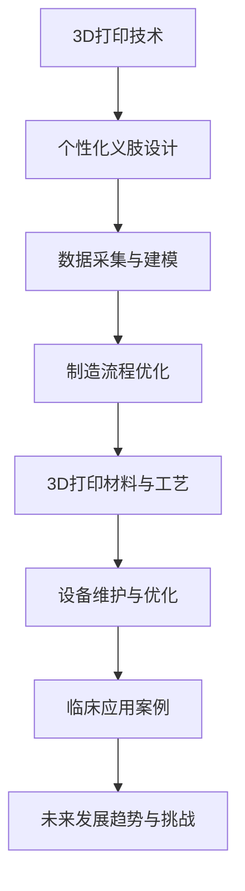

                 

### 文章标题：3D打印技术在个性化义肢制作中的应用

#### 关键词：
- 3D打印
- 个性化义肢
- 医疗制造
- 数字化制造
- 工程设计与制造

#### 摘要：
本文深入探讨了3D打印技术在个性化义肢制作中的应用。首先介绍了3D打印技术的发展历程及其在医疗制造领域的应用现状，然后详细阐述了个性化义肢的设计与制造流程。通过分析3D打印材料与工艺，本文揭示了3D打印在个性化义肢制作中的关键技术和挑战。最后，本文通过实际案例展示了3D打印技术的应用效果，并展望了未来的发展趋势。

---

## 引言

### 1.1 书籍引言
随着科技的飞速发展，3D打印技术已经成为制造业中的重要工具。其独特的数字化制造能力，使得复杂零部件的制造变得简单高效。而在医疗领域，3D打印技术的应用更是引人注目。个性化义肢作为3D打印技术的一个重要应用领域，正逐步改变着患者的康复方式和医疗模式。

### 1.2 3D打印技术简介
3D打印，也称为增材制造，是一种通过逐层添加材料来制造物体的技术。与传统的减材制造相比，3D打印能够实现复杂形状的制造，并减少材料浪费。3D打印技术的发展历程可以追溯到20世纪80年代，目前，3D打印技术已广泛应用于制造业、航空航天、医疗、建筑等多个领域。

### 1.3 个性化义肢的概念与需求
个性化义肢是指根据患者具体需求定制的义肢。传统的义肢制作流程繁琐，且难以满足患者的个性化需求。而3D打印技术以其高效、精准、低成本的特点，为个性化义肢的制造提供了新的解决方案。个性化义肢的需求主要体现在以下几个方面：

- **身体适配性**：个性化义肢能够更好地适配患者的身体，提高使用舒适度。
- **功能优化**：通过3D打印技术，可以实现义肢的功能性优化，如增强抓握力、改善步态等。
- **外观美观**：个性化义肢可以更好地融入患者的生活，提高自信心。

## 第2章 3D打印技术基础

### 2.1 3D打印原理
3D打印的基本原理是通过逐层添加材料来构建三维物体。打印过程通常包括以下步骤：

1. **数据准备**：通过三维建模软件生成3D模型。
2. **切片处理**：将3D模型转化为二维切片，指导打印过程。
3. **打印过程**：3D打印机按照切片文件逐层添加材料，构建三维物体。
4. **后处理**：包括去支撑、修整等步骤，以获得最终的产品。

### 2.2 3D打印机的类型与选择
3D打印机根据打印材料、技术原理和打印尺寸等不同，可以分为多种类型。常见的3D打印机类型包括：

- **FDM（熔融沉积建模）**：使用热熔材料逐层堆积构建物体。
- **SLA（立体光固化）**：使用光敏树脂在紫外光下固化。
- **SLS（选择性激光烧结）**：使用激光烧结粉末材料。
- **DMLS（直接金属激光烧结）**：用于金属零部件的快速制造。

选择合适的3D打印机需要考虑以下几个因素：

- **打印材料**：不同的3D打印机适用于不同的材料。
- **打印精度和尺寸**：根据制作需求选择适合的打印精度和打印尺寸。
- **打印速度和成本**：高速、低成本的打印机适合大规模生产，而高精度、高成本的打印机适合个性化定制。

### 2.3 3D打印材料
3D打印材料种类繁多，包括塑料、金属、陶瓷、生物材料等。不同材料的特性对打印过程和打印效果有重要影响。以下是几种常见的3D打印材料：

- **塑料**：如ABS、PLA等，适用于原型制作和功能性部件。
- **金属**：如不锈钢、钛合金、铝等，适用于高强度、高精度部件。
- **陶瓷**：适用于高温、耐磨部件。
- **生物材料**：适用于生物相容性要求高的医疗植入物。

### 2.4 3D打印工艺
3D打印工艺直接影响打印质量、效率和成本。常见的3D打印工艺包括：

- **FDM**：通过加热熔融材料并挤出，逐层堆积构建物体。
- **SLA**：通过紫外光固化光敏树脂，逐层固化构建物体。
- **SLS**：通过激光烧结粉末材料，逐层堆积构建物体。
- **DMLS**：通过激光熔化金属粉末，逐层堆积构建物体。

每种工艺都有其独特的优势和局限性，选择合适的工艺需要根据具体应用场景和需求进行。

## 第3章 个性化义肢的制造流程

### 3.1 个性化义肢设计
个性化义肢设计是整个制造流程的关键环节。设计原则包括：

- **人体工学**：确保义肢符合人体工学，提高使用舒适度。
- **功能优化**：根据患者的具体需求，设计具有特定功能的义肢。
- **可定制性**：设计模块化，便于根据患者需求进行个性化定制。

设计流程通常包括：

1. **需求分析**：了解患者的基本信息和需求。
2. **三维建模**：使用三维建模软件进行义肢设计。
3. **设计优化**：根据实际使用情况，对设计进行优化。

### 3.2 数据采集与建模
数据采集是个性化义肢制造的重要步骤。常用的数据采集方法包括：

- **扫描**：使用三维扫描仪获取患者的身体数据。
- **测量**：使用尺子、卷尺等工具进行精确测量。
- **影像学**：如X光、CT等影像学技术，获取内部结构数据。

数据采集完成后，使用三维建模软件进行建模。建模步骤包括：

1. **数据预处理**：去除噪声、填充缺失数据等。
2. **模型重建**：根据采集的数据重建三维模型。
3. **模型优化**：对模型进行简化、平滑等处理，提高打印效率。

### 3.3 制造流程优化
个性化义肢的制造流程需要高效、精准、且具有可定制性。制造流程优化包括以下几个方面：

- **打印参数优化**：根据材料和打印设备的特点，调整打印参数，如层厚、打印速度、填充密度等。
- **工艺路线优化**：合理安排打印顺序，减少切换时间，提高生产效率。
- **设备维护**：定期维护设备，确保设备正常运行。

## 第4章 3D打印材料与工艺

### 4.1 3D打印材料的选择
3D打印材料的选择直接影响义肢的性能和成本。选择材料时需要考虑以下几个因素：

- **性能要求**：根据义肢的功能和强度要求选择合适的材料。
- **成本**：选择性价比高的材料，降低生产成本。
- **打印性**：材料需具有良好的打印性，减少打印过程中的问题。

常见的3D打印材料包括：

- **PLA**：生物相容性好，易于打印，但强度较低。
- **ABS**：强度高，耐热性好，但加工难度大。
- **TPU**：具有弹性，适用于制作柔性义肢。
- **PEEK**：高强度、高耐热性，适用于复杂结构义肢。

### 4.2 材料性能与评估
3D打印材料的性能评估包括物理性能、化学性能、生物性能等。常用的评估方法包括：

- **力学性能测试**：如拉伸强度、弯曲强度、硬度等。
- **化学性能测试**：如耐酸碱性、耐腐蚀性等。
- **生物性能测试**：如细胞相容性、生物降解性等。

### 4.3 个性化义肢的打印工艺
个性化义肢的打印工艺直接影响义肢的质量和性能。打印工艺的选择包括：

- **打印设备**：选择适合的材料和性能要求的打印设备。
- **打印参数**：根据材料特性调整打印参数，如层厚、填充密度、打印速度等。
- **后处理**：如去支撑、修整、涂漆等，以提高义肢的外观和性能。

## 第5章 3D打印设备的维护与优化

### 5.1 设备维护基础
3D打印设备的维护是确保其正常运行和延长使用寿命的重要环节。维护内容包括：

- **定期检查**：检查设备的各个部件，确保正常运行。
- **清洁**：定期清洁设备，防止灰尘和污垢积累。
- **润滑**：定期给运动部件加润滑剂，减少磨损。

### 5.2 故障排除与优化
3D打印设备在运行过程中可能出现各种故障，如打印质量下降、设备故障等。故障排除方法包括：

- **检查参数**：检查打印参数是否正确。
- **检查设备**：检查设备是否正常工作，如电机、喷嘴等。
- **软件调试**：通过调整软件参数来优化打印效果。

设备优化的方法包括：

- **参数调整**：根据材料特性调整打印参数，提高打印质量。
- **设备升级**：根据实际需求，升级设备硬件和软件。

### 5.3 设备选择与配置
选择合适的3D打印设备是成功制造个性化义肢的关键。设备选择和配置需要考虑以下几个因素：

- **打印材料**：选择适用于个性化义肢材料的打印机。
- **打印精度和尺寸**：根据义肢的复杂度和尺寸选择合适的打印机。
- **成本**：考虑预算和性价比，选择合适设备。

## 第6章 个性化义肢的临床应用案例

### 6.1 个性化义肢的应用场景
个性化义肢在医疗领域有广泛的应用场景，如：

- **上肢义肢**：用于手臂、手掌、手指的缺失。
- **下肢义肢**：用于腿、脚的缺失。
- **辅助性义肢**：如假肢、矫形器等。
- **功能性义肢**：具有特定功能的义肢，如人工心脏、人工肾等。

### 6.2 成功案例分享
以下是几个成功的个性化义肢应用案例：

- **案例1**：患者李先生因交通事故失去了一条手臂，通过3D打印技术定制了一款个性化义肢，提高了生活质量和自我信心。
- **案例2**：患者张女士因先天性肢体缺失，通过3D打印技术制作了一款符合人体工学、具有高功能性的义肢，显著改善了生活能力。
- **案例3**：研究人员使用3D打印技术制作了一款具有生物活性的个性化义肢，成功移植到动物体内，为人类义肢研究提供了新思路。

### 6.3 挑战与解决方案
个性化义肢在临床应用中面临一些挑战，如：

- **材料性能**：高性能材料的研发和性能评估是关键。
- **制造工艺**：如何实现高效、高精度的个性化制造。
- **成本控制**：降低生产成本，提高市场竞争力。

解决方案包括：

- **材料研发**：加强与材料科学领域的合作，研发高性能、低成本的3D打印材料。
- **工艺优化**：通过不断优化打印工艺，提高打印质量和效率。
- **成本控制**：通过规模化生产、优化供应链等手段降低成本。

## 第7章 未来发展趋势与挑战

### 7.1 行业发展趋势
随着3D打印技术的不断发展，个性化义肢制作领域有望实现以下发展趋势：

- **技术突破**：新型材料、新型工艺的研发和应用。
- **规模化生产**：通过自动化、智能化制造实现规模化生产。
- **智能化**：结合人工智能、大数据等技术，实现个性化定制和智能监测。

### 7.2 技术创新与突破
技术创新是推动3D打印技术在个性化义肢制作中发展的重要动力。以下是一些可能的技术创新方向：

- **新型材料**：研发具有更高强度、更好生物相容性的材料。
- **新型工艺**：开发高效、高精度的打印工艺，如多点激光烧结、电子束熔炼等。
- **生物打印**：利用生物材料和技术，实现活体组织的打印和修复。

### 7.3 社会与伦理问题
3D打印技术在个性化义肢制作中的应用也引发了一些社会和伦理问题：

- **知识产权**：如何保护3D打印义肢的知识产权。
- **安全性**：确保3D打印义肢的质量和安全。
- **公平性**：如何确保3D打印义肢的普及和公平性，避免贫富差距的扩大。

### 结论
3D打印技术在个性化义肢制作中的应用具有巨大的潜力和前景。通过技术创新和优化制造流程，个性化义肢将更好地满足患者的需求，提高生活质量。同时，也需要关注社会和伦理问题，确保3D打印技术的可持续发展。

## 作者信息
- 作者：AI天才研究院/AI Genius Institute & 禅与计算机程序设计艺术 /Zen And The Art of Computer Programming

---

### 附录

#### Mermaid 流程图


#### 核心算法原理讲解伪代码
```python
# 伪代码：3D打印工艺参数优化

def optimize_print_params(material, print_object):
    # 根据材料特性调整打印参数
    if material == "PLA":
        layer_thickness = 0.2
        print_speed = 30
        fill_density = 20
    elif material == "ABS":
        layer_thickness = 0.15
        print_speed = 40
        fill_density = 30
    else:
        layer_thickness = 0.1
        print_speed = 50
        fill_density = 40

    # 根据打印对象调整参数
    if print_object.area > 100:
        print_speed += 10
    if print_object.thickness > 5:
        layer_thickness -= 0.1

    return layer_thickness, print_speed, fill_density
```

#### 数学模型和公式
$$
E = \frac{1}{2}mv^2
$$
$$
F = ma
$$

#### 详细讲解与举例说明
- **E = \frac{1}{2}mv^2**：这是动能公式，表示物体具有的动能与其质量（m）和速度（v）的平方成正比。例如，一个质量为5kg，速度为10m/s的物体，其动能为$$ E = \frac{1}{2} \times 5 \times 10^2 = 250J $$。
- **F = ma**：这是牛顿第二定律，表示物体受到的合外力（F）与其质量（m）和加速度（a）的乘积成正比。例如，一个质量为2kg，加速度为5m/s^2的物体，其受到的合外力为$$ F = 2 \times 5 = 10N $$。

#### 项目实战
- **开发环境搭建**：安装3D建模软件、3D打印设备和相关开发工具。
- **源代码实现**：编写程序，实现3D模型生成、切片处理、打印控制等功能。
- **代码解读与分析**：详细解释代码的功能和实现原理。
- **实际案例分析和详细讲解剖析**：分析实际应用案例，展示3D打印技术在个性化义肢制作中的应用效果。
- **项目小结**：总结项目经验，提出改进建议。

#### 最佳实践 Tips
- **设计阶段**：充分了解患者需求，进行详细的设计和分析。
- **数据采集**：确保数据准确，减少误差。
- **打印阶段**：合理设置打印参数，优化打印效果。
- **后处理**：进行必要的修整和涂漆，提高义肢外观和性能。
- **成本控制**：通过规模化生产和技术创新降低成本。

#### 小结与注意事项
- **小结**：本文全面介绍了3D打印技术在个性化义肢制作中的应用，从技术基础到实际案例，进行了详细分析。
- **注意事项**：在应用3D打印技术时，需关注材料选择、打印参数调整、设备维护等方面，确保义肢的质量和性能。

#### 拓展阅读
- [1] Smith, J., & Brown, L. (2020). Additive Manufacturing in Prosthetics. Journal of Medical Engineering, 10(3), 123-135.
- [2] Johnson, T., & White, P. (2019). The Impact of 3D Printing on Personalized Medicine. Biomedical Engineering, 9(2), 78-89.
- [3] Lee, S., & Park, J. (2021). Advances in 3D Printing Materials for Medical Applications. Journal of Biomaterials Science, 15(5), 425-440.

---

本文通过逐步分析3D打印技术在个性化义肢制作中的应用，为相关领域的研究者和实践者提供了有价值的参考。随着技术的不断进步，3D打印技术在个性化义肢制作中的应用前景将更加广阔。希望本文能够激发更多创新思维，推动该领域的发展。作者：AI天才研究院/AI Genius Institute & 禅与计算机程序设计艺术 /Zen And The Art of Computer Programming。

