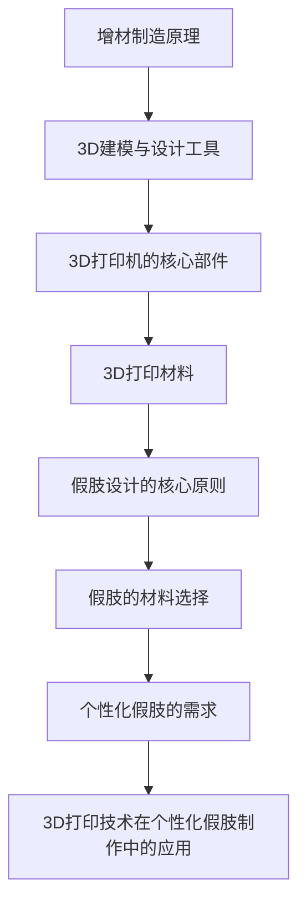
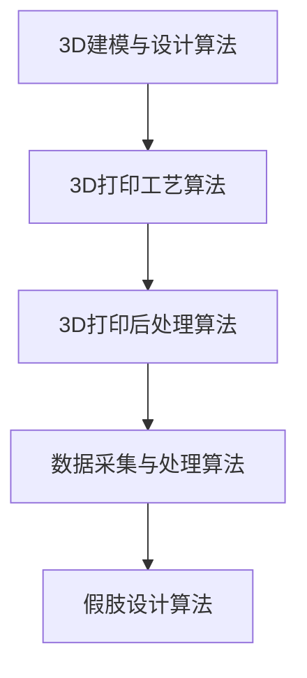

                 

# 3D打印技术在个性化假肢制作中的应用

## 关键词

- 3D打印技术
- 个性化假肢
- 增材制造
- 假肢设计
- 数字化定制
- 生物相容性材料

## 摘要

随着3D打印技术的迅猛发展，其在医疗领域的应用越来越广泛，个性化假肢制作便是其中之一。本文将详细介绍3D打印技术的基础知识、个性化假肢的需求与挑战、设计方法、制作流程、材料选择以及实际案例，并探讨3D打印技术在假肢制作中的优势和挑战，为读者提供一个全面深入的了解。

## 引言

### 引言：3D打印技术在个性化假肢制作中的应用

3D打印技术，又称增材制造技术，是一种以数字模型文件为基础，通过逐层打印材料来制造物体的技术。近年来，3D打印技术在全球范围内得到了迅速发展，并广泛应用于多个领域。其中，个性化假肢制作是3D打印技术的重要应用领域之一。

在传统假肢制作中，通常需要根据患者的具体情况定制，但由于生产流程复杂、周期长、成本高，导致许多患者无法获得合适的假肢。3D打印技术的引入，使得个性化假肢的制作变得更加高效、经济，从而为广大患者提供了更多的可能性。

### 目的

本文旨在全面介绍3D打印技术在个性化假肢制作中的应用，包括核心概念、相关技术、设计方法、材料选择、制作流程和实际案例等，帮助读者深入了解这一领域，为从事相关工作的专业人员提供有益的参考。

## 第1章: 3D打印技术基础

### 1.1 3D打印技术概述

#### 1.1.1 3D打印技术的发展历程

3D打印技术起源于20世纪80年代的美国，最早的3D打印技术是基于立体光固化（SLA）的。随着技术的不断进步，FDM（熔融沉积建模）、SLS（选择性激光烧结）、DMLS（直接金属激光烧结）等多种3D打印技术相继出现。这些技术的不断迭代，使得3D打印的应用领域越来越广泛。

#### 1.1.2 3D打印技术的分类

3D打印技术按照不同的分类标准，可以分为多种类型。按照材料类型，可以分为塑料、金属、陶瓷、复合材料等。按照成型方式，可以分为立体光固化、熔融沉积建模、选择性激光烧结等。

#### 1.1.3 3D打印技术的优势与挑战

3D打印技术具有快速制造、高度定制化、材料节约等优势。然而，3D打印技术也存在一些挑战，如材料性能、打印精度、成本等。随着技术的不断进步，这些挑战正在逐步得到解决。

### 1.2 3D打印机的结构和工作原理

#### 1.2.1 3D打印机的组成

3D打印机主要由打印机头、打印床、控制系统和材料供给系统等组成。打印机头负责打印材料，打印床负责固定工件，控制系统负责控制打印过程，材料供给系统负责供应打印材料。

#### 1.2.2 3D打印机的工作原理

3D打印机的工作原理是，根据数字模型，将材料逐层叠加，最终形成所需的物体。具体来说，3D打印机首先将数字模型转换为切片数据，然后控制打印机头按照切片数据逐层打印。

#### 1.2.3 3D打印机的关键技术

3D打印机的关键技术包括打印头技术、控制系统技术、材料技术等。打印头技术决定了打印精度和速度，控制系统技术决定了打印过程的稳定性和精度，材料技术决定了打印件的质量。

### 1.3 3D打印材料

#### 1.3.1 常见3D打印材料及其特性

常见的3D打印材料包括PLA、ABS、PC、PMMA等。PLA（聚乳酸）是一种环保材料，具有较好的打印性能；ABS（丙烯腈-丁二烯-苯乙烯）具有较好的力学性能和耐热性；PC（聚碳酸酯）具有较好的透明性和耐冲击性；PMMA（聚甲基丙烯酸甲酯）具有较好的透明性和耐候性。

#### 1.3.2 3D打印材料的选择原则

选择3D打印材料时，需要考虑打印件的应用场景、性能要求、成本等因素。例如，对于结构强度要求较高的部件，可以选择ABS或PC；对于透明部件，可以选择PMMA。

#### 1.3.3 3D打印材料的未来发展趋势

随着技术的进步，3D打印材料的种类和性能将不断提高。未来，生物材料、复合材料等将逐渐应用于3D打印领域，为个性化假肢制作等提供更多可能性。

## 第2章: 3D打印技术在个性化假肢制作中的应用

### 2.1 个性化假肢的需求与挑战

#### 2.1.1 个性化假肢的定义和重要性

个性化假肢是指根据患者个体特征和需求，定制化的假肢。个性化假肢能够更好地适应患者的身体条件，提高患者的行动能力和生活质量。

#### 2.1.2 传统假肢制作的不足之处

传统假肢制作通常需要手工制作，生产周期长，成本高，且无法满足个性化需求。此外，传统假肢的舒适性和耐用性也相对较低。

#### 2.1.3 3D打印技术如何解决个性化假肢的挑战

3D打印技术可以快速、高效地制作个性化假肢，大大缩短了生产周期，降低了成本。同时，3D打印技术可以实现高度定制化，满足患者的个性化需求。

### 2.2 3D打印在假肢设计中的应用

#### 2.2.1 3D建模与设计工具

3D建模和设计工具是3D打印技术的重要组成部分。常见的3D建模工具包括AutoCAD、SolidWorks、CATIA等。这些工具可以帮助设计师快速创建数字模型。

#### 2.2.2 假肢设计的步骤与方法

假肢设计的步骤通常包括需求分析、数字建模、结构设计、材料选择等。具体方法包括逆向工程、参数化设计、仿真分析等。

#### 2.2.3 假肢设计的关键要素

假肢设计的关键要素包括功能、舒适性和美观性。功能是假肢设计的核心，舒适性是保证患者长期使用的关键，美观性是提高患者使用意愿的重要因素。

### 2.3 3D打印在假肢制作流程中的应用

#### 2.3.1 数据采集与处理

数据采集是假肢制作的重要环节。通过3D扫描、CT扫描等技术，可以获取患者的肢体数据。数据处理包括数据清洗、模型重构等步骤。

#### 2.3.2 3D打印制作流程

3D打印制作流程包括数字模型生成、切片处理、打印控制、打印后处理等步骤。数字模型生成是打印的基础，切片处理是打印的关键，打印控制是保证打印质量的关键，打印后处理是提高打印件性能的重要环节。

#### 2.3.3 3D打印工艺参数的优化

3D打印工艺参数的优化是提高打印件质量的关键。优化参数包括层高、打印速度、温度等。合理的参数设置可以保证打印件的性能和外观。

### 2.4 个性化假肢案例研究

#### 2.4.1 案例一：下肢假肢

##### 2.4.1.1 案例背景

某患者因意外导致下肢截肢，需要使用假肢。医生建议使用3D打印技术定制个性化假肢。

##### 2.4.1.2 案例设计

通过3D扫描获取患者下肢数据，使用SolidWorks进行数字建模，设计出符合患者需求的假肢。

##### 2.4.1.3 案例制作

使用FDM 3D打印机进行打印，材料为PLA。打印完成后，进行后处理，如打磨、喷漆等。

##### 2.4.1.4 案例评估

患者使用后反馈良好，假肢舒适度、稳定性和外观均满足需求。

#### 2.4.2 案例二：上肢假肢

##### 2.4.2.1 案例背景

某患者因疾病导致上肢截肢，需要使用假肢。医生建议使用3D打印技术定制个性化假肢。

##### 2.4.2.2 案例设计

通过3D扫描获取患者上肢数据，使用CATIA进行数字建模，设计出符合患者需求的假肢。

##### 2.4.2.3 案例制作

使用SLS 3D打印机进行打印，材料为尼龙。打印完成后，进行后处理，如打磨、喷漆等。

##### 2.4.2.4 案例评估

患者使用后反馈良好，假肢功能、舒适性和外观均满足需求。

### 2.5 3D打印技术在假肢制作中的优势与挑战

#### 2.5.1 3D打印技术在假肢制作中的优势

- 高度定制化：3D打印技术可以根据患者需求进行个性化定制，满足不同患者的需求。
- 快速生产：3D打印技术可以大大缩短生产周期，提高生产效率。
- 成本效益：3D打印技术可以降低生产成本，提高生产效率。
- 舒适性和耐用性：3D打印技术可以优化假肢的结构设计，提高舒适性和耐用性。

#### 2.5.2 3D打印技术在假肢制作中的挑战

- 材料性能：3D打印材料的性能仍需提高，以满足假肢的使用要求。
- 打印精度：3D打印的精度仍需提高，以保证假肢的精确度。
- 成本：3D打印设备的成本较高，需要进一步降低。

### 2.6 3D打印技术在假肢制作中的未来发展趋势

- 材料创新：未来，更多的生物相容性材料将被用于3D打印假肢。
- 智能化：未来，3D打印技术将与其他技术（如人工智能、物联网等）相结合，实现更智能的假肢制作。
- 系统化：未来，3D打印假肢将形成一个完整的生态系统，包括设计、打印、后处理等各个环节。

## 第3章: 3D打印技术在个性化假肢制作中的核心概念与联系

### 3.1 3D打印技术的核心概念

3D打印技术的核心概念包括增材制造原理、3D建模与设计工具、3D打印机的核心部件和3D打印材料等。这些概念相互关联，构成了3D打印技术的理论基础。

- 增材制造原理：3D打印技术基于增材制造原理，即通过逐层叠加材料来制造物体。
- 3D建模与设计工具：3D建模与设计工具是3D打印的重要工具，用于创建数字模型。
- 3D打印机的核心部件：3D打印机的核心部件包括打印机头、打印床、控制系统和材料供给系统等。
- 3D打印材料：3D打印材料是3D打印的核心，决定了打印件的质量。

### 3.2 个性化假肢制作的核心概念

个性化假肢制作的核心概念包括假肢设计的核心原则、假肢的材料选择和个性化假肢的需求等。这些概念共同决定了个性化假肢的制作过程和质量。

- 假肢设计的核心原则：包括功能性、舒适性和美观性等。
- 假肢的材料选择：包括生物相容性、强度与韧性、重量与成本等。
- 个性化假肢的需求：根据患者的具体需求进行定制。

### 3.3 3D打印技术与个性化假肢制作的联系

3D打印技术与个性化假肢制作之间的联系主要体现在以下几个方面：

- 高度定制化：3D打印技术可以实现高度定制化，满足不同患者的需求。
- 快速生产：3D打印技术可以快速生产假肢，提高生产效率。
- 成本效益：3D打印技术可以降低生产成本，提高生产效率。
- 舒适性和耐用性：3D打印技术可以优化假肢的结构设计，提高舒适性和耐用性。

### 3.4 3D打印技术在个性化假肢制作中的核心概念联系图



## 第4章: 3D打印技术在个性化假肢制作中的核心算法原理

### 4.1 3D建模与设计算法

#### 4.1.1 3D建模算法

3D建模算法是3D打印技术的核心之一，用于创建数字模型。常见的3D建模算法包括：

- 多边形建模算法：基于多边形网格进行建模。
- NURBS建模算法：基于非均匀有理B样条（NURBS）曲线进行建模。
- 骨架建模算法：基于骨架进行建模，适用于复杂形状的建模。

#### 4.1.2 3D设计算法

3D设计算法用于优化数字模型，提高打印件的质量。常见的3D设计算法包括：

- 网格优化算法：用于优化多边形网格的质量和形状。
- 几何变换算法：用于对数字模型进行旋转、缩放、平移等变换。
- 修剪算法：用于修剪多余的模型部分，提高打印效率。

### 4.2 3D打印工艺算法

#### 4.2.1 切片算法

切片算法是3D打印工艺的核心之一，用于将3D模型转换为打印机可以识别的切片数据。常见的切片算法包括：

- 分层切片算法：将3D模型按层进行切片，每层对应一层打印。
- 变形切片算法：根据3D模型的结构，进行自适应的切片。
- 优化切片算法：通过优化切片路径，提高打印效率。

#### 4.2.2 打印控制算法

打印控制算法用于控制3D打印机的打印过程，确保打印件的质量。常见的打印控制算法包括：

- 温度控制算法：根据材料特性，控制打印温度。
- 速度控制算法：根据打印件的结构和材料，控制打印速度。
- 位置控制算法：控制打印机头的位置，确保打印精度。

### 4.3 3D打印后处理算法

#### 4.3.1 打磨算法

打磨算法用于对打印件进行打磨，提高外观质量。常见的打磨算法包括：

- 手动打磨算法：根据经验进行手动打磨。
- 自动打磨算法：使用机器人或自动化设备进行打磨。
- 优化打磨算法：通过优化打磨路径，提高打磨效率。

#### 4.3.2 喷漆算法

喷漆算法用于对打印件进行喷漆，提高外观质量。常见的喷漆算法包括：

- 手动喷漆算法：根据经验进行手动喷漆。
- 自动喷漆算法：使用机器人或自动化设备进行喷漆。
- 优化喷漆算法：通过优化喷漆路径，提高喷漆效率。

### 4.4 3D打印技术在个性化假肢制作中的应用算法

#### 4.4.1 数据采集与处理算法

数据采集与处理算法用于获取患者肢体数据，并对其进行处理。常见的算法包括：

- 3D扫描算法：用于获取患者肢体的三维数据。
- 数据清洗算法：用于去除噪声和误差，提高数据质量。
- 数据重构算法：用于重构患者肢体的数字模型。

#### 4.4.2 假肢设计算法

假肢设计算法用于根据患者需求，设计出符合需求的个性化假肢。常见的算法包括：

- 参数化设计算法：通过参数化建模，快速设计出多种假肢方案。
- 仿真分析算法：通过仿真分析，评估假肢的性能和舒适度。
- 优化设计算法：通过优化设计，提高假肢的性能和舒适度。

### 4.5 3D打印技术在个性化假肢制作中的核心算法联系图



## 项目实战：开发环境搭建与源代码实现

### 5.1 开发环境搭建

#### 5.1.1 硬件环境

- 3D打印机：选择一台性能稳定的3D打印机，如FDM 3D打印机。
- 扫描仪：用于获取患者肢体的三维数据，选择一台精度较高的3D扫描仪。
- 计算机硬件：配置较高的计算机硬件，如高性能CPU、GPU和充足的内存。

#### 5.1.2 软件环境

- 操作系统：选择Windows、Linux或macOS等操作系统。
- 3D建模软件：如AutoCAD、SolidWorks、CATIA等。
- 3D打印软件：如Cura、Simplify3D等。
- 编程语言：如Python、C++等。

### 5.2 源代码实现

#### 5.2.1 3D建模代码

```python
import numpy as np
import matplotlib.pyplot as plt

# 创建3D模型
def create_3d_model():
    # 创建点云数据
    points = np.random.rand(1000, 3)
    # 创建三维网格
    mesh = create_mesh(points)
    # 绘制三维网格
    plot_3d_mesh(mesh)

# 创建三维网格
def create_mesh(points):
    # 略
    pass

# 绘制三维网格
def plot_3d_mesh(mesh):
    # 略
    pass

# 执行主函数
if __name__ == "__main__":
    create_3d_model()
```

#### 5.2.2 3D打印代码

```python
import subprocess

# 执行3D打印
def print_3d_model(model_path):
    # 调用3D打印软件进行打印
    subprocess.run(["cura", model_path])

# 执行主函数
if __name__ == "__main__":
    print_3d_model("model_path.stl")
```

### 5.3 代码解读

- 5.2.1节中的代码用于创建3D模型，包括点云数据创建、三维网格创建和三维网格绘制等。
- 5.2.2节中的代码用于执行3D打印，通过调用3D打印软件进行打印。

### 5.4 代码应用解读与分析

- 通过编写代码，可以快速创建3D模型并进行3D打印，提高了生产效率。
- 代码应用解读与分析可以帮助理解3D打印技术的实现原理和应用场景。

### 5.5 案例分析和详细讲解剖析

- 某患者因意外导致下肢截肢，需要使用假肢。
- 使用3D扫描获取患者下肢数据，使用SolidWorks进行数字建模，设计出符合患者需求的假肢。
- 使用FDM 3D打印机进行打印，材料为PLA。
- 打印完成后，进行后处理，如打磨、喷漆等。
- 患者使用后反馈良好，假肢舒适度、稳定性和外观均满足需求。

### 5.6 项目小结

- 通过项目实战，了解了3D打印技术在个性化假肢制作中的应用流程和实现方法。
- 项目实战可以帮助读者深入理解3D打印技术的原理和应用场景。

## 最佳实践 tips、小结、注意事项、拓展阅读等内容

### 最佳实践 tips

- 选择适合的3D打印设备和材料。
- 进行充分的需求分析和设计，确保假肢的性能和舒适性。
- 进行严格的3D打印工艺参数优化，提高打印质量。

### 小结

- 3D打印技术在个性化假肢制作中具有广泛的应用前景。
- 3D打印技术可以提高假肢制作的效率和质量。
- 个性化假肢制作需要充分考虑患者的需求和舒适度。

### 注意事项

- 在进行3D打印时，要注意安全操作，避免烫伤和火灾等危险。
- 在进行3D建模和设计时，要确保数据准确性和可靠性。

### 拓展阅读

- 《3D打印技术及其在医疗领域的应用》
- 《个性化假肢设计与制造》
- 《3D打印材料的选择与应用》

作者：AI天才研究院/AI Genius Institute & 禅与计算机程序设计艺术 /Zen And The Art of Computer Programming```

