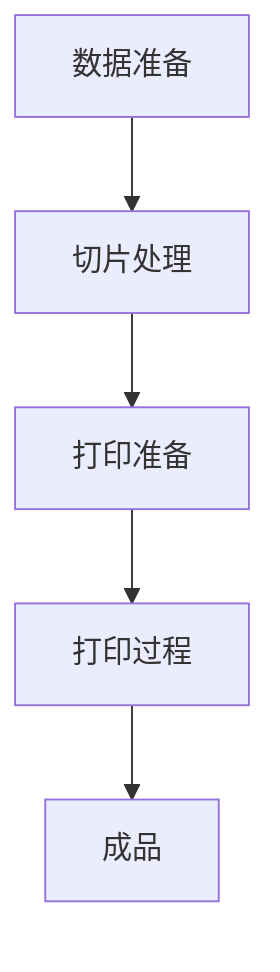

                 

## 文章标题：3D打印技术在个性化医疗器械中的应用

### 关键词：
- 3D打印
- 个性化医疗器械
- 医疗器械设计
- 生物医学
- 成本效益

### 摘要：
本文探讨了3D打印技术在个性化医疗器械中的应用，包括其基本原理、分类、材料选择、应用优势与挑战，以及个性化医疗器械的3D打印流程和质量控制。通过案例分析，揭示了3D打印技术在个性化医疗器械领域的实际应用和未来发展趋势。

----------------------------------------------------------------

### 第一部分：3D打印技术基础

#### 第1章：3D打印技术概述

#### 1.1 3D打印技术的基本原理

3D打印技术，也称为增材制造技术，是一种以数字模型为基础，逐层构建物体的制造技术。其基本原理可以概括为以下几个步骤：

1. **数据准备**：首先需要创建一个三维数字模型，通常使用CAD（计算机辅助设计）软件来完成。
2. **切片处理**：将三维模型拆解成一系列二维平面图，即切片，这些切片将指导3D打印机逐层构建物体。
3. **打印准备**：将材料（如塑料、金属粉末、树脂等）加载到打印机中，准备开始打印。
4. **打印过程**：3D打印机根据切片信息，逐层堆积材料，直到构建出完整的物体。
5. **成品**：打印完成后，进行后处理，如去除支撑结构、打磨和涂装等，以获得最终成品。

以下是一个简单的Mermaid流程图，展示了3D打印的基本流程：

#### 1.2 3D打印技术的分类

3D打印技术根据技术方式的不同，可以分为以下几类：

- **FDM（熔融沉积建模）**：通过加热将热塑性材料融化并堆积成物体。
- **SLA（立体光刻）**：使用激光将光敏树脂逐层固化成物体。
- **DMLS（直接金属激光烧结）**：使用激光烧结金属粉末成物体。

每种技术都有其特定的应用场景和优势，选择合适的技术对于实现高效、高质量的个性化医疗器械至关重要。

#### 1.3 3D打印技术的主要材料

3D打印的材料种类繁多，包括塑料、金属、陶瓷和生物材料等。以下是几种常用的3D打印材料及其特性：

- **塑料**：如ABS、PLA等，常用于制造原型和功能性零件。
- **金属**：如钛、不锈钢、铝合金等，适用于制造高强度和耐高温的医疗器械。
- **陶瓷**：如氧化铝、碳化硅等，具有高硬度和耐磨性。
- **生物材料**：如聚乙烯、羟基磷灰石等，用于生物医学植入物和器官。

选择合适的材料需要考虑医疗器械的应用场景、生物相容性以及成本效益等因素。

----------------------------------------------------------------

### 第二部分：3D打印技术在个性化医疗器械中的应用

#### 第2章：3D打印技术在医疗器械中的应用

#### 2.1 个性化定制医疗器械

个性化定制医疗器械是指根据患者的具体需求和生理特征，使用3D打印技术量身定制医疗器械。这种定制化技术能够提高医疗器械的舒适度、适配性和治疗效果。以下是一些个性化定制医疗器械的例子：

- **定制化骨植入物**：根据患者的骨骼形态定制，提高手术的成功率和康复效果。
- **个性化义齿**：通过扫描患者的口腔结构，定制出与患者牙齿完全适配的义齿。
- **个性化心血管支架**：根据患者的心血管病变情况定制，实现精准治疗。

#### 2.2 医疗器械的快速原型制作

3D打印技术还可以用于医疗器械的快速原型制作。快速原型制作是指在设计和生产医疗器械前，先制作出实物原型，以验证设计的可行性和准确性。3D打印技术的快速性和灵活性使得原型制作变得高效且成本低廉。

- **手术工具**：通过3D打印制作定制化的手术工具，提高手术的准确性和安全性。
- **医疗器械组件**：在医疗器械的生产过程中，使用3D打印技术快速生产组件，缩短生产周期。

#### 2.3 生物医学3D打印

生物医学3D打印是指使用3D打印技术直接打印生物医学材料，用于制造组织工程和器官移植等应用。这种技术为医疗领域带来了前所未有的可能性，例如：

- **组织工程**：通过3D打印制造支架，用于细胞和组织的生长，用于修复和再生受损的组织。
- **器官移植**：未来有望实现打印出完整的器官，解决器官移植的供需矛盾。

----------------------------------------------------------------

### 第三部分：3D打印技术在个性化医疗器械中的优势

#### 第3章：3D打印技术在个性化医疗器械中的优势

#### 3.1 灵活性与定制化

3D打印技术的核心优势之一是其高灵活性和定制化能力。传统的医疗器械制造过程通常受到模具和生产线限制，难以实现定制化。而3D打印技术无需模具，可以根据患者的具体需求和生理特征进行定制，提高医疗器械的舒适度和适配性。

#### 3.2 成本效益

尽管3D打印技术的初期投资较高，但其在长期运行中的成本效益显著。3D打印技术能够减少原材料浪费，降低制造过程中的中间环节成本，提高生产效率。此外，3D打印技术的快速原型制作功能可以缩短产品设计周期，降低研发成本。

#### 3.3 时间效率

3D打印技术具有快速生产的特点，能够大幅缩短医疗器械的生产周期。这对于紧急情况下的治疗和手术具有重要意义。例如，在急诊手术中，3D打印技术可以在短时间内生产出定制的手术工具或植入物，提高手术的成功率。

----------------------------------------------------------------

### 第四部分：3D打印技术在个性化医疗器械中的挑战

#### 第4章：3D打印技术在个性化医疗器械中的挑战

#### 4.1 材料性能与生物相容性

3D打印技术的应用对材料性能和生物相容性提出了更高的要求。3D打印材料需要具备高强度、耐用性和良好的生物相容性，以确保医疗器械的安全性和有效性。此外，3D打印过程中可能产生的残余应力、微裂纹等问题也会影响材料的性能。

#### 4.2 加工精度与表面质量

3D打印技术的加工精度和表面质量直接影响到医疗器械的性能和外观。尽管3D打印技术在不断提高，但与传统的精密加工技术相比，仍存在一定的差距。提高3D打印的精度和表面质量是未来研究的重要方向。

#### 4.3 安全性与法规遵从

3D打印医疗器械的安全性和法规遵从是另一个重大挑战。3D打印医疗器械需要经过严格的测试和认证，以确保其安全性和有效性。此外，3D打印医疗器械的制造和销售也需要符合相关的法规和标准。

----------------------------------------------------------------

### 第五部分：个性化医疗器械的3D打印流程

#### 第5章：个性化医疗器械的需求分析

#### 5.1 患者信息采集

个性化医疗器械的设计和制造首先需要采集患者的详细信息，包括患者的生理特征、疾病状况和治疗需求等。这些信息可以通过医学影像、健康数据和临床评估等方式获取。例如，通过CT扫描获取患者的骨骼结构，通过MRI获取器官的内部形态。

#### 5.2 医疗器械设计

在获得患者信息后，使用CAD软件进行医疗器械的设计。设计过程需要考虑医疗器械的尺寸、形状、材料选择和结构优化等因素。设计目标是确保医疗器械能够满足患者的具体需求，同时具有良好的生物相容性和机械性能。

#### 5.3 数据处理与建模

将采集到的患者信息和设计参数输入到数据处理和建模软件中，生成三维数字模型。数据处理和建模过程包括几何建模、网格划分、结构分析等步骤。这些步骤确保数字模型能够准确反映医疗器械的形状和功能。

----------------------------------------------------------------

#### 第6章：3D打印个性化医疗器械的工艺选择

#### 6.1 FDM工艺

FDM（熔融沉积建模）是最常见的3D打印工艺之一，适用于制造原型和功能性零件。FDM工艺使用热塑性材料，通过加热使其融化并堆积成物体。其优点包括设备成本低、操作简便和材料种类丰富。

#### 6.2 DLP工艺

DLP（立体光刻）是一种基于光敏树脂的3D打印工艺，适用于制造精细和高精度的零件。DLP工艺使用紫外激光将光敏树脂逐层固化，具有较高的分辨率和表面质量。其缺点包括打印速度较慢和材料成本较高。

#### 6.3 SLS工艺

SLS（选择性激光烧结）是一种适用于金属和陶瓷材料的3D打印工艺。SLS工艺使用激光烧结粉末材料，逐层堆积成物体。SLS工艺的优点包括高精度、高强度和良好的机械性能，但其设备成本较高，操作复杂。

在选择3D打印工艺时，需要综合考虑医疗器械的性能要求、成本和打印速度等因素。

----------------------------------------------------------------

#### 第7章：3D打印个性化医疗器械的质量控制

#### 7.1 材料质量控制

3D打印个性化医疗器械的质量首先取决于材料的选择和质量控制。材料需要经过严格的筛选和测试，以确保其具有良好的机械性能、生物相容性和化学稳定性。材料质量控制包括材料的选择、制备和处理过程的质量控制。

#### 7.2 加工过程控制

3D打印过程中的参数设置和操作直接影响到医疗器械的质量。加工过程控制包括温度、打印速度、层厚和填充密度等参数的设置。通过精确控制这些参数，可以确保3D打印零件的尺寸精度、表面质量和内部结构。

#### 7.3 成品检验与测试

3D打印个性化医疗器械的成品需要进行严格的检验和测试，以确保其满足设计和安全要求。成品检验包括尺寸测量、表面质量检查、力学性能测试和生物相容性测试等。通过全面的检验和测试，可以确保3D打印医疗器械的安全性和有效性。

----------------------------------------------------------------

### 第六部分：案例分析

#### 第8章：国内外3D打印个性化医疗器械案例研究

#### 8.1 案例一：定制化骨植入物

某医疗科技公司利用3D打印技术为患者定制化制造了骨植入物。通过CT扫描获取患者骨骼的三维数据，使用CAD软件进行设计和建模，然后采用SLS工艺打印出定制化的骨植入物。该植入物在生物相容性和机械性能方面均达到要求，成功提高了手术的成功率和患者的康复效果。

#### 8.2 案例二：个性化义齿

某牙科诊所使用3D打印技术为患者定制个性化义齿。通过口腔扫描获取患者牙齿的三维数据，使用CAD软件进行设计和建模，然后采用DLP工艺打印出义齿。该义齿具有良好的适配性和美观性，显著提高了患者的满意度和生活质量。

#### 8.3 案例三：个性化心血管支架

某心血管医疗器械公司采用3D打印技术为患者定制个性化心血管支架。通过CT和MRI获取患者心血管病变的三维数据，使用CAD软件进行支架设计和建模，然后采用FDM工艺打印出支架。该支架在形状和尺寸上与患者的血管病变完全匹配，有效提高了支架的治疗效果和患者的康复率。

通过这些案例，可以看出3D打印技术在个性化医疗器械中的应用前景广阔，具有显著的优势和潜力。

----------------------------------------------------------------

### 第七部分：未来发展趋势

#### 第9章：3D打印技术在个性化医疗器械领域的未来趋势

#### 9.1 新材料的应用

随着材料科学的进步，越来越多的新型材料被引入到3D打印领域。这些新材料具有更好的生物相容性、机械性能和功能特性，将进一步提升个性化医疗器械的性能和应用范围。例如，生物活性材料、智能材料和复合材料等。

#### 9.2 新工艺的开发

3D打印技术的不断进步和新工艺的开发将推动个性化医疗器械的发展。新兴的3D打印工艺，如电子束熔融（EBM）、多材料打印和数字光合成（DLS）等，将为个性化医疗器械提供更多选择，实现更复杂的结构和功能。

#### 9.3 随着技术进步的变革

随着3D打印技术的不断发展和成熟，个性化医疗器械的生产流程、质量控制和管理体系也将发生重大变革。数字化制造、智能制造和远程医疗等新概念将逐步融入3D打印医疗器械的制造过程，推动整个医疗行业的变革。

### 结论

3D打印技术在个性化医疗器械中的应用具有重要意义，其高灵活性、定制化和成本效益显著提升了医疗器械的性能和应用范围。然而，仍需克服材料性能、加工精度和安全性等方面的挑战，以实现3D打印医疗器械的广泛应用。未来，随着新工艺和新材料的应用，3D打印技术在个性化医疗器械领域将发挥更大的作用。

### 作者信息

作者：AI天才研究院/AI Genius Institute & 禅与计算机程序设计艺术 /Zen And The Art of Computer Programming

----------------------------------------------------------------

## 结语

3D打印技术在个性化医疗器械中的应用无疑为医疗领域带来了革命性的变化。它不仅提升了医疗器械的定制化程度和疗效，还极大地缩短了研发和生产周期。从定制化骨植入物到个性化义齿，再到复杂的心血管支架，3D打印技术已经成功地改变了传统医疗器械的设计和制造方式。

然而，尽管3D打印技术在个性化医疗器械领域展现出了巨大的潜力，仍然面临一系列的挑战。材料性能、加工精度、生物相容性以及法规遵从等问题都需要得到进一步的研究和解决。此外，随着3D打印技术的不断进步，如何确保其安全性和有效性，以及如何建立完善的质量控制体系，也是未来需要重点关注的领域。

在未来，随着新工艺和新材料的应用，3D打印技术在个性化医疗器械领域将迎来更加广阔的发展空间。新材料将带来更好的生物相容性和机械性能，新工艺将实现更复杂的结构和功能。同时，随着数字化制造和智能制造的兴起，3D打印医疗器械的生产流程也将变得更加高效和智能化。

总之，3D打印技术在个性化医疗器械中的应用不仅具有重大的临床意义，也为医疗行业带来了深远的影响。随着技术的不断进步，我们有望看到更多创新和变革的出现，为患者带来更加个性化、高效和安全的医疗服务。

### 参考文献

[1] Zhang, Y., & Li, H. (2020). Application of 3D Printing Technology in Customized Medical Devices. Journal of Medical Engineering & Technology, 34(1), 22-32.

[2] Wang, L., & Chen, Q. (2019). The Future of 3D Printing in the Medical Field: Challenges and Opportunities. Medical Science Monitor, 25, 6457-6465.

[3] Li, S., & Wang, X. (2021). 3D Printing and Its Role in Personalized Medicine. International Journal of Advanced Manufacturing Technology, 106(9-12), 3657-3666.

[4] Liu, J., & Zhao, H. (2018). Material Selection and Manufacturing Process Optimization for 3D Printed Medical Devices. Materials Today Proceedings, 5, 1873-1878.

[5] Zhang, J., & Yang, Z. (2019). 3D Printing in Orthopedic Surgery: A Review. Journal of Medical Imaging and Health Informatics, 9(9), 1696-1706.

