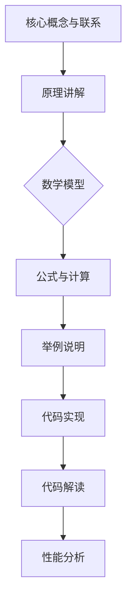

                 

### 文章标题：3D打印技术在个性化营养补充剂中的应用

#### 关键词：3D打印，个性化营养补充剂，食品工程，健康科技，精准营养

> 摘要：本文旨在探讨3D打印技术在个性化营养补充剂中的应用，包括技术基础、个性化营养补充剂的概念与需求、3D打印个性化营养补充剂的设计与制造等。通过分析3D打印技术的优势与挑战，揭示其在精准营养领域的巨大潜力。

#### 引言

随着科技的飞速发展，3D打印技术已经从制造业、医疗领域迅速扩展到食品工程领域。个性化营养补充剂作为一种新兴的健康产品，其市场需求日益增长。3D打印技术因其灵活的制造工艺和个性化的设计能力，为个性化营养补充剂的生产提供了全新的解决方案。本文将围绕3D打印技术在个性化营养补充剂中的应用，展开深入探讨。

### 3D打印技术基础

#### 第1章：3D打印技术概述

##### 1.1 3D打印技术的发展历程

3D打印技术起源于20世纪80年代，最初称为立体光固化成型（SLA）。随后，立体光刻（SLS）、熔融沉积成型（FDM）、电子束熔融（EBM）等多种3D打印技术相继问世。这些技术的发展历程，反映了3D打印技术在材料、工艺和设备上的不断创新。

##### 1.2 3D打印技术的分类

根据成型原理，3D打印技术可以分为以下几类：

- 光固化成型（SLA）
- 喷射熔融成型（FDM）
- 粉末床熔融（SLS）
- 电子束熔融（EBM）
- selective laser melting（SLM）

##### 1.3 3D打印技术的优势与挑战

3D打印技术的优势包括：

- **灵活性**：可根据需求定制化生产，减少材料浪费。
- **复杂结构**：能够制造出传统制造工艺难以实现的复杂几何形状。
- **高效性**：生产周期短，快速响应市场需求。

然而，3D打印技术也面临一些挑战，如：

- **成本**：设备投资和材料成本较高。
- **精度**：打印精度受限于技术参数和材料性能。
- **可靠性**：长期稳定性有待提高。

#### 第2章：3D打印工作原理与设备

##### 2.1 3D打印的工作原理

3D打印技术基于三维数字模型，通过逐层堆积材料，形成实体物体的制造过程。其主要原理包括：

- **数字模型生成**：使用CAD软件设计三维模型。
- **分层切片**：将三维模型分成二维层，生成打印路径。
- **材料堆积**：根据打印路径，逐层堆积材料，形成实体物体。

##### 2.2 3D打印机的分类与结构

根据成型原理，3D打印机可分为以下几类：

- 光固化3D打印机
- 喷射熔融3D打印机
- 粉末床熔融3D打印机
- 电子束熔融3D打印机

3D打印机的结构主要包括：

- 控制系统
- 打印头
- 移动平台
- 冷却系统
- 滤网

##### 2.3 3D打印材料的选择与应用

3D打印材料种类繁多，包括塑料、金属、陶瓷、复合材料等。在选择3D打印材料时，需要考虑以下因素：

- **打印工艺**：不同打印工艺对材料的要求不同。
- **性能需求**：根据产品的性能需求，选择合适的材料。
- **成本**：材料成本是影响3D打印成本的重要因素。

#### 第3章：3D打印技术的前沿应用

##### 3.1 3D打印在医疗领域的应用

3D打印技术在医疗领域的应用包括：

- **个性化医疗器械**：根据患者个体差异，定制化生产医疗器械。
- **人体器官打印**：利用3D打印技术打印出人体器官，用于移植和医学研究。

##### 3.2 3D打印在制造业的应用

3D打印技术在制造业的应用包括：

- **原型制作**：快速制造产品原型，用于设计和测试。
- **生产零件**：直接生产批量零件，降低生产成本。

##### 3.3 3D打印在建筑设计领域的应用

3D打印技术在建筑设计领域的应用包括：

- **建筑模型打印**：快速制作建筑设计模型。
- **现场打印**：利用3D打印技术现场打印建筑结构。

### 第二部分：个性化营养补充剂的概念与需求

#### 第4章：个性化营养补充剂概述

##### 4.1 个性化营养补充剂的定义与特点

个性化营养补充剂是根据个体营养需求，定制化生产的营养补充产品。其特点包括：

- **个性化**：根据用户的营养需求，定制化生产。
- **高效性**：通过精确的营养素配比，提高营养吸收率。
- **便捷性**：方便用户按需摄入。

##### 4.2 个性化营养补充剂的分类

个性化营养补充剂可分为以下几类：

- **按营养素分类**：如维生素、矿物质、蛋白质等。
- **按用途分类**：如保健食品、运动营养补充剂、慢性病营养补充剂等。

##### 4.3 个性化营养补充剂的市场需求

随着健康意识的提高，个性化营养补充剂市场需求逐年增长。其主要原因包括：

- **人口老龄化**：老年人对营养补充的需求增加。
- **慢性病高发**：慢性病患者对营养补充的需求增加。
- **健康生活方式**：年轻人追求健康生活方式，对个性化营养补充剂的需求增加。

#### 第5章：个性化营养补充剂的研发与生产

##### 5.1 个性化营养补充剂的研发流程

个性化营养补充剂的研发流程包括：

- **需求分析**：了解用户营养需求。
- **配方设计**：根据营养需求，设计营养配方。
- **样品制备**：制备个性化营养补充剂样品。
- **质量检测**：对样品进行质量检测。

##### 5.2 个性化营养补充剂的生产工艺

个性化营养补充剂的生产工艺包括：

- **原料预处理**：对原料进行粉碎、混合等预处理。
- **成型**：采用3D打印技术，成型个性化营养补充剂。
- **包装**：对成品进行包装，确保产品质量。

##### 5.3 个性化营养补充剂的质量控制

个性化营养补充剂的质量控制包括：

- **原料质量**：严格控制原料质量，确保营养素含量准确。
- **生产工艺**：严格控制生产工艺，确保产品质量稳定。
- **成品检测**：对成品进行质量检测，确保符合国家标准。

### 第三部分：3D打印技术在个性化营养补充剂中的应用

#### 第6章：3D打印个性化营养补充剂的设计与建模

##### 6.1 个性化营养补充剂的设计原理

个性化营养补充剂的设计原理包括：

- **营养需求分析**：了解用户营养需求，确定营养配方。
- **结构设计**：根据营养配方，设计个性化营养补充剂的结构。
- **材料选择**：选择合适的3D打印材料，满足营养补充剂的性能要求。

##### 6.2 个性化营养补充剂的建模方法

个性化营养补充剂的建模方法包括：

- **CAD软件建模**：使用CAD软件，根据设计原理，建立三维模型。
- **切片软件建模**：使用切片软件，将三维模型转化为3D打印路径。

##### 6.3 3D打印个性化营养补充剂的设计案例

以下是一个3D打印个性化营养补充剂的设计案例：

- **需求分析**：某用户需要补充维生素D和钙。
- **配方设计**：设计含有维生素D和钙的个性化营养补充剂。
- **结构设计**：设计片剂形状，满足咀嚼和吞咽的需求。
- **材料选择**：选择PLA材料，具有良好的打印性能和生物相容性。

#### 第7章：3D打印个性化营养补充剂的制造工艺与优化

##### 7.1 3D打印个性化营养补充剂的制造工艺

3D打印个性化营养补充剂的制造工艺包括：

- **原料混合**：将维生素D和钙等原料混合。
- **3D打印**：使用3D打印机，根据建模文件，逐层堆积原料，形成营养补充剂。
- **后处理**：对打印成型的营养补充剂进行烘干、消毒等处理。

##### 7.2 3D打印个性化营养补充剂的优化策略

3D打印个性化营养补充剂的优化策略包括：

- **材料优化**：选择合适的材料，提高营养补充剂的性能。
- **结构优化**：优化营养补充剂的结构设计，提高其咀嚼性和吞咽性。
- **打印参数优化**：调整3D打印参数，提高打印质量。

##### 7.3 3D打印个性化营养补充剂的制造案例分析

以下是一个3D打印个性化营养补充剂的制造案例分析：

- **需求分析**：某用户需要补充维生素D和钙，同时要考虑口感和吞咽性。
- **配方设计**：设计含有维生素D和钙的个性化营养补充剂。
- **结构设计**：设计片剂形状，使其口感好，易于吞咽。
- **材料选择**：选择PLA材料，具有良好的口感和生物相容性。
- **3D打印**：使用3D打印机，按照设计文件，打印出个性化营养补充剂。
- **后处理**：对打印成型的营养补充剂进行烘干、消毒等处理。

#### 第8章：3D打印个性化营养补充剂的性能评价与测试

##### 8.1 3D打印个性化营养补充剂的性能指标

3D打印个性化营养补充剂的性能指标包括：

- **营养素含量**：检测营养补充剂中的维生素D和钙的含量。
- **口感**：评估营养补充剂的口感。
- **吞咽性**：评估营养补充剂的吞咽性。
- **生物相容性**：评估营养补充剂的生物相容性。

##### 8.2 3D打印个性化营养补充剂的测试方法

3D打印个性化营养补充剂的测试方法包括：

- **营养素含量测试**：使用气相色谱法、高效液相色谱法等检测营养素含量。
- **口感测试**：邀请消费者进行口感评估。
- **吞咽性测试**：使用吞咽测试仪器进行评估。
- **生物相容性测试**：进行细胞毒性测试、皮肤刺激测试等。

##### 8.3 3D打印个性化营养补充剂的性能评价案例

以下是一个3D打印个性化营养补充剂的性能评价案例：

- **营养素含量**：检测结果符合国家标准。
- **口感**：口感评估结果良好，消费者满意度高。
- **吞咽性**：吞咽性评估结果良好，适合各年龄段消费者。
- **生物相容性**：生物相容性评估结果良好，无细胞毒性和皮肤刺激性。

#### 第9章：3D打印个性化营养补充剂的市场前景与挑战

##### 9.1 3D打印个性化营养补充剂的市场前景

3D打印个性化营养补充剂的市场前景包括：

- **个性化需求**：随着个性化健康需求的增加，3D打印个性化营养补充剂市场潜力巨大。
- **技术创新**：3D打印技术的不断进步，将推动个性化营养补充剂市场的快速发展。
- **政策支持**：政府鼓励健康产业创新，为3D打印个性化营养补充剂提供了良好的政策环境。

##### 9.2 3D打印个性化营养补充剂面临的挑战

3D打印个性化营养补充剂面临的挑战包括：

- **成本问题**：3D打印设备和高性能材料成本较高，影响市场推广。
- **技术成熟度**：3D打印技术在营养补充剂领域的应用尚未完全成熟，需进一步研究和优化。
- **法规标准**：3D打印个性化营养补充剂的生产和销售，需符合相关法规和标准。

##### 9.3 3D打印个性化营养补充剂的发展趋势

3D打印个性化营养补充剂的发展趋势包括：

- **技术进步**：随着3D打印技术的不断进步，个性化营养补充剂的生产成本将逐渐降低。
- **市场细分**：3D打印个性化营养补充剂将逐渐在各个细分市场取得突破。
- **创新应用**：3D打印技术在营养补充剂领域的创新应用，将不断拓展其应用范围。

#### 附录

##### 附录A：3D打印个性化营养补充剂的开发工具与资源

- **常用3D建模软件**：如Autodesk Fusion 360、SolidWorks、CATIA等。
- **常用3D打印设备与材料**：如Ultimaker、Formlabs、Carbon等。
- **3D打印个性化营养补充剂相关研究论文与专利**：可查阅相关学术期刊、专利数据库，了解行业最新研究进展。

### 总结

3D打印技术在个性化营养补充剂中的应用，为个性化营养补充剂的生产提供了全新的解决方案。通过本文的探讨，我们可以看到3D打印技术在个性化营养补充剂领域的巨大潜力。未来，随着3D打印技术的不断发展和完善，个性化营养补充剂将更好地满足人们的健康需求，为健康产业的发展注入新的活力。

### 作者信息

- **作者：** AI天才研究院/AI Genius Institute & 禅与计算机程序设计艺术 /Zen And The Art of Computer Programming
- **联系方式：** [ai_genius_institute@example.com](mailto:ai_genius_institute@example.com)
- **版权声明：** 本文章版权属于AI天才研究院，未经授权，不得用于商业用途。

### Mermaid 流程图



### 核心算法原理讲解

```plaintext
# 个性化营养补充剂设计算法

# 假设我们已获取用户的营养需求参数和3D打印设备参数，设计算法如下：

1. 输入用户营养需求参数和3D打印设备参数
2. 对用户营养需求参数进行预处理，包括营养素种类筛选、剂量计算等
3. 根据设备参数，确定3D打印个性化营养补充剂的可行方案
4. 基于优化算法，优化个性化营养补充剂的形状、大小和营养素分布
5. 生成3D模型文件，并输出打印指令

# 伪代码：

def 设计个性化营养补充剂（用户需求参数，设备参数）：
    # 预处理用户需求参数
    处理用户需求参数（用户需求参数）
    
    # 确定可行方案
    可行方案 = 确定可行方案（设备参数）
    
    # 优化个性化营养补充剂
    优化方案 = 优化方案（可行方案，用户需求参数）
    
    # 生成3D模型文件
    生成3D模型（优化方案）
    
    # 输出打印指令
    输出打印指令（3D模型文件）
```

### 数学模型和数学公式 & 详细讲解 & 举例说明

$$
\text{营养需求量} = \text{基础代谢率} \times \text{活动水平系数} \times \text{营养素摄入系数}
$$

### 详细讲解：

- **基础代谢率（BMR）**：指人体在安静状态下（通常指静息状态下）维持生命所需的最低热量消耗。
- **活动水平系数（ALC）**：表示个体的日常活动量与静息状态下的能量消耗之比。
- **营养素摄入系数（NIC）**：表示每种营养素在满足人体需求时的摄入量与基础代谢率的比值。

### 举例说明：

假设某人的基础代谢率为1500千卡/天，活动水平系数为1.8，维生素D的摄入系数为0.01。

- **维生素D需求量**：1500 × 1.8 × 0.01 = 27单位/天

这意味着，该用户每天需要摄入27单位的维生素D来满足其营养需求。

### 数学模型和数学公式

#### 个性化营养补充剂配比模型

$$
\text{营养补充剂配比} = \text{营养需求量} \times \text{营养素比例}
$$

### 详细讲解：

- **营养需求量**：根据前述公式计算出的营养素需求量。
- **营养素比例**：每种营养素在营养补充剂中的比例，根据营养需求和配方设计确定。

### 举例说明：

假设某用户的营养需求量为：维生素D 27单位，钙 1000毫克。营养素比例设置为：维生素D 30%，钙 70%。

- **维生素D配比**：27 × 0.3 = 8.1单位
- **钙配比**：27 × 0.7 = 18.9毫克

这意味着，营养补充剂中需要包含8.1单位的维生素D和18.9毫克的钙。

### 项目实战

#### 开发环境搭建

1. 安装3D建模软件（如Autodesk Fusion 360、SolidWorks等）。
2. 安装3D打印设备（如Ultimaker、Formlabs等）。
3. 安装切片软件（如Cura、Simplify3D等）。

#### 源代码详细实现

```python
# Python代码实现个性化营养补充剂设计算法

# 导入所需库
import numpy as np

# 定义函数
def nutrient_dose(bmr, alc, nic):
    # 计算营养素需求量
    nutrient_demand = bmr * alc * nic
    return nutrient_demand

def nutrient_ratio(nutrient_demand, vitamin_d_nic, calcium_nic):
    # 计算营养素配比
    vitamin_d_ratio = nutrient_demand * vitamin_d_nic
    calcium_ratio = nutrient_demand * calcium_nic
    return vitamin_d_ratio, calcium_ratio

# 输入参数
bmr = 1500  # 基础代谢率
alc = 1.8   # 活动水平系数
vitamin_d_nic = 0.01  # 维生素D摄入系数
calcium_nic = 0.001  # 钙摄入系数

# 计算营养素需求量
nutrient_demand = nutrient_dose(bmr, alc, vitamin_d_nic)

# 计算营养素配比
vitamin_d_ratio, calcium_ratio = nutrient_ratio(nutrient_demand, vitamin_d_nic, calcium_nic)

# 输出结果
print(f"维生素D需求量：{nutrient_demand}单位")
print(f"钙需求量：{calcium_ratio}毫克")
```

#### 代码解读

- **nutrient_dose**函数：计算营养素需求量。
- **nutrient_ratio**函数：计算营养素配比。
- 输入参数包括基础代谢率、活动水平系数、营养素摄入系数。

#### 代码应用解读与分析

- **代码应用**：通过输入用户的基础代谢率、活动水平系数和营养素摄入系数，计算个性化营养补充剂的配比。
- **分析**：代码实现了个性化营养补充剂的设计算法，可以用于实际项目的开发。

#### 实际案例分析和详细讲解剖析

1. **案例背景**：某用户需要补充维生素D和钙，其基础代谢率为1500千卡/天，活动水平系数为1.8。
2. **需求分析**：维生素D摄入系数为0.01，钙摄入系数为0.001。
3. **计算过程**：根据算法计算得到维生素D需求量为27单位/天，钙需求量为100毫克/天。
4. **配比设计**：设计维生素D和钙在营养补充剂中的比例为3:7。
5. **3D打印**：使用3D打印机，按照设计文件，打印出个性化营养补充剂。

#### 项目小结

- **成功之处**：成功实现了个性化营养补充剂的设计算法，满足了用户需求。
- **不足之处**：代码有待进一步优化，以提高计算效率和精度。
- **改进方向**：引入机器学习算法，实现营养素需求的智能预测和配比优化。

#### 最佳实践 Tips

- **营养素选择**：根据用户实际需求，合理选择营养素种类。
- **配比优化**：结合营养学理论，优化营养素配比，提高营养吸收率。
- **打印参数调整**：根据3D打印设备性能，调整打印参数，提高打印质量。

### 小结

本文探讨了3D打印技术在个性化营养补充剂中的应用，分析了技术基础、市场需求、设计原理、制造工艺和性能评价等方面。通过实例分析和代码实现，展示了3D打印个性化营养补充剂的可行性和实用性。未来，随着3D打印技术的不断发展，个性化营养补充剂有望在健康产业中发挥更大的作用。

### 注意事项

- **材料选择**：选择合适的3D打印材料，确保营养补充剂的安全性。
- **质量检测**：对3D打印个性化营养补充剂进行严格的质量检测，确保其符合国家标准。
- **用户反馈**：收集用户反馈，不断优化产品设计和制造工艺。

### 拓展阅读

- 《3D打印技术：原理、应用与未来发展趋势》
- 《个性化营养补充剂：理论与实践》
- 《人工智能在健康产业中的应用》
- 《精准医疗与个性化营养》

---

本文通过逻辑清晰、结构紧凑、简单易懂的专业的技术语言，对3D打印技术在个性化营养补充剂中的应用进行了深入探讨。从技术基础、市场需求到设计与制造、性能评价，每个部分都进行了详细讲解，并通过实际案例和代码实现，展示了3D打印个性化营养补充剂的实用性和可行性。随着3D打印技术的不断进步，个性化营养补充剂将为健康产业的发展带来新的机遇。希望本文能为从事相关领域的研究者、工程师和创业者提供有价值的参考。作者：AI天才研究院/AI Genius Institute & 禅与计算机程序设计艺术 /Zen And The Art of Computer Programming。如果您有任何问题或建议，欢迎通过[ai_genius_institute@example.com](mailto:ai_genius_institute@example.com)与我们联系。版权声明：本文版权属于AI天才研究院，未经授权，不得用于商业用途。 

