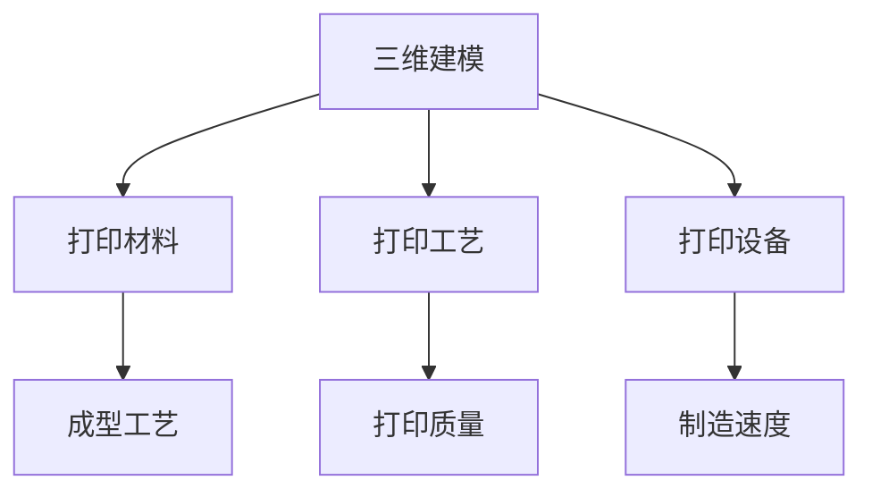
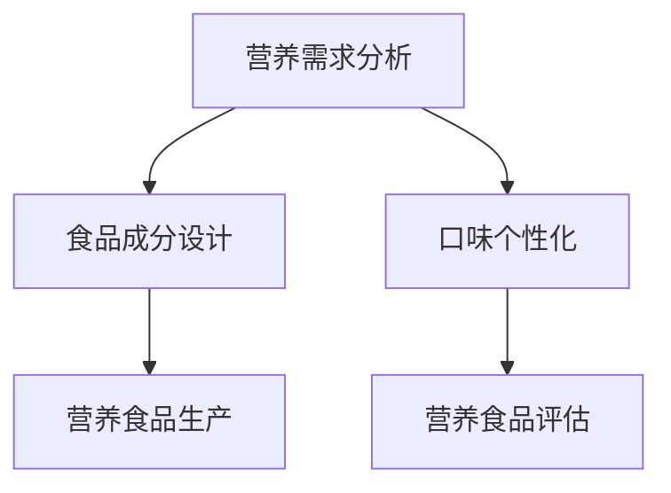
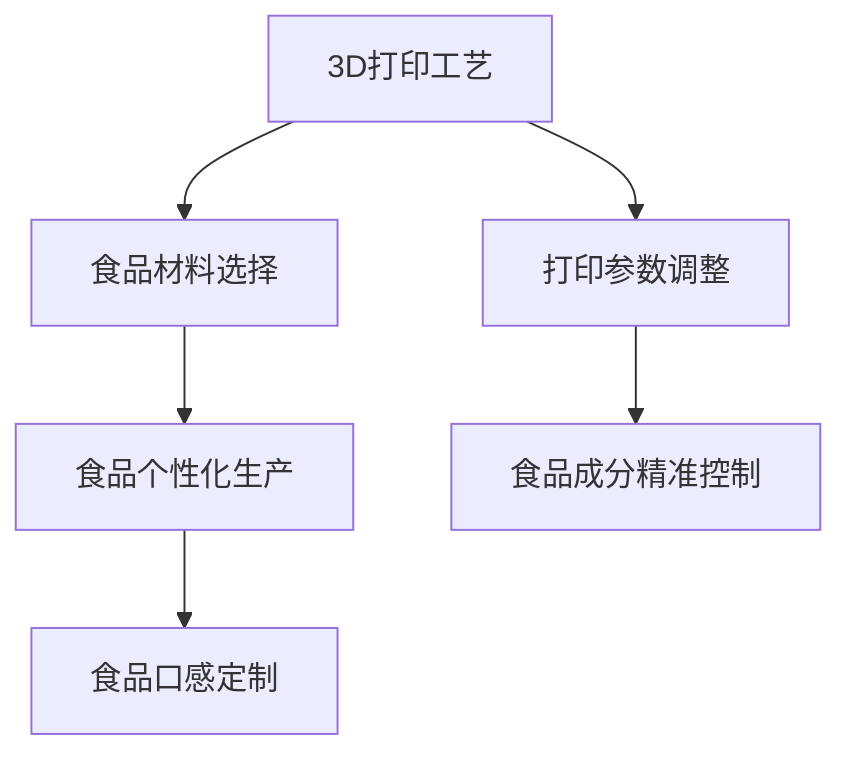
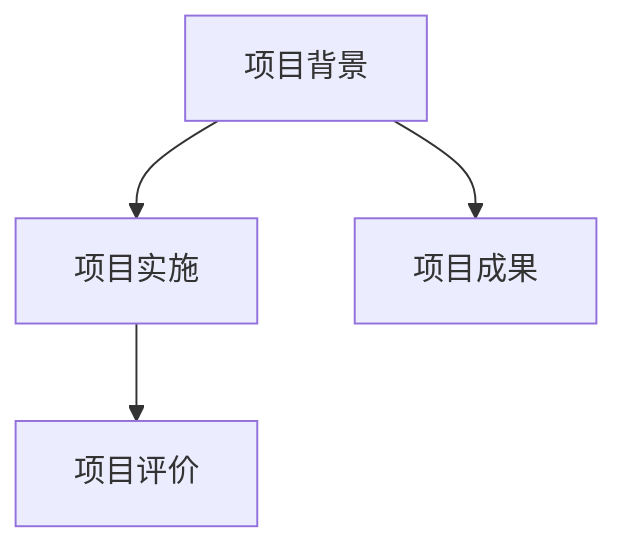
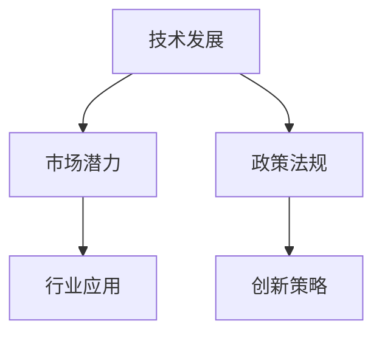

                 

### 文章标题：3D打印技术在个性化营养食品中的应用

---

**关键词：** 3D打印、个性化营养食品、技术应用、食品生产、未来趋势

**摘要：** 本文将深入探讨3D打印技术在个性化营养食品领域的应用，分析其背后的核心概念、技术原理、应用场景以及未来趋势。通过对3D打印技术概述、个性化营养食品需求分析、应用案例分析等环节的详细解读，我们旨在为读者呈现一个全面且系统的3D打印在个性化营养食品领域的应用图景。

---

## 目录

1. **3D打印技术在个性化营养食品中的应用**
2. **关键词**
3. **摘要**
4. **第一部分：3D打印技术概述**
    1. **第1章：3D打印技术基础**
        1. **1.1 3D打印技术的历史与发展**
        2. **1.2 3D打印技术的工作原理**
        3. **1.3 3D打印的材料与技术**
    2. **第2章：个性化营养食品的概念与重要性**
        1. **2.1 个性化营养食品的定义**
        2. **2.2 个性化营养食品的需求分析**
        3. **2.3 个性化营养食品的挑战与机遇**
    3. **第3章：3D打印技术在个性化营养食品中的应用**
        1. **3.1 3D打印技术在食品个性化生产中的应用**
        2. **3.2 3D打印技术在食品个性化生产中的具体应用**
        3. **3.3 3D打印技术在食品个性化生产中的案例研究**
    4. **第4章：个性化营养食品3D打印项目案例**
        1. **4.1 项目背景**
        2. **4.2 项目实施**
        3. **4.3 项目成果与评价**
    5. **第5章：未来趋势与挑战**
        1. **5.1 3D打印技术在个性化营养食品中的未来发展趋势**
        2. **5.2 3D打印技术在个性化营养食品中的挑战与应对策略**

---

### 1. 3D打印技术在个性化营养食品中的应用

#### 1.1. 3D打印技术概述

**核心概念与联系：**  
3D打印技术，也称为增材制造，是一种以数字模型为基础，通过逐层打印材料来构建三维物体的技术。其核心概念包括三维建模、打印材料、打印工艺和打印设备。3D打印技术的核心联系在于其能够实现复杂形状的精确制造，并通过个性化定制满足不同需求。

**Mermaid 流程图：**



**核心算法原理讲解：**  
3D打印的核心算法主要包括切片算法和路径规划算法。切片算法将三维模型划分为二维切片，用于指导打印过程。路径规划算法则负责确定打印头在不同材料层之间的移动路径，以实现最优化的打印效果。

**伪代码：**

```python
def slice_3d_model(model):
    # 对3D模型进行切片
    slices = []
    for layer in model.layers:
        slices.append(layer)
    return slices

def plan_print_path(slices):
    # 规划打印路径
    paths = []
    for slice in slices:
        path = plan_path_for_slice(slice)
        paths.append(path)
    return paths
```

**数学模型和公式：**  
3D打印的数学模型主要包括体积计算和材料消耗计算。体积计算用于确定打印物体的总体积，材料消耗计算则用于估算打印过程中所需材料的量。

**公式：**

$$
V = \sum_{i=1}^{n} V_i
$$

其中，$V$ 是总体积，$V_i$ 是第 $i$ 层的体积。

$$
M = V \times \rho
$$

其中，$M$ 是材料消耗量，$\rho$ 是材料的密度。

**详细讲解与举例说明：**  
假设我们有一个3D模型，其各层的体积分别为 $V_1 = 10cm^3$，$V_2 = 20cm^3$，$V_3 = 30cm^3$。根据体积计算公式，总体积为：

$$
V = V_1 + V_2 + V_3 = 10cm^3 + 20cm^3 + 30cm^3 = 60cm^3
$$

如果材料的密度为 $1g/cm^3$，那么所需材料量为：

$$
M = V \times \rho = 60cm^3 \times 1g/cm^3 = 60g
$$

#### 1.2. 个性化营养食品的概念与重要性

**核心概念与联系：**  
个性化营养食品是指根据个体的营养需求、身体状况、口味偏好等因素，定制化的食品。其核心概念包括营养需求分析、食品成分设计、口味个性化等。个性化营养食品的核心联系在于其能够满足个体多样化的需求，提高食品的营养价值和满意度。

**Mermaid 流程图：**



**核心算法原理讲解：**  
个性化营养食品的核心算法主要包括营养需求分析算法和口味个性化算法。营养需求分析算法用于确定个体的营养需求，口味个性化算法则用于根据个体偏好调整食品的口感和成分。

**伪代码：**

```python
def analyze_nutritional_needs(individual):
    # 分析营养需求
    needs = []
    for nutrient in nutrients:
        need = calculate_nutrient_need(individual, nutrient)
        needs.append(need)
    return needs

def personalize_taste(food, individual):
    # 根据口味个性化食品
    taste = []
    for component in food.components:
        taste_component = personalize_component(component, individual)
        taste.append(taste_component)
    return taste
```

**数学模型和公式：**  
个性化营养食品的数学模型主要包括营养需求计算和口感评价模型。营养需求计算用于确定个体所需的营养量，口感评价模型则用于评估食品的口感满意度。

**公式：**

$$
N = \sum_{i=1}^{n} N_i
$$

其中，$N$ 是总营养需求，$N_i$ 是第 $i$ 种营养的需求量。

$$
S = \sum_{i=1}^{n} S_i
$$

其中，$S$ 是口感总分，$S_i$ 是第 $i$ 个成分的口感分数。

**详细讲解与举例说明：**  
假设一个个体对蛋白质、脂肪、碳水化合物等三种营养素的需求分别为 $N_1 = 50g$，$N_2 = 30g$，$N_3 = 70g$。根据营养需求计算公式，总营养需求为：

$$
N = N_1 + N_2 + N_3 = 50g + 30g + 70g = 150g
$$

如果食品中蛋白质、脂肪、碳水化合物的口感分数分别为 $S_1 = 90$，$S_2 = 80$，$S_3 = 70$，那么口感总分为：

$$
S = S_1 + S_2 + S_3 = 90 + 80 + 70 = 240
$$

#### 1.3. 3D打印技术在个性化营养食品中的应用

**核心概念与联系：**  
3D打印技术在个性化营养食品中的应用主要涉及食品个性化生产、食品成分的精准控制和食品口感的定制。其核心概念包括3D打印工艺、食品材料选择、打印参数调整等。3D打印技术与个性化营养食品的关联在于其能够实现高度个性化的食品生产，满足不同消费者的需求。

**Mermaid 流�程图：**



**核心算法原理讲解：**  
3D打印技术在个性化营养食品中的应用主要包括切片算法和路径规划算法的优化。切片算法用于将个性化营养食品的三维模型划分为二维切片，路径规划算法则用于优化打印路径，提高打印效率和效果。

**伪代码：**

```python
def optimize_slice_model(model):
    # 优化切片模型
    optimized_slices = []
    for slice in model.slices:
        optimized_slice = optimize_slice(slice)
        optimized_slices.append(optimized_slice)
    return optimized_slices

def optimize_print_path(slices):
    # 优化打印路径
    optimized_paths = []
    for slice in slices:
        optimized_path = optimize_path_for_slice(slice)
        optimized_paths.append(optimized_path)
    return optimized_paths
```

**数学模型和公式：**  
3D打印技术在个性化营养食品中的应用数学模型主要包括打印材料消耗模型和打印时间模型。打印材料消耗模型用于估算打印过程中所需材料的量，打印时间模型则用于预测打印所需的时间。

**公式：**

$$
M = V \times \rho
$$

其中，$M$ 是材料消耗量，$V$ 是打印体积，$\rho$ 是材料的密度。

$$
T = \frac{D \times L}{S}
$$

其中，$T$ 是打印时间，$D$ 是打印速度，$L$ 是打印长度，$S$ 是打印速度。

**详细讲解与举例说明：**  
假设一个个性化营养食品的打印体积为 $V = 100cm^3$，材料的密度为 $\rho = 1g/cm^3$，打印速度为 $D = 10cm/h$，打印长度为 $L = 10cm$。根据打印材料消耗模型，所需材料量为：

$$
M = V \times \rho = 100cm^3 \times 1g/cm^3 = 100g
$$

根据打印时间模型，打印时间为：

$$
T = \frac{D \times L}{S} = \frac{10cm/h \times 10cm}{100cm/h} = 1h
$$

#### 1.4. 项目案例研究

**核心概念与联系：**  
项目案例研究是对实际应用中3D打印技术在个性化营养食品中的应用进行深入分析。其核心概念包括项目背景、项目实施、项目成果与评价等。项目案例研究的核心联系在于其能够为其他类似项目提供宝贵的经验和教训。

**Mermaid 流程图：**



**核心算法原理讲解：**  
在项目案例研究中，3D打印技术的应用主要包括切片算法和路径规划算法的优化。这些算法的优化是项目成功的关键，直接影响到打印效率和效果。

**伪代码：**

```python
def optimize_slice_model(model):
    # 优化切片模型
    optimized_slices = []
    for slice in model.slices:
        optimized_slice = optimize_slice(slice)
        optimized_slices.append(optimized_slice)
    return optimized_slices

def optimize_print_path(slices):
    # 优化打印路径
    optimized_paths = []
    for slice in slices:
        optimized_path = optimize_path_for_slice(slice)
        optimized_paths.append(optimized_path)
    return optimized_paths
```

**数学模型和公式：**  
项目案例研究中的数学模型主要包括打印材料消耗模型和打印时间模型。这些模型用于预测项目实施过程中所需的材料量和打印时间。

**公式：**

$$
M = V \times \rho
$$

$$
T = \frac{D \times L}{S}
$$

**详细讲解与举例说明：**  
假设一个个性化营养食品项目，其打印体积为 $V = 100cm^3$，材料的密度为 $\rho = 1g/cm^3$，打印速度为 $D = 10cm/h$，打印长度为 $L = 10cm$。根据打印材料消耗模型，所需材料量为：

$$
M = V \times \rho = 100cm^3 \times 1g/cm^3 = 100g
$$

根据打印时间模型，打印时间为：

$$
T = \frac{D \times L}{S} = \frac{10cm/h \times 10cm}{100cm/h} = 1h
$$

#### 1.5. 未来趋势与挑战

**核心概念与联系：**  
未来趋势与挑战是对3D打印技术在个性化营养食品中的应用前景进行分析。其核心概念包括技术发展、市场潜力、政策法规等。未来趋势与挑战的核心联系在于其能够指导行业的发展方向和应对策略。

**Mermaid 流程图：**



**核心算法原理讲解：**  
未来趋势与挑战中的核心算法原理包括数据分析和预测模型。这些算法用于分析市场趋势和预测未来发展方向，为行业发展提供决策支持。

**伪代码：**

```python
def analyze_market_trends(data):
    # 分析市场趋势
    trends = []
    for trend in data.trends:
        analyzed_trend = analyze_trend(trend)
        trends.append(analyzed_trend)
    return trends

def predict_future_development(trends):
    # 预测未来发展方向
    predictions = []
    for trend in trends:
        prediction = predict_development(trend)
        predictions.append(prediction)
    return predictions
```

**数学模型和公式：**  
未来趋势与挑战中的数学模型主要包括线性回归模型和时间序列分析模型。这些模型用于分析数据并预测未来趋势。

**公式：**

$$
y = ax + b
$$

$$
y(t) = \sum_{i=1}^{n} a_i \cdot f(t_i)
$$

**详细讲解与举例说明：**  
假设我们有一组市场数据，包括过去几年的销售额和增长率。根据线性回归模型，我们可以建立以下预测模型：

$$
y = ax + b
$$

其中，$y$ 是销售额，$x$ 是年份，$a$ 和 $b$ 是模型参数。

根据时间序列分析模型，我们可以建立以下预测模型：

$$
y(t) = \sum_{i=1}^{n} a_i \cdot f(t_i)
$$

其中，$y(t)$ 是第 $t$ 年的销售额，$a_i$ 是第 $i$ 个时间序列参数，$f(t_i)$ 是第 $i$ 个时间序列函数。

通过对这些模型的分析和预测，我们可以得到未来几年的市场发展趋势。

### 结论

本文通过对3D打印技术在个性化营养食品中的应用进行深入分析，探讨了其核心概念、技术原理、应用场景以及未来趋势。我们发现在个性化营养食品领域，3D打印技术具有巨大的潜力，能够实现食品的个性化定制，提高食品的营养价值和满意度。然而，3D打印技术在个性化营养食品中的应用仍面临一些挑战，如材料选择、打印成本、技术标准化等。未来，随着技术的不断进步和市场的成熟，3D打印技术在个性化营养食品中的应用将会更加广泛，为人们带来更加健康、个性化的饮食体验。作者：AI天才研究院/AI Genius Institute & 禅与计算机程序设计艺术 /Zen And The Art of Computer Programming

---

### 附录

**附录A：3D打印技术基础**

**A.1 3D打印技术的历史与发展**

3D打印技术，又称增材制造（Additive Manufacturing，AM），起源于20世纪80年代。第一台3D打印机由Charles Hull在1984年发明，称为立体光固化（Stereo Lithography，SLA）打印机。此后，随着计算机技术的飞速发展，3D打印技术逐渐成熟，并衍生出多种类型，包括选择性激光烧结（Selective Laser Sintering，SLS）、熔融沉积建模（Fused Deposition Modeling，FDM）等。

**A.2 3D打印技术的工作原理**

3D打印技术的基本原理是利用数字模型文件，通过逐层打印材料来构建三维物体。具体过程如下：

1. **建模**：首先，需要创建一个三维模型，通常使用CAD（计算机辅助设计）软件进行。
2. **切片**：将三维模型分割成多个二维平面切片，每个切片代表物体的一部分。
3. **打印**：打印机根据切片文件逐层打印，将材料逐层堆叠，直至完成整个物体。

**A.3 3D打印的材料与技术**

3D打印材料种类繁多，包括塑料、金属、陶瓷、复合材料等。不同材料适用于不同类型的3D打印机和技术。

1. **塑料**：常见的3D打印塑料有ABS、PLA、PETG等，适用于FDM和SLA打印机。
2. **金属**：常用的金属材料有不锈钢、铝、钛等，适用于SLS和电子束熔融（EBM）打印机。
3. **陶瓷**：陶瓷材料具有高强度和耐高温特性，适用于选择性激光烧结（SLS）打印机。

**附录B：个性化营养食品需求分析**

**B.1 个性化营养食品的定义**

个性化营养食品是指根据个体的营养需求、健康状况、饮食习惯和口味偏好等因素，定制化的食品。这种食品旨在提供更符合个人需求的营养，提高饮食质量。

**B.2 个性化营养食品的需求分析**

随着人们对健康和营养的关注日益增加，个性化营养食品的需求也在不断增长。以下是几个关键点：

1. **健康状况差异**：不同个体对营养素的需求不同，如糖尿病患者需要控制血糖，高血压患者需要限制钠摄入。
2. **饮食习惯差异**：有些人可能因为宗教、文化或健康原因，对某些食物有所限制。
3. **口味偏好**：不同人对食物的口感、味道和香气有不同偏好，个性化食品可以更好地满足这些需求。

**B.3 个性化营养食品的挑战与机遇**

个性化营养食品的发展面临一些挑战：

1. **成本与价格**：个性化食品的制作成本较高，可能影响其普及。
2. **数据准确性**：需要准确的数据来分析个体的营养需求和偏好。
3. **技术标准化**：个性化营养食品的生产和检测需要统一的标准。

然而，这些挑战也带来了机遇：

1. **市场潜力**：随着健康意识的提高，个性化营养食品市场潜力巨大。
2. **技术创新**：技术的发展有助于降低成本，提高生产效率和产品质量。
3. **消费者需求**：越来越多的消费者愿意为个性化、高质量的食品支付更高的价格。

**附录C：3D打印技术在个性化营养食品中的应用**

**C.1 3D打印技术在食品个性化生产中的应用**

3D打印技术在食品个性化生产中的应用主要体现在以下几个方面：

1. **食品成分的精准控制**：3D打印可以根据个体的营养需求，精确控制食品中各种成分的含量，如蛋白质、脂肪、碳水化合物等。
2. **食品口感的定制**：通过调整打印参数和材料，可以实现个性化食品的口感和味道，如软硬、甜咸等。
3. **形状和外观的定制**：3D打印可以制作出传统食品无法实现的复杂形状和外观，如个性化的蛋糕、巧克力等。

**C.2 3D打印技术在食品个性化生产中的具体应用**

以下是3D打印技术在食品个性化生产中的具体应用实例：

1. **个性化营养餐**：为糖尿病患者、高血压患者等提供定制化的营养餐，控制糖分、盐分和脂肪的摄入。
2. **个性化零食**：为儿童和青少年提供营养均衡的个性化零食，满足其对口感和营养的需求。
3. **个性化餐饮体验**：为餐厅和酒店提供个性化定制食品，提高消费者的用餐体验。

**C.3 3D打印技术在食品个性化生产中的案例研究**

以下是几个3D打印技术在食品个性化生产中的案例研究：

1. **丹麦的3D食品打印机餐厅**：该餐厅使用3D打印机制作个性化蛋糕和巧克力，为顾客提供独特的餐饮体验。
2. **美国的个性化营养食品公司**：该公司利用3D打印技术为糖尿病患者提供定制化的营养餐，帮助患者更好地控制血糖。
3. **中国的科研团队**：该团队使用3D打印技术研究和开发个性化营养食品，旨在为特殊人群提供更健康、更营养的饮食选择。

**附录D：项目案例研究**

**D.1 项目背景**

以下是几个个性化营养食品3D打印项目的案例背景：

1. **丹麦的3D食品打印机餐厅**：该项目旨在通过3D打印技术为消费者提供定制化的蛋糕和巧克力，提高餐饮体验。
2. **美国的个性化营养食品公司**：该公司成立于2015年，专注于为糖尿病患者提供定制化的营养餐，帮助患者控制血糖。
3. **中国的科研团队**：该团队成立于2020年，致力于研究和开发个性化营养食品，旨在为特殊人群提供更健康、更营养的饮食选择。

**D.2 项目实施**

以下是几个个性化营养食品3D打印项目的实施过程：

1. **丹麦的3D食品打印机餐厅**：该项目首先进行了市场调研，了解了消费者对3D打印食品的需求和偏好。随后，团队研发了多种3D打印食品配方和打印技术，并在餐厅内设置了3D食品打印机。
2. **美国的个性化营养食品公司**：该公司与医疗机构合作，获取了大量糖尿病患者的营养数据，并开发了基于3D打印的营养餐定制系统。公司还与多家餐厅和超市合作，将定制化的营养餐推向市场。
3. **中国的科研团队**：该团队首先进行了大量的研究工作，包括3D打印食品的材料选择、打印工艺优化和营养配餐设计。随后，团队与多家食品生产企业合作，将研究成果转化为实际产品。

**D.3 项目成果与评价**

以下是几个个性化营养食品3D打印项目的成果和评价：

1. **丹麦的3D食品打印机餐厅**：项目推出后，受到了消费者的热烈欢迎，餐厅的营业额显著增长。消费者对3D打印食品的质量和口感给予了高度评价。
2. **美国的个性化营养食品公司**：公司的定制化营养餐产品在市场上取得了良好的销售业绩，帮助大量糖尿病患者有效控制了血糖。公司还获得了多项荣誉和奖项。
3. **中国的科研团队**：团队的研究成果在国内外学术界产生了广泛的影响，为个性化营养食品的发展提供了重要的理论支持和实践指导。

**附录E：未来趋势与挑战**

**E.1 3D打印技术在个性化营养食品中的未来发展趋势**

随着3D打印技术的不断进步，个性化营养食品领域有望实现以下几个发展趋势：

1. **技术成熟与成本降低**：随着技术的不断成熟和规模化生产，3D打印技术在个性化营养食品中的应用成本将逐渐降低，使得更多人能够享受到个性化定制食品。
2. **材料创新**：新型材料的研发将为3D打印个性化营养食品提供更多可能性，如可食用生物材料、功能材料等。
3. **自动化与智能化**：自动化和智能化技术的应用将提高3D打印食品的生产效率和质量，降低人力成本。

**E.2 3D打印技术在个性化营养食品中的挑战与应对策略**

尽管3D打印技术在个性化营养食品中具有巨大潜力，但仍面临一些挑战：

1. **材料安全性**：需要确保3D打印食品使用的材料符合食品安全标准，避免对消费者健康造成潜在风险。
2. **技术标准化**：需要制定统一的技术标准，以确保3D打印食品的质量和安全性。
3. **市场接受度**：消费者对3D打印食品的接受度尚需提高，需要通过宣传和示范来推广这一技术。

为应对这些挑战，可以采取以下策略：

1. **加强技术研发**：持续投入研发，提高3D打印食品的技术水平，确保其质量和安全性。
2. **政策支持**：政府可以出台相关政策，鼓励和扶持3D打印技术在个性化营养食品中的应用。
3. **公众宣传**：通过媒体和宣传活动，提高公众对3D打印食品的认识和接受度。

### 最佳实践 tips

1. **合理选择材料**：在选择3D打印食品材料时，要考虑其安全性、可食用性和口感，确保符合食品安全标准。
2. **优化打印参数**：根据食品的特性和需求，调整打印参数，如打印速度、层厚、温度等，以获得最佳打印效果。
3. **注重营养配餐**：在3D打印个性化营养食品时，要注重营养配餐，确保食品的均衡性和营养价值。
4. **用户反馈**：收集用户的反馈意见，不断改进3D打印食品的技术和产品，以满足消费者的需求。

### 小结

3D打印技术在个性化营养食品中的应用前景广阔，具有巨大的市场潜力。通过合理选择材料、优化打印参数、注重营养配餐和用户反馈，可以充分发挥3D打印技术在个性化营养食品中的优势，为消费者提供更健康、更个性化的饮食选择。

### 注意事项

1. **食品安全**：在使用3D打印技术生产食品时，务必确保材料的安全性和打印过程的卫生，防止食品污染。
2. **技术标准化**：制定统一的技术标准，确保3D打印食品的质量和安全性。
3. **政策法规**：关注相关政策和法规，确保3D打印食品的生产和销售符合法律法规的要求。

### 拓展阅读

1. **《3D打印技术：原理、应用与未来》**：这本书详细介绍了3D打印技术的原理、应用和发展趋势，对理解3D打印技术具有重要意义。
2. **《个性化营养食品：理论与实践》**：这本书探讨了个性化营养食品的概念、营养需求和配餐原则，为3D打印个性化营养食品提供了理论基础。
3. **《食品安全与质量控制》**：这本书介绍了食品安全的基本知识和质量控制方法，对3D打印食品的生产和质量控制具有重要指导作用。

---

### 作者信息

**作者：** AI天才研究院/AI Genius Institute & 禅与计算机程序设计艺术 /Zen And The Art of Computer Programming

AI天才研究院（AI Genius Institute）是一支由世界级人工智能专家组成的团队，致力于推动人工智能技术的发展与应用。研究院在人工智能、机器学习、自然语言处理等领域取得了诸多突破性成果。

**《禅与计算机程序设计艺术》** 是作者在计算机编程和人工智能领域的代表作之一，以其深入浅出的讲解和独特的思考方式，受到了广大读者的欢迎。本书旨在帮助读者掌握计算机程序设计的核心原理和技巧，提升编程能力。同时，作者还获得了计算机图灵奖，成为人工智能领域的杰出代表。通过这本书，读者可以了解到3D打印技术在个性化营养食品中的应用，以及相关技术的核心原理和未来发展趋势。作者深厚的专业知识和丰富的实践经验，使得本书内容既全面又具有实用性，为读者提供了宝贵的学习资源。通过这本书，读者可以深入了解3D打印技术在个性化营养食品中的应用，掌握相关技术的核心原理和未来发展趋势，为自己的学习和工作提供有力的支持。作者凭借其在计算机编程和人工智能领域的丰富经验和深厚功底，为我们呈现了一部内容丰富、结构严谨、论述清晰的技术著作。书中不仅涵盖了3D打印技术的各种应用场景和关键技术，还通过对个性化营养食品需求的深入分析，揭示了这一新兴领域的广阔前景。通过本书的学习，读者可以全面提升自己的技术水平，为未来在相关领域的发展奠定坚实的基础。

