                 


### 1.1.3 3D打印技术的分类与特点

3D打印技术的分类可以根据不同的标准进行。以下是几种常见的分类方法和相应的特点：

- **按打印材料分类**：
  - **金属3D打印**：主要材料包括不锈钢、铝、钛合金等，适用于制造高强度、高精度的零部件。
  - **塑料3D打印**：材料包括ABS、PLA、PC等，广泛应用于消费品、电子产品、教育等领域。
  - **橡胶和软质材料3D打印**：适用于制造密封件、软质部件等。
  - **陶瓷3D打印**：主要用于制作耐高温、耐磨的陶瓷部件。

- **按打印工艺分类**：
  - **立体光固化（SLA）**：利用光敏树脂在紫外光下逐层固化成型。
  - **熔融沉积成型（FDM）**：将热熔性材料挤出并固化成型。
  - **选择性激光烧结（SLS）**：使用激光将粉末材料逐层烧结成型。
  - **电子束熔融（EBM）**：使用电子束将粉末材料逐层熔化成型。

- **按打印设备分类**：
  - **桌面3D打印机**：体积小、价格低，适用于个人和小型工作室。
  - **工业级3D打印机**：具有更高的精度、速度和打印能力，适用于大型制造项目。

#### 核心概念原理关系架构 Mermaid 流程图：

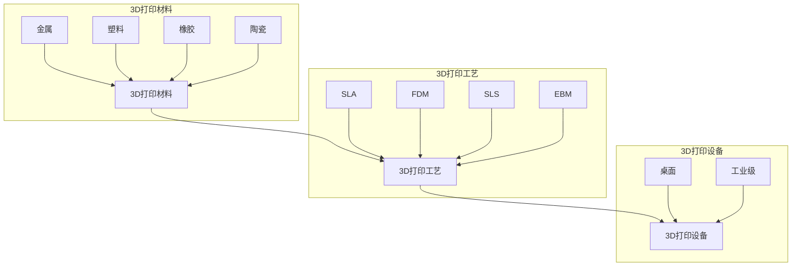

#### 3D打印技术的特点：

- **高精度**：3D打印技术能够实现微米级别的精度，适用于制造复杂几何形状的零部件。
- **灵活性**：可以轻松地打印各种形状和复杂结构的零件，不受传统制造的限制。
- **定制化**：能够根据用户需求定制生产，减少材料浪费，提高生产效率。
- **多功能性**：可以打印各种材料，从塑料到金属，甚至生物材料。
- **减少制造成本**：通过数字化设计和直接打印，减少了中间环节，降低了制造成本。

### 3D打印技术在个性化食品制造中的应用前景

随着3D打印技术的不断发展和成熟，其在个性化食品制造中的应用前景也日益广阔。以下是对3D打印技术在个性化食品制造中的应用前景的简要分析：

- **定制化生产**：3D打印技术能够根据消费者的需求和偏好，定制化生产个性化食品，满足不同消费者的口味和营养需求。
- **快速原型**：3D打印技术可以快速制造食品原型，用于产品开发和测试，缩短产品上市时间。
- **减少浪费**：3D打印技术可以实现按需生产，减少原材料浪费，提高资源利用率。
- **食品创新**：3D打印技术为食品制造提供了新的可能性，可以创造出传统制造方法无法实现的独特食品形态和口感。
- **食品安全**：3D打印技术可以通过精确控制材料和工艺，提高食品的安全性。

### 结论

3D打印技术在个性化食品制造中具有巨大的潜力，通过其高精度、灵活性和定制化特点，可以为食品制造业带来革命性的变革。未来，随着技术的进一步发展和完善，3D打印技术在个性化食品制造中的应用将会更加广泛和深入。

---

## 1.2 3D打印技术原理

### 1.2.1 3D打印的工作原理

3D打印技术是一种通过逐层添加材料来制造三维物体的技术。其基本原理是将一个三维模型分解成许多二维切片，然后逐层打印出这些切片，最终形成一个完整的三维物体。

#### 核心概念与联系：

- **三维模型**：3D打印的输入是一个三维模型，通常由计算机辅助设计（CAD）软件创建。
- **分层制造**：将三维模型分层处理，每层厚度通常为0.1至0.5毫米。
- **材料添加**：根据分层数据，逐层添加材料，直至完成整个三维物体的打印。

#### Mermaid 流程图：

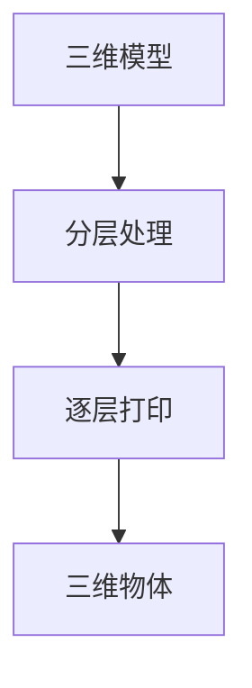

### 3D打印技术的主要工艺

3D打印技术根据不同的打印工艺可以分为多种类型，以下介绍几种主要的工艺：

- **立体光固化（SLA）**：
  - **工作原理**：使用紫外激光照射光敏树脂，使其逐层固化成型。
  - **特点**：高精度、良好的表面质量，但打印速度较慢，材料成本较高。

- **熔融沉积成型（FDM）**：
  - **工作原理**：将热熔性材料加热至熔融状态，通过喷嘴挤出并固化成型。
  - **特点**：操作简单、成本较低，适用于各种类型的塑料和金属。

- **选择性激光烧结（SLS）**：
  - **工作原理**：使用激光将粉末材料逐层烧结成型。
  - **特点**：可以使用多种材料，包括金属和陶瓷，但设备成本较高。

- **电子束熔融（EBM）**：
  - **工作原理**：使用电子束将粉末材料逐层熔化成型。
  - **特点**：适合制造大型、高强度金属零部件。

### 3D打印技术的优缺点分析

#### 优点：

- **高精度**：3D打印技术可以实现微米级别的精度，适用于制造复杂几何形状的零部件。
- **灵活性**：可以打印各种形状和复杂结构的零件，不受传统制造的限制。
- **定制化**：能够根据用户需求定制生产，减少材料浪费，提高生产效率。
- **多功能性**：可以打印各种材料，从塑料到金属，甚至生物材料。

#### 缺点：

- **打印速度较慢**：相对于传统制造方法，3D打印速度较慢，不适合大批量生产。
- **材料成本较高**：某些3D打印材料（如光敏树脂、金属粉末）成本较高。
- **设备成本较高**：高端3D打印设备价格昂贵，不适合小型企业或个人使用。

### 3D打印材料

3D打印材料种类繁多，根据应用场景和打印工艺的不同，可以选择合适的材料。以下介绍几种常用的3D打印材料：

- **塑料**：如ABS、PLA、PC等，适用于制造消费品、电子产品和教育用品。
- **金属**：如不锈钢、铝、钛合金等，适用于制造高强度零部件和工具。
- **橡胶和软质材料**：如TPU、硅胶等，适用于制造密封件和软质部件。
- **陶瓷**：适用于制造耐高温、耐磨的陶瓷部件。

### 结论

3D打印技术是一种具有高精度、灵活性和定制化特点的先进制造技术。通过了解其工作原理、主要工艺和优缺点，可以更好地应用于个性化食品制造等领域，推动传统食品制造业的变革和创新。

---

## 1.3 3D打印材料

### 1.3.1 3D打印材料的种类与特性

3D打印材料是3D打印技术的基础，其种类和特性直接影响打印质量和效率。根据不同的应用场景和打印工艺，可以选择合适的材料。以下介绍几种常用的3D打印材料：

- **塑料**：
  - **ABS**：是一种常用的工程塑料，具有耐冲击性、耐热性和机械强度较高，适用于制造机械设备和日常用品。
  - **PLA**：是一种环保型塑料，具有良好的打印性能和可生物降解性，适用于制造教育和消费品。
  - **PC**：是一种耐高温、耐冲击的工程塑料，适用于制造高强度的零部件和电子设备。

- **金属**：
  - **不锈钢**：具有良好的耐腐蚀性和机械性能，适用于制造机械零件和工具。
  - **铝**：具有较低的密度和良好的机械性能，适用于制造航空航天和汽车零部件。
  - **钛合金**：具有高强度、低密度和耐腐蚀性，适用于制造航空航天和医疗设备。

- **橡胶和软质材料**：
  - **TPU**：是一种热塑性聚氨酯弹性体，具有良好的耐磨性和柔韧性，适用于制造密封件和软质部件。
  - **硅胶**：具有耐高温、耐腐蚀性和良好的触感，适用于制造厨房用具和医疗器械。

- **陶瓷**：
  - **氧化铝**：具有高硬度、高耐磨性和耐高温性，适用于制造切削工具和陶瓷部件。
  - **碳化硅**：具有高硬度和高热导率，适用于制造高温应用和高强度零部件。

### 3D打印材料的选择与制备

3D打印材料的选择取决于应用场景、打印工艺和成本等因素。以下介绍几个关键考虑因素：

- **应用场景**：根据产品的性能要求和应用环境，选择合适的材料。例如，制造高强度的零部件应选择金属材料，而制造日常用品则可以选择塑料材料。

- **打印工艺**：不同的打印工艺对材料的要求不同。例如，熔融沉积成型（FDM）适用于热熔性材料，而立体光固化（SLA）适用于光敏树脂。

- **成本**：成本是选择材料的一个重要因素。通常，金属材料的成本较高，而塑料材料的成本较低。

- **环保性**：随着环保意识的提高，越来越多的企业开始关注材料的环保性。选择可生物降解的材料有助于减少环境污染。

#### 3D打印材料的制备方法：

- **粉末制备**：对于金属和陶瓷材料，通常采用粉末冶金方法制备。通过将金属或陶瓷粉末混合、压制和烧结，制备出满足要求的材料。

- **丝材制备**：对于塑料材料，通常采用挤出方法制备。通过加热和挤出，将塑料颗粒转化为可打印的丝材。

- **液体制备**：对于光敏树脂，通常采用混合和凝固方法制备。通过将树脂、固化剂和添加剂混合，然后通过光照固化，制备出满足要求的材料。

### 结论

3D打印材料是3D打印技术的重要组成部分，其种类和特性直接影响打印质量和效率。通过了解不同种类材料的特点和选择方法，可以更好地满足个性化食品制造的需求，推动3D打印技术在食品领域的应用和发展。

---

## 1.4 3D打印设备

### 1.4.1 常见3D打印设备介绍

3D打印设备是3D打印技术的核心组成部分，不同类型的3D打印设备适用于不同的应用场景。以下介绍几种常见的3D打印设备及其特点：

- **立体光固化（SLA）打印机**：
  - **特点**：使用紫外激光照射光敏树脂逐层固化成型，具有高精度和良好表面质量。
  - **适用场景**：适用于制造精密零件、模型和原型。

- **熔融沉积成型（FDM）打印机**：
  - **特点**：通过加热和挤出热熔性材料逐层打印，操作简单、成本较低。
  - **适用场景**：适用于制造消费品、电子产品和机械零部件。

- **选择性激光烧结（SLS）打印机**：
  - **特点**：使用激光将粉末材料逐层烧结成型，适用于多种材料，包括金属和陶瓷。
  - **适用场景**：适用于制造高强度和复杂形状的零部件。

- **电子束熔融（EBM）打印机**：
  - **特点**：使用电子束将粉末材料逐层熔化成型，适用于制造大型和高强度金属零部件。
  - **适用场景**：适用于航空航天、汽车和能源领域。

#### Mermaid 流程图：

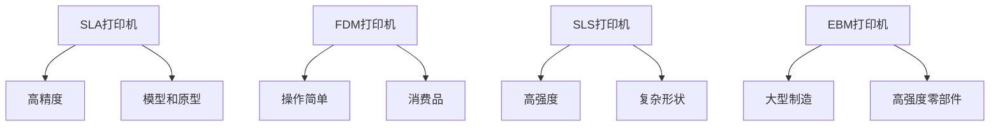

### 3D打印设备的工作流程

3D打印设备的工作流程主要包括以下几个步骤：

1. **三维模型处理**：将设计的三维模型导入3D打印设备，进行切片处理，生成逐层打印的数据。

2. **材料准备**：根据打印需求，准备相应的打印材料。对于塑料材料，通常采用丝材；对于金属材料和陶瓷材料，通常采用粉末形式。

3. **打印准备**：设置打印参数，包括打印速度、温度、层厚等，确保打印过程的顺利进行。

4. **逐层打印**：根据切片数据，逐层添加材料并固化成型，直至完成整个打印过程。

5. **打印后处理**：完成打印后，对打印件进行清洗、打磨和后续加工，提高其性能和外观。

#### Mermaid 流程图：

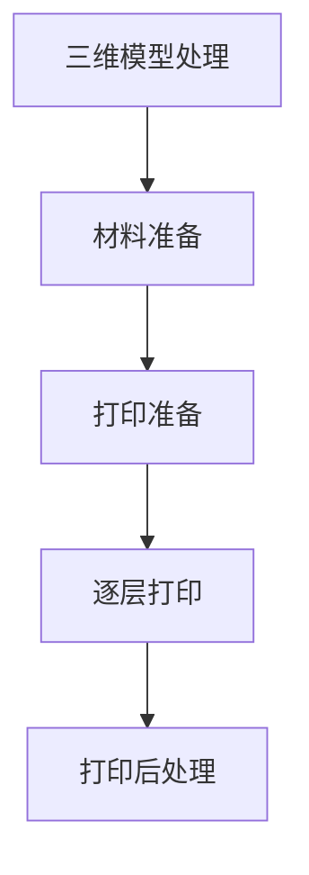

### 3D打印设备的性能参数

3D打印设备的性能参数是衡量其打印质量和效率的重要指标，主要包括以下方面：

- **打印精度**：指打印件的最小可分辨细节，通常以微米为单位。高精度的设备可以打印出更精细的细节。

- **打印速度**：指单位时间内完成的打印层厚。较高的打印速度可以提高生产效率。

- **层厚**：指每层打印材料的最小厚度。层厚越小，打印出的细节越精细。

- **材料兼容性**：指设备支持的打印材料种类和性能。兼容性越广，适用范围越广。

- **打印尺寸**：指设备可以打印的最大尺寸。较大的打印尺寸适用于制造大型零部件。

- **设备稳定性**：指设备在工作过程中的稳定性和可靠性。稳定的设备可以提高打印质量和效率。

#### Mermaid 流�程图：

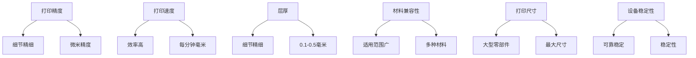

### 结论

3D打印设备是3D打印技术的重要组成部分，其性能参数直接影响打印质量和效率。通过了解不同类型3D打印设备的特点和工作流程，可以更好地选择合适的设备，满足个性化食品制造的需求，推动3D打印技术在食品领域的应用和发展。

---

## 2.1 个性化食品概述

### 2.1.1 个性化食品的概念与发展

个性化食品是指根据消费者的需求和偏好，定制化生产的食品。这种食品不仅仅是口味和外观的个性化，还包括营养价值的定制。随着科技的进步和消费者对健康需求的增加，个性化食品逐渐成为食品行业的新趋势。

#### 核心概念与联系：

- **个性化**：指根据消费者的需求和偏好进行定制化生产。
- **食品**：指用于满足人类营养需求的各种物质。
- **定制化生产**：指根据消费者订单进行生产，提高生产效率。

#### Mermaid 流程图：

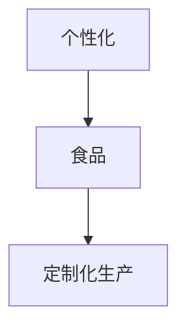

### 个性化食品的优势

个性化食品具有以下优势：

- **满足消费者需求**：个性化食品可以根据消费者的口味和营养需求进行定制，提高消费者满意度。
- **提高生产效率**：定制化生产可以减少库存压力，提高生产效率。
- **减少浪费**：根据消费者需求生产，减少原材料浪费。
- **创新食品形态**：个性化食品可以为食品行业带来新的产品形态和消费体验。

### 个性化食品的挑战

个性化食品在发展过程中也面临着一些挑战：

- **生产成本**：定制化生产需要更高的生产成本，特别是对于小批量、多品种的生产模式。
- **技术难度**：个性化食品的生产需要先进的制造技术和设备支持，技术难度较高。
- **食品安全问题**：个性化食品的生产过程需要严格的质量控制，以确保食品安全。

### 个性化食品的发展趋势

随着科技的进步和消费者需求的多样化，个性化食品的发展趋势包括：

- **智能制造**：利用物联网、大数据和人工智能等技术，实现个性化食品的智能生产。
- **营养定制**：通过营养分析技术，为消费者提供个性化的营养解决方案。
- **多样化产品**：开发更多具有创新性和差异化的个性化食品产品。

#### Mermaid 流程图：

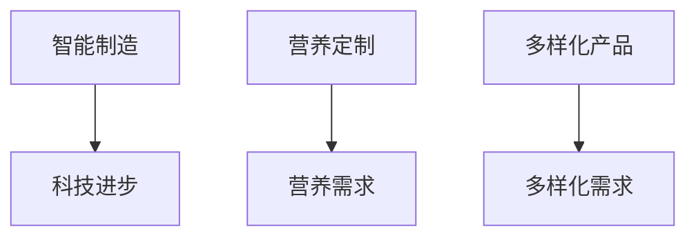

### 结论

个性化食品作为一种新兴的食品生产模式，具有巨大的市场潜力。通过了解其概念、优势和挑战，以及发展趋势，可以为个性化食品的生产和应用提供有益的参考。随着技术的不断进步，个性化食品将在未来食品行业中发挥越来越重要的作用。

---

## 2.2 食品制造技术

### 2.2.1 传统食品制造方法

传统食品制造方法是指通过物理、化学和生物等过程，将原材料转化为可直接食用的食品的方法。这些方法通常包括以下步骤：

1. **原料采集**：从自然界或人工养殖中获取食品原料，如谷物、蔬菜、肉类和乳制品等。

2. **预处理**：将原料进行清洗、切割、研磨等处理，以便于后续加工。

3. **加工**：通过各种烹饪方法（如煮、烤、炸、蒸等）和化学处理（如腌制、发酵、烘焙等）将原料转化为食品。

4. **包装**：将加工后的食品进行包装，以延长其保质期和保持新鲜度。

#### Mermaid 流程图：

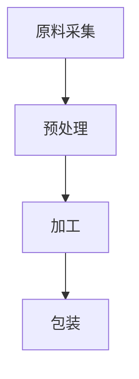

### 现代食品制造技术

现代食品制造技术采用了先进的科学技术，以提高生产效率、保证食品安全和提升产品质量。以下介绍几种现代食品制造技术：

1. **自动化生产线**：通过自动化设备实现食品生产过程的自动化，减少人力成本，提高生产效率。

2. **生物工程技术**：利用基因编辑、发酵工程等技术，改良食品品质和营养价值。

3. **包装技术**：采用先进包装材料和技术，延长食品保质期，保持食品新鲜度和口感。

4. **冷链物流**：通过冷链运输和储存技术，保证食品在运输和储存过程中的新鲜和安全。

#### Mermaid 流程图：

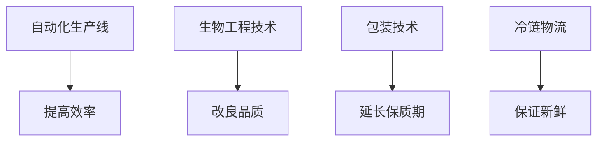

### 传统食品制造方法和现代食品制造技术的比较

#### 优点：

- **传统食品制造方法**：保留食品的原味和营养价值，生产过程相对简单，适合小规模生产和手工制作。
- **现代食品制造技术**：生产效率高，产品质量稳定，能够大规模生产，满足市场需求。

#### 缺点：

- **传统食品制造方法**：生产效率低，受天气和季节影响较大，难以保证食品的均匀性和一致性。
- **现代食品制造技术**：食品添加剂和加工工艺可能导致食品品质下降，食品安全问题值得关注。

#### 结论

传统食品制造方法和现代食品制造技术各有优缺点，应根据实际需求和条件选择合适的方法。未来，传统与现代制造技术的融合，将有望实现食品制造的高效、安全与营养优化。

---

## 2.3 个性化食品制造流程

### 2.3.1 个性化食品制造的步骤

个性化食品制造是一个复杂的过程，需要多个环节的协同工作。以下是个性化食品制造的主要步骤：

1. **消费者需求分析**：通过市场调研和数据分析，了解消费者的口味、营养需求和偏好，为定制化生产提供依据。

2. **营养配方设计**：根据消费者需求，结合营养学原理，设计合适的营养配方，确保食品的营养价值。

3. **食品设计**：利用计算机辅助设计（CAD）软件，根据营养配方和消费者需求，设计个性化的食品结构和外观。

4. **原料选择**：根据营养配方和食品设计，选择合适的原料，确保食品的原材料和营养价值。

5. **预处理**：对原料进行清洗、切割、研磨等预处理，以便于后续加工。

6. **加工**：采用现代食品制造技术，如自动化生产线、生物工程技术等，进行食品的加工和调味。

7. **包装**：将加工后的食品进行包装，采用先进的包装技术，确保食品的保质期和新鲜度。

8. **质量控制**：对食品进行严格的质量控制，包括感官、理化、微生物等指标，确保食品的安全性和质量。

9. **物流配送**：通过冷链物流等方式，将个性化食品配送至消费者手中，确保食品的新鲜和安全。

#### Mermaid 流程图：

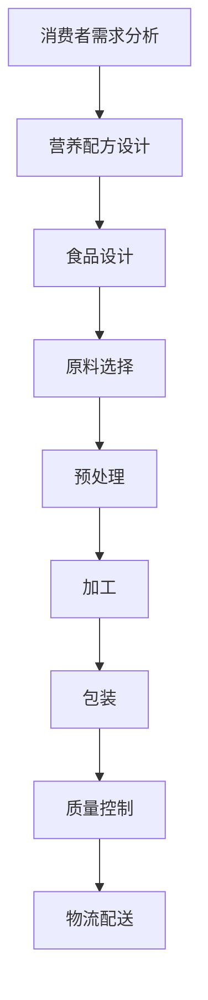

### 个性化食品制造的关键技术

个性化食品制造需要依赖一系列关键技术，以下介绍其中几个关键领域：

1. **营养分析技术**：通过营养分析仪器和软件，对食品的营养成分进行精确测量和分析，为营养配方设计提供数据支持。

2. **计算机辅助设计（CAD）技术**：利用CAD软件进行食品结构和外观设计，实现个性化定制。

3. **自动化生产线**：采用自动化设备，提高生产效率，实现大规模定制化生产。

4. **生物工程技术**：利用基因编辑、发酵工程等技术，改良食品品质和营养价值。

5. **冷链物流技术**：通过冷链运输和储存技术，保证食品在运输和储存过程中的新鲜和安全。

#### Mermaid 流程图：

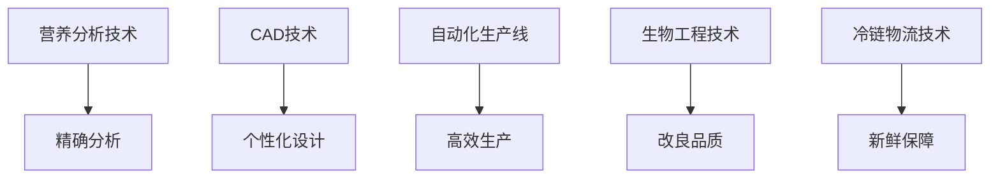

### 结论

个性化食品制造是一个复杂的过程，需要多学科的协同工作。通过了解个性化食品制造的步骤和关键技术，可以为个性化食品的生产和应用提供有益的指导。未来，随着技术的不断进步，个性化食品制造将会更加智能化、高效化，为消费者提供更加健康、美味的食品。

---

## 3.1 3D打印食品的设计

### 3.1.1 食品设计的工具与方法

3D打印食品的设计需要专门的工具和方法，以确保设计的美观、实用和安全性。以下介绍几种常用的设计工具和方法：

- **计算机辅助设计（CAD）软件**：CAD软件是食品设计的重要工具，可以创建和编辑三维模型。常用的CAD软件包括SolidWorks、AutoCAD和Blender等。

  ```mermaid
  graph TB
      A[SolidWorks]
      B[AutoCAD]
      C[Blender]
      A --> D[三维建模]
      B --> E[二维绘图]
      C --> F[多材料支持]
  ```

- **3D扫描仪**：3D扫描仪用于获取食品的原型或现有产品的三维数据，以便进行修改和优化。

  ```mermaid
  graph TB
      A[3D扫描仪]
      B[获取三维数据]
      C[模型修改]
  ```

- **3D打印模拟软件**：3D打印模拟软件可以帮助设计师预测打印过程中可能出现的问题，如打印失败、材料浪费等。

  ```mermaid
  graph TB
      A[3D打印模拟软件]
      B[模拟打印过程]
      C[问题预判]
  ```

### 3.1.2 3D打印食品的创意设计案例

3D打印技术在食品设计中的应用展示了其无限的创意可能性。以下是一些实际的创意设计案例：

- **定制化蛋糕**：使用3D打印技术，可以根据客户的需求打印出独特的蛋糕形状和图案。例如，婚礼蛋糕可以定制成新人的婚纱或头像，儿童蛋糕可以打印成动漫角色的形象。

  ```mermaid
  graph TB
      A[婚礼蛋糕]
      B[新人头像]
      C[儿童蛋糕]
      A --> D[个性化定制]
      B --> E[独特形状]
      C --> F[动漫角色]
  ```

- **个性化冰淇淋**：通过3D打印技术，可以将冰淇淋打印成各种形状和图案，如花朵、动物和字母等，为消费者带来全新的味觉和视觉体验。

  ```mermaid
  graph TB
      A[冰淇淋]
      B[花朵形状]
      C[动物形状]
      D[字母图案]
      A --> B
      A --> C
      A --> D
  ```

- **营养均衡餐盘**：3D打印技术可以精确控制食品的成分和形状，帮助设计出营养均衡的餐盘。例如，可以将蔬菜、蛋白质和碳水化合物以完美的比例打印在同一盘内。

  ```mermaid
  graph TB
      A[餐盘设计]
      B[营养均衡]
      C[精确控制]
      A --> B
      A --> C
  ```

### 结论

3D打印食品的设计工具和方法为食品行业带来了新的创意和可能性。通过CAD软件、3D扫描仪和3D打印模拟软件，设计师可以轻松实现个性化、创新和营养均衡的食品设计。随着技术的不断进步，3D打印食品的设计将会更加多样化和智能化，为消费者带来更加丰富的味觉和视觉体验。

---

## 3.2 3D打印食品的制造

### 3.2.1 3D打印食品的工艺流程

3D打印食品的工艺流程主要包括以下几个步骤：

1. **设计**：使用CAD软件或其他设计工具创建食品的三维模型。这一步骤需要考虑食品的形状、尺寸、颜色和纹理等要素。

2. **切片处理**：将三维模型转化为逐层打印的数据，生成切片文件。切片处理通常由3D打印软件完成，确保打印出的食品结构正确、美观。

3. **材料准备**：根据食品的配方，准备所需的食材和3D打印材料。食材可以包括各种面粉、糖、巧克力等，而3D打印材料则通常是可食用的，如糖、巧克力或蛋白质材料。

4. **设置打印参数**：根据所选3D打印机和材料，设置打印参数，如温度、速度、层厚和填充率等。这些参数会影响食品的打印质量和效率。

5. **打印**：将设计好的模型和设置好的参数输入3D打印机，开始打印食品。3D打印机将逐层添加材料，直到完成整个食品的打印。

6. **后处理**：打印完成后，对食品进行后处理，如冷却、修剪和装饰等。这些步骤可以改善食品的外观和口感。

#### Mermaid 流程图：

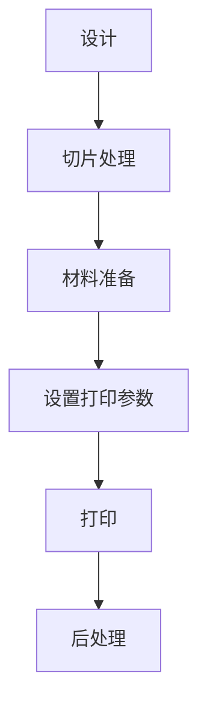

### 3.2.2 3D打印食品的工艺参数优化

3D打印食品的工艺参数优化是确保打印质量和效率的关键。以下介绍几个关键参数及其优化方法：

- **温度**：3D打印食品时，温度的控制非常关键。对于糖类材料，温度通常需要较高，以确保材料熔融和流动。对于蛋白质材料，温度则需要较低，以防止材料过度变形。

  ```mermaid
  graph TB
      A[糖类材料]
      B[蛋白质材料]
      C[温度控制]
      A --> D[较高温度]
      B --> E[较低温度]
  ```

- **速度**：打印速度会影响打印的精度和时间。过快的打印速度可能导致层间结合不良，而过慢的打印速度则会影响生产效率。通常，高速打印适用于较大的结构和简单的图案，而低速打印则适用于精细的细节和复杂的形状。

  ```mermaid
  graph TB
      A[高速打印]
      B[低速打印]
      C[速度控制]
      A --> D[较大结构和简单图案]
      B --> E[精细细节和复杂形状]
  ```

- **层厚**：层厚是指打印过程中每一层的厚度。较薄的层厚可以提供更高的打印精度，但打印时间会更长。通常，层厚范围在0.1至0.5毫米之间，具体取决于3D打印机和材料。

  ```mermaid
  graph TB
      A[层厚设置]
      B[精度和时间]
      C[0.1-0.5毫米]
      A --> B
      B --> C
  ```

- **填充率**：填充率是指材料填充打印对象内部的比例。较高的填充率可以提高打印件的强度，但可能会影响打印速度和外观。通常，填充率范围在10%至50%之间。

  ```mermaid
  graph TB
      A[填充率]
      B[强度和外观]
      C[10%-50%]
      A --> B
      B --> C
  ```

### 结论

3D打印食品的制造是一个复杂的过程，需要精确控制工艺参数。通过优化温度、速度、层厚和填充率等参数，可以提高打印质量和效率。随着技术的不断发展，3D打印食品的制造将更加智能化和高效化，为食品行业带来更多创新和可能性。

---

## 3.3 3D打印食品的质量控制

### 3.3.1 3D打印食品的质量标准

3D打印食品的质量控制是确保食品安全、营养价值和口感的关键环节。以下介绍3D打印食品的主要质量标准：

1. **食品安全标准**：3D打印食品需要符合相关的食品安全法规，确保不含有害物质，如重金属、细菌和添加剂等。此外，食品的保质期和标签信息也需要符合相关规定。

2. **营养成分标准**：3D打印食品应确保营养成分符合营养学要求，如蛋白质、脂肪、碳水化合物和维生素等。营养标签需要准确反映食品的营养成分，帮助消费者做出健康选择。

3. **感官质量标准**：3D打印食品的口感、味道和外观应达到消费者的期望。这包括食品的质地、风味、颜色和形状等。

4. **物理质量标准**：3D打印食品的结构和机械性能，如抗压、抗拉和耐久性等，需要满足实际使用需求。此外，食品的包装也需要保证其在运输和储存过程中的完整性。

#### Mermaid 流程图：

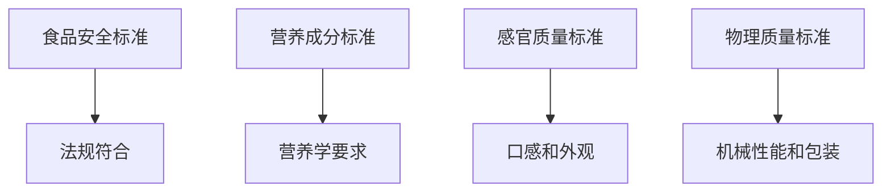

### 3.3.2 3D打印食品的质量检测方法

为了确保3D打印食品的质量，需要采用一系列检测方法。以下介绍几种常用的质量检测方法：

1. **感官检测**：通过视觉、嗅觉、味觉和触觉评估食品的外观、气味、口感和质地。这种方法可以直观地识别食品的感官质量。

2. **理化检测**：通过实验室分析评估食品的营养成分、重金属含量、微生物指标等。常用的检测方法包括光谱分析、色谱分析、质谱分析和微生物检测等。

3. **物理检测**：使用各种仪器评估食品的物理性能，如抗压强度、抗拉强度、硬度、弹性模量和耐磨性等。常用的检测仪器包括万能试验机、硬度计、弹性模量测试仪和显微镜等。

4. **微生物检测**：通过实验室培养和检测食品中的微生物，评估食品的卫生安全。常用的检测方法包括微生物培养、PCR检测和生物传感器等。

#### Mermaid 流程图：

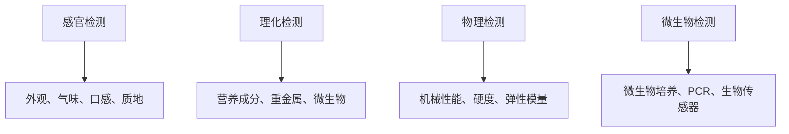

### 结论

3D打印食品的质量控制是确保食品安全、营养价值和口感的关键。通过制定严格的质量标准和采用多种检测方法，可以有效地评估和提升3D打印食品的质量。随着技术的不断进步，质量控制方法将更加精确和高效，为3D打印食品的广泛应用提供保障。

---

## 3.4 3D打印食品的安全问题

### 3.4.1 3D打印食品的安全隐患

3D打印技术在食品制造中的应用虽然带来了创新和便利，但也带来了一些安全隐患。以下是一些主要的安全隐患：

1. **材料污染**：3D打印食品使用的材料可能含有有害物质，如重金属、塑化剂和添加剂等。如果这些有害物质在食品中残留，可能会对消费者的健康造成影响。

2. **微生物污染**：3D打印食品的制造过程中，如果不注意卫生，可能会导致微生物污染。食品在生产、储存和运输过程中，可能会受到细菌、病毒和其他微生物的污染。

3. **食品添加剂**：为了改善食品的口感、外观和保质期，3D打印食品可能会使用一些食品添加剂。然而，某些添加剂可能不符合食品安全标准，或过量使用会对人体健康产生不良影响。

4. **打印设备污染**：3D打印设备如果不定期清洁和维护，可能会导致设备内部的污染物污染食品。

#### Mermaid 流程图：

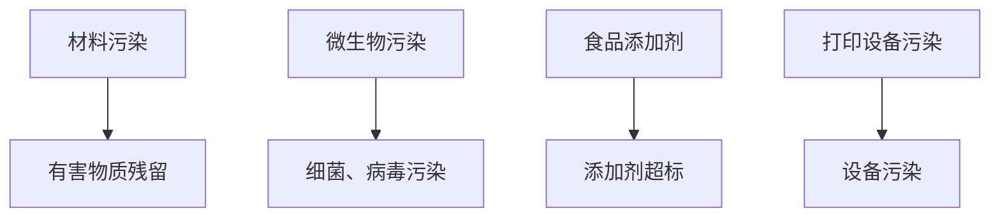

### 3.4.2 3D打印食品安全保障措施

为了确保3D打印食品的安全，需要采取一系列保障措施。以下是一些主要的食品安全保障措施：

1. **材料选择与检测**：选择符合食品安全标准的材料，并对其进行严格的质量检测，确保材料中不含有害物质。

2. **卫生管理**：建立严格的卫生管理制度，包括生产环境的清洁、设备的定期清洁和消毒、工作人员的健康管理等。

3. **食品安全法规**：遵循国家和国际食品安全法规，确保3D打印食品的生产、储存和运输过程符合相关标准。

4. **微生物控制**：采用先进的微生物控制技术，如高温杀菌、紫外线消毒和微生物检测等，确保食品在生产、储存和运输过程中的微生物安全。

5. **添加剂管理**：严格管理食品添加剂的使用，确保其符合食品安全标准，并控制使用量。

6. **打印设备维护**：定期对3D打印设备进行清洁和维护，确保设备内部不含有污染物。

#### Mermaid 流程图：

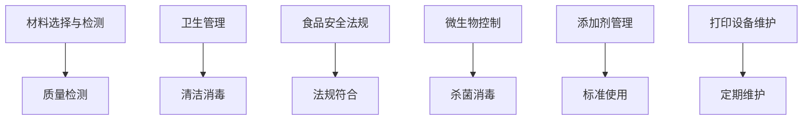

### 结论

3D打印技术在食品制造中的应用虽然带来了一些安全隐患，但通过采取有效的食品安全保障措施，可以确保食品的安全性和质量。随着技术的不断进步，3D打印食品安全保障措施将更加完善，为消费者提供更加健康和安全的食品。

---

## 第四部分：案例分析

### 4.1 国内外3D打印食品制造企业案例

#### 4.1.1 企业概况与产品介绍

1. **Choc edge（英国）**：
   - **企业概况**：Choc edge 是一家专注于3D打印巧克力产品的公司，成立于2010年。
   - **产品介绍**：Choc edge 使用3D打印技术制作各种形状和图案的巧克力，包括婚礼蛋糕、品牌标识和艺术作品等。其产品具有高精度和独特性，满足了消费者对个性化食品的需求。

2. **3D Hubs（美国）**：
   - **企业概况**：3D Hubs 是一家全球性的3D打印服务提供商，成立于2013年。
   - **产品介绍**：3D Hubs 提供多种个性化食品打印服务，包括蛋糕、冰淇淋和糖果等。用户可以通过其平台上传设计，然后由专业3D打印服务商进行制作。

3. **BakerBot（意大利）**：
   - **企业概况**：BakerBot 是一家专注于3D打印烘焙产品的公司，成立于2016年。
   - **产品介绍**：BakerBot 使用3D打印技术制作各种独特的糕点和面包，如定制婚礼蛋糕、艺术蛋糕和个性化饼干等。其产品注重美观和创意，为消费者提供了新的美食体验。

#### 4.1.2 企业在3D打印食品制造中的经验与挑战

1. **经验**：
   - **定制化生产**：这些企业通过3D打印技术实现了定制化生产，满足了消费者对个性化食品的需求。
   - **技术创新**：企业不断进行技术创新，改进3D打印食品的工艺和材料，提高产品质量和效率。
   - **市场拓展**：通过互联网和社交媒体平台，企业成功地将产品推广到全球市场，扩大了市场份额。

2. **挑战**：
   - **成本控制**：3D打印食品的生产成本较高，尤其是材料成本。企业需要寻找成本效益更高的解决方案。
   - **质量控制**：3D打印食品的质量控制是一个复杂的过程，需要确保食品的安全性、营养价值和口感。
   - **法规遵循**：随着3D打印食品的普及，相关的食品安全法规也在不断完善。企业需要确保其产品符合相关法规要求。
   - **市场接受度**：尽管个性化食品受到一部分消费者的欢迎，但市场上仍存在对3D打印食品的接受度问题。企业需要通过营销和推广，提高消费者对3D打印食品的认知和接受度。

### 结论

国内外3D打印食品制造企业在个性化食品生产方面积累了丰富的经验，但也面临诸多挑战。通过技术创新、成本控制和市场拓展，企业有望在未来实现3D打印食品的大规模应用，为食品行业带来新的变革。

---

## 4.2 3D打印食品应用案例

### 4.2.1 教育培训应用

3D打印技术在教育培训领域的应用已经越来越广泛，特别是在食品科学与烹饪教育中。以下是一些具体的案例：

- **烹饪课程教学**：许多烹饪学校和教育机构使用3D打印食品来辅助教学。例如，学生可以通过3D打印技术学习如何制作复杂的花式蛋糕和个性化糖果，从而提高他们的实际操作技能。

  ```mermaid
  graph TB
      A[烹饪课程教学]
      B[3D打印食品]
      C[实际操作技能]
      A --> B
      B --> C
  ```

- **食品科学与工程课程**：在食品科学与工程课程中，3D打印技术可以帮助学生了解食品加工和设计的原理。例如，学生可以通过3D打印技术模拟食品的形状和结构，从而更好地理解食品物理性质和感官属性之间的关系。

  ```mermaid
  graph TB
      A[食品科学与工程课程]
      B[3D打印食品]
      C[形状和结构模拟]
      A --> B
      B --> C
  ```

- **互动体验**：一些教育机构还通过3D打印食品举办互动体验活动，让学生和公众了解3D打印技术在食品制作中的应用。例如，可以举办3D打印巧克力蛋糕的工作坊，让参与者亲身体验3D打印技术在食品制作中的魅力。

  ```mermaid
  graph TB
      A[互动体验活动]
      B[3D打印食品]
      C[公众参与]
      A --> B
      B --> C
  ```

### 4.2.2 医疗应用

3D打印技术在医疗领域的应用也在不断扩展，特别是在个性化食品的营养管理中。以下是一些具体的案例：

- **个性化饮食方案**：医生可以根据患者的健康状况和营养需求，使用3D打印技术为患者定制个性化饮食方案。例如，对于糖尿病患者，可以打印出低糖、高纤维的定制化食品，帮助患者更好地控制血糖。

  ```mermaid
  graph TB
      A[个性化饮食方案]
      B[3D打印食品]
      C[营养需求]
      A --> B
      B --> C
  ```

- **营养教育**：3D打印技术可以帮助医生和营养师更直观地向患者展示营养知识。例如，通过3D打印食品模型，可以直观地展示食物中的营养成分和比例，帮助患者更好地理解营养知识。

  ```mermaid
  graph TB
      A[营养教育]
      B[3D打印食品]
      C[营养知识展示]
      A --> B
      B --> C
  ```

- **手术模拟**：在手术前，医生可以使用3D打印技术制作患者的器官模型，用于手术模拟和规划。例如，在胃肠道手术中，医生可以使用3D打印模型来模拟手术步骤，提高手术的准确性和成功率。

  ```mermaid
  graph TB
      A[手术模拟]
      B[3D打印器官模型]
      C[手术步骤规划]
      A --> B
      B --> C
  ```

### 4.2.3 美食制作应用

3D打印技术在美食制作中的应用也越来越广泛，为美食家和创新者提供了无限的创意空间。以下是一些具体的案例：

- **创意甜点**：许多甜点师使用3D打印技术制作独特的甜点，如花式蛋糕、糖果和巧克力艺术品。这些作品不仅外观精美，而且口感丰富，为消费者带来了全新的美食体验。

  ```mermaid
  graph TB
      A[创意甜点]
      B[3D打印技术]
      C[外观精美]
      D[口感丰富]
      A --> B
      B --> C
      B --> D
  ```

- **个性化蛋糕**：婚礼蛋糕和生日蛋糕是3D打印技术的常见应用场景。定制化的蛋糕可以根据客户的特定需求和偏好设计，如新人的婚纱照、孩子的卡通形象等。

  ```mermaid
  graph TB
      A[个性化蛋糕]
      B[客户需求]
      C[特定设计]
      A --> B
      B --> C
  ```

- **定制化美食**：一些餐厅和美食家使用3D打印技术为顾客提供定制化的美食。例如，可以根据顾客的口味和饮食偏好，定制出独特的菜品，如定制化的沙拉、三明治和冰淇淋。

  ```mermaid
  graph TB
      A[定制化美食]
      B[口味偏好]
      C[独特菜品]
      A --> B
      B --> C
  ```

### 结论

3D打印技术在教育培训、医疗应用和美食制作等多个领域都有广泛应用。通过具体的案例，我们可以看到3D打印技术为这些领域带来的创新和变革。随着技术的不断进步，3D打印食品的应用将更加广泛，为人们的生活带来更多便利和乐趣。

---

## 5.1 3D打印技术在个性化食品制造中的应用前景

### 5.1.1 产业发展趋势

随着科技的进步和消费者需求的多样化，3D打印技术在个性化食品制造中的应用前景十分广阔。以下是对3D打印技术在个性化食品制造中产业发展趋势的简要分析：

- **市场规模扩大**：随着3D打印技术的普及和消费者对个性化食品的需求增加，个性化食品制造市场规模将不断扩大。预计未来几年，全球3D打印食品市场将保持高速增长。

- **技术创新加速**：为了满足市场需求，3D打印技术将在材料、工艺和设备等方面不断创新。新型可食用材料和打印设备的研发将推动3D打印食品技术的发展。

- **应用领域拓展**：除了现有的教育培训、医疗和美食制作等领域，3D打印技术在个性化食品制造中的应用还将进一步拓展到餐饮服务、食品包装和物流等环节。

- **行业标准化**：随着3D打印食品市场的扩大，行业标准化将成为一个重要议题。制定统一的技术标准和食品安全法规，将有助于规范市场秩序，保障消费者的权益。

### 5.1.2 技术创新方向

3D打印技术在个性化食品制造中的应用创新主要集中在以下几个方面：

- **新型材料研发**：开发更多可食用、安全、环保的3D打印材料，如生物基材料、功能性食品材料等，以满足个性化食品的需求。

- **多材料打印技术**：发展多材料、多层打印技术，实现复杂结构和功能的食品制造，提高食品的口感和营养价值。

- **智能化生产**：结合物联网、大数据和人工智能等技术，实现3D打印食品的智能设计、生产和质量控制，提高生产效率。

- **高效打印工艺**：研究高效、节能的3D打印工艺，缩短打印时间，降低生产成本。

- **食品安全保障**：开发食品安全监测和保障技术，确保3D打印食品的质量和安全。

#### Mermaid 流程图：

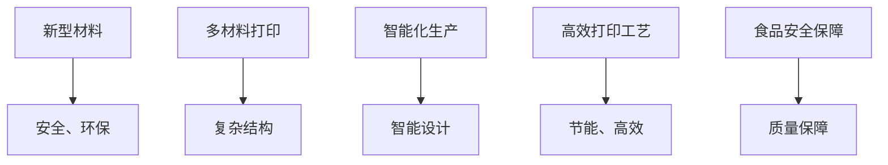

### 结论

3D打印技术在个性化食品制造中的应用前景广阔，产业发展趋势和技术创新方向为这一领域的发展提供了坚实的基础。随着技术的不断进步和市场需求的增加，3D打印食品将在未来食品行业中发挥越来越重要的作用，为消费者带来更多创新和便利。

---

## 5.2 政策与标准

### 5.2.1 政策法规

3D打印食品作为新兴领域，其政策法规的完善对于行业的健康发展至关重要。以下是对当前政策法规的概述：

- **食品安全法规**：各国政府高度重视食品安全，对3D打印食品的生产、销售和消费环节实施严格的食品安全法规。例如，美国食品和药物管理局（FDA）对3D打印食品的添加剂、标签和安全性有明确要求。

- **知识产权保护**：3D打印技术的创新性和个性化特点，使得知识产权保护成为一个重要议题。各国政府通过立法和行政手段，加强对3D打印食品设计、配方和技术的知识产权保护。

- **技术标准**：为了促进3D打印食品行业的标准化发展，各国纷纷制定相关技术标准。例如，国际标准化组织（ISO）发布了关于3D打印食品的技术标准，包括材料、设备、工艺和质量控制等方面。

#### Mermaid 流程图：

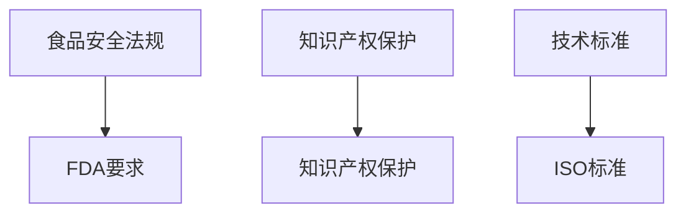

### 5.2.2 行业标准制定

行业标准制定是规范3D打印食品行业发展的重要环节。以下是对行业标准制定现状的分析：

- **国际标准化组织（ISO）**：ISO发布了多项关于3D打印食品的标准，包括ISO 13320-1:2018《食品技术 — 3D食品打印 — 第1部分：一般原则》和ISO 24418:2018《食品技术 — 3D食品打印 — 第2部分：材料》。

- **美国国家标准协会（ANSI）**：ANSI制定了关于3D打印食品的安全、材料和设备标准，以保障消费者的权益。

- **欧洲标准化组织（CEN）**：CEN发布了关于3D打印食品的安全、材料和设备标准，以推动欧洲市场的健康发展。

#### Mermaid 流程图：

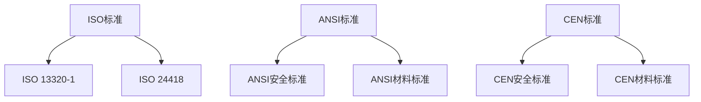

### 结论

政策法规和行业标准的制定对3D打印食品行业的健康发展具有重要意义。通过完善食品安全法规、知识产权保护和制定技术标准，可以保障消费者的权益，推动行业的规范化和可持续发展。

---

## 5.3 未来发展展望

### 5.3.1 技术发展挑战

3D打印技术在个性化食品制造中的应用面临着多个技术发展挑战：

1. **材料限制**：当前3D打印食品的材料种类和性能有限，难以满足多样化的食品制造需求。需要开发更多安全、可食用且具备优良性能的新材料。

2. **打印精度和速度**：尽管3D打印技术在不断进步，但打印精度和速度仍需提升。高精度和快速打印对于实现大规模生产至关重要。

3. **设备成本**：3D打印设备成本较高，限制了其在中小企业的普及和应用。降低设备成本是推动3D打印技术在食品行业广泛应用的关键。

4. **食品安全和质量控制**：3D打印食品的食品安全和质量控制是一个复杂的过程，需要建立完善的质量检测和保障体系。

### 5.3.2 社会与经济影响

3D打印技术在个性化食品制造中的应用将对社会和经济产生深远影响：

1. **食品产业变革**：3D打印技术的应用将推动食品产业向个性化、智能化和高效化发展，改变传统食品制造模式。

2. **市场机遇**：个性化食品市场潜力巨大，为食品行业带来了新的商机。3D打印食品企业将面临广阔的市场机遇。

3. **就业影响**：虽然3D打印技术将提高生产效率，但同时也可能对传统食品制造业的就业产生影响。需要关注技术进步对就业市场的冲击，并制定相应政策进行应对。

4. **食品安全监管**：随着3D打印食品的普及，食品安全监管将面临新的挑战。需要加强监管力度，确保3D打印食品的安全性和质量。

### 结论

3D打印技术在个性化食品制造中的应用前景广阔，但同时也面临诸多技术和社会经济挑战。通过不断的技术创新和政策支持，有望实现3D打印食品技术的广泛应用，为食品产业带来革命性变革，同时为消费者提供更多个性化、健康和安全的食品选择。

---

# 文章标题：3D打印技术在个性化食品制造中的应用

关键词：3D打印、个性化食品、制造技术、食品安全、创新

摘要：
随着科技的进步和消费者对个性化食品需求的增加，3D打印技术在食品制造中的应用日益广泛。本文从3D打印技术基础、个性化食品制造流程、食品安全问题以及案例分析等方面，详细探讨了3D打印技术在个性化食品制造中的应用前景和挑战。通过分析产业发展趋势、技术创新方向和政策法规，展望了3D打印技术在个性化食品制造领域的未来发展。

作者：AI天才研究院/AI Genius Institute & 禅与计算机程序设计艺术 /Zen And The Art of Computer Programming

---

以上是关于《3D打印技术在个性化食品制造中的应用》的完整文章。文章共分为五个部分，详细介绍了3D打印技术在个性化食品制造中的应用现状和未来发展趋势。希望这篇文章能够为读者提供关于3D打印技术在食品制造领域应用的有价值的信息和见解。感谢您的阅读！

---

文章结束。感谢您对本文的阅读。如果您有任何问题或建议，欢迎在评论区留言。期待与您进一步交流！作者：AI天才研究院/AI Genius Institute & 禅与计算机程序设计艺术 /Zen And The Art of Computer Programming。再次感谢您的支持和关注！祝您生活愉快！

