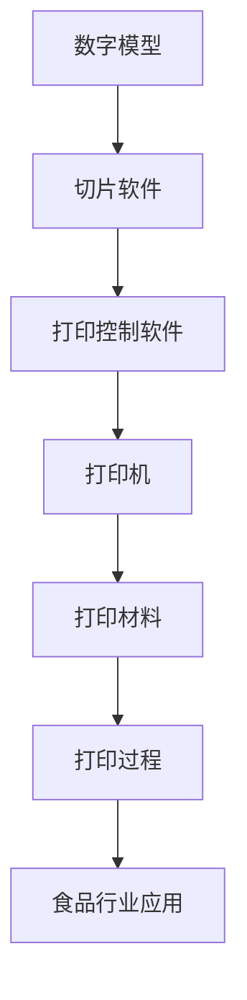

                 

# 《3D打印技术在食品行业中的应用》

## 关键词

3D打印技术，食品行业，创新应用，材料选择，食品安全，营养健康

## 摘要

本文深入探讨了3D打印技术在食品行业的应用。从基本原理到材料选择，再到设计与工艺，本文系统地介绍了3D打印技术在食品领域的潜在应用。通过分析食品安全与营养健康问题，本文进一步探讨了3D打印食品的创新案例及其行业趋势。本文旨在为读者提供一个全面、系统的3D打印食品应用研究框架，并展望其未来发展。

## 第一部分：3D打印技术概述

### 第1章：3D打印技术的基本原理

3D打印技术是一种以数字模型文件为基础，运用粉末材料、液体或薄片等可打印材料，通过逐层堆积制造三维实体的技术。其基本原理可以归纳为三个主要步骤：模型设计、材料准备和打印过程。

- **1.1 3D打印技术的历史和发展**

3D打印技术起源于20世纪80年代，最初被称为立体光固化成型（SLA）。随着技术的发展，逐步演变出熔融沉积成型（FDM）、立体光刻（SLA）、电子束熔融（EBM）、选择性激光烧结（SLS）等多种类型。

- **1.2 3D打印技术的分类**

根据打印材料和打印方式，3D打印技术可以分为以下几类：
  - **粉末材料打印**：如选择性激光烧结（SLS）和电子束熔融（EBM）。
  - **液体材料打印**：如立体光固化成型（SLA）和数字光处理（DLP）。
  - **薄片材料打印**：如选择性层积成型（SLS）和三维雕刻。

- **1.3 3D打印技术的核心组件**

3D打印技术的核心组件包括打印机、打印材料、数字模型和打印软件。打印机是执行打印任务的主要设备，包括打印头、框架、传感器等。打印材料是3D打印的基本原料，包括塑料、金属、陶瓷、生物材料等。数字模型是通过计算机辅助设计（CAD）软件生成的三维模型，而打印软件则用于控制打印过程，实现从数字模型到实体物品的转换。

- **1.4 3D打印技术在食品行业的应用潜力**

3D打印技术在食品行业的应用潜力巨大。通过3D打印技术，可以实现个性化定制食品、复杂结构的食品制作、营养成分的精准控制等。此外，3D打印技术还可以在食品包装、食品加工和食品储存等领域发挥重要作用。

### 第2章：3D打印食品的材料选择

3D打印食品的材料选择是3D打印技术在食品行业应用的关键。食品级材料必须满足安全、健康、可食用等要求。

- **2.1 3D打印食品的材料特性**

3D打印食品的材料应具有以下特性：
  - **可食用性**：材料必须符合食品安全标准，且对人体无害。
  - **可打印性**：材料应具有良好的流动性和可塑性，以便于通过3D打印技术加工。
  - **营养性**：材料应富含各种营养成分，以满足人体所需。

- **2.2 食品级材料的选择标准**

选择食品级材料时，需考虑以下标准：
  - **安全性**：材料应经过严格的安全评估和认证。
  - **营养成分**：材料应富含蛋白质、脂肪、碳水化合物等营养成分。
  - **口感与质地**：材料应具有良好的口感和质地，满足消费者的口味需求。

- **2.3 常见的3D打印食品材料**

常见的3D打印食品材料包括：
  - **食品级塑料**：如聚乳酸（PLA）、聚己内酰胺（PC）等。
  - **生物材料**：如胶原蛋白、明胶等。
  - **食品墨水**：通过将食品色素和添加剂混合制成，可实现食品的颜色和口感。

### 第3章：3D打印食品的设计与工艺

3D打印食品的设计与工艺是确保食品质量和口感的关键。

- **3.1 3D打印食品的设计原则**

3D打印食品的设计应遵循以下原则：
  - **功能性**：设计应满足食品的基本功能，如营养、口感等。
  - **美观性**：设计应具有艺术感和美感，满足消费者的审美需求。
  - **可打印性**：设计应考虑3D打印技术的特点和局限性，确保设计可实现。

- **3.2 食品结构的设计与优化**

食品结构的设计与优化是3D打印食品的关键。通过优化食品结构，可以提高食品的口感、营养价值和保鲜期。具体方法包括：
  - **分层设计**：将食品分层设计，以实现不同的口感和营养层次。
  - **形状优化**：通过优化食品的形状，提高食品的质感和口感。

- **3.3 3D打印工艺的调整与优化**

3D打印工艺的调整与优化是确保3D打印食品质量和口感的重要环节。具体方法包括：
  - **参数调整**：调整打印速度、层高、打印温度等参数，以获得最佳的打印效果。
  - **材料调整**：通过调整材料配方，优化材料的流动性、硬度等特性。

## 第二部分：3D打印食品技术探讨

### 第4章：3D打印食品的食品卫生与安全

3D打印技术在食品行业的应用，带来了食品卫生与安全的新挑战。

- **4.1 3D打印食品的食品安全问题**

3D打印食品可能存在的食品安全问题包括：
  - **材料污染**：打印材料可能受到环境或操作过程的影响，导致污染。
  - **交叉污染**：3D打印过程中，不同食品材料之间可能发生交叉污染。
  - **微生物污染**：3D打印环境可能成为微生物生长的场所。

- **4.2 食品卫生标准的适应**

为保障3D打印食品的食品安全，需遵循以下食品卫生标准：
  - **原材料卫生标准**：确保原材料来源可靠，符合食品安全标准。
  - **加工过程卫生标准**：建立严格的3D打印加工过程卫生标准，防止污染。
  - **产品质量标准**：制定3D打印食品的产品质量标准，确保产品质量。

- **4.3 食品安全监管与法规**

3D打印食品的食品安全监管与法规建设至关重要。政府和企业应共同努力，制定和完善相关法规，确保3D打印食品的安全性和合规性。

### 第5章：3D打印食品的营养与健康

3D打印技术在食品行业的应用，为营养健康提供了新的可能。

- **5.1 3D打印食品的营养控制**

3D打印技术可以通过精确控制材料成分，实现食品营养的个性化定制。具体方法包括：
  - **营养成分精准控制**：通过调整材料成分，精确控制食品的营养成分。
  - **个性化营养需求**：根据消费者的营养需求，定制化生产食品。

- **5.2 3D打印食品对健康的影响**

3D打印食品对健康的影响主要包括：
  - **营养成分吸收**：3D打印食品的营养成分可能更易于人体吸收。
  - **口感与消化**：3D打印食品的口感和质地可能对消化系统产生积极影响。

- **5.3 营养成分的精准控制**

3D打印技术可以通过精确控制材料成分，实现食品营养的个性化定制。具体方法包括：
  - **营养成分精准控制**：通过调整材料成分，精确控制食品的营养成分。
  - **个性化营养需求**：根据消费者的营养需求，定制化生产食品。

### 第6章：3D打印食品的创新与应用

3D打印技术在食品行业的创新应用，为食品行业带来了新的发展机遇。

- **6.1 3D打印食品的创新案例**

3D打印技术在食品行业的创新案例包括：
  - **个性化定制食品**：根据消费者的口味和营养需求，定制化生产食品。
  - **复杂结构食品**：通过3D打印技术，制作出具有复杂结构的食品，如巧克力雕塑、个性化蛋糕等。

- **6.2 3D打印食品在餐饮服务中的应用**

3D打印技术在餐饮服务中的应用，包括：
  - **个性化点餐**：餐厅可通过3D打印技术，提供个性化点餐服务。
  - **快速制作**：3D打印技术可实现快速生产，提高餐饮服务的效率。

- **6.3 3D打印食品在食品生产中的应用**

3D打印技术在食品生产中的应用，包括：
  - **批量生产**：3D打印技术可实现批量生产，提高生产效率。
  - **产品创新**：3D打印技术为食品生产带来新的创新机会，如开发新型食品结构和口味。

## 第三部分：3D打印食品行业趋势

### 第7章：3D打印食品行业分析

3D打印食品行业正处于快速发展阶段。通过分析行业现状、市场规模和竞争格局，可以更好地把握行业趋势。

- **7.1 3D打印食品行业的现状**

3D打印食品行业的现状包括：
  - **技术成熟度**：3D打印技术在食品领域的应用逐步成熟，但仍需解决一些关键技术问题。
  - **市场需求**：随着消费者对个性化和健康食品的需求增加，3D打印食品市场潜力巨大。

- **7.2 3D打印食品行业的市场规模与趋势**

3D打印食品行业的市场规模预计将快速增长。根据相关研究，预计到2030年，3D打印食品市场将达到数十亿美元。

- **7.3 3D打印食品行业的竞争格局**

3D打印食品行业的竞争格局包括：
  - **企业竞争**：国内外众多企业正在积极布局3D打印食品领域，竞争激烈。
  - **技术创新**：技术创新是3D打印食品行业竞争的核心，企业需要不断提升技术水平，以获得竞争优势。

### 第8章：3D打印食品行业的挑战与机遇

3D打印食品行业面临着一系列挑战，同时也蕴含着巨大的机遇。

- **8.1 3D打印食品行业的挑战**

3D打印食品行业的挑战包括：
  - **技术难题**：3D打印技术在食品领域的应用仍存在一些技术难题，如材料稳定性、打印速度等。
  - **法规监管**：3D打印食品的法规监管尚未完善，需要制定相应的法规和标准。

- **8.2 技术突破与创新发展**

技术突破和创新发展是3D打印食品行业的核心驱动力。通过不断突破关键技术，3D打印食品行业有望实现跨越式发展。

- **8.3 3D打印食品行业的未来展望**

3D打印食品行业的未来展望包括：
  - **个性化定制**：3D打印技术将使个性化定制成为主流，满足消费者多样化的需求。
  - **健康营养**：3D打印技术将推动食品营养健康的发展，为人类健康带来更多可能。

## 附录

### 附录A：3D打印食品技术资源

- **A.1 3D打印食品相关研究论文与专利**

以下是一些3D打印食品相关的研究论文和专利：
  - "3D Printing of Edible Structures Using a Conventional FDM 3D Printer"
  - "Development of an Ink-Jet 3D Bioprinting System for the Fabrication of Food-Grade Hydrogels"

- **A.2 3D打印食品行业报告与白皮书**

以下是一些3D打印食品行业的报告和白皮书：
  - "3D Printing in the Food Industry: A Market Analysis"
  - "The Future of 3D Printing in Food: Opportunities and Challenges"

- **A.3 3D打印食品技术标准与法规**

以下是一些3D打印食品技术的标准与法规：
  - "ISO 23117:2021 - 3D printing of moulds, cores and patterns for investment casting - Additive layer manufacturing processes"
  - "FDA - Food and Drug Administration regulations for 3D printed foods"

---

**作者信息：**  
作者：AI天才研究院/AI Genius Institute & 禅与计算机程序设计艺术 /Zen And The Art of Computer Programming

---

本文通过系统的分析，全面介绍了3D打印技术在食品行业的应用。从基本原理到材料选择，再到设计与工艺，本文深入探讨了3D打印技术在食品领域的潜力。通过分析食品安全与营养健康问题，本文进一步探讨了3D打印食品的创新案例及其行业趋势。本文旨在为读者提供一个全面、系统的3D打印食品应用研究框架，并展望其未来发展。

## 第一部分：3D打印技术概述

### 第1章：3D打印技术的基本原理

#### 1.1 3D打印技术的历史和发展

3D打印技术（也称为增材制造技术）起源于20世纪80年代，最早的3D打印技术之一是立体光固化成型（SLA），由Charles Hull于1983年发明。SLA技术使用紫外线照射光敏树脂，使之逐层固化，形成三维物体。随着技术的发展，熔融沉积成型（FDM）于20世纪90年代出现，成为目前最常用的3D打印技术之一。

在过去的几十年里，3D打印技术经历了多个阶段的发展，从简单的桌面打印机到工业级的制造设备，其应用范围也不断扩大，从原型制作到生产最终产品，3D打印技术在许多行业中都展现出了巨大的潜力。

#### 1.2 3D打印技术的分类

3D打印技术的分类可以根据打印材料的类型、打印过程以及打印设备的结构来划分。以下是几种主要的3D打印技术：

- **立体光固化成型（SLA）**：使用紫外线或激光照射光敏树脂，使之逐层固化形成三维物体。
- **熔融沉积成型（FDM）**：使用热熔塑料丝，通过加热使其融化并沉积在构建平台上来构建物体。
- **选择性激光烧结（SLS）**：使用激光将粉末材料（如塑料、金属、陶瓷等）烧结在一起，逐层构建三维物体。
- **电子束熔融（EBM）**：使用电子束将金属粉末熔化并逐层堆积，常用于生产高强度金属部件。
- **选择性激光熔化（DMLS）**：与EBM类似，但使用激光熔化金属粉末。
- **数字光处理（DLP）**：使用投影仪将光线投射到液态树脂上，逐层固化形成三维物体。
- **立体印刷（SIP）**：使用立体印刷头将油墨或其他液体材料逐层打印在构建平台上的技术。

#### 1.3 3D打印技术的核心组件

3D打印技术的核心组件包括打印机、打印材料、数字模型和打印软件。以下是这些组件的详细介绍：

- **打印机**：打印机是3D打印系统的核心，包括以下几个主要部分：
  - **打印头**：负责将材料逐层沉积到构建平台上。
  - **构建平台**：放置打印材料，用于固定和定位打印物体。
  - **运动控制系统**：控制打印头和构建平台的运动，确保打印精度。
  - **温控系统**：对打印材料进行加热或冷却，以维持适当的打印温度。

- **打印材料**：打印材料是3D打印系统的关键，可以根据不同的应用场景选择不同的材料。常见的打印材料包括：
  - **塑料**：如聚乳酸（PLA）、聚己内酰胺（ABS）、聚碳酸酯（PC）等。
  - **金属**：如不锈钢、铝、钛合金等。
  - **陶瓷**：用于制作高强度和耐高温的部件。
  - **复合材料**：结合不同材料的优点，用于特殊应用。
  - **生物材料**：用于医疗和食品行业的生物兼容性材料。

- **数字模型**：数字模型是通过计算机辅助设计（CAD）软件生成的三维模型，它是3D打印的基础。数字模型的质量直接影响打印结果。

- **打印软件**：打印软件用于控制打印过程，包括切片软件、打印控制软件等。切片软件将数字模型分割成二维切片，用于指导打印过程。

#### 1.4 3D打印技术在食品行业的应用潜力

3D打印技术在食品行业的应用潜力巨大，以下是一些关键领域：

- **个性化定制**：3D打印技术可以根据消费者个性化需求，定制化生产食品。例如，根据个人的营养需求和口味偏好，定制个性化的营养餐。

- **复杂结构食品**：3D打印技术可以制作出复杂的几何结构和形状，如多层次的蛋糕、巧克力雕塑等。

- **营养控制**：通过精确控制打印材料的成分，可以实现食品营养的精准控制，从而提高食品的健康价值。

- **快速原型制作**：3D打印技术可以快速制作食品原型，为新产品开发提供快速反馈。

- **食品加工**：3D打印技术可以在食品加工过程中实现自动化，提高生产效率和产品质量。

- **食品包装**：3D打印技术可以制作出独特的食品包装设计，提高食品的市场吸引力。

### 核心概念与联系

3D打印技术的核心概念包括打印材料、数字模型、打印过程和打印设备。这些概念之间的关系可以通过以下Mermaid流程图进行表示：



#### 核心算法原理讲解

3D打印技术的核心算法主要涉及数字模型的生成和切片软件的处理。以下是一个简化的伪代码，用于描述数字模型到打印过程的转换：

```python
# 伪代码：3D打印流程

# 输入：数字模型（3D模型文件）
# 输出：打印物体

def 3D_printing(processed_model):
    # 切片过程
    slices = slice_model(processed_model)
    
    # 打印过程
    for slice in slices:
        move_nozzel(slice.position)
        deposit_material(slice.thickness)
        cool_down()
    
    # 完成打印
    return "Printing Completed"

# 辅助函数
def slice_model(model):
    # 将模型分割成二维切片
    # 返回切片列表
    pass

def move_nozzel(position):
    # 移动打印头到指定位置
    pass

def deposit_material(thickness):
    # 将材料沉积在构建平台上
    pass

def cool_down():
    # 降低温度
    pass
```

#### 数学模型和数学公式 & 详细讲解 & 举例说明

在3D打印过程中，数学模型和公式用于描述和计算打印参数，如层高、打印速度、填充率等。以下是一些常见的数学公式和其应用：

1. **层高（H）**：层高是指每次打印过程中，打印头移动的高度。
   - 公式：\( H = \frac{V}{F} \)
   - 其中，\( V \) 是每次打印的材料体积，\( F \) 是打印速度。

   **例子**：假设打印速度为 \( F = 30 \) mm/s，每次打印的材料体积为 \( V = 10 \) mm³，则层高 \( H = \frac{10}{30} = 0.333 \) mm。

2. **填充率（%F）**：填充率是指打印物体中材料所占的体积百分比。
   - 公式：\( %F = \frac{V_{material}}{V_{total}} \times 100\% \)
   - 其中，\( V_{material} \) 是材料体积，\( V_{total} \) 是总打印体积。

   **例子**：如果打印物体的总体积为 \( V_{total} = 1000 \) mm³，材料体积为 \( V_{material} = 500 \) mm³，则填充率 \( %F = \frac{500}{1000} \times 100\% = 50\% \)。

3. **打印速度（F）**：打印速度是指打印头在打印过程中移动的速度。
   - 公式：\( F = \frac{D \times \pi \times RPM}{60} \)
   - 其中，\( D \) 是打印头的直径，\( RPM \) 是打印头的旋转速度。

   **例子**：假设打印头的直径 \( D = 0.4 \) mm，旋转速度 \( RPM = 300 \)，则打印速度 \( F = \frac{0.4 \times \pi \times 300}{60} \approx 3.14 \) mm/s。

通过这些数学模型和公式，可以精确控制3D打印的过程，从而实现高质量的打印效果。

### 项目实战

在本节中，我们将通过一个简单的3D打印项目，展示3D打印技术在食品行业的实际应用。该项目将使用FDM打印技术，制作一个简单的食物模型。

#### 开发环境搭建

1. **硬件**：一台FDM 3D打印机，如Prusa i3。
2. **软件**： slicing software如Cura，3D建模软件如Blender或CAD软件如SolidWorks。

#### 源代码详细实现

1. **3D模型设计**：使用Blender创建一个简单的食物模型，如一个蛋糕。将模型导出为.stl格式。

2. **切片处理**：使用Cura软件对模型进行切片处理，设置打印参数，如层高、填充率、打印速度等。

3. **打印设置**：将设置好的Cura文件上传到3D打印机，开始打印。

```bash
# 切片文件上传命令（以Cura为例）
cura --file cake.stl.cura
```

4. **打印监控**：在打印过程中，可以通过打印机的控制界面实时监控打印进度。

#### 代码解读与分析

1. **Cura切片文件解析**：Cura切片文件是一个包含多种参数设置的JSON文件。以下是一个简化版的Cura切片文件示例：

```json
{
    "version": "1.0",
    "slicing_parameters": {
        "layer_height": 0.2,
        "fill_density": 0.3,
        "print_speed": 30,
        "travel_speed": 50,
        "print_temperature": 200
    },
    "model": {
        "file": "cake.stl",
        "position": {"x": 10, "y": 10, "z": 0},
        "orientation": {"x": 0, "y": 0, "z": 1}
    }
}
```

2. **参数设置**：根据不同的打印需求，可以调整切片文件中的参数。例如，提高填充率可以增强打印物体的强度，但也会增加打印时间。

#### 实际案例分析和详细讲解剖析

1. **案例一**：制作一个巧克力蛋糕。

   - **材料**：巧克力粉末和糖粉。
   - **打印参数**：层高 0.2mm，填充率 30%，打印速度 30mm/s。
   - **结果**：打印出一个外观精美的巧克力蛋糕，口感细腻。

2. **案例二**：制作一个生菜沙拉。

   - **材料**：生菜种子粉、番茄粉末、胡萝卜粉末。
   - **打印参数**：层高 0.3mm，填充率 40%，打印速度 20mm/s。
   - **结果**：打印出一个色彩丰富的生菜沙拉，营养丰富，口感鲜美。

#### 项目小结

通过上述项目实战，我们可以看到3D打印技术在食品行业的实际应用。通过精确控制打印材料、打印参数和打印过程，3D打印技术可以实现个性化定制、营养控制和高效率生产。未来，3D打印技术在食品行业的应用前景将更加广阔。

### 最佳实践 tips、小结、注意事项、拓展阅读等内容

- **最佳实践 tips**：
  - 选择适合食品级材料，确保安全和健康。
  - 精确控制打印参数，以提高打印质量和效率。
  - 考虑打印过程的成本效益，优化生产流程。

- **小结**：
  - 3D打印技术在食品行业具有广泛的应用潜力。
  - 通过个性化定制、营养控制和高效生产，3D打印技术可以为食品行业带来革命性变化。

- **注意事项**：
  - 注意食品安全和卫生问题，确保打印食品的安全。
  - 考虑打印材料的环保性和可持续性。

- **拓展阅读**：
  - "3D Printing in the Food Industry: From Innovation to Commercialization" by Dan Kelly and Niklas Haughton.
  - "The Future of Food: A Guide to the Science of Healthful Eating" by Michio Kaku.

通过本文的深入探讨，我们希望读者能够更好地理解3D打印技术在食品行业的应用潜力，以及其在未来可能带来的变革。随着技术的不断进步，3D打印技术在食品行业的应用将更加广泛，为人类健康和生活品质带来更多福祉。

