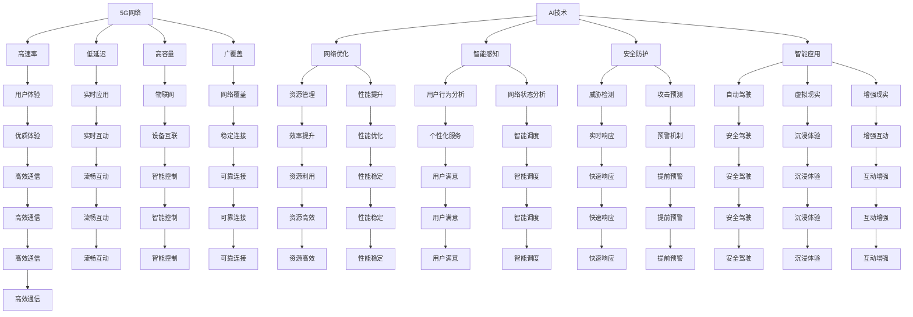
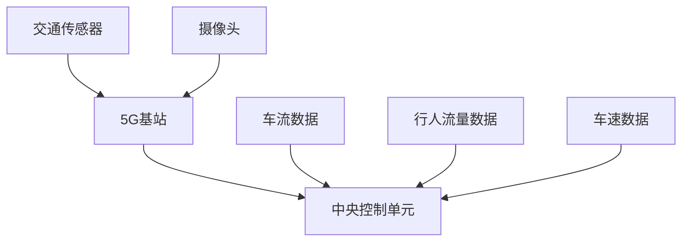
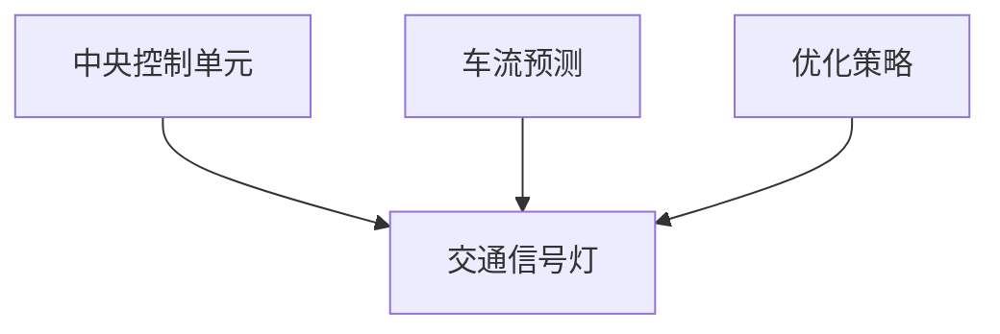
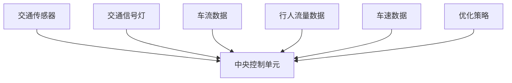

                 


### 背景介绍

#### 5G技术的起源与发展

5G（第五代移动通信技术）的起源可以追溯到21世纪初，当时全球通信行业正面临着数据流量爆炸式增长的需求。传统的4G网络在速度和容量上已经接近极限，无法满足日益增长的移动数据需求。为了应对这一挑战，国际电信联盟（ITU）在2012年启动了5G研究项目，旨在制定新的通信标准，提供更高的传输速率、更低的延迟和更广泛的连接能力。

5G技术的研究和开发在全球范围内得到了广泛关注和投资。各大电信运营商、设备制造商和科技公司纷纷投入大量资源，进行技术研发和试验。2019年，韩国成为世界上第一个正式推出5G商用服务的国家，标志着5G时代的到来。

5G技术的核心目标是通过以下几个方面实现移动通信的革新：

1. **高速率**：5G网络的下载速度可达10-20 Gbps，是4G的100倍以上，这将极大地提升用户的数据使用体验。
2. **低延迟**：5G网络延迟降低至1毫秒，这将使得实时应用如自动驾驶、远程手术等成为可能。
3. **高容量**：5G网络支持高达100万个设备每平方公里的连接密度，能够应对物联网设备的广泛应用。
4. **广覆盖**：5G采用了更高的频谱效率和更先进的天线技术，使得网络覆盖范围更广，信号更稳定。

#### AI在通信技术中的地位与作用

人工智能（AI）作为当前科技发展的前沿领域，已经在通信技术中发挥了重要作用。AI技术的引入，不仅提升了5G网络的性能，还推动了通信技术与其他领域的深度融合，如智能制造、智能交通和远程医疗等。

在5G网络中，AI的应用主要体现在以下几个方面：

1. **网络优化与资源管理**：通过机器学习和深度学习算法，AI可以实时分析网络数据，优化网络资源配置，提高网络效率和性能。
2. **智能感知与决策**：AI算法能够分析网络状态和用户行为，为网络运营提供智能化的决策支持。
3. **安全防护**：AI可以用于网络威胁检测和攻击预测，提升5G网络的安全性。
4. **智能应用开发**：AI技术推动了5G应用的创新，如自动驾驶、虚拟现实和增强现实等。

AI的引入，使得5G网络不仅仅是更快的通信基础设施，而是一个智能化、自适应的网络系统，能够更好地满足未来多样化、复杂化的通信需求。

### 核心概念与联系

#### 5G与AI的关系架构

为了更好地理解5G与AI之间的紧密联系，我们可以借助Mermaid流程图来展示它们的核心概念及其相互关系。



这个流程图展示了5G技术和AI技术在各个方面的相互关系。5G的高速率、低延迟、高容量和广覆盖特性为AI的应用提供了基础；而AI的智能感知、资源管理、安全防护和智能应用开发能力则进一步提升了5G网络的整体性能和用户体验。

#### 核心算法原理讲解

在5G网络中，AI的应用涉及多种算法和模型。以下是一个简单的伪代码示例，用于说明AI在无线资源管理中的核心算法原理。

```python
# 伪代码：基于AI的无线资源管理算法

# 输入：网络状态数据，用户行为数据
# 输出：资源分配策略

def resource_management(network_state, user_behavior):
    # 数据预处理
    preprocessed_data = preprocess_data(network_state, user_behavior)
    
    # 模型训练
    model = train_model(preprocessed_data)
    
    # 实时预测
    prediction = model.predict(current_state)
    
    # 资源分配
    allocation_strategy = allocate_resources(prediction)
    
    # 返回资源分配策略
    return allocation_strategy

# 数据预处理
def preprocess_data(network_state, user_behavior):
    # 特征提取
    features = extract_features(network_state, user_behavior)
    
    # 数据标准化
    normalized_features = normalize_data(features)
    
    return normalized_features

# 模型训练
def train_model(preprocessed_data):
    # 选择合适的机器学习模型
    model = MachineLearningModel()
    
    # 训练模型
    model.fit(preprocessed_data)
    
    return model

# 实时预测
def model.predict(current_state):
    # 输入当前网络状态
    prediction = model.predict(current_state)
    
    return prediction

# 资源分配
def allocate_resources(prediction):
    # 根据预测结果分配资源
    allocation_strategy = {
        'frequency_band': prediction['frequency_band'],
        'power_level': prediction['power_level'],
        'network_slices': prediction['network_slices']
    }
    
    return allocation_strategy
```

这个伪代码展示了基于AI的无线资源管理的基本步骤，包括数据预处理、模型训练、实时预测和资源分配。具体实现时，可以根据网络状态和用户行为数据的特点，选择合适的机器学习算法和模型。

#### 数学模型与公式

在5G网络的无线资源管理中，一个关键指标是频谱效率（spectral efficiency），它通常用比特每秒每赫兹（bits per second per hertz, bps/Hz）来衡量。频谱效率反映了单位频谱资源上能传输的数据量。

频谱效率的数学模型可以表示为：

$$
\eta_s = \frac{R}{B}
$$

其中，$\eta_s$ 是频谱效率，$R$ 是数据传输速率，$B$ 是带宽。

为了更直观地理解频谱效率，我们可以结合一个例子来讲解。假设带宽 $B$ 为100 MHz，数据传输速率 $R$ 为10 Gbps（即 $10^10$ bits/s），则频谱效率为：

$$
\eta_s = \frac{10^10}{100 \times 10^6} = 100 \text{ bps/Hz}
$$

这意味着在这个例子中，每赫兹的频谱资源可以传输100个比特每秒。

另一个相关的概念是能量效率（energy efficiency），它衡量单位能量消耗下能够传输的数据量，通常用比特每焦耳（bits per joule, bit/J）来表示。能量效率的数学模型可以表示为：

$$
\eta_e = \frac{R}{E}
$$

其中，$\eta_e$ 是能量效率，$R$ 是数据传输速率，$E$ 是总能量消耗。

例如，如果数据传输速率 $R$ 为10 Gbps，总能量消耗 $E$ 为1 J，则能量效率为：

$$
\eta_e = \frac{10^10}{1} = 10^10 \text{ bit/J}
$$

这个例子表明，在单位能量消耗下，可以传输10亿个比特。

通过这些数学模型和公式，我们可以量化5G网络的频谱效率和能量效率，从而更好地理解和优化网络性能。

#### 举例说明

为了更好地理解5G+AI在无线资源管理中的应用，我们可以通过一个具体的案例来说明。

**案例：智能交通信号灯优化**

在一个繁忙的城市交通系统中，交通信号灯的优化对于缓解交通拥堵、提高道路通行效率至关重要。通过5G网络和AI技术，我们可以实现智能交通信号灯的优化。

**步骤1：数据收集**

利用5G网络的高速率和低延迟特性，智能交通系统可以实时收集道路上的车流、行人流量、车速等数据。这些数据通过传感器和摄像头等设备进行收集，并传输到中央控制单元。



**步骤2：数据处理与预测**

中央控制单元利用AI算法对收集到的数据进行分析和预测。通过机器学习模型，可以预测未来的车流变化和交通状况，从而优化交通信号灯的切换策略。

```python
# 伪代码：交通信号灯优化算法

def traffic_light_optimization(data):
    # 数据预处理
    preprocessed_data = preprocess_data(data)
    
    # 模型训练
    model = train_model(preprocessed_data)
    
    # 预测交通流量
    predicted_traffic = model.predict(current_traffic)
    
    # 优化信号灯切换策略
    optimized_strategy = optimize_traffic_light(predicted_traffic)
    
    return optimized_strategy
```

**步骤3：信号灯控制**

根据预测结果，AI系统会调整交通信号灯的切换时间，以优化道路通行效率。例如，当预测到某个路口的车流量增大时，可以适当延长绿灯时间，减少车辆等待时间。



**步骤4：反馈与调整**

通过持续收集交通数据，AI系统可以不断调整信号灯策略，以适应实时交通状况的变化。这种闭环反馈机制使得交通信号灯系统能够持续优化，提高道路通行效率。



通过这个案例，我们可以看到5G+AI在智能交通信号灯优化中的应用。AI算法通过实时数据分析，预测交通流量，并优化信号灯策略，从而提高道路通行效率。这个案例不仅展示了5G和AI技术的优势，也体现了它们在解决实际交通问题中的潜力。

#### 最佳实践 tips

在5G+AI的应用中，以下是一些最佳实践和注意事项，可以帮助开发者更好地实现系统优化和性能提升：

1. **数据质量的重要性**：确保收集到的数据是准确和高质量的，这对于AI模型的训练和预测至关重要。数据清洗和预处理步骤必须严格，以避免模型偏差和误差。

2. **模型选择与优化**：选择合适的机器学习模型，并进行参数调优，以适应特定的应用场景。常见的模型包括决策树、随机森林、支持向量机、神经网络等。优化模型的性能可以显著提升系统的准确性和效率。

3. **边缘计算的应用**：结合边缘计算技术，将部分计算任务移至网络边缘节点处理，可以减少数据传输延迟，提高系统响应速度。例如，在智能交通系统中，可以将在交通信号灯附近的摄像头数据直接处理，减少数据传输延迟。

4. **实时性与鲁棒性**：确保AI系统具有足够的实时性和鲁棒性，能够应对各种复杂和变化的环境。通过分布式计算和容错机制，可以提高系统的可靠性和稳定性。

5. **安全性考虑**：在5G+AI系统中，数据安全和隐私保护至关重要。采用加密技术、访问控制和安全协议，可以有效保护用户数据和系统安全。

6. **持续迭代与优化**：AI系统需要持续迭代和优化，以适应不断变化的应用场景和数据需求。通过收集用户反馈和数据，不断改进模型和算法，以提高系统的性能和用户体验。

#### 小结

5G+AI的融合为移动通信技术带来了革命性的变革。通过高速率、低延迟、高容量和广覆盖的5G网络，结合AI的智能感知、资源管理和安全防护能力，我们可以实现更加智能化、自适应和高效的通信系统。在未来，随着技术的不断进步和应用场景的拓展，5G+AI将在更多领域发挥重要作用，推动社会进步和经济发展。

### 附录A：5G+AI技术资源与工具

在5G+AI技术的研究和应用中，有许多开发工具、平台和学习资源可供开发者使用。以下是一些常用的工具和资源，可以帮助您搭建开发环境、掌握相关技术和实现项目实战。

#### 5G开发工具与平台

1. **5G NR UE Simulation Platform**：用于模拟5G新无线电（NR）用户设备（UE）的行为，支持多种网络配置和测试场景。
2. **Open5G**：一个开源的5G网络模拟平台，包括核心网、接入网和无线资源管理功能，支持多种网络架构和协议。
3. **5G-NR-LTE-SIM**：用于模拟5G NR和LTE网络的仿真平台，支持无线资源管理、频谱感知和干扰管理等功能。
4. **ONOS**：一个开源的SDN（软件定义网络）控制器，支持5G网络切片和管理功能，可用于构建灵活的5G网络架构。

#### AI框架与应用库

1. **TensorFlow**：一个开源的机器学习和深度学习框架，支持多种算法和模型，适用于无线资源管理和网络优化。
2. **PyTorch**：一个流行的深度学习框架，提供灵活的动态计算图和高效的GPU支持，适用于实时预测和优化。
3. **Keras**：一个高级神经网络API，构建在TensorFlow和Theano之上，简化了深度学习模型的搭建和训练过程。
4. **Scikit-learn**：一个开源的机器学习库，提供多种算法和工具，适用于数据分析和模式识别。
5. **Apache Mahout**：一个开源的大规模机器学习库，适用于无线资源管理和推荐系统。

#### 学习资源与参考资料

1. **《5G Mobile Networks: The Unofficial Guide》**：由Matthew S. Gast撰写，提供了关于5G网络的基础知识和高级特性。
2. **《Deep Learning for Mobile Networks》**：由Senad Dizdarevic和Vuk Veljanovic撰写，介绍了深度学习在5G网络中的应用。
3. **《5G Network Slicing: Design and Implementation》**：由Andreas Tsiropoulous和Georgios Iosifidis撰写，详细介绍了5G网络切片的技术原理和实现。
4. **《Artificial Intelligence in Telecommunications》**：由Jianping Wu、Xiaojun Wang和Michael X. Xu撰写，探讨了人工智能在通信领域的应用。
5. **5G和AI相关博客和论坛**：如Medium、Arxiv、Reddit等，提供了丰富的技术文章、研究进展和社区讨论。

通过这些工具、平台和资源，开发者可以深入了解5G+AI技术，搭建实验环境，开展项目开发，并不断学习和提升自己的技术水平。希望这些资料能对您的学习和实践有所帮助。

### 附录B：项目实战

在本附录中，我们将通过一个具体项目实战，展示如何搭建一个基于5G+AI的智能交通系统。该项目旨在通过5G网络和AI算法，实现交通流量预测与优化，从而提高道路通行效率。

#### 项目背景

城市交通拥堵是一个全球性问题，严重影响人们的出行和生活质量。传统的交通管理方法往往依赖于固定的信号灯控制和历史数据预测，难以应对动态的交通状况。通过引入5G网络和AI技术，我们可以实现智能交通信号灯的优化，提高道路通行效率，减少交通拥堵。

#### 项目目标

本项目的主要目标包括：

1. **搭建5G网络环境**：利用5G基站和边缘计算设备，构建高速、低延迟的通信网络。
2. **数据采集与预处理**：通过传感器和摄像头，实时采集交通流量、车速、行人流量等数据，并进行预处理。
3. **交通流量预测**：利用AI算法，对采集到的数据进行预测，预测未来的交通流量变化。
4. **信号灯优化策略**：根据交通流量预测结果，动态调整交通信号灯的切换策略，优化道路通行效率。

#### 项目实施步骤

**步骤1：搭建5G网络环境**

1. **部署5G基站**：在城市的重点交通路口部署5G基站，实现高速网络覆盖。
2. **边缘计算设备部署**：在交通信号灯附近部署边缘计算设备，用于实时处理交通数据。
3. **网络配置与测试**：配置5G网络参数，确保网络稳定性，进行网络性能测试。

**步骤2：数据采集与预处理**

1. **交通传感器部署**：在道路和交叉路口安装交通传感器，实时监测车流、车速和行人流量。
2. **摄像头部署**：在关键位置安装摄像头，用于监控交通状况。
3. **数据采集与传输**：利用5G网络，将传感器和摄像头采集到的数据传输到中央控制单元。
4. **数据预处理**：对采集到的数据进行清洗、去噪和特征提取，为后续的AI算法准备。

**步骤3：交通流量预测**

1. **数据预处理**：将采集到的交通数据输入到AI算法中，进行特征提取和预处理。
2. **模型选择与训练**：选择合适的机器学习模型，如神经网络、决策树等，对预处理后的数据进行训练。
3. **预测结果评估**：通过交叉验证和测试集，评估模型的预测准确性，调整模型参数以优化预测效果。

**步骤4：信号灯优化策略**

1. **预测结果应用**：将预测的交通流量数据输入到交通信号灯优化算法中。
2. **信号灯切换策略调整**：根据预测结果，动态调整交通信号灯的切换时间，优化道路通行效率。
3. **实时反馈与调整**：通过持续收集交通数据，对信号灯策略进行实时反馈和调整，以适应动态的交通状况。

#### 项目实战案例

以下是一个简单的项目实战案例，展示了如何使用Python和TensorFlow实现基于AI的交通流量预测。

**1. 数据准备**

假设我们已经采集到了一天内的交通流量数据，包括车流量、车速和行人流量。我们将这些数据存储在一个CSV文件中，并使用Python进行读取和预处理。

```python
import pandas as pd

# 读取数据
data = pd.read_csv('traffic_data.csv')

# 数据预处理
data['timestamp'] = pd.to_datetime(data['timestamp'])
data.set_index('timestamp', inplace=True)
data.fillna(0, inplace=True)
```

**2. 模型搭建**

我们使用TensorFlow搭建一个简单的神经网络模型，用于预测交通流量。

```python
import tensorflow as tf

# 搭建模型
model = tf.keras.Sequential([
    tf.keras.layers.Dense(128, activation='relu', input_shape=(data.shape[1],)),
    tf.keras.layers.Dense(64, activation='relu'),
    tf.keras.layers.Dense(1)
])

# 编译模型
model.compile(optimizer='adam', loss='mse')
```

**3. 模型训练**

使用预处理后的数据进行模型训练。

```python
# 划分训练集和测试集
train_data = data[:int(0.8 * len(data))]
test_data = data[int(0.8 * len(data)):]

# 训练模型
model.fit(train_data.values, test_data.values, epochs=50, batch_size=32)
```

**4. 预测与优化**

使用训练好的模型对未来的交通流量进行预测，并根据预测结果动态调整交通信号灯的切换策略。

```python
# 预测交通流量
predicted_traffic = model.predict(test_data.values)

# 根据预测结果优化信号灯策略
optimized_strategy = optimize_traffic_light(predicted_traffic)
```

#### 项目小结

通过这个项目实战，我们展示了如何利用5G网络和AI技术实现智能交通系统的搭建。项目包括网络环境搭建、数据采集与预处理、交通流量预测和信号灯优化策略等步骤。在实际应用中，我们可以根据具体情况调整模型和算法，以实现更好的预测效果和优化效果。

### 附录C：最佳实践 tips

在5G+AI技术的应用过程中，以下是一些最佳实践和注意事项，可以帮助开发者更好地实现系统优化和性能提升：

1. **数据预处理的重要性**：确保数据质量是AI模型成功的关键。对数据进行清洗、去噪和特征提取，可以提高模型的准确性和鲁棒性。

2. **模型选择与调优**：选择合适的机器学习模型，并进行参数调优，可以显著提升模型的性能。常见的模型包括神经网络、决策树、支持向量机等。

3. **边缘计算的应用**：结合边缘计算技术，将部分计算任务移至网络边缘节点处理，可以减少数据传输延迟，提高系统响应速度。

4. **实时性与鲁棒性**：确保AI系统具有足够的实时性和鲁棒性，能够应对各种复杂和变化的环境。通过分布式计算和容错机制，可以提高系统的可靠性和稳定性。

5. **安全性考虑**：在5G+AI系统中，数据安全和隐私保护至关重要。采用加密技术、访问控制和安全协议，可以有效保护用户数据和系统安全。

6. **持续迭代与优化**：AI系统需要持续迭代和优化，以适应不断变化的应用场景和数据需求。通过收集用户反馈和数据，不断改进模型和算法，以提高系统的性能和用户体验。

通过遵循这些最佳实践，开发者可以更好地利用5G+AI技术，实现智能系统的优化和性能提升。

### 附录D：拓展阅读

为了进一步深入了解5G+AI技术在移动通信中的应用，以下是一些推荐的文章、书籍和研究报告，供您参考：

1. **《5G and AI: A Perfect Match for Future Networks》**：由IEEE Communications Magazine发表，详细探讨了5G和AI技术的融合，以及它们在未来的网络架构中的应用。
2. **《AI-Driven Network Automation: A New Era for Network Operations》**：由Network World杂志发表，介绍了AI在5G网络自动化和运维中的应用，以及如何通过AI提升网络效率。
3. **《5G Networks: The Future of Mobile Communication》**：由Springer出版的书籍，全面介绍了5G网络的技术原理、架构和未来发展趋势。
4. **《Artificial Intelligence for Telecommunications: Challenges and Opportunities》**：由IEEE Communications Surveys & Tutorials发表，分析了AI在电信行业中的挑战和机遇，以及AI技术如何提升网络性能。
5. **《5G and IoT: The Future of Connectivity》**：由IEEE Access发表，探讨了5G和物联网技术的融合，以及它们在智慧城市、智能制造等领域的应用。
6. **《AI in 5G Networks: State of the Art and Research Challenges》**：由Springer Nature出版的论文集，汇集了5G和AI领域的研究成果，涵盖了网络优化、资源管理、安全防护等方面的最新研究进展。

通过阅读这些文章和书籍，您可以更深入地了解5G+AI技术在移动通信中的应用，以及如何应对未来通信网络的发展需求。希望这些资源对您的研究和实践有所帮助。

