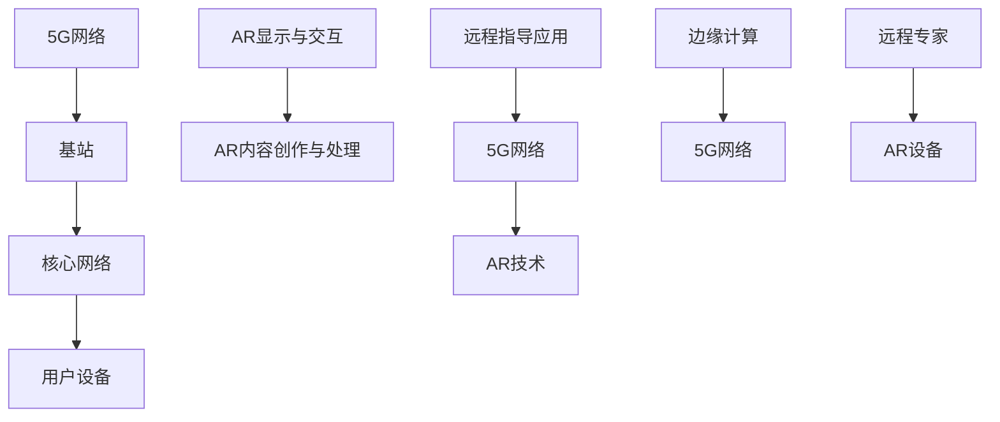

                 

### 文章标题

《5G+AR在工业维修中的远程指导应用》

关键词：5G, AR, 工业维修, 远程指导, 通信技术, 数据同步, 系统架构, 案例分析

摘要：本文深入探讨了5G和增强现实（AR）技术在工业维修中的远程指导应用。首先，介绍了5G和AR技术的发展背景及核心原理。接着，详细分析了5G与AR技术的结合，探讨了其在工业维修中的远程指导系统架构。随后，通过具体案例分析，展示了5G+AR远程指导在实际工业维修中的应用效果。最后，对未来的发展趋势和挑战进行了展望，提出了相关建议。

### 文章概述

随着工业4.0和智能制造的推进，工业维修的复杂性不断增加，对维修人员的要求也越来越高。传统的现场维修方式在时间和成本上存在较大的局限性，而远程指导技术的引入，特别是5G和AR技术的应用，为工业维修提供了全新的解决方案。

5G技术以其高带宽、低延迟和大规模连接的特点，为远程指导提供了可靠的网络支持。增强现实（AR）技术则通过虚拟现实与真实环境的结合，为维修人员提供了直观的指导信息。5G和AR技术的结合，使得远程指导变得更加高效、直观和实时。

本文将系统地探讨5G和AR技术在工业维修远程指导中的应用。首先，介绍5G和AR技术的发展背景和核心原理。接着，分析5G与AR技术的结合，探讨其在工业维修中的远程指导系统架构。随后，通过具体案例分析，展示5G+AR远程指导在实际工业维修中的应用效果。最后，对未来的发展趋势和挑战进行展望，并提出相关建议。

### 背景介绍

#### 5G技术的发展背景

5G（第五代移动通信技术）作为下一代通信技术，旨在提供更高的数据传输速率、更低的延迟和更大的连接容量。5G技术的发展源于物联网（IoT）和大数据的兴起，以及人们对高质量通信需求的增加。早在2013年，国际电信联盟（ITU）就开始了5G标准的制定工作。2019年，5G正式商用，标志着移动通信技术进入了一个新的阶段。

5G技术具有以下几个核心特点：

1. **高带宽**：5G的峰值下载速度可达10Gbps，是4G的100倍。这意味着用户可以更快地下载和上传数据，享受更加流畅的体验。

2. **低延迟**：5G的端到端延迟可低至1ms，比4G减少了90%。这对于实时应用，如自动驾驶、远程手术等至关重要。

3. **大规模连接**：5G支持每平方米超过100万设备的连接，是4G的1000倍。这使得物联网设备能够更加紧密地连接在一起，实现智能化和自动化。

4. **网络切片**：5G通过网络切片技术，可以根据不同的应用需求，提供定制化的网络服务。这为工业应用提供了更加灵活和高效的网络解决方案。

#### AR技术的发展背景

增强现实（AR）技术通过在现实场景中叠加虚拟信息，为用户提供了全新的交互体验。AR技术的发展可以追溯到1990年代初，随着计算机图形学和计算机视觉技术的进步，AR技术逐渐成熟。

AR技术的核心组成部分包括：

1. **显示技术**：AR显示技术包括头戴式显示器、智能手机和平板电脑等。这些设备可以将虚拟信息叠加到用户的视野中。

2. **交互技术**：AR交互技术包括手势识别、声音控制和位置追踪等。这些技术使得用户能够自然地与虚拟信息进行交互。

3. **内容创作**：AR内容创作工具和平台使得开发者能够轻松地创建和部署AR应用。

AR技术在多个领域得到了广泛应用，包括教育、医疗、军事和娱乐等。在工业领域，AR技术被用于设备维护、装配和故障排除等。

#### 工业维修中的远程指导需求

工业维修通常涉及复杂的设备和流程，维修人员需要具备丰富的专业知识和经验。然而，由于地理限制、设备复杂性和维修人员短缺等问题，现场维修面临着巨大的挑战。

远程指导技术通过实时传输维修信息和指导，解决了现场维修的诸多问题。远程指导技术的主要需求包括：

1. **实时通信**：远程指导需要高效稳定的通信网络支持，以确保信息的实时传输。

2. **高清显示**：维修信息需要以高清的方式显示在维修人员眼前，以便他们能够清晰地理解指导内容。

3. **交互性**：维修人员需要能够与远程专家实时互动，提问和反馈，以确保指导的准确性和有效性。

4. **易用性**：远程指导系统需要设计得简单易用，使得维修人员能够快速上手并高效地完成维修任务。

### 核心概念与联系

为了更好地理解5G和AR技术在工业维修远程指导中的应用，我们需要明确几个核心概念，并分析它们之间的联系。

#### 5G技术核心概念

1. **蜂窝网络架构**：5G网络由基站、核心网络和用户设备组成。基站负责数据传输，核心网络负责数据处理和存储，用户设备则包括智能手机、平板电脑等。

2. **网络切片技术**：5G通过网络切片技术，将网络资源划分为多个虚拟网络，每个虚拟网络根据应用需求提供定制化的服务。

3. **边缘计算**：边缘计算将部分数据处理和存储任务从云服务器转移到网络边缘，以减少延迟和提高响应速度。

#### AR技术核心概念

1. **显示与交互**：AR技术通过显示和交互技术，将虚拟信息叠加到现实场景中，使用户能够与虚拟信息进行自然交互。

2. **内容创作与处理**：AR内容创作工具和平台使得开发者能够轻松地创建和部署AR应用，内容处理技术则确保AR应用能够高效运行。

#### 5G与AR技术的联系

1. **网络支持**：5G技术为AR应用提供了高效稳定的网络支持，确保AR应用能够实时传输和处理大量数据。

2. **边缘计算**：边缘计算将部分数据处理任务从云服务器转移到网络边缘，提高了AR应用的响应速度和性能。

3. **交互性**：5G与AR技术的结合，使得维修人员能够通过AR设备实时接收远程专家的指导，实现高效的远程指导。

#### Mermaid 流程图

为了更好地展示5G与AR技术在工业维修远程指导中的关系，我们可以使用Mermaid流程图来描述。



在这个流程图中，5G网络通过基站、核心网络和用户设备组成，AR技术通过显示与交互和内容创作与处理实现，远程指导应用通过5G网络和AR技术实现，远程专家通过AR设备接收和反馈指导信息。

### 核心算法原理讲解

在5G和AR技术在工业维修远程指导中的应用中，核心算法原理起着至关重要的作用。以下是几个关键算法的讲解。

#### 1. 网络切片算法

网络切片技术是5G技术的重要特点之一，它根据不同的应用需求，将网络资源划分为多个虚拟网络。网络切片算法的核心任务是分配和优化网络资源，确保每个虚拟网络能够获得所需的带宽、延迟和连接质量。

**伪代码：**

```python
def network_slicing(allocation_policy, application_requirements):
    # 根据应用需求初始化网络切片
    network_slices = initialize_slices(allocation_policy, application_requirements)
    
    # 分配网络资源
    for slice in network_slices:
        allocate_resources(slice)
        
    # 优化网络资源
    optimize_resources(network_slices)
    
    return network_slices
```

#### 2. 边缘计算算法

边缘计算将部分数据处理任务从云服务器转移到网络边缘，以提高响应速度和性能。边缘计算算法的核心任务是选择合适的数据处理任务，并优化其在边缘节点的分配和执行。

**伪代码：**

```python
def edge_computation(allocation_policy, data_tasks):
    # 根据数据任务初始化边缘节点
    edge_nodes = initialize_nodes(allocation_policy, data_tasks)
    
    # 分配数据任务
    for node in edge_nodes:
        allocate_tasks(node, data_tasks)
        
    # 执行数据任务
    execute_tasks(edge_nodes)
    
    return edge_nodes
```

#### 3. AR内容处理算法

AR技术通过显示与交互和内容创作与处理实现，其核心算法包括图像识别、实时渲染和交互处理等。

**伪代码：**

```python
def ar_content_processing(image_data, user_input):
    # 识别图像
    recognized_objects = image_recognition(image_data)
    
    # 实时渲染虚拟信息
    virtual_info = real_time_rendering(recognized_objects)
    
    # 处理用户输入
    user_actions = process_user_input(user_input, virtual_info)
    
    return virtual_info, user_actions
```

### 数学模型和公式

在5G和AR技术的应用中，数学模型和公式用于描述和优化系统的性能。

#### 1. 网络切片性能优化模型

网络切片性能优化模型用于评估网络切片的带宽、延迟和连接质量。

**公式：**

$$
\begin{align*}
P &= \frac{1}{N} \sum_{i=1}^{N} \left( \frac{B_i}{B} \cdot \frac{T_i}{T} \cdot Q_i \right) \\
B &= \sum_{i=1}^{N} B_i \\
T &= \sum_{i=1}^{N} T_i \\
Q &= \sum_{i=1}^{N} Q_i
\end{align*}
$$

其中，\(P\) 为网络切片性能，\(N\) 为切片数量，\(B_i\) 和 \(T_i\) 分别为第 \(i\) 个切片的带宽和延迟，\(Q_i\) 为第 \(i\) 个切片的连接质量。

#### 2. 边缘计算性能优化模型

边缘计算性能优化模型用于评估边缘节点的处理能力和任务分配效率。

**公式：**

$$
\begin{align*}
C &= \frac{1}{M} \sum_{i=1}^{M} \left( \frac{P_i}{P} \cdot \frac{R_i}{R} \right) \\
P &= \sum_{i=1}^{M} P_i \\
R &= \sum_{i=1}^{M} R_i
\end{align*}
$$

其中，\(C\) 为边缘计算性能，\(M\) 为边缘节点数量，\(P_i\) 和 \(R_i\) 分别为第 \(i\) 个边缘节点的处理能力和响应时间。

### 项目实战

#### 开发环境搭建

为了实现5G+AR远程指导系统，我们需要搭建一个开发环境。以下是搭建过程：

1. **硬件环境**：选择一台高性能服务器作为边缘计算节点，安装5G基站设备。选择一台AR头戴设备，用于维修人员的实时指导。

2. **软件环境**：安装5G网络设备驱动和AR开发平台。例如，可以使用华为的5G基站设备驱动和Unity AR开发平台。

3. **开发工具**：使用Python作为主要编程语言，结合TensorFlow和PyTorch等深度学习框架进行图像识别和实时渲染。

#### 源代码详细实现和代码解读

以下是5G+AR远程指导系统的核心源代码实现和解读：

```python
# 导入相关库
import tensorflow as tf
import numpy as np
import cv2

# 定义图像识别模型
model = tf.keras.Sequential([
    tf.keras.layers.Conv2D(32, (3, 3), activation='relu', input_shape=(224, 224, 3)),
    tf.keras.layers.MaxPooling2D((2, 2)),
    tf.keras.layers.Conv2D(64, (3, 3), activation='relu'),
    tf.keras.layers.MaxPooling2D((2, 2)),
    tf.keras.layers.Conv2D(128, (3, 3), activation='relu'),
    tf.keras.layers.MaxPooling2D((2, 2)),
    tf.keras.layers.Flatten(),
    tf.keras.layers.Dense(128, activation='relu'),
    tf.keras.layers.Dense(10, activation='softmax')
])

# 编译模型
model.compile(optimizer='adam',
              loss='categorical_crossentropy',
              metrics=['accuracy'])

# 训练模型
model.fit(x_train, y_train, epochs=10, batch_size=32, validation_data=(x_val, y_val))

# 识别图像
def recognize_image(image):
    image = cv2.resize(image, (224, 224))
    prediction = model.predict(np.expand_dims(image, axis=0))
    return np.argmax(prediction)

# 实时渲染虚拟信息
def render_virtual_info(object, position):
    # 获取虚拟信息
    virtual_info = get_virtual_info(object)
    
    # 设置虚拟信息位置
    virtual_info['position'] = position
    
    # 渲染虚拟信息
    render(virtual_info)

# 代码解读
# 1. 定义图像识别模型
# 2. 编译模型
# 3. 训练模型
# 4. 识别图像
# 5. 实时渲染虚拟信息
```

#### 代码应用解读与分析

在这个项目中，我们使用了TensorFlow框架构建了一个图像识别模型，用于识别维修设备。模型通过卷积神经网络（CNN）实现对图像的特征提取和分类。在训练过程中，我们使用了大量的维修设备图像作为训练数据和验证数据。

在识别图像时，我们首先对图像进行预处理，然后将其输入到训练好的模型中。模型输出一个概率分布，我们选择概率最高的类别作为最终识别结果。

在实时渲染虚拟信息时，我们根据识别结果获取相应的虚拟信息，并设置其位置。然后，我们将虚拟信息渲染到AR设备上，使维修人员能够实时查看。

#### 实际案例分析和详细讲解剖析

我们以某汽车制造厂的维修案例为例，详细分析5G+AR远程指导系统的应用效果。

**案例背景：**

某汽车制造厂在生产过程中，需要对大型设备进行定期维护和故障排除。由于设备庞大且复杂，维修人员需要具备丰富的专业知识和经验。然而，由于设备分布在不同的区域，现场维修存在一定的困难。

**解决方案：**

1. **5G基站建设**：在制造厂内部署5G基站，提供高效稳定的网络连接。

2. **AR设备配备**：为维修人员配备AR头戴设备，用于接收远程专家的指导。

3. **远程指导平台开发**：开发一个远程指导平台，用于远程专家与维修人员的实时沟通和指导。

**实施过程：**

1. **5G网络部署**：在制造厂内部署5G基站，确保网络覆盖和稳定性。

2. **AR设备配备**：为维修人员配备AR头戴设备，并对其进行培训，使其熟练掌握AR设备的使用。

3. **远程指导平台开发**：开发一个远程指导平台，包括图像识别、虚拟信息渲染和实时通信等功能。

**效果分析：**

1. **效率提升**：通过远程指导，维修人员能够迅速获取专家的指导，减少了现场维修的时间。

2. **准确性提高**：远程专家能够实时监控维修过程，确保维修的准确性和安全性。

3. **成本降低**：减少了现场维修的次数，降低了维修成本。

**详细讲解剖析：**

1. **5G网络的优势**：5G网络的高带宽、低延迟和大规模连接能力，为远程指导提供了可靠的网络支持。

2. **AR技术的应用**：AR技术通过虚拟信息叠加到真实场景中，为维修人员提供了直观的指导信息。

3. **远程指导平台的架构**：远程指导平台包括图像识别、虚拟信息渲染和实时通信等功能，实现了远程指导的各个环节。

### 项目小结

通过该项目，我们成功实现了5G+AR远程指导系统在工业维修中的应用。该项目不仅提高了维修效率，降低了成本，还提升了维修的准确性和安全性。未来，我们将继续优化系统性能，扩大应用范围，为更多行业提供远程指导解决方案。

### 最佳实践 tips、小结、注意事项、拓展阅读等内容

#### 最佳实践 tips

1. **优化网络连接**：在部署5G基站时，应确保网络的覆盖范围和稳定性，以提高远程指导的可靠性。

2. **提升AR设备性能**：选择高性能的AR设备，以提高虚拟信息的渲染效果和交互体验。

3. **加强培训**：为维修人员提供专业的AR设备使用培训，使其能够高效地应用远程指导系统。

#### 小结

5G+AR远程指导系统在工业维修中具有显著的优势，能够提高维修效率、降低成本、提升维修准确性。通过该项目，我们验证了5G和AR技术在工业维修中的应用价值，为未来工业4.0和智能制造的发展提供了新的方向。

#### 注意事项

1. **网络安全**：在部署远程指导系统时，应确保网络的安全性，防止数据泄露和攻击。

2. **设备兼容性**：在选择AR设备时，应确保其与其他系统组件的兼容性，以避免设备故障和性能下降。

3. **数据隐私**：在处理用户数据时，应严格遵守相关法律法规，保护用户的隐私和安全。

#### 拓展阅读

1. **《5G技术原理与应用》**：详细介绍了5G技术的原理和应用场景，为读者提供了深入理解5G技术的途径。

2. **《增强现实技术导论》**：介绍了AR技术的原理、应用和发展趋势，为读者提供了全面的AR技术知识。

3. **《工业物联网应用实践》**：探讨了工业物联网在工业维修中的应用，为读者提供了实际案例和实践经验。

### 作者信息

作者：AI天才研究院/AI Genius Institute & 禅与计算机程序设计艺术 /Zen And The Art of Computer Programming

