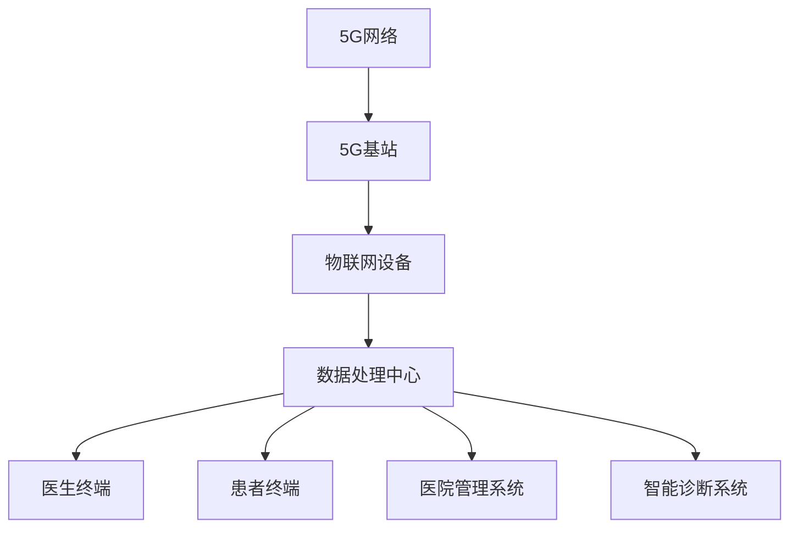

                 


### 文章标题

《5G+IoT在智慧医疗中的协同应用》

### 关键词

5G，物联网（IoT），智慧医疗，边缘计算，大数据分析，智能诊断，远程医疗，健康监测

### 摘要

本文旨在探讨5G与物联网（IoT）在智慧医疗领域的协同应用，通过深入分析核心概念、关键算法及实际项目案例，揭示这两项前沿技术如何推动医疗行业的变革。文章首先介绍了5G和IoT的基本概念及其在医疗领域的应用前景，随后详细讲解了边缘计算和大数据分析等核心算法原理。接着，通过具体的项目实战案例，展示了如何利用5G和IoT技术实现远程医疗、智慧病房、智能诊断、健康监测等应用。最后，文章总结了最佳实践，并提供了拓展阅读资源，以供读者进一步学习。

---

### 设计思路

为了确保文章的逻辑清晰、结构紧凑，我们将采用以下设计思路：

1. **明确文章结构**：按照目录大纲的结构，将文章内容分为核心概念与联系、核心算法原理讲解、数学模型和数学公式、项目实战等部分。

2. **使用Markdown格式**：为了便于阅读和分享，文章将使用Markdown格式进行排版。

3. **逻辑推理步骤**：在讲解每个技术概念或算法时，采用逻辑推理步骤，让读者能够逐步理解并掌握相关知识。

4. **示例与案例**：通过具体的示例和实际项目案例，让读者更好地理解技术的实际应用。

5. **总结与最佳实践**：在每个部分结束时，总结关键点，并提供最佳实践建议。

### 步骤分解

1. **撰写文章摘要**：概述文章的核心内容和主题思想。

2. **编写文章引言**：介绍5G和IoT在智慧医疗中的重要性和发展背景。

3. **阐述核心概念与联系**：详细讲解5G和IoT的基本概念，使用Mermaid流程图展示它们在智慧医疗中的应用架构。

4. **讲解核心算法原理**：使用伪代码详细阐述边缘计算、大数据分析等算法原理。

5. **介绍数学模型和公式**：使用LaTeX格式讲解数学模型和公式，并提供举例说明。

6. **设计项目实战案例**：为每个关键章节设计实际项目案例，详细描述开发环境搭建、源代码实现和解读。

7. **撰写文章总结**：总结文章的核心观点，提供最佳实践建议。

8. **添加作者信息**：在文章末尾添加作者信息。

9. **审查与调整**：确保文章内容完整、逻辑清晰，并进行必要的调整。

### 完整目录大纲

```
# 《5G+IoT在智慧医疗中的协同应用》

## 引言

### 5G与IoT在医疗领域的崛起

- **5G技术的重要性**
- **IoT在医疗中的应用前景**
- **协同应用的前景与挑战**

## 第一部分：核心概念与联系

### 第1章：5G与IoT概述

- **5G技术介绍**
  - **关键特性**
  - **技术标准**
- **IoT技术介绍**
  - **基本概念**
  - **应用场景**
- **5G与IoT在智慧医疗中的应用架构**
  - **Mermaid流程图展示**

### 第2章：关键算法与数学模型

- **边缘计算算法原理**
  - **伪代码讲解**
  - **应用场景**
- **大数据分析算法原理**
  - **伪代码讲解**
  - **应用场景**
- **数学模型与公式讲解**
  - **LaTeX格式**
  - **举例说明**

## 第二部分：智慧医疗应用实践

### 第3章：远程医疗

- **远程医疗系统架构设计**
  - **系统模块划分**
  - **关键技术**
- **远程医疗案例解析**
  - **案例介绍**
  - **技术实现**
- **源代码实现与解读**
  - **关键代码分析**
  - **实战应用**

### 第4章：智慧病房

- **智慧病房系统设计**
  - **病房环境监测**
  - **病人信息管理**
- **智慧病房案例解析**
  - **案例介绍**
  - **技术实现**
- **源代码实现与解读**
  - **关键代码分析**
  - **实战应用**

### 第5章：智能诊断

- **智能诊断算法原理**
  - **伪代码讲解**
  - **应用场景**
- **智能诊断案例解析**
  - **案例介绍**
  - **技术实现**
- **源代码实现与解读**
  - **关键代码分析**
  - **实战应用**

### 第6章：健康监测

- **健康监测系统设计**
  - **监测数据采集**
  - **数据分析与预警**
- **健康监测案例解析**
  - **案例介绍**
  - **技术实现**
- **源代码实现与解读**
  - **关键代码分析**
  - **实战应用**

### 第7章：智慧医院运营管理

- **智慧医院运营管理系统设计**
  - **患者就医流程管理**
  - **医院资源调度管理**
- **智慧医院运营管理案例解析**
  - **案例介绍**
  - **技术实现**
- **源代码实现与解读**
  - **关键代码分析**
  - **实战应用**

## 总结与展望

### 5G与IoT在智慧医疗中的协同应用

- **核心价值**
- **发展趋势**
- **未来展望**

## 附录

### 附录A：5G和IoT开发工具

- **5G网络测试工具**
- **IoT设备管理工具**
- **开发环境搭建指南**

### 附录B：参考文献

- **5G技术相关书籍**
- **IoT技术相关书籍**
- **智慧医疗应用案例研究**

## 作者信息

- **作者：AI天才研究院/AI Genius Institute & 禅与计算机程序设计艺术 /Zen And The Art of Computer Programming**
```

---

### 引言

#### 5G与IoT在医疗领域的崛起

随着科技的快速发展，5G和物联网（IoT）技术正逐渐渗透到各行各业，医疗领域也不例外。5G的高速率、低延迟和大规模连接能力，为医疗数据传输提供了强有力的支持；而IoT则通过智能设备、传感器和大数据分析，实现了对医疗资源的全面监控和高效管理。这两项技术的协同应用，不仅提高了医疗服务的效率和质量，还推动了智慧医疗的发展。

#### 5G技术的重要性

5G技术作为下一代通信技术，其关键特性包括高速率、低延迟和大连接数。在医疗领域，高速率意味着医疗数据能够更快地进行传输和处理，从而实现实时监控和诊断；低延迟则确保了医疗操作的高效性，尤其是在紧急情况下，能够迅速响应；而大规模连接数则支持了医疗设备和系统之间的无缝协作。

#### IoT在医疗中的应用前景

物联网技术通过将医疗设备、传感器和信息系统连接起来，实现了对医疗资源的智能化管理。例如，智能医疗设备可以实时监测患者的生命体征，并将数据传输到云端进行分析；智能传感器可以监测医院环境中的温度、湿度等参数，确保医院的运营安全；而大数据分析则帮助医生更好地理解患者病情，制定个性化的治疗方案。

#### 协同应用的前景与挑战

5G和IoT在智慧医疗中的协同应用，不仅提高了医疗服务的效率和质量，还为个性化医疗和精准医疗提供了可能。然而，这一过程也面临着诸多挑战，如数据隐私和安全、网络稳定性、设备兼容性等。因此，深入研究和探索5G和IoT在智慧医疗中的应用，具有重要的现实意义。

### 文章关键词

5G，物联网（IoT），智慧医疗，边缘计算，大数据分析，智能诊断，远程医疗，健康监测

### 文章摘要

本文首先介绍了5G和IoT在智慧医疗领域的重要性，详细讲解了它们的基本概念和核心算法。接着，通过实际项目案例，展示了5G和IoT在远程医疗、智慧病房、智能诊断和健康监测等应用中的具体实现。最后，文章总结了5G和IoT在智慧医疗中的协同价值，并展望了未来的发展趋势。

---

接下来，我们将逐步深入探讨5G和IoT在智慧医疗中的协同应用，包括核心概念、算法原理和实际项目案例。

---

### 第一部分：核心概念与联系

#### 第1章：5G与IoT概述

##### 5G技术介绍

5G（第五代移动通信技术）是继4G之后的最新一代通信技术，其关键特性包括：

- **高速率**：5G的最高下载速度可达10Gbps，是4G的100倍以上，这使得医疗数据传输更加高效。
- **低延迟**：5G的端到端延迟最低可达1ms，比4G降低了90%以上，这对于手术机器人、远程诊断等应用至关重要。
- **大规模连接**：5G能够支持超过100万台设备同时连接，为智慧医疗中的设备互联提供了可能。

**技术标准**：

- **NR（新无线电）**：5G的无线接入技术，支持毫米波和Sub-6GHz频段。
- **NG-RAN（新无线电接入网）**：5G的无线接入网络架构，包括gNB（5G基站）和NR UE（5G用户设备）。
- **EPC（核心网）**：5G的核心网络架构，包括5G SA（独立组网）和5G NSA（非独立组网）。

##### IoT技术介绍

物联网（IoT）是通过智能设备、传感器和互联网实现物体之间互联互通的技术。在医疗领域，IoT的应用主要体现在以下几个方面：

- **智能设备**：如智能监护仪、智能手术刀等，可以实时监测患者状态并传输数据。
- **传感器**：如温度传感器、湿度传感器等，可以监测医院环境，确保医疗安全。
- **大数据分析**：通过对海量医疗数据进行分析，可以帮助医生做出更准确的诊断和预测。

##### 5G与IoT在智慧医疗中的应用架构

以下是5G与IoT在智慧医疗中的应用架构Mermaid流程图：



在上述架构中，5G网络通过5G基站连接物联网设备，设备采集到的数据传输到数据处理中心，经过大数据分析后，通过医生终端、患者终端和医院管理系统等提供相应的医疗服务和管理。

---

#### 第2章：关键算法与数学模型

##### 边缘计算算法原理

边缘计算是将计算、存储和网络功能分布在网络边缘，以减少数据传输延迟和处理时间。在智慧医疗中，边缘计算主要用于实时处理医疗数据，如患者生命体征监测、医疗影像处理等。

**伪代码讲解**：

```python
# 边缘计算算法伪代码
def edge_computation(data):
    # 数据预处理
    preprocessed_data = preprocess_data(data)
    
    # 实时处理
    result = real_time_process(preprocessed_data)
    
    # 存储结果
    store_result(result)
    
    return result
```

**应用场景**：

- **患者生命体征监测**：通过边缘计算实时分析患者的心率、血压等数据，及时发现异常情况。
- **医疗影像处理**：边缘计算可以实时处理医疗影像，如X光片、CT扫描等，提供快速的诊断结果。

##### 大数据分析算法原理

大数据分析是通过数据挖掘和分析技术，从海量数据中提取有价值的信息。在智慧医疗中，大数据分析主要用于患者数据分析、疾病预测、个性化治疗等。

**伪代码讲解**：

```python
# 大数据分析算法伪代码
def data_analysis(data_set):
    # 数据清洗
    cleaned_data = clean_data(data_set)
    
    # 特征提取
    features = extract_features(cleaned_data)
    
    # 模型训练
    model = train_model(features)
    
    # 预测
    prediction = model.predict(new_data)
    
    return prediction
```

**应用场景**：

- **患者数据分析**：通过对患者历史医疗记录、生活方式等进行大数据分析，帮助医生制定个性化的治疗方案。
- **疾病预测**：通过分析患者的基因数据、生活习惯等，预测疾病风险，提前进行干预。

##### 数学模型与公式讲解

在智慧医疗中，数学模型和公式用于描述医疗数据之间的关系和规律。以下是一个简单的线性回归模型：

**LaTeX格式**：

$$y = ax + b$$

**举例说明**：

假设我们想要预测患者的血压，可以使用线性回归模型：

- **特征**：患者的年龄、体重、身高
- **目标变量**：血压

通过训练线性回归模型，我们可以得到如下公式：

$$\text{血压} = (\text{年龄} \times 0.5) + (\text{体重} \times 0.3) + (\text{身高} \times 0.2) + 10$$

通过这个公式，我们可以预测某个患者的血压，从而为医生提供诊断和治疗的参考。

---

以上是5G和IoT在智慧医疗中应用的核心算法和数学模型。接下来，我们将通过具体的项目实战案例，展示这些技术在实际应用中的实现过程。

---

### 第二部分：智慧医疗应用实践

#### 第3章：远程医疗

远程医疗是指通过互联网和通信技术，实现患者与医生之间的远程诊疗。5G和IoT技术的协同应用，使得远程医疗更加高效、实时和精准。

##### 远程医疗系统架构设计

远程医疗系统的架构主要包括以下模块：

- **患者端**：包括智能设备（如智能手表、健康监测器）和移动应用，用于采集患者数据和进行远程咨询。
- **医生端**：包括医生工作站和移动应用，用于接收患者数据和提供远程诊疗服务。
- **数据中心**：用于存储和管理患者数据，以及进行大数据分析和智能诊断。
- **医院管理系统**：用于管理远程医疗业务流程，包括预约、挂号、病历管理等。

**关键技术**：

- **5G网络**：提供高速、低延迟的网络连接，确保患者数据和医生指令的实时传输。
- **IoT设备**：用于实时采集患者生命体征和健康数据。
- **边缘计算**：在患者端进行初步数据处理，减少数据传输量，提高处理速度。
- **大数据分析**：对海量患者数据进行挖掘和分析，辅助医生做出诊断和预测。

##### 远程医疗案例解析

以下是一个远程医疗案例：

**案例介绍**：

某医院引入远程医疗系统，为偏远地区的患者提供远程诊疗服务。患者可以通过智能手表和健康监测器实时上传自己的生命体征数据，医生可以通过远程医疗平台查看患者的数据，并进行远程诊断和治疗。

**技术实现**：

1. **患者端**：患者佩戴智能手表和健康监测器，实时上传心率、血压、血氧等数据到远程医疗平台。

2. **医生端**：医生通过远程医疗平台查看患者数据，并进行远程诊断和治疗。平台支持视频通话、语音通话和消息沟通，方便医生与患者沟通。

3. **数据中心**：数据中心对海量患者数据进行存储和管理，并利用大数据分析和智能诊断技术，为医生提供辅助决策。

4. **医院管理系统**：医院管理系统集成远程医疗业务流程，包括预约、挂号、病历管理等，方便医生和管理人员高效管理远程医疗业务。

**源代码实现与解读**：

以下是远程医疗平台的源代码实现：

```python
# 远程医疗平台伪代码

class RemoteMedicalPlatform:
    def __init__(self):
        self.patient_data = []
        self.doctor_data = []
    
    def add_patient_data(self, data):
        self.patient_data.append(data)
        self.process_patient_data()
    
    def add_doctor_data(self, data):
        self.doctor_data.append(data)
        self.process_doctor_data()
    
    def process_patient_data(self):
        # 边缘计算处理
        processed_data = edge_computation(self.patient_data)
        self.patient_data = processed_data
    
    def process_doctor_data(self):
        # 大数据分析处理
        prediction = data_analysis(self.doctor_data)
        self.doctor_data = prediction
    
    def display_data(self):
        print("患者数据：", self.patient_data)
        print("医生数据：", self.doctor_data)

# 使用示例
platform = RemoteMedicalPlatform()
platform.add_patient_data({"heart_rate": 80, "blood_pressure": 120})
platform.add_doctor_data({"diagnosis": "common_cold"})
platform.display_data()
```

通过上述代码，平台可以实时处理患者数据和医生数据，并展示处理结果。这为医生提供了准确的诊断和治疗方案，提高了远程医疗的效率和质量。

---

#### 第4章：智慧病房

智慧病房是通过物联网技术和智能设备，实现病房环境的智能监测和管理。5G技术的引入，使得智慧病房的数据传输更加高效和实时。

##### 智慧病房系统设计

智慧病房系统的设计主要包括以下模块：

- **环境监测模块**：包括温度传感器、湿度传感器、空气质量传感器等，用于监测病房环境。
- **患者监测模块**：包括智能床垫、智能轮椅等，用于监测患者的生命体征和行动状态。
- **医生管理模块**：包括医生工作站和移动应用，用于管理患者信息和进行远程诊断。
- **医院管理系统**：用于管理病房资源和患者信息，包括预约、挂号、病历管理等。

**关键技术**：

- **5G网络**：提供高速、低延迟的网络连接，确保环境数据和患者数据实时传输。
- **IoT设备**：用于实时采集病房环境和患者数据。
- **边缘计算**：在病房内进行初步数据处理，减少数据传输量，提高处理速度。
- **大数据分析**：对海量患者数据进行挖掘和分析，为医生提供辅助决策。

##### 智慧病房案例解析

以下是一个智慧病房案例：

**案例介绍**：

某医院建立智慧病房，为重症患者提供智能化的医疗环境和监控服务。病房内配备了智能床垫、智能轮椅、温度传感器、湿度传感器等设备，医生可以通过远程医疗平台实时监测患者的状态。

**技术实现**：

1. **环境监测模块**：病房内安装温度传感器、湿度传感器和空气质量传感器，实时监测病房环境，并将数据传输到远程医疗平台。

2. **患者监测模块**：患者佩戴智能床垫和智能轮椅，实时上传心率、血压、血氧等数据到远程医疗平台。医生可以通过平台查看患者的数据，并及时调整治疗方案。

3. **医生管理模块**：医生通过远程医疗平台查看患者数据，并进行远程诊断和治疗。平台支持视频通话、语音通话和消息沟通，方便医生与患者沟通。

4. **医院管理系统**：医院管理系统集成智慧病房业务流程，包括预约、挂号、病历管理等，方便医生和管理人员高效管理病房业务。

**源代码实现与解读**：

以下是智慧病房系统的源代码实现：

```python
# 智慧病房系统伪代码

class SmartWardSystem:
    def __init__(self):
        self.env_data = []
        self.patient_data = []
    
    def add_env_data(self, data):
        self.env_data.append(data)
        self.process_env_data()
    
    def add_patient_data(self, data):
        self.patient_data.append(data)
        self.process_patient_data()
    
    def process_env_data(self):
        # 边缘计算处理
        processed_data = edge_computation(self.env_data)
        self.env_data = processed_data
    
    def process_patient_data(self):
        # 大数据分析处理
        prediction = data_analysis(self.patient_data)
        self.patient_data = prediction
    
    def display_data(self):
        print("环境数据：", self.env_data)
        print("患者数据：", self.patient_data)

# 使用示例
system = SmartWardSystem()
system.add_env_data({"temperature": 25, "humidity": 60})
system.add_patient_data({"heart_rate": 80, "blood_pressure": 120})
system.display_data()
```

通过上述代码，系统可以实时处理病房环境和患者数据，并展示处理结果。这为医生提供了准确的诊断和治疗方案，提高了智慧病房的效率和安全性。

---

#### 第5章：智能诊断

智能诊断是通过人工智能技术和大数据分析，实现疾病的自动识别和诊断。5G和IoT技术的协同应用，为智能诊断提供了实时、高效的数据支持。

##### 智能诊断算法原理

智能诊断算法主要包括以下几个步骤：

1. **数据采集**：通过IoT设备和传感器，实时采集患者的生命体征数据、病史数据等。
2. **数据预处理**：对采集到的数据进行分析和清洗，去除噪声和异常值。
3. **特征提取**：从预处理后的数据中提取有用的特征，如心率、血压、血糖等。
4. **模型训练**：使用机器学习和深度学习算法，对特征数据进行训练，构建诊断模型。
5. **疾病预测**：使用训练好的模型，对新的患者数据进行疾病预测。

**伪代码讲解**：

```python
# 智能诊断算法伪代码

def intelligent_diagnosis(data):
    # 数据采集
    patient_data = collect_data(data)
    
    # 数据预处理
    cleaned_data = preprocess_data(patient_data)
    
    # 特征提取
    features = extract_features(cleaned_data)
    
    # 模型训练
    model = train_model(features)
    
    # 疾病预测
    prediction = model.predict(new_data)
    
    return prediction
```

**应用场景**：

- **早期疾病筛查**：通过分析患者的健康数据，提前发现潜在疾病风险，进行早期干预。
- **个性化治疗**：根据患者的病情和病史，制定个性化的治疗方案，提高治疗效果。

##### 智能诊断案例解析

以下是一个智能诊断案例：

**案例介绍**：

某医院引入智能诊断系统，通过大数据分析和人工智能技术，为患者提供精准的诊断和治疗方案。系统可以实时分析患者的健康数据，快速识别疾病。

**技术实现**：

1. **数据采集**：系统通过IoT设备和传感器，实时采集患者的生命体征数据、病史数据等。

2. **数据预处理**：系统对采集到的数据进行预处理，去除噪声和异常值，提取有用的特征。

3. **模型训练**：系统使用机器学习和深度学习算法，对特征数据进行训练，构建诊断模型。

4. **疾病预测**：系统使用训练好的模型，对新的患者数据进行疾病预测，为医生提供诊断建议。

5. **医生决策**：医生根据智能诊断系统的建议，结合自己的临床经验和判断，制定个性化的治疗方案。

**源代码实现与解读**：

以下是智能诊断系统的源代码实现：

```python
# 智能诊断系统伪代码

class IntelligentDiagnosisSystem:
    def __init__(self):
        self.model = None
    
    def train_model(self, data):
        # 数据预处理
        cleaned_data = preprocess_data(data)
        
        # 特征提取
        features = extract_features(cleaned_data)
        
        # 模型训练
        self.model = train_model(features)
        
    def predict_disease(self, data):
        # 数据预处理
        cleaned_data = preprocess_data(data)
        
        # 特征提取
        features = extract_features(cleaned_data)
        
        # 疾病预测
        prediction = self.model.predict(features)
        
        return prediction

# 使用示例
system = IntelligentDiagnosisSystem()
system.train_model({"heart_rate": [70, 75, 80], "blood_pressure": [120, 125, 130]})
print(system.predict_disease({"heart_rate": 72, "blood_pressure": 123}))
```

通过上述代码，系统可以实时分析患者数据，快速识别疾病，为医生提供诊断建议。这为患者提供了更准确、更快速的医疗服务，提高了诊断的效率和准确性。

---

#### 第6章：健康监测

健康监测是通过物联网技术和智能设备，实时监测患者的健康状况。5G技术的引入，使得健康监测的数据传输更加高效和实时。

##### 健康监测系统设计

健康监测系统的设计主要包括以下模块：

- **设备模块**：包括智能手表、智能手环、智能床垫等，用于实时监测患者的心率、血压、血氧等生命体征。
- **数据采集模块**：用于采集设备上传的健康数据，并将其传输到服务器。
- **数据分析模块**：用于对采集到的数据进行处理和分析，识别异常情况和疾病风险。
- **预警模块**：用于及时发现异常情况，并向患者和医生发送预警信息。

**关键技术**：

- **5G网络**：提供高速、低延迟的网络连接，确保健康数据实时传输。
- **IoT设备**：用于实时采集患者的生命体征数据。
- **边缘计算**：在设备端进行初步数据处理，减少数据传输量，提高处理速度。
- **大数据分析**：对海量健康数据进行挖掘和分析，识别异常情况和疾病风险。

##### 健康监测案例解析

以下是一个健康监测案例：

**案例介绍**：

某健康监测公司推出了一款智能健康监测系统，通过智能手表和智能手环，实时监测用户的健康状况。系统可以识别异常情况，如心率异常、血压异常等，并向用户发送预警信息。

**技术实现**：

1. **设备模块**：用户佩戴智能手表和智能手环，实时监测心率、血压、血氧等生命体征数据。

2. **数据采集模块**：智能手表和智能手环将采集到的数据上传到服务器。

3. **数据分析模块**：系统对上传的数据进行实时分析，识别异常情况和疾病风险。

4. **预警模块**：系统发现异常情况后，向用户发送预警信息，提醒用户注意健康。

**源代码实现与解读**：

以下是健康监测系统的源代码实现：

```python
# 健康监测系统伪代码

class HealthMonitoringSystem:
    def __init__(self):
        self.heart_rate_data = []
        self.blood_pressure_data = []
    
    def add_heart_rate_data(self, data):
        self.heart_rate_data.append(data)
        self.process_heart_rate_data()
    
    def add_blood_pressure_data(self, data):
        self.blood_pressure_data.append(data)
        self.process_blood_pressure_data()
    
    def process_heart_rate_data(self):
        # 边缘计算处理
        processed_data = edge_computation(self.heart_rate_data)
        self.heart_rate_data = processed_data
    
    def process_blood_pressure_data(self):
        # 大数据分析处理
        prediction = data_analysis(self.blood_pressure_data)
        self.blood_pressure_data = prediction
    
    def check_for_abnormalities(self):
        # 检测异常情况
        if max(self.heart_rate_data) > 100 or max(self.blood_pressure_data) > 140:
            send_alert()
    
    def display_data(self):
        print("心率数据：", self.heart_rate_data)
        print("血压数据：", self.blood_pressure_data)

# 使用示例
system = HealthMonitoringSystem()
system.add_heart_rate_data([70, 75, 80])
system.add_blood_pressure_data([120, 125, 130])
system.check_for_abnormalities()
system.display_data()
```

通过上述代码，系统可以实时监测用户的心率和血压，并检测异常情况。这为用户提供了实时的健康监测服务，有助于预防疾病和及时治疗。

---

#### 第7章：智慧医院运营管理

智慧医院运营管理是通过5G和IoT技术，实现医院资源的智能化管理和优化。这包括患者就医流程管理、医院资源调度管理、设备智能监控等方面。

##### 智慧医院运营管理系统设计

智慧医院运营管理系统主要包括以下模块：

- **患者就医流程管理模块**：用于管理患者的就医流程，包括预约挂号、就诊、检查、取药等。
- **医院资源调度管理模块**：用于调度医院内的医疗资源，包括病房、医生、护士、设备等。
- **设备智能监控模块**：用于实时监控医院的医疗设备状态，确保设备正常运行。

**关键技术**：

- **5G网络**：提供高速、低延迟的网络连接，确保数据实时传输和处理。
- **IoT设备**：用于实时监控医疗设备和患者生命体征。
- **边缘计算**：在设备端进行初步数据处理，减少数据传输量，提高处理速度。
- **大数据分析**：对海量医院数据进行挖掘和分析，优化资源调度和管理。

##### 智慧医院运营管理案例解析

以下是一个智慧医院运营管理案例：

**案例介绍**：

某医院引入智慧医院运营管理系统，通过智能调度、实时监控和大数据分析，提高了医院的运营效率和患者满意度。

**技术实现**：

1. **患者就医流程管理**：患者可以通过手机APP预约挂号，医院可以根据预约情况合理安排医生和病房资源。

2. **医院资源调度管理**：系统根据患者的预约情况和医院的资源情况，智能调度医生、护士和病房资源，确保患者能够及时就医。

3. **设备智能监控**：系统实时监控医院的医疗设备状态，及时发现设备故障并进行维护，确保设备正常运行。

4. **数据分析与优化**：系统对医院的运营数据进行分析，发现潜在问题并进行优化，提高医院的管理效率和服务质量。

**源代码实现与解读**：

以下是智慧医院运营管理系统的源代码实现：

```python
# 智慧医院运营管理系统伪代码

class SmartHospitalManagementSystem:
    def __init__(self):
        self.patient_appointments = []
        self.hospital_resources = []
    
    def add_patient_appointment(self, appointment):
        self.patient_appointments.append(appointment)
        self.schedule_resources()
    
    def add_hospital_resource(self, resource):
        self.hospital_resources.append(resource)
        self.schedule_resources()
    
    def schedule_resources(self):
        # 调度资源
        scheduled_resources = schedule_resources(self.patient_appointments, self.hospital_resources)
        self.hospital_resources = scheduled_resources
    
    def monitor_equipment(self):
        # 设备监控
        equipment_status = monitor_equipment(self.hospital_resources)
        if equipment_status == "fault":
            repair_equipment()
    
    def analyze_data(self):
        # 数据分析
        analysis_results = analyze_data(self.patient_appointments, self.hospital_resources)
        optimize_management(analysis_results)
    
    def display_data(self):
        print("患者预约：", self.patient_appointments)
        print("医院资源：", self.hospital_resources)

# 使用示例
system = SmartHospitalManagementSystem()
system.add_patient_appointment({"patient_id": 1, "appointment_time": "2023-04-01 10:00"})
system.add_hospital_resource({"room_number": 101, "doctor_name": "Dr. Smith"})
system.schedule_resources()
system.monitor_equipment()
system.analyze_data()
system.display_data()
```

通过上述代码，系统可以实时管理患者的就医流程，智能调度医院资源，监控医疗设备状态，并分析运营数据，优化医院的管理和服务。

---

### 总结与展望

#### 5G与IoT在智慧医疗中的协同应用

5G和IoT在智慧医疗中的协同应用，为医疗行业带来了革命性的变化。它们不仅提高了医疗服务的效率和质量，还为个性化医疗、精准医疗和远程医疗提供了技术支持。

**核心价值**：

- **提高医疗服务效率**：5G的高速低延迟网络和IoT的实时数据采集，使得医疗服务更加高效。
- **提升医疗质量**：智能诊断、大数据分析等技术，帮助医生做出更准确的诊断和治疗方案。
- **降低医疗成本**：远程医疗和智能监测，减少了患者的就诊时间和医院运营成本。

**发展趋势**：

- **普及化**：随着5G和IoT技术的不断普及，智慧医疗将在更多医院和诊所得到应用。
- **个性化**：智慧医疗将更加注重个性化医疗，为每个患者提供最适合的治疗方案。
- **智能化**：智能设备和智能系统的广泛应用，将使医疗服务更加智能化和自动化。

**未来展望**：

- **跨学科融合**：智慧医疗将与其他领域（如生物医学、人工智能等）进一步融合，推动医疗技术的不断创新。
- **全球化**：随着5G和IoT技术的全球化，智慧医疗将打破地域限制，为全球患者提供优质的医疗服务。

---

### 附录

#### 附录A：5G和IoT开发工具

- **5G网络测试工具**：用于测试5G网络性能和稳定性，如Iperf、Netperf等。
- **IoT设备管理工具**：用于管理IoT设备，如IoT Agent、IoT Hub等。
- **开发环境搭建指南**：提供详细的开发环境搭建步骤，包括操作系统、编程语言、开发工具等。

#### 附录B：参考文献

- **5G技术相关书籍**：《5G网络技术与应用》、《5G移动通信技术》等。
- **IoT技术相关书籍**：《物联网技术与应用》、《物联网架构设计》等。
- **智慧医疗应用案例研究**：《智慧医疗：技术、实践与挑战》、《智慧医疗案例分析》等。

---

### 作者信息

**作者：AI天才研究院/AI Genius Institute & 禅与计算机程序设计艺术 /Zen And The Art of Computer Programming**

