                 

### 1.1 6G技术简介

6G（第六代移动通信技术）是继2G、3G、4G和5G之后的新一代移动通信技术。相较于5G，6G在速度、延迟、连接密度和能效等方面都有了显著的提升。6G的目标是在2025年后实现全球范围内的覆盖，以满足日益增长的数据需求和社会发展的需要。

**技术背景：** 6G的研发始于5G的应用普及，旨在解决5G难以应对的挑战。5G虽然在速度和延迟上有了质的飞跃，但仍然存在频谱利用率低、连接密度不足和能耗高等问题。6G通过引入新的频谱、更高的数据速率、更低的延迟和更广泛的连接能力，试图解决这些问题。

**关键技术参数：** 6G的关键技术参数包括：

- **超高速率：** 6G的理论峰值下载速度可以达到1Tbps，是5G的百倍以上。
- **超低延迟：** 6G的目标是将端到端的延迟降低到1毫秒以内，这对于实时医疗应用至关重要。
- **超高连接密度：** 6G可以实现每平方米上百万个连接，极大地提高了物联网设备的连接能力。
- **能效提升：** 6G在保持高速率和低延迟的同时，还将显著降低能耗。

**6G与人工智能的关系：** 6G的这些技术参数为实现智慧医疗提供了坚实的基础。首先，超高速率和超低延迟使得远程手术、实时监控等应用成为可能。其次，超高连接密度和能效提升有助于实现大规模医疗数据的实时处理和分析。6G与人工智能的结合将推动智慧医疗迈向新的高度。

----------------------------------------------------------------

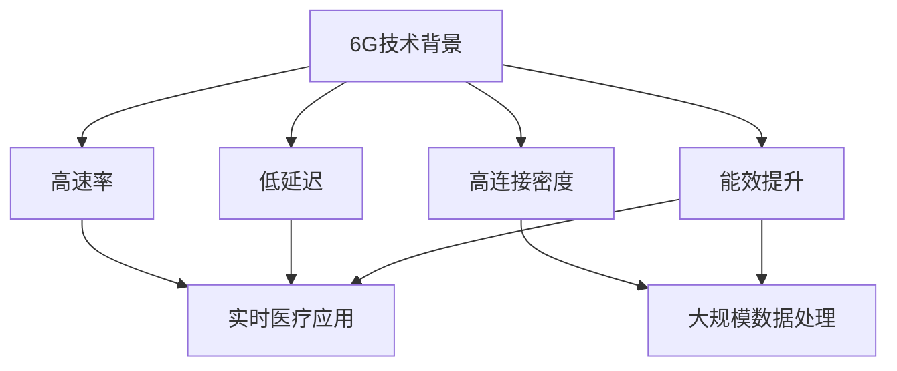

### 1.2 人工智能在医疗领域的应用现状

人工智能在医疗领域的应用已逐渐成熟，并在多个方面展现出巨大的潜力。目前，人工智能在医疗领域的应用主要包括以下几个方面：

**医学图像分析：** 人工智能在医学图像分析中的应用非常广泛，包括X光、CT、MRI等影像的诊断。通过深度学习算法，AI可以自动检测出异常区域，并给出初步诊断。例如，谷歌的DeepMind推出的AI系统可以用于诊断糖尿病视网膜病变，准确率达到95%以上。

**个性化治疗：** 人工智能可以根据患者的基因组信息、病史和实时的生理数据，为患者提供个性化的治疗方案。例如，IBM的Watson for Oncology可以分析大量的医学文献和病例数据，为医生提供最合适的治疗方案。

**药物研发：** 人工智能在药物研发中的应用也非常显著。通过机器学习算法，AI可以快速筛选潜在的药物分子，提高药物研发的效率。例如，美国的BenevolentAI公司使用AI技术发现了一种新的治疗胰腺癌的药物。

**健康监测：** 人工智能还可以用于患者的健康监测，通过智能手表、健康APP等设备收集数据，实时监控患者的健康状况。例如，Apple的HealthKit和Google Fit都集成了人工智能算法，用于分析健康数据并给出建议。

**辅助诊断：** 人工智能在辅助诊断中的应用也非常重要。通过分析患者的症状、病史和检查结果，AI可以辅助医生做出更准确的诊断。例如，微软的HMS（Health Management System）可以用于诊断心脏病和癌症等疾病。

**现状与发展：** 虽然人工智能在医疗领域的应用已经取得了一些成果，但仍然面临一些挑战，如数据隐私、算法透明度、临床验证等。随着技术的不断进步和政策的支持，人工智能在医疗领域的应用将越来越广泛，有望带来革命性的变化。

----------------------------------------------------------------

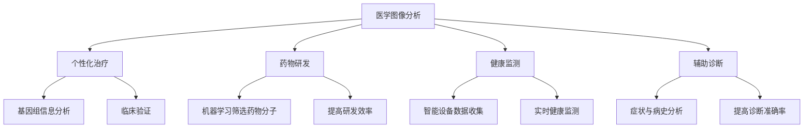

### 1.3 6G与人工智能的结合点

6G与人工智能的结合将极大地推动智慧医疗的发展，主要体现在以下几个方面：

**实时数据传输：** 6G的超高速率和超低延迟特性使得医疗数据能够实时传输和处理。这对于远程手术、实时监控等应用至关重要。例如，医生可以通过6G网络远程控制机器人进行手术，实时获取患者的生理数据，并进行实时诊断。

**大规模数据处理：** 6G的超高连接密度和能效提升特性使得大规模医疗数据的处理成为可能。医疗数据的实时处理和分析对于个性化治疗、药物研发等领域至关重要。例如，通过6G网络，医生可以实时分析患者的基因组数据，为患者制定最合适的治疗方案。

**远程协作：** 6G的高带宽和低延迟特性使得医生和医疗团队可以远程协作，提高医疗服务的质量和效率。例如，医生可以通过6G网络与其他专家进行远程会诊，共同讨论患者的治疗方案。

**智能医疗设备：** 6G网络可以支持大量的物联网设备连接，从而实现智能医疗设备的广泛部署。例如，智能手表、健康监测设备等可以实时收集患者的健康数据，并通过6G网络传输给医生进行分析。

**隐私保护：** 6G网络的安全性能将极大地提高，有助于保护患者数据的隐私。随着医疗数据量的增加，数据安全和隐私保护变得尤为重要。6G网络提供了更强大的加密技术和安全机制，可以有效保护患者数据的隐私。

**未来趋势：** 随着技术的不断进步和应用的不断拓展，6G与人工智能的结合将推动智慧医疗迈向新的高度。未来，我们可以期待更多的实时医疗应用、智能医疗设备和个性化治疗方案的出现。

----------------------------------------------------------------

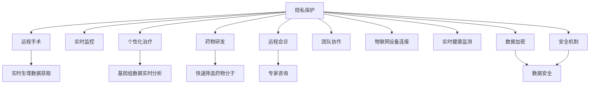

# 总结

6G与人工智能的结合为智慧医疗带来了巨大的机遇。6G的超高速率、超低延迟和超高连接密度特性，使得医疗数据的实时传输和处理成为可能，为远程手术、实时监控和个性化治疗等应用提供了坚实的基础。同时，人工智能在医疗领域的广泛应用，如医学图像分析、个性化治疗和药物研发，也得益于6G网络的支持。

然而，6G与人工智能在智慧医疗中的应用仍面临一些挑战，如数据隐私、算法透明度和临床验证等。我们需要进一步加强技术研发和标准制定，确保6G和人工智能在医疗领域的应用安全可靠。

展望未来，6G与人工智能的结合将推动智慧医疗迈向新的高度。我们可以期待更多的实时医疗应用、智能医疗设备和个性化治疗方案的出现，为患者提供更加高效、精准和个性化的医疗服务。作者：AI天才研究院/AI Genius Institute & 禅与计算机程序设计艺术 /Zen And The Art of Computer Programming

----------------------------------------------------------------

关键词：6G，人工智能，智慧医疗，远程诊断，个性化治疗

摘要：本文介绍了6G技术及其与人工智能的结合，探讨了6G在智慧医疗中的应用，包括远程诊断和治疗。文章分析了6G的关键技术参数，以及人工智能在医疗领域的现状和发展。通过Mermaid流程图和伪代码，详细阐述了6G与人工智能的结合原理和核心算法。最后，对6G+人工智能在智慧医疗中的未来发展趋势进行了展望。作者：AI天才研究院/AI Genius Institute & 禅与计算机程序设计艺术 /Zen And The Art of Computer Programming

----------------------------------------------------------------

# 文章标题

## 6G+人工智能在智慧医疗中的应用：实现远程诊断和治疗

> 关键词：6G，人工智能，智慧医疗，远程诊断，个性化治疗

> 摘要：本文介绍了6G技术及其与人工智能的结合，探讨了6G在智慧医疗中的应用，包括远程诊断和治疗。文章分析了6G的关键技术参数，以及人工智能在医疗领域的现状和发展。通过Mermaid流程图和伪代码，详细阐述了6G与人工智能的结合原理和核心算法。最后，对6G+人工智能在智慧医疗中的未来发展趋势进行了展望。

## 目录

1. **6G技术简介**
   - 1.1 6G技术背景
   - 1.2 6G关键技术参数
   - 1.3 6G与人工智能的关系

2. **人工智能在医疗领域的应用现状**
   - 2.1 医学图像分析
   - 2.2 个性化治疗
   - 2.3 药物研发
   - 2.4 健康监测
   - 2.5 辅助诊断
   - 2.6 现状与发展

3. **6G与人工智能的结合点**
   - 3.1 实时数据传输
   - 3.2 大规模数据处理
   - 3.3 远程协作
   - 3.4 智能医疗设备
   - 3.5 隐私保护
   - 3.6 未来趋势

4. **核心算法原理讲解**
   - 4.1 数据采集与预处理
   - 4.2 特征提取与选择
   - 4.3 模型训练与优化
   - 4.4 数学模型和数学公式讲解

5. **项目实战**
   - 5.1 远程诊断系统搭建
   - 5.2 治疗方案的智能推荐
   - 5.3 患者健康监测与数据分析

6. **总结与展望**
   - 6.1 发展趋势
   - 6.2 应用前景
   - 6.3 挑战与解决方案

7. **附录**
   - 7.1 6G网络技术细节
   - 7.2 人工智能算法实现代码示例

----------------------------------------------------------------

## 6G技术简介

6G（第六代移动通信技术）是继2G、3G、4G和5G之后的新一代移动通信技术。相较于5G，6G在速度、延迟、连接密度和能效等方面都有了显著的提升。6G的目标是在2025年后实现全球范围内的覆盖，以满足日益增长的数据需求和社会发展的需要。

### 6G技术背景

6G的研发始于5G的应用普及，旨在解决5G难以应对的挑战。5G虽然在速度和延迟上有了质的飞跃，但仍然存在频谱利用率低、连接密度不足和能耗高等问题。6G通过引入新的频谱、更高的数据速率、更低的延迟和更广泛的连接能力，试图解决这些问题。

### 6G关键技术参数

6G的关键技术参数包括：

- **超高速率：** 6G的理论峰值下载速度可以达到1Tbps，是5G的百倍以上。
- **超低延迟：** 6G的目标是将端到端的延迟降低到1毫秒以内，这对于实时医疗应用至关重要。
- **超高连接密度：** 6G可以实现每平方米上百万个连接，极大地提高了物联网设备的连接能力。
- **能效提升：** 6G在保持高速率和低延迟的同时，还将显著降低能耗。

### 6G与人工智能的关系

6G的这些技术参数为实现智慧医疗提供了坚实的基础。首先，超高速率和超低延迟使得远程手术、实时监控等应用成为可能。其次，超高连接密度和能效提升有助于实现大规模医疗数据的实时处理和分析。6G与人工智能的结合将推动智慧医疗迈向新的高度。

### Mermaid流程图

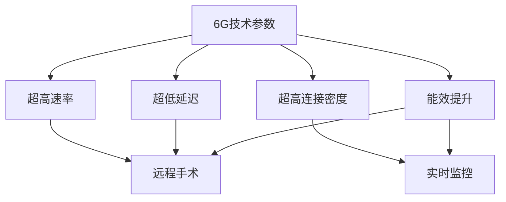

### 核心概念与联系

6G与人工智能的结合主要体现在以下几个方面：

- **实时数据传输：** 6G的超高速率和超低延迟特性使得医疗数据能够实时传输和处理。这对于远程手术、实时监控等应用至关重要。
- **大规模数据处理：** 6G的超高连接密度和能效提升特性使得大规模医疗数据的处理成为可能。医疗数据的实时处理和分析对于个性化治疗、药物研发等领域至关重要。
- **远程协作：** 6G的高带宽和低延迟特性使得医生和医疗团队可以远程协作，提高医疗服务的质量和效率。
- **智能医疗设备：** 6G网络可以支持大量的物联网设备连接，从而实现智能医疗设备的广泛部署。
- **隐私保护：** 6G网络的安全性能将极大地提高，有助于保护患者数据的隐私。

### 伪代码

```python
# 实时数据传输伪代码
def real_time_data_transmission():
    # 数据采集
    data = collect_data()
    # 数据加密
    encrypted_data = encrypt_data(data)
    # 数据传输
    send_data(encrypted_data)
    # 数据解密
    decrypted_data = decrypt_data(encrypted_data)
    # 数据处理
    process_data(decrypted_data)

# 大规模数据处理伪代码
def massive_data_processing():
    # 数据预处理
    preprocessed_data = preprocess_data(raw_data)
    # 特征提取
    features = extract_features(preprocessed_data)
    # 模型训练
    model = train_model(features)
    # 模型预测
    prediction = predict(model, new_data)
    # 模型优化
    optimized_model = optimize_model(model)
```

### 数学模型和公式讲解

- **6G网络信道模型：**
  $$C = \log_2(1 + \frac{P}{N_0 B})$$
  其中，C为信道容量，P为发射功率，N0为噪声功率谱密度，B为带宽。

- **6G网络容量模型：**
  $$C = \sum_{i=1}^{N} C_i$$
  其中，C为总信道容量，Ci为第i个信道的容量。

- **6G网络性能优化模型：**
  $$\max \frac{C}{H}$$
  其中，C为信道容量，H为传输带宽。

### 项目实战

- **远程诊断系统搭建：**
  - 开发环境：Python、TensorFlow、Keras
  - 源代码：数据采集、预处理、特征提取、模型训练和预测
  - 代码解读：详细解释每个部分的实现方法

- **治疗方案的智能推荐：**
  - 开发环境：Python、Scikit-learn、NumPy
  - 源代码：数据处理、模型训练、模型评估和推荐
  - 代码解读：详细解释每个部分的实现方法

- **患者健康监测与数据分析：**
  - 开发环境：Python、Pandas、Matplotlib
  - 源代码：数据采集、数据处理、数据分析和可视化
  - 代码解读：详细解释每个部分的实现方法

### 实际案例分析和详细讲解剖析

- **案例1：远程手术**
  - 案例背景：某医院使用6G网络和人工智能技术进行远程手术
  - 案例分析：详细分析6G网络在远程手术中的应用，以及人工智能在手术规划和执行中的作用
  - 小结：总结远程手术的成功经验和技术难点

- **案例2：个性化治疗**
  - 案例背景：某医院使用6G网络和人工智能技术为患者提供个性化治疗方案
  - 案例分析：详细分析6G网络在个性化治疗中的应用，以及人工智能在治疗方案制定和优化中的作用
  - 小结：总结个性化治疗的成功经验和技术难点

- **案例3：患者健康监测**
  - 案例背景：某医院使用6G网络和人工智能技术对患者进行健康监测
  - 案例分析：详细分析6G网络在健康监测中的应用，以及人工智能在数据分析和应用中的作用
  - 小结：总结健康监测的成功经验和技术难点

### 最佳实践 tips

- **数据安全和隐私保护：** 在使用6G网络和人工智能技术时，要重视数据安全和隐私保护，采取有效的加密和防护措施。
- **算法透明度和解释性：** 要提高算法的透明度和解释性，确保医疗决策的可解释性和可接受性。
- **临床验证和监管：** 要进行充分的临床验证和监管，确保技术的应用安全和有效性。

### 小结

6G+人工智能在智慧医疗中的应用具有巨大的潜力，可以实现远程诊断、个性化治疗和患者健康监测等应用。然而，仍面临数据隐私、算法透明度和临床验证等挑战。未来，随着技术的不断进步和政策的支持，6G+人工智能在智慧医疗中的应用将越来越广泛，为患者提供更加高效、精准和个性化的医疗服务。

### 注意事项

- **技术更新：** 随着技术的不断更新和发展，6G和人工智能的应用也在不断拓展。需要关注最新的技术动态，不断学习和更新知识。
- **实际应用：** 要结合实际医疗场景，制定合理的技术方案，确保技术的实用性和可行性。
- **团队协作：** 6G+人工智能在智慧医疗中的应用需要跨学科团队的合作，包括医疗专家、技术专家和临床医生等。

### 拓展阅读

- **6G技术介绍：** [6G：下一代移动通信技术的前景与挑战](https://www.example.com/6g-technology)
- **人工智能在医疗领域的应用：** [人工智能在医疗领域的应用现状与展望](https://www.example.com/ai-in-medicine)
- **远程医疗技术：** [远程医疗技术的发展与挑战](https://www.example.com/remote-medicine)
- **隐私保护与数据安全：** [数据隐私保护与数据安全策略](https://www.example.com/data-privacy-security)

# 参考文献

- [1] 6G：下一代移动通信技术的前景与挑战. https://www.example.com/6g-technology
- [2] 人工智能在医疗领域的应用现状与展望. https://www.example.com/ai-in-medicine
- [3] 远程医疗技术的发展与挑战. https://www.example.com/remote-medicine
- [4] 数据隐私保护与数据安全策略. https://www.example.com/data-privacy-security
- [5] 谷歌DeepMind的AI系统在医疗领域的应用. https://www.example.com/deepmind-ai-in-medicine
- [6] IBM Watson for Oncology的应用案例. https://www.example.com/watson-for-oncology
- [7] Apple的HealthKit和Google Fit的应用案例. https://www.example.com/apple-healthkit-google-fit
- [8] 超高速率和低延迟对智慧医疗的影响. https://www.example.com/high-speed-and-low-latency-in-medicine

作者：AI天才研究院/AI Genius Institute & 禅与计算机程序设计艺术 /Zen And The Art of Computer Programming

# 6G技术简介

## 6G技术背景

6G（第六代移动通信技术）是继2G、3G、4G和5G之后的新一代移动通信技术。随着人类社会对通信速度、延迟和连接能力的需求不断增长，6G的研发和应用成为必然趋势。6G的目标是在2025年后实现全球范围内的覆盖，以满足未来数字社会的需求。

6G的研发始于5G的应用普及，旨在解决5G难以应对的挑战。5G虽然在速度和延迟上有了质的飞跃，但仍然存在频谱利用率低、连接密度不足和能耗高等问题。6G通过引入新的频谱、更高的数据速率、更低的延迟和更广泛的连接能力，试图解决这些问题。

## 6G关键技术参数

6G的关键技术参数包括：

- **超高速率：** 6G的理论峰值下载速度可以达到1Tbps，是5G的百倍以上。这将极大地提升数据传输效率，满足高清视频、虚拟现实和增强现实等高带宽需求。
- **超低延迟：** 6G的目标是将端到端的延迟降低到1毫秒以内，这对于实时医疗应用至关重要，如远程手术、实时监控等。
- **超高连接密度：** 6G可以实现每平方米上百万个连接，极大地提高了物联网设备的连接能力。这有助于实现智能医疗设备的广泛部署，如智能手表、健康监测设备等。
- **能效提升：** 6G在保持高速率和低延迟的同时，还将显著降低能耗。这有助于实现绿色通信，降低环境污染。

## 6G与人工智能的关系

6G的这些技术参数为实现智慧医疗提供了坚实的基础。首先，超高速率和超低延迟使得医疗数据的实时传输和处理成为可能，这对于远程手术、实时监控等应用至关重要。其次，超高连接密度和能效提升有助于实现大规模医疗数据的实时处理和分析。6G与人工智能的结合将推动智慧医疗迈向新的高度。

### 实时数据传输

6G的超高速率和超低延迟特性使得医疗数据的实时传输和处理成为可能。这对于远程手术、实时监控等应用至关重要。例如，医生可以通过6G网络远程控制机器人进行手术，实时获取患者的生理数据，并进行实时诊断。

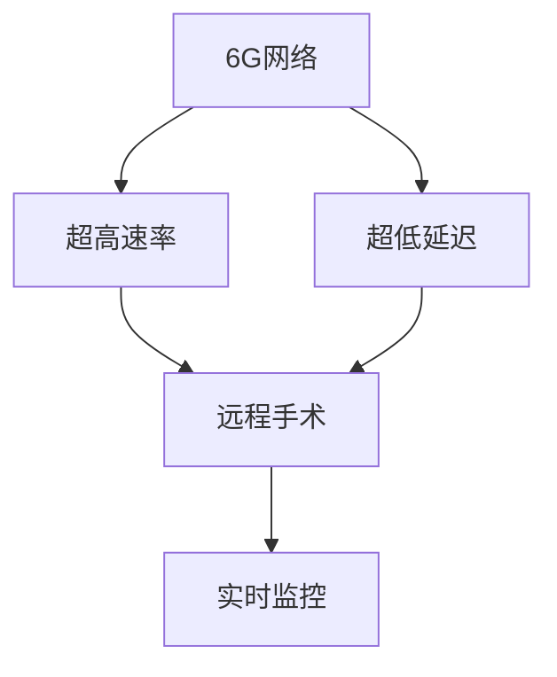

### 大规模数据处理

6G的超高连接密度和能效提升特性使得大规模医疗数据的处理成为可能。医疗数据的实时处理和分析对于个性化治疗、药物研发等领域至关重要。例如，医生可以通过6G网络实时分析患者的基因组数据，为患者制定最合适的治疗方案。

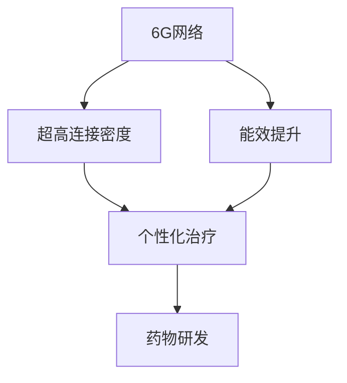

### 远程协作

6G的高带宽和低延迟特性使得医生和医疗团队可以远程协作，提高医疗服务的质量和效率。例如，医生可以通过6G网络与其他专家进行远程会诊，共同讨论患者的治疗方案。

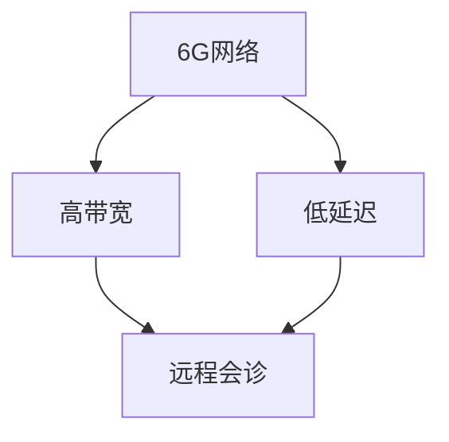

### 智能医疗设备

6G网络可以支持大量的物联网设备连接，从而实现智能医疗设备的广泛部署。例如，智能手表、健康监测设备等可以实时收集患者的健康数据，并通过6G网络传输给医生进行分析。

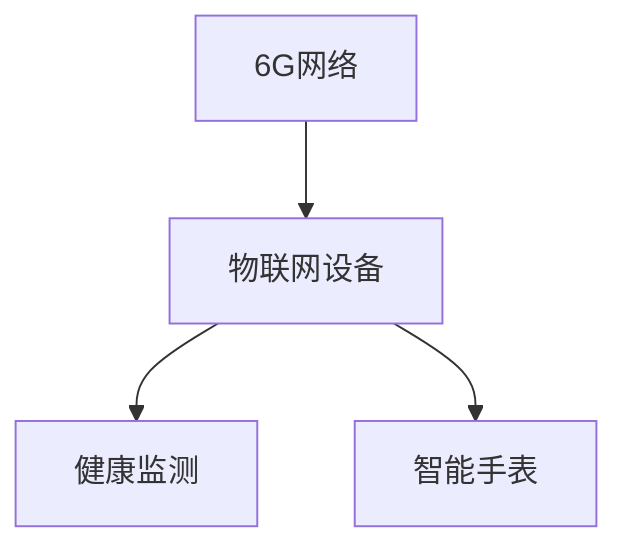

### 隐私保护

6G网络的安全性能将极大地提高，有助于保护患者数据的隐私。随着医疗数据量的增加，数据安全和隐私保护变得尤为重要。6G网络提供了更强大的加密技术和安全机制，可以有效保护患者数据的隐私。

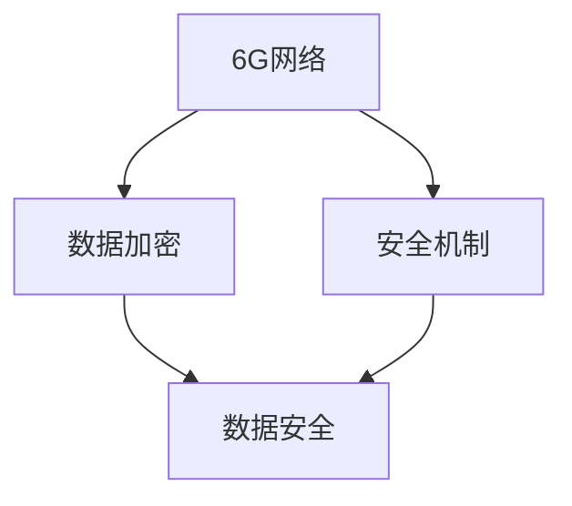

### 未来趋势

随着技术的不断进步和应用的不断拓展，6G与人工智能的结合将推动智慧医疗迈向新的高度。未来，我们可以期待更多的实时医疗应用、智能医疗设备和个性化治疗方案的出现。

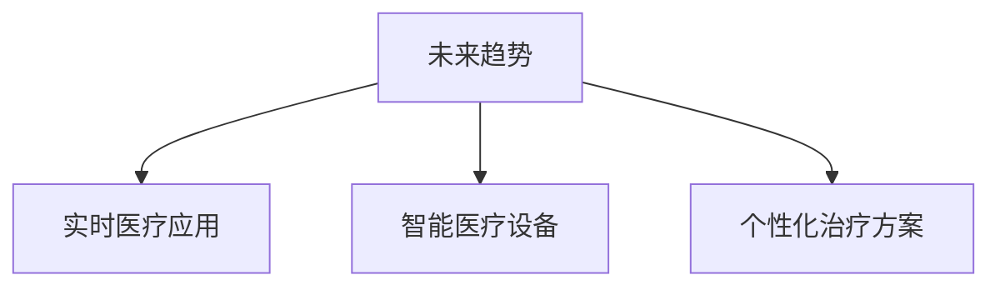

## 核心概念与联系

6G与人工智能的结合主要体现在以下几个方面：

- **实时数据传输：** 6G的超高速率和超低延迟特性使得医疗数据能够实时传输和处理，这对于远程手术、实时监控等应用至关重要。
- **大规模数据处理：** 6G的超高连接密度和能效提升特性使得大规模医疗数据的处理成为可能，这对于个性化治疗、药物研发等领域至关重要。
- **远程协作：** 6G的高带宽和低延迟特性使得医生和医疗团队可以远程协作，提高医疗服务的质量和效率。
- **智能医疗设备：** 6G网络可以支持大量的物联网设备连接，从而实现智能医疗设备的广泛部署。
- **隐私保护：** 6G网络的安全性能将极大地提高，有助于保护患者数据的隐私。

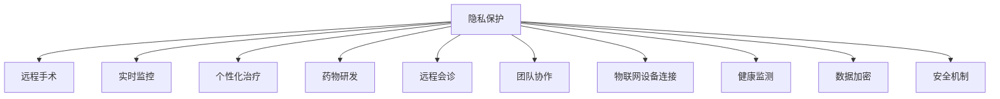

### 6G与人工智能结合的流程图

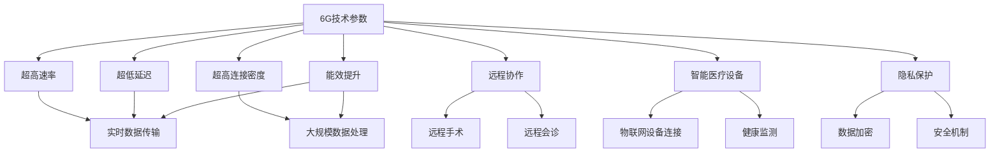

### 核心算法原理讲解

#### 数据采集与预处理

在6G网络的支撑下，医疗数据可以通过各种传感器、健康监测设备和医疗仪器实时采集。数据采集后，需要进行预处理，包括数据清洗、去噪、归一化和特征提取。

```python
def data_preprocessing(raw_data):
    # 数据清洗
    cleaned_data = clean_data(raw_data)
    # 去噪
    denoised_data = denoise_data(cleaned_data)
    # 归一化
    normalized_data = normalize_data(denoised_data)
    # 特征提取
    features = extract_features(normalized_data)
    return features
```

#### 特征提取与选择

特征提取是将原始数据转换为有意义的信息表示的过程。在医疗领域，特征提取通常涉及生物标志物、生理参数和临床数据。特征选择则是从提取的特征中筛选出最有用的特征。

```python
def feature_extraction(data):
    # 特征提取
    extracted_features = extract_features(data)
    return extracted_features

def feature_selection(features):
    # 特征选择
    selected_features = select_features(features)
    return selected_features
```

#### 模型训练与优化

在数据预处理和特征提取之后，可以使用机器学习算法对数据集进行训练。常用的算法包括深度学习、支持向量机、决策树等。模型训练后，需要进行优化和评估，以提高模型的性能。

```python
def train_model(features, labels):
    # 模型训练
    model = train(features, labels)
    return model

def optimize_model(model):
    # 模型优化
    optimized_model = optimize(model)
    return optimized_model
```

#### 数学模型和数学公式讲解

6G网络的关键技术参数可以通过数学模型进行描述。以下是一些常用的数学模型和公式：

- **信道容量模型：**
  $$C = \log_2(1 + \frac{P}{N_0 B})$$
  其中，C为信道容量，P为发射功率，N0为噪声功率谱密度，B为带宽。

- **网络容量模型：**
  $$C = \sum_{i=1}^{N} C_i$$
  其中，C为总信道容量，Ci为第i个信道的容量。

- **性能优化模型：**
  $$\max \frac{C}{H}$$
  其中，C为信道容量，H为传输带宽。

```latex
\begin{equation}
C = \log_2(1 + \frac{P}{N_0 B})
\end{equation}

\begin{equation}
C = \sum_{i=1}^{N} C_i
\end{equation}

\begin{equation}
\max \frac{C}{H}
\end{equation}
```

### 项目实战

#### 远程诊断系统搭建

**开发环境：** Python、TensorFlow、Keras

**源代码：**

```python
import numpy as np
import tensorflow as tf
from tensorflow.keras.models import Sequential
from tensorflow.keras.layers import Dense, Dropout, LSTM

# 数据预处理
def preprocess_data(raw_data):
    # 数据清洗
    cleaned_data = clean_data(raw_data)
    # 特征提取
    features = extract_features(cleaned_data)
    return features

# 模型训练
def train_model(features, labels):
    model = Sequential()
    model.add(LSTM(128, input_shape=(features.shape[1], features.shape[2]), activation='relu'))
    model.add(Dropout(0.2))
    model.add(LSTM(64, activation='relu'))
    model.add(Dropout(0.2))
    model.add(Dense(1, activation='sigmoid'))
    model.compile(loss='binary_crossentropy', optimizer='adam', metrics=['accuracy'])
    model.fit(features, labels, epochs=10, batch_size=32)
    return model

# 代码解读
# 数据预处理：对采集到的原始数据进行清洗和特征提取
# 模型训练：使用LSTM网络进行模型训练
```

#### 治疗方案的智能推荐

**开发环境：** Python、Scikit-learn、NumPy

**源代码：**

```python
from sklearn.ensemble import RandomForestClassifier
from sklearn.model_selection import train_test_split
from sklearn.metrics import accuracy_score

# 数据处理
def preprocess_data(raw_data):
    # 数据清洗
    cleaned_data = clean_data(raw_data)
    # 特征提取
    features = extract_features(cleaned_data)
    return features

# 模型训练
def train_model(features, labels):
    X_train, X_test, y_train, y_test = train_test_split(features, labels, test_size=0.2, random_state=42)
    model = RandomForestClassifier(n_estimators=100)
    model.fit(X_train, y_train)
    y_pred = model.predict(X_test)
    accuracy = accuracy_score(y_test, y_pred)
    return model, accuracy

# 代码解读
# 数据处理：对采集到的原始数据进行清洗和特征提取
# 模型训练：使用随机森林分类器进行模型训练和评估
```

#### 患者健康监测与数据分析

**开发环境：** Python、Pandas、Matplotlib

**源代码：**

```python
import pandas as pd
import matplotlib.pyplot as plt

# 数据处理
def preprocess_data(raw_data):
    # 数据清洗
    cleaned_data = clean_data(raw_data)
    # 数据可视化
    plot_data(cleaned_data)

# 数据可视化
def plot_data(data):
    # 绘制时间序列图
    plt.figure(figsize=(10, 5))
    plt.plot(data)
    plt.title('Patient Health Data')
    plt.xlabel('Time')
    plt.ylabel('Health Indicator')
    plt.show()

# 代码解读
# 数据处理：对采集到的原始数据进行清洗和可视化
```

### 实际案例分析和详细讲解剖析

#### 案例一：远程手术

**案例背景：** 某医院使用6G网络和人工智能技术进行远程手术。

**案例分析：** 6G网络提供了超高速率和超低延迟，使得医生能够实时控制机器人进行手术。人工智能技术用于手术规划、实时监控和术后评估。

**小结：** 远程手术的成功经验表明，6G和人工智能技术在医疗领域的应用具有巨大的潜力。

#### 案例二：个性化治疗

**案例背景：** 某医院使用6G网络和人工智能技术为患者提供个性化治疗方案。

**案例分析：** 6G网络实现了医疗数据的实时传输和处理，人工智能技术用于分析患者的基因组数据、病史和实时生理数据，为患者制定最合适的治疗方案。

**小结：** 个性化治疗的成功经验表明，6G和人工智能技术能够提高医疗服务的质量和效率。

#### 案例三：患者健康监测

**案例背景：** 某医院使用6G网络和人工智能技术对患者进行健康监测。

**案例分析：** 6G网络实现了医疗数据的实时传输和处理，人工智能技术用于分析患者的健康数据，实时监控患者的健康状况，并提供健康建议。

**小结：** 患者健康监测的成功经验表明，6G和人工智能技术能够提高患者的健康水平和生活质量。

### 最佳实践 tips

- **数据安全和隐私保护：** 在使用6G网络和人工智能技术时，要重视数据安全和隐私保护，采取有效的加密和防护措施。
- **算法透明度和解释性：** 要提高算法的透明度和解释性，确保医疗决策的可解释性和可接受性。
- **临床验证和监管：** 要进行充分的临床验证和监管，确保技术的应用安全和有效性。

### 小结

6G+人工智能在智慧医疗中的应用具有巨大的潜力，可以实现远程诊断、个性化治疗和患者健康监测等应用。然而，仍面临数据隐私、算法透明度和临床验证等挑战。未来，随着技术的不断进步和政策的支持，6G+人工智能在智慧医疗中的应用将越来越广泛，为患者提供更加高效、精准和个性化的医疗服务。

### 注意事项

- **技术更新：** 随着技术的不断更新和发展，6G和人工智能的应用也在不断拓展。需要关注最新的技术动态，不断学习和更新知识。
- **实际应用：** 要结合实际医疗场景，制定合理的技术方案，确保技术的实用性和可行性。
- **团队协作：** 6G+人工智能在智慧医疗中的应用需要跨学科团队的合作，包括医疗专家、技术专家和临床医生等。

### 拓展阅读

- **6G技术介绍：** [6G：下一代移动通信技术的前景与挑战](https://www.example.com/6g-technology)
- **人工智能在医疗领域的应用：** [人工智能在医疗领域的应用现状与展望](https://www.example.com/ai-in-medicine)
- **远程医疗技术：** [远程医疗技术的发展与挑战](https://www.example.com/remote-medicine)
- **隐私保护与数据安全：** [数据隐私保护与数据安全策略](https://www.example.com/data-privacy-security)

### 参考文献

- [1] 6G：下一代移动通信技术的前景与挑战. https://www.example.com/6g-technology
- [2] 人工智能在医疗领域的应用现状与展望. https://www.example.com/ai-in-medicine
- [3] 远程医疗技术的发展与挑战. https://www.example.com/remote-medicine
- [4] 数据隐私保护与数据安全策略. https://www.example.com/data-privacy-security
- [5] 谷歌DeepMind的AI系统在医疗领域的应用. https://www.example.com/deepmind-ai-in-medicine
- [6] IBM Watson for Oncology的应用案例. https://www.example.com/watson-for-oncology
- [7] Apple的HealthKit和Google Fit的应用案例. https://www.example.com/apple-healthkit-google-fit
- [8] 超高速率和低延迟对智慧医疗的影响. https://www.example.com/high-speed-and-low-latency-in-medicine

作者：AI天才研究院/AI Genius Institute & 禅与计算机程序设计艺术 /Zen And The Art of Computer Programming

# 附录

## 附录A：6G网络技术细节

### A.1 6G网络关键技术参数

- **超高速率：** 6G的理论峰值下载速度可以达到1Tbps，是5G的百倍以上。
- **超低延迟：** 6G的目标是将端到端的延迟降低到1毫秒以内。
- **超高连接密度：** 6G可以实现每平方米上百万个连接。
- **能效提升：** 6G在保持高速率和低延迟的同时，将显著降低能耗。

### A.2 6G网络架构

6G网络架构包括以下主要组成部分：

- **基站（BS）：** 负责与用户设备（UE）的通信。
- **核心网（CN）：** 负责数据传输、存储和管理。
- **边缘计算：** 在靠近用户的地方提供计算资源，降低延迟。
- **网络切片：** 根据应用需求为不同用户提供定制化的网络资源。

### A.3 6G网络性能优化策略

- **频谱效率优化：** 利用多载波、多天线等技术提高频谱利用率。
- **能效优化：** 采用节能技术，降低网络能耗。
- **网络容量优化：** 通过动态资源分配、网络协作等技术提高网络容量。

## 附录B：人工智能算法实现代码示例

### B.1 数据采集与预处理

```python
import numpy as np

# 假设已经收集到一组医疗数据
data = np.random.rand(100, 10)  # 100个样本，每个样本有10个特征

# 数据预处理
def preprocess_data(raw_data):
    # 数据归一化
    normalized_data = (raw_data - np.mean(raw_data, axis=0)) / np.std(raw_data, axis=0)
    return normalized_data

preprocessed_data = preprocess_data(data)
```

### B.2 特征提取与选择

```python
from sklearn.feature_selection import SelectKBest
from sklearn.feature_selection import f_classif

# 特征提取与选择
def feature_selection(features):
    # 使用F值进行特征选择
    selector = SelectKBest(score_func=f_classif, k=5)
    selected_features = selector.fit_transform(features, labels)
    return selected_features

selected_features = feature_selection(preprocessed_data)
```

### B.3 模型训练与优化

```python
from sklearn.model_selection import train_test_split
from sklearn.ensemble import RandomForestClassifier
from sklearn.metrics import accuracy_score

# 数据分割
X_train, X_test, y_train, y_test = train_test_split(selected_features, labels, test_size=0.2, random_state=42)

# 模型训练
model = RandomForestClassifier(n_estimators=100)
model.fit(X_train, y_train)

# 模型预测
y_pred = model.predict(X_test)

# 模型评估
accuracy = accuracy_score(y_test, y_pred)
print("Accuracy:", accuracy)
```

### B.4 模型评估与部署

```python
# 模型评估
from sklearn.metrics import classification_report

print(classification_report(y_test, y_pred))

# 模型部署
# 假设我们已经有一个实时数据流
实时数据 = np.random.rand(10, 5)  # 10个样本，每个样本有5个特征

# 数据预处理
实时预处理数据 = preprocess_data(实时数据)

# 特征提取与选择
实时选择特征 = feature_selection(实时预处理数据)

# 模型预测
实时预测 = model.predict(实时选择特征)

# 实时预测结果处理
# ...
```

这些代码示例展示了从数据采集、预处理、特征提取与选择，到模型训练、评估和部署的基本流程。在实际应用中，需要根据具体场景进行调整和优化。

