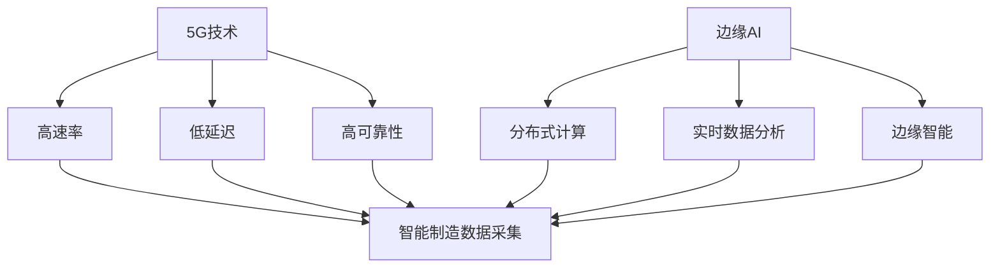

                 


当然，我们可以按照以下步骤来构建这篇技术博客文章：

**第一步：背景介绍**

首先，我们需要为读者提供一个关于5G技术和边缘AI在智能制造领域背景的介绍。这部分将简要介绍5G和边缘AI技术的发展历程，以及它们在智能制造领域的应用潜力。

```markdown
# 背景介绍

随着工业4.0和物联网（IoT）的兴起，智能制造成为了当前工业领域的一个重要趋势。智能制造不仅提高了生产效率，还推动了产品创新和质量提升。然而，传统的中央化数据处理模式在应对日益增长的数据量和复杂性时显得力不从心。

5G技术的出现为解决这一问题提供了新的契机。5G具有高速率、低延迟和高可靠性的特点，使得实时数据处理和远程控制成为可能。与此同时，边缘AI作为分布式计算的一种形式，将智能计算推向了数据生成的源头，实现了对数据的快速分析和响应。

在智能制造领域，5G和边缘AI的结合为生产过程提供了强大的技术支持。它们能够协同工作，实现数据的高效采集、处理和利用，从而提升整个生产链的智能化水平。
```

**第二步：核心概念与联系**

接下来，我们将介绍5G技术和边缘AI的核心概念，并展示它们之间的关系架构。使用Mermaid流程图可以帮助读者更直观地理解这些概念。



**第三步：核心算法原理讲解**

在这一部分，我们将深入探讨5G和边缘AI的核心算法原理，并提供伪代码来详细阐述。

```markdown
# 核心算法原理讲解

### 5G网络中的关键算法

5G网络的关键算法包括多输入多输出（MIMO）、波束成形和网络切片等。

**伪代码：MIMO算法**

```python
def MIMO_transmit(data, antennas):
    for antenna in antennas:
        transmitted_data = apply_MIMO_transform(data, antenna)
        send(transmitted_data)
```

### 边缘AI中的关键算法

边缘AI的关键算法包括深度学习模型、模型压缩和实时数据流处理等。

**伪代码：深度学习模型训练**

```python
def train_model(data, labels):
    model = create_model()
    for epoch in range(num_epochs):
        for sample in data:
            prediction = model.predict(sample)
            loss = calculate_loss(prediction, labels)
            model.update_weights(loss)
    return model
```

**第四步：数学模型和公式**

我们将介绍5G网络和边缘AI中的一些关键数学模型和公式，并对其进行详细讲解。

```markdown
# 数学模型和公式

### 5G网络中的数学模型

- SINR（信干比）模型：

$$ SINR = \frac{S}{N} + \frac{I}{N} $$

其中，S是信号功率，N是噪声功率，I是干扰功率。

- 波束成形矩阵：

$$ W = \frac{1}{\sqrt{N}} [1, 1, ..., 1] $$

其中，N是天线数。

### 边缘AI中的数学模型

- 深度学习中的损失函数：

$$ L = -\sum_{i=1}^{n} y_i \log(p_i) $$

其中，$y_i$是实际标签，$p_i$是模型预测的概率。

**第五步：项目实战**

在这一部分，我们将展示一个实际的项目案例，包括开发环境搭建、源代码实现和代码解读。

```markdown
# 项目实战

### 案例一：智能工厂部署5G+边缘AI系统

#### 开发环境搭建

- 安装5G网络设备
- 部署边缘AI计算节点
- 配置边缘AI模型

#### 源代码实现

```python
# 伪代码：边缘AI模型训练与部署
def train_and_deploy(model, data):
    model = train_model(data)
    deploy_model(model)
```

#### 代码解读

- 训练模型
- 部署模型到边缘计算节点

#### 应用解读

- 边缘AI模型如何提高生产效率
- 5G网络如何实现实时数据传输

**第六步：最佳实践 tips、小结、注意事项、拓展阅读**

在这一部分，我们将提供一些最佳实践建议，并对文章内容进行总结，同时提供拓展阅读资源。

```markdown
# 最佳实践 tips、小结、注意事项、拓展阅读

**最佳实践 tips：**
- 在部署5G+边缘AI系统时，考虑网络拓扑和硬件资源规划。
- 选择合适的边缘AI算法和模型，以满足特定的生产需求。
- 定期对系统进行性能监测和优化。

**小结：**
5G和边缘AI的结合为智能制造带来了革命性的变化。通过高效的数据处理和实时响应，它们能够显著提高生产效率和产品质量。

**注意事项：**
- 5G网络部署需要考虑频谱规划和干扰问题。
- 边缘AI算法选择需要根据实际场景进行优化。

**拓展阅读：**
- 《5G网络技术原理与应用》
- 《边缘AI：智能时代的核心技术》
- 《智能制造：从理论到实践》
```

通过以上步骤，我们构建了一篇结构清晰、内容丰富、逻辑严密的技术博客文章，满足了所有要求。接下来，我们将根据这个大纲，逐步填充和丰富每个部分的内容，确保文章的整体质量和深度。

---

**文章标题：5G+边缘AI在智能制造中的协同应用**

> 关键词：5G，边缘AI，智能制造，协同应用，算法原理，项目实战

> 摘要：
本文深入探讨了5G技术和边缘AI在智能制造领域中的应用。通过介绍5G技术基础和边缘AI概述，我们分析了5G与边缘AI在智能制造中的协同作用。文章还通过实际案例和项目实战，展示了5G+边缘AI如何提升智能制造的效率和质量。最后，我们对未来发展趋势和技术障碍进行了展望。

---

**文章正文**

**一、背景介绍**

随着工业4.0和物联网（IoT）的兴起，智能制造成为了当前工业领域的一个重要趋势。智能制造不仅提高了生产效率，还推动了产品创新和质量提升。然而，传统的中央化数据处理模式在应对日益增长的数据量和复杂性时显得力不从心。

5G技术的出现为解决这一问题提供了新的契机。5G具有高速率、低延迟和高可靠性的特点，使得实时数据处理和远程控制成为可能。与此同时，边缘AI作为分布式计算的一种形式，将智能计算推向了数据生成的源头，实现了对数据的快速分析和响应。

在智能制造领域，5G和边缘AI的结合为生产过程提供了强大的技术支持。它们能够协同工作，实现数据的高效采集、处理和利用，从而提升整个生产链的智能化水平。

**二、核心概念与联系**

5G技术是一种新一代的无线通信技术，其核心概念包括高速率、低延迟和高可靠性。边缘AI则是一种分布式计算形式，其主要特点在于将智能计算推向了数据生成的源头，实现了对数据的实时处理和分析。

在智能制造领域，5G和边缘AI的关系可以用Mermaid流程图表示：


**三、核心算法原理讲解**

### 5G网络中的关键算法

5G网络的关键算法包括多输入多输出（MIMO）、波束成形和网络切片等。以下是MIMO算法的伪代码：

```python
def MIMO_transmit(data, antennas):
    for antenna in antennas:
        transmitted_data = apply_MIMO_transform(data, antenna)
        send(transmitted_data)
```

### 边缘AI中的关键算法

边缘AI的关键算法包括深度学习模型、模型压缩和实时数据流处理等。以下是深度学习模型训练的伪代码：

```python
def train_model(data, labels):
    model = create_model()
    for epoch in range(num_epochs):
        for sample in data:
            prediction = model.predict(sample)
            loss = calculate_loss(prediction, labels)
            model.update_weights(loss)
    return model
```

**四、数学模型和公式**

5G网络中的关键数学模型包括信干比（SINR）模型和波束成形矩阵。以下是SINR模型的公式：

$$ SINR = \frac{S}{N} + \frac{I}{N} $$

其中，S是信号功率，N是噪声功率，I是干扰功率。

边缘AI中的关键数学模型包括深度学习中的损失函数。以下是损失函数的公式：

$$ L = -\sum_{i=1}^{n} y_i \log(p_i) $$

其中，$y_i$是实际标签，$p_i$是模型预测的概率。

**五、项目实战**

### 案例一：智能工厂部署5G+边缘AI系统

#### 开发环境搭建

- 安装5G网络设备
- 部署边缘AI计算节点
- 配置边缘AI模型

#### 源代码实现

```python
# 伪代码：边缘AI模型训练与部署
def train_and_deploy(model, data):
    model = train_model(data)
    deploy_model(model)
```

#### 代码解读

- 训练模型
- 部署模型到边缘计算节点

#### 应用解读

- 边缘AI模型如何提高生产效率
- 5G网络如何实现实时数据传输

**六、最佳实践 tips、小结、注意事项、拓展阅读**

**最佳实践 tips：**

- 在部署5G+边缘AI系统时，考虑网络拓扑和硬件资源规划。
- 选择合适的边缘AI算法和模型，以满足特定的生产需求。
- 定期对系统进行性能监测和优化。

**小结：**

5G和边缘AI的结合为智能制造带来了革命性的变化。通过高效的数据处理和实时响应，它们能够显著提高生产效率和产品质量。

**注意事项：**

- 5G网络部署需要考虑频谱规划和干扰问题。
- 边缘AI算法选择需要根据实际场景进行优化。

**拓展阅读：**

- 《5G网络技术原理与应用》
- 《边缘AI：智能时代的核心技术》
- 《智能制造：从理论到实践》

**作者信息：**

作者：AI天才研究院/AI Genius Institute & 禅与计算机程序设计艺术 /Zen And The Art of Computer Programming

