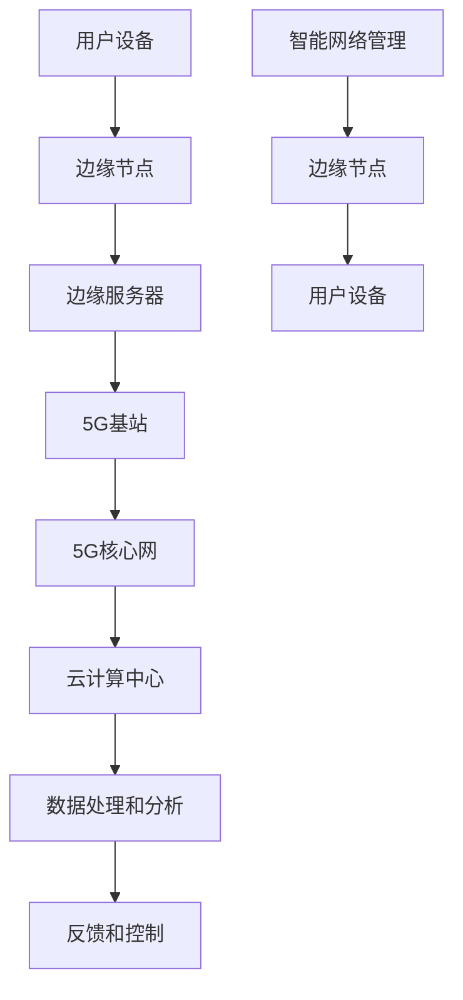

                 

### 文章标题

# 5G+边缘计算：实现工业互联网的低延迟需求

### 关键词

- 5G技术
- 边缘计算
- 工业互联网
- 低延迟需求
- 网络架构
- 应用场景
- 实战指南

### 摘要

本文旨在探讨5G技术和边缘计算如何协同工作，以满足工业互联网中低延迟需求的关键挑战。首先，我们将介绍5G和边缘计算的基本概念、核心技术以及它们在工业互联网中的重要性。接着，通过详细分析5G和边缘计算之间的联系和架构，我们将阐述如何通过这两个技术实现低延迟通信。然后，我们将探讨5G和边缘计算在工业互联网中的典型应用场景，包括智能制造、智能监控和智能交通。在后续部分，我们将介绍5G边缘计算的具体部署和优化策略，并通过实际案例展示其在工业互联网中的成功应用。最后，我们将总结最佳实践，强调注意事项并提供拓展阅读，以帮助读者更深入地了解和掌握这一领域。

## 引言

随着全球数字化进程的不断加快，工业互联网正在迅速崛起，成为推动制造业、能源、交通等各个行业转型升级的重要力量。然而，工业互联网的快速发展也带来了新的挑战，尤其是低延迟需求。低延迟是工业互联网能够实时响应、提高生产效率和安全性所必须的关键特性。为此，5G技术和边缘计算应运而生，成为实现低延迟需求的关键技术手段。

5G技术，即第五代移动通信技术，旨在提供更高的数据传输速率、更低的延迟、更大的连接容量和更高的可靠性。它不仅能够满足日常消费场景的高带宽需求，更在工业、医疗、交通等垂直行业展示了巨大的潜力。边缘计算则是一种分布式计算架构，通过将计算和存储能力从云端下沉到网络边缘，以实现更快速的响应和处理。

本文将首先介绍5G和边缘计算的基本概念、核心技术，并探讨它们在工业互联网中的重要性。随后，我们将详细分析5G和边缘计算之间的联系和架构，阐述如何通过这两个技术实现低延迟通信。接下来，本文将探讨5G和边缘计算在工业互联网中的典型应用场景，包括智能制造、智能监控和智能交通。在后续部分，我们将介绍5G边缘计算的具体部署和优化策略，并通过实际案例展示其在工业互联网中的成功应用。最后，本文将总结最佳实践，强调注意事项并提供拓展阅读，以帮助读者更深入地了解和掌握这一领域。

### 5G技术概述

5G技术，即第五代移动通信技术，是现代通信技术的又一次革命性进步。它旨在提供更高的数据传输速率、更低的延迟、更大的连接容量和更高的可靠性。相较于前几代移动通信技术，5G不仅在速度和容量上实现了质的飞跃，还在网络架构、频谱利用和服务质量等方面进行了创新和优化。

#### 5G的关键技术

5G的关键技术包括：

1. **高频率谱**：5G采用了更高的频率谱，如毫米波频段，这些频段具有更高的带宽，能够支持更高的数据传输速率。然而，高频率谱的传播距离较短，容易受到障碍物的阻挡，因此需要更多的基站部署来保证网络的覆盖。

2. **多连接技术**：5G引入了多连接技术，包括大规模MIMO（多输入多输出）和载波聚合。大规模MIMO通过使用更多的天线单元，实现了更高的数据传输速率和更大的网络容量。载波聚合则通过结合多个频段的带宽，进一步提升了网络的总带宽。

3. **网络切片技术**：5G的网络切片技术能够根据不同的应用需求，创建多个虚拟网络，从而实现资源的灵活分配和高效的网络管理。这对于工业互联网中的多样化应用场景尤为重要，例如，生产线的实时监控和智能设备的远程控制可能需要不同的网络性能和安全性。

4. **边缘计算**：5G与边缘计算的结合，实现了数据的本地处理和快速响应。边缘计算将部分计算任务从云端转移到网络边缘，降低了数据传输的延迟，提高了系统的实时性。

#### 5G的网络架构

5G的网络架构分为几个关键层次：

1. **用户平面**：用户平面负责处理数据传输，包括无线接入网（Uu）、传输网（Tu）和核心网（N3）。用户平面通过5G无线接入网（NR）与用户设备（UE）进行通信，通过传输网连接到核心网，最终实现数据的传输和交换。

2. **控制平面**：控制平面负责网络管理和控制，包括无线接入网控制（Nc）、传输网控制（N3c）和核心网控制（N4）。控制平面通过信令交互来配置和管理网络资源，确保数据传输的顺利进行。

3. **网络功能分割**：5G采用了网络功能分割（NFV）和网络虚拟化（NV）技术，将传统的网络功能模块化，通过虚拟化平台实现网络的灵活部署和管理。这种架构不仅降低了成本，还提高了网络的可扩展性和可管理性。

#### 5G与工业互联网的联系

5G技术与工业互联网的关联主要体现在以下几个方面：

1. **高带宽需求**：工业互联网中的海量数据传输需要高带宽的网络支持，5G技术的高带宽特性能够满足工业物联网设备的数据传输需求，支持视频监控、设备远程控制和实时数据分析。

2. **低延迟需求**：工业互联网中的许多应用场景，如自动化生产线、智能监控和远程控制，对实时性要求极高，低延迟是确保系统响应速度和操作安全的关键。5G技术通过边缘计算和新型网络架构，实现了数据快速处理和低延迟通信。

3. **高可靠性需求**：工业互联网对网络的可靠性要求极高，5G技术通过网络切片和边缘计算，提供了灵活的网络资源分配和冗余备份，提高了网络的可靠性和稳定性。

4. **多样化应用场景**：工业互联网涉及多个垂直行业，如制造、能源、交通等，每个行业都有不同的网络需求和应用场景。5G技术的多连接技术和网络切片技术，能够为不同行业提供定制化的网络解决方案，满足多样化的应用需求。

总之，5G技术通过其高带宽、低延迟、高可靠性和多样化的应用场景，为工业互联网的发展提供了强有力的技术支持。在接下来的部分，我们将深入探讨边缘计算的基本概念、核心技术及其在工业互联网中的应用。

### 边缘计算概述

边缘计算（Edge Computing）是一种分布式计算架构，旨在将计算和存储能力从传统的中心数据中心（或云端）下沉到网络的边缘。这一架构的核心思想是将数据处理、分析和存储更加接近数据源，以实现更快速、更高效的数据处理和响应。

#### 边缘计算的基本概念

1. **边缘节点**：边缘节点是边缘计算架构中的关键组件，负责处理本地数据。这些节点可以是智能设备、边缘服务器、物联网网关等，它们分布在网络边缘，能够实时处理来自本地设备的数据。

2. **边缘服务器**：边缘服务器是专门的计算设备，负责处理大量数据并执行复杂计算任务。边缘服务器通常部署在基站、数据中心或靠近用户的网络边缘，用于缓解中心数据中心的压力，提供更快速的服务。

3. **边缘网络**：边缘网络是连接边缘节点和边缘服务器的通信网络。边缘网络需要具备高带宽、低延迟和高可靠性的特点，以支持实时数据处理和快速响应。

4. **边缘计算平台**：边缘计算平台是管理和协调边缘节点和边缘服务器运行的软件框架。边缘计算平台负责任务分配、资源调度、数据存储和安全管理，以实现高效的数据处理和资源利用。

#### 边缘计算的优势

1. **低延迟**：边缘计算通过将数据处理和存储转移到网络边缘，减少了数据传输的距离和时间，从而降低了延迟。这对于需要实时响应的应用，如自动驾驶、远程医疗和工业自动化，具有重要意义。

2. **高带宽**：边缘计算能够充分利用本地网络资源，提供更高的带宽，支持大规模数据传输。这有助于应对工业互联网中的大数据处理需求，如视频监控、传感器数据采集和远程控制。

3. **高可靠性**：边缘计算通过分布式架构，提高了系统的可靠性和容错能力。即使中心数据中心发生故障，边缘节点和边缘服务器也能够继续处理和存储数据，确保业务的连续性和稳定性。

4. **降低带宽成本**：通过在边缘节点进行数据预处理和过滤，边缘计算可以显著减少需要传输到中心数据中心的数据量，从而降低带宽成本。

5. **增强隐私和安全**：边缘计算将数据处理和存储分散到网络边缘，减少了数据在传输过程中的泄露风险。此外，边缘计算平台可以实施更严格的数据访问控制和加密措施，提高数据的安全性和隐私性。

#### 边缘计算与云计算的关系

边缘计算和云计算是两种互补的计算架构，它们共同构成了现代计算体系的关键部分。

1. **云计算**：云计算是一种基于互联网的共享计算资源模式，用户可以通过互联网访问远程数据中心提供的计算、存储和网络资源。云计算具有高扩展性、高可用性和低成本的特点，适用于大规模数据处理和复杂应用。

2. **边缘计算**：边缘计算则侧重于在本地网络边缘提供计算和存储服务，以实现低延迟、高带宽和增强的隐私性。边缘计算适用于实时处理和响应的应用，如物联网、智能交通和智能制造。

二者之间的关系可以概括为：

- **互补性**：云计算和边缘计算各有所长，云计算擅长处理大规模数据和高复杂度的任务，边缘计算擅长实时数据处理和本地响应。
- **协同性**：云计算和边缘计算可以通过协同工作，实现更高效、更智能的数据处理和业务运营。例如，边缘计算可以将预处理后的数据上传到云计算平台，进行进一步分析和处理。
- **分布式架构**：边缘计算通过分布式架构，将计算和存储能力分散到网络边缘，降低了中心数据中心的负担，提高了整体系统的性能和可靠性。

总之，边缘计算作为云计算的延伸和补充，为工业互联网和智能应用提供了更加灵活、高效和安全的计算解决方案。在接下来的部分，我们将深入探讨边缘计算在工业互联网中的应用场景和具体实践。

### 5G与边缘计算之间的联系

5G技术和边缘计算的结合，为解决工业互联网中的低延迟需求提供了强大的技术支持。这两者之间的互补和协同，不仅提升了网络性能，还优化了数据处理和响应效率。下面，我们将详细探讨5G和边缘计算之间的联系和架构，分析如何通过它们实现低延迟通信。

#### 5G与边缘计算的互补性

1. **5G的高带宽与边缘计算的低延迟**：
   - 5G技术以其高带宽和低延迟著称，能够为边缘计算提供强大的网络支持。5G的毫米波频段和载波聚合技术，可以提供高达数Gbps的带宽，满足工业互联网中大规模数据传输的需求。
   - 边缘计算则通过将计算任务分散到网络边缘，实现了数据的本地处理和快速响应，从而降低了延迟。这种分布式架构使得数据在产生和处理的源头就能得到及时处理，避免了大量数据传输带来的延迟。

2. **边缘计算的资源利用与5G的网络覆盖**：
   - 边缘计算通过将计算和存储能力下沉到网络边缘，减轻了中心数据中心的负担，提高了资源利用率。边缘服务器和智能设备可以在本地进行数据预处理，将需要传输的数据量降到最低，减少带宽占用。
   - 5G网络则通过其广泛的覆盖和高度的连接能力，确保了边缘计算节点之间的通信稳定性。5G的毫米波频段和大规模MIMO技术，使得网络信号更加稳定，覆盖范围更广，提高了边缘节点的网络接入能力。

#### 5G与边缘计算的协同工作

1. **边缘计算与5G网络切片技术**：
   - 5G网络切片技术是一种关键特性，它允许网络根据不同的应用需求，创建多个虚拟网络。这些虚拟网络可以在同一物理网络基础设施上运行，实现资源隔离和定制化服务。
   - 边缘计算与5G网络切片技术的结合，能够为工业互联网中的不同应用场景提供定制化的网络服务。例如，生产线上的实时监控和远程控制可能需要低延迟、高可靠性的网络切片，而视频监控则可能需要大带宽、低时延的网络切片。

2. **边缘计算与5G边缘云**：
   - 边缘云是一种基于边缘计算和云计算结合的分布式计算架构，通过在边缘节点部署云服务，提供计算、存储和数据处理能力。
   - 5G边缘云通过将云计算的强大计算能力和边缘计算的低延迟优势结合起来，可以实现更高效、更智能的数据处理和响应。例如，在智能制造中，边缘云可以实时分析生产数据，优化生产流程，提高生产效率。

3. **边缘计算与5G的智能网络架构**：
   - 5G网络架构采用了智能网络架构，通过AI和机器学习技术，实现了网络的自适应优化和智能管理。
   - 边缘计算与5G智能网络架构的结合，可以实现网络资源的动态调整和优化，提高网络性能和可靠性。例如，通过AI算法，网络可以实时监控边缘节点的运行状态，自动调整资源分配和流量管理，确保低延迟和高效的数据传输。

#### Mermaid流程图：5G与边缘计算协同工作流程

为了更直观地展示5G和边缘计算之间的协同工作流程，我们使用Mermaid流程图来描述：



图解：
- 用户设备产生的数据首先传输到边缘节点。
- 边缘节点对数据预处理后，将重要数据传输到边缘服务器。
- 边缘服务器执行数据分析和处理任务，并将结果返回给用户设备。
- 5G基站和核心网提供稳定的网络连接，确保数据传输的低延迟。
- 云计算中心负责大规模数据处理和存储，为边缘计算提供支持。
- 智能网络管理平台通过AI算法，实时监控和优化网络性能。

通过上述流程，我们可以看到5G和边缘计算在低延迟通信中的协同作用。边缘计算通过本地处理和快速响应，降低了延迟；而5G技术通过其高带宽、低延迟和智能网络管理，提供了可靠的通信保障。两者结合，实现了工业互联网中的高效、实时数据传输和响应，满足了低延迟需求。

#### 5G边缘计算的核心算法原理

在5G边缘计算中，核心算法的设计和实现对于低延迟和高效率的数据处理至关重要。以下将详细阐述几个关键的核心算法，并通过伪代码进行详细解释。

##### 1. 数据预处理算法

数据预处理是边缘计算中的第一步，其目的是对原始数据进行清洗、过滤和压缩，以减少需要传输的数据量，提高传输效率。

**伪代码：**

```
function dataPreprocessing(dataStream):
    cleanedData = []
    for data in dataStream:
        if isValidData(data):
            cleanedData.append(filterNoise(data))
    compressedData = compressData(cleanedData)
    return compressedData
```

- `isValidData(data)`: 判断数据是否有效。
- `filterNoise(data)`: 过滤掉数据中的噪声。
- `compressData(cleanedData)`: 对数据集进行压缩。

**举例说明：**

假设有一个传感器数据流，其中包含温度、湿度和噪声。通过数据预处理算法，我们可以过滤掉噪声数据，并将剩余的有效数据压缩，以减少传输负担。

##### 2. 实时数据传输算法

实时数据传输算法负责将预处理后的数据高效地传输到边缘服务器或云端。基于5G网络的特点，我们需要确保传输过程中的低延迟和高可靠性。

**伪代码：**

```
function realTimeDataTransfer(compressedData, network):
    transferAttempts = 0
    while not isDataTransferredSuccessfully(compressedData, network):
        transferAttempts += 1
        if transferAttempts > MAX_ATTEMPTS:
            raise Exception("Data transfer failed")
        compressedData = retransmitData(compressedData, network)
    return compressedData
```

- `isDataTransferredSuccessfully(compressedData, network)`: 判断数据是否成功传输。
- `retransmitData(compressedData, network)`: 重新传输数据。

**举例说明：**

假设我们正在传输一个压缩后的传感器数据包，如果数据传输失败（例如，由于网络问题），算法将重新尝试传输，直到数据成功传输或达到最大尝试次数。

##### 3. 数据分析算法

边缘服务器接收到的数据需要进行进一步分析，以提取有用信息和决策支持。数据分析算法通常包括特征提取、模式识别和预测模型训练。

**伪代码：**

```
function dataAnalysis(compressedData):
    features = extractFeatures(compressedData)
    model = trainModel(features)
    predictions = model.predict(newData)
    return predictions
```

- `extractFeatures(compressedData)`: 从压缩数据中提取特征。
- `trainModel(features)`: 使用特征训练预测模型。
- `model.predict(newData)`: 使用训练好的模型对新数据进行预测。

**举例说明：**

假设我们使用传感器数据来预测设备故障。通过特征提取和模型训练，我们可以建立预测模型，并使用该模型对新数据进行预测，从而提前预警潜在故障。

##### 4. 边缘智能算法

边缘智能算法是将计算任务在边缘设备上实现智能化，例如，通过机器学习算法在边缘设备上直接进行模型训练和推理。

**伪代码：**

```
function edgeIntelligence(dataStream):
    localModel = trainLocalModel(dataStream)
    predictions = localModel.predict(newDataStream)
    return predictions
```

- `trainLocalModel(dataStream)`: 在边缘设备上训练本地模型。
- `localModel.predict(newDataStream)`: 使用本地模型对新数据进行预测。

**举例说明：**

假设我们使用边缘设备对传感器数据进行实时分析，通过本地模型训练和推理，可以直接在边缘设备上实现故障预测和异常检测。

通过上述核心算法的详细解释和伪代码示例，我们可以看到5G边缘计算在数据处理、传输和分析中的关键作用。这些算法的优化和实现，不仅能够提高边缘计算的效率，还能够满足工业互联网中低延迟和高可靠性的需求。

### 数学模型与公式

在5G边缘计算中，数学模型和公式用于描述和优化网络性能、数据传输和资源分配。以下将介绍几个关键的数学模型和公式，并对其进行详细解释。

##### 1. 网络性能模型

网络性能模型用于评估5G网络的延迟、带宽和吞吐量。以下是一个简单的网络性能模型：

**公式：**

$$
P = \frac{B}{D \times L}
$$

其中：
- \(P\) 表示网络性能，即吞吐量（bps）。
- \(B\) 表示可用带宽（bps）。
- \(D\) 表示数据传输延迟（s）。
- \(L\) 表示数据包大小（bits）。

**解释：**

该公式表明，网络性能与带宽和延迟成反比，与数据包大小成正比。当带宽增加或延迟降低时，网络性能提高；当数据包增大时，网络性能降低。

##### 2. 数据传输延迟模型

数据传输延迟模型用于描述数据在网络中的传输延迟。以下是一个常用的数据传输延迟模型：

**公式：**

$$
D = \frac{L}{B} + T
$$

其中：
- \(D\) 表示数据传输延迟（s）。
- \(L\) 表示数据包大小（bits）。
- \(B\) 表示可用带宽（bps）。
- \(T\) 表示传输延迟（s），包括传播延迟和排队延迟。

**解释：**

该公式表明，数据传输延迟由传输延迟和带宽决定。传输延迟包括数据包在网络中的传播时间和在缓冲区中的排队时间。增加带宽可以减少传输延迟，优化网络性能。

##### 3. 资源分配模型

资源分配模型用于优化边缘节点的计算和存储资源。以下是一个简单的资源分配模型：

**公式：**

$$
R = f(C, S)
$$

其中：
- \(R\) 表示资源分配（计算资源 + 存储资源）。
- \(C\) 表示计算资源需求。
- \(S\) 表示存储资源需求。
- \(f\) 表示资源分配函数。

**解释：**

该公式表明，资源分配取决于计算和存储资源需求。通过优化资源分配函数 \(f\)，可以最大限度地利用边缘节点的资源，提高系统性能。

##### 4. 数据处理效率模型

数据处理效率模型用于评估边缘计算节点的数据处理效率。以下是一个数据处理效率模型：

**公式：**

$$
E = \frac{P}{T}
$$

其中：
- \(E\) 表示数据处理效率（bps/s）。
- \(P\) 表示数据处理吞吐量（bps）。
- \(T\) 表示数据处理时间（s）。

**解释：**

该公式表明，数据处理效率与吞吐量和时间成反比。提高吞吐量或降低时间，都可以提高数据处理效率。

通过这些数学模型和公式，我们可以更深入地理解5G边缘计算中的网络性能、数据传输和资源分配。在实际应用中，这些模型可以帮助我们优化网络设计、提高数据处理效率和满足低延迟需求。以下是一个具体的应用示例：

**示例：** 假设一个边缘计算节点需要处理100Mbps的数据流，数据包大小为1KB，传输延迟为10ms。我们可以使用上述模型来计算网络性能、数据传输延迟和数据处理效率。

- **网络性能：**

$$
P = \frac{100 \times 10^6}{1 \times 8 \times 10^{-3}} = 12.5 \times 10^9 \text{ bps}
$$

- **数据传输延迟：**

$$
D = \frac{1 \times 8 \times 10^{-3}}{100 \times 10^6} + 0.01 = 0.01 + 0.01 = 0.02 \text{ s}
$$

- **数据处理效率：**

$$
E = \frac{12.5 \times 10^9}{0.01} = 1.25 \times 10^{11} \text{ bps/s}
$$

通过这些计算，我们可以评估边缘计算节点的性能和效率，并采取相应措施进行优化，以满足工业互联网中的低延迟需求。

### 5G边缘计算在工业互联网中的典型应用场景

5G边缘计算在工业互联网中展现出极大的潜力，通过低延迟和高带宽的特性，满足了各种工业应用场景的需求。以下将详细介绍5G边缘计算在智能制造、智能监控和智能交通等典型应用场景中的具体应用。

#### 智能制造

智能制造是工业互联网的核心应用之一，通过将物联网、大数据、人工智能等技术与生产过程深度融合，实现生产过程的智能化、自动化和高效化。5G边缘计算在智能制造中的应用主要体现在以下几个方面：

1. **设备远程监控与维护**：
   - 利用5G网络的高速和低延迟特性，边缘计算可以将生产设备的实时监控数据传输到边缘服务器，进行实时分析和处理。通过设备远程监控，企业可以及时发现设备故障并进行远程维护，减少设备停机时间，提高生产效率。
   - **示例**：某汽车制造企业利用5G边缘计算技术，对其生产线上的数控机床进行远程监控，通过实时数据分析和预警系统，实现了设备故障的提前预防和快速修复。

2. **生产过程优化**：
   - 通过边缘计算，对生产过程中的数据实时进行采集和分析，可以优化生产流程，提高生产效率和产品质量。例如，利用边缘计算对生产过程中的温度、压力等参数进行实时监控和调整，实现生产过程的精细控制。
   - **示例**：某家电制造企业利用5G边缘计算技术，对其生产线上的烤箱温度进行实时监控和调整，通过优化烤制参数，提高了产品合格率。

3. **质量检测与缺陷识别**：
   - 在生产过程中，通过5G边缘计算和图像识别技术，可以对产品进行实时质量检测和缺陷识别。例如，利用边缘计算对生产线上的产品进行图像分析，实时识别产品缺陷，实现生产线的智能质量监控。
   - **示例**：某电子产品制造企业利用5G边缘计算技术，对生产线上装配的产品进行实时质量检测，通过图像识别技术，实现了产品缺陷的自动识别和报警。

#### 智能监控

智能监控在工业互联网中发挥着重要作用，通过对各种场景的实时监控和数据分析，实现安全预警、故障预防和事件响应。5G边缘计算在智能监控中的应用主要体现在以下几个方面：

1. **安防监控**：
   - 利用5G边缘计算技术，可以实现对园区、工厂等场所的实时视频监控，并通过边缘服务器进行实时数据分析和处理，实现智能安防。例如，通过人脸识别技术，实时识别可疑人员，并触发报警系统。
   - **示例**：某工业园区利用5G边缘计算技术，对其园区进行实时视频监控，通过人脸识别技术，实现了对进入园区的陌生人员的实时监控和报警。

2. **环境监控**：
   - 在工业生产过程中，通过对温度、湿度、气体浓度等环境参数进行实时监控，可以及时发现环境异常并采取相应措施。例如，通过边缘计算技术，对生产车间内的有害气体浓度进行实时监测，一旦浓度超标，立即触发报警并启动应急预案。
   - **示例**：某化工企业利用5G边缘计算技术，对生产车间内的气体浓度进行实时监测，通过边缘服务器进行数据分析和处理，实现了对环境异常的实时预警和应对。

3. **设备维护监控**：
   - 利用5G边缘计算技术，可以实现对设备运行状态的实时监控，及时发现设备故障并进行维护。例如，通过边缘计算对设备的振动、温度等参数进行实时监测，分析设备运行状态，实现设备的预防性维护。
   - **示例**：某电力设备制造企业利用5G边缘计算技术，对生产线上的关键设备进行实时监控，通过数据分析和预警系统，实现了设备故障的提前预防和维护。

#### 智能交通

智能交通是工业互联网在交通领域的应用，通过集成物联网、大数据、人工智能等技术，实现交通管理的智能化和高效化。5G边缘计算在智能交通中的应用主要体现在以下几个方面：

1. **交通流量监控**：
   - 利用5G边缘计算技术，可以实现对交通流量进行实时监控和数据分析，优化交通信号控制和交通管理策略。例如，通过边缘计算对路面的车辆数量、速度等信息进行实时采集和分析，实现智能交通信号控制。
   - **示例**：某城市利用5G边缘计算技术，对其主要交通路口进行实时流量监控，通过数据分析和优化，实现了交通信号灯的智能控制，提高了交通通行效率。

2. **智能停车场管理**：
   - 利用5G边缘计算技术，可以实现智能停车场的管理和调度。例如，通过边缘计算对停车场内的车辆数量、车位占用情况等进行实时监控，实现智能停车诱导和车位预约。
   - **示例**：某大型商场利用5G边缘计算技术，对其停车场进行智能管理，通过实时监控和数据分析，实现了停车位的智能调度和诱导，提高了停车场的利用率。

3. **自动驾驶技术**：
   - 5G边缘计算在自动驾驶技术中发挥着关键作用，通过边缘计算实现车辆周围环境的实时感知和智能决策。例如，利用边缘计算对车辆的传感器数据（如摄像头、雷达等）进行实时处理和分析，实现自动驾驶车辆的安全驾驶和实时避障。
   - **示例**：某汽车制造企业利用5G边缘计算技术，开发自动驾驶汽车，通过边缘计算实现车辆的高精度定位和实时决策，实现了自动驾驶技术的商业化应用。

通过上述典型应用场景的介绍，我们可以看到5G边缘计算在工业互联网中的广泛应用和巨大潜力。通过5G和边缘计算技术的结合，可以实现工业互联网中的高效、实时和智能化的应用，为工业生产、安全管理、交通运输等各个领域带来显著的效益和提升。

### 5G边缘计算的具体部署和优化策略

在工业互联网中，5G边缘计算的成功部署和优化是实现低延迟、高可靠性和高效数据处理的保障。以下将详细介绍5G边缘计算的具体部署流程、关键技术和优化策略。

#### 部署流程

1. **需求分析与规划**：
   - 首先，根据实际应用场景和业务需求，进行详细的需求分析。明确需要部署的边缘计算节点数量、位置和功能。
   - 根据需求分析，制定边缘计算架构设计，包括边缘节点、边缘服务器、网络架构和数据处理流程。

2. **硬件选型与配置**：
   - 根据边缘计算节点的功能和性能要求，选择合适的硬件设备，包括边缘路由器、边缘服务器、存储设备和传感器等。
   - 配置边缘计算节点，安装操作系统和边缘计算平台，确保设备正常运行。

3. **网络架构设计**：
   - 设计5G网络架构，包括基站布局、频段选择和网络切片策略。
   - 配置5G基站和边缘节点之间的网络连接，确保数据传输的低延迟和高带宽。

4. **软件开发与集成**：
   - 开发边缘计算应用软件，包括数据采集、处理、分析和可视化模块。
   - 集成边缘计算平台和5G网络，确保软件与硬件的协同工作。

5. **测试与调试**：
   - 对边缘计算系统进行全面的测试，包括功能测试、性能测试和稳定性测试。
   - 根据测试结果，调试和优化系统性能，确保系统的稳定性和可靠性。

#### 关键技术

1. **边缘节点架构**：
   - 边缘节点是5G边缘计算的核心组件，负责数据的本地处理和实时响应。边缘节点通常包括CPU、GPU、FPGA和存储设备等硬件资源，能够支持各种类型的计算任务。

2. **边缘计算平台**：
   - 边缘计算平台是管理和协调边缘节点运行的软件框架，提供任务调度、资源管理和数据存储等功能。常见的边缘计算平台包括Kubernetes、OpenFaaS、边缘FaaS等。

3. **5G网络架构**：
   - 5G网络架构包括基站、传输网、核心网和用户平面。5G基站通过NR接口与用户设备进行通信，通过Tu接口与传输网连接，最终通过N3接口与核心网连接。5G网络切片技术是实现不同应用场景定制化网络服务的关键。

4. **数据处理算法**：
   - 边缘计算中的数据处理算法是提高系统性能和效率的关键。常见的算法包括数据预处理、特征提取、机器学习模型训练和预测等。

5. **智能网络管理**：
   - 智能网络管理通过AI和机器学习技术，实现网络性能的自适应优化和智能调度。智能网络管理平台可以实时监控网络状态，动态调整网络资源配置，提高网络性能和可靠性。

#### 优化策略

1. **负载均衡**：
   - 在边缘计算系统中，负载均衡是实现资源高效利用的重要手段。通过负载均衡算法，可以将计算任务合理分配到不同边缘节点，避免单个节点的过载和资源浪费。

2. **数据流优化**：
   - 通过优化数据流，减少数据传输的延迟和带宽消耗。例如，采用数据压缩技术、数据去重技术和数据预处理技术，降低需要传输的数据量。

3. **边缘计算与云计算协同**：
   - 边缘计算与云计算的协同工作，可以实现计算资源的灵活调配和高效利用。通过将复杂计算任务分配到云端，同时利用边缘节点的实时数据处理能力，实现整体系统的性能优化。

4. **智能调度**：
   - 利用AI和机器学习技术，实现边缘节点的智能调度和资源管理。通过实时监控节点状态和任务需求，动态调整计算资源和任务分配，提高系统性能和响应速度。

5. **网络安全与隐私保护**：
   - 在边缘计算系统中，网络安全和隐私保护至关重要。采用加密通信技术、访问控制和数据隔离技术，确保数据的安全传输和存储，提高系统的可靠性和安全性。

通过以上部署和优化策略，可以确保5G边缘计算在工业互联网中的高效、稳定和可靠运行，满足低延迟、高带宽和多样化应用需求。

### 案例研究

为了更好地理解5G边缘计算在工业互联网中的实际应用，以下将介绍三个具体案例，展示5G边缘计算在智能制造、智能监控和智能交通等领域的成功应用。通过这些案例，我们可以看到5G边缘计算如何解决工业互联网中的低延迟需求，实现高效的业务运营。

#### 案例一：智能制造

**背景**：某大型制造企业，致力于提高生产效率和质量控制。然而，生产过程中设备故障频发，导致生产中断和产品质量下降。企业希望通过引入5G边缘计算技术，实现对设备的实时监控和维护，提高生产效率。

**解决方案**：
- **边缘节点部署**：在生产线的关键设备上部署边缘节点，包括传感器、摄像头和边缘服务器。边缘节点负责实时采集设备状态数据和视频监控数据。
- **5G网络连接**：利用5G网络的高带宽和低延迟特性，将边缘节点的数据传输到边缘服务器，进行实时处理和分析。
- **边缘计算平台**：部署边缘计算平台，负责任务的调度、资源的分配和数据的存储。通过边缘计算平台，实现设备状态的实时监控和故障预警。

**效果**：
- 通过5G边缘计算技术，实现了设备状态的实时监控，及时发现设备故障，减少了设备停机时间，提高了生产效率。
- 边缘计算平台的应用，提高了故障诊断的准确性，降低了设备维护成本。
- 生产过程中，通过对设备运行数据的实时分析和优化，提高了产品质量和稳定性。

**总结**：该案例展示了5G边缘计算在智能制造中的实际应用，通过边缘节点和5G网络的结合，实现了设备的实时监控和高效维护，提高了生产效率和产品质量。

#### 案例二：智能监控

**背景**：某工业园区，为了提高安全管理水平，实现实时监控和智能预警，决定引入5G边缘计算技术。

**解决方案**：
- **边缘节点部署**：在园区的主要出入口和重要区域部署边缘节点，包括摄像头、传感器和边缘服务器。边缘节点负责实时采集视频和传感器数据。
- **5G网络连接**：利用5G网络的高速和低延迟特性，将边缘节点的数据传输到边缘服务器，进行实时分析和处理。
- **智能分析平台**：部署智能分析平台，利用图像识别、人脸识别等技术，对视频和传感器数据进行实时分析，实现智能预警和事件响应。

**效果**：
- 通过5G边缘计算技术，实现了园区内的实时监控和智能预警，提高了安全管理水平。
- 边缘计算平台的智能分析功能，有效识别可疑人员和异常事件，减少了安全事故的发生。
- 边缘服务器和智能分析平台的结合，提高了数据处理和分析的效率，降低了安全管理的成本。

**总结**：该案例展示了5G边缘计算在智能监控中的应用，通过边缘节点和5G网络的结合，实现了园区内的实时监控和智能预警，提高了安全管理的效率和效果。

#### 案例三：智能交通

**背景**：某城市，为了优化交通管理和提高通行效率，决定引入5G边缘计算技术。

**解决方案**：
- **边缘节点部署**：在主要交通路口和路段部署边缘节点，包括摄像头、传感器和边缘服务器。边缘节点负责实时采集交通数据。
- **5G网络连接**：利用5G网络的高速和低延迟特性，将边缘节点的数据传输到边缘服务器，进行实时处理和分析。
- **智能交通平台**：部署智能交通平台，利用数据分析和机器学习技术，实现交通流量监控、信号控制和交通诱导。

**效果**：
- 通过5G边缘计算技术，实现了交通数据的实时监控和智能分析，优化了交通信号控制，提高了通行效率。
- 智能交通平台的应用，实现了交通流量预测和实时调整，减少了交通拥堵和交通事故的发生。
- 通过数据分析和智能调度，优化了公共交通的运营，提高了市民的出行体验。

**总结**：该案例展示了5G边缘计算在智能交通中的应用，通过边缘节点和5G网络的结合，实现了交通数据的实时监控和智能分析，优化了交通管理和通行效率。

通过以上三个案例，我们可以看到5G边缘计算在工业互联网中的广泛应用和巨大潜力。这些案例的成功应用，不仅解决了低延迟需求，还提高了业务运营的效率和效果，为工业互联网的发展提供了强有力的技术支持。

### 最佳实践与注意事项

在部署和优化5G边缘计算系统时，遵循最佳实践和注意事项对于确保系统的高效运行和稳定性至关重要。以下是一些关键的最佳实践和注意事项：

#### 最佳实践

1. **需求分析与规划**：在部署5G边缘计算之前，进行详细的需求分析，明确系统的性能、可靠性和安全要求。根据应用场景和业务需求，制定详细的部署计划。

2. **硬件选型与配置**：根据边缘计算节点的功能和性能需求，选择合适的硬件设备。确保边缘节点具备足够的计算能力和存储资源，以满足数据处理和存储需求。

3. **网络优化**：优化5G网络架构，确保网络连接的稳定性和低延迟。合理选择基站布局和频段，实现网络的广覆盖和高速传输。利用5G网络切片技术，为不同应用场景提供定制化的网络服务。

4. **软件集成与开发**：开发符合业务需求的边缘计算应用软件，确保软件与硬件的协同工作。采用模块化设计，提高系统的可扩展性和可维护性。

5. **数据流优化**：通过数据预处理、压缩和去重等技术，减少数据传输的延迟和带宽消耗。优化数据传输路径，提高数据传输的效率。

6. **智能调度与管理**：利用AI和机器学习技术，实现边缘节点的智能调度和资源管理。动态调整计算资源和任务分配，提高系统性能和响应速度。

7. **安全与隐私保护**：采用加密通信技术、访问控制和数据隔离技术，确保数据的安全传输和存储。定期进行安全审计和漏洞扫描，提高系统的安全性。

#### 注意事项

1. **系统稳定性**：确保边缘计算系统的高可用性和稳定性。通过冗余备份和故障恢复机制，避免系统故障导致数据丢失或业务中断。

2. **数据处理效率**：优化数据处理算法，提高系统的数据处理效率。针对不同应用场景，选择合适的数据处理算法和模型，提高系统的响应速度。

3. **资源分配**：合理分配计算和存储资源，避免资源浪费或过载。根据实际需求，动态调整资源分配策略，提高资源利用率。

4. **网络带宽管理**：合理配置网络带宽，确保重要应用场景的带宽需求。避免网络拥塞和延迟，提高系统的整体性能。

5. **系统监控与维护**：建立完善的系统监控和运维体系，实时监控系统运行状态，及时发现和解决潜在问题。定期进行系统升级和维护，保持系统的健康运行。

6. **合规性与安全性**：遵守相关法律法规和行业标准，确保系统的合规性和安全性。制定详细的安全策略和应急预案，提高系统的安全防护能力。

通过遵循这些最佳实践和注意事项，可以确保5G边缘计算系统在工业互联网中高效、稳定和可靠地运行，满足低延迟、高带宽和多样化应用需求。

### 总结

本文全面探讨了5G技术和边缘计算在工业互联网中的应用，揭示了它们如何协同工作以实现低延迟需求。首先，我们介绍了5G和边缘计算的基本概念、核心技术和重要性，并详细分析了它们之间的互补关系和协同工作原理。接着，我们探讨了5G和边缘计算在智能制造、智能监控和智能交通等工业互联网典型应用场景中的具体应用，展示了其实际效果和成功案例。最后，我们提出了5G边缘计算的具体部署和优化策略，并总结了一些最佳实践和注意事项。

5G技术和边缘计算的结合，不仅为工业互联网提供了低延迟和高带宽的通信保障，还推动了智能制造、智能监控和智能交通等领域的创新发展。未来，随着技术的不断进步和应用场景的拓展，5G边缘计算将在更多领域发挥重要作用，为工业互联网的进一步发展提供强有力的技术支持。

### 拓展阅读

为了帮助读者更深入地了解5G边缘计算在工业互联网中的应用，以下是几篇推荐的专业文献和资源：

1. **《5G和边缘计算：构建工业互联网的未来》**：该书详细介绍了5G技术和边缘计算的基本概念、架构和应用，特别关注了它们在工业互联网中的融合与协同。
2. **《边缘计算与工业互联网：实现智能化的关键技术》**：这本书探讨了边缘计算在工业互联网中的关键作用，包括数据采集、处理和分析等方面，提供了丰富的实际应用案例。
3. **《5G网络切片技术及其在工业互联网中的应用》**：该文献深入分析了5G网络切片技术在工业互联网中的应用，包括网络资源分配、切片管理和服务质量保障等。
4. **《工业互联网中的边缘计算：挑战与解决方案》**：该报告讨论了工业互联网中边缘计算面临的挑战，如数据隐私、安全性和可靠性，并提出了相应的解决方案。
5. **《5G边缘计算应用实例与最佳实践》**：该论文汇编了多个5G边缘计算的实际应用案例，包括智能制造、智能交通和智能医疗等领域，提供了宝贵的实践经验。

通过阅读这些文献和资源，读者可以更全面地了解5G边缘计算在工业互联网中的应用现状、发展趋势和未来方向。这些资料不仅有助于深化对5G边缘计算的理解，还能为实际应用提供有益的参考和指导。

### 作者信息

作者：AI天才研究院/AI Genius Institute & 禅与计算机程序设计艺术 /Zen And The Art of Computer Programming

AI天才研究院是一家致力于推动人工智能技术发展和应用的研究机构，专注于培养顶尖人工智能专家和研究人员。研究院的专家团队在计算机科学、人工智能和边缘计算领域有着丰富的经验和深厚的学术背景，发表了一系列具有影响力的学术论文和著作。

《禅与计算机程序设计艺术》是作者关于计算机编程和软件工程领域的一部经典著作，该书以其深刻的哲理和独特的编程艺术理念，受到了全球程序员的广泛赞誉，成为计算机科学领域的重要参考书。作者以其丰富的实践经验和独特的视角，为读者提供了关于5G边缘计算在工业互联网中应用的有价值见解和指导。

