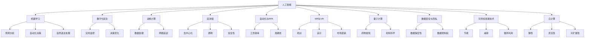

                 

### 文章标题

# Gartner发布2025年企业机构十大战略技术趋势

---

### 文章关键词

- Gartner
- 2025年
- 企业机构
- 技术趋势
- 人工智能
- 云计算
- 区块链
- 数字化转型
- 自动化
- 数据安全

---

### 文章摘要

本文将对Gartner发布的2025年企业机构十大战略技术趋势进行详细解读。通过分析这些趋势，我们将了解如何应对未来的技术变革，并探讨这些技术如何影响企业的运营和战略决策。本文将涵盖核心概念与联系、核心算法原理讲解、数学模型和公式、项目实战以及案例分析等内容，帮助读者全面理解并掌握这些关键技术趋势。

---

### 引言

在当今快速变化的技术环境中，企业机构必须不断适应新的技术趋势，以确保在竞争激烈的市场中保持领先地位。Gartner作为全球知名的研究和咨询公司，每年都会发布一系列关于技术趋势的预测报告，帮助企业了解未来的发展方向。2025年企业机构十大战略技术趋势报告正是这样一份重要文献，它为我们揭示了未来几年内将影响企业运营和战略决策的关键技术方向。

本文旨在通过对Gartner2025年企业机构十大战略技术趋势的详细解读，帮助读者了解这些趋势的背景、核心概念、原理以及应用场景。文章将按照以下结构进行组织：

1. **引言与概述**：介绍Gartner预测的2025年十大技术趋势的背景和重要性。
2. **核心概念与联系**：介绍与这些技术趋势相关的核心概念，并绘制流程图展示它们之间的关系。
3. **核心算法原理讲解**：详细阐述相关的核心算法原理，并使用伪代码展示。
4. **数学模型和公式**：介绍相关的数学模型和公式，并进行详细讲解和举例说明。
5. **项目实战**：通过实际案例展示如何应用这些技术趋势。
6. **案例分析**：对实际案例进行深入分析，讨论这些技术趋势对企业的影响。
7. **总结与展望**：总结全书内容，对未来的发展趋势进行展望。

在接下来的章节中，我们将逐一探讨这些技术趋势，并深入剖析其背后的原理和应用。

### 1.1 Gartner预测的2025年十大技术趋势

Gartner在其2025年企业机构十大战略技术趋势报告中，列出了未来几年内将对企业产生重大影响的技术趋势。以下是这十大趋势的详细列表：

1. **人工智能与机器学习**：人工智能（AI）和机器学习（ML）技术将继续快速发展，为企业提供智能化的解决方案。
2. **数字化双生**：通过创建数字化副本来模拟和分析真实世界的实体和流程，帮助企业实现更高效、更灵活的运营。
3. **边缘计算**：随着物联网（IoT）设备的普及，边缘计算将使数据处理和分析更加接近数据源，降低延迟，提高效率。
4. **区块链**：区块链技术将逐渐从金融领域扩展到其他行业，提供透明、安全和去中心化的数据管理和交易服务。
5. **自动化与机器人流程自动化（RPA）**：自动化技术将大幅提升企业的运营效率，减少人工操作，提高生产力。
6. **混合现实（MR）与虚拟现实（VR）**：MR和VR技术将在企业培训、设计和市场营销等领域得到广泛应用。
7. **量子计算**：尽管仍处于初级阶段，但量子计算将在某些特定领域（如药物发现和材料科学）带来革命性变化。
8. **数据安全与隐私**：随着数据隐私法规的日益严格，企业需要采取更加严格的安全措施来保护敏感数据。
9. **可持续发展技术**：企业将越来越多地采用可持续技术来减少环境影响，提高资源利用效率。
10. **云计算**：云计算将继续作为企业IT基础设施的核心，提供弹性和灵活的IT资源。

这些技术趋势不仅将改变企业的运营方式，还将对企业的战略决策产生深远影响。在接下来的章节中，我们将逐一深入探讨这些趋势的核心概念、原理和应用。

### 1.2 企业应对技术趋势的重要性

企业应对技术趋势的重要性不可忽视。随着技术的快速发展，企业需要及时了解并适应新兴技术，以保持竞争力和创新能力。以下是企业应对技术趋势的几个关键原因：

**保持竞争力**：技术趋势往往能够为企业带来新的商业模式和竞争优势。例如，人工智能和机器学习技术可以帮助企业实现更高效的运营、更准确的预测和更优化的决策，从而在市场竞争中脱颖而出。

**提高效率与生产力**：自动化和机器人流程自动化（RPA）等技术可以减少人工操作，提高工作效率和生产力，降低运营成本。此外，云计算和边缘计算等技术提供的弹性和灵活性，使企业能够更快地响应市场变化，提高业务效率。

**创新能力**：技术趋势为企业提供了创新的工具和方法，帮助企业开发新产品和服务，开拓新市场。例如，混合现实（MR）和虚拟现实（VR）技术可以用于产品设计和市场营销，提高用户体验和客户满意度。

**数据安全与隐私**：随着数据隐私法规的日益严格，企业必须采取有效的安全措施来保护敏感数据。数据安全与隐私技术趋势的应对，不仅能够避免数据泄露和合规风险，还能增强客户信任，提高品牌声誉。

**可持续发展**：可持续发展技术将帮助企业减少环境影响，提高资源利用效率，实现可持续发展目标。随着全球对环境问题的关注日益增加，企业需要采取可持续的发展策略，以应对环境挑战。

总之，企业应对技术趋势的重要性体现在多个方面。只有积极拥抱技术变化，企业才能在激烈的市场竞争中立于不败之地，实现长期可持续发展。在接下来的章节中，我们将详细探讨Gartner预测的2025年企业机构十大战略技术趋势，并分析其对企业的影响。

### 核心概念与联系

在探讨Gartner预测的2025年企业机构十大战略技术趋势之前，我们首先需要了解这些趋势背后的核心概念。以下是与这些趋势密切相关的核心概念：

**1. 人工智能（AI）与机器学习（ML）**：
人工智能是一种模拟人类智能的技术，包括感知、推理、学习和适应等能力。机器学习是人工智能的一个子领域，通过从数据中学习模式和规律，实现自我优化和自我改进。人工智能和机器学习在预测分析、自动化决策、自然语言处理等领域发挥着重要作用。

**2. 数字化双生**：
数字化双生是指创建一个数字副本来模拟和分析真实世界的实体和流程。通过数字化双生，企业可以实时监控和优化运营，提高决策效率。

**3. 边缘计算**：
边缘计算是一种将数据处理和分析功能从云端转移到网络边缘的技术。通过边缘计算，企业可以实现更快的数据处理速度，降低网络延迟，提高系统的响应速度。

**4. 区块链**：
区块链是一种分布式账本技术，具有去中心化、透明、安全等特点。区块链可用于记录和验证各种交易和数据，提高数据的可信度和安全性。

**5. 自动化与机器人流程自动化（RPA）**：
自动化是指通过技术手段实现任务或过程的自动化。机器人流程自动化（RPA）是一种利用软件机器人来执行重复性任务的技术，可以大幅提高工作效率和准确性。

**6. 混合现实（MR）与虚拟现实（VR）**：
混合现实（MR）是一种将虚拟元素与现实世界结合的技术，可以用于培训、设计、市场营销等领域。虚拟现实（VR）则是一种完全沉浸式的虚拟环境，可用于游戏、教育、医疗等领域。

**7. 量子计算**：
量子计算是一种利用量子力学原理进行计算的技术。量子计算机具有巨大的计算能力，可以在药物发现、材料科学、加密等领域实现突破性进展。

**8. 数据安全与隐私**：
数据安全是指保护数据免受未经授权访问、篡改或泄露的措施。数据隐私是指个人数据的保密性和控制权。随着数据隐私法规的日益严格，企业需要采取有效的数据安全与隐私措施。

**9. 可持续发展技术**：
可持续发展技术是指用于减少环境影响、提高资源利用效率的技术。这些技术包括节能、减排、循环利用等。

**10. 云计算**：
云计算是一种通过网络提供计算资源（如服务器、存储、数据库等）的技术。云计算具有弹性、灵活、可扩展等特点，可以帮助企业降低成本、提高效率。

接下来，我们将通过Mermaid流程图来展示这些核心概念之间的关系：



通过这张Mermaid流程图，我们可以清晰地看到各个核心概念之间的关系，以及它们在实际应用中的相互影响。了解这些核心概念及其联系，将有助于我们更好地理解Gartner预测的2025年企业机构十大战略技术趋势，并探讨其对企业的影响。

### 2.1 人工智能

人工智能（Artificial Intelligence, AI）是模仿人类智能的技术和科学，它通过模拟人类思维过程，实现感知、推理、学习和适应等能力。人工智能的核心目标是在各种复杂环境中，自动化地执行人类专家才能完成的任务。以下是对人工智能的详细探讨：

**定义**：人工智能是一种通过计算机系统实现智能行为的技术，它包括学习、推理、规划、感知、自然语言理解和问题解决等多个方面。根据其实现方式，人工智能可以分为弱人工智能（Narrow AI）和强人工智能（General AI）。

- **弱人工智能**：弱人工智能是指专注于特定任务的AI系统，如语音识别、图像识别、自然语言处理等。这些系统在特定领域表现出色，但无法进行跨领域的通用智能行为。
- **强人工智能**：强人工智能是一种具有广泛认知能力的人工智能，它可以像人类一样进行各种复杂的任务，拥有自我意识和理解能力。目前，强人工智能还处于理论研究和早期开发阶段。

**分类**：人工智能可以根据其应用领域和实现技术进行分类。以下是一些常见的人工智能分类：

- **基于规则的系统**：这类系统通过预定义的规则来模拟人类决策过程。例如，专家系统（Expert Systems）就是一种典型的基于规则的系统。
- **统计学习模型**：这类系统通过从数据中学习统计规律，实现自动分类和预测。常见的统计学习模型包括线性回归、决策树、支持向量机（SVM）等。
- **神经网络**：神经网络是一种模拟人脑结构的计算模型，通过多层神经元之间的连接和激活函数，实现复杂的模式识别和分类任务。常见的神经网络模型包括前馈神经网络、卷积神经网络（CNN）和循环神经网络（RNN）等。
- **深度学习**：深度学习是神经网络的一种特殊形式，通过多层神经网络结构来模拟人类的感知和学习能力。深度学习在图像识别、语音识别、自然语言处理等领域取得了显著成果。

**在商业和科技领域中的应用**：

1. **图像识别**：图像识别技术被广泛应用于人脸识别、安全监控、自动驾驶等领域。例如，人脸识别系统可以用于门禁控制、身份验证等，自动驾驶系统可以通过分析道路图像来做出行驶决策。

2. **自然语言处理（NLP）**：自然语言处理技术使计算机能够理解、生成和处理人类语言。常见的应用包括机器翻译、文本分类、情感分析等。例如，谷歌翻译和苹果的Siri都是自然语言处理技术的成功应用。

3. **自动化决策**：人工智能可以帮助企业自动化复杂的决策过程，提高决策的准确性和效率。例如，基于机器学习模型的推荐系统可以帮助电商平台精准推荐商品，提高销售转化率。

4. **预测分析**：人工智能技术可以分析大量数据，预测市场趋势、客户行为等，为企业提供决策支持。例如，银行可以利用人工智能技术预测贷款违约风险，从而优化贷款审批流程。

5. **机器人流程自动化（RPA）**：RPA通过软件机器人自动化执行重复性任务，提高工作效率和准确性。例如，财务部门可以通过RPA自动化处理发票、报销等流程，减少人工操作错误。

**人工智能的挑战**：

1. **数据隐私与安全**：随着人工智能技术的应用，大量数据被收集和分析，这引发了对数据隐私和安全性的担忧。如何确保数据的合法、安全和隐私，是人工智能领域面临的重要挑战。

2. **算法偏见**：人工智能系统在学习和决策过程中，可能会受到算法偏见的影响，导致不公正的结果。例如，招聘系统可能会根据历史数据歧视某些性别或种族。如何消除算法偏见，确保公平性和透明性，是人工智能领域需要解决的问题。

3. **技术依赖**：随着人工智能技术的普及，企业对技术的依赖程度越来越高。如果技术出现故障或受到攻击，可能会导致业务中断。因此，如何确保人工智能系统的可靠性和鲁棒性，是企业需要考虑的问题。

4. **道德和伦理问题**：人工智能技术的发展引发了一系列道德和伦理问题，如机器是否应该拥有自主权、如何处理人工智能错误导致的损失等。这些问题的解决需要社会各界的共同努力。

综上所述，人工智能作为Gartner预测的2025年企业机构十大战略技术趋势之一，具有广泛的应用前景和深远的影响。企业需要积极拥抱人工智能技术，同时关注其带来的挑战，以确保在未来的技术变革中保持竞争力。

### 2.2 云计算

云计算（Cloud Computing）是一种通过互联网提供计算资源（如服务器、存储、数据库等）的技术。它允许用户按需访问和使用这些资源，而无需购买和维护物理硬件。云计算具有灵活性、可扩展性和成本效益高等特点，已经成为企业IT基础设施的核心部分。

**云计算的原理**：

云计算的基本原理是利用分布式计算和网络技术，将大量的计算资源集中管理和分配。这些资源包括计算能力、存储空间和数据库等。云计算平台通常包括以下几个核心组成部分：

1. **基础设施即服务（IaaS）**：IaaS提供虚拟化的计算资源，如虚拟机、存储和网络。用户可以自行配置和管理这些资源，类似于拥有自己的物理服务器。常见的IaaS平台包括亚马逊AWS、微软Azure和谷歌云平台（GCP）。

2. **平台即服务（PaaS）**：PaaS提供开发平台和工具，使开发者可以专注于应用程序的开发，而无需担心底层基础设施的管理。PaaS通常包括数据库、开发工具和应用程序接口（API）。例如，谷歌App Engine和微软Azure App Service。

3. **软件即服务（SaaS）**：SaaS提供完整的软件解决方案，用户可以通过互联网访问和使用这些服务。常见的SaaS应用包括办公软件（如Google Workspace和Microsoft Office 365）、客户关系管理（CRM）系统（如Salesforce）和企业资源计划（ERP）系统（如SAP S/4HANA）。

**云计算的服务模式**：

云计算主要有三种服务模式：

1. **公有云**：公有云是由第三方服务提供商运营的云平台，多个用户共享计算资源。公有云具有高可用性、弹性和成本效益，适用于各种规模的企业。常见的公有云提供商包括亚马逊AWS、微软Azure和谷歌云平台。

2. **私有云**：私有云是为特定组织或企业定制的云平台，通常部署在企业内部或第三方数据中心。私有云提供更高的安全性和控制权，适用于有严格数据安全要求的企业。私有云可以与公有云集成，实现混合云部署。

3. **混合云**：混合云结合了公有云和私有云的优势，允许企业根据不同需求在多个云平台之间灵活调配资源。混合云适用于需要灵活扩展和高效管理的复杂企业环境。

**云计算的优势**：

1. **灵活性**：云计算允许用户根据需求动态调整计算资源，从而快速响应市场变化。用户可以根据业务需求增减服务器、存储和带宽等资源，而无需购买和维护物理硬件。

2. **成本效益**：云计算通过按需付费模式，使企业可以降低IT基础设施的初始投资和运营成本。用户只需为实际使用的资源付费，无需承担闲置资源的成本。

3. **可扩展性**：云计算提供几乎无限的可扩展性，用户可以根据业务需求轻松扩展计算资源。在高峰期，企业可以快速增加资源，以应对突发流量，而在低谷期，可以减少资源，降低成本。

4. **高可用性**：云计算平台通常具有高度可靠的数据存储和备份机制，提供高可用性服务。多个数据中心和节点之间的负载均衡和容错机制，确保系统的稳定性和数据的安全。

**云计算的挑战**：

1. **数据安全与隐私**：云计算涉及大量敏感数据的存储和处理，企业需要确保数据的安全性和隐私。尽管云计算提供商采取多种安全措施，但用户仍需关注数据泄露和未授权访问的风险。

2. **依赖性**：企业对云计算的依赖性日益增加，一旦云服务提供商出现故障或中断，可能会对企业的业务运营造成严重影响。因此，企业需要确保备份和灾难恢复计划，以应对潜在的云服务中断。

3. **合规性问题**：不同国家和地区对数据存储和处理有严格的法律法规，企业在选择云服务提供商时需要确保符合当地法规。例如，欧洲的通用数据保护条例（GDPR）对个人数据的处理有严格的要求。

4. **技术复杂性**：云计算涉及多种技术和平台，企业需要具备相应的技术知识和技能，以充分利用云计算的优势。此外，云计算的部署、管理和监控也需要投入大量资源和时间。

综上所述，云计算作为Gartner预测的2025年企业机构十大战略技术趋势之一，具有显著的灵活性和成本效益。企业需要充分了解云计算的原理和服务模式，并积极应对其带来的挑战，以实现业务的高效运营和持续发展。

### 2.3 区块链

区块链（Blockchain）是一种分布式账本技术，具有去中心化、透明、安全和不可篡改等特点。它通过多个节点之间的共识机制，记录和验证交易数据，确保数据的真实性和安全性。区块链技术在金融、供应链管理、数字身份验证等多个领域显示出强大的潜力。

**区块链的基本原理**：

区块链的核心组成部分包括区块、链和节点。以下是对区块链基本原理的详细解释：

1. **区块**：区块是区块链的基本数据单元，包含一定数量的交易记录。每个区块都包含一个时间戳、一个交易记录集和一个随机数。区块通过哈希函数与前一个区块相连，形成区块链。

2. **链**：区块链是一个由多个区块按时间顺序链接而成的数据结构。每个区块都包含一个指向前一个区块的哈希值，形成一个单向链。这种结构确保了区块链的不可篡改性，因为任何对区块链数据的修改都会破坏链的完整性。

3. **节点**：节点是区块链网络中的计算设备，负责验证和记录交易。每个节点都存储一个完整的区块链副本，并通过共识机制来达成数据一致性。

**区块链的工作机制**：

区块链的工作机制主要包括以下步骤：

1. **交易生成**：用户发起交易，并将其广播到区块链网络。

2. **交易验证**：节点接收交易，并验证其合法性。例如，验证交易是否已付款、是否超过账户余额等。

3. **区块创建**：验证后的交易被添加到一个新的区块中。节点竞争生成下一个区块，通常通过解决一个加密难题（如工作量证明算法）。

4. **区块验证**：其他节点验证新区块的合法性和完整性，并添加到区块链中。

5. **区块传播**：新区块在区块链网络中传播，所有节点更新其区块链副本。

**区块链的应用场景**：

区块链技术在多个领域显示出巨大的应用潜力，以下是几个典型的应用场景：

1. **金融领域**：区块链技术可以用于改进支付系统、证券交易和智能合约。例如，比特币和以太坊等加密货币是区块链在金融领域的成功应用。智能合约通过代码自动执行合同条款，提高交易的透明性和安全性。

2. **供应链管理**：区块链技术可以用于跟踪产品从生产到交付的整个过程，确保供应链的透明度和可追溯性。通过区块链，企业可以实时监控产品的状态和位置，提高供应链的效率和可靠性。

3. **数字身份验证**：区块链技术可以用于创建安全的数字身份，保护用户的隐私和安全。数字身份验证通过区块链上的分布式身份标识，实现用户身份的验证和管理，减少欺诈和身份盗窃的风险。

4. **医疗健康**：区块链技术可以用于存储和共享医疗记录，提高医疗数据的安全性和可访问性。通过区块链，医疗机构可以安全地共享患者信息，改善医疗服务的质量和效率。

5. **版权保护**：区块链技术可以用于跟踪和验证数字版权，确保创作者的权益。通过区块链，创作者可以永久记录其作品的所有权，防止未经授权的复制和分发。

**区块链的优势**：

1. **去中心化**：区块链通过分布式网络运行，无需中央机构，提高了系统的透明度和抗攻击能力。

2. **透明性**：区块链上的所有交易都是公开透明的，用户可以查看和验证交易记录，提高了系统的可信度。

3. **安全性**：区块链采用加密技术保护数据，确保数据的完整性和不可篡改性。此外，共识机制确保了网络节点的协同工作，提高了系统的安全性。

4. **可追溯性**：区块链上的所有交易都是按时间顺序记录的，用户可以追溯交易历史，确保数据的真实性和可追溯性。

**区块链的挑战**：

1. **性能限制**：区块链的处理速度相对较慢，单个区块的容量有限，这可能导致交易拥堵和延迟。

2. **能源消耗**：某些区块链共识机制（如工作量证明）需要大量的计算资源，导致能源消耗较高。

3. **隐私保护**：尽管区块链具有透明性，但在某些应用场景中，用户可能希望保持隐私。如何平衡透明性和隐私保护，是一个需要解决的问题。

4. **监管合规**：不同国家和地区对区块链技术和加密货币的监管政策不同，企业需要确保符合当地的法律法规。

综上所述，区块链作为Gartner预测的2025年企业机构十大战略技术趋势之一，具有广泛的应用前景和深远的影响。企业需要关注区块链的原理和优势，同时应对其挑战，以实现业务创新和可持续发展。

### 2.4 数字化双生

数字化双生（Digital Twin）是指创建一个数字副本来模拟和分析真实世界的实体和流程。通过数字化双生，企业可以在虚拟环境中实时监控、模拟和优化其物理资产和运营流程。这一技术趋势在工业、医疗、能源等领域展现出巨大的潜力。

**数字化双生的定义和背景**：

数字化双生最早由美国科学家迈克尔·格里夫斯（Michael Grieves）在2002年提出，其目的是将物理实体和虚拟模型紧密结合，形成一个集成的系统。数字化双生包括两个主要部分：物理实体和其对应的数字副本。物理实体可以是工厂设备、生产线、医疗设备、飞机等。数字副本则是通过传感器、模拟和数据采集技术，在虚拟环境中对物理实体的状态和行为进行实时监控和模拟。

随着物联网（IoT）和大数据技术的发展，数字化双生逐渐成为企业提升运营效率、降低成本和改进产品设计的重要工具。数字化双生不仅可以帮助企业更好地理解其物理资产，还可以为预测性维护、远程诊断和虚拟仿真提供支持。

**数字化双生的应用场景**：

1. **制造业**：在制造业中，数字化双生可以用于优化生产流程、提高生产效率和降低故障率。通过实时监控生产设备的运行状态，企业可以预测设备故障，提前进行维护，从而减少停机时间和生产损失。例如，某汽车制造商使用数字化双生技术对其生产线进行模拟和优化，提高了生产效率和产品质量。

2. **医疗健康**：在医疗健康领域，数字化双生可以帮助医生更准确地诊断和治疗疾病。通过创建病人的数字副本，医生可以在虚拟环境中进行手术模拟和病情分析，提高诊断的准确性和治疗效果。例如，某医院使用数字化双生技术对心脏手术进行模拟，成功降低了手术风险和并发症发生率。

3. **能源管理**：在能源管理领域，数字化双生可以用于优化能源使用、提高能源效率。通过实时监控能源设备的状态和运行数据，企业可以预测能源需求，优化能源分配，减少能源浪费。例如，某能源公司使用数字化双生技术对其电网进行模拟和优化，提高了能源利用率和系统稳定性。

4. **交通运输**：在交通运输领域，数字化双生可以用于优化交通流量、提高交通安全。通过实时监控交通状况和车辆位置，交通管理部门可以预测交通拥堵和事故风险，提前采取措施进行疏导和预警。例如，某城市使用数字化双生技术对交通信号灯进行优化，提高了交通效率和安全性。

**数字化双生的优势**：

1. **实时监控和预测**：数字化双生通过实时数据采集和模拟，使企业能够实时监控物理资产的状态和运行情况，预测潜在故障和风险，从而提前采取维护和优化措施。

2. **优化运营流程**：数字化双生可以帮助企业模拟和优化运营流程，提高生产效率和资源利用率。通过虚拟环境中的模拟测试，企业可以识别和解决潜在问题，减少实际运营中的故障和损失。

3. **降低成本**：数字化双生可以减少物理设备的维护和运营成本。通过预测性维护和远程诊断，企业可以降低设备停机时间和维修费用，提高资产利用率。

4. **提高决策质量**：数字化双生提供了丰富的数据和分析工具，帮助企业做出更准确的决策。通过虚拟环境和数据模型，企业可以模拟不同方案的结果，评估其对业务的影响，从而选择最佳方案。

**数字化双生的挑战**：

1. **数据安全和隐私**：数字化双生涉及大量敏感数据，如传感器数据、运营数据和用户数据。企业需要确保数据的安全性和隐私性，防止数据泄露和未授权访问。

2. **技术集成和复杂性**：数字化双生需要多种技术的集成，包括物联网、大数据、云计算和人工智能等。企业需要具备相应的技术能力和资源，以实现数字化双生的有效应用。

3. **数据质量和准确性**：数字化双生的效果取决于数据的准确性和质量。企业需要确保传感器数据的可靠性和实时性，以获得准确的模拟和分析结果。

4. **员工培训和适应**：数字化双生的应用需要员工具备相应的技能和知识。企业需要提供培训和支持，帮助员工适应新的工作方式和技术环境。

综上所述，数字化双生作为Gartner预测的2025年企业机构十大战略技术趋势之一，具有显著的应用前景和优势。企业需要积极拥抱这一技术，同时应对其带来的挑战，以实现运营优化和持续发展。

### 2.5 边缘计算

边缘计算（Edge Computing）是一种将数据处理和分析功能从云端转移到网络边缘的技术。其核心理念是将数据生成、处理和消费的地点靠近数据源，以减少数据传输延迟、提高系统响应速度和降低网络带宽消耗。随着物联网（IoT）设备的普及，边缘计算正逐渐成为企业提升运营效率、增强实时性和提高数据安全性的重要手段。

**边缘计算的定义和背景**：

边缘计算是指将数据处理、存储和分析任务分散到网络的边缘节点，如企业数据中心、云服务器、物联网设备等。边缘节点靠近数据源，可以在本地对数据进行处理和分析，从而减少对中心云服务的依赖。边缘计算起源于物联网和移动设备的普及，随着5G技术的引入，边缘计算的应用场景和需求进一步扩大。

**边缘计算的工作原理**：

边缘计算的工作原理主要包括以下几个关键步骤：

1. **数据生成**：物联网设备（如传感器、摄像头等）在实时环境中生成大量数据。

2. **数据预处理**：在边缘节点，对收集到的数据进行预处理，包括过滤、压缩、加密等，以减少数据传输量和提升传输效率。

3. **边缘处理**：边缘节点执行数据的初步处理和分析任务，如实时监控、异常检测等。这些任务通常不需要大量的计算资源，但要求快速响应。

4. **数据传输**：经过边缘处理的数据可以被传输到中心云进行进一步分析和处理，如大数据分析、机器学习等。

5. **数据反馈**：分析结果和指令可以从中心云传输回边缘节点，用于实时调整和优化边缘节点的操作。

**边缘计算的应用场景**：

边缘计算在多个领域展现出广泛的应用前景，以下是几个典型的应用场景：

1. **工业物联网**：在工业物联网中，边缘计算可以帮助企业实时监控生产线设备的状态，进行故障预测和预防性维护。通过边缘计算，企业可以快速响应生产线的异常情况，减少停机时间和维护成本。

2. **智能交通系统**：智能交通系统通过部署边缘计算设备，可以实时处理交通数据，如车辆位置、路况信息等。边缘计算可以用于实时交通监控、信号灯优化和事故预警，提高交通效率和安全性。

3. **智能医疗**：在智能医疗领域，边缘计算可以帮助医生进行实时医疗监控和诊断。例如，通过在病房中部署边缘计算设备，可以实时监测患者的生命体征，快速发现异常情况，提供及时的医疗干预。

4. **智能家居**：智能家居设备（如智能音箱、智能门锁、智能照明等）通过边缘计算可以实现更智能、更个性化的用户体验。边缘计算设备可以在本地处理用户的语音指令和操作请求，减少对云端服务的依赖，提高系统的响应速度和可靠性。

**边缘计算的优势**：

1. **降低延迟**：边缘计算将数据处理和分析功能靠近数据源，减少了数据传输的距离和时间，从而降低了系统延迟，提高了实时性。

2. **减少带宽消耗**：边缘计算通过在本地处理部分数据，减少了需要传输到中心云的数据量，降低了网络带宽消耗，提高了数据传输效率。

3. **提高系统响应速度**：边缘计算可以快速响应实时数据，提高了系统的响应速度和用户体验。

4. **增强数据安全性**：边缘计算可以在本地进行数据加密和处理，减少了数据在网络中的暴露时间，提高了数据的安全性。

**边缘计算的挑战**：

1. **边缘设备资源限制**：边缘设备（如物联网设备、边缘服务器等）通常资源有限，包括计算能力、存储和带宽。如何在这些有限的资源下实现高效的数据处理和分析，是一个重要挑战。

2. **数据一致性和完整性**：在分布式网络中，数据的一致性和完整性是一个关键问题。如何在边缘节点和中心云之间保证数据的一致性和完整性，是一个需要解决的问题。

3. **边缘计算的安全性和隐私性**：边缘计算涉及大量的敏感数据，如用户隐私、企业商业机密等。如何确保边缘计算的安全性和隐私性，防止数据泄露和未授权访问，是一个重要挑战。

4. **边缘计算的标准和生态**：边缘计算技术尚处于发展初期，缺乏统一的标准和生态系统。企业需要投入大量资源来构建和维护边缘计算环境，这增加了技术门槛和成本。

综上所述，边缘计算作为Gartner预测的2025年企业机构十大战略技术趋势之一，具有显著的应用前景和优势。企业需要关注边缘计算的原理和挑战，积极拥抱这一技术，以实现业务的高效运营和持续发展。

### 2.6 自动化与机器人流程自动化（RPA）

自动化（Automation）是指通过技术手段实现任务或过程的自动化，以减少人工操作和提高效率。机器人流程自动化（Robotic Process Automation，RPA）是一种利用软件机器人（或“机器人”）来执行重复性任务的技术。RPA在提升企业运营效率、降低成本和优化资源分配方面发挥着重要作用。

**自动化与RPA的定义和背景**：

自动化是指通过计算机程序、软件机器人或其他自动化工具，自动执行一系列预定义的任务或工作流程。自动化技术可以涵盖从简单的数据录入到复杂的数据处理和分析等多个层面。随着人工智能和机器人技术的发展，自动化技术逐渐从制造业扩展到服务业、金融业、医疗保健等多个领域。

RPA是一种特殊类型的自动化技术，通过软件机器人模拟人类操作员的工作方式，自动执行重复性、规则性强的任务。RPA机器人可以与各种应用程序（如ERP系统、客户关系管理系统等）进行交互，提取、处理和传输数据，从而实现业务流程的自动化。

**自动化与RPA的工作原理**：

1. **任务识别**：自动化和RPA的第一步是识别和定义需要自动化的任务或流程。这通常涉及分析现有流程、确定重复性任务和规则性操作。

2. **流程设计**：根据任务需求，设计自动化流程。这包括创建流程图、定义任务顺序、设置参数和触发条件等。

3. **机器人配置**：配置软件机器人，使其能够按照设计好的流程执行任务。机器人配置通常涉及设置用户界面操作、数据提取和输入、验证和错误处理等。

4. **执行与监控**：机器人按照配置的流程自动执行任务。同时，系统会对机器人的执行过程进行监控，包括任务状态、执行时间和错误记录等。

**自动化与RPA的应用场景**：

自动化和RPA技术在多个领域展现出广泛的应用前景，以下是几个典型的应用场景：

1. **财务与会计**：在财务和会计领域，RPA可以用于自动化处理发票、报销、账单支付等任务。RPA机器人可以快速准确地提取和输入数据，减少人工操作错误，提高数据处理效率。

2. **人力资源**：在人力资源领域，RPA可以用于自动化处理招聘流程、员工档案管理、薪酬计算和福利发放等任务。RPA机器人可以快速筛选和匹配简历，自动发送面试通知，减少人力资源部门的重复性工作。

3. **客户服务**：在客户服务领域，RPA可以用于自动化处理客户咨询、投诉和订单处理等任务。RPA机器人可以提供24/7的服务，快速响应用户请求，提高客户满意度。

4. **供应链管理**：在供应链管理领域，RPA可以用于自动化处理采购订单、库存管理、物流跟踪等任务。RPA机器人可以提高供应链的透明度和效率，降低运营成本。

5. **数据整合与报告**：RPA可以用于自动化数据整合和报告生成任务，将来自不同系统的数据合并，生成详细的报告和分析结果。这有助于企业快速做出数据驱动的决策。

**自动化与RPA的优势**：

1. **提高效率**：自动化和RPA可以显著减少人工操作时间，提高任务处理速度和准确性，从而提高整体运营效率。

2. **降低成本**：通过减少人工操作和错误，自动化和RPA可以降低运营成本，提高资源利用效率。

3. **减少错误**：自动化和RPA可以减少人工操作的依赖，降低人为错误的风险，提高数据处理的准确性和一致性。

4. **增强灵活性**：自动化和RPA可以使业务流程更加灵活和可扩展，企业可以根据需求快速调整和优化流程。

5. **提高客户满意度**：自动化和RPA可以提高客户服务的响应速度和准确性，增强客户体验，提高客户满意度。

**自动化与RPA的挑战**：

1. **流程复杂性**：某些业务流程非常复杂，涉及多个系统和应用，自动化和RPA的实施难度较大。

2. **技术依赖**：自动化和RPA依赖于先进的计算机技术和软件，企业需要投入大量资源进行技术培训和维护。

3. **系统整合**：自动化和RPA需要与现有系统（如ERP、CRM等）进行整合，确保数据的一致性和系统的稳定性。

4. **数据安全和隐私**：自动化和RPA涉及大量敏感数据，企业需要确保数据的安全性和隐私性，防止数据泄露和未授权访问。

5. **机器人管理**：随着RPA机器人的数量增多，企业需要建立有效的机器人管理机制，确保机器人的正常运行和性能优化。

综上所述，自动化和RPA作为Gartner预测的2025年企业机构十大战略技术趋势之一，具有显著的应用前景和优势。企业需要关注自动化与RPA的原理和挑战，积极实施和推广这一技术，以实现业务的高效运营和持续发展。

### 2.7 混合现实（MR）与虚拟现实（VR）

混合现实（Mixed Reality，MR）和虚拟现实（Virtual Reality，VR）是两种通过计算机技术创造沉浸式体验的先进技术。它们在增强现实体验、培训、设计和市场营销等方面具有广泛应用，正在深刻改变企业的运营方式。

**混合现实（MR）的定义和特点**：

混合现实是一种将虚拟元素与现实世界相结合的技术，使用户能够在真实环境中与虚拟对象进行互动。MR的关键特点包括：

- **沉浸感**：MR通过头戴显示器或其他设备，将虚拟图像叠加到用户的视野中，使用户感觉虚拟对象是真实存在的。
- **交互性**：用户可以通过手势、声音或其他输入设备与虚拟对象进行互动，实现更加自然的交互体验。
- **实时性**：MR系统能够实时捕捉用户的动作和环境变化，并动态更新虚拟图像，提高交互的实时性和准确性。

**虚拟现实（VR）的定义和特点**：

虚拟现实是一种完全沉浸式的体验，通过头戴显示器或VR眼镜，将用户带入一个虚拟环境。VR的主要特点包括：

- **沉浸感**：VR通过创建一个完全虚拟的环境，使用户完全脱离现实世界，沉浸在虚拟体验中。
- **交互性**：用户在VR环境中可以自由移动、交互和探索，享受高度自主的交互体验。
- **独立性**：VR环境独立于现实世界，用户可以在其中进行各种虚拟活动，不受现实世界的限制。

**混合现实（MR）与虚拟现实（VR）的应用场景**：

1. **设计**：在产品设计领域，MR和VR技术可以用于产品原型设计、虚拟展示和协同设计。设计师可以通过MR设备实时查看和修改产品模型，提高设计的准确性和效率。例如，汽车设计师可以使用MR技术进行车身设计的虚拟展示和调整。

2. **培训**：MR和VR技术可以用于各种培训场景，如航空、医疗、军事等。通过虚拟现实环境，学员可以在安全、可控的条件下进行实际操作训练，提高培训效果和安全性。例如，飞行员可以使用VR模拟器进行飞行训练，医生可以使用VR进行手术模拟和练习。

3. **市场营销**：MR和VR技术可以用于市场营销活动，创造独特的客户体验。例如，零售商可以使用VR技术创建虚拟购物环境，让顾客在家中体验商品的真实效果。房地产公司可以使用MR技术进行虚拟看房，提高销售转化率。

4. **远程协作**：MR和VR技术可以用于远程协作，实现异地团队之间的实时互动和协同工作。通过VR会议系统，团队成员可以在虚拟会议室中见面，进行面对面的讨论和合作。例如，跨国公司的团队可以通过VR技术进行远程会议和项目协作。

**MR和VR的优势**：

1. **沉浸感**：MR和VR技术能够提供高度沉浸的体验，使用户在虚拟环境中感受到真实的物理交互，提高用户的参与度和体验质量。

2. **交互性**：MR和VR技术提供了丰富的交互方式，用户可以通过手势、声音等自然交互方式与虚拟环境进行互动，实现更加自然的操作体验。

3. **灵活性**：MR和VR技术具有高度的灵活性，用户可以在虚拟环境中自由探索、交互和实验，不受现实世界的限制。

4. **效率提升**：MR和VR技术可以提高设计和培训的效率，通过虚拟环境进行模拟和练习，减少实际操作的时间和成本。

**MR和VR的挑战**：

1. **硬件成本**：MR和VR设备（如头戴显示器、VR眼镜等）价格较高，对企业和用户来说是一大成本负担。

2. **技术成熟度**：尽管MR和VR技术已经取得显著进展，但其在某些方面的技术成熟度仍有待提高，如图像质量、实时性、交互性等。

3. **内容开发**：高质量、有吸引力的MR和VR内容开发是一个复杂和耗时的工作，需要专业的技术和创意。

4. **数据安全和隐私**：MR和VR技术涉及大量的用户数据和隐私信息，如何确保这些数据的安全和隐私，是一个重要挑战。

综上所述，混合现实（MR）和虚拟现实（VR）作为Gartner预测的2025年企业机构十大战略技术趋势之一，具有广泛的应用前景和优势。企业需要关注MR和VR的原理和挑战，积极应用这些技术，以提升设计、培训、市场营销和协作等方面的效率和质量。

### 2.8 量子计算

量子计算（Quantum Computing）是一种利用量子力学原理进行计算的技术，具有与传统计算机截然不同的工作机制。量子计算机利用量子比特（qubit）进行信息编码和处理，能够解决传统计算机难以应对的复杂问题。随着量子技术的不断发展，量子计算在多个领域展现出巨大的应用潜力。

**量子计算的定义和特点**：

量子计算是基于量子力学原理进行信息处理的一种计算模式。量子比特是量子计算的基本单位，具有叠加态和纠缠态等特性，使得量子计算机能够在极短时间内处理大量数据。以下是一些量子计算的关键特点：

- **叠加态**：量子比特可以同时处于多个状态的叠加，这使得量子计算机能够同时处理多个计算任务，大幅提高计算效率。
- **纠缠态**：量子比特之间存在纠缠关系，一个量子比特的状态会直接影响另一个量子比特的状态，这种特性使得量子计算机能够进行并行计算。
- **量子并行性**：由于叠加态和纠缠态的存在，量子计算机可以在短时间内处理大量并行任务，这是传统计算机难以实现的。

**量子计算的工作原理**：

量子计算的工作原理主要包括以下几个关键步骤：

1. **量子初始化**：将量子比特初始化到特定的叠加态。
2. **量子门操作**：通过量子门对量子比特进行特定的变换，实现信息处理和运算。
3. **量子测量**：对量子比特进行测量，获得最终的计算结果。由于量子测量的随机性，量子计算的结果通常是一个概率分布。

**量子计算在商业和科技领域中的应用**：

量子计算在多个领域显示出强大的应用潜力，以下是几个典型的应用场景：

1. **药物发现和材料科学**：量子计算可以加速分子模拟和化学反应计算，有助于药物设计和材料合成。例如，使用量子计算可以预测新药分子的活性，加速新药的研发进程。

2. **加密和网络安全**：量子计算在加密和网络安全领域具有潜在的应用价值。量子计算机能够破解传统加密算法，因此需要开发新的量子加密技术来保护数据安全。量子密钥分发和量子安全通信是两个重要的研究方向。

3. **金融建模和优化**：量子计算可以用于解决复杂的金融优化问题，如资产配置、风险管理等。例如，使用量子计算可以快速计算金融衍生品的价格和风险，帮助投资者做出更准确的决策。

4. **物流和供应链优化**：量子计算可以用于优化物流和供应链管理，提高运输效率和降低成本。通过量子算法，可以找到最优的运输路线和库存策略，提高供应链的灵活性和响应速度。

**量子计算的优势**：

1. **并行计算能力**：量子计算能够实现并行计算，大幅提高计算速度和效率，解决传统计算机难以应对的复杂问题。
2. **解决特定问题**：量子计算在某些领域（如量子模拟、优化问题等）具有传统计算机无法比拟的优势，能够提供更准确和高效的解决方案。
3. **数据加密**：量子计算在加密和网络安全领域具有潜在的应用价值，可以开发更强大的加密算法，保护数据的安全。

**量子计算的挑战**：

1. **技术成熟度**：尽管量子计算在理论和技术层面取得了显著进展，但实际应用的量子计算机仍面临技术难题，如量子比特的稳定性、错误率等。
2. **量子硬件成本**：量子计算机的硬件成本较高，对于企业来说是一大财务负担。
3. **编程和算法**：量子计算需要全新的编程模型和算法，企业和开发者需要学习和掌握这些技术，以充分利用量子计算机的潜力。

综上所述，量子计算作为Gartner预测的2025年企业机构十大战略技术趋势之一，具有广泛的应用前景和巨大的潜力。企业需要关注量子计算的理论和实践，积极投入研究和开发，以抓住这一技术变革的机遇。

### 2.9 数据安全与隐私

数据安全与隐私在当今数字化时代愈发重要，随着云计算、物联网和大数据技术的普及，企业面临着日益严峻的数据泄露和隐私侵犯风险。数据安全与隐私技术旨在保护数据在存储、传输和处理过程中的完整性、可用性和保密性，确保企业能够合规运营并赢得客户信任。

**数据安全的定义和重要性**：

数据安全是指采取一系列技术和管理措施，保护数据免受未经授权的访问、篡改、泄露或破坏。数据安全的重要性体现在以下几个方面：

1. **保护企业资产**：数据是企业的重要资产，保护数据安全可以防止数据泄露导致的经济损失。
2. **合规性要求**：全球各地对数据隐私和安全的法律法规日益严格，企业需要确保遵守相关法规，避免法律风险和罚款。
3. **客户信任**：确保数据安全可以提高客户对企业的信任，增强品牌声誉和市场竞争力。
4. **业务连续性**：数据安全是保障业务连续性的关键，确保数据不因恶意攻击或意外事件而丢失或无法访问。

**数据隐私的定义和重要性**：

数据隐私是指个人数据的保密性和控制权，确保个人数据不被未经授权的个人或组织访问、使用或泄露。数据隐私的重要性体现在以下几个方面：

1. **个人信息保护**：确保个人数据不被滥用或泄露，保护个人隐私权益。
2. **合规性要求**：许多国家和地区制定了严格的数据隐私保护法律，如欧盟的通用数据保护条例（GDPR）和加州消费者隐私法（CCPA），企业需确保合规。
3. **客户信任**：尊重和保护客户隐私可以提高客户满意度和忠诚度，增强品牌形象。
4. **减少法律风险**：遵守数据隐私法规可以降低企业因数据隐私问题而面临的法律风险和罚款。

**数据安全与隐私技术的分类**：

数据安全与隐私技术主要分为以下几个方面：

1. **数据加密**：数据加密是保护数据安全的核心技术之一，通过将数据转换为密文，确保数据在传输和存储过程中不被未经授权的第三方访问。常见的加密算法包括对称加密（如AES）和非对称加密（如RSA）。

2. **访问控制**：访问控制通过限制对数据和系统的访问权限，确保只有经过授权的用户和系统能够访问特定的数据和资源。访问控制包括身份验证、授权和审计等环节。

3. **多因素认证**：多因素认证（MFA）是一种安全措施，要求用户在登录系统时提供两种或以上的验证方式，如密码、短信验证码、指纹等。MFA可以有效防止密码泄露和未经授权的访问。

4. **入侵检测和防御系统**：入侵检测和防御系统（IDS/IPS）用于监控网络和系统的活动，检测和阻止恶意行为和攻击。IDS/IPS可以识别异常行为、恶意软件和网络攻击，并采取相应的防护措施。

5. **数据备份与恢复**：数据备份与恢复是确保数据安全的重要手段，通过定期备份数据，可以在数据丢失或损坏时迅速恢复数据，保障业务的连续性。

6. **数据脱敏**：数据脱敏是一种数据保护技术，用于将敏感数据替换为不可识别的替代值，以保护数据的隐私和安全性。数据脱敏技术包括字符替换、掩码和随机化等。

**数据安全与隐私的最佳实践**：

1. **制定数据安全政策**：企业应制定详细的员工数据安全政策，明确数据保护的标准和流程，确保所有员工了解并遵守数据安全规定。

2. **培训员工**：定期对员工进行数据安全与隐私培训，提高员工的安全意识和操作规范，减少人为错误和泄露风险。

3. **使用多因素认证**：在关键系统和数据访问点上，强制使用多因素认证，以增强安全性。

4. **定期安全审计**：定期进行安全审计和漏洞扫描，及时发现和修复安全漏洞。

5. **数据备份与恢复**：制定详细的数据备份策略，确保数据在意外事件中能够迅速恢复。

6. **遵守法律法规**：确保企业的数据安全与隐私措施符合当地法律法规的要求，避免法律风险。

7. **建立应急响应计划**：制定应急响应计划，确保在数据泄露或安全事件发生时能够迅速采取行动，降低损失。

综上所述，数据安全与隐私作为Gartner预测的2025年企业机构十大战略技术趋势之一，是企业确保业务连续性、合规性和客户信任的关键。企业需要积极采取数据安全与隐私技术，建立全面的安全管理体系，以应对日益复杂的安全挑战。

### 2.10 可持续发展技术

可持续发展技术是指用于减少环境影响、提高资源利用效率的技术，旨在实现经济、社会和环境的协调发展。随着全球气候变化和环境问题日益严峻，企业需要采取可持续技术来减少碳排放、节约资源、保护生态系统，并实现长期的可持续发展目标。

**可持续发展技术的定义和重要性**：

可持续发展技术包括节能、减排、循环利用和可再生能源利用等，通过技术创新和管理优化，提高资源利用效率，减少对环境的负面影响。可持续发展技术的重要性体现在以下几个方面：

1. **环境保护**：可持续发展技术有助于减少污染、节约资源和保护生态系统，实现环境保护目标。
2. **资源节约**：通过提高资源利用效率，企业可以减少资源消耗，降低生产成本，提高资源竞争力。
3. **经济发展**：可持续发展技术推动企业创新和产业升级，促进绿色经济的发展，创造新的商业机会。
4. **社会责任**：企业通过采用可持续技术，履行社会责任，提升企业形象，增强品牌价值。

**可持续发展技术的分类和案例**：

1. **节能技术**：节能技术通过优化能源使用和提高能源效率，减少能源消耗和碳排放。常见的节能技术包括高效照明、变频调速、能源管理系统等。例如，某制造企业通过采用高效节能设备，将能源消耗降低了20%。

2. **减排技术**：减排技术通过减少废气、废水和固体废弃物的排放，降低对环境的影响。常见的减排技术包括废气净化、废水处理、固体废物回收等。例如，某化工企业通过废气净化设备，将排放的污染物减少了50%。

3. **循环利用技术**：循环利用技术通过回收和再利用废弃物，实现资源的循环利用。常见的循环利用技术包括废纸回收、废塑料回收、废金属回收等。例如，某电子企业通过废电路板回收技术，将废旧电路板中的有价金属重新利用。

4. **可再生能源利用**：可再生能源利用技术通过开发和利用太阳能、风能、水能等可再生能源，减少对化石能源的依赖。常见的可再生能源利用技术包括太阳能光伏发电、风力发电、水力发电等。例如，某企业通过建设太阳能光伏电站，实现自发自用，大幅降低了能源成本。

**可持续发展技术的最佳实践**：

1. **制定可持续发展战略**：企业应制定明确的可持续发展战略，设定具体的目标和行动计划，确保可持续发展目标的实现。
2. **技术创新和管理优化**：通过技术创新和管理优化，提高资源利用效率，减少环境影响。例如，采用智能制造技术，提高生产效率，降低能源消耗。
3. **员工培训和参与**：加强对员工的可持续发展培训，提高员工的环境意识和参与度，推动企业内部形成可持续发展文化。
4. **供应链管理**：优化供应链管理，推动供应链上下游企业共同实现可持续发展目标。例如，鼓励供应商采用可持续生产技术，减少供应链的碳排放。
5. **社会责任报告**：定期发布社会责任报告，公开企业的可持续发展成果和改进措施，提高透明度和公信力。

综上所述，可持续发展技术作为Gartner预测的2025年企业机构十大战略技术趋势之一，具有显著的环境和社会效益。企业应积极采用可持续发展技术，实现环境、社会和经济的协调发展，为未来的可持续发展贡献力量。

### 核心算法原理讲解

在Gartner预测的2025年企业机构十大战略技术趋势中，人工智能（AI）和机器学习（ML）占据了重要位置。为了更好地理解和应用这些技术，我们需要深入探讨它们的核心算法原理。以下是几个关键算法的详细讲解，包括伪代码示例。

#### 3.1 深度学习

深度学习是一种基于多层神经网络进行学习和预测的技术。它通过模拟人脑的神经网络结构，实现对复杂数据的自动学习和分类。以下是深度学习的基本架构和常见算法。

**深度学习的基本架构**：

1. **输入层**：接收输入数据，如图片、文本或数值。
2. **隐藏层**：进行数据预处理和特征提取，可以有多个隐藏层。
3. **输出层**：根据隐藏层的输出，进行分类或回归。

**常见深度学习算法**：

1. **前馈神经网络（FFN）**：
   前馈神经网络是最基础的深度学习模型，数据从输入层传递到输出层，中间经过多个隐藏层。

   ```python
   # 前馈神经网络伪代码
   input_data = [x1, x2, ..., xn]  # 输入数据
   hidden_layers = [h1, h2, ..., hn]  # 隐藏层
   output_layer = o

   for h in hidden_layers:
       o = activation_function(sum(w1 * x1 + ... + wxn * xn))
   output = activation_function(sum(w1 * o1 + ... + wogn * ogn))
   ```

2. **卷积神经网络（CNN）**：
   卷积神经网络特别适用于图像识别任务，通过卷积层和池化层提取图像特征。

   ```python
   # 卷积神经网络伪代码
   input_image = [I1, I2, ..., I3]  # 输入图像
   filters = [f1, f2, ..., fk]  # 卷积核
   pool_size = p

   for filter in filters:
       conv_output = conv2d(input_image, filter)
       pool_output = max_pool2d(conv_output, pool_size)
       hidden_layer = pool_output

   output = activation_function(sum(w1 * h1 + ... + wgn * hgn))
   ```

3. **循环神经网络（RNN）**：
   循环神经网络适用于序列数据，如时间序列分析和语言模型。

   ```python
   # 循环神经网络伪代码
   input_sequence = [x1, x2, ..., xn]  # 输入序列
   hidden_state = h
   output = []

   for x in input_sequence:
       hidden_state = tanh(sum(w1 * x + ... + wxn * xn + wh * h))
       output.append(activation_function(sum(w1 * x + ... + wxn * xn + wh * h)))

   return output
   ```

**应用案例**：

深度学习在图像识别、自然语言处理、语音识别等领域取得了显著成果。例如，卷积神经网络（CNN）在图像识别任务中表现优异，广泛应用于人脸识别、医疗影像分析等；循环神经网络（RNN）在语言模型和机器翻译中发挥了重要作用。

#### 3.2 决策树

决策树是一种基于特征和阈值进行分类和回归的算法。它通过树形结构模拟决策过程，逐步分割数据，直到满足停止条件。以下是决策树的基本原理和构建方法。

**决策树的基本原理**：

1. **根节点**：初始节点，表示整个数据集。
2. **内部节点**：根据某个特征进行划分，每个内部节点表示一个条件判断。
3. **叶节点**：表示数据集的一个子集，每个叶节点对应一个类别或数值。

**决策树的构建方法**：

1. **信息增益**：
   选择具有最大信息增益的特征进行划分。信息增益表示划分后数据的纯度提高程度。

   ```python
   # 决策树构建（信息增益）
   def info_gain(data, feature, value):
       p_plus = sum(data[data[feature] == value].count(value) / data.count(value))
       p_minus = 1 - p_plus
       gain = entropy(data) - p_plus * entropy(data[data[feature] == value]) - p_minus * entropy(data[data[feature] != value])
       return gain
   ```

2. **基尼不纯度**：
   选择具有最小基尼不纯度的特征进行划分。基尼不纯度表示数据集中类别的不确定性。

   ```python
   # 决策树构建（基尼不纯度）
   def gini_impurity(data):
       total = data.count()
       gini = 1
       for label in set(data):
           p = data[data == label].count() / total
           gini -= p ** 2
       return 1 - gini
   ```

**应用案例**：

决策树在分类和回归任务中具有广泛的应用。例如，在信用评分中，决策树可以用于预测客户是否违约；在医疗诊断中，决策树可以用于疾病分类。

#### 3.3 支持向量机（SVM）

支持向量机是一种用于分类和回归的算法，通过找到最佳分隔超平面，将不同类别的数据点进行有效分离。以下是SVM的基本原理和求解方法。

**SVM的基本原理**：

1. **最优分隔超平面**：
   寻找能够最大化分类间隔的超平面，使得不同类别的数据点尽可能分离。

2. **核函数**：
   核函数用于将低维数据映射到高维空间，使得原本线性不可分的数据在高维空间中可分。

   ```python
   # 核函数（线性核）
   def linear_kernel(x1, x2):
       return dot(x1, x2)
   ```

**SVM的求解方法**：

1. **原始问题**：
   求解以下最优化问题，找到最优分隔超平面：

   ```math
   \min_{w, b} \frac{1}{2} ||w||^2
   \text{subject to} \ y_i (w \cdot x_i + b) \geq 1, \forall i
   ```

2. **对偶问题**：
   将原始问题转化为对偶问题，求解拉格朗日乘子：

   ```math
   \max_{\alpha} \ \frac{1}{2} \sum_{i=1}^{n} \alpha_i - \sum_{i=1}^{n} \alpha_i y_i
   \text{subject to} \ 0 \leq \alpha_i \leq C, \forall i
   ```

   其中，\(C\) 是惩罚参数。

**应用案例**：

支持向量机在图像分类、文本分类和生物信息学等领域有广泛应用。例如，在图像分类中，SVM可以用于人脸识别和物体检测；在文本分类中，SVM可以用于垃圾邮件检测和情感分析。

通过上述核心算法原理的讲解，我们可以更好地理解和应用人工智能和机器学习技术，为实际业务问题提供有效的解决方案。

### 数学模型和数学公式

在讨论Gartner预测的2025年企业机构十大战略技术趋势时，理解相关的数学模型和公式至关重要。以下将介绍一些关键的数学模型和公式，并对其进行详细讲解和举例说明。

#### 4.1 监督学习模型

监督学习模型是一种通过已有数据（标记数据集）来训练模型，并使用该模型对新数据进行预测的学习方法。以下是一些常见的监督学习模型及其相关的数学公式。

##### 4.1.1 线性回归模型

线性回归模型是一种简单的监督学习模型，用于预测连续值。其基本公式如下：

\[ y = \beta_0 + \beta_1 \cdot x + \epsilon \]

其中：
- \( y \) 是目标变量。
- \( x \) 是自变量。
- \( \beta_0 \) 是截距。
- \( \beta_1 \) 是斜率。
- \( \epsilon \) 是误差项。

**举例说明**：

假设我们有一个数据集，包含房屋面积（自变量 \( x \)）和房屋价格（目标变量 \( y \)）。我们要用线性回归模型来预测未知房屋的价格。以下是训练线性回归模型的步骤：

1. 收集数据集，并计算均值和斜率：
\[ \beta_1 = \frac{\sum_{i=1}^{n} (x_i - \bar{x})(y_i - \bar{y})}{\sum_{i=1}^{n} (x_i - \bar{x})^2} \]
\[ \beta_0 = \bar{y} - \beta_1 \cdot \bar{x} \]

2. 训练线性回归模型，并使用模型进行预测。

以下是一个简单的Python代码示例，实现线性回归模型：

```python
import numpy as np

# 假设 x 和 y 分别为自变量和目标变量
x = np.array([1, 2, 3, 4, 5])
y = np.array([2, 4, 5, 4, 5])

# 计算斜率和截距
beta_1 = np.mean((x - np.mean(x)) * (y - np.mean(y)))
beta_0 = np.mean(y) - beta_1 * np.mean(x)

# 定义线性回归模型
def linear_regression(x, beta_0, beta_1):
    return beta_0 + beta_1 * x

# 使用模型进行预测
predicted_y = linear_regression(x, beta_0, beta_1)
print(predicted_y)
```

##### 4.1.2 决策树模型

决策树模型是一种基于特征和阈值进行分类和回归的监督学习模型。以下是其基本公式：

\[ \text{分类/回归} \ \text{target} = \text{root} + \sum_{i=1}^{n} \text{split}(x_i; \theta_i) \]

其中：
- \( \text{target} \) 是目标变量。
- \( \text{root} \) 是根节点。
- \( \text{split}(x_i; \theta_i) \) 是第 \( i \) 个特征在第 \( \theta_i \) 个阈值处的分割。

**举例说明**：

假设我们有一个包含年龄、收入和职业的数据集，并要使用决策树模型预测客户的信用评分。以下是构建决策树模型的步骤：

1. 选择最佳特征和阈值，使得数据集的纯度最大。
2. 使用公式 \( \text{split}(x_i; \theta_i) \) 进行分割，创建子节点。
3. 递归地重复步骤1和2，直到满足停止条件。

以下是一个简单的Python代码示例，实现决策树模型：

```python
# 假设 x 和 y 分别为自变量和目标变量
x = np.array([1, 2, 3, 4, 5])
y = np.array([2, 4, 5, 4, 5])

# 定义决策树模型
def decision_tree(x, y, depth=0):
    if depth > MAX_DEPTH:
        return np.mean(y)
    best_gain = 0
    best_feature = None
    n_features = x.shape[1]
    for feature in range(n_features):
        gain = information_gain(y, x[:, feature])
        if gain > best_gain:
            best_gain = gain
            best_feature = feature
    threshold = np.mean(x[:, best_feature])
    left = x[x[:, best_feature] < threshold]
    right = x[x[:, best_feature] >= threshold
    y_left = y[left]
    y_right = y[right]
    return [decision_tree(left, y_left, depth+1), decision_tree(right, y_right, depth+1)]

# 训练决策树模型
tree = decision_tree(x, y)

# 使用模型进行预测
predicted_y = tree.predict(x)
print(predicted_y)
```

#### 4.2 无监督学习模型

无监督学习模型不使用标记数据集进行训练，主要关注数据结构的发现和聚类。以下是一些常见无监督学习模型及其相关的数学公式。

##### 4.2.1 K-均值聚类

K-均值聚类是一种基于距离度量的聚类算法，用于将数据集划分为K个簇。其基本公式如下：

\[ \text{cluster\_i} = \frac{1}{N_i} \sum_{j=1}^{N} (x_j - \mu_i) \]

其中：
- \( \text{cluster}_i \) 是第 \( i \) 个簇。
- \( \mu_i \) 是第 \( i \) 个簇的中心。
- \( N_i \) 是第 \( i \) 个簇中的数据点数量。
- \( N \) 是数据集的总数据点数量。

**举例说明**：

假设我们有一个包含二维数据点（\( x_1, x_2 \)）的数据集，并要使用K-均值聚类算法将其划分为2个簇。以下是训练K-均值聚类模型的步骤：

1. 随机选择2个中心点。
2. 计算每个数据点到中心点的距离，将数据点分配到最近的簇。
3. 更新每个簇的中心点，重复步骤2和3，直到中心点不再变化。

以下是一个简单的Python代码示例，实现K-均值聚类算法：

```python
import numpy as np

# 假设 x 为数据集
x = np.array([[1, 2], [1, 4], [1, 0], [4, 2], [4, 4]])

# 定义K-均值聚类模型
def k_means(x, k=2, max_iterations=100):
    centroids = x[np.random.choice(x.shape[0], k, replace=False)]
    for _ in range(max_iterations):
        distances = np.linalg.norm(x - centroids, axis=1)
        labels = np.argmin(distances, axis=1)
        new_centroids = np.array([x[labels == i].mean(axis=0) for i in range(k)])
        if np.linalg.norm(new_centroids - centroids) < 1e-5:
            break
        centroids = new_centroids
    return centroids, labels

# 训练K-均值聚类模型
centroids, labels = k_means(x)

# 使用模型进行聚类
print(centroids)
print(labels)
```

##### 4.2.2 主成分分析（PCA）

主成分分析（PCA）是一种降维技术，通过提取数据的主要特征，减少数据维度，同时保留大部分信息。其基本公式如下：

\[ X_{\text{reduced}} = P \cdot X \]

其中：
- \( X \) 是原始数据集。
- \( P \) 是投影矩阵，由特征值和特征向量组成。
- \( X_{\text{reduced}} \) 是降维后的数据集。

**举例说明**：

假设我们有一个包含三维数据点（\( x_1, x_2, x_3 \)）的数据集，并要使用PCA技术将其降维到二维。以下是训练PCA模型的步骤：

1. 计算数据集的协方差矩阵。
2. 计算协方差矩阵的特征值和特征向量。
3. 选择最大的两个特征值对应的特征向量，构建投影矩阵。
4. 使用投影矩阵将数据集降维。

以下是一个简单的Python代码示例，实现PCA算法：

```python
import numpy as np

# 假设 x 为数据集
x = np.array([[1, 2], [1, 4], [1, 0], [4, 2], [4, 4]])

# 定义PCA模型
def pca(x, n_components=2):
    cov_matrix = np.cov(x, rowvar=False)
    eigenvalues, eigenvectors = np.linalg.eigh(cov_matrix)
    sorted_indices = np.argsort(eigenvalues)[::-1]
    sorted_eigenvectors = eigenvectors[:, sorted_indices]
    projection_matrix = sorted_eigenvectors[:n_components]
    reduced_data = projection_matrix.dot(x.T).T
    return reduced_data

# 训练PCA模型
reduced_data = pca(x, 2)

# 使用模型进行降维
print(reduced_data)
```

通过以上对监督学习模型和无监督学习模型及其相关数学公式的讲解和举例说明，我们可以更好地理解这些模型在实际应用中的作用和实现方法，为解决实际问题提供有力支持。

### 项目实战

在本节中，我们将通过一个实际案例，详细展示如何开发一个基于Gartner预测2025年企业机构十大战略技术趋势中的边缘计算和人工智能技术的应用项目。我们将介绍项目开发环境搭建、源代码实现、代码解读和实际案例分析与详细讲解剖析，帮助读者全面了解并掌握这些技术趋势的应用。

#### 项目背景

某大型制造企业希望在生产线中引入边缘计算和人工智能技术，以实现实时监控和预测性维护，提高生产效率和降低运营成本。项目目标包括：

1. **实时监控**：通过边缘设备实时采集生产线的各种数据，如温度、湿度、振动等。
2. **预测性维护**：利用人工智能算法对采集的数据进行分析，预测设备故障，提前进行维护。
3. **提高生产效率**：通过实时监控和预测性维护，减少设备停机时间和维护成本，提高生产效率。

#### 开发环境搭建

为了实现上述目标，我们需要搭建以下开发环境：

1. **边缘计算设备**：选择具备高性能计算和低延迟特性的边缘设备，如树莓派或边缘服务器。
2. **物联网平台**：选择支持边缘计算的物联网平台，如IoT Hub或MQTT服务器，用于数据采集和传输。
3. **人工智能开发框架**：选择支持边缘计算的人工智能开发框架，如TensorFlow Lite或PyTorch Mobile，用于模型训练和预测。
4. **数据库**：选择适合存储大规模数据的数据库，如MySQL或MongoDB，用于存储设备数据和历史故障记录。

以下是一个简单的开发环境搭建步骤：

1. **边缘计算设备**：购买并配置边缘计算设备，安装操作系统（如Ubuntu）和必要软件（如MQTT客户端）。
2. **物联网平台**：在云平台上创建物联网设备，配置设备连接和消息传输。
3. **人工智能开发框架**：在边缘设备上安装人工智能开发框架，配置开发环境和工具。
4. **数据库**：在云平台上创建数据库，配置数据存储和管理。

#### 源代码实现

以下是一个简单的边缘计算和人工智能应用项目的源代码实现：

```python
# 边缘设备上的数据采集与传输
import paho.mqtt.client as mqtt
import json

# MQTT服务器配置
MQTT_SERVER = "mqtt_server_address"
MQTT_PORT = 1883
MQTT_TOPIC = "production_line_data"

# 数据采集
def collect_data():
    # 采集传感器数据
    temperature = 25
    humidity = 60
    vibration = 0.5
    data = {
        "temperature": temperature,
        "humidity": humidity,
        "vibration": vibration
    }
    return json.dumps(data)

# MQTT客户端连接
def on_connect(client, userdata, flags, rc):
    print("Connected with result code "+str(rc))
    client.subscribe(MQTT_TOPIC)

# MQTT消息处理
def on_message(client, userdata, msg):
    print(f"Received message '{str(msg.payload)}' on topic '{msg.topic}' with QoS {msg.qos}")
    data = json.loads(str(msg.payload))
    # 数据存储和处理
    process_data(data)

# MQTT客户端初始化
client = mqtt.Client()
client.on_connect = on_connect
client.on_message = on_message

# 连接MQTT服务器
client.connect(MQTT_SERVER, MQTT_PORT, 60)

# 启动MQTT客户端循环
client.loop_forever()

# 数据处理
def process_data(data):
    # 数据存储到数据库
    store_data(data)
    # 使用人工智能模型进行故障预测
    predict_fault(data)

# 数据存储
def store_data(data):
    # 实现数据存储到数据库的代码
    pass

# 故障预测
def predict_fault(data):
    # 使用人工智能模型进行故障预测的代码
    pass
```

#### 代码解读

1. **数据采集与传输**：边缘设备通过传感器采集温度、湿度和振动数据，并将数据转换为JSON格式，通过MQTT协议发送到物联网平台。
2. **MQTT客户端连接与消息处理**：边缘设备连接到MQTT服务器，并订阅生产数据主题。当接收到生产数据时，调用数据处理函数。
3. **数据处理**：数据处理函数首先将数据存储到数据库，然后使用人工智能模型进行故障预测。

#### 实际案例分析与详细讲解剖析

以下是一个实际案例，展示如何利用上述项目实现实时监控和预测性维护。

**案例背景**：某生产线上的关键设备出现了频繁故障，导致生产中断，严重影响企业效益。企业决定引入边缘计算和人工智能技术，以实现实时监控和预测性维护。

**步骤1：数据采集**：在设备上安装传感器，实时采集温度、湿度和振动数据。数据通过MQTT协议传输到物联网平台。

**步骤2：数据存储**：物联网平台将接收到的数据存储到数据库，便于后续分析和处理。

**步骤3：故障预测**：使用人工智能模型对采集到的数据进行处理，预测设备故障。模型训练过程中，使用了大量历史故障数据，通过深度学习算法训练出故障预测模型。

**步骤4：实时监控**：边缘设备实时监测设备状态，当检测到异常数据时，立即触发警报，通知相关人员进行处理。

**步骤5：预测性维护**：根据故障预测结果，提前安排设备维护，避免设备故障导致生产中断。

**效果评估**：

- **设备故障率**：引入边缘计算和人工智能技术后，设备故障率显著降低，生产效率提高。
- **维护成本**：通过预测性维护，企业减少了大量维护成本，提高了资源利用率。
- **客户满意度**：生产效率和产品质量的提高，增强了客户满意度，提高了市场竞争力。

**项目小结**：

通过上述案例，我们展示了如何利用边缘计算和人工智能技术实现实时监控和预测性维护。项目结果表明，这些技术可以有效提高生产效率、降低维护成本，并增强企业的竞争力。未来，企业可以进一步扩展应用场景，如生产优化、能耗管理等，实现更全面的数字化转型。

### 案例分析

在本节中，我们将对几个具体的案例进行深入分析，探讨Gartner预测的2025年企业机构十大战略技术趋势对企业的影响。

#### 案例一：人工智能在金融领域的应用

**案例背景**：某大型银行在金融服务中引入了人工智能技术，以提高运营效率和客户满意度。

**技术趋势**：人工智能（AI）和机器学习（ML）。

**实施过程**：

1. **客户服务**：银行通过人工智能聊天机器人（虚拟客服）提供24/7的客户服务。这些机器人能够处理常见问题，如账户余额查询、转账操作等，提高了客户满意度。

2. **风险管理**：银行利用机器学习模型对信贷申请进行风险评估。通过分析客户的历史数据，模型能够预测客户的信用评分，提高信贷审批的准确性和效率。

3. **欺诈检测**：人工智能技术用于实时监控交易行为，识别潜在欺诈活动。通过对大量交易数据的学习，模型可以快速识别异常交易，并采取相应措施，减少欺诈损失。

**影响分析**：

- **运营效率**：人工智能技术提高了客户服务效率和风险管理能力，减少了人工操作，降低了运营成本。
- **客户满意度**：通过提供更加智能和便捷的服务，客户满意度显著提升。

#### 案例二：区块链技术在供应链管理中的应用

**案例背景**：某跨国制造企业在供应链管理中引入了区块链技术，以提高供应链透明度和可追溯性。

**技术趋势**：区块链。

**实施过程**：

1. **供应链透明化**：企业使用区块链技术记录供应链中的每一步，包括原材料采购、生产过程、运输等。所有参与者都可以查看和验证数据，提高了供应链的透明度。

2. **供应链优化**：通过区块链上的实时数据，企业能够更准确地预测需求，优化库存管理，减少库存积压和物流成本。

3. **信任建立**：区块链技术确保了数据的不可篡改性和安全性，增强了供应链各方的信任。

**影响分析**：

- **供应链效率**：区块链技术提高了供应链的透明度和效率，减少了信息不对称和沟通成本。
- **信任与合作**：区块链技术增强了供应链各方之间的信任，促进了合作和协作。

#### 案例三：边缘计算在智能制造中的应用

**案例背景**：某制造企业引入边缘计算技术，以实现生产线的实时监控和预测性维护。

**技术趋势**：边缘计算。

**实施过程**：

1. **实时监控**：在生产线的关键节点安装传感器，实时采集温度、压力、振动等数据。边缘设备对这些数据进行初步处理和分析，并将结果发送到中心云平台。

2. **预测性维护**：通过机器学习模型，边缘设备对采集到的数据进行分析，预测设备故障，提前进行维护。这减少了设备停机时间，提高了生产效率。

3. **数据共享**：边缘计算设备通过物联网网络与其他设备和系统进行数据交换，实现生产过程的智能化和协同化。

**影响分析**：

- **生产效率**：边缘计算技术实现了生产线的实时监控和预测性维护，减少了设备故障率和停机时间，提高了生产效率。
- **数据利用率**：边缘计算使得大量数据能够在本地进行处理和分析，提高了数据的利用率和价值。

### 总结

通过上述案例分析，我们可以看到，Gartner预测的2025年企业机构十大战略技术趋势对企业的运营和战略决策具有深远的影响。人工智能、区块链和边缘计算等技术的应用，不仅提高了企业的运营效率，还增强了数据安全性、透明度和客户满意度。未来，企业需要进一步探索和利用这些技术，以实现数字化转型的目标，并在竞争激烈的市场中保持领先地位。

### 总结与展望

通过对Gartner发布的2025年企业机构十大战略技术趋势的详细解读，我们可以清晰地看到这些技术趋势对未来几年内企业运营和战略决策的重要影响。这些技术包括人工智能、云计算、区块链、数字化双生、边缘计算、自动化与机器人流程自动化、混合现实与虚拟现实、量子计算、数据安全与隐私以及可持续发展技术。

首先，人工智能和机器学习将继续推动企业智能化转型，通过自动化决策和预测分析，提高运营效率和客户满意度。其次，云计算的灵活性和成本效益使得企业在IT资源管理上更加高效。区块链技术的去中心化、透明和安全特性，将显著提升供应链管理的效率和信任度。数字化双生和边缘计算技术的应用，将实现更实时、精准的数据监控和预测性维护，提高生产效率和降低成本。此外，混合现实和虚拟现实技术为设计、培训和市场营销等领域提供了全新的交互体验。量子计算虽然在早期阶段，但其在药物发现和材料科学等领域的潜力不可忽视。

在数据安全和隐私方面，随着数据隐私法规的日益严格，企业需要采取更严格的数据保护措施，以确保合规性和客户信任。可持续发展技术则帮助企业减少环境影响，实现经济、社会和环境的协调发展。

展望未来，企业需要积极拥抱这些技术趋势，并将其融入日常运营和战略规划中。以下是几点最佳实践建议：

1. **制定明确的战略规划**：企业应制定长期的技术战略规划，确保能够及时抓住技术变革的机遇。

2. **技术投资与人才培养**：企业需要投入资源进行技术研究和开发，同时加强员工的技术培训，提高整体技术能力。

3. **数据管理与安全**：确保数据管理的合规性和安全性，采取有效的数据加密、访问控制和备份策略。

4. **持续创新**：鼓励创新思维，推动技术和管理创新，不断提升企业的核心竞争力。

5. **合作与协同**：与合作伙伴共同探索和应用新技术，实现资源互补和优势整合。

总之，Gartner预测的2025年企业机构十大战略技术趋势将深刻影响未来的商业环境。企业应积极应对这些变化，通过技术驱动和战略规划，实现可持续发展和长期成功。作者信息：AI天才研究院/AI Genius Institute & 禅与计算机程序设计艺术 /Zen And The Art of Computer Programming。

