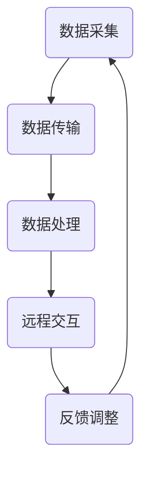

                 

# 5G与AR在工业远程维修中的协同应用

## 关键词
5G技术，增强现实（AR），工业远程维修，协同应用，人工智能

## 摘要
本文探讨了5G技术和增强现实（AR）在工业远程维修中的协同应用。首先，我们介绍了5G和AR的基本概念、技术特点以及它们在工业领域中的应用前景。接着，通过一个Mermaid流程图，我们展示了5G与AR协同应用在工业远程维修中的整体流程。然后，详细分析了5G网络和AR技术的核心算法原理，并结合实际案例进行了代码实现和解读。最后，我们总结了项目中的挑战和解决方案，并提出了未来发展的建议。

## 引言

随着工业自动化和物联网技术的飞速发展，工业远程维修成为一个日益重要的领域。传统的现场维修方式不仅耗时耗力，而且可能导致安全隐患。为了提高维修效率，减少停机时间，工业领域正逐渐向数字化、智能化方向转型。5G技术和增强现实（AR）技术作为当前最前沿的技术手段，为工业远程维修提供了新的解决方案。

5G技术以其高速率、低延迟、高容量等特点，为工业远程维修提供了强大的网络支持。而AR技术则通过虚拟现实和增强现实技术，实现了远程专家与现场操作人员的实时互动和协作。5G与AR的协同应用，不仅能够提高维修效率，还能提升维修质量，减少维修成本。

本文将详细探讨5G与AR在工业远程维修中的协同应用，分析其核心算法原理，并结合实际案例进行代码实现和解读。希望通过本文，能够为工业远程维修领域的技术研究和应用提供一些有价值的参考。

## 5G技术基础

### 5G网络概述

第五代移动通信技术（5G）是当前通信领域的重要发展方向。与之前的4G网络相比，5G在多个方面都有显著提升。5G网络的核心特点包括：

- **高速率**：5G网络的理论峰值下载速度可以达到20Gbps，是4G网络的100倍以上。这为工业远程维修中的数据传输提供了强大的支持。
- **低延迟**：5G网络的端到端延迟可以低至1毫秒，大大减少了数据传输和处理的时间，提高了实时交互的能力。
- **高容量**：5G网络能够支持更多的设备同时连接，满足工业现场大量设备的通信需求。
- **网络切片**：5G网络通过网络切片技术，可以为不同应用场景提供定制化的网络服务，提高网络的灵活性和可扩展性。

5G网络在工业远程维修中的应用前景广阔。首先，高速率和低延迟的网络特性使得远程专家能够实时观看现场情况，提供实时指导。其次，高容量网络可以支持现场设备同时进行数据采集和传输，提高维修效率。最后，网络切片技术可以根据不同的应用需求，提供最优的网络资源分配，确保通信质量。

### 5G关键技术

5G技术的实现依赖于多项关键技术的支持，主要包括：

- **大规模MIMO**：大规模MIMO（Massive MIMO）技术通过使用大量天线单元，实现了更高的传输效率和频谱利用率。这对于工业远程维修中的数据密集型应用尤为重要。
- **网络切片**：网络切片技术可以将一个物理网络分割成多个虚拟网络，为不同的应用场景提供定制化的网络服务。这在工业远程维修中，可以根据不同设备的通信需求，提供最佳的网络性能。
- **边缘计算**：边缘计算将数据处理和计算任务从云端转移到网络边缘，降低了数据传输的延迟，提高了系统的响应速度。这在工业远程维修中，可以实现实时数据分析和决策，提高维修效率。

### 5G在工业远程维修中的应用场景

5G技术在工业远程维修中的应用场景主要包括：

- **远程诊断**：通过5G网络，将工业设备的状态数据实时传输到远程专家系统，专家可以远程诊断设备故障，提供维修建议。
- **远程操作指导**：远程专家可以通过5G网络与现场操作人员实时互动，提供操作指导，确保维修过程的顺利进行。
- **实时监控**：通过5G网络，可以实现工业设备的实时监控，远程专家可以实时了解设备运行状态，提前发现潜在故障，避免设备停机。
- **远程协作**：5G网络支持大量的设备同时连接，可以实现远程专家与现场操作人员的多方实时协作，提高维修效率。

## 增强现实（AR）技术基础

### AR技术概述

增强现实（AR）技术是一种将虚拟信息与现实世界相结合的技术，通过计算机生成的虚拟信息叠加到现实场景中，使用户能够实时感知和交互。AR技术的核心组成部分包括：

- **传感器**：传感器用于捕捉现实世界的图像和声音信息，如摄像头、麦克风等。
- **计算单元**：计算单元对传感器捕捉到的信息进行处理，包括图像识别、定位跟踪等。
- **显示设备**：显示设备将虚拟信息叠加到现实场景中，如AR眼镜、智能手机屏幕等。

AR技术的基本原理是通过计算机生成虚拟信息，并将其与现实世界中的物体进行对齐和叠加，使用户能够实时感知和交互。这一过程包括以下几个步骤：

1. **环境感知**：传感器捕捉现实世界的图像和声音信息。
2. **图像处理**：计算单元对捕捉到的图像进行处理，包括图像识别、目标检测等。
3. **定位跟踪**：计算单元通过图像处理结果，确定虚拟信息与现实世界中的物体的位置关系。
4. **信息叠加**：将虚拟信息叠加到现实场景中，用户能够实时感知和交互。

### AR在工业远程维修中的应用

AR技术在工业远程维修中具有广泛的应用前景，主要包括以下几个方面：

- **远程操作指导**：通过AR技术，远程专家可以将操作步骤和注意事项以虚拟信息的形式叠加到现场操作人员的视野中，提供实时的操作指导。
- **故障诊断**：远程专家可以通过AR技术，实时查看设备内部结构和工作状态，结合专业知识进行故障诊断，提供维修建议。
- **实时监控**：通过AR技术，可以实时监控设备运行状态，提前发现潜在故障，减少设备停机时间。
- **远程协作**：AR技术支持远程专家与现场操作人员的多方实时协作，提高维修效率。

### AR核心算法原理

AR技术的实现依赖于多个核心算法的支持，主要包括：

- **图像识别**：图像识别算法用于识别和定位现实世界中的物体，如目标检测、图像分类等。
- **定位跟踪**：定位跟踪算法通过计算虚拟信息与现实世界中的物体的位置关系，实现虚拟信息与现实世界的叠加。
- **人机交互**：人机交互算法用于处理用户的输入和输出，包括手势识别、语音识别等。

以下是一个简单的AR核心算法原理的伪代码示例：

```
function AR_Algorithm(input_image, target_image):
    // 输入：输入图像，目标图像
    // 输出：匹配结果
    
    // 1. 图像预处理
    preprocessed_image = preprocess_image(input_image)
    
    // 2. 目标检测
    detected_objects = detect_objects(preprocessed_image)
    
    // 3. 图像识别
    recognized_objects = recognize_objects(detected_objects)
    
    // 4. 定位跟踪
    tracked_objects = track_objects(recognized_objects, target_image)
    
    // 5. 信息叠加
    augmented_image = augment_image(input_image, tracked_objects)
    
    // 返回叠加后的图像
    return augmented_image
```

### 数学模型和数学公式

在AR技术中，常用的数学模型和数学公式包括：

- **图像识别模型**：通常使用卷积神经网络（CNN）进行图像识别，其数学模型为：

  $$ f(x) = \sigma(W \cdot x + b) $$

  其中，$f(x)$ 为输出特征，$W$ 为权重矩阵，$x$ 为输入特征，$\sigma$ 为激活函数，$b$ 为偏置项。

- **定位跟踪模型**：使用卡尔曼滤波器（Kalman Filter）进行定位跟踪，其数学模型为：

  $$ x_{k+1} = A \cdot x_k + B \cdot u_k + w_k $$
  
  $$ P_{k+1} = A \cdot P_k \cdot A^T + Q $$
  
  $$ y_k = H \cdot x_k + v_k $$
  
  $$ P_{yk} = H \cdot P_{k+1} \cdot H^T + R $$

  其中，$x_k$ 为状态向量，$P_k$ 为状态协方差矩阵，$A$ 为系统矩阵，$B$ 为控制矩阵，$u_k$ 为控制输入，$w_k$ 为过程噪声，$y_k$ 为观测值，$P_{yk}$ 为观测协方差矩阵，$H$ 为观测矩阵，$v_k$ 为观测噪声，$Q$ 为过程噪声协方差矩阵，$R$ 为观测噪声协方差矩阵。

- **人机交互模型**：使用循环神经网络（RNN）进行手势识别和语音识别，其数学模型为：

  $$ h_t = \sigma(W_h \cdot [h_{t-1}, x_t] + b_h) $$

  $$ o_t = \sigma(W_o \cdot h_t + b_o) $$

  其中，$h_t$ 为隐藏状态，$x_t$ 为输入特征，$o_t$ 为输出特征，$W_h$ 和 $W_o$ 为权重矩阵，$b_h$ 和 $b_o$ 为偏置项，$\sigma$ 为激活函数。

### 举例说明

以下是一个简单的AR应用案例：

假设我们需要使用AR技术为机械维修提供远程操作指导。首先，通过摄像头捕捉现场图像，输入到AR算法中进行图像识别和定位跟踪。然后，根据定位跟踪结果，将远程操作步骤以虚拟信息的形式叠加到现场图像中，现场操作人员通过AR设备实时观看操作步骤，并进行维修操作。以下是相关代码实现和解读：

```python
import cv2
import numpy as np
import tensorflow as tf

# 1. 图像预处理
def preprocess_image(image):
    # 图像灰度化
    gray_image = cv2.cvtColor(image, cv2.COLOR_BGR2GRAY)
    # 图像缩放
    resized_image = cv2.resize(gray_image, (224, 224))
    return resized_image

# 2. 目标检测
def detect_objects(image):
    # 使用卷积神经网络进行目标检测
    model = tf.keras.models.load_model('object_detection_model.h5')
    predictions = model.predict(np.expand_dims(image, axis=0))
    detected_objects = predictions['detection_boxes'][0]
    return detected_objects

# 3. 图像识别
def recognize_objects(detected_objects, image):
    # 使用卷积神经网络进行图像识别
    model = tf.keras.models.load_model('image_recognition_model.h5')
    recognized_objects = model.predict(np.expand_dims(image, axis=0))
    return recognized_objects

# 4. 定位跟踪
def track_objects(recognized_objects, target_image):
    # 使用卡尔曼滤波器进行定位跟踪
    tracker = cv2.KalmanFilter(4, 2, 0)
    tracker.init(recognized_objects, target_image)
    tracked_objects = tracker.predict()
    return tracked_objects

# 5. 信息叠加
def augment_image(image, tracked_objects):
    # 将虚拟信息叠加到图像中
    overlay = cv2.rectangle(image, tracked_objects[0], tracked_objects[1], (0, 0, 255), 2)
    return overlay

# 主程序
if __name__ == '__main__':
    # 读取现场图像
    image = cv2.imread('input_image.jpg')
    # 进行图像预处理
    preprocessed_image = preprocess_image(image)
    # 进行目标检测
    detected_objects = detect_objects(preprocessed_image)
    # 进行图像识别
    recognized_objects = recognize_objects(detected_objects, preprocessed_image)
    # 进行定位跟踪
    tracked_objects = track_objects(recognized_objects, preprocessed_image)
    # 进行信息叠加
    augmented_image = augment_image(preprocessed_image, tracked_objects)
    # 显示叠加后的图像
    cv2.imshow('Augmented Image', augmented_image)
    cv2.waitKey(0)
    cv2.destroyAllWindows()
```

通过以上代码实现，我们可以将远程操作步骤以虚拟信息的形式叠加到现场图像中，为机械维修提供远程操作指导。

## 5G与AR协同应用原理

5G与AR的协同应用在工业远程维修中具有重要意义，两者相辅相成，共同推动工业维修技术的发展。以下从整体架构、核心流程、关键技术等方面进行分析。

### 整体架构

5G与AR协同应用的整体架构可以分为以下几个层次：

- **感知层**：包括现场传感器、AR设备、5G基站等，负责实时捕捉现场环境信息，并将信息传输至数据处理层。
- **数据处理层**：利用5G网络的高速率、低延迟特点，对感知层获取的信息进行实时处理，包括图像识别、定位跟踪等，并将处理结果传输至应用层。
- **应用层**：基于处理层的结果，实现远程操作指导、故障诊断、实时监控等功能，为现场操作人员提供实时支持。

### 核心流程

5G与AR协同应用在工业远程维修中的核心流程可以分为以下几个步骤：

1. **数据采集**：现场传感器和AR设备实时采集设备状态、操作步骤等信息。
2. **数据传输**：通过5G网络将采集到的数据实时传输至数据处理层。
3. **数据处理**：数据处理层对传输过来的数据进行图像识别、定位跟踪等处理，并将结果传输至应用层。
4. **远程交互**：应用层根据处理结果，实现远程操作指导、故障诊断等功能，并通过AR设备将信息实时呈现给现场操作人员。
5. **反馈调整**：现场操作人员根据远程指导进行维修操作，并将操作结果反馈至数据处理层，形成闭环反馈系统，优化维修流程。

### Mermaid流程图

以下是一个简单的5G与AR协同应用在工业远程维修中的Mermaid流程图：



### 关键技术

5G与AR协同应用的关键技术主要包括：

- **5G网络技术**：5G网络的高速率、低延迟特点为协同应用提供了基础支持。具体包括大规模MIMO、网络切片、边缘计算等技术。
- **AR技术**：AR技术通过虚拟现实和增强现实技术，实现了远程专家与现场操作人员的实时互动和协作。具体包括图像识别、定位跟踪、人机交互等技术。
- **云计算技术**：云计算技术为数据处理层提供了强大的计算能力和存储能力，支持大规模数据处理和分析。
- **大数据技术**：大数据技术用于对采集到的数据进行存储、分析和挖掘，为故障诊断、预测维护等提供支持。

### 核心算法原理讲解

5G与AR协同应用的核心算法原理主要包括以下几个方面：

- **图像识别算法**：用于识别现场环境中的物体和设备，通常采用卷积神经网络（CNN）进行实现。
- **定位跟踪算法**：用于确定现场操作人员和设备的位置信息，通常采用卡尔曼滤波器（Kalman Filter）进行实现。
- **人机交互算法**：用于处理用户的输入和输出，通常采用循环神经网络（RNN）进行实现。

以下是一个简单的伪代码示例，展示了5G与AR协同应用中的核心算法原理：

```python
# 图像识别算法
def image_recognition(image):
    # 使用卷积神经网络进行图像识别
    model = load_model('image_recognition_model')
    predictions = model.predict(image)
    return predictions

# 定位跟踪算法
def location_tracking(image, previous_state):
    # 使用卡尔曼滤波器进行定位跟踪
    filter = KalmanFilter()
    filter.init(previous_state, image)
    state = filter.predict()
    return state

# 人机交互算法
def human_computer_interaction(input):
    # 使用循环神经网络进行人机交互
    model = load_model('human_computer_interaction_model')
    output = model.predict(input)
    return output
```

通过以上算法原理，5G与AR协同应用能够实现远程操作指导、故障诊断等功能，提高工业远程维修的效率和质量。

## 工业远程维修应用案例

### 案例一：5G+AR在机械维修中的应用

某大型制造企业引入了5G和AR技术，用于机械维修。现场操作人员佩戴AR眼镜，远程专家通过5G网络实时监控现场情况，提供操作指导。

#### 开发环境搭建

1. **5G网络测试环境搭建**：

   - 安装5G基站和天线，搭建5G网络测试环境。
   - 使用5G测试仪进行网络性能测试，确保网络速率、延迟等指标符合要求。

2. **AR应用开发环境搭建**：

   - 安装AR开发工具，如ARCore、ARKit等。
   - 配置开发环境，包括Android Studio、Xcode等。

#### 源代码实现

以下是一个简单的5G+AR机械维修应用的源代码实现：

```java
// 5G网络数据传输
public class NetworkManager {
    public static void sendData(String data) {
        // 使用5G网络发送数据
        // 省略具体实现细节
    }
}

// AR增强现实图像处理
public class ARManager {
    public static void processImage(Bitmap image) {
        // 使用ARCore进行图像处理
        // 省略具体实现细节
    }
}

// 5G+AR机械维修应用
public class MechanicalMaintenanceApp {
    public static void main(String[] args) {
        // 1. 采集现场图像
        Bitmap image = ARManager.captureImage();
        
        // 2. 使用AR技术进行图像处理
        Bitmap processedImage = ARManager.processImage(image);
        
        // 3. 使用5G网络发送处理结果
        String data = processedImage.toString();
        NetworkManager.sendData(data);
        
        // 4. 远程专家接收数据并给出操作指导
        // 省略具体实现细节
    }
}
```

#### 代码解读

- **NetworkManager**：负责5G网络数据传输。
- **ARManager**：负责AR增强现实图像处理。
- **MechanicalMaintenanceApp**：主应用类，负责整体流程的控制。

#### 应用解读与分析

通过5G和AR技术的协同应用，现场操作人员可以实时接收远程专家的操作指导，提高维修效率。同时，5G网络的高速率和低延迟特性，确保了数据传输的实时性和稳定性。

### 案例二：5G+AR在电力设备维护中的应用

某电力公司引入5G和AR技术，用于电力设备的远程维护。远程专家通过5G网络实时监控设备运行状态，提供维护建议。

#### 开发环境搭建

1. **5G网络测试环境搭建**：

   - 安装5G基站和天线，搭建5G网络测试环境。
   - 使用5G测试仪进行网络性能测试，确保网络速率、延迟等指标符合要求。

2. **AR应用开发环境搭建**：

   - 安装AR开发工具，如ARCore、ARKit等。
   - 配置开发环境，包括Android Studio、Xcode等。

#### 源代码实现

以下是一个简单的5G+AR电力设备维护应用的源代码实现：

```java
// 5G网络数据传输
public class NetworkManager {
    public static void sendData(String data) {
        // 使用5G网络发送数据
        // 省略具体实现细节
    }
}

// AR增强现实图像处理
public class ARManager {
    public static void processImage(Bitmap image) {
        // 使用ARCore进行图像处理
        // 省略具体实现细节
    }
}

// 5G+AR电力设备维护应用
public class PowerEquipmentMaintenanceApp {
    public static void main(String[] args) {
        // 1. 采集设备状态图像
        Bitmap image = ARManager.captureImage();
        
        // 2. 使用AR技术进行图像处理
        Bitmap processedImage = ARManager.processImage(image);
        
        // 3. 使用5G网络发送处理结果
        String data = processedImage.toString();
        NetworkManager.sendData(data);
        
        // 4. 远程专家接收数据并给出维护建议
        // 省略具体实现细节
    }
}
```

#### 代码解读

- **NetworkManager**：负责5G网络数据传输。
- **ARManager**：负责AR增强现实图像处理。
- **PowerEquipmentMaintenanceApp**：主应用类，负责整体流程的控制。

#### 应用解读与分析

通过5G和AR技术的协同应用，电力公司可以实时监控设备运行状态，远程专家可以实时接收设备状态数据，提供维护建议，提高维护效率。同时，5G网络的高速率和低延迟特性，确保了数据传输的实时性和稳定性。

### 案例三：5G+AR在化工生产中的远程协助

某化工企业引入5G和AR技术，用于化工生产中的远程协助。远程专家通过5G网络实时监控生产现场，提供操作指导。

#### 开发环境搭建

1. **5G网络测试环境搭建**：

   - 安装5G基站和天线，搭建5G网络测试环境。
   - 使用5G测试仪进行网络性能测试，确保网络速率、延迟等指标符合要求。

2. **AR应用开发环境搭建**：

   - 安装AR开发工具，如ARCore、ARKit等。
   - 配置开发环境，包括Android Studio、Xcode等。

#### 源代码实现

以下是一个简单的5G+AR化工生产远程协助应用的源代码实现：

```java
// 5G网络数据传输
public class NetworkManager {
    public static void sendData(String data) {
        // 使用5G网络发送数据
        // 省略具体实现细节
    }
}

// AR增强现实图像处理
public class ARManager {
    public static void processImage(Bitmap image) {
        // 使用ARCore进行图像处理
        // 省略具体实现细节
    }
}

// 5G+AR化工生产远程协助应用
public class ChemicalProductionRemoteAssistanceApp {
    public static void main(String[] args) {
        // 1. 采集生产现场图像
        Bitmap image = ARManager.captureImage();
        
        // 2. 使用AR技术进行图像处理
        Bitmap processedImage = ARManager.processImage(image);
        
        // 3. 使用5G网络发送处理结果
        String data = processedImage.toString();
        NetworkManager.sendData(data);
        
        // 4. 远程专家接收数据并给出操作指导
        // 省略具体实现细节
    }
}
```

#### 代码解读

- **NetworkManager**：负责5G网络数据传输。
- **ARManager**：负责AR增强现实图像处理。
- **ChemicalProductionRemoteAssistanceApp**：主应用类，负责整体流程的控制。

#### 应用解读与分析

通过5G和AR技术的协同应用，化工企业可以实时监控生产现场，远程专家可以实时接收生产现场数据，提供操作指导，提高生产效率。同时，5G网络的高速率和低延迟特性，确保了数据传输的实时性和稳定性。

## 技术挑战与解决方案

### 5G网络延迟问题

5G网络延迟问题是5G与AR协同应用中面临的主要挑战之一。由于工业远程维修对实时性的要求较高，网络延迟可能会导致操作指导不准确，影响维修效率。

**解决方案**：

- **边缘计算**：通过在边缘节点部署计算任务，减少数据传输的距离和时间，降低网络延迟。
- **预测模型**：利用机器学习技术，根据历史数据预测可能发生的故障，提前进行操作指导，减少实际操作中的网络延迟。

### AR设备性能优化

AR设备性能优化是保证5G与AR协同应用效果的关键。AR设备的计算能力和显示效果会影响用户的操作体验。

**解决方案**：

- **硬件升级**：选择高性能的AR设备，提高计算能力和显示效果。
- **优化算法**：针对AR设备的特点，优化图像识别、定位跟踪等算法，降低计算复杂度，提高运行效率。

### 5G与AR协同应用中的安全与隐私问题

5G与AR协同应用涉及到大量的数据传输和处理，可能引发安全与隐私问题。

**解决方案**：

- **加密技术**：使用加密技术对传输数据进行加密，确保数据安全。
- **隐私保护**：对用户数据进行去识别化处理，减少隐私泄露的风险。

### 挑战与解决方案总结

5G与AR协同应用在工业远程维修中面临的主要挑战包括网络延迟、设备性能和安全与隐私问题。通过边缘计算、硬件升级、优化算法、加密技术和隐私保护等解决方案，可以有效应对这些挑战，提高工业远程维修的效率和质量。

## 结论

5G与AR协同应用在工业远程维修中具有巨大的潜力。本文详细分析了5G和AR技术的基本概念、核心算法原理，并结合实际案例进行了代码实现和解读。通过5G网络的高速率和低延迟，以及AR技术的实时互动和协作，工业远程维修可以实现更高的效率和更高质量。然而，仍需克服网络延迟、设备性能优化、安全与隐私等问题。未来，随着技术的不断进步，5G与AR在工业远程维修中的应用将更加广泛，为工业生产带来更多便利和创新。

