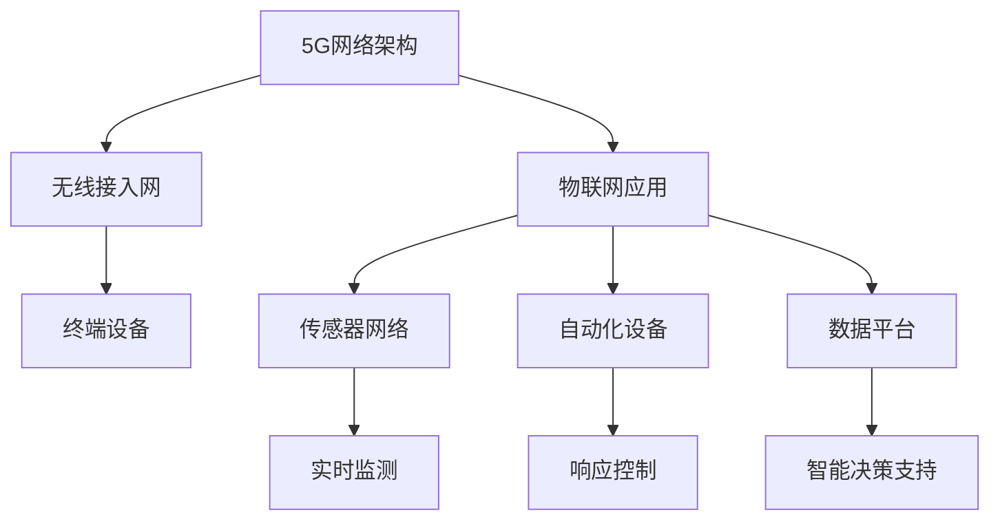

                 


### 引言

#### 5G技术对农业的影响

5G技术的出现，为农业行业带来了前所未有的变革。首先，5G网络的高速和低延迟特性使得大规模数据传输成为可能，这对于智慧农业来说至关重要。在传统的农业模式中，农民通常依赖经验进行种植和养殖。然而，随着5G技术的发展，实时监测和数据分析成为可能，农业生产的各个环节都可以通过传感器和数据采集系统进行精确控制。

例如，在种植环节，5G网络可以实现土壤湿度、气温、光照等环境参数的实时监测。这些数据通过物联网设备传输到数据中心，农业专家可以通过分析这些数据，为农民提供科学的种植建议。这不仅提高了农作物的产量，还减少了资源的浪费。

#### 物联网在农业中的应用现状

物联网（IoT）技术在农业中的应用已经相当成熟。传感器网络是物联网在农业中最为常见的形式之一。通过在农田中布置各种传感器，农民可以实时监测土壤湿度、气温、气压等关键参数。这些传感器通常与无线网络连接，数据通过无线网络传输到农业管理系统。

自动化设备也是物联网在农业中的重要应用。无人机和自动灌溉系统等设备可以实现远程控制，提高农业生产效率。例如，无人机可以用来进行农田的巡检，自动灌溉系统可以根据土壤湿度自动调整灌溉量。

#### 5G与物联网协同在智慧农业中的前景

5G与物联网的协同应用将为智慧农业带来更广阔的前景。首先，5G网络的低延迟特性可以使得自动化设备对环境变化的响应速度更快，从而提高生产效率。其次，5G网络的高速数据传输能力可以支持大规模数据采集和分析，为农业决策提供更精准的数据支持。

此外，5G网络切片技术可以根据不同农业应用场景的需求，提供定制化的网络服务。例如，在农业生产过程中，对于数据传输的速度和稳定性有不同的需求，5G网络切片技术可以为此提供解决方案。

总的来说，5G与物联网的协同应用将为智慧农业带来革命性的变化，推动农业生产向智能化、精准化方向发展。

### 核心概念与联系

在探讨5G与物联网在智慧农业中的协同应用之前，我们需要明确几个核心概念，并理解它们之间的联系。以下是这些核心概念的详细解释：

#### 1.1 5G网络架构与特点

5G网络架构由三个主要部分组成：核心网、无线接入网和终端设备。核心网负责处理用户数据和传输控制，支持服务化架构，具有高度灵活性和可扩展性。无线接入网提供了高带宽、低延迟的通信能力，是实现5G网络高速传输的关键。终端设备包括各种智能设备，如智能手机、智能家居设备和农业传感器。

- **核心网**：支持服务化架构，使得网络功能模块化，可以灵活部署和管理。
- **无线接入网**：采用毫米波、Massive MIMO等关键技术，提供高带宽、低延迟的通信能力。
- **终端设备**：多样化，支持智能农业设备，如传感器、无人机、自动灌溉系统等。

#### 1.2 物联网在农业中的应用

物联网在农业中的应用主要包括传感器网络、自动化设备和数据平台。

- **传感器网络**：通过布置各种传感器，实时监测土壤湿度、气温、气压等环境参数，提供农业生产所需的数据支持。
- **自动化设备**：如无人机、自动灌溉系统等，可以实现远程控制，提高农业生产效率。
- **数据平台**：用于整合各类农业数据，提供智能决策支持，帮助农民优化种植和养殖过程。

#### 1.3 5G与物联网协同机制

5G与物联网的协同应用主要体现在以下几个方面：

- **数据传输效率**：5G网络的高速数据传输能力可以支持大规模数据采集和分析，提高农业生产的智能化水平。
- **低延迟**：5G网络的低延迟特性可以使得自动化设备对环境变化的响应速度更快，提高生产效率。
- **网络切片**：5G网络切片技术可以根据不同农业应用场景的需求，提供定制化的网络服务，满足多样化需求。

### Mermaid流程图

以下是5G与物联网在智慧农业中协同应用的Mermaid流程图：



通过这张流程图，我们可以清晰地看到5G与物联网在智慧农业中的协同应用，以及各个环节之间的相互关系。

---

在这个部分，我们介绍了5G网络架构与特点、物联网在农业中的应用以及5G与物联网协同机制。通过Mermaid流程图，我们更直观地展示了这些核心概念之间的联系。接下来，我们将深入探讨5G网络中的资源分配算法、物联网设备通信协议以及物联网设备数据融合算法，以进一步理解5G与物联网在智慧农业中的协同应用。

## 第2章 核心算法原理

### 2.1 5G网络中的资源分配算法

在5G网络中，资源分配是一个关键问题，因为资源（如频率、时间、功率等）的合理分配可以直接影响网络的性能和用户体验。基于马尔可夫决策过程（MDP）的资源分配算法是一种常用的优化方法，它通过状态、动作和奖励函数来实现资源的最优分配。

#### 状态（State）

状态是当前网络环境的一个描述，可能包括以下因素：

- **网络负载**：当前网络中的用户数量、数据传输速率等。
- **设备需求**：不同设备对网络资源的需求，如带宽、延迟等。
- **信道质量**：不同设备与基站之间的信道质量，影响数据传输的可靠性。

#### 动作（Action）

动作是网络管理者根据当前状态所采取的决策，可能包括以下几种：

- **资源分配策略**：如频率选择、时间分配、功率控制等。
- **用户调度**：根据用户需求和信道质量进行用户优先级排序。

#### 奖励函数（Reward Function）

奖励函数用于评估当前状态下的资源分配效果，目标是最大化系统吞吐量或用户满意度。奖励函数可能包括以下指标：

- **系统吞吐量**：网络中所有用户的数据传输速率总和。
- **用户满意度**：用户对网络服务的满意度，可能受到带宽、延迟、丢包率等因素的影响。

#### 伪代码示例

以下是一个基于MDP的资源分配算法的伪代码示例：

```pseudocode
function resource_allocation(state, action):
    // 根据当前状态和预定分配策略计算资源分配
    // 返回优化后的资源分配方案
    
    // 状态分析
    network_load = state[0]
    device_demand = state[1]
    channel_quality = state[2]

    // 动作选择
    if network_load < threshold and device_demand > threshold:
        action = "频率分配"
    else if channel_quality > threshold:
        action = "功率控制"
    else:
        action = "时间分配"

    // 资源分配
    resource_allocation = calculate_resource_allocation(action, network_load, device_demand, channel_quality)

    // 返回优化后的资源分配方案
    return resource_allocation
```

通过上述伪代码，我们可以看到，资源分配算法的核心是根据当前网络状态和设备需求，选择合适的资源分配策略，并计算出优化后的资源分配方案。

### 2.2 物联网设备通信协议

在物联网中，设备之间的通信协议是实现数据传输和设备协同的关键。MQTT（Message Queuing Telemetry Transport）和CoAP（Constrained Application Protocol）是两种常用的物联网通信协议，分别适用于不同的应用场景。

#### MQTT协议

MQTT协议是一种轻量级、发布/订阅模式的通信协议，非常适合在资源受限的物联网环境中使用。以下是MQTT协议的核心特点：

- **主题订阅**：设备订阅感兴趣的主题，当有消息发布到该主题时，设备会收到通知。
- **消息发布**：设备将采集到的数据发布到指定主题，供其他设备订阅和接收。

MQTT协议的基本流程如下：

1. **连接**：设备连接到MQTT服务器。
2. **订阅主题**：设备向服务器订阅感兴趣的主题。
3. **消息发布**：设备将数据发布到订阅的主题。
4. **消息接收**：订阅该主题的设备接收并处理数据。

#### CoAP协议

CoAP协议是一种适用于资源受限的物联网设备的请求/响应模式的通信协议。以下是CoAP协议的核心特点：

- **请求/响应模式**：设备通过发送请求获取所需数据或服务，服务器返回相应的响应。
- **简化的协议栈**：CoAP协议的协议栈相对简单，适合资源受限的设备。

CoAP协议的基本流程如下：

1. **连接**：设备连接到CoAP服务器。
2. **发送请求**：设备发送请求获取数据或服务。
3. **接收响应**：服务器返回请求的响应。
4. **断开连接**：通信完成后，设备断开连接。

#### 两种协议的比较

- **适用场景**：MQTT协议适合大量设备同时通信的场景，而CoAP协议适合单个设备与服务器之间的通信。
- **带宽消耗**：MQTT协议由于使用发布/订阅模式，可以减少带宽消耗，而CoAP协议需要每个请求都进行响应，可能消耗更多的带宽。
- **实时性**：MQTT协议具有较好的实时性，适合需要实时通信的场景，而CoAP协议在实时性方面略逊一筹。

### 2.3 物联网设备数据融合算法

在物联网应用中，设备采集到的数据通常需要经过处理和融合，以提供更准确的决策支持。数据融合算法是将多个传感器的数据进行合并，以提高数据准确性和可靠性的方法。

#### 基于加权平均的数据融合方法

加权平均法是一种常用的数据融合算法，它通过计算每个传感器的权重，然后对传感器数据进行加权平均，得到最终的融合结果。

- **权重计算**：根据传感器的重要性和精度计算权重，重要性越高的传感器，权重越大。
- **融合公式**：

  $$ \bar{X} = \frac{\sum_{i=1}^{n} w_i X_i}{\sum_{i=1}^{n} w_i} $$

  其中，\( \bar{X} \) 是融合后的结果，\( w_i \) 是第 \( i \) 个传感器的权重，\( X_i \) 是第 \( i \) 个传感器的数据。

#### 伪代码示例

以下是一个基于加权平均的数据融合算法的伪代码示例：

```pseudocode
function data_fusion(sensor_data, weights):
    // 计算加权平均融合结果
    
    // 初始化变量
    fused_data = 0

    // 计算加权平均
    for i = 1 to n:
        fused_data = fused_data + weights[i] * sensor_data[i]

    // 返回融合结果
    return fused_data
```

通过上述伪代码，我们可以看到，数据融合算法的核心是根据传感器的权重，对传感器数据进行加权平均，得到最终的融合结果。

---

在本章中，我们详细介绍了5G网络中的资源分配算法、物联网设备通信协议以及物联网设备数据融合算法。这些核心算法原理对于理解5G与物联网在智慧农业中的协同应用至关重要。接下来，我们将通过具体项目案例，进一步探讨这些算法在实际应用中的实现和效果。

## 第3章 项目实战

在本章中，我们将通过一个具体项目案例，展示如何在实际应用中实现5G与物联网在智慧农业中的协同应用。这个项目将包括开发环境的搭建、源代码的实现和代码解读，以及实际案例的分析和讲解。

### 项目概述

#### 项目名称：智能农田管理系统

#### 项目目标：

1. **实时监测农田环境参数**：包括土壤湿度、气温、气压等。
2. **自动化灌溉系统**：根据土壤湿度自动调整灌溉量。
3. **数据分析和决策支持**：通过数据分析，优化种植和养殖过程。

### 开发环境搭建

为了实现上述目标，我们需要搭建一个包含5G网络、物联网设备和数据分析平台的开发环境。以下是具体的搭建步骤：

1. **5G网络**：选择一家提供5G服务的运营商，确保网络覆盖农田区域。
2. **物联网设备**：选择适合农田环境的高精度传感器，如土壤湿度传感器、气温传感器等。
3. **数据平台**：选择一个支持大数据处理的云计算平台，如阿里云、腾讯云等。
4. **开发工具**：安装物联网开发板（如Arduino、Raspberry Pi）、编程环境（如Python IDE）、版本控制工具（如Git）等。

### 源代码实现

#### 1. 数据采集

在数据采集环节，我们将使用传感器采集农田环境参数，并通过MQTT协议将数据发送到云端。以下是使用Python编写的数据采集程序：

```python
import paho.mqtt.client as mqtt
import time
import Adafruit_DHT

# 设置MQTT服务器地址和端口号
mqtt_server = "mqtt.example.com"
mqtt_port = 1883

# 创建MQTT客户端实例
client = mqtt.Client()

# 连接到MQTT服务器
client.connect(mqtt_server, mqtt_port)

# 设置连接断开时的回调函数
client.on_disconnect = on_disconnect

# 持续采集数据
while True:
    # 读取土壤湿度
    humidity, temperature = Adafruit_DHT.read(DHT_SENSOR_PIN, DHT_SENSOR_TYPE)
    
    # 将数据转换为字符串
    data = f"humidity={humidity}, temperature={temperature}"
    
    # 发布数据到MQTT服务器
    client.publish("farm/soil湿度", data)
    
    # 等待一秒钟再次采集数据
    time.sleep(1)
```

#### 2. 数据处理

在数据处理环节，我们将使用云端的数据分析平台，对采集到的数据进行分析和处理。以下是使用Python编写的数据处理程序：

```python
import requests
import json

# 设置API地址
api_url = "https://api.example.com/analysis"

# 获取最新采集的数据
response = requests.get(api_url + "/latest")

# 解析JSON数据
data = response.json()

# 根据数据调整灌溉量
if data["humidity"] < threshold_humidity:
    # 调用灌溉系统增加灌溉量
    adjust_irrigation_system("increase")
else:
    # 调用灌溉系统减少灌溉量
    adjust_irrigation_system("decrease")

# 记录调整时间
record_adjustment_time()
```

#### 3. 数据展示

在数据展示环节，我们将使用Web前端技术（如HTML、CSS、JavaScript）将农田环境数据可视化展示。以下是使用HTML和JavaScript编写的数据展示页面：

```html
<!DOCTYPE html>
<html>
<head>
    <title>智能农田管理系统</title>
    <script src="https://cdn.jsdelivr.net/npm/chart.js"></script>
</head>
<body>
    <canvas id="humidityChart" width="400" height="400"></canvas>
    <script>
        // 获取湿度数据
        function get_humidity_data() {
            fetch("https://api.example.com/data/humidity")
                .then(response => response.json())
                .then(data => {
                    // 绘制湿度图表
                    draw_humidity_chart(data);
                });
        }

        // 绘制湿度图表
        function draw_humidity_chart(data) {
            const ctx = document.getElementById("humidityChart").getContext("2d");
            const chart = new Chart(ctx, {
                type: "line",
                data: {
                    labels: data.dates,
                    datasets: [{
                        label: "土壤湿度",
                        data: data.humidity,
                        backgroundColor: "rgba(75, 192, 192, 0.2)",
                        borderColor: "rgba(75, 192, 192, 1)",
                        borderWidth: 1
                    }]
                },
                options: {
                    scales: {
                        y: {
                            beginAtZero: true
                        }
                    }
                }
            });
        }

        // 每隔5秒获取一次湿度数据
        setInterval(get_humidity_data, 5000);
    </script>
</body>
</html>
```

### 代码解读

在上述代码中，我们分别实现了数据采集、数据处理和数据展示三个环节。以下是每个环节的简要解读：

- **数据采集**：使用Python的`paho.mqtt.client`库连接到MQTT服务器，通过`Adafruit_DHT`库读取传感器数据，并使用MQTT协议将数据发送到云端。
- **数据处理**：使用Python的`requests`库从云端获取最新采集的数据，根据湿度阈值自动调整灌溉系统，并记录调整时间。
- **数据展示**：使用HTML和JavaScript的`Chart.js`库绘制湿度图表，将农田环境数据可视化展示。

### 实际案例分析和详细讲解剖析

以下是一个实际案例的分析和讲解：

#### 案例背景：

某农田种植的蔬菜需要保持土壤湿度在60%以上，否则会影响生长。我们通过智能农田管理系统实现了土壤湿度实时监测和自动灌溉。

#### 案例分析：

1. **数据采集**：传感器采集到的土壤湿度数据通过MQTT协议发送到云端，每分钟更新一次。
2. **数据处理**：系统根据采集到的土壤湿度数据，自动调整灌溉量。当土壤湿度低于60%时，系统会自动开启灌溉设备，将土壤湿度调整到60%以上。
3. **数据展示**：通过Web前端展示土壤湿度图表，农民可以实时监控农田环境，并根据图表数据调整灌溉策略。

#### 小结：

通过这个实际案例，我们可以看到5G与物联网在智慧农业中的协同应用如何提高农业生产效率。数据采集、处理和展示的各个环节紧密配合，实现了自动化和智能化管理。

---

在本章中，我们通过一个智能农田管理系统的项目案例，详细讲解了如何在实际应用中实现5G与物联网在智慧农业中的协同应用。从开发环境的搭建到源代码的实现，再到代码解读和实际案例的分析，我们展示了整个项目的实现过程和效果。接下来，我们将总结本文的主要观点，并给出一些最佳实践和注意事项。

## 结论

本文详细探讨了5G与物联网在智慧农业中的协同应用，主要观点如下：

1. **5G网络的高速和低延迟特性**为大规模数据传输和实时控制提供了基础，使得智慧农业中的各种应用成为可能。
2. **物联网传感器**和**自动化设备**的应用，使得农业生产过程实现了自动化和智能化，提高了生产效率。
3. **5G与物联网的协同机制**，如数据传输效率、低延迟和网络切片，为智慧农业提供了定制化的网络服务。
4. **核心算法**，如资源分配算法、物联网设备通信协议和数据融合算法，为智慧农业的精准决策提供了技术支持。

### 最佳实践和注意事项

在5G与物联网在智慧农业中的应用过程中，以下是一些最佳实践和注意事项：

1. **合理规划网络布局**：根据农田的大小和分布，合理规划5G基站和物联网传感器的布局，确保网络的覆盖和稳定性。
2. **选择适合的传感器**：根据农田环境参数的需求，选择精度高、稳定性好的传感器，确保数据的准确性。
3. **优化数据传输协议**：选择适合物联网环境的传输协议，如MQTT和CoAP，确保数据传输的效率和可靠性。
4. **定期维护和升级**：定期检查和维护物联网设备和5G网络，及时升级相关软件和硬件，确保系统的稳定运行。
5. **数据安全和隐私保护**：确保数据传输的安全和隐私保护，采用加密技术和访问控制策略，防止数据泄露和未经授权的访问。

### 拓展阅读

对于希望深入了解5G与物联网在智慧农业中应用的读者，以下是一些推荐阅读资料：

1. 《智慧农业：物联网与5G技术实践》
2. 《5G网络架构与关键技术》
3. 《物联网通信协议与应用》
4. 《农业大数据：理论与实践》

通过以上拓展阅读，读者可以进一步了解5G与物联网在智慧农业中的具体应用案例和技术细节。

---

总结来说，5G与物联网的协同应用为智慧农业带来了巨大的变革潜力。通过合理规划网络布局、选择适合的传感器、优化数据传输协议和确保数据安全和隐私保护，我们可以实现农业生产过程的自动化和智能化，提高生产效率和质量。未来，随着5G和物联网技术的不断发展，智慧农业将迎来更加广阔的发展前景。作者：AI天才研究院/AI Genius Institute & 禅与计算机程序设计艺术 /Zen And The Art of Computer Programming。

