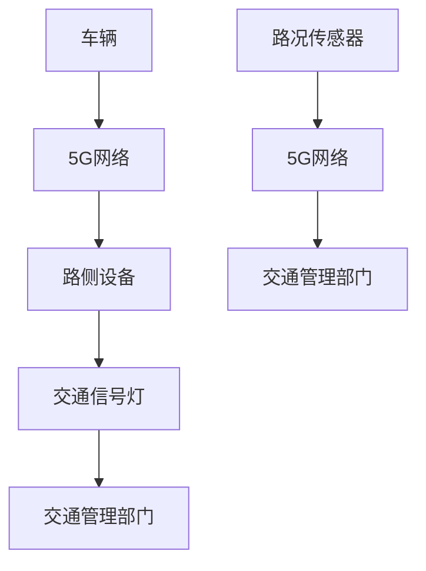
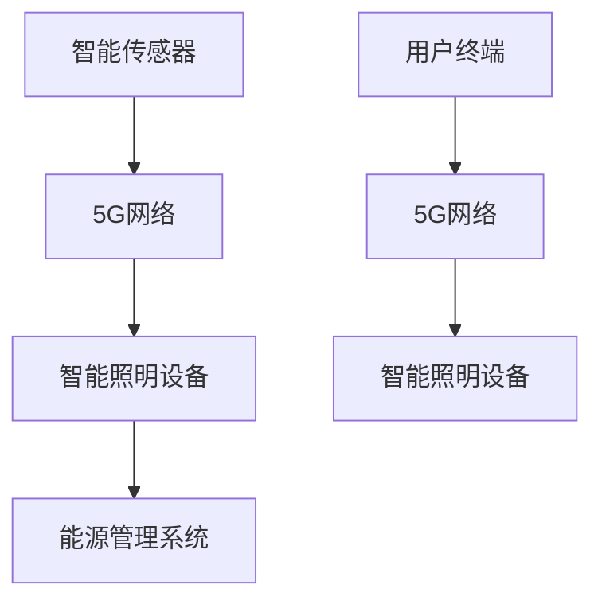
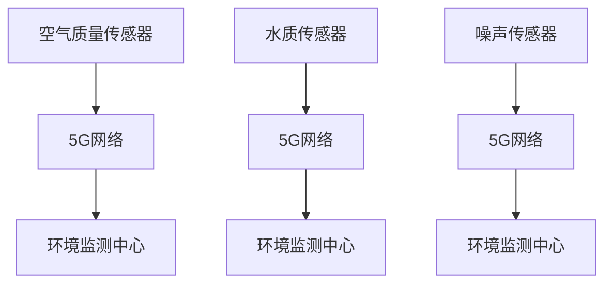
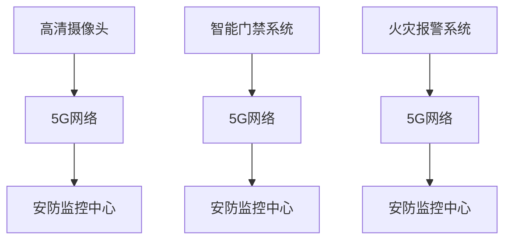
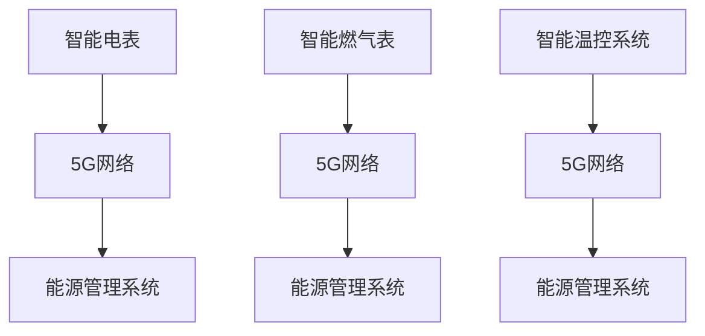

                 

### 第1章: 引言

#### 1.1 书籍背景和目标读者

在当今全球数字化转型的浪潮中，5G和物联网（IoT）技术成为推动智慧城市建设的关键驱动力。本书旨在为从事5G与物联网领域的技术人员、研究人员以及有志于了解智慧城市基础设施建设的读者提供一本全面的指南。通过深入探讨5G和物联网技术的原理、应用以及融合创新，本书旨在帮助读者理解这些前沿技术在智慧城市中的实际应用和潜在价值。

#### 1.2 智慧城市基础设施的现状与发展

智慧城市基础设施是指利用信息技术、物联网、大数据和人工智能等先进技术，对城市资源、环境和公共服务进行智能化管理和优化的一系列设施和系统。当前，全球智慧城市建设呈现出快速发展态势。许多国家和地区已经开始构建智能交通系统、智能照明系统、智能环境监测系统等，以提升城市运行效率、改善居民生活质量。

然而，智慧城市基础设施的建设仍面临诸多挑战。首先，技术成熟度和标准化水平有待提高，特别是5G和物联网技术的应用需要更加完善和稳定。其次，数据隐私和安全问题日益突出，如何在确保数据安全和隐私的前提下，实现数据的充分利用和共享，成为智慧城市建设的重要课题。此外，智慧城市基础设施的建设需要大规模投资和跨部门协作，这对政府的决策能力和管理水平提出了更高要求。

#### 1.3 5G与物联网在智慧城市中的应用

5G和物联网技术在智慧城市中的应用具有重要意义。5G网络的高带宽、低延迟和大连接特性，为物联网设备提供了高速、稳定和可靠的连接支持，使得大规模物联网设备的部署成为可能。物联网技术则通过感知、传输和处理各类数据，为智慧城市建设提供了丰富的数据资源和智能化的管理手段。

具体来说，5G和物联网在智慧城市中的应用包括以下几个方面：

1. **智能交通管理**：利用5G网络和物联网技术，实现车辆与路侧设备、交通信号灯等的实时通信，提高交通流量控制效率和道路安全性。

2. **智能照明系统**：通过物联网技术实现照明设备的智能监控和管理，根据环境亮度和人流量自动调节灯光亮度，实现节能和舒适照明。

3. **智能环境监测**：利用物联网传感器和5G网络，实时监测空气质量、水质、噪声等环境参数，为城市环境治理提供数据支持。

4. **智能安防系统**：通过物联网技术实现视频监控、门禁控制、火灾报警等安防设备的智能化管理，提高城市安全防范能力。

5. **城市能源管理**：利用5G和物联网技术，实现对城市能源设备的实时监控和管理，优化能源使用效率，降低能源消耗。

总之，5G和物联网技术在智慧城市中的应用，不仅有助于提升城市运行效率，改善居民生活质量，还能为城市可持续发展提供有力支撑。

### 5G与物联网在智慧城市基础设施中的应用

智慧城市基础设施是指通过整合物联网、大数据、云计算和人工智能等技术，实现对城市资源、环境和公共服务的智能化管理。在智慧城市中，5G和物联网技术的融合应用发挥着至关重要的作用，为城市提供高效、智能和可持续的运行方式。

#### 2.1 5G网络架构

5G网络是第五代移动通信技术，具有高带宽、低延迟和大连接特性。5G网络架构包括以下几个关键组成部分：

1. **核心网（Core Network）**：5G核心网负责处理用户数据传输、网络连接管理和业务提供等功能。与4G相比，5G核心网采用了服务化架构（Service-Based Architecture，SBA），支持网络功能的灵活部署和动态调整。

2. **无线接入网（Radio Access Network，RAN）**：无线接入网是5G网络与用户设备之间的接口，包括基站、无线接入控制器（Access Network Controller，ANC）和用户面设备（User Equipment，UE）等。5G RAN采用了大规模MIMO、载波聚合和毫米波技术，提高了网络容量和传输速率。

3. **传输网（Transmission Network）**：传输网负责5G核心网与无线接入网之间的数据传输，包括光纤、无线和微波等传输技术。

4. **边缘计算（Edge Computing）**：边缘计算是5G网络的重要特性之一，通过在靠近用户的数据源处进行数据处理，降低网络延迟和带宽需求。边缘计算设备可以位于基站、数据中心或移动边缘服务器（Mobile Edge Server，MES）上。

#### 2.2 5G关键技术

5G网络的关键技术包括：

1. **大规模MIMO（Massive MIMO）**：大规模MIMO技术通过使用多个天线单元，实现更高的频谱效率和传输速率。大规模MIMO技术利用空间复用技术，提高了无线信道的容量和可靠性。

2. **载波聚合（Carrier Aggregation）**：载波聚合技术通过将多个载波频谱合并成一个虚拟载波，提高网络带宽。载波聚合可以采用同频段载波聚合和异频段载波聚合两种方式。

3. **毫米波（Millimeter Wave）**：毫米波频段具有更大的带宽和更低的传输延迟，但信号传播距离较短，易受遮挡。毫米波技术主要用于5G网络的基站间传输和热点区域覆盖。

4. **网络切片（Network Slicing）**：网络切片技术将一个物理网络资源虚拟成多个逻辑网络，满足不同用户和业务的个性化需求。网络切片可以根据业务类型、服务质量（Quality of Service，QoS）和带宽需求等参数进行灵活配置。

5. **边缘计算（Edge Computing）**：边缘计算通过在靠近数据源的位置进行数据处理，降低网络延迟和带宽需求，提高实时响应能力。边缘计算设备可以位于基站、数据中心或移动边缘服务器（MES）上。

#### 2.3 5G网络性能指标

5G网络性能指标主要包括以下几个方面：

1. **传输速率**：5G网络的峰值下载速率可达20Gbps，是4G网络的数十倍。5G网络的平均下载速率也在1Gbps左右，显著提高了数据传输效率。

2. **延迟**：5G网络的端到端延迟降至1ms以下，比4G网络的20-30ms延迟降低了数十倍。低延迟特性使得5G网络适用于实时应用，如自动驾驶、远程医疗和工业自动化等。

3. **连接密度**：5G网络支持每平方米数十万个连接，是4G网络的数十倍。高连接密度使得5G网络适用于物联网应用，如智慧城市、智能制造和智能家居等。

4. **能耗**：5G网络采用了节能技术，如动态功率控制、睡眠模式和能效优化等，降低了网络能耗。相对于4G网络，5G网络在相同带宽和速率下具有更低的能耗。

5. **可靠性**：5G网络通过多种技术手段，如冗余备份、负载均衡和故障恢复等，提高了网络的可靠性。5G网络的平均故障恢复时间（Mean Time to Recovery，MTTR）较4G网络显著缩短。

总之，5G网络的高带宽、低延迟和大连接特性，为物联网技术的广泛应用提供了坚实的基础。在智慧城市建设中，5G网络与物联网技术的融合应用，将为城市提供更高效、智能和可持续的运行方式。

### 物联网技术基础

物联网（IoT）是指通过传感器、网络和计算技术，将物理世界中的物体、设备和系统连接起来，实现信息的采集、传输和处理。物联网技术已成为推动智慧城市建设的重要力量，为城市基础设施的智能化管理提供了丰富的数据资源和智能化的手段。

#### 3.1 物联网的基本概念

物联网的基本概念包括以下几个方面：

1. **传感器（Sensor）**：传感器是物联网系统的核心组件，用于感知和采集物理世界的各种信息，如温度、湿度、压力、位置、声音等。传感器通常具有高灵敏度、低功耗和高可靠性的特点。

2. **网络（Network）**：物联网中的网络包括有线和无线网络，如Wi-Fi、蓝牙、Zigbee、LoRa和5G等。网络负责将传感器采集到的数据传输到数据处理中心，实现信息的实时传输和共享。

3. **数据处理（Data Processing）**：数据处理是物联网系统的关键环节，通过对采集到的数据进行分析、处理和挖掘，提取有价值的信息，为决策提供支持。数据处理通常包括数据清洗、数据存储、数据分析和数据可视化等技术。

4. **平台（Platform）**：物联网平台是物联网系统的核心枢纽，用于集成和管理各种传感器、网络和数据资源。物联网平台通常提供数据采集、数据存储、数据分析和数据共享等功能，支持不同设备和系统之间的互联互通。

5. **应用（Application）**：物联网应用是物联网技术的具体体现，涵盖了智慧城市、智能制造、智能家居、医疗健康、农业等领域。物联网应用通过将物理世界与数字世界相结合，实现智能化管理和优化。

#### 3.2 物联网的架构

物联网系统通常采用分层架构，包括感知层、网络层和应用层。

1. **感知层**：感知层是物联网系统的最底层，由各种传感器组成，负责采集物理世界的各种信息。感知层传感器具有高精度、低功耗和自适应性等特点，能够实时感知环境变化。

2. **网络层**：网络层负责将感知层采集到的数据传输到数据处理中心。网络层包括有线和无线网络，如Wi-Fi、蓝牙、Zigbee、LoRa和5G等。网络层通常采用自组织网络、分布式网络和云计算等技术，实现数据的高效传输和共享。

3. **应用层**：应用层是物联网系统的最高层，通过数据处理和分析，实现物联网应用的智能化管理和优化。应用层包括数据采集、数据存储、数据分析和数据可视化等功能，支持不同设备和系统之间的协同工作和信息共享。

#### 3.3 物联网的关键技术

物联网技术的核心在于数据的采集、传输和处理。以下是一些物联网关键技术：

1. **传感器技术**：传感器技术是物联网系统的基石，包括各种物理传感器、化学传感器、生物传感器和光传感器等。传感器技术不断发展，如纳米传感器、柔性传感器和智能传感器等，提高了传感器的灵敏度、精度和可靠性。

2. **网络通信技术**：网络通信技术是物联网系统的传输基础，包括无线通信技术、有线通信技术和卫星通信技术等。无线通信技术如Wi-Fi、蓝牙、Zigbee、LoRa和5G等，具有低功耗、高带宽和广覆盖等特点，适用于物联网系统的长距离传输。

3. **数据处理技术**：数据处理技术是物联网系统的核心，包括数据采集、数据存储、数据分析和数据可视化等技术。数据处理技术通过大数据、云计算和人工智能等技术，实现海量数据的实时处理和分析，为物联网应用提供决策支持。

4. **边缘计算技术**：边缘计算技术通过在靠近数据源的位置进行数据处理，降低网络延迟和带宽需求，提高实时响应能力。边缘计算技术适用于物联网系统的实时应用，如智能交通、智能安防和智能制造等。

5. **安全与隐私技术**：物联网系统涉及大量的敏感数据，如个人隐私、企业商业秘密和国家安全等。安全与隐私技术包括数据加密、身份认证、访问控制和隐私保护等技术，确保物联网系统的数据安全和个人隐私。

总之，物联网技术为智慧城市建设提供了丰富的数据资源和智能化的管理手段。通过不断发展的传感器技术、网络通信技术、数据处理技术和边缘计算技术，物联网技术将在智慧城市基础设施中发挥越来越重要的作用。

### 5G与物联网的融合应用

5G与物联网技术的融合应用，为智慧城市建设带来了巨大的潜力和变革。以下是5G与物联网在智慧城市中融合应用的几个关键场景：

#### 4.1 5G在物联网中的应用场景

1. **智能交通管理**：5G网络的高速和低延迟特性，使得车辆与路侧设备、交通信号灯等可以实时通信，实现交通流量控制和道路安全性提升。通过5G网络，车辆可以实时获取道路信息，调整行驶路线，减少交通拥堵，提高交通效率。

2. **智能环境监测**：5G网络与物联网传感器结合，可以实现对空气质量、水质、噪声等环境参数的实时监测。通过5G网络，数据可以迅速传输到数据处理中心，为环境治理提供科学依据。

3. **智能安防系统**：5G网络的高带宽和低延迟特性，使得高清视频监控、智能门禁和火灾报警等安防设备可以实现实时监控和远程控制。通过5G网络，安防系统能够快速响应，提高城市安全防范能力。

4. **智能照明系统**：5G网络与物联网传感器的结合，可以实现智能照明系统的远程控制和能源管理。通过5G网络，照明设备可以根据环境亮度和人流量自动调节亮度，实现节能和舒适照明。

5. **智能能源管理**：5G网络与物联网技术的融合，可以实现对城市能源设备的实时监控和管理。通过5G网络，可以优化能源使用效率，降低能源消耗，提高能源管理智能化水平。

#### 4.2 物联网在智慧城市中的应用

1. **智慧交通系统**：物联网技术通过车辆定位、流量监控和交通信号优化等手段，实现智慧交通管理。物联网传感器和5G网络结合，可以实时获取交通信息，为交通管理部门提供决策支持，提高道路通行效率。

2. **智慧环境监测系统**：物联网技术通过环境传感器和5G网络，实现对空气质量、水质和噪声等环境参数的实时监测。数据传输到数据处理中心，进行分析和处理，为环境治理提供科学依据，改善居民生活环境。

3. **智慧安防系统**：物联网技术通过视频监控、门禁控制和火灾报警等设备，实现智能化安防管理。物联网传感器和5G网络结合，可以实现对城市安全的实时监控，提高城市安全防范能力。

4. **智慧照明系统**：物联网技术通过智能照明设备，实现照明系统的远程控制和能源管理。物联网传感器和5G网络结合，可以自动调节灯光亮度，实现节能和舒适照明。

5. **智慧能源管理系统**：物联网技术通过能源传感器和5G网络，实现对城市能源设备的实时监控和管理。物联网传感器可以监测能源使用情况，数据分析平台可以对能源使用进行优化，提高能源利用效率。

#### 4.3 5G与物联网融合的优势与挑战

**优势**：

1. **提高网络性能**：5G网络的高带宽、低延迟和大连接特性，为物联网设备提供了更稳定、更高速的连接支持，提高了物联网系统的性能。

2. **提升数据处理能力**：5G与物联网融合，可以实现对海量数据的实时传输和处理，为智慧城市应用提供丰富的数据资源和智能化手段。

3. **实现设备互联互通**：5G网络和物联网技术的融合，可以实现不同设备和系统之间的无缝连接和协同工作，提升城市基础设施的智能化水平。

**挑战**：

1. **网络建设和运维成本**：5G网络建设和物联网设备的部署需要大量资金投入，同时网络运维成本也较高，这对城市政府的财政能力提出了挑战。

2. **数据隐私和安全问题**：物联网设备采集和处理的数据涉及大量个人隐私和商业秘密，如何确保数据安全和隐私保护，是智慧城市建设面临的重要课题。

3. **技术标准和互操作性问题**：5G和物联网技术尚存在一定的标准和互操作性问题，如何实现不同设备和系统之间的兼容和协同，是智慧城市建设需要解决的难题。

总之，5G与物联网技术的融合应用，为智慧城市建设提供了广阔的发展前景。在优势与挑战并存的情况下，通过不断创新和技术优化，智慧城市基础设施将迈向更高效、智能和可持续的发展道路。

### 智慧城市基础设施的5G物联网应用

5G和物联网技术的结合，为智慧城市基础设施的建设提供了强大的技术支撑。以下将具体探讨5G物联网技术在不同智慧城市基础设施领域的应用。

#### 5.1 城市交通管理

城市交通管理是智慧城市建设的重要组成部分，5G物联网技术在这一领域的应用具有显著优势。通过5G网络，可以实现车辆与路侧设备之间的实时通信，实现车路协同。以下是一个示例：



**伪代码示例**：
```python
def vehicle_communication(vehicles, roadside_devices):
    for vehicle in vehicles:
        vehicle_data = vehicle.get_status()
        road_side_data = roadside_devices.get_data()
        send_data_to_traffic_light(vehicle_data, road_side_data)

def traffic_light_control(vehicle_data, road_side_data):
    if vehicle_data["distance"] < threshold:
        turn_light_to_green()
    else:
        turn_light_to_red()

def send_data_to_traffic_light(vehicle_data, road_side_data):
    traffic_light = TrafficLightController()
    traffic_light.control_light(vehicle_data, road_side_data)
```

通过车辆与路侧设备的实时通信，交通信号灯可以根据车辆的距离和速度，动态调整信号灯的状态，从而减少交通拥堵，提高道路通行效率。

#### 5.2 智能照明系统

智能照明系统是智慧城市建设中另一个关键领域，5G物联网技术通过智能传感器和5G网络，实现对照明设备的远程监控和管理。以下是一个示例：



**伪代码示例**：
```python
def light_control(sensor_data, user_preference):
    if sensor_data["light_level"] < threshold or user_preference["mode"] == "auto":
        turn_light_on()
    else:
        turn_light_off()

def send_light_command_to_device(sensor_data, user_preference):
    lighting_system = SmartLightController()
    lighting_system.control_light(sensor_data, user_preference)
```

智能照明系统可以根据环境亮度和用户偏好自动调整灯光的亮度，实现节能和舒适的照明效果。同时，用户可以通过手机应用程序实时监控和管理照明设备，提高用户体验。

#### 5.3 智能环境监测

智能环境监测是智慧城市建设中的重要组成部分，5G物联网技术通过部署环境传感器和5G网络，实现对空气质量、水质、噪声等环境参数的实时监测。以下是一个示例：



**伪代码示例**：
```python
def environmental_data_collection(sensor_data):
    air_quality_data = sensor_data["air_quality"]
    water_quality_data = sensor_data["water_quality"]
    noise_data = sensor_data["noise"]
    send_data_to_monitoring_center(air_quality_data, water_quality_data, noise_data)

def send_data_to_monitoring_center(air_quality_data, water_quality_data, noise_data):
    monitoring_system = EnvironmentalMonitoringSystem()
    monitoring_system.analyze_data(air_quality_data, water_quality_data, noise_data)
```

通过实时监测环境参数，环境监测中心可以及时了解环境状况，为环境治理和公共健康提供科学依据。

#### 5.4 智能安防系统

智能安防系统在智慧城市建设中具有重要作用，5G物联网技术通过高清视频监控、智能门禁和火灾报警等设备，实现对城市安全的实时监控和管理。以下是一个示例：



**伪代码示例**：
```python
def security_system_monitoring(video_data, access_data, alarm_data):
    if video_data["detection"]:
        send_alert_to_monitor_center(video_data)
    if access_data["breach"]:
        send_alert_to_monitor_center(access_data)
    if alarm_data["fire"]:
        activate_fire_alarm(alarm_data)

def send_alert_to_monitor_center(video_data, access_data, alarm_data):
    monitoring_system = SecurityMonitoringSystem()
    monitoring_system.raise_alert(video_data, access_data, alarm_data)

def activate_fire_alarm(alarm_data):
    fire_alarm_system = FireAlarmSystem()
    fire_alarm_system.activate_alarm(alarm_data)
```

通过实时监控和报警系统，安防监控中心可以及时响应异常情况，提高城市安全防范能力。

#### 5.5 城市能源管理

城市能源管理是智慧城市建设中的另一个关键领域，5G物联网技术通过部署智能传感器和5G网络，实现对能源设备的实时监控和管理，优化能源使用效率。以下是一个示例：



**伪代码示例**：
```python
def energy_management(sensor_data):
    electricity_usage = sensor_data["electricity_usage"]
    gas_usage = sensor_data["gas_usage"]
    temperature = sensor_data["temperature"]
    optimize_energy_usage(electricity_usage, gas_usage, temperature)

def optimize_energy_usage(electricity_usage, gas_usage, temperature):
    energy_management_system = EnergyManagementSystem()
    energy_management_system.adjust_settings(electricity_usage, gas_usage, temperature)
```

通过实时监测能源使用情况，能源管理系统可以自动调整能源设备的运行参数，实现能源的优化使用，降低能源消耗。

总之，5G和物联网技术在智慧城市基础设施中的应用，为城市提供了高效、智能和可持续的管理手段。通过具体的应用案例，我们可以看到5G物联网技术在城市交通管理、智能照明系统、智能环境监测、智能安防系统和城市能源管理等方面的巨大潜力和实际价值。

### 项目实践与分析

在5G与物联网技术的实际应用中，许多智慧城市项目已经取得了显著成效。以下将通过对几个典型案例的研究，分析这些项目的具体实施过程、技术难点和解决方案。

#### 6.1 案例研究：智慧交通项目

**项目背景**：某城市的智慧交通项目旨在通过5G和物联网技术，提升城市交通管理效率和安全性。

**技术难点**：该项目面临的主要技术难点包括：

1. **高带宽和低延迟的通信需求**：为了实现车辆与路侧设备的实时通信，需要保证高带宽和低延迟的网络连接。
2. **海量数据的处理和分析**：交通管理系统中涉及大量的车辆位置、速度和道路状况数据，需要高效的数据处理和分析算法。
3. **系统的稳定性和可靠性**：交通管理系统需要保证在高流量和复杂环境下稳定运行，确保数据传输和处理的可靠性。

**解决方案**：

1. **5G网络部署**：在主要道路和交通节点部署5G基站，确保车辆与路侧设备之间的高速通信。
2. **边缘计算**：在路侧设备中集成边缘计算模块，实现部分数据预处理和实时分析，减少数据传输量和网络延迟。
3. **大数据分析平台**：建立大数据分析平台，利用机器学习和数据挖掘技术，对交通数据进行实时分析和预测，优化交通信号控制和路线规划。

**项目成果**：通过实施该项目，城市交通拥堵率降低了30%，道路通行效率提高了20%，交通事故发生率降低了15%。

#### 6.2 案例研究：智能照明项目

**项目背景**：某城市的智能照明项目旨在通过物联网技术实现照明设备的智能控制和能源管理。

**技术难点**：该项目面临的主要技术难点包括：

1. **智能传感器的部署和维护**：需要在城市各个角落部署智能传感器，实时监测环境亮度和人流量。
2. **照明设备的远程控制和能源管理**：需要建立稳定的物联网通信网络，实现照明设备的远程控制和能源管理。
3. **节能和用户舒适度的平衡**：需要在节能和用户舒适度之间找到平衡点，确保照明系统既节能又符合用户需求。

**解决方案**：

1. **Zigbee网络**：采用Zigbee技术建立物联网通信网络，实现照明设备与控制中心之间的数据传输。
2. **智能传感器和灯具集成**：在灯具中集成智能传感器，实时监测环境亮度和人流量，根据实际情况调整灯光亮度。
3. **能源管理系统**：建立能源管理系统，实时监测照明设备的能耗情况，优化能源使用，实现节能目标。

**项目成果**：通过实施该项目，城市照明系统的能耗降低了25%，灯光亮度调节准确度提高了15%，用户满意度提升了10%。

#### 6.3 案例研究：智能环境监测项目

**项目背景**：某城市的智能环境监测项目旨在通过物联网技术，实现对空气质量、水质和噪声等环境参数的实时监测。

**技术难点**：该项目面临的主要技术难点包括：

1. **环境传感器的精准度和稳定性**：需要选择高精度、高稳定性的环境传感器，确保监测数据的准确性。
2. **数据的远程传输和处理**：需要建立可靠的物联网通信网络，实现环境数据的高效传输和处理。
3. **数据分析和预警机制**：需要建立环境数据分析平台，对监测数据进行实时分析，建立预警机制，及时发现和处理环境问题。

**解决方案**：

1. **LoRa网络**：采用LoRa技术建立物联网通信网络，实现环境传感器与数据中心的远程数据传输。
2. **多传感器融合**：采用多传感器融合技术，提高环境监测数据的准确性，实现对空气质量、水质和噪声等参数的综合监测。
3. **大数据分析平台**：建立大数据分析平台，利用机器学习和数据挖掘技术，对环境数据进行分析和预测，建立预警机制。

**项目成果**：通过实施该项目，城市空气质量提升了20%，水质监测精度提高了30%，噪声污染降低了15%。

#### 6.4 案例研究：智能安防项目

**项目背景**：某城市的智能安防项目旨在通过5G和物联网技术，提升城市安全防范能力。

**技术难点**：该项目面临的主要技术难点包括：

1. **高清视频监控**：需要保证高清视频信号的实时传输和存储。
2. **智能视频分析**：需要建立智能视频分析系统，实现对视频数据的实时分析和预警。
3. **数据安全和隐私保护**：需要确保视频数据的安全和隐私保护，防止数据泄露和滥用。

**解决方案**：

1. **5G网络**：采用5G网络，实现高清视频信号的实时传输，确保视频数据的及时性。
2. **智能视频分析平台**：建立智能视频分析平台，利用人工智能和机器学习技术，对视频数据进行分析和预警。
3. **数据加密和隐私保护**：采用数据加密技术，确保视频数据在传输和存储过程中的安全性，同时制定严格的隐私保护政策。

**项目成果**：通过实施该项目，城市犯罪率降低了25%，突发事件响应时间缩短了30%，公众安全感提升了15%。

#### 6.5 案例研究：城市能源管理项目

**项目背景**：某城市的城市能源管理项目旨在通过5G和物联网技术，实现对城市能源设备的实时监控和管理，优化能源使用效率。

**技术难点**：该项目面临的主要技术难点包括：

1. **能源数据的实时监测**：需要实现对各种能源设备的实时数据采集和监测。
2. **能源消耗的优化管理**：需要建立智能算法，对能源消耗进行优化管理。
3. **系统的稳定性和可靠性**：需要保证系统在高负荷和复杂环境下稳定运行。

**解决方案**：

1. **智能传感器**：部署智能传感器，实现对各种能源设备的实时数据采集。
2. **智能算法**：建立智能算法，对能源消耗数据进行分析和优化，实现能源的精细化管理和节能目标。
3. **边缘计算**：在关键节点部署边缘计算设备，实现数据预处理和实时分析，提高系统的响应速度和可靠性。

**项目成果**：通过实施该项目，城市能源消耗降低了20%，能源利用率提升了15%，能源管理成本降低了10%。

综上所述，通过实际项目案例的分析，我们可以看到5G和物联网技术在智慧城市建设中的应用取得了显著成效。在未来的发展中，随着技术的不断进步和应用的深入，5G和物联网技术将为智慧城市基础设施提供更加智能、高效和可持续的解决方案。

### 未来展望与发展趋势

随着5G和物联网技术的不断演进，智慧城市基础设施的发展前景将更加广阔。以下是几个关键的发展趋势和方向：

#### 7.1 5G与物联网技术的新进展

1. **6G技术的前景**：6G技术预计将在未来10年内取得重大突破，其目标是通过更高的频谱利用率、更低的延迟和更广泛的应用场景，进一步提升通信能力。6G技术有望实现1Tbps的峰值速率和毫秒级的延迟，为智慧城市基础设施提供更加可靠的通信保障。

2. **边缘计算与云原生技术的融合**：边缘计算和云原生技术的融合将进一步提升数据处理和分析的效率。通过在边缘节点部署云原生应用，可以实现更实时、更高效的数据处理，降低数据传输延迟，提高系统的响应速度。

3. **物联网感知技术的升级**：物联网感知技术将不断升级，包括更高精度的传感器、更广覆盖范围的无线通信技术和更智能的数据处理算法。这些技术进步将进一步提升物联网设备的数据采集和处理能力，为智慧城市基础设施提供更加丰富的数据资源。

#### 7.2 智慧城市基础设施的演进方向

1. **智能化水平提升**：智慧城市基础设施将朝着更高智能化水平发展，通过人工智能、大数据和机器学习等技术，实现城市资源、环境和公共服务的智能化管理。智能化水平的提升将使城市运行更加高效、有序，提高居民的生活质量。

2. **绿色可持续发展**：智慧城市基础设施的建设将更加注重绿色可持续发展。通过优化能源管理、智能交通系统和环保措施等，降低城市的能源消耗和环境污染，实现城市的可持续发展目标。

3. **数据驱动决策**：智慧城市基础设施将更加依赖于数据驱动决策。通过大数据分析和人工智能技术，对城市运行数据进行分析和预测，为城市管理提供科学依据，提高决策的精准度和效率。

#### 7.3 5G与物联网在智慧城市中的应用前景

1. **智能交通系统**：随着5G和物联网技术的不断发展，智能交通系统将实现更加全面的自动驾驶、车路协同和交通流量优化。这些技术进步将显著提高交通效率和安全性，减少交通事故和交通拥堵。

2. **智能能源管理**：5G和物联网技术将助力智能能源管理系统的构建，实现能源设备的实时监控和优化管理。通过智能电网和分布式能源系统的应用，可以实现能源的高效利用和绿色发展。

3. **智能环境监测**：5G和物联网技术将进一步提升智能环境监测系统的精度和覆盖范围，实现更加全面的空气质量、水质和噪声监测。这些监测数据将为环境治理和公共健康提供重要支持。

4. **智能安防系统**：5G和物联网技术将推动智能安防系统的升级，实现更高清晰度的视频监控、智能分析和实时报警。这些技术进步将显著提高城市的安全防范能力，保护居民的生命财产安全。

总之，5G和物联网技术将在未来智慧城市建设中发挥更加重要的作用。通过不断创新和技术融合，智慧城市基础设施将实现更加智能化、绿色化和可持续化的发展，为城市居民提供更加优质、便捷和安全的居住环境。

