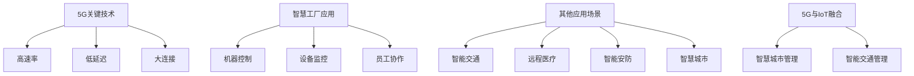

                 

### 2.1.1 5G的关键特性

5G技术的三大关键特性分别是高速率、低延迟和大连接。这些特性使5G在数据传输、实时应用和物联网（IoT）方面具有显著优势。

**高速率**：5G的峰值下载速率可达每秒数十千兆比特，相比4G网络，5G网络在数据传输速度上有了显著的提升。这一特点使得5G非常适合处理大数据和高带宽应用，如超高清视频流、虚拟现实（VR）和增强现实（AR）等。

**低延迟**：5G网络的延迟时间可低至1毫秒，比4G网络减少90%以上。低延迟使得5G网络特别适用于对实时性要求极高的应用场景，如自动驾驶汽车、远程手术和工业自动化等。

**大连接**：5G能够支持每平方米数十万个连接，这种高密度连接能力为大规模物联网应用提供了支持。例如，智慧工厂中的每一个机器设备、传感器和工人都可以实时连接到网络，实现数据的实时传输和共享。

### 2.1.2 5G的发展历程

5G技术的发展历程可以分为几个关键阶段：

**2016年**：国际电信联盟（ITU）正式确定5G的标准。这标志着5G技术正式进入标准化阶段，为全球5G网络的部署奠定了基础。

**2018年**：多个国家启动5G网络试验。在这一年，多个国家和地区开始进行5G网络试验，测试5G技术的性能和应用潜力。

**2020年**：5G正式商用，多个国家和地区开始大规模部署5G网络。5G网络的商业化标志着新一轮通信技术革命的开始，为各行各业的数字化转型提供了强有力的支持。

### 2.2 5G网络架构

#### 2.2.1 5G网络架构介绍

5G网络架构相比4G网络有了显著的变化，主要包括以下几个关键部分：

**核心网（Core Network）**：5G核心网采用了网络功能虚拟化（NFV）和网络切片（Network Slicing）技术，能够提供灵活的网络服务。

**无线接入网（Wireless Access Network）**：5G无线接入网采用了大规模MIMO（Massive MIMO）和毫米波（Millimeter Wave）技术，提高了频谱效率和网络容量。

**接入网（Access Network）**：5G接入网包括了光纤宽带、光纤到楼（FTTB）、光纤到户（FTTH）等多种接入方式，实现了广泛的网络覆盖。

**边缘计算（Edge Computing）**：5G网络中的边缘计算可以将数据处理和存储能力推向网络的边缘，降低延迟，提高数据处理的效率。

#### 2.2.2 5G网络关键技术

5G网络的关键技术包括但不限于：

**网络功能虚拟化（NFV）**：通过虚拟化技术，将传统的硬件设备功能转化为软件功能，实现网络资源的动态分配和灵活管理。

**网络切片（Network Slicing）**：在网络中创建多个虚拟网络，每个切片可以定制化配置，满足不同应用场景的需求。

**大规模MIMO（Massive MIMO）**：通过使用大量天线阵列，提高频谱利用率和网络容量。

**毫米波（Millimeter Wave）**：使用高频段（24GHz以上）的频谱，实现更高的数据传输速率和更广的覆盖范围。

**边缘计算（Edge Computing）**：在网络的边缘进行数据处理和存储，减少数据传输延迟，提高网络响应速度。

### 2.3 5G应用场景

#### 2.3.1 在智慧工厂中的应用

在智慧工厂中，5G技术可以应用于以下几个方面：

**机器控制**：5G技术的高速率和低延迟使得机器控制变得更加精确和实时。例如，在自动化生产线上，5G网络可以支持高精度的机器人控制，提高生产效率和产品质量。

**设备监控**：通过5G网络，工厂中的各种设备可以实现实时监控和远程维护。例如，生产线上的传感器可以实时采集数据，并通过5G网络传输到中央控制系统，实现设备的智能监控和管理。

**员工协作**：5G技术的高带宽支持高清视频和虚拟现实（VR）应用，使得员工可以远程协作，提高工作效率。例如，在远程设计会议中，团队成员可以通过5G网络实时共享设计图纸和讨论设计方案。

#### 2.3.2 其他典型应用场景

除了智慧工厂，5G技术还在以下领域有广泛应用：

**智能交通**：通过5G网络，车辆可以实现车联网（V2X）通信，实现自动驾驶、智能交通管理和实时路况监控。

**远程医疗**：5G网络可以实现远程医疗诊断和治疗，提高医疗服务的覆盖范围和质量。

**智能安防**：通过5G网络，视频监控设备和传感器可以实现实时监控和数据传输，提高安防系统的效率和响应速度。

**智慧城市**：5G技术可以为智慧城市的各个方面提供支持，包括智能交通、智能能源管理、环境监测等。

### 2.4 5G与物联网的融合应用

5G与物联网（IoT）的融合应用正在推动智慧城市的建设。通过5G网络，IoT设备可以实现实时数据采集和传输，为智慧城市的管理和运营提供数据支持。例如，在智能交通管理中，5G网络可以支持车辆间的通信，实现智能路况监控和交通流量控制，提高交通效率。

### 总结

5G技术的高速率、低延迟和大连接特性使其在智慧工厂和其他领域具有广泛的应用前景。通过5G网络，工厂可以实现更加智能化的生产和管理，提高生产效率和产品质量。同时，5G与物联网的融合应用正在推动智慧城市的建设，为人们的生活带来更多便利。

### 2.5 5G技术的未来发展趋势

随着5G技术的不断发展，未来5G网络将在以下几个方面取得重要突破：

**更高的数据速率**：未来的5G网络将进一步优化，实现更高的数据传输速率，以满足更复杂、更高带宽需求的应用场景。

**更低的延迟**：通过采用更先进的通信技术和网络架构，5G网络的延迟将进一步降低，为实时应用提供更高效的支持。

**更广的覆盖范围**：未来的5G网络将覆盖更多的地方，包括地下、室内和偏远地区，实现无缝的网络连接。

**网络智能化**：5G网络将变得更加智能化，通过人工智能（AI）和机器学习（ML）技术，实现网络的自我优化和自我修复，提高网络的稳定性和可靠性。

**更广泛的应用场景**：5G技术将在更广泛的领域得到应用，包括工业自动化、智慧城市、智能交通、远程医疗等，推动各行各业的数字化转型。

### 2.6 案例分析：5G在智能工厂中的应用

为了更深入地理解5G技术在智能工厂中的应用，我们可以分析一个实际案例：某汽车制造厂的5G应用。

**案例背景**：该汽车制造厂希望实现生产线的智能化和自动化，提高生产效率和产品质量。为了达到这一目标，他们决定采用5G技术。

**应用场景**：

- **机器控制**：通过5G网络，工厂内的机器人可以实现高精度的控制，实现自动装配、焊接等操作。例如，在车身装配线，5G网络支持机器人实时获取车身位置和姿态信息，进行精准的装配。

- **设备监控**：5G网络实现了生产设备的全天候监控，传感器可以实时收集设备状态数据，并通过5G网络传输到中央控制系统。例如，在发动机生产线，5G网络支持温度、压力等关键参数的实时监控，确保设备运行稳定。

- **员工协作**：5G网络使得员工可以实现远程协作，提高工作效率。例如，在产品设计阶段，设计师和工程师可以通过5G网络实时共享设计图纸和讨论设计方案，减少沟通成本和设计时间。

**案例分析**：

- **优势**：5G网络的高速率和低延迟使得生产线的机器控制更加精准和实时，提高了生产效率。同时，5G网络的高带宽支持了生产设备的全天候监控，提高了设备运行的稳定性和可靠性。
- **挑战**：5G网络的部署需要大量的投资和建设，特别是在工厂内部，需要对网络覆盖进行优化。此外，5G网络的安全性问题也需要得到充分的关注，以确保生产数据的安全。

**总结**：通过5G技术的应用，该汽车制造厂实现了生产线的智能化和自动化，提高了生产效率和产品质量。这一案例展示了5G技术在智能工厂中的巨大潜力，也为其他行业提供了宝贵的经验和借鉴。

### 2.7 小结与展望

5G技术作为新一代通信技术，正在深刻改变工业生产的方式，推动智慧工厂的建设。通过高速率、低延迟和大连接的特性，5G为工厂的机器控制、设备监控和员工协作提供了强大的支持，提高了生产效率和产品质量。

未来的5G技术将实现更高的数据速率、更低的延迟、更广的覆盖范围和更智能的网络管理，为工业、交通、医疗、安防等各个领域带来更多创新和变革。同时，5G与物联网的融合应用将推动智慧城市的建设，为人们的生活带来更多便利。

**注意事项**：

- 在部署5G网络时，需要充分考虑工厂内部的网络覆盖和安全性问题。
- 5G技术的高成本是当前面临的主要挑战，需要通过技术进步和规模效应来降低成本。
- 5G技术的应用需要与现有工厂设备和系统的兼容性，实现无缝集成。

**拓展阅读**：

- 5G NR独立组网（SA）与非独立组网（NSA）的区别及应用
- 5G网络切片技术原理及应用
- 5G在工业物联网中的应用案例分析

# 2.2 5G网络架构

### 2.2.1 5G网络架构介绍

5G网络架构相比4G网络有了显著的变化，主要包括以下几个关键部分：

**核心网（Core Network）**：5G核心网采用了网络功能虚拟化（NFV）和网络切片（Network Slicing）技术，能够提供灵活的网络服务。网络功能虚拟化使得网络功能可以从传统的硬件设备中解耦，运行在通用硬件上，从而提高网络的灵活性和可管理性。网络切片技术则允许运营商根据不同的应用需求，在网络中创建多个虚拟网络，每个切片可以独立管理和配置，满足不同服务质量（QoS）需求。

**无线接入网（Wireless Access Network）**：5G无线接入网采用了大规模MIMO（Massive MIMO）和毫米波（Millimeter Wave）技术，提高了频谱效率和网络容量。大规模MIMO技术通过使用大量天线阵列，实现了更高的数据传输速率和更好的信号覆盖。毫米波频段（24GHz以上）提供了更大的频谱资源，使得数据传输速率大幅提升，但同时也面临着覆盖范围有限和信号穿透能力差的问题。

**接入网（Access Network）**：5G接入网包括了光纤宽带、光纤到楼（FTTB）、光纤到户（FTTH）等多种接入方式，实现了广泛的网络覆盖。光纤宽带技术提供了高速、稳定的互联网接入服务，为家庭和企业用户提供了高质量的互联网体验。光纤到楼和光纤到户技术则实现了网络覆盖到建筑物内部，为住宅、办公室等提供了高速网络接入。

**边缘计算（Edge Computing）**：5G网络中的边缘计算将数据处理和存储能力推向网络的边缘，降低延迟，提高数据处理的效率。边缘计算通过在靠近数据源的位置部署计算资源，减少了数据传输的距离和时间，提高了实时处理的效率。这对于需要低延迟、高响应速度的应用场景，如自动驾驶、远程手术和工业自动化等，具有重要意义。

### 2.2.2 5G网络关键技术

5G网络的关键技术包括但不限于：

**网络功能虚拟化（NFV）**：网络功能虚拟化通过将网络功能从专用的硬件设备中解耦，使其运行在通用硬件平台上，从而提高网络的灵活性和可管理性。NFV技术使得运营商可以快速部署和调整网络服务，满足不同应用场景的需求。

**网络切片（Network Slicing）**：网络切片技术允许运营商在网络中创建多个虚拟网络，每个切片可以独立管理和配置，满足不同服务质量（QoS）需求。网络切片技术为5G网络提供了高度灵活的服务能力，使得运营商可以针对不同的应用场景和用户需求，提供定制化的网络服务。

**大规模MIMO（Massive MIMO）**：大规模MIMO技术通过使用大量天线阵列，实现了更高的数据传输速率和更好的信号覆盖。大规模MIMO技术通过空间复用技术，使得多个用户可以在同一频段上同时传输数据，提高了频谱效率和网络容量。

**毫米波（Millimeter Wave）**：毫米波频段（24GHz以上）提供了更大的频谱资源，使得数据传输速率大幅提升。但毫米波信号具有较短的传播距离和较差的信号穿透能力，因此需要在网络设计中考虑毫米波的覆盖范围和信号衰减问题。

**边缘计算（Edge Computing）**：边缘计算通过在网络的边缘部署计算资源，减少了数据传输的距离和时间，提高了实时处理的效率。边缘计算对于需要低延迟、高响应速度的应用场景，如自动驾驶、远程手术和工业自动化等，具有重要意义。

### 2.2.3 5G网络架构与4G网络的对比

5G网络架构与4G网络架构在多个方面存在显著差异：

**核心网**：4G核心网主要基于IP网络，而5G核心网采用了网络功能虚拟化（NFV）和网络切片（Network Slicing）技术，使得网络服务更加灵活和可定制化。

**无线接入网**：4G无线接入网主要采用了LTE技术，而5G无线接入网采用了大规模MIMO（Massive MIMO）和毫米波（Millimeter Wave）技术，提高了频谱效率和网络容量。

**接入网**：4G接入网主要依赖于光纤宽带和无线接入技术，而5G接入网进一步扩展了接入方式，包括光纤到楼（FTTB）、光纤到户（FTTH）等多种接入方式，实现了更广泛的网络覆盖。

**边缘计算**：4G网络中较少涉及边缘计算，而5G网络将数据处理和存储能力推向网络的边缘，通过边缘计算技术，提高了数据处理的效率和实时响应能力。

### 2.2.4 5G网络架构在实际应用中的挑战与解决方案

在实际应用中，5G网络架构面临着一些挑战，需要相应的解决方案：

**网络覆盖**：毫米波频段的信号衰减严重，覆盖范围有限。解决方法是采用多基站协同工作、室内分布系统等技术，提高网络的覆盖范围和信号质量。

**网络容量**：随着连接设备的增加，网络容量需求不断提升。采用大规模MIMO、网络切片等技术，可以提高网络容量和频谱效率。

**网络延迟**：边缘计算可以提高数据处理和响应速度，降低网络延迟。但在实际应用中，需要平衡数据传输和处理的平衡，确保低延迟的同时不牺牲数据处理的精度和效率。

**安全性**：5G网络涉及大量的物联网设备，安全性成为重要挑战。需要采用端到端加密、身份认证、访问控制等技术，确保网络数据的安全性和隐私性。

### 2.2.5 5G网络架构的未来发展趋势

未来，5G网络架构将在以下几个方面继续发展：

**网络智能化**：通过引入人工智能（AI）和机器学习（ML）技术，实现网络的自我优化和自我修复，提高网络的智能管理水平。

**网络融合**：5G网络将与其他网络技术（如物联网、云计算等）融合，形成更加综合和智能的网络体系，为各种应用场景提供更加完善的支持。

**更广的覆盖**：5G网络将扩展到更多的地方，包括地下、室内、高空等复杂环境，实现无缝的网络连接。

**更高的性能**：随着技术的不断进步，5G网络的性能将持续提升，包括更高的数据速率、更低的延迟和更大的网络容量。

### 案例分析：5G网络在智慧工厂中的应用

为了更好地理解5G网络架构在实际应用中的效果，我们可以分析一个实际案例：某智慧工厂的5G网络部署。

**案例背景**：该智慧工厂希望实现生产线的智能化和自动化，提高生产效率和产品质量。为了达到这一目标，他们决定采用5G网络技术。

**应用场景**：

- **设备监控**：通过5G网络，工厂内的传感器可以实时采集设备状态数据，并通过5G网络传输到中央控制系统。例如，生产线上的机器人、机械臂和传感器等设备都可以通过5G网络实现实时监控。
- **数据传输**：5G网络的高速率和低延迟使得生产过程中的大量数据可以实时传输到中央控制系统，进行实时分析和处理。例如，生产过程中的温度、压力、速度等参数都可以通过5G网络实时传输，确保设备运行在最佳状态。
- **远程控制**：5G网络支持远程控制功能，工程师可以通过5G网络远程控制生产线上的设备，进行实时调试和维护。例如，当设备出现故障时，工程师可以通过5G网络远程诊断和修复，提高设备运行效率。

**案例分析**：

- **优势**：5G网络的高速率和低延迟使得生产过程中的数据传输更加高效和实时，提高了生产效率和产品质量。同时，5G网络支持远程控制功能，提高了设备维护的效率和灵活性。
- **挑战**：5G网络的部署需要大量的投资和建设，特别是在工厂内部，需要对网络覆盖进行优化。此外，5G网络的安全性问题也需要得到充分的关注，以确保生产数据的安全。

**总结**：通过5G网络的部署，该智慧工厂实现了生产线的智能化和自动化，提高了生产效率和产品质量。这一案例展示了5G网络架构在实际应用中的巨大潜力，也为其他行业提供了宝贵的经验和借鉴。

### 2.2.6 小结与展望

5G网络架构的高速率、低延迟和大连接特性为智慧工厂的建设提供了强大的支持。通过网络功能虚拟化、网络切片、大规模MIMO、毫米波和边缘计算等关键技术，5G网络实现了灵活的网络服务、高效的频谱利用和实时数据处理。

未来的5G网络架构将朝着更加智能化、融合化和广泛覆盖的方向发展，为各行各业提供更加全面和高效的支持。同时，5G网络架构的应用也需要解决网络覆盖、网络容量、网络延迟和安全性等问题，以确保其在实际应用中的有效性和可靠性。

**注意事项**：

- 在部署5G网络时，需要充分考虑工厂内部的网络覆盖和安全性问题。
- 5G网络的建设需要大量的投资和建设，需要合理规划和资源配置。
- 5G网络的应用需要与现有工厂设备和系统的兼容性，实现无缝集成。

**拓展阅读**：

- 5G网络切片技术的实现原理和应用
- 大规模MIMO技术的原理和优势
- 边缘计算在智慧工厂中的应用案例分析

# 2.3 5G应用场景

### 2.3.1 在智慧工厂中的应用

5G技术的高速率、低延迟和大连接特性使其在智慧工厂中的应用变得尤为关键。以下将详细探讨5G技术在智慧工厂中的几个主要应用场景。

**机器控制**：5G网络的高速率和低延迟使得机器控制更加精准和实时。在自动化生产线上，高精度机器人和自动化设备通过5G网络接收控制指令，实现高速、高精度的生产操作。例如，在电子组装生产线，5G网络支持机器人进行精确的焊接、装配和测试，从而提高生产效率和产品质量。

**设备监控**：通过5G网络，工厂中的各种设备可以实现全天候监控和远程维护。传感器和监控设备收集到的数据通过5G网络实时传输到中央控制系统，进行实时分析和处理。例如，在生产线上的工业机器人，通过5G网络传输其运行状态、温度、速度等关键参数，实现远程故障诊断和维护，减少设备停机时间。

**员工协作**：5G网络的高带宽支持高清视频和虚拟现实（VR）应用，使得员工可以远程协作，提高工作效率。例如，在产品设计阶段，设计师和工程师可以通过5G网络实时共享设计图纸和讨论设计方案，减少沟通成本和设计时间。此外，5G网络还支持虚拟现实培训，使员工能够通过虚拟场景进行技能培训，提高培训效果。

**预测性维护**：利用5G网络的高速率和低延迟，工厂可以实现实时数据分析和机器学习算法，进行预测性维护。通过对设备运行数据的实时分析和学习，可以预测设备未来的故障和故障原因，提前进行维护，减少设备停机时间和维护成本。例如，通过对机器人的传感器数据进行实时分析，可以预测机器人可能发生的故障，提前进行维修，避免生产中断。

**智能调度**：5G网络支持实时数据传输和高速计算，使得工厂可以实现智能调度和优化。通过实时收集和分析生产数据，工厂可以实现生产任务的智能分配和调度，提高生产效率和资源利用率。例如，在生产线上的物料配送，通过5G网络实现实时监控和智能调度，优化物料配送路线和时间，减少运输成本。

**远程操作**：5G网络的高速率和低延迟支持远程操作和控制，使得工程师可以远程控制生产线上的设备，进行调试和维护。例如，当设备出现故障时，工程师可以通过5G网络远程连接设备，进行故障诊断和修复，减少现场维护的工作量和时间。

**大数据分析**：5G网络的高速率和低延迟使得工厂可以实现实时数据采集和高速数据传输，为大数据分析提供数据支持。通过对生产数据的实时分析和挖掘，可以优化生产过程，提高生产效率和质量。例如，通过对生产线上的数据进行分析，可以发现生产瓶颈和优化点，进行针对性的改进。

**自动化物流**：5G网络支持自动化物流系统的建设，实现物料和产品的自动化运输和配送。通过5G网络连接的传感器和机器人，可以实现物料的自动识别、分类和配送，提高物流效率。例如，在智能仓储系统中，通过5G网络连接的机器人可以实现自动化的物料搬运和配送，减少人工干预，提高仓储效率。

**增强现实（AR）**：5G网络支持增强现实（AR）应用，使得工厂可以实现AR辅助生产。通过AR眼镜，工人可以实时查看生产流程、设备状态和维修指导，提高生产效率和操作准确性。例如，在设备维护过程中，通过AR眼镜，工人可以实时查看设备内部结构和工作原理，进行更加准确的维修操作。

**能源管理**：5G网络支持智能能源管理系统，实现能源的实时监控和优化。通过对生产设备和能源消耗的数据分析，可以优化能源使用策略，减少能源浪费。例如，在工厂能源管理系统中，通过5G网络连接的传感器和智能控制器，可以实现实时监控能源消耗，自动调整能源使用计划，降低能源成本。

**虚拟工厂**：5G网络支持虚拟工厂的建设，实现生产过程的虚拟仿真和优化。通过虚拟工厂，工厂可以在虚拟环境中模拟生产过程，进行生产线的布局优化、工艺优化和生产计划优化。例如，在生产线设计阶段，通过虚拟工厂可以实现生产线的虚拟仿真，优化生产线布局，减少生产过程中的瓶颈和冲突。

**定制化生产**：5G网络支持定制化生产，实现生产线的灵活调整和定制化生产。通过实时数据分析和机器学习算法，工厂可以实现生产计划的动态调整，满足客户定制化的需求。例如，在定制化生产线上，通过5G网络连接的传感器和控制系统，可以实现生产线的实时监控和调整，快速响应客户定制化需求。

**环境监测**：5G网络支持环境监测系统的建设，实现工厂环境的实时监控和数据分析。通过对工厂环境的数据分析，可以优化工厂环境，提高工人健康和生产效率。例如，在工厂环境监测系统中，通过5G网络连接的传感器和智能控制器，可以实现实时监控工厂温度、湿度、空气质量等环境参数，自动调整环境控制设备，优化工厂环境。

**安全监控**：5G网络支持安全监控系统的建设，实现工厂安全的实时监控和报警。通过实时数据分析和智能算法，工厂可以实现安全事件的实时识别和报警，提高工厂的安全性。例如，在工厂安全监控系统中，通过5G网络连接的摄像头和传感器，可以实现实时监控工厂内的异常行为和安全隐患，及时报警和处理。

**智能制造**：5G网络支持智能制造系统的建设，实现生产过程的自动化、智能化和高效化。通过实时数据采集、分析和智能算法，工厂可以实现生产过程的优化和自动化，提高生产效率和产品质量。例如，在智能制造系统中，通过5G网络连接的传感器、控制器和智能算法，可以实现生产线的自动化调度、优化和调整，实现高效、灵活的智能制造。

### 2.3.2 其他典型应用场景

除了智慧工厂，5G技术还在许多其他领域有着广泛的应用，以下列举几个典型应用场景：

**智能交通**：5G技术支持智能交通系统的建设，实现车辆与基础设施、车辆与车辆之间的实时通信，提高交通效率和安全性。例如，在智能交通系统中，通过5G网络连接的车辆可以实现实时通信，实现交通信息的共享和协同控制，减少交通拥堵和事故发生。

**远程医疗**：5G技术支持远程医疗服务，实现医生与患者之间的实时通信和远程诊断。通过5G网络，医生可以实时获取患者的医疗数据，进行远程诊断和治疗，提高医疗服务的覆盖范围和质量。

**智能安防**：5G技术支持智能安防系统的建设，实现监控设备的实时监控和报警。通过5G网络，监控设备可以实现高清视频传输和实时数据分析，提高监控效果和反应速度。

**智慧城市**：5G技术支持智慧城市的建设，实现城市管理的智能化和高效化。通过5G网络，智慧城市的各个方面可以实现实时数据采集、分析和处理，实现智能化的城市管理和服务。

### 总结

5G技术的高速率、低延迟和大连接特性为智慧工厂和其他领域的应用提供了强大的支持。在智慧工厂中，5G技术可以应用于机器控制、设备监控、员工协作、预测性维护、智能调度、远程操作、大数据分析、自动化物流、增强现实、能源管理、虚拟工厂、定制化生产、环境监测、安全监控和智能制造等方面，提高生产效率和质量。

在其他领域，5G技术同样具有广泛的应用前景，包括智能交通、远程医疗、智能安防和智慧城市等，通过实现实时数据传输、智能分析和协同控制，提高相关领域的效率和安全性。

随着5G技术的不断发展，未来将在更多领域实现更加广泛和深入的应用，推动各行各业的数字化转型和智能化升级。

### 2.4 5G与物联网的融合应用

5G与物联网（IoT）的融合应用正在推动智慧城市的建设，实现更高效、更智能的城市管理和运营。以下将详细探讨5G技术如何与物联网相结合，在智慧城市建设中的具体应用。

#### 5G网络对物联网的支持

5G网络的高速率、低延迟和大连接能力为物联网提供了强有力的支持。5G网络的高速率使得海量物联网设备可以同时连接到网络，实现高速数据传输；低延迟满足了物联网设备对实时响应的需求；大连接能力则支持了物联网设备的高密度部署和广泛应用。

#### 智慧交通

在智慧交通领域，5G与物联网的融合应用主要体现在以下几个方面：

- **车辆与基础设施通信**：通过5G网络，车辆可以与交通信号灯、道路监控设备等进行实时通信，实现智能交通管理。例如，当车辆接近路口时，交通信号灯可以实时调整信号灯时长，优化交通流量，减少拥堵。
- **自动驾驶**：5G网络支持自动驾驶车辆之间的实时通信，实现车联网（V2X）应用。自动驾驶车辆通过5G网络可以实时获取周围交通信息，进行路径规划和决策，提高行驶安全性和效率。
- **智能停车场管理**：通过5G网络连接的智能停车设备，可以实现车辆自动识别、车位占用情况实时监控和自动计费，提高停车场的使用效率和用户体验。

#### 智慧医疗

在智慧医疗领域，5G与物联网的融合应用大大提升了医疗服务的覆盖范围和质量：

- **远程医疗**：通过5G网络，医生可以实时获取患者的健康数据和医疗影像，进行远程诊断和治疗。5G网络的高速率和低延迟支持了高清医疗视频和实时数据传输，提高了远程医疗的服务质量。
- **智能监测**：通过5G网络连接的智能监测设备，可以实时收集患者的生理参数，如心率、血压等，实现24小时健康监测。当监测到异常情况时，系统可以自动报警，提醒医生进行干预。
- **医疗物资管理**：通过5G网络，医院可以实现医疗物资的智能管理，实时监控物资库存和使用情况，优化物资调配，提高医疗资源利用率。

#### 智慧安防

在智慧安防领域，5G与物联网的融合应用实现了更加高效、智能的安防监控和管理：

- **视频监控**：通过5G网络，监控摄像头可以实现高清视频实时传输，监控范围和清晰度大大提升。同时，5G网络支持视频数据的实时分析和处理，实现智能识别和报警功能。
- **智能巡检**：通过5G网络连接的智能巡检设备，可以实时监控安防设施的工作状态，如摄像头、报警器等。当设备出现故障或异常时，系统可以自动报警并通知维护人员。
- **人员定位**：通过5G网络，可以实时定位人员位置，提高人员管理效率。例如，在大型公共场所，可以实时监控人员分布情况，优化人员调度和应急响应。

#### 智慧环保

在智慧环保领域，5G与物联网的融合应用有助于实现环境监测和治理的智能化：

- **环境监测**：通过5G网络连接的环境监测设备，可以实时收集空气质量、水质、噪音等环境数据，实现环境状况的实时监控和分析。
- **智能治理**：基于5G网络的数据分析和预测模型，可以优化环保治理策略，提高治理效果。例如，通过分析空气质量数据，可以实时调整污染源的排放量，优化空气质量。

#### 智慧能源

在智慧能源领域，5G与物联网的融合应用实现了能源的高效利用和管理：

- **智能电网**：通过5G网络，可以实现电力设备实时监测和远程控制，优化电网运行效率。例如，通过实时监控电网负荷和发电量，可以实现电力资源的优化配置，减少能源浪费。
- **分布式能源管理**：通过5G网络，可以实现分布式能源系统（如太阳能、风能等）的实时监测和优化调度，提高能源利用效率。

#### 智慧城市平台

通过5G与物联网的融合应用，智慧城市平台可以实现城市管理的智能化和一体化：

- **数据融合**：通过5G网络，可以实现各类物联网设备的数据实时传输和融合，为智慧城市平台提供丰富的数据支持。
- **智能决策**：基于5G网络的数据分析和智能算法，智慧城市平台可以实现智能化的城市管理和决策，提高城市运营效率和居民生活质量。
- **用户体验**：通过5G网络，智慧城市平台可以为居民提供个性化的城市服务，如交通导航、医疗预约、能源管理等，提升居民生活便利性。

### 总结

5G与物联网的融合应用正在推动智慧城市的建设，实现更高效、更智能的城市管理和运营。通过5G网络的高速率、低延迟和大连接能力，智慧城市可以实现车辆与基础设施通信、远程医疗、智能安防、环境监测、能源管理等方面的智能化应用。随着5G技术的不断发展和物联网设备的普及，未来智慧城市的建设将更加完善和智能，为人们的生活带来更多便利。

### 2.5 小结与展望

5G与物联网的融合应用为智慧城市的建设提供了强大的技术支持，实现了更高效、更智能的城市管理和运营。通过5G网络的高速率、低延迟和大连接能力，智慧城市可以实现车辆与基础设施通信、远程医疗、智能安防、环境监测、能源管理等方面的智能化应用。以下是5G与物联网融合应用在智慧城市中的几个关键点和未来展望：

**关键点**：

1. **实时数据传输**：5G网络的高速率和低延迟支持了物联网设备实时数据的传输和处理，为智慧城市提供了实时、准确的数据支持。
2. **智能决策**：基于5G网络的数据分析和智能算法，智慧城市平台可以实现智能化的城市管理和决策，提高城市运营效率和居民生活质量。
3. **高密度部署**：5G网络的大连接能力支持了物联网设备的高密度部署，使得智慧城市可以实现全面、细致的数据采集和管理。
4. **个性化服务**：通过5G网络，智慧城市平台可以为居民提供个性化的城市服务，如交通导航、医疗预约、能源管理等，提升居民生活便利性。

**未来展望**：

1. **更广泛的覆盖**：随着5G网络的不断部署和扩展，物联网设备将实现更广泛的覆盖，智慧城市的建设将更加完善和智能。
2. **更高效的数据处理**：随着计算能力的提升和算法的优化，智慧城市平台将实现更高效的数据处理和分析，为城市管理和运营提供更科学的决策支持。
3. **更智能的协同**：5G与物联网的融合应用将实现更智能的协同，使城市各领域的信息系统可以实现无缝对接和协同工作，提高城市运营效率和居民生活质量。
4. **更安全的管理**：随着5G和物联网技术的发展，智慧城市的安全管理将得到进一步提升，确保城市数据的安全和隐私。

### 注意事项

1. **网络覆盖**：在部署5G网络时，需要充分考虑物联网设备分布广泛、需求多样化的特点，确保网络覆盖的全面性和稳定性。
2. **数据安全**：物联网设备的数据安全和隐私保护是智慧城市建设的关键，需要采用有效的安全措施，确保数据的安全传输和存储。
3. **设备兼容性**：物联网设备的多样性要求智慧城市平台具备良好的兼容性，支持不同类型设备的接入和管理。

### 拓展阅读

1. **5G网络在智慧城市中的应用案例**
2. **物联网技术在智慧城市中的融合应用**
3. **智慧城市建设的实践与展望**

