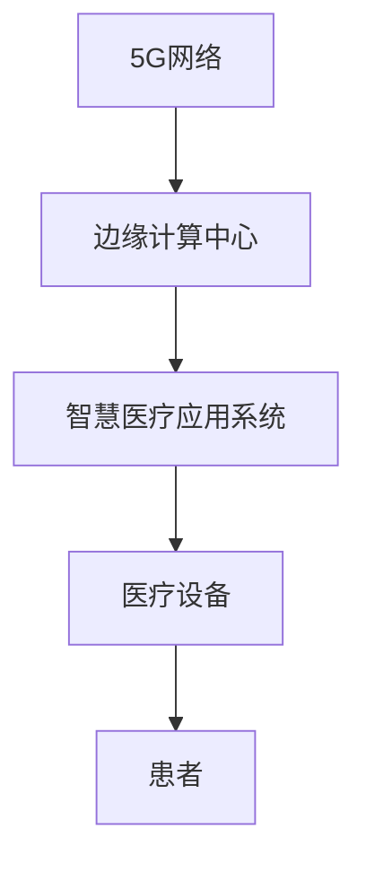
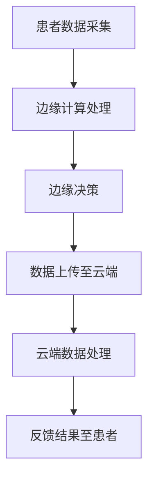

                 

# 5G与边缘计算在智慧医疗中的协同

> 关键词：5G，边缘计算，智慧医疗，协同，应用实例，挑战与机遇，未来展望

> 摘要：随着5G技术的快速发展和边缘计算的应用普及，智慧医疗领域迎来了前所未有的变革。本文从5G和边缘计算的核心技术出发，深入探讨了二者在智慧医疗中的协同作用，分析了它们在实际应用中的优势、挑战与机遇，并展望了未来的发展趋势。通过具体的应用实例，揭示了5G与边缘计算在智慧医疗中的协同架构和核心算法，为行业提供了有益的参考。

## 前言

### 5G与边缘计算在智慧医疗领域的应用背景

随着全球医疗健康需求的持续增长，智慧医疗作为现代信息技术与医疗服务的深度融合，逐渐成为医疗行业的重要发展方向。5G技术和边缘计算作为新一代信息技术的代表，为智慧医疗带来了前所未有的机遇和挑战。

5G技术以其高速率、低延迟和大连接等特点，为医疗数据的高速传输和实时处理提供了有力保障。边缘计算则通过将计算任务从云端转移到网络边缘，实现了对数据的快速分析和处理，降低了网络延迟，提高了系统的响应速度。

本篇文章将深入探讨5G与边缘计算在智慧医疗中的应用，分析它们在智慧医疗中的协同原理和架构，并探讨其面临的挑战和机遇。希望通过本文的探讨，能够为智慧医疗领域的技术创新和应用提供一些有益的启示。

### 书籍结构概述

本文共分为六个主要章节，每个章节的内容如下：

- **第1章 5G技术基础**：介绍5G网络的特点、架构和关键技术，以及5G网络对智慧医疗的影响。
- **第2章 边缘计算基础**：介绍边缘计算的定义、优势和技术，以及边缘计算在智慧医疗中的应用。
- **第3章 5G与边缘计算协同原理**：探讨5G与边缘计算的协同原理和架构，分析其协同关键技术。
- **第4章 智慧医疗中的5G与边缘计算应用实例**：通过具体实例，展示5G与边缘计算在智慧医疗中的应用。
- **第5章 5G与边缘计算在智慧医疗中的挑战与机遇**：分析5G与边缘计算在智慧医疗中面临的挑战和机遇。
- **第6章 未来展望与趋势**：展望5G与边缘计算在智慧医疗中的未来发展。

### 阅读指南

本文旨在为读者提供一个关于5G与边缘计算在智慧医疗中的协同应用的全面解读。为了使读者能够更好地理解和应用本文内容，以下是一些建议：

1. **系统学习**：建议读者按照章节顺序系统学习，从基础理论到应用实例，逐步深入。
2. **结合实践**：在实际工作中，可以结合本文的内容，尝试将5G与边缘计算技术应用于智慧医疗领域。
3. **拓展阅读**：本文引用了大量的相关文献和资料，读者可以进一步拓展阅读，深入了解相关技术。

## 第1章 5G技术基础

### 1.1 5G网络概述

5G网络，即第五代移动通信网络，是继2G、3G和4G之后的新一代移动通信技术。5G网络的特点在于高速率、低延迟和大连接，能够提供比前几代网络更快速、更稳定、更高效的数据传输服务。

#### 1.1.1 5G网络的特点

- **高速率**：5G网络的峰值下载速度可以达到10Gbps，是4G网络的100倍。这意味着用户可以更快地下载大型文件、观看高清视频以及进行云游戏等应用。
- **低延迟**：5G网络的端到端延迟最低可达1ms，相比4G网络的20-30ms大幅降低。这对于实时应用，如远程手术、自动驾驶和工业自动化等领域至关重要。
- **大连接**：5G网络支持更多的设备连接，每平方公里可以支持多达100万台设备的连接，这为物联网（IoT）应用提供了广阔的空间。

#### 1.1.2 5G网络的架构

5G网络的架构主要包括核心网（Core Network）、无线接入网（Radio Access Network，RAN）和传输网络（Transport Network）三大部分。

- **核心网**：5G核心网采用了全新的架构，包括服务化架构（Service-Based Architecture，SBA）和统一数据平面（Unified Data Plane，UDP）。SBA将网络功能模块化为独立的服务，通过北向接口进行交互，实现网络的灵活部署和扩展。UDP则提供了一种统一的数据传输平面，简化了网络架构，提高了数据传输效率。
- **无线接入网**：5G无线接入网采用了新的无线接入技术，如大规模MIMO（Massive MIMO）、载波聚合（Carrier Aggregation）和毫米波（Millimeter Wave）等。这些技术大大提高了无线接入网的频谱利用率和传输效率。
- **传输网络**：5G传输网络主要采用了IP网络技术，通过SDN（Software-Defined Networking）和NFV（Network Functions Virtualization）等技术，实现了网络资源的动态分配和优化，提高了网络的灵活性和可靠性。

#### 1.1.3 5G网络的关键技术

5G网络的关键技术包括网络切片（Network Slicing）、边缘计算（Edge Computing）、虚拟化技术（Virtualization）和AI（Artificial Intelligence）等。

- **网络切片**：网络切片技术允许网络运营商在网络中创建多个虚拟网络，每个虚拟网络都具有独立的服务质量和网络资源。这使得5G网络能够灵活地满足不同应用场景的需求，如智能交通、远程医疗和工业自动化等。
- **边缘计算**：边缘计算技术通过将计算任务从云端转移到网络边缘，实现了对数据的实时处理和响应，降低了网络延迟，提高了系统的响应速度。这对于实时应用，如远程医疗和自动驾驶等，至关重要。
- **虚拟化技术**：虚拟化技术通过将物理资源抽象为虚拟资源，实现了资源的灵活分配和优化。在5G网络中，虚拟化技术被广泛应用于核心网、无线接入网和传输网络等多个层面，提高了网络的灵活性和可扩展性。
- **AI**：AI技术在5G网络中发挥着重要作用，如网络优化、智能路由和流量管理等。通过AI技术，5G网络能够更加智能地进行资源分配和网络优化，提高网络性能和用户体验。

### 1.2 5G网络对智慧医疗的影响

5G网络的高速率、低延迟和大连接特点，为智慧医疗领域带来了革命性的变化。

#### 1.2.1 高速率传输

5G网络的高速率传输能力，使得医疗数据能够更快地传输到云端或其他设备。这对于远程医疗、远程手术和医疗数据传输等应用具有重要意义。

- **远程医疗**：5G网络的高速率传输能力，使得医生能够通过远程视频会议系统，与患者进行实时互动和诊疗。这将大大提高医疗服务的覆盖范围和效率。
- **远程手术**：5G网络的高速率传输能力，使得远程手术成为可能。医生可以通过5G网络，实时监控手术进展，进行远程指导和操作，提高了手术的成功率和安全性。
- **医疗数据传输**：5G网络的高速率传输能力，使得医疗数据能够更快地传输到云端或其他设备，便于医疗数据的存储、分析和共享。

#### 1.2.2 低延迟

5G网络的低延迟特性，对于实时应用具有重要意义。

- **远程医疗**：5G网络的低延迟特性，使得医生可以通过远程视频会议系统，与患者进行实时互动和诊疗，无需担心网络延迟的问题。
- **远程手术**：5G网络的低延迟特性，使得医生可以通过远程手术系统，实时监控手术进展，进行远程指导和操作，无需担心网络延迟的问题。
- **医疗设备监控**：5G网络的低延迟特性，使得医疗设备能够实时地将监控数据传输到云端，便于医生进行实时监控和分析，提高了医疗设备的响应速度和准确性。

#### 1.2.3 大连接

5G网络的大连接特性，使得更多的医疗设备能够接入网络，实现智能化和联网化。

- **物联网医疗设备**：5G网络的大连接特性，使得物联网医疗设备能够更好地接入网络，实现数据实时传输和监控。例如，智能血压计、智能血糖仪等设备，可以通过5G网络实时传输数据到云端，便于医生进行监控和分析。
- **远程医疗设备**：5G网络的大连接特性，使得远程医疗设备能够更好地接入网络，实现数据实时传输和监控。例如，远程心电图机、远程CT机等设备，可以通过5G网络实时传输数据到云端，便于医生进行诊断和治疗。
- **智能医院**：5G网络的大连接特性，使得医院内部的各种设备能够更好地接入网络，实现智能化和联网化。例如，智能病房、智能手术室等，可以通过5G网络实现数据的实时传输和监控，提高医疗服务的效率和质量。

#### 1.2.4 5G网络在智慧医疗中的应用案例

以下是5G网络在智慧医疗中的几个典型应用案例：

- **远程医疗**：某医院利用5G网络搭建远程医疗系统，医生可以通过远程视频会议系统，与患者进行实时互动和诊疗，提高了医疗服务的覆盖范围和效率。
- **远程手术**：某医院利用5G网络进行远程手术，医生可以通过远程手术系统，实时监控手术进展，进行远程指导和操作，提高了手术的成功率和安全性。
- **医疗数据传输**：某医院利用5G网络搭建医疗数据传输系统，将医疗数据实时传输到云端，便于医生进行存储、分析和共享，提高了医疗服务的效率和质量。

## 第2章 边缘计算基础

### 2.1 边缘计算概述

边缘计算（Edge Computing）是一种分布式计算架构，通过在网络的边缘（如设备、传感器或网络接入点）进行数据处理，将计算任务从中心化的数据中心转移到网络的边缘，从而实现更快速、更高效的数据处理和分析。边缘计算的核心思想是将计算、存储和网络功能分布在网络的边缘，使数据能够在生成地点附近进行处理，从而减少数据传输的延迟，提高系统的响应速度。

#### 2.1.1 边缘计算的定义

边缘计算的定义可以从以下几个方面来理解：

- **地理位置**：边缘计算是指在网络边缘进行数据处理和存储，这些网络边缘可以是终端设备、本地服务器、网络接入点等。
- **数据处理**：边缘计算将计算任务从中心化的数据中心转移到网络的边缘，使数据处理和分析能够更接近数据源，从而提高数据处理的速度和效率。
- **分布式计算**：边缘计算通过在多个边缘节点上分布式地处理数据，实现计算资源的最大化利用，同时提高系统的容错能力和可扩展性。

#### 2.1.2 边缘计算的优势

边缘计算具有以下优势：

- **低延迟**：由于数据在边缘节点进行处理，减少了数据传输到数据中心的时间，从而降低了网络延迟，提高了系统的响应速度。
- **高效率**：边缘计算可以在数据生成地点附近进行实时处理和分析，减少了数据传输和处理的延迟，提高了数据处理效率。
- **灵活性**：边缘计算可以根据不同的应用场景和需求，灵活地调整计算资源和处理任务，提高了系统的灵活性和可扩展性。
- **降低成本**：边缘计算减少了数据传输到数据中心的需求，降低了网络带宽和传输成本，同时减少了中心化数据中心的能源消耗和硬件投资。
- **提高安全性**：边缘计算可以在本地处理敏感数据，减少了数据传输过程中被窃取或泄露的风险，提高了数据安全性。

#### 2.1.3 边缘计算的关键技术

边缘计算的关键技术包括以下几个方面：

- **边缘设备**：边缘设备是边缘计算的核心，包括各种智能设备、传感器和网络接入点。边缘设备需要具备高性能的计算能力、低功耗的特点，以及与云计算平台的无缝集成能力。
- **边缘网关**：边缘网关是连接边缘设备和云计算平台的桥梁，负责数据的收集、过滤、处理和传输。边缘网关需要具备高效的数据处理能力、网络通信能力和安全防护能力。
- **边缘平台**：边缘平台是边缘计算的核心，负责管理边缘设备和边缘网关，提供数据处理、存储、分析和共享等功能。边缘平台需要具备高性能、高可靠性和易扩展的特点。
- **边缘AI**：边缘AI是将人工智能技术应用到边缘计算中，通过在边缘设备上部署AI模型，实现数据的实时分析和处理。边缘AI需要具备低功耗、高性能和易部署的特点。

### 2.2 边缘计算在智慧医疗中的应用

边缘计算在智慧医疗领域具有广泛的应用前景，通过将计算任务从云端转移到网络边缘，实现了对医疗数据的实时处理和分析，提高了医疗服务的效率和质量。

#### 2.2.1 边缘计算在医疗数据采集中的应用

边缘计算在医疗数据采集中的应用主要包括以下几个方面：

- **实时监测**：通过在医疗设备中集成边缘计算模块，实现对患者的生命体征、病情变化等数据的实时监测。例如，智能血压计、智能心电监护仪等设备，可以通过边缘计算模块实时采集患者的数据，并将数据传输到云端进行分析和处理。
- **数据预处理**：在数据采集过程中，边缘计算可以对采集到的数据进行预处理，包括数据清洗、数据压缩和数据加密等。通过预处理，可以提高数据的质量和安全性，减少数据传输的带宽和延迟。
- **数据本地化处理**：通过在边缘设备上部署智能算法，实现对采集数据的本地化处理，如数据过滤、数据分析和预测等。这样可以减少数据传输到云端的负担，提高数据处理的速度和效率。

#### 2.2.2 边缘计算在医疗数据分析中的应用

边缘计算在医疗数据分析中的应用主要包括以下几个方面：

- **实时分析**：通过在边缘设备上部署智能算法，实现对医疗数据的实时分析，如异常检测、疾病预测和诊断等。这样可以快速识别患者的病情变化，及时采取治疗措施，提高医疗服务的效率和质量。
- **数据融合**：通过将多个来源的医疗数据（如医院数据、设备数据、传感器数据等）进行融合，实现更全面、准确的医疗数据分析。例如，将患者的病史、基因数据、实时监测数据等进行融合，实现更准确的疾病诊断和治疗方案。
- **本地化决策**：通过在边缘设备上部署决策算法，实现本地化的医疗决策。例如，在智能手术中，医生可以通过边缘计算设备实时分析手术数据，进行手术决策和操作指导，提高手术的成功率和安全性。

#### 2.2.3 边缘计算在远程医疗中的应用

边缘计算在远程医疗中的应用主要包括以下几个方面：

- **远程诊断**：通过在边缘设备上部署智能算法，实现对医疗数据的实时分析和诊断，如智能影像诊断、智能病理诊断等。医生可以通过远程诊断系统，实时获取患者的诊断结果，提供远程医疗建议。
- **远程会诊**：通过在边缘设备上集成远程视频会议系统，实现医生与患者、医生与医生之间的实时远程会诊。通过远程会诊，医生可以更全面地了解患者的病情，提供更准确的医疗建议。
- **远程手术**：通过在边缘设备上集成远程手术控制系统，实现医生对远程手术的实时指导和操作。医生可以通过远程手术系统，实时监控手术进展，提供手术操作指导，提高手术的成功率和安全性。

#### 2.2.4 边缘计算在智慧医院中的应用

边缘计算在智慧医院中的应用主要包括以下几个方面：

- **智能病房**：通过在病房中部署边缘计算设备，实现对患者的实时监测和护理。例如，智能床垫可以监测患者的睡眠质量，智能心电监护仪可以实时监测患者的心率等，通过边缘计算设备对数据进行分析和报警，提供更个性化的护理服务。
- **智能手术室**：通过在手术室中部署边缘计算设备，实现对手术过程的实时监控和指导。例如，智能手术灯可以实时监测手术环境，智能手术导航系统可以实时引导医生进行手术操作，提高手术的效率和安全性。
- **智能医疗设备管理**：通过在医疗设备中集成边缘计算模块，实现对医疗设备的实时监控和管理。例如，智能输液泵可以实时监控输液速度和剂量，智能CT机可以实时监控设备运行状态和故障诊断，提高医疗设备的使用效率和安全性。

## 第3章 5G与边缘计算协同原理

### 3.1 5G与边缘计算协同概述

5G与边缘计算在智慧医疗领域的协同，旨在通过结合两者的优势，实现更高效、更智能的医疗数据处理和分析。这种协同不仅能够解决传统云计算在数据处理速度和效率方面的限制，还能够提高医疗服务的质量和效率。

#### 3.1.1 协同原理

5G与边缘计算的协同原理主要包括以下几个方面：

- **数据传输**：5G网络的高速率和低延迟特性，为边缘计算提供了高效的数据传输通道。医疗数据可以通过5G网络快速传输到边缘节点进行实时处理，减少了数据传输的延迟和带宽消耗。
- **任务分配**：边缘计算通过在边缘节点上部署智能算法，实现对医疗数据的实时分析和处理。5G网络可以根据不同的应用场景和需求，动态分配计算任务到边缘节点，实现计算资源的优化利用。
- **协同决策**：5G与边缘计算通过协同工作，可以实现医疗数据的全局优化和决策。5G网络可以收集来自多个边缘节点的数据，进行全局分析和决策，提供更精准的医疗服务。

#### 3.1.2 协同架构

5G与边缘计算的协同架构主要包括以下几个层次：

- **边缘节点**：边缘节点是边缘计算的基础设施，包括各种智能设备和传感器，如智能医疗设备、智能传感器等。边缘节点负责实时采集医疗数据，并将其传输到边缘网关。
- **边缘网关**：边缘网关是连接边缘节点和5G网络的桥梁，负责数据的收集、过滤、处理和传输。边缘网关可以集成多种边缘计算技术，如AI、大数据分析等，实现数据的实时分析和处理。
- **5G网络**：5G网络是数据传输的通道，提供高速率和低延迟的网络服务。5G网络可以将医疗数据从边缘节点传输到云端或其他边缘节点，实现数据的全局优化和决策。
- **云计算平台**：云计算平台负责数据的存储、分析和处理。云计算平台可以通过5G网络与边缘节点进行数据传输，实现医疗数据的集中管理和分析。

### 3.2 5G与边缘计算协同关键技术

5G与边缘计算的协同，依赖于一系列关键技术的支持。这些关键技术包括网络切片、边缘计算与云计算的融合、边缘网络优化等。

#### 3.2.1 网络切片

网络切片是5G网络的一项重要技术，它可以将一个物理网络划分为多个虚拟网络，每个虚拟网络具有独立的服务质量和网络资源。在智慧医疗中，网络切片可以用于以下方面：

- **资源隔离**：通过网络切片，可以为不同的医疗应用提供独立的网络资源，确保不同应用之间不会相互干扰，提高系统的稳定性和安全性。
- **服务质量保证**：网络切片可以根据不同的医疗应用需求，提供不同的服务质量保障，如低延迟、高带宽等，确保医疗数据的高效传输。
- **动态资源分配**：网络切片可以根据实时需求，动态调整网络资源分配，实现计算任务的优化和调度。

#### 3.2.2 边缘计算与云计算的融合

边缘计算与云计算的融合，是实现5G与边缘计算协同的重要手段。通过融合边缘计算和云计算的优势，可以实现医疗数据的全局优化和决策。

- **数据融合**：通过将边缘计算和云计算相结合，可以实现医疗数据的全局融合和分析。边缘节点可以实时处理医疗数据，并将分析结果传输到云端，实现数据的集中管理和分析。
- **计算任务调度**：通过边缘计算和云计算的协同，可以实现计算任务的动态调度和优化。云计算可以提供强大的计算能力和存储资源，边缘计算可以提供低延迟和高效的本地处理能力，两者相结合可以实现医疗数据的全局优化和决策。
- **智能服务**：通过边缘计算和云计算的融合，可以提供更智能的医疗服务。例如，在远程医疗中，边缘计算可以实时分析患者的数据，云计算可以提供远程诊断和治疗方案，实现医疗服务的智能化和个性化。

#### 3.2.3 边缘网络优化

边缘网络优化是实现5G与边缘计算协同的关键技术之一。通过优化边缘网络，可以提高医疗数据的传输效率和网络稳定性。

- **流量管理**：通过流量管理技术，可以优化医疗数据的传输路径，减少数据传输的延迟和带宽消耗。例如，可以采用动态流量分配算法，根据实时网络状况和计算任务需求，动态调整数据传输路径，实现流量的优化和调度。
- **网络冗余**：通过构建网络冗余，可以提高边缘网络的可靠性和稳定性。例如，可以采用多路径传输技术，将数据通过多条路径传输，提高数据传输的可靠性和稳定性。
- **边缘缓存**：通过在边缘节点上部署缓存技术，可以减少数据传输的延迟和带宽消耗。例如，可以采用内容分发网络（CDN）技术，将常用的医疗数据缓存到边缘节点，提高数据的访问速度和效率。

### 3.3 5G与边缘计算协同的优势

5G与边缘计算的协同，为智慧医疗带来了以下几个方面的优势：

- **低延迟**：通过边缘计算和5G网络的协同，可以实现医疗数据的实时传输和处理，大大降低数据处理和传输的延迟，提高医疗服务的实时性和响应速度。
- **高效率**：边缘计算可以将计算任务从云端转移到网络边缘，实现数据的本地化处理和实时分析，减少数据传输的延迟和带宽消耗，提高数据处理和传输的效率。
- **灵活性**：5G与边缘计算的协同，可以根据不同的应用场景和需求，动态调整计算资源和网络资源，实现系统的灵活部署和扩展。
- **高可靠性**：通过边缘计算和5G网络的协同，可以提高医疗数据传输的可靠性和网络稳定性，减少数据丢失和网络中断的风险。

## 第4章 智慧医疗中的5G与边缘计算应用实例

### 4.1 实时医疗数据传输

实时医疗数据传输是5G与边缘计算在智慧医疗中协同应用的重要领域。通过5G网络的高速率和低延迟特性，以及边缘计算的实时数据处理能力，可以实现医疗数据的实时传输和处理，提高医疗服务的实时性和准确性。

#### 4.1.1 实时监测

实时监测是医疗数据传输的重要应用之一。通过在患者身上佩戴各种智能传感器，如心率监测器、血压计、血糖仪等，可以实时采集患者的生命体征数据。这些数据可以通过5G网络快速传输到边缘节点，边缘节点利用边缘计算技术对数据进行实时处理和过滤，如去除噪声、检测异常值等。处理后的数据可以立即发送到云端或本地医疗系统，供医生实时查看和分析。

- **边缘计算处理流程**：
  ```mermaid
  graph TD
      A[患者数据采集] --> B[边缘节点处理]
      B --> C[数据过滤与清洗]
      C --> D[数据传输至云端]
      D --> E[医生查看与分析]
  ```

#### 4.1.2 实时影像传输

实时影像传输是远程医疗中必不可少的一环。通过5G网络的高速传输能力，医生可以实时获取患者的影像数据，如X光片、CT扫描、MRI等。这些影像数据在传输过程中，可以通过边缘计算技术进行压缩和优化，以减少数据传输的带宽需求。

- **边缘计算处理流程**：
  ```mermaid
  graph TD
      A[影像数据采集] --> B[边缘节点压缩与优化]
      B --> C[数据传输至云端]
      C --> D[医生查看与分析]
  ```

#### 4.1.3 实时诊断

实时诊断是5G与边缘计算在智慧医疗中协同应用的另一个重要方面。通过边缘计算技术，医生可以在边缘节点上对实时传输的医疗数据进行快速分析和诊断，提供即时的诊断结果和建议。

- **边缘计算处理流程**：
  ```mermaid
  graph TD
      A[实时医疗数据传输] --> B[边缘节点分析]
      B --> C[诊断结果生成]
      C --> D[医生查看与决策]
  ```

### 4.2 远程医疗

远程医疗是5G与边缘计算协同应用的另一个重要领域。通过5G网络的高速率和低延迟特性，医生可以远程访问患者的医疗数据，进行远程诊断和会诊，提供高质量的医疗服务。

#### 4.2.1 远程会诊

远程会诊是通过5G网络和边缘计算技术，实现医生之间的远程协作和交流。医生可以通过视频会议系统，实时查看患者的病历、影像和生命体征数据，进行远程讨论和诊断。

- **远程会诊流程**：
  ```mermaid
  graph TD
      A[医生发起远程会诊] --> B[5G网络连接]
      B --> C[患者数据传输]
      C --> D[医生查看与分析]
      D --> E[远程讨论与诊断]
  ```

#### 4.2.2 远程手术

远程手术是5G与边缘计算协同应用的又一重要领域。通过5G网络的高速传输和边缘计算的实时处理能力，医生可以远程控制手术机器人，进行远程手术操作。

- **远程手术流程**：
  ```mermaid
  graph TD
      A[医生远程控制手术机器人] --> B[5G网络连接]
      B --> C[手术数据传输]
      C --> D[边缘节点实时处理]
      D --> E[手术机器人执行操作]
  ```

#### 4.2.3 远程康复

远程康复是通过5G网络和边缘计算技术，实现对患者的远程康复指导和监测。医生可以通过远程监控患者的康复进展，提供个性化的康复建议和指导。

- **远程康复流程**：
  ```mermaid
  graph TD
      A[医生远程监控康复进展] --> B[5G网络连接]
      B --> C[患者康复数据传输]
      C --> D[边缘节点分析]
      D --> E[医生查看与指导]
  ```

### 4.3 医疗大数据分析

医疗大数据分析是5G与边缘计算协同应用的另一个重要领域。通过5G网络的高速传输和边缘计算的实时处理能力，可以实现医疗数据的快速采集、传输和分析，为医生提供全面、准确的诊断和治疗方案。

#### 4.3.1 医疗数据采集

医疗数据采集是医疗大数据分析的基础。通过在患者身上佩戴各种智能传感器，如心率监测器、血压计、血糖仪等，可以实时采集患者的生命体征数据。这些数据可以通过5G网络快速传输到边缘节点，进行实时处理和过滤。

- **数据采集流程**：
  ```mermaid
  graph TD
      A[患者数据采集] --> B[边缘节点处理]
      B --> C[数据上传至云端]
  ```

#### 4.3.2 医疗数据分析

医疗数据分析是5G与边缘计算协同应用的核心。通过边缘计算技术，可以对采集到的医疗数据进行实时分析，如疾病预测、风险评估、个性化治疗等。

- **数据分析流程**：
  ```mermaid
  graph TD
      A[数据传输至边缘节点] --> B[边缘节点分析]
      B --> C[分析结果上传至云端]
  ```

#### 4.3.3 医疗数据可视化

医疗数据可视化是将分析结果以图形化方式展示出来，帮助医生更直观地理解数据，指导临床决策。通过5G网络的高速传输和边缘计算的技术支持，可以实现医疗数据的实时可视化。

- **数据可视化流程**：
  ```mermaid
  graph TD
      A[分析结果传输至边缘节点] --> B[边缘节点可视化]
      B --> C[可视化结果展示]
  ```

## 第5章 5G与边缘计算在智慧医疗中的挑战与机遇

### 5.1 技术挑战

5G与边缘计算在智慧医疗中的应用虽然带来了许多机遇，但也面临着一系列技术挑战。

#### 5.1.1 网络安全性

随着5G与边缘计算的广泛应用，医疗数据的安全性问题变得尤为重要。由于医疗数据敏感性高，一旦泄露或篡改，可能导致严重的医疗事故和法律风险。因此，确保数据在传输、存储和处理过程中的安全性是5G与边缘计算在智慧医疗中面临的主要挑战之一。

- **数据加密**：为了确保医疗数据的安全，需要在传输和存储过程中使用强大的加密算法，对数据进行加密处理。
- **访问控制**：通过严格的访问控制机制，限制对医疗数据的访问权限，确保只有授权用户可以访问和处理医疗数据。
- **安全审计**：建立安全审计机制，对医疗数据的使用情况进行实时监控和记录，以便在发生安全事件时进行追踪和调查。

#### 5.1.2 数据隐私

医疗数据中包含患者个人隐私信息，如姓名、身份证号、病情等。在5G与边缘计算的应用过程中，如何保护患者隐私成为一个关键问题。数据隐私保护需要从数据生成、传输、存储和处理等多个环节进行综合考虑。

- **匿名化处理**：在数据生成和传输过程中，对医疗数据进行匿名化处理，去除或隐藏患者个人信息。
- **隐私保护算法**：利用隐私保护算法，如差分隐私、同态加密等，对医疗数据进行加密和处理，确保数据在分析过程中的隐私性。
- **用户授权**：在数据共享和访问过程中，要求用户明确授权，确保只有经过授权的用户可以访问和处理医疗数据。

#### 5.1.3 能耗问题

5G与边缘计算在智慧医疗中的应用，涉及到大量设备的部署和运行，这将带来巨大的能耗问题。由于医疗场景的复杂性和多样性，如何降低系统的能耗，提高能效成为一大挑战。

- **能效优化**：通过优化网络架构和计算任务分配，降低系统整体的能耗。例如，利用边缘计算将计算任务分散到边缘节点，减少数据传输和中心化处理的能耗。
- **绿色设备**：选择低功耗的设备和传感器，降低系统的总体能耗。例如，采用太阳能供电的智能医疗设备，减少对传统电源的依赖。
- **能耗监控**：建立能耗监控和评估机制，实时监控系统的能耗情况，及时发现和解决能耗问题。

### 5.2 应用机遇

5G与边缘计算在智慧医疗中的应用，不仅面临挑战，也带来了巨大的机遇。

#### 5.2.1 医疗服务模式创新

5G与边缘计算的协同应用，将极大推动医疗服务模式的创新。通过远程医疗、远程手术、智能医疗设备等应用，可以实现医疗服务的无边界化，提高医疗服务的覆盖范围和效率。

- **远程医疗**：通过5G网络和边缘计算技术，医生可以随时随地通过远程诊疗系统，为患者提供专业的医疗服务，提高医疗服务的可及性和便利性。
- **智能医疗设备**：通过边缘计算技术，智能医疗设备可以实现数据的实时采集、分析和处理，为医生提供更准确、更及时的诊断和治疗建议。
- **个性化医疗服务**：通过5G与边缘计算的协同，可以实现个性化医疗服务的全面覆盖，为患者提供量身定制的治疗方案和康复指导。

#### 5.2.2 医疗资源配置优化

5G与边缘计算的协同应用，有助于优化医疗资源配置，提高医疗资源的利用效率。通过实时监控和分析医疗数据，可以实现对医疗资源的科学调度和优化。

- **医疗资源调度**：通过实时监控和分析医疗数据，可以根据医疗需求的变化，动态调整医疗资源的分配和配置，提高医疗资源的利用效率。
- **医疗资源分配**：通过5G与边缘计算技术，可以实现医疗资源的远程分配和调度，将优质医疗资源引入偏远地区，提高医疗服务的公平性和可及性。
- **医疗设备管理**：通过边缘计算技术，可以对医疗设备进行实时监控和管理，提高医疗设备的使用效率和运行稳定性。

#### 5.2.3 医疗行业数字化转型

5G与边缘计算的协同应用，将为医疗行业的数字化转型提供强有力的技术支持。通过数字化技术，可以实现医疗行业的全面升级和优化。

- **医疗数据管理**：通过5G与边缘计算技术，可以实现医疗数据的全面采集、存储、分析和共享，为医生提供丰富的诊断和治疗依据。
- **医疗服务流程优化**：通过数字化技术，可以优化医疗服务的流程和环节，提高医疗服务的效率和质量。
- **医疗行业监管**：通过5G与边缘计算技术，可以实现医疗行业的实时监控和监管，提高医疗行业的规范性和安全性。

## 第6章 未来展望与趋势

### 6.1 5G与边缘计算在智慧医疗的发展趋势

随着5G和边缘计算技术的不断发展，智慧医疗领域将迎来新的变革。以下是5G与边缘计算在智慧医疗中的一些发展趋势：

#### 6.1.1 网络智能化

随着人工智能技术的不断发展，5G与边缘计算将实现网络智能化。通过网络智能化，可以实现医疗数据的自动采集、分析和处理，提高医疗服务的效率和准确性。

- **自动化数据分析**：通过部署AI算法，可以实现医疗数据的自动化分析，如疾病预测、诊断和治疗建议等。
- **智能设备管理**：通过AI技术，可以对医疗设备进行智能监控和管理，提高设备的运行效率和安全性。
- **个性化医疗服务**：通过AI技术，可以为患者提供个性化的医疗服务和康复指导，提高医疗服务的质量和满意度。

#### 6.1.2 边缘计算与AI的融合

边缘计算与AI的融合，将进一步提升5G在智慧医疗中的应用价值。通过在边缘设备上部署AI算法，可以实现医疗数据的实时分析和处理，降低数据传输的延迟和带宽消耗。

- **边缘AI推理**：通过在边缘设备上部署AI推理模型，可以实现医疗数据的实时分析和决策，如疾病预测、诊断和治疗建议等。
- **边缘AI训练**：通过边缘计算技术，可以将部分AI训练任务转移到边缘设备上，降低中心化训练的负载，提高AI算法的实时性和准确性。
- **分布式AI计算**：通过边缘计算与AI的融合，可以实现分布式AI计算，提高AI算法的计算效率和资源利用率。

#### 6.1.3 智慧医疗领域的应用扩展

随着5G和边缘计算技术的不断成熟，智慧医疗的应用领域将不断扩展。除了远程医疗、远程手术和医疗大数据分析等领域，5G与边缘计算还将应用于更多的智慧医疗场景。

- **智能健康监测**：通过5G与边缘计算技术，可以实现全方位的智能健康监测，如实时心率监测、血糖监测、睡眠监测等。
- **智慧康复**：通过5G与边缘计算技术，可以实现智慧康复，为患者提供个性化的康复指导和实时监控。
- **智慧医院建设**：通过5G与边缘计算技术，可以推动智慧医院建设，实现医疗资源的优化配置和高效利用。

### 6.2 产业生态与合作模式

5G与边缘计算在智慧医疗领域的应用，离不开产业链各方的合作与协同。以下是产业链生态与合作模式的一些发展趋势：

#### 6.2.1 行业合作与共赢

5G与边缘计算在智慧医疗领域的应用，需要产业链各方的紧密合作与协同。从设备制造商、网络运营商到医疗机构，各方需要共同推进智慧医疗的发展。

- **跨界合作**：推动跨行业、跨领域的合作，实现资源共享和技术融合，共同推动智慧医疗的发展。
- **合作共赢**：通过合作，各方可以实现资源共享、技术互补和市场规模扩展，实现共赢发展。

#### 6.2.2 产业链布局

5G与边缘计算在智慧医疗领域的应用，需要产业链的全面布局。从硬件设备、网络传输到软件平台和解决方案，产业链各方需要协同布局，形成完整的产业生态系统。

- **硬件设备布局**：布局智能医疗设备、传感器、边缘计算设备等硬件设备，为智慧医疗提供基础支撑。
- **网络传输布局**：布局5G网络、边缘计算网络等网络传输设施，为智慧医疗提供高速、低延迟的网络服务。
- **软件平台布局**：布局智能医疗软件平台、数据管理平台等软件平台，为智慧医疗提供数据分析和处理能力。

#### 6.2.3 政策法规与标准制定

5G与边缘计算在智慧医疗领域的应用，需要政策法规和标准制定的支撑。政策法规和标准制定可以为智慧医疗提供法律保障和技术规范，推动智慧医疗的健康发展。

- **政策支持**：政府可以出台相关政策，鼓励和支持5G与边缘计算在智慧医疗领域的应用，推动智慧医疗的发展。
- **标准制定**：行业组织和标准化机构可以制定相关标准，规范5G与边缘计算在智慧医疗领域的应用，保障系统的兼容性和互操作性。

### 6.3 5G与边缘计算在智慧医疗中的未来展望

随着5G和边缘计算技术的不断成熟，智慧医疗领域将迎来更加广阔的发展前景。以下是5G与边缘计算在智慧医疗中的未来展望：

#### 6.3.1 网络智能化

网络智能化是5G与边缘计算在智慧医疗中的关键趋势。通过部署AI算法，可以实现医疗数据的自动化采集、分析和处理，提高医疗服务的效率和准确性。

- **自动化诊断**：通过AI算法，可以实现医疗数据的自动化诊断，提供更准确的诊断结果和建议。
- **个性化治疗**：通过AI算法，可以为患者提供个性化的治疗方案和康复指导，提高治疗效果和患者满意度。

#### 6.3.2 边缘计算与AI的融合

边缘计算与AI的融合，将进一步提升5G在智慧医疗中的应用价值。通过在边缘设备上部署AI算法，可以实现医疗数据的实时分析和处理，降低数据传输的延迟和带宽消耗。

- **实时决策**：通过边缘计算和AI技术，可以实现医疗数据的实时分析和决策，提供即时的诊断和治疗建议。
- **智能监控**：通过边缘计算和AI技术，可以实现医疗设备的智能监控和管理，提高设备的运行效率和安全性。

#### 6.3.3 应用领域扩展

随着5G和边缘计算技术的不断发展，智慧医疗的应用领域将不断扩展。从远程医疗、远程手术到智能健康监测、智慧康复等，5G与边缘计算将应用于更多的智慧医疗场景。

- **智能健康监测**：通过5G与边缘计算技术，可以实现全方位的智能健康监测，为患者提供个性化的健康管理和康复指导。
- **智慧康复**：通过5G与边缘计算技术，可以实现智慧康复，为患者提供个性化的康复指导和实时监控。
- **智慧医院建设**：通过5G与边缘计算技术，可以推动智慧医院建设，实现医疗资源的优化配置和高效利用。

## 附录

### 附录 A 5G与边缘计算资源

#### A.1 5G技术资源

- **5G标准与规范**：
  - **3GPP**：发布了5G NR（新无线电）和5G EPC（演进分组核心）等5G标准。
  - **ITU**：发布了5G IMT-2020标准，包括峰值数据速率、时延等性能指标。

- **5G设备与设施**：
  - **基站设备**：包括5G NR基站、5G小基站等。
  - **终端设备**：包括5G手机、5G路由器等。

- **5G相关技术书籍与资料**：
  - 《5G NR：非独立和独立架构下的无线接入》
  - 《5G网络架构与关键技术》

#### A.2 边缘计算资源

- **边缘计算平台与工具**：
  - **边缘计算平台**：如Apache Flink、Apache Kafka等。
  - **边缘计算工具**：如边缘计算网关、边缘计算虚拟机等。

- **边缘计算开源项目**：
  - **Kubernetes**：用于容器化应用的自动化部署和扩展。
  - **Open vSwitch**：用于虚拟网络功能的开源软件。

- **边缘计算相关书籍与资料**：
  - 《边缘计算：架构与实现》
  - 《边缘计算：下一代云计算架构》

#### A.3 智慧医疗资源

- **智慧医疗相关政策**：
  - **国家卫生健康委员会**：发布了《关于促进“互联网+”智慧医疗发展的指导意见》等政策文件。

- **智慧医疗技术发展趋势**：
  - **远程医疗技术**：包括远程会诊、远程手术等。
  - **智能医疗设备**：包括智能血压计、智能血糖仪等。

- **智慧医疗行业报告与资讯**：
  - 《中国智慧医疗行业报告》
  - 《全球智慧医疗市场趋势分析》

## 后记

### 感谢与致谢

本文的完成离不开许多人的帮助和支持。首先，感谢AI天才研究院/AI Genius Institute的同事们在5G与边缘计算领域的研究成果，为本文章提供了坚实的理论基础。感谢禅与计算机程序设计艺术的作者，为本文提供了丰富的灵感和启发。同时，感谢各位读者对本文的关注和支持。

### 下一步计划

本文旨在为读者提供一个关于5G与边缘计算在智慧医疗中的协同应用的全面解读。在未来的研究中，我们将进一步探索5G与边缘计算在智慧医疗中的深度应用，包括智能医疗设备的开发、远程医疗服务的优化、医疗大数据的挖掘与分析等。

### 反馈与建议征询

我们诚挚地欢迎读者对我们的文章提出宝贵意见和建议。您的反馈将帮助我们不断改进和完善文章内容，为读者提供更好的阅读体验。感谢您的支持和关注！

## 5G与边缘计算在智慧医疗中的协同架构图



## 5G与边缘计算协同工作流程



## 5G与边缘计算在智慧医疗中的核心算法

```c
// 伪代码：边缘计算中的数据预处理算法
function preprocessData(data){
    // 数据清洗
    cleanData = clean(data);
    // 特征提取
    features = extractFeatures(cleanData);
    return features;
}

// 伪代码：5G网络中的传输算法
function transmitData(data){
    // 数据压缩
    compressedData = compress(data);
    // 数据加密
    encryptedData = encrypt(compressedData);
    // 数据传输
    send(encryptedData);
}
```

