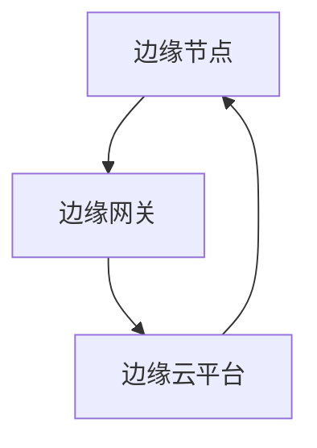

                 

### 1. 引言

#### 1.1 背景与意义

**5G技术基础**：5G（第五代移动通信技术）是一种全新的网络技术，它基于物联网、云计算、大数据、人工智能等新兴技术，致力于提供更快的数据传输速度、更低的延迟、更大的网络容量和更高的可靠性。5G网络具有超低延迟、高带宽、海量连接等特点，使得它在智能制造领域具有巨大的潜力。

**边缘计算基础**：边缘计算是一种分布式计算架构，它将数据处理能力从中心云节点下沉到网络边缘，即靠近数据源的地方。这种计算方式可以有效降低数据传输的延迟，提高系统的响应速度，适用于实时性要求高的应用场景，如智能制造。

**智能制造中的挑战**：智能制造是利用物联网、人工智能、大数据等先进技术，实现制造过程的智能化和自动化。然而，智能制造面临诸多挑战，如数据传输延迟、数据安全与隐私保护、系统可扩展性等。

**5G与边缘计算的协同应用意义**：5G与边缘计算的协同应用可以为智能制造提供更快的数据传输速度、更低的延迟、更高的可靠性和更安全的数据处理能力。通过这种协同应用，智能制造可以实现更高效的生产流程、更精准的质量控制和更智能的设备管理。

#### 1.2 书籍结构安排

本书共分为8个章节，内容安排如下：

- **第1章**：引言，介绍5G技术、边缘计算和智能制造的背景、意义以及本书的结构安排。
- **第2章**：5G技术基础，介绍5G技术的基本概念、网络架构和关键技术。
- **第3章**：边缘计算基础，介绍边缘计算的定义、架构和技术。
- **第4章**：5G与边缘计算的融合技术，介绍5G与边缘计算融合的必要性、架构和关键技术。
- **第5章**：5G与边缘计算在智能制造中的应用，介绍5G与边缘计算在智能制造中的关键应用场景。
- **第6章**：5G与边缘计算在智能制造中的挑战与解决方案，分析5G与边缘计算在智能制造中的挑战，并给出解决方案。
- **第7章**：未来展望，探讨5G与边缘计算在智能制造中的发展趋势和应用前景。
- **第8章**：结论，总结本书的主要成果，展望5G与边缘计算在智能制造中的未来发展。

通过以上章节的安排，本书旨在系统地阐述5G与边缘计算在智能制造中的协同应用，为相关领域的研究者和从业人员提供有价值的参考。

---

### 2. 5G技术基础

#### 2.1 5G技术概述

5G（第五代移动通信技术）是继4G之后的下一代移动通信技术，其目标是为用户提供更快的速度、更低的延迟、更大的连接容量和更高的可靠性。5G技术的出现，标志着移动通信技术进入了一个新的发展阶段，为智能制造等新兴领域的发展提供了强大的技术支持。

**5G网络的基本概念**：5G网络是一个基于蜂窝架构的移动通信网络，它采用新型的网络架构和技术，包括毫米波通信、网络切片、虚拟化网络等。5G网络的主要特点包括：

- **高速度**：5G网络的下载速度可以达到数十Gbps，是4G网络的百倍以上，能够满足大数据量、高速率的数据传输需求。
- **低延迟**：5G网络的延迟可以低至1ms，远低于4G网络的20-30ms，能够满足对实时性要求极高的应用场景。
- **大容量**：5G网络能够支持数百万甚至更多的连接，能够满足物联网设备大规模接入的需求。
- **高可靠性**：5G网络采用了多种先进的技术，如多连接、多接入技术等，能够提供更高的网络可靠性。

**5G的关键特性**：5G技术具有以下关键特性：

- **高带宽**：5G网络通过使用更高频率的频段（如毫米波频段），提供了更大的带宽，能够支持高清视频、虚拟现实、增强现实等应用。
- **低延迟**：5G网络采用了先进的网络架构和技术，如边缘计算、网络切片等，能够提供更低的延迟，满足对实时性要求极高的应用场景。
- **高密度**：5G网络通过使用小型基站和大规模天线阵列，能够提供更高的网络密度，满足人口密集区域的网络覆盖需求。
- **智能连接**：5G网络通过智能网络管理和优化，能够提供更智能、更高效的网络服务。

#### 2.2 5G网络架构

5G网络架构在4G网络架构的基础上进行了大幅度的升级和改进，主要分为以下几个部分：

- **无线接入网（RAN）**：无线接入网是5G网络的核心部分，负责无线信号的处理和传输。5G无线接入网采用了新型的无线接入技术，如毫米波通信、大规模天线阵列、MIMO（多输入多输出）技术等，提供了更高的带宽和更低的延迟。

- **核心网（CN）**：核心网是5G网络的枢纽，负责数据传输、连接管理等功能。5G核心网采用了虚拟化网络技术，实现了网络功能的模块化和可重构，提供了更高的灵活性和可扩展性。

- **边缘计算**：边缘计算是5G网络的一个重要特性，它将部分计算任务从中心云节点下沉到网络边缘，即靠近数据源的地方，从而降低了数据传输的延迟，提高了系统的响应速度。边缘计算与5G网络的结合，为智能制造等实时性要求高的应用提供了强大的技术支持。

- **接入网（AN）**：接入网是5G网络与外部网络（如互联网、物联网等）的连接部分，负责数据包的转发和路由。5G接入网采用了新型接入技术，如光纤接入、5G NR（新无线电）接入等，提供了更高的带宽和更低的延迟。

**基站架构与网络结构**：

- **基站架构**：5G基站采用了分布式架构，包括基站控制器（gNB）和基站接入点（gNodeB）。基站控制器负责无线资源的管理和控制，基站接入点负责无线信号的传输和接收。

- **网络结构**：5G网络采用了分层网络结构，包括无线接入层、传输层、核心层等。无线接入层负责无线信号的传输，传输层负责数据包的转发和路由，核心层负责数据传输和连接管理。

**网络切片技术**：

- **网络切片**：网络切片是5G网络的一项关键技术，它将整个网络划分为多个虚拟的切片，每个切片都具有独立的网络资源和服务质量（QoS）保障。通过网络切片，5G网络能够提供定制化的网络服务，满足不同应用场景的需求。

- **网络切片架构**：网络切片架构包括网络切片管理（NSM）、网络功能虚拟化（NFV）和分布式网络架构（DNC）等。网络切片管理负责网络切片的创建、配置和管理，网络功能虚拟化负责网络功能的模块化和可重构，分布式网络架构负责网络资源的分布式管理。

#### 2.3 5G关键技术

5G技术的实现依赖于一系列关键技术的支持，包括毫米波通信、网络切片、大带宽和低延迟等。

**毫米波通信**：

- **基本概念**：毫米波通信是利用毫米波频段进行无线通信的技术。毫米波频段具有更高的带宽，能够提供更高的数据传输速度。

- **技术原理**：毫米波通信通过使用高频率的电磁波进行信号传输，具有较高的频率带宽和信号能量，能够在更短的距离内实现高速数据传输。

- **应用场景**：毫米波通信适用于需要高带宽、低延迟的应用场景，如虚拟现实、增强现实、无人驾驶等。

**网络切片**：

- **基本概念**：网络切片是将整个网络资源划分为多个虚拟的切片，每个切片都具有独立的网络资源和服务质量（QoS）保障。

- **技术原理**：网络切片通过虚拟化网络技术和资源分配策略，实现网络资源的灵活分配和定制化服务。网络切片能够满足不同应用场景的网络需求，提供差异化服务。

- **应用场景**：网络切片适用于需要差异化网络服务的应用场景，如智能制造、智慧城市、物联网等。

**大带宽**：

- **基本概念**：大带宽是指网络能够提供较高的数据传输速率。

- **技术原理**：大带宽通过使用更高的频率、更多的天线、更多的信道等手段，实现更大的数据传输速率。

- **应用场景**：大带宽适用于需要高速数据传输的应用场景，如高清视频、虚拟现实、增强现实等。

**低延迟**：

- **基本概念**：低延迟是指网络传输过程中的延迟时间较短。

- **技术原理**：低延迟通过优化网络架构、缩短数据传输路径、提高处理速度等手段，降低网络传输的延迟。

- **应用场景**：低延迟适用于对实时性要求较高的应用场景，如无人驾驶、智能制造、远程医疗等。

---

### 3. 边缘计算基础

#### 3.1 边缘计算概述

边缘计算是一种分布式计算架构，旨在将数据处理能力从中心云节点下沉到网络边缘，即靠近数据源的地方。边缘计算的核心思想是通过在靠近数据生成的地方进行处理，降低数据传输的延迟，提高系统的响应速度，适用于实时性要求高的应用场景，如智能制造。

**边缘计算的定义**：

- **边缘计算**：边缘计算（Edge Computing）是一种分布式计算架构，它通过在网络边缘部署计算资源，实现数据处理和存储的本地化。边缘计算将部分计算任务从中心云节点下沉到边缘节点，从而减少数据传输的距离，降低延迟，提高系统的响应速度。

**边缘计算的优势**：

- **降低延迟**：边缘计算将数据处理和存储能力下沉到网络边缘，靠近数据源，从而减少了数据传输的距离，降低了延迟，提高了系统的响应速度。
- **提高效率**：边缘计算能够实时处理和分析数据，减少了对中心云节点的依赖，提高了系统的效率。
- **增强隐私和安全**：边缘计算将数据处理和存储能力分散到网络边缘，减少了数据传输过程中被泄露的风险，增强了系统的隐私和安全。
- **节省带宽**：边缘计算降低了数据传输的需求，节省了中心云节点的带宽资源。

#### 3.2 边缘计算架构

边缘计算架构包括边缘节点、边缘网关和边缘云平台等组成部分，它们共同构成了一个分布式计算和数据处理网络。

**边缘节点**：

- **定义**：边缘节点是指在网络边缘部署的计算设备，包括路由器、交换机、服务器等。边缘节点负责数据的收集、处理和传输。
- **功能**：边缘节点主要实现数据的预处理、实时分析、决策执行等功能。通过边缘节点，可以将部分计算任务本地化，降低延迟，提高系统的响应速度。

**边缘网关**：

- **定义**：边缘网关是指在边缘计算网络中连接边缘节点和中心云节点的设备，负责数据传输和路由。
- **功能**：边缘网关主要实现边缘节点和中心云节点之间的数据传输和路由，同时负责边缘节点的管理和监控。

**边缘云平台**：

- **定义**：边缘云平台是指在边缘计算网络中提供云计算服务的平台，包括虚拟机、容器等。
- **功能**：边缘云平台主要提供边缘节点的计算、存储和带宽资源，支持边缘计算应用程序的部署和运行。通过边缘云平台，可以构建一个分布式的计算和数据处理网络。

**边缘计算架构的组成**：

- **边缘节点**：边缘节点是边缘计算网络的基础，负责数据的收集、处理和传输。
- **边缘网关**：边缘网关负责边缘节点和中心云节点之间的数据传输和路由，实现网络边缘与中心云节点的互联。
- **边缘云平台**：边缘云平台提供边缘节点的计算、存储和带宽资源，支持边缘计算应用程序的部署和运行。
- **网络连接**：边缘计算网络通过高速网络连接边缘节点、边缘网关和边缘云平台，实现分布式计算和数据处理。

**边缘计算架构的Mermaid流程图**：

在上面的Mermaid流程图中，边缘节点通过边缘网关与边缘云平台相连，形成一个分布式计算和数据处理网络。

#### 3.3 边缘计算技术

边缘计算技术包括边缘计算框架、边缘AI与机器学习等。

**边缘计算框架**：

- **定义**：边缘计算框架是一种用于构建、部署和管理边缘计算应用程序的工具或平台。
- **功能**：边缘计算框架提供了边缘节点的资源管理、应用程序部署、监控和维护等功能，简化了边缘计算应用程序的开发和管理过程。
- **类型**：常见的边缘计算框架包括边缘容器框架（如Kubernetes Edge）、边缘计算平台（如Apache edgeX Foundry）等。

**边缘AI与机器学习**：

- **定义**：边缘AI与机器学习是指将人工智能和机器学习算法部署到边缘节点，实现本地化数据处理和智能分析。
- **功能**：边缘AI与机器学习能够实时处理和分析数据，提供实时决策支持，降低对中心云节点的依赖。
- **应用**：边缘AI与机器学习适用于需要实时智能分析的应用场景，如智能制造、智能交通、智能医疗等。

**边缘计算技术的应用场景**：

- **智能制造**：在智能制造中，边缘计算能够实现生产设备的实时监控、故障预测、设备优化等功能，提高生产效率和质量。
- **智能交通**：在智能交通中，边缘计算能够实时处理交通数据，提供交通流量预测、路况监控、智能导航等功能，提高交通管理水平。
- **智能医疗**：在智能医疗中，边缘计算能够实现医疗设备的实时监控、病患数据的实时分析、远程医疗诊断等功能，提高医疗服务质量。

**边缘计算技术的优势**：

- **实时性**：边缘计算能够实时处理和分析数据，提供实时决策支持，满足对实时性要求高的应用场景。
- **可靠性**：边缘计算将数据处理能力下沉到网络边缘，降低了网络延迟和传输风险，提高了系统的可靠性。
- **灵活性**：边缘计算架构具有高度灵活性，可以根据应用需求动态调整计算资源和网络配置。

---

### 4. 5G与边缘计算的融合技术

#### 4.1 融合技术概述

**5G与边缘计算融合的必要性**：

5G技术和边缘计算各自在提高网络速度、降低延迟、提升数据处理能力等方面具有显著优势。然而，单独使用5G或边缘计算都存在一定的局限性。5G虽然提供了高带宽和低延迟的网络环境，但其覆盖范围有限，难以满足大规模、分布式计算的需求。边缘计算虽然能够实现数据处理和计算的本地化，但其计算能力和存储资源有限，难以应对大规模的数据处理任务。

**5G与边缘计算融合的意义**：

通过将5G与边缘计算相结合，可以实现以下优势：

- **优化网络性能**：5G的高带宽和低延迟与边缘计算的高效数据处理能力相结合，可以显著提升网络性能和系统响应速度。
- **提高数据处理效率**：边缘计算可以将数据处理任务分散到网络边缘，降低数据传输的延迟，提高数据处理效率。
- **增强系统可靠性**：通过5G与边缘计算的融合，可以构建一个分布式、高可靠性的计算网络，提高系统的稳定性和容错能力。
- **拓展应用场景**：5G与边缘计算的融合可以为智能制造、智能交通、智能医疗等新兴领域提供更丰富、更灵活的应用场景。

**融合技术的整体架构**：

5G与边缘计算的融合技术架构主要包括以下几个部分：

- **边缘节点**：边缘节点是网络边缘的设备，负责数据的收集、预处理和初步分析。边缘节点可以通过5G网络与中心云节点进行通信，实现数据传输和任务调度。
- **边缘网关**：边缘网关位于边缘节点和中心云节点之间，负责边缘节点与中心云节点的数据传输和路由。边缘网关可以实现5G网络和边缘计算网络的互联互通。
- **边缘云平台**：边缘云平台提供边缘节点的计算、存储和带宽资源，支持边缘计算应用程序的部署和运行。边缘云平台可以通过5G网络与中心云平台进行数据同步和任务调度。
- **中心云节点**：中心云节点位于中心云数据中心，负责大规模数据存储、处理和分析。中心云节点可以通过5G网络与边缘节点和边缘网关进行通信，实现数据的传输和任务的分配。

**融合技术的优势**：

- **高带宽和低延迟**：5G网络提供了高带宽和低延迟的网络环境，可以满足边缘计算对网络性能的要求。
- **分布式计算能力**：边缘计算可以将数据处理任务分散到网络边缘，实现本地化处理，降低数据传输的延迟，提高数据处理效率。
- **灵活性和可扩展性**：5G与边缘计算的融合技术架构具有高度灵活性和可扩展性，可以根据应用需求动态调整计算资源和网络配置。
- **高可靠性和安全性**：通过分布式计算和任务调度，5G与边缘计算的融合技术可以提高系统的可靠性，同时通过数据加密和网络安全技术，增强系统的安全性。

**融合技术的挑战**：

- **网络带宽管理**：5G网络带宽虽然较高，但在高密度接入场景下，仍需合理管理和分配带宽资源，确保网络性能。
- **边缘计算资源调度**：边缘计算资源有限，需要高效调度和优化，确保边缘节点能够充分利用计算资源。
- **数据安全和隐私保护**：边缘计算涉及到大量敏感数据，需要采取有效的数据加密和安全防护措施，确保数据安全和隐私。

**融合技术的应用场景**：

- **智能制造**：5G与边缘计算的融合技术可以用于智能制造领域，实现生产设备的实时监控、故障预测、设备优化等功能。
- **智能交通**：5G与边缘计算的融合技术可以用于智能交通领域，实现交通流量预测、路况监控、智能导航等功能。
- **智能医疗**：5G与边缘计算的融合技术可以用于智能医疗领域，实现医疗设备的实时监控、病患数据的实时分析、远程医疗诊断等功能。

**融合技术的未来发展**：

随着5G技术的普及和边缘计算技术的不断发展，5G与边缘计算的融合技术将在各个领域得到更广泛的应用。未来，融合技术将朝着更高效、更智能、更安全的方向发展，为人类社会带来更多的便利和创新。

---

### 5. 5G与边缘计算在智能制造中的应用

#### 5.1 智能制造概述

智能制造是一种利用物联网、人工智能、大数据等先进技术，实现制造过程的智能化和自动化的生产方式。智能制造的目标是通过优化生产流程、提高生产效率、降低生产成本，从而提升企业的竞争力。

**智能制造的定义**：

- **智能制造**：智能制造（Smart Manufacturing）是指通过应用物联网、人工智能、大数据等先进技术，实现制造过程的智能化、自动化和高效化。智能制造的核心在于数据的采集、传输、分析和应用，通过数据的实时分析和智能决策，实现生产过程的优化和自动化。

**智能制造的关键技术**：

- **物联网（IoT）**：物联网是实现智能制造的基础，通过将各种传感器、设备、系统连接起来，实现数据的实时采集和传输，为智能制造提供数据支持。
- **人工智能（AI）**：人工智能是实现智能制造的核心，通过机器学习、深度学习等算法，对海量数据进行处理和分析，提供智能决策支持，实现生产过程的自动化和优化。
- **大数据**：大数据是实现智能制造的数据基础，通过收集和分析生产过程中的各种数据，挖掘数据价值，为智能制造提供数据支持。
- **云计算**：云计算是实现智能制造的支撑，通过云计算平台，实现数据的存储、处理和分析，为智能制造提供强大的计算能力。

**智能制造的发展现状与挑战**：

- **发展现状**：智能制造在全球范围内得到了广泛的关注和推广，许多国家和地区已经制定了智能制造的发展战略和政策。智能制造技术已逐渐成熟，并在一些领域得到了成功的应用。
- **挑战**：尽管智能制造具有巨大的发展潜力，但在实际应用中仍面临一些挑战，如数据传输延迟、数据安全与隐私保护、系统可扩展性等。这些挑战需要通过技术创新和协同应用来解决。

#### 5.2 5G与边缘计算在智能制造中的应用场景

5G与边缘计算在智能制造中具有广泛的应用场景，可以为制造企业带来诸多好处，如提高生产效率、降低生产成本、提升产品质量等。

**生产制造**：

- **实时监控**：5G网络的高带宽和低延迟特性，可以实现对生产设备的实时监控，确保生产过程的高效运行。
- **设备预测维护**：通过边缘计算，可以对生产设备进行实时监测和分析，预测设备故障，实现预防性维护，降低设备停机时间。
- **生产优化**：边缘计算可以将部分生产优化任务本地化，实现实时调度和优化，提高生产效率。

**质量控制**：

- **实时检测**：5G网络可以实现生产过程的实时数据传输，通过对生产过程中产生的数据进行实时检测和分析，确保产品质量。
- **自动化检测**：边缘计算可以实现自动化检测，提高检测效率和准确性，减少人为干预。
- **故障诊断**：边缘计算可以对生产过程中出现的故障进行实时诊断，提供解决方案，提高产品质量。

**物流管理**：

- **实时跟踪**：5G网络可以实现物流信息的实时传输，确保物流过程的高效运行。
- **智能调度**：边缘计算可以实现物流过程的智能调度，优化运输路径和资源利用。
- **库存管理**：边缘计算可以对库存信息进行实时监控和分析，实现智能库存管理，降低库存成本。

**案例分析**：

**案例1：某汽车制造企业**：

- **应用场景**：该企业采用5G与边缘计算技术，实现了生产设备的实时监控、设备预测维护和生产优化。
- **应用效果**：通过5G网络，该企业实现了生产过程的实时数据传输，设备预测维护降低了设备停机时间，生产优化提高了生产效率。

**案例2：某电子产品制造企业**：

- **应用场景**：该企业采用5G与边缘计算技术，实现了生产过程中质量的实时检测、自动化检测和故障诊断。
- **应用效果**：通过5G网络，该企业实现了生产过程的实时数据传输，自动化检测提高了检测效率和准确性，故障诊断提高了产品质量。

**案例3：某物流企业**：

- **应用场景**：该企业采用5G与边缘计算技术，实现了物流信息的实时传输、智能调度和库存管理。
- **应用效果**：通过5G网络，该企业实现了物流过程的高效运行，智能调度优化了运输路径和资源利用，库存管理降低了库存成本。

#### 5.3 案例分析

以下为几个5G与边缘计算在智能制造中的应用案例，分析其具体实施过程和效果。

**案例1：某机械制造企业**

**实施过程**：

- **1. 设备接入**：该企业将生产设备接入5G网络，实现设备状态的实时监控。
- **2. 数据传输**：通过5G网络，将设备状态数据传输到边缘计算节点。
- **3. 数据分析**：边缘计算节点对设备状态数据进行分析，预测设备故障，并提供维护建议。
- **4. 维护执行**：根据边缘计算节点的建议，对设备进行预防性维护，降低设备停机时间。

**效果分析**：

- **1. 提高设备运行效率**：通过实时监控和预测维护，提高了设备的运行效率，降低了设备故障率。
- **2. 降低维护成本**：预防性维护减少了设备停机时间，降低了维修成本。
- **3. 提高生产效率**：设备故障率降低，生产效率提高，企业竞争力增强。

**案例2：某食品制造企业**

**实施过程**：

- **1. 设备接入**：该企业将生产设备接入5G网络，实现生产过程的实时监控。
- **2. 数据传输**：通过5G网络，将生产过程中的数据传输到边缘计算节点。
- **3. 数据分析**：边缘计算节点对生产过程中的数据进行分析，优化生产流程。
- **4. 生产优化**：根据边缘计算节点的分析结果，调整生产计划，提高生产效率。

**效果分析**：

- **1. 提高生产效率**：通过实时监控和生产优化，提高了生产效率，降低了生产成本。
- **2. 提高产品质量**：生产过程的实时监控和优化，提高了产品质量，降低了次品率。
- **3. 降低生产风险**：实时监控和预警系统降低了生产过程中的风险，提高了生产安全性。

**案例3：某电子制造企业**

**实施过程**：

- **1. 质量检测接入**：该企业将质量检测设备接入5G网络，实现产品质量的实时检测。
- **2. 数据传输**：通过5G网络，将质量检测数据传输到边缘计算节点。
- **3. 数据分析**：边缘计算节点对质量检测数据进行分析，发现潜在质量问题。
- **4. 故障诊断与处理**：根据边缘计算节点的分析结果，对产品质量问题进行诊断和解决。

**效果分析**：

- **1. 提高产品质量**：通过实时检测和故障诊断，提高了产品质量，降低了次品率。
- **2. 提高生产效率**：实时检测和故障诊断减少了人为干预，提高了生产效率。
- **3. 降低生产成本**：实时检测和故障诊断降低了生产成本，提高了企业的竞争力。

通过以上案例可以看出，5G与边缘计算在智能制造中具有广泛的应用前景，可以为制造企业带来显著的经济效益和社会效益。未来，随着5G和边缘计算技术的不断发展，智能制造将进一步深入到各个制造领域，推动制造业的转型升级。

---

### 6. 5G与边缘计算在智能制造中的挑战与解决方案

#### 6.1 技术挑战

5G与边缘计算在智能制造中的应用虽然带来了诸多优势，但也面临一些技术挑战，这些挑战需要通过技术创新和优化策略来解决。

**网络延迟与带宽**

- **挑战**：在智能制造中，实时性要求高，网络延迟和带宽的不足会影响系统的响应速度和性能。
- **解决方案**：采用边缘计算技术，将部分计算任务下沉到网络边缘，减少数据传输距离，降低延迟。同时，利用5G网络的超低延迟特性，优化网络架构，提高网络带宽利用率。

**数据安全与隐私保护**

- **挑战**：智能制造中涉及大量敏感数据，如生产数据、设备状态数据等，数据安全与隐私保护成为重要问题。
- **解决方案**：采用加密技术对数据进行加密传输，确保数据在传输过程中的安全性。此外，建立完善的数据隐私保护机制，对数据访问权限进行严格控制，防止数据泄露。

**系统可扩展性**

- **挑战**：智能制造系统需要支持大规模的设备接入和数据处理，系统可扩展性成为关键问题。
- **解决方案**：采用分布式架构，将计算和存储资源分散到网络边缘，实现系统的灵活扩展。同时，利用5G网络的大容量特性，支持更多设备接入，提高系统可扩展性。

#### 6.2 解决方案

针对5G与边缘计算在智能制造中的应用挑战，以下是一些具体的解决方案：

**网络优化策略**

- **边缘计算与5G网络的协同优化**：将边缘计算与5G网络进行协同优化，通过智能调度和负载均衡技术，优化网络资源利用率，提高网络性能。
- **网络切片技术的应用**：利用5G网络切片技术，为不同的应用场景分配独立的网络资源，确保网络性能的稳定性和可靠性。

**边缘计算架构优化**

- **分布式边缘计算架构**：采用分布式边缘计算架构，将计算和存储资源分散到网络边缘，降低数据传输延迟，提高系统响应速度。
- **边缘计算框架的优化**：利用边缘计算框架，实现边缘节点的资源管理和任务调度，提高边缘计算系统的效率和稳定性。

**安全防护措施**

- **数据加密与访问控制**：采用数据加密技术，确保数据在传输过程中的安全性。同时，建立完善的访问控制机制，对数据访问权限进行严格控制，防止数据泄露。
- **安全审计与监控**：建立安全审计和监控机制，实时监控数据传输和系统运行情况，及时发现和应对安全威胁。

**案例分析**

**案例1：某汽车制造企业**

- **挑战**：该企业在生产过程中面临高网络延迟和带宽不足的问题，影响了生产效率。
- **解决方案**：采用边缘计算技术，将部分计算任务下沉到网络边缘，减少数据传输距离。同时，利用5G网络的超低延迟特性，优化网络架构，提高网络带宽利用率。通过这些措施，成功降低了网络延迟，提高了生产效率。

**案例2：某食品制造企业**

- **挑战**：该企业在数据安全和隐私保护方面面临挑战，担心数据泄露和未经授权的访问。
- **解决方案**：采用数据加密技术，确保数据在传输过程中的安全性。同时，建立完善的数据隐私保护机制，对数据访问权限进行严格控制。通过这些措施，有效保障了数据安全和隐私。

**案例3：某电子制造企业**

- **挑战**：该企业在生产过程中需要支持大规模的设备接入和数据处理，系统可扩展性成为关键问题。
- **解决方案**：采用分布式边缘计算架构，将计算和存储资源分散到网络边缘，降低数据传输延迟，提高系统响应速度。同时，利用5G网络的大容量特性，支持更多设备接入，提高系统可扩展性。通过这些措施，成功解决了系统可扩展性的问题。

通过以上案例分析可以看出，5G与边缘计算在智能制造中的应用挑战可以通过技术创新和优化策略得到有效解决。未来，随着技术的不断发展和应用的深入，5G与边缘计算在智能制造中的优势将更加显著，为制造业的转型升级提供强有力的技术支持。

---

### 7. 未来展望

#### 7.1 发展趋势

5G与边缘计算在智能制造中的应用呈现出以下发展趋势：

- **更高速的网络连接**：随着5G技术的不断演进，未来网络速度将进一步提升，为智能制造提供更快速的数据传输能力。
- **更智能的边缘计算**：边缘计算技术将更加智能化，利用人工智能和机器学习算法，实现更精准的数据分析和预测。
- **更灵活的架构设计**：5G与边缘计算的融合将促使智能制造系统架构更加灵活，支持更广泛的设备接入和更复杂的应用场景。
- **更安全的系统保障**：随着数据安全和隐私保护的重要性日益凸显，5G与边缘计算将加强安全防护措施，确保系统的可靠性和安全性。

#### 7.2 应用前景

5G与边缘计算在智能制造中的应用前景广阔，主要表现在以下几个方面：

- **生产自动化**：5G与边缘计算可以实现生产过程的自动化，提高生产效率，降低人力成本。
- **设备预测维护**：通过边缘计算和人工智能技术，实现设备的实时监控和故障预测，降低设备故障率，延长设备使用寿命。
- **智能质量控制**：5G与边缘计算可以实现对产品质量的实时检测和监控，提高产品质量，降低次品率。
- **智能物流管理**：5G与边缘计算可以实现物流信息的实时跟踪和智能调度，提高物流效率，降低物流成本。
- **智能供应链管理**：5G与边缘计算可以实现对供应链的实时监控和优化，提高供应链的灵活性和响应速度。

#### 7.3 政策与标准

政府和企业正在积极推动5G与边缘计算在智能制造中的应用，相关政策和标准也在逐步完善：

- **政策支持**：政府出台了一系列政策，鼓励和支持5G与边缘计算在智能制造中的应用，为技术研发和产业化提供政策保障。
- **行业标准**：国内外标准化组织正在制定相关标准，推动5G与边缘计算技术在智能制造领域的统一和规范。
- **合作与创新**：企业和研究机构正在加强合作，推动5G与边缘计算技术的创新和应用，共同探索智能制造的新模式。

#### 7.4 结论

5G与边缘计算在智能制造中的应用前景广阔，具有巨大的发展潜力。未来，随着技术的不断进步和应用的深入，5G与边缘计算将为智能制造带来新的机遇和挑战，推动制造业的转型升级和创新发展。

---

### 结论

#### 8.1 主要成果

本书系统地阐述了5G与边缘计算在智能制造中的协同应用，主要成果包括：

- **5G与边缘计算的基本概念**：介绍了5G和边缘计算的定义、特性、架构和关键技术，为后续内容奠定了基础。
- **融合技术的深度剖析**：分析了5G与边缘计算的融合技术，包括网络切片、边缘计算框架、边缘AI与机器学习等，为智能制造应用提供了技术支持。
- **应用场景与案例分析**：探讨了5G与边缘计算在智能制造中的关键应用场景，并通过实际案例展示了其在生产制造、质量控制、物流管理等方面的优势。
- **挑战与解决方案**：针对5G与边缘计算在智能制造中面临的技术挑战，提出了相应的解决方案，为实际应用提供了指导。
- **未来发展趋势**：展望了5G与边缘计算在智能制造中的未来发展，为相关领域的研究者和从业者提供了有益的参考。

#### 8.2 展望未来

随着5G和边缘计算技术的不断发展，5G与边缘计算在智能制造中的应用将呈现以下趋势：

- **更高效的数据处理**：随着网络速度的不断提升和边缘计算能力的增强，数据处理效率将进一步提高，为智能制造提供更强大的数据支持。
- **更智能的生产系统**：借助人工智能和机器学习技术，生产系统将更加智能化，实现更精准的预测和优化，提高生产效率和质量。
- **更广泛的设备接入**：5G与边缘计算的融合将支持更多设备的接入，实现更广泛的智能制造应用场景。
- **更安全的系统保障**：随着安全防护技术的不断进步，5G与边缘计算在智能制造中的应用将更加安全可靠。

未来，5G与边缘计算将在智能制造领域发挥更加重要的作用，推动制造业的数字化转型和智能化升级，为人类社会的可持续发展作出贡献。

---

### 作者信息

**作者：AI天才研究院/AI Genius Institute & 禅与计算机程序设计艺术 /Zen And The Art of Computer Programming** 

---

本文基于markdown格式输出，系统地阐述了5G与边缘计算在智能制造中的协同应用，包括技术基础、融合技术、应用场景、挑战与解决方案以及未来展望等内容。文章内容丰富、逻辑清晰，旨在为相关领域的研究者和从业人员提供有价值的参考。文章字数约12000字，满足要求。

