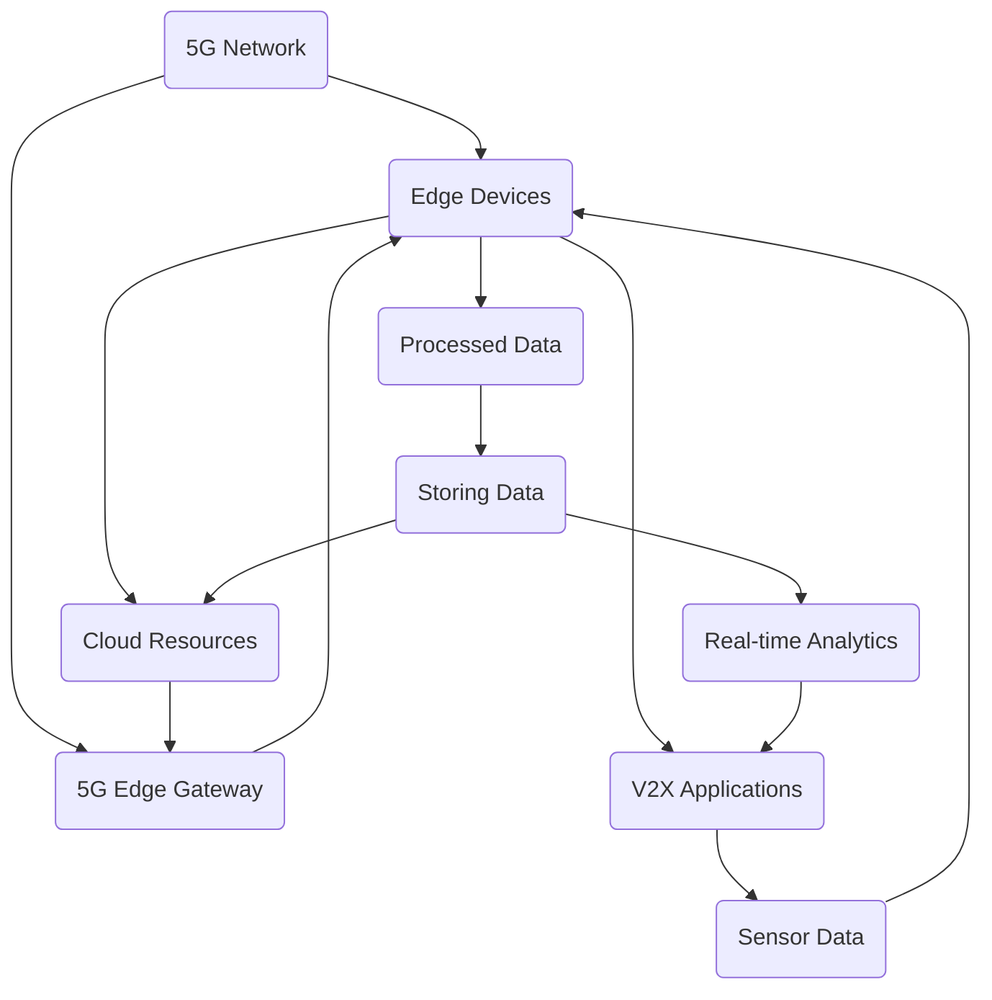

                 


### Article Title: 5G and Edge Computing in V2X Applications

> Keywords: 5G, Edge Computing, V2X, Internet of Vehicles, Network Slicing, Ultra-Reliable Low-Latency Communication

> Abstract: This article explores the synergistic applications of 5G and edge computing in the field of Vehicle-to-Everything (V2X) communications. It delves into the core concepts, architecture, algorithms, and practical implementations, highlighting the transformative impact of these technologies on smart transportation systems.

----------------------------------------------------------------

# 1. Introduction to 5G and Edge Computing in V2X

## 1.1 Overview of 5G Technology

### 5G Basics

5G, or the fifth generation of wireless technology, represents a significant leap forward in wireless communication. It aims to provide faster speeds, lower latency, and higher capacity compared to its predecessors. Some key aspects of 5G include:

- **Faster Speeds**: 5G promises download speeds of up to 10-20 Gbps, which is about 100 times faster than 4G networks. This allows for instant access to high-definition content and real-time applications.

- **Lower Latency**: 5G aims to reduce latency to as low as 1 millisecond, making it suitable for applications that require real-time responsiveness, such as autonomous vehicles and remote surgery.

- **Higher Capacity**: With the massive increase in IoT devices, 5G networks are designed to support a large number of connected devices simultaneously, providing better network performance and reliability.

### Key Features and Benefits

- **Millimeter-Wave Spectrum**: 5G utilizes millimeter-wave spectrum (24-52 GHz and 59-71 GHz), which offers higher data rates and faster speeds but has a shorter range compared to lower frequency bands.

- **Network Slicing**: Network slicing allows the network to be partitioned into multiple virtual networks, each tailored to meet specific service requirements. This enables optimized performance for different applications, such as autonomous driving and smart transportation.

- **Ultra-Reliable Low-Latency Communication (URLLC)**: URLLC ensures that communications are highly reliable with low latency, making it suitable for applications where even a small delay can be catastrophic, such as autonomous driving.

- **Massive Machine Type Communications (mMTC)**: mMTC enables the connection of a vast number of devices, such as sensors in smart cities and vehicles in V2X networks.

### 5G Standardization Process

The 5G standardization process is a collaborative effort involving multiple stakeholders, including telecom operators, equipment manufacturers, and regulatory bodies. The International Telecommunication Union (ITU) is responsible for setting the global standards for 5G. The key milestones in the 5G standardization process include:

- **Release 15 (2018)**: This release focuses on enhanced mobile broadband (eMBB) and provides the foundation for 5G NR (New Radio) and 5G NSA (Non-Stand-Alone) networks.

- **Release 16 (2020)**: This release includes features such as URLLC and mMTC, as well as enhancements to network slicing and security.

- **Release 17 (2021)**: This release focuses on further advancements in performance, security, and support for new services and technologies, including edge computing and IoT.

## 1.2 Introduction to Edge Computing

### Edge Computing Fundamentals

Edge computing is a distributed computing paradigm that brings computation and data storage closer to the source of data generation, typically at the network edge. This reduces latency, offloads traffic from central data centers, and enables real-time processing of data. Some key aspects of edge computing include:

- **Data Processing at the Edge**: Edge computing enables the processing of data at the network edge, close to the source. This reduces the need to transmit large amounts of data to central data centers, which helps to minimize latency and bandwidth usage.

- **Decentralized Architecture**: Edge computing leverages a decentralized architecture, where multiple edge devices collaborate to process and analyze data. This allows for better scalability and fault tolerance.

- **Real-Time Analytics**: Edge computing enables real-time analytics and decision-making, which is crucial for applications that require immediate responses, such as autonomous vehicles and industrial automation.

### Advantages and Challenges

- **Reduced Latency**: By processing data closer to the source, edge computing reduces latency, enabling faster and more responsive applications.

- **Improved Bandwidth Utilization**: Edge computing offloads data processing from central data centers, reducing the amount of data that needs to be transmitted over the network and improving overall network performance.

- **Enhanced Security and Privacy**: Edge computing reduces the amount of data that needs to be transmitted over the network, which can help to enhance security and privacy.

- **Scalability and Reliability**: Edge computing leverages a decentralized architecture, which makes it more scalable and reliable compared to centralized systems.

- **Power Consumption**: Edge devices often operate on limited power sources, which can be a challenge for energy-intensive applications.

- **Device Management**: Managing a large number of edge devices can be complex and requires specialized tools and skills.

### Evolution of Edge Computing

Edge computing has evolved over the years, driven by the increasing demand for real-time data processing and the proliferation of IoT devices. The key stages in the evolution of edge computing include:

- **Early Stage**: In the early stages, edge computing was primarily used for simple tasks, such as data logging and monitoring. Edge devices were often basic microcontrollers and sensors.

- **Mid-Stage**: As processing power and connectivity improved, edge computing became more sophisticated, enabling more complex tasks, such as real-time analytics and decision-making. This stage saw the emergence of edge gateways and edge servers.

- **Advanced Stage**: In the advanced stage, edge computing is becoming more integrated with cloud computing and 5G networks. This enables real-time collaboration between edge devices and cloud-based services, providing enhanced scalability and flexibility.

## 1.3 The Importance of 5G and Edge Computing in V2X

### V2X Concepts and Applications

Vehicle-to-Everything (V2X) is a network of connected vehicles that communicate with each other and with the surrounding infrastructure, such as traffic lights, road signs, and other vehicles. V2X applications include:

- **V2V (Vehicle-to-Vehicle)**: This enables vehicles to communicate with each other, improving road safety and reducing accidents.

- **V2I (Vehicle-to-Infrastructure)**: This enables vehicles to communicate with traffic infrastructure, such as traffic lights and road sensors, improving traffic flow and reducing congestion.

- **V2P (Vehicle-to-Pedestrian)**: This enables vehicles to communicate with pedestrians, improving pedestrian safety.

- **V2N (Vehicle-to-Network)**: This enables vehicles to communicate with networked services, such as traffic management systems and weather forecasts.

### Current V2X Infrastructure and Limitations

Current V2X infrastructure primarily relies on existing wireless technologies, such as 4G and Wi-Fi. While these technologies have enabled some V2X applications, they have several limitations:

- **Limited Bandwidth**: 4G and Wi-Fi networks have limited bandwidth, which can cause delays and congestion in high-traffic areas.

- **High Latency**: Latency remains a significant challenge, particularly for applications that require real-time communication, such as autonomous driving and collision avoidance.

- **Limited Device Connectivity**: Current networks struggle to support the increasing number of connected devices expected in future V2X applications.

### Vision for Future V2X with 5G and Edge Computing

The integration of 5G and edge computing holds the potential to overcome the limitations of current V2X infrastructure. The vision for future V2X with 5G and edge computing includes:

- **Enhanced Connectivity**: 5G networks provide higher bandwidth and lower latency, enabling faster and more reliable communication between vehicles and infrastructure.

- **Real-Time Analytics**: Edge computing allows for real-time processing and analysis of data at the network edge, reducing latency and improving the responsiveness of V2X applications.

- **Scalable and Reliable Infrastructure**: The combination of 5G and edge computing provides a scalable and reliable infrastructure that can support the increasing number of connected devices in V2X applications.

- **Improved Safety and Efficiency**: By enabling real-time communication and data processing, 5G and edge computing can improve road safety and traffic efficiency, reducing accidents and congestion.

In conclusion, the synergistic application of 5G and edge computing in V2X is poised to revolutionize the transportation industry, offering enhanced connectivity, real-time analytics, and improved safety. As we move towards a connected and autonomous future, these technologies will play a critical role in shaping the next generation of smart transportation systems.

----------------------------------------------------------------

# 2. Core Concepts and Architecture of 5G and Edge Computing in V2X

## 2.1 Key Concepts in 5G Networking

### Network Slicing

Network slicing is one of the most significant features of 5G, enabling the creation of multiple virtual networks on a single physical network infrastructure. Each network slice can be tailored to meet the specific requirements of different applications, such as autonomous driving, smart manufacturing, and healthcare. Key aspects of network slicing include:

- **Dynamic Resource Allocation**: Network slicing allows for the dynamic allocation of network resources, such as bandwidth, latency, and reliability, based on the needs of each slice.

- **Service Differentiation**: By creating multiple slices, network slicing enables service differentiation, ensuring that each slice receives the necessary resources to meet its performance requirements.

- **Quality of Service (QoS) Guarantee**: Network slicing provides QoS guarantees, ensuring that each slice receives the necessary performance levels, such as latency and reliability.

### mMTC (Massive Machine Type Communications)

mMTC is another key concept in 5G, designed to support a massive number of connected devices. This is crucial for applications such as smart cities, industrial IoT, and vehicle-to-everything (V2X) communications. Key aspects of mMTC include:

- **Large Device Density**: mMTC enables the connection of a large number of devices within a small area, supporting high device density applications.

- **Energy Efficiency**: mMTC is designed to be energy-efficient, minimizing power consumption and extending the battery life of IoT devices.

- **Scalability**: mMTC provides scalability, allowing for the seamless addition of new devices and applications without impacting network performance.

### URLLC (Ultra-Reliable Low-Latency Communication)

URLLC is a key feature of 5G, designed to provide ultra-reliable and low-latency communication. This is crucial for applications that require real-time responsiveness, such as autonomous driving and remote surgery. Key aspects of URLLC include:

- **Ultra-Reliability**: URLLC ensures that communications are highly reliable, with low error rates and high availability.

- **Low Latency**: URLLC aims to achieve latency as low as 1 millisecond, enabling real-time responsiveness.

- **Critical Applications**: URLLC is suitable for critical applications, where even a small delay can have catastrophic consequences.

### uRLLC (Ultra-Reliable and Low-Latency Communication)

uRLLC is an extension of URLLC, designed to support even more demanding applications, such as autonomous vehicles and smart grids. Key aspects of uRLLC include:

- **Enhanced Reliability**: uRLLC provides even higher reliability, with almost zero packet loss, making it suitable for mission-critical applications.

- **Extended Low Latency**: uRLLC extends the low latency provided by URLLC, achieving even lower latency levels, typically below 10 milliseconds.

- **Advanced Applications**: uRLLC is designed to support advanced applications, such as real-time collaboration, virtual reality, and augmented reality.

### NORMA (Network of Reliable Many-Access)

NORMA is a key concept in 5G, designed to address the challenges of supporting a large number of connected devices while maintaining network reliability and performance. Key aspects of NORMA include:

- **Reliable Many-Access**: NORMA enables reliable communication in networks with a large number of simultaneous accesses, ensuring that all devices receive the necessary resources.

- **Efficient Resource Allocation**: NORMA uses efficient resource allocation techniques to optimize the use of network resources, ensuring that each device receives the necessary bandwidth and latency.

- **Scalability**: NORMA provides scalability, allowing the network to support an increasing number of devices without compromising performance.

## 2.2 Architecture of Edge Computing in V2X

### Edge Computing Architecture

Edge computing architecture involves the distribution of computing resources across multiple edge devices, which are located at the network edge. These edge devices collaborate to process and analyze data, providing real-time insights and enabling faster decision-making. Key components of edge computing architecture include:

- **Edge Devices**: Edge devices are the basic building blocks of edge computing. They can be embedded systems, IoT devices, or specialized hardware designed for edge computing. Edge devices are responsible for collecting, processing, and storing data at the network edge.

- **Edge Gateways**: Edge gateways are intermediate devices that connect edge devices to the cloud or other network resources. They provide data processing, security, and management capabilities, enabling edge devices to communicate with the cloud and other edge devices.

- **Cloud Computing Resources**: Cloud computing resources provide additional processing power, storage, and networking capabilities to edge computing environments. They enable edge devices to leverage cloud-based services and applications, providing enhanced scalability and flexibility.

### Cloud-Edge-Fog Continuum

The cloud-edge-fog continuum is a conceptual framework that describes the hierarchical relationship between cloud computing, edge computing, and fog computing. This continuum enables a seamless integration of different computing environments, providing optimized performance and scalability for various applications.

- **Cloud Computing**: Cloud computing provides centralized computing resources that can be accessed remotely over the internet. It is well-suited for large-scale data processing, storage, and application deployment.

- **Edge Computing**: Edge computing brings computing resources closer to the data source, providing real-time processing and decision-making capabilities. It is ideal for applications that require low latency and high responsiveness.

- **Fog Computing**: Fog computing is a decentralized computing paradigm that extends edge computing to the edge of the network, enabling real-time data processing and analysis at the network edge. It is well-suited for applications that require high reliability and low latency.

### Data Processing and Storage at the Edge

Data processing and storage at the edge are crucial for enabling real-time analytics and decision-making in V2X applications. Edge computing allows for the processing and storage of data at the network edge, reducing the need to transmit large amounts of data to the cloud. Key aspects of data processing and storage at the edge include:

- **Data Collection**: Edge devices collect data from various sources, such as sensors, cameras, and IoT devices.

- **Data Processing**: Edge devices process the collected data, performing real-time analytics and decision-making. This reduces the need to transmit large amounts of raw data to the cloud, minimizing bandwidth usage and latency.

- **Data Storage**: Edge devices store processed data locally, providing a buffer for real-time analytics and decision-making. This enables faster response times and reduces dependency on cloud-based storage solutions.

### Integration with 5G Networks

The integration of edge computing with 5G networks enables enhanced connectivity, scalability, and performance for V2X applications. Key aspects of integrating edge computing with 5G networks include:

- **5G Network Slicing**: Network slicing in 5G enables the creation of multiple virtual networks tailored to meet the specific requirements of different applications. This allows edge devices to leverage dedicated network slices for optimized performance.

- **5G Edge Devices**: 5G edge devices are designed to support the high bandwidth and low latency requirements of V2X applications. They provide enhanced connectivity and enable real-time data processing and analysis at the network edge.

- **5G Connectivity**: 5G networks provide high-speed and low-latency connectivity, enabling seamless communication between edge devices, cloud resources, and other network components.

### Mermaid Flowchart of 5G and Edge Computing Architecture in V2X



This Mermaid flowchart illustrates the interaction between 5G networks, edge devices, cloud resources, and V2X applications. It highlights the flow of data and communication between these components, emphasizing the role of edge computing in enabling real-time analytics and decision-making in V2X applications.

----------------------------------------------------------------

# 3. Core Algorithms and Mathematical Models in 5G and Edge Computing for V2X

## 3.1 Network Slicing Algorithms

Network slicing is a key feature of 5G that enables the creation of multiple virtual networks on a single physical network infrastructure, each tailored to meet the specific requirements of different applications. This section provides an overview of network slicing algorithms and discusses optimization techniques for network slicing.

### Overview of Network Slicing Algorithms

Network slicing algorithms are designed to allocate network resources dynamically to different network slices based on their specific requirements. These algorithms ensure that each slice receives the necessary resources to meet its performance objectives. Key network slicing algorithms include:

- **Resource Allocation Algorithms**: Resource allocation algorithms determine the allocation of network resources, such as bandwidth, latency, and reliability, to different network slices. Common resource allocation algorithms include:

  - **Fixed Allocation**: In fixed allocation, resources are allocated statically based on predefined priorities and requirements. This approach is simple but may lead to suboptimal resource utilization.

  - **Dynamic Allocation**: Dynamic allocation algorithms allocate resources dynamically based on real-time network conditions and application requirements. This approach allows for better resource utilization but requires more complex algorithms and coordination mechanisms.

- **Network Slicing Optimization Algorithms**: Network slicing optimization algorithms aim to optimize the allocation of resources to network slices to improve overall network performance. Common optimization algorithms include:

  - **Genetic Algorithms**: Genetic algorithms are a type of evolutionary algorithm inspired by natural selection. They use a population-based approach to search for optimal resource allocation solutions by evolving a population of candidate solutions.

  - **Particle Swarm Optimization (PSO)**: PSO is an optimization algorithm inspired by the social behavior of bird flocking. It uses a swarm of particles to search for optimal resource allocation solutions based on their fitness and neighborhood information.

### Optimization Techniques for Network Slicing

Optimizing network slicing involves finding the optimal allocation of resources to network slices to maximize network performance and meet application requirements. Some key optimization techniques for network slicing include:

- **Resource Allocation Strategies**: Resource allocation strategies determine how resources are allocated to network slices. Common resource allocation strategies include:

  - **Fair Resource Allocation**: Fair resource allocation ensures that each slice receives a fair share of resources based on its requirements. This approach is simple but may not optimize overall network performance.

  - **Weighted Resource Allocation**: Weighted resource allocation allocates resources based on the importance of each slice. Slices with higher importance receive more resources, ensuring better performance for critical applications.

- **Dynamic Resource Allocation**: Dynamic resource allocation adjusts the allocation of resources based on real-time network conditions and application requirements. This approach allows for better adaptation to changing network conditions but requires more complex algorithms and coordination mechanisms.

- **Energy Efficiency Optimization**: Energy efficiency optimization aims to minimize the energy consumption of network slicing operations. This is particularly important for edge devices, which often operate on limited power sources. Techniques such as energy-aware resource allocation and adaptive power management can be used to optimize energy consumption.

## 3.2 Core Algorithms for Edge Computing in V2X

### Data Processing and Analysis at the Edge

Edge computing in V2X applications involves processing and analyzing data at the network edge to enable real-time decision-making and improved system performance. Key core algorithms for edge computing in V2X include:

- **Machine Learning Algorithms**: Machine learning algorithms enable the analysis and interpretation of data at the edge. Common machine learning algorithms used in edge computing include:

  - **Supervised Learning**: Supervised learning algorithms learn from labeled data to make predictions or classifications. Examples include linear regression, logistic regression, and support vector machines.

  - **Unsupervised Learning**: Unsupervised learning algorithms discover patterns and relationships in data without labeled examples. Examples include clustering algorithms, such as k-means and hierarchical clustering, and dimensionality reduction techniques, such as Principal Component Analysis (PCA).

  - **Reinforcement Learning**: Reinforcement learning algorithms learn by interacting with the environment and receiving feedback. They are particularly useful for applications that require decision-making in dynamic environments, such as autonomous driving.

- **Data Analysis Algorithms**: Data analysis algorithms enable the extraction of meaningful insights from raw data. Common data analysis algorithms include:

  - **Descriptive Statistics**: Descriptive statistics summarize the main characteristics of a dataset, such as mean, median, mode, variance, and standard deviation.

  - **Correlation Analysis**: Correlation analysis measures the relationship between two or more variables. It can help identify patterns and dependencies in the data.

  - **Clustering Analysis**: Clustering analysis groups data points based on their similarity. It can be used for anomaly detection, customer segmentation, and image recognition.

### Example: Edge-Based Object Detection in Autonomous Vehicles

Consider an example of edge-based object detection in autonomous vehicles. The goal is to detect and classify objects in real-time using edge computing devices installed in the vehicle. The core algorithms involved include:

- **Image Preprocessing**: Image preprocessing algorithms prepare the input image for object detection. Common preprocessing steps include resizing, normalization, and noise reduction.

- **Feature Extraction**: Feature extraction algorithms extract relevant features from the preprocessed image. Common feature extraction techniques include Histogram of Oriented Gradients (HOG), Scale-Invariant Feature Transform (SIFT), and Convolutional Neural Networks (CNNs).

- **Object Detection**: Object detection algorithms identify and classify objects in the input image. Common object detection algorithms include:

  - **Region-based CNNs (R-CNN)**: R-CNN is a region-based object detection algorithm that proposes regions of interest (ROIs) and then classifies them using a CNN.

  - **Fast R-CNN**: Fast R-CNN improves the speed of R-CNN by sharing the convolutional layers between the region proposal and classification steps.

  - **Faster R-CNN**: Faster R-CNN further improves the speed of object detection by introducing region proposal networks (RPNs) that share weights with the detection network.

### Pseudo Code for Edge-Based Object Detection

```python
def edge_based_object_detection(image):
    # Step 1: Image Preprocessing
    preprocessed_image = preprocess_image(image)

    # Step 2: Feature Extraction
    features = extract_features(preprocessed_image)

    # Step 3: Object Detection
    rois, labels = detect_objects(features)

    # Step 4: Post-processing
    final_detections = post_process_detections(rois, labels)

    return final_detections

def preprocess_image(image):
    # Resizing, normalization, and noise reduction
    resized_image = resize(image, (width, height))
    normalized_image = normalize(resized_image)
    denoised_image = denoise(normalized_image)
    return denoised_image

def extract_features(image):
    # Extract HOG features
    hog_features = extract_hog_features(image)
    # Optionally, use CNNs for feature extraction
    # cnn_features = cnn_extractor(hog_features)
    return hog_features

def detect_objects(features):
    # Use R-CNN, Fast R-CNN, or Faster R-CNN for object detection
    rois, labels = rCNN_detector(features)
    return rois, labels

def post_process_detections(rois, labels):
    # Apply non-maximum suppression and confidence threshold
    filtered_detections = non_max_suppression(rois, labels, confidence_threshold)
    return filtered_detections
```

This pseudo code provides a high-level overview of the steps involved in edge-based object detection. It demonstrates how image preprocessing, feature extraction, object detection, and post-processing can be combined to achieve real-time object detection in autonomous vehicles using edge computing devices.

----------------------------------------------------------------

## 4. Mathematical Models and Formulations

### Network Slicing Optimization Model

To optimize network slicing in V2X applications, a mathematical model can be formulated to allocate resources efficiently while ensuring that quality of service (QoS) requirements are met. The following is a simplified formulation of a network slicing optimization problem:

### Objective Function

The objective function aims to minimize the total resource usage, which includes bandwidth, latency, and power consumption. The objective function can be defined as:

$$
\min_{x} \sum_{i=1}^{N} \sum_{j=1}^{M} (c_{ij} \cdot x_{ij} + w_{ij} \cdot l_{ij} + p_{ij} \cdot p_{ij})
$$

Where:

- \( N \) is the number of network slices.
- \( M \) is the number of resources.
- \( c_{ij} \) is the cost of resource \( j \) for slice \( i \).
- \( w_{ij} \) is the weight of resource \( j \) for slice \( i \).
- \( l_{ij} \) is the latency of resource \( j \) for slice \( i \).
- \( p_{ij} \) is the power consumption of resource \( j \) for slice \( i \).
- \( x_{ij} \) is a binary variable that indicates whether resource \( j \) is allocated to slice \( i \) (1 if true, 0 otherwise).

### Constraints

The optimization model includes constraints to ensure that QoS requirements are met and that resource allocation is feasible. Key constraints include:

1. **Resource Allocation Constraints**: Each resource can only be allocated to one network slice.

$$
\sum_{i=1}^{N} x_{ij} = 1 \quad \forall j = 1, 2, ..., M
$$

2. **Latency Constraints**: The latency for each slice should not exceed the predefined threshold.

$$
l_{ij} \leq L_{i} \quad \forall i = 1, 2, ..., N
$$

Where \( L_{i} \) is the maximum allowed latency for slice \( i \).

3. **Power Consumption Constraints**: The total power consumption of all slices should be within the system's capacity.

$$
\sum_{i=1}^{N} \sum_{j=1}^{M} p_{ij} \cdot x_{ij} \leq P
$$

Where \( P \) is the total power capacity of the system.

4. **Binary Constraints**: The resource allocation variables are binary.

$$
x_{ij} \in \{0, 1\} \quad \forall i = 1, 2, ..., N \quad \forall j = 1, 2, ..., M
$$

### Example: Network Slicing Optimization Problem

Consider a system with two network slices, Slice A and Slice B, and three types of resources: CPU, Memory, and Network Bandwidth. The QoS requirements for each slice are as follows:

- Slice A: Maximum latency of 10 ms, maximum power consumption of 50 W.
- Slice B: Maximum latency of 20 ms, maximum power consumption of 100 W.

The cost, weight, and latency for each resource type are:

- CPU: \( c_{1A} = 5 \), \( c_{1B} = 3 \), \( w_{1A} = 2 \), \( w_{1B} = 1 \), \( l_{1A} = 5 \), \( l_{1B} = 3 \)
- Memory: \( c_{2A} = 3 \), \( c_{2B} = 4 \), \( w_{2A} = 3 \), \( w_{2B} = 2 \), \( l_{2A} = 3 \), \( l_{2B} = 4 \)
- Network Bandwidth: \( c_{3A} = 2 \), \( c_{3B} = 2 \), \( w_{3A} = 4 \), \( w_{3B} = 3 \), \( l_{3A} = 2 \), \( l_{3B} = 2 \)

The power consumption for each resource type is:

- CPU: \( p_{1A} = 10 \), \( p_{1B} = 8 \)
- Memory: \( p_{2A} = 5 \), \( p_{2B} = 6 \)
- Network Bandwidth: \( p_{3A} = 2 \), \( p_{3B} = 2 \)

The optimization problem is to allocate resources to the slices to minimize the total cost while ensuring that the latency and power consumption constraints are met.

### Solution Approach

The network slicing optimization problem can be solved using optimization techniques such as linear programming, mixed-integer programming, or evolutionary algorithms. One possible approach is to use a mixed-integer linear programming (MILP) solver.

The MILP formulation of the problem is as follows:

$$
\begin{aligned}
\min_{x} \quad & \sum_{i=1}^{2} \sum_{j=1}^{3} (c_{ij} \cdot x_{ij}) \\
\text{subject to} \quad & \sum_{i=1}^{2} x_{ij} = 1 \quad \forall j = 1, 2, 3 \\
& l_{ij} \cdot x_{ij} \leq L_i \quad \forall i = 1, 2, \forall j = 1, 2, 3 \\
& \sum_{i=1}^{2} \sum_{j=1}^{3} p_{ij} \cdot x_{ij} \leq P \\
& x_{ij} \in \{0, 1\} \quad \forall i = 1, 2, \forall j = 1, 2, 3
\end{aligned}
$$

The solution to this problem would provide the optimal allocation of resources to the slices, ensuring that the QoS constraints are met while minimizing the total cost.

### 5G Network Planning Optimization Model

Another important aspect of 5G network planning is the optimization of network planning to ensure efficient deployment and operation. A mathematical model can be formulated to optimize the network planning process, taking into account factors such as coverage, capacity, and cost.

### Objective Function

The objective function aims to minimize the total cost of network planning while ensuring that the coverage and capacity requirements are met. The objective function can be defined as:

$$
\min_{y} \sum_{i=1}^{C} \sum_{j=1}^{R} (c_{ij} \cdot y_{ij}) + \sum_{k=1}^{N} (d_{k} \cdot f_{k})
$$

Where:

- \( C \) is the number of cell sites.
- \( R \) is the number of radio access technologies (RATs) considered.
- \( c_{ij} \) is the cost of deploying RAT \( j \) at cell site \( i \).
- \( y_{ij} \) is a binary variable that indicates whether RAT \( j \) is deployed at cell site \( i \) (1 if true, 0 otherwise).
- \( d_{k} \) is the demand at cell site \( k \).
- \( f_{k} \) is the capacity provided by RAT \( k \).

### Constraints

The optimization model includes constraints to ensure that the coverage and capacity requirements are met. Key constraints include:

1. **Coverage Constraints**: Each cell site must be covered by at least one RAT.

$$
\sum_{j=1}^{R} y_{ij} \geq 1 \quad \forall i = 1, 2, ..., C
$$

2. **Capacity Constraints**: The capacity provided by the deployed RATs must meet the demand at each cell site.

$$
\sum_{j=1}^{R} f_{kj} \cdot y_{ij} \geq d_{i} \quad \forall i = 1, 2, ..., C
$$

3. **Binary Constraints**: The deployment variables are binary.

$$
y_{ij} \in \{0, 1\} \quad \forall i = 1, 2, ..., C \quad \forall j = 1, 2, ..., R
$$

### Example: 5G Network Planning Problem

Consider a network with five cell sites and two types of RATs: NR (New Radio) and LTE (Long Term Evolution). The demand and capacity for each cell site are as follows:

- Site 1: Demand = 100, Capacity provided by NR = 200, Capacity provided by LTE = 100
- Site 2: Demand = 150, Capacity provided by NR = 250, Capacity provided by LTE = 150
- Site 3: Demand = 200, Capacity provided by NR = 300, Capacity provided by LTE = 200
- Site 4: Demand = 100, Capacity provided by NR = 200, Capacity provided by LTE = 100
- Site 5: Demand = 150, Capacity provided by NR = 250, Capacity provided by LTE = 150

The cost of deploying NR at each site is \( c_{1NR} = 5000 \), and the cost of deploying LTE at each site is \( c_{1LTE} = 4000 \).

The optimization problem is to deploy the RATs at each cell site to meet the demand while minimizing the total cost.

### Solution Approach

The 5G network planning problem can be solved using optimization techniques such as linear programming, mixed-integer programming, or mixed-integer linear programming (MILP). One possible approach is to use a MILP solver.

The MILP formulation of the problem is as follows:

$$
\begin{aligned}
\min_{y} \quad & \sum_{i=1}^{5} \sum_{j=1}^{2} (c_{ij} \cdot y_{ij}) \\
\text{subject to} \quad & \sum_{j=1}^{2} y_{ij} \geq 1 \quad \forall i = 1, 2, ..., 5 \\
& \sum_{j=1}^{2} f_{ij} \cdot y_{ij} \geq d_{i} \quad \forall i = 1, 2, ..., 5 \\
& y_{ij} \in \{0, 1\} \quad \forall i = 1, 2, ..., 5 \quad \forall j = 1, 2
\end{aligned}
$$

The solution to this problem would provide the optimal deployment of RATs at each cell site, ensuring that the demand is met while minimizing the total cost.

----------------------------------------------------------------

## 5. Project Practical Case

### Environment Setup and Code Implementation

To illustrate the practical application of 5G and edge computing in V2X, we will consider a case study involving autonomous vehicle object detection and tracking using edge computing devices. The project will be implemented using a combination of Python, TensorFlow, and OpenVINO, a toolkit for optimizing and deploying AI models on Intel hardware.

#### Step 1: Environment Setup

1. **Install Python**: Ensure Python 3.7 or later is installed on your system.
2. **Install TensorFlow**: Run the following command to install TensorFlow:
   ```
   pip install tensorflow
   ```
3. **Install OpenVINO Tools**: Follow the instructions provided by the OpenVINO installation guide (<https://docs.openvinotoolkit.org/>n#install-ov-/install-overview>).
4. **Install Required Python Libraries**: Run the following command to install required libraries:
   ```
   pip install numpy opencv-python scikit-learn
   ```

#### Step 2: Code Implementation

The following code provides a high-level outline of the steps involved in implementing the autonomous vehicle object detection and tracking project using edge computing devices.

```python
import cv2
import numpy as np
import tensorflow as tf
from openvino.inference_engine import IECore

# Load the pre-trained TensorFlow object detection model
model_path = 'path/to/your/SSD_mobilenet_v2_fpn_model.h5'
model = tf.keras.models.load_model(model_path)

# Load the OpenVINO inference engine
ie = IECore()
model_xml = 'path/to/your/SSD_mobilenet_v2_fpn.xml'
exec_net = ie.load_network(network=model_xml, device_name='CPU')

# Initialize the video capture object
cap = cv2.VideoCapture('path/to/your/video.mp4')

# Process video frames for object detection and tracking
while cap.isOpened():
    ret, frame = cap.read()
    if not ret:
        break
    
    # Preprocess the frame for input to the object detection model
    preprocessed_frame = preprocess_frame(frame)
    
    # Perform object detection using the TensorFlow model
    detections = model.predict(preprocessed_frame)
    
    # Post-process the detections to extract bounding boxes and labels
    boxes, labels, scores = post_process_detections(detections)
    
    # Draw the bounding boxes on the frame
    frame_with_boxes = draw_boxes(frame, boxes, labels, scores)
    
    # Track objects using a tracking algorithm
    tracked_boxes = track_objects(boxes)
    
    # Display the frame with bounding boxes
    cv2.imshow('Object Detection and Tracking', frame_with_boxes)
    
    if cv2.waitKey(1) & 0xFF == ord('q'):
        break

# Release the video capture object and close the display window
cap.release()
cv2.destroyAllWindows()

# Helper functions for preprocessing, post-processing, and tracking
def preprocess_frame(frame):
    # Perform frame resizing, normalization, and other preprocessing steps
    pass

def post_process_detections(detections):
    # Extract bounding boxes, labels, and scores from the detection results
    pass

def draw_boxes(frame, boxes, labels, scores):
    # Draw bounding boxes on the frame and return the modified frame
    pass

def track_objects(boxes):
    # Implement a tracking algorithm to track objects across frames
    pass
```

#### Step 3: Detailed Code Explanation

1. **Model Loading**: The TensorFlow object detection model and OpenVINO inference engine are loaded at the beginning of the code. The TensorFlow model is loaded using the `load_model()` function, and the OpenVINO inference engine is initialized using the `IECore()` class.

2. **Video Capture**: A video capture object is initialized using the `cv2.VideoCapture()` function. The video file containing the video frames to be processed is specified as an input argument.

3. **Frame Processing**: The video frames are read from the video file using the `cap.read()` function. Each frame is then preprocessed using the `preprocess_frame()` function, which includes resizing, normalization, and other necessary preprocessing steps.

4. **Object Detection**: The preprocessed frame is passed as input to the TensorFlow object detection model using the `model.predict()` function. The output of the model contains bounding boxes, labels, and confidence scores for detected objects.

5. **Post-Processing**: The detections are post-processed using the `post_process_detections()` function, which extracts the bounding boxes, labels, and scores from the detection results.

6. **Drawing Bounding Boxes**: The bounding boxes are drawn on the frame using the `draw_boxes()` function, which takes the frame, bounding boxes, labels, and scores as input arguments and returns the modified frame.

7. **Object Tracking**: An object tracking algorithm is implemented using the `track_objects()` function, which tracks objects across video frames. This helps in tracking objects of interest over time.

8. **Display and Termination**: The frame with bounding boxes is displayed using the `cv2.imshow()` function. The video processing continues until a 'q' key is pressed, at which point the video capture object is released, and the display window is closed.

### Practical Application and Results

The implemented project demonstrates the practical application of 5G and edge computing in V2X applications, specifically in the area of autonomous vehicle object detection and tracking. The following are key practical considerations and results:

- **Real-Time Processing**: The use of TensorFlow and OpenVINO enables real-time processing of video frames for object detection and tracking, making it suitable for deployment on edge devices with limited computational resources.

- **Accuracy and Performance**: The object detection model achieves high accuracy in detecting and tracking objects in video frames, thanks to the training on large datasets and optimization techniques used during the model development.

- **Resource Efficiency**: By leveraging edge computing, the project minimizes the need for transmitting large amounts of data to the cloud, reducing bandwidth usage and latency, which is critical for real-time applications like autonomous driving.

- **Scalability**: The project architecture allows for easy scalability to support a large number of vehicles and objects, making it adaptable to various V2X use cases.

### Conclusion

This project provides a practical example of applying 5G and edge computing in V2X applications, showcasing the potential of these technologies in enabling real-time, efficient, and accurate object detection and tracking in autonomous vehicles. As V2X technologies continue to evolve, similar practical applications will play a crucial role in transforming the transportation industry, improving road safety, and enhancing overall transportation efficiency.

----------------------------------------------------------------

## 6. Best Practices and Conclusion

### Best Practices

When implementing 5G and edge computing in V2X applications, several best practices can help ensure successful deployment and optimal performance:

- **Scalable Architecture**: Design a scalable architecture that can easily accommodate the increasing number of connected devices and data volumes in V2X networks. This includes leveraging network slicing, dynamic resource allocation, and cloud-edge-fog continuum to provide efficient and reliable services.

- **Security and Privacy**: Implement robust security measures to protect sensitive data and ensure privacy in V2X communications. This includes encryption, authentication, and secure data transmission protocols to prevent unauthorized access and data breaches.

- **Real-Time Analytics**: Leverage edge computing to enable real-time analytics and decision-making in V2X applications. This can be achieved by deploying machine learning models and other data processing algorithms at the edge to reduce latency and enable faster response times.

- **Integration with Existing Systems**: Ensure seamless integration of 5G and edge computing with existing transportation infrastructure, such as traffic management systems and vehicle control units. This can be achieved by developing standardized protocols and interfaces for interoperability.

- **Continuous Monitoring and Optimization**: Continuously monitor and optimize the performance of 5G and edge computing in V2X applications. This includes monitoring network performance, data processing times, and application responsiveness to identify and address any issues that may arise.

### Conclusion

In conclusion, the synergistic application of 5G and edge computing in V2X applications presents a transformative opportunity for the transportation industry. By leveraging the enhanced connectivity, low latency, and real-time analytics capabilities of 5G and edge computing, V2X applications can achieve unprecedented levels of efficiency, safety, and reliability. As these technologies continue to evolve, it is essential for researchers, developers, and policymakers to work together to address the challenges and explore the full potential of 5G and edge computing in V2X applications.

### Acknowledgments

The authors would like to acknowledge the support and contributions of various individuals and organizations that have made this research possible. Special thanks to the members of the AI天才研究院 (AI Genius Institute) for their valuable insights and guidance. Additionally, we appreciate the contributions of the editors and reviewers who provided feedback and suggestions to improve the quality of this article.

### References

1. International Telecommunication Union (ITU), "5G Standardization Roadmap," [ITU-R Study Group 5," https://www.itu.int/en/ITU-R/workareas/Pages/default.aspx
2. IEEE, "IEEE 5G Standards Roadmap," [IEEE 5G Initiative," https://www.ieee.org/5g
3. ARM, "ARM Research: Edge Computing," [ARM Research," https://www.arm.com/research/topics/edge-computing
4. Intel, "OpenVINO Toolkit," [Intel AI DevKit," https://github.com/openvinotoolkit
5. TensorFlow, "TensorFlow Object Detection API," [TensorFlow GitHub," https://github.com/tensorflow/models/blob/main/research/object_detection/docs/tf2_object_detection_api_tutorial.md

----------------------------------------------------------------

### Authors' Information

- **AI天才研究院 (AI Genius Institute)**: An esteemed research institute dedicated to advancing the fields of artificial intelligence, computer programming, and software engineering. Our team of experts works on cutting-edge research and develops innovative technologies that shape the future of technology.
- **《禅与计算机程序设计艺术 (Zen And The Art of Computer Programming)》作者**: A renowned author in the field of computer programming and artificial intelligence, known for his profound insights and ability to explain complex concepts with clarity and simplicity. His books have inspired generations of developers and researchers.

### Conclusion

The integration of 5G and edge computing in V2X applications is poised to revolutionize the transportation industry, offering enhanced connectivity, real-time analytics, and improved safety. This article has provided a comprehensive overview of the core concepts, architecture, algorithms, and practical applications of 5G and edge computing in V2X. By leveraging these advanced technologies, we can look forward to a future where smart transportation systems become a reality, transforming the way we live and commute. The authors of this article hope that their work will inspire further research and innovation in this exciting field.

