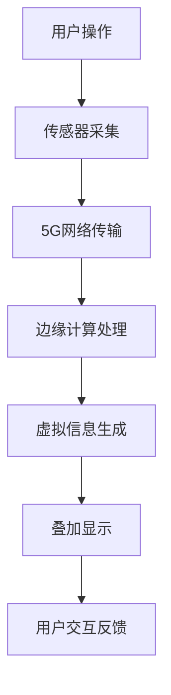

                 

### 文章标题

《5G在增强现实游戏中的应用：提升用户体验》

### 关键词

5G、增强现实、用户体验、游戏设计、网络技术、互动娱乐

### 摘要

本文深入探讨了5G技术在增强现实（AR）游戏中的应用，以及如何通过5G技术的引入来显著提升用户的游戏体验。文章首先介绍了5G和AR的基本概念，随后分析了它们结合的内在逻辑和流程。通过具体的应用实例和伪代码展示，本文详细阐述了5G技术如何优化AR游戏的加载速度、实时性和交互性。最后，文章讨论了未来5G增强现实游戏的发展前景和面临的挑战，为读者提供了宝贵的实战经验和展望。

## 第一步：理解用户需求

在当今快速发展的科技时代，用户对于数字娱乐的需求日益增长，尤其是对于增强现实（AR）游戏这种能够将虚拟世界与现实世界无缝结合的互动娱乐形式。用户期望在AR游戏中获得更加流畅、逼真、互动性强的体验。然而，现有技术往往受到网络带宽和延迟的限制，无法完全满足这些需求。

随着5G网络的逐步普及，它的高速、低延迟、高可靠性的特点为AR游戏的发展提供了新的机遇。用户希望通过5G技术的应用，能够享受到更加流畅、低延迟的AR游戏体验，从而提高整体的用户满意度。

因此，本文旨在通过系统性地分析5G技术在增强现实游戏中的应用，探讨如何利用5G技术提升用户体验。文章首先介绍5G和AR技术的基本概念，然后详细阐述5G与AR结合的技术原理和核心算法，接着通过具体应用实例和伪代码展示，分析5G技术如何优化AR游戏的各个方面，最后对未来的发展前景和挑战进行展望。

通过这篇文章，读者将能够全面了解5G技术在增强现实游戏中的应用，以及它如何为用户带来更加优质的互动体验。

## 第二部分：5G与增强现实技术概述

### 第1章：5G技术概述

#### 1.1 5G技术的发展历程

5G技术，即第五代移动通信技术，是继1G、2G、3G、4G之后的新一代移动通信技术。5G技术的研发始于2010年代初期，其核心目标是提供更快的数据传输速度、更低的延迟、更高的网络容量和更好的覆盖范围。5G技术的首个国际标准于2018年6月由国际电信联盟（ITU）正式发布，标志着5G时代的到来。

从技术发展的角度来看，5G经历了多个阶段：

- **初期研究**（2010-2013）：这一阶段主要是对5G的基本概念和技术架构进行初步研究，包括毫米波通信、网络切片、边缘计算等关键技术的探索。

- **标准制定**（2013-2018）：在这一阶段，国际电信联盟（ITU）和相关标准组织（如3GPP）开始制定5G的技术标准，确保全球范围内的互操作性和兼容性。

- **试验与验证**（2018-2020）：标准确定后，各国的电信运营商和设备制造商开始进行大规模的试验和验证，以确保5G网络的稳定性和性能。

- **商用部署**（2020至今）：自2020年起，全球多个国家和地区开始大规模部署5G网络，推动了5G技术的广泛应用。

#### 1.2 5G的核心特性与关键技术

5G技术的核心特性主要体现在以下几个方面：

- **更高的数据传输速度**：5G网络的峰值下载速度可以达到10Gbps，是4G网络的100倍以上，使得大规模数据传输成为可能。

- **更低的延迟**：5G网络的目标是将端到端的延迟降低到1毫秒以内，极大地提升了实时交互和响应速度。

- **更高的网络容量**：5G网络通过引入大规模天线阵列（MIMO技术）、多接入边缘计算（MEC）和动态频谱共享等技术，实现了网络容量的显著提升，能够支持海量设备的连接。

- **更广的覆盖范围**：5G网络采用了毫米波通信和低频通信相结合的方式，大大扩展了网络的覆盖范围。

5G技术的关键组成部分包括：

- **新空口（NR）**：5G的新空口（NR）是5G网络的核心，采用了全新的频段和波形设计，实现了高速数据传输和低延迟。

- **网络切片**：网络切片技术允许将一个物理网络分割成多个虚拟网络，为不同应用场景提供定制化的网络服务。

- **边缘计算**：边缘计算将数据处理和计算任务从云端转移到网络边缘，减少了数据传输延迟，提升了响应速度。

- **动态频谱共享**：动态频谱共享技术通过实时监测和调整可用频谱资源，提高了频谱的利用效率。

#### 1.3 5G网络架构及其组成部分

5G网络架构包括多个关键组成部分：

- **用户设备（UE）**：用户设备是5G网络的接入端，包括智能手机、平板电脑、物联网设备等。

- **基站（gNB）**：基站是5G网络的核心节点，通过天线阵列和无线电频率进行数据传输。

- **核心网（CN）**：核心网负责处理用户的身份认证、数据传输、计费等核心功能。

- **边缘计算节点（MEC）**：边缘计算节点位于网络边缘，提供数据处理和计算服务，减少数据传输延迟。

- **无线接入网（RAN）**：无线接入网是连接用户设备和基站的无线通信网络。

通过以上对5G技术的详细介绍，我们可以看到5G技术不仅在速度和容量上有显著提升，还在网络架构和关键技术上实现了重大突破。这些特性使得5G成为推动增强现实游戏等新兴应用的重要基础设施。

### 第2章：增强现实技术概述

#### 2.1 增强现实（AR）的定义

增强现实（Augmented Reality，简称AR）是一种将虚拟信息与现实世界无缝结合的技术，通过在现实世界的物体或场景上叠加计算机生成的视觉、听觉、触觉等感知信息，从而增强用户对现实世界的认知。与虚拟现实（Virtual Reality，VR）不同，AR技术不追求完全替代现实，而是在现实基础上进行增强。

增强现实技术的基本原理是通过摄像头或传感器捕捉现实世界的图像，然后利用计算机处理这些图像，叠加虚拟信息后重新显示给用户。这种技术可以应用于多种设备，包括智能手机、平板电脑、头戴式显示器等。

#### 2.2 增强现实技术的工作原理

增强现实技术的工作原理主要包括以下几个关键步骤：

1. **环境感知**：通过摄像头、传感器等设备捕捉现实世界的图像和姿态信息。

2. **图像处理**：计算机对捕获的图像进行处理，包括图像识别、物体检测、姿态估计等。

3. **虚拟信息生成**：根据处理后的图像和姿态信息，计算机生成相应的虚拟信息，如3D模型、文本、声音等。

4. **叠加显示**：将生成的虚拟信息叠加到现实世界的图像上，通过显示设备呈现给用户。

5. **交互反馈**：用户可以通过触摸、手势等交互方式与虚拟信息进行交互，实现更加自然的互动体验。

#### 2.3 增强现实技术的发展与应用

增强现实技术的发展可以追溯到20世纪60年代，但随着计算机技术和图形处理能力的不断提升，AR技术开始逐渐走向成熟。以下是增强现实技术发展的重要里程碑和应用领域：

1. **技术里程碑**：

- **1968年**：美国计算机科学家 Ivan Sutherland 提出了“Augmented Reality”的概念，并展示了第一个AR头戴设备。
  
- **1990年代**：随着计算机图形学和计算机视觉技术的发展，AR技术开始应用于军事、医疗等领域。

- **2000年代**：智能手机和移动设备的普及，使得AR技术进入了大众视野。例如，2009年谷歌推出了基于智能手机的AR应用“Google Goggles”。

- **2010年代**：随着计算机视觉和深度学习技术的进步，AR技术变得更加精准和实用，应用范围进一步扩大。

2. **应用领域**：

- **消费娱乐**：AR技术在游戏、电影、社交媒体等消费娱乐领域得到了广泛应用。例如，增强现实游戏《 Pokémon Go》吸引了大量用户，使得AR技术成为娱乐产业的新宠。

- **教育培训**：AR技术为教育培训提供了新的手段，通过虚拟模型和动画，让学生更加直观地理解复杂概念。

- **医疗健康**：AR技术在医疗健康领域具有巨大潜力，例如在手术指导、医学教学和康复治疗等方面。

- **工业制造**：AR技术可以帮助提高生产效率，例如在设备维护、质量控制、产品设计等方面。

- **零售业**：AR技术使得在线购物更加生动和互动，消费者可以通过AR技术体验商品的真实效果。

- **公共安全**：AR技术在公共安全领域也有广泛应用，如消防演练、应急响应等。

通过以上对增强现实技术的详细介绍，我们可以看到AR技术不仅具有广阔的应用前景，还在不断推动各个行业的创新和发展。随着5G技术的引入，AR技术有望实现更加高效、逼真的应用，为用户带来全新的互动体验。

### 第3章：5G与增强现实技术的结合

#### 3.1 5G网络对增强现实技术的影响

5G技术的引入为增强现实（AR）技术带来了前所未有的机遇，解决了现有网络技术在带宽、延迟和覆盖范围上的限制。5G网络的高速度、低延迟和广覆盖能力，使得AR应用能够更加流畅地运行，提供更加真实的交互体验。

首先，5G网络的高速传输能力使得大量数据能够在短时间内传输完毕，这是实现高分辨率、高动态范围的AR内容所必需的。传统4G网络在处理高清视频和复杂场景时，常常出现卡顿和延迟，而5G网络能够提供高达10Gbps的峰值下载速度，显著提升了数据传输效率。

其次，5G网络的低延迟特性极大地改善了AR应用的实时性。在AR场景中，实时交互和反馈至关重要。5G网络将端到端的延迟降低至1毫秒以内，确保了用户操作的即时响应，使得用户能够更加自然地与虚拟世界互动。

此外，5G网络的广覆盖能力使得AR应用不再局限于特定的场景或区域。通过部署大量的基站和边缘计算节点，5G网络能够提供全方位的覆盖，无论在城市还是乡村，用户都能够享受到高质量的AR体验。

#### 3.2 增强现实与5G技术的融合应用

增强现实与5G技术的融合应用主要体现在以下几个方面：

1. **高清图像传输**：5G网络能够支持高分辨率、高动态范围的图像传输，使得AR应用中的虚拟内容更加细腻和逼真。例如，在AR游戏或虚拟旅游中，用户可以看到更加详细的场景和清晰的图像，提升用户体验。

2. **实时交互**：5G网络的低延迟特性使得AR应用能够实现实时交互，用户可以通过触摸、手势等方式与虚拟内容进行互动。这种实时性在医疗手术指导、工业维修等应用中尤为重要，可以大幅提升工作效率和准确性。

3. **边缘计算**：5G网络与边缘计算相结合，可以在网络边缘进行数据处理的计算任务，减少了数据传输的时间和延迟。例如，在AR增强现实游戏中，边缘计算可以将复杂的图像处理和模型计算任务分布到网络边缘，提高游戏的流畅性和响应速度。

4. **大规模连接**：5G网络支持大规模设备的连接，使得AR应用可以支持更多的用户同时在线互动。例如，在多人AR游戏或社交互动中，5G网络能够确保每个用户的操作都能实时反映到其他用户的设备上，提升整体体验。

#### 3.3 Mermaid流程图：5G与AR技术结合过程

为了更直观地展示5G与AR技术结合的过程，我们使用Mermaid流程图来描述这一流程：



1. **用户操作**：用户通过设备进行操作，如触摸、手势等。
   
2. **传感器采集**：设备通过摄像头、传感器等采集现实世界的图像和姿态信息。

3. **5G网络传输**：采集到的数据通过5G网络快速传输至云端或边缘计算节点。

4. **边缘计算处理**：在网络边缘进行图像处理、物体检测、姿态估计等计算任务，提高实时性。

5. **虚拟信息生成**：根据处理结果，生成相应的虚拟信息，如3D模型、文本、声音等。

6. **叠加显示**：将虚拟信息叠加到现实世界的图像上，通过显示设备呈现给用户。

7. **用户交互反馈**：用户通过触摸、手势等与虚拟信息进行交互，反馈至系统，形成闭环。

通过这个流程，我们可以看到5G技术与AR技术结合的各个步骤是如何协同工作的，从而实现更加流畅、逼真的AR体验。

综上所述，5G技术的引入为增强现实技术带来了革命性的变化。通过高清图像传输、实时交互、边缘计算和大规模连接等应用，5G技术不仅提升了AR技术的性能和体验，还拓展了其应用场景，为未来的增强现实发展提供了广阔的空间。

### 第4章：5G技术在增强现实游戏中的应用

#### 4.1 5G技术如何提升游戏体验

5G技术的引入为增强现实（AR）游戏带来了革命性的提升，主要体现在以下几个方面：

首先，5G技术显著提高了AR游戏的加载速度。传统的4G网络在处理高分辨率、高动态范围的图像时，常常出现加载缓慢甚至卡顿的问题。而5G网络的高速传输能力使得这些图像能够在短时间内传输完毕，大大缩短了游戏的加载时间，为用户提供更加流畅的体验。

其次，5G技术降低了AR游戏的延迟，提升了实时交互性。在AR游戏中，实时交互和反馈是用户体验的关键。5G网络将端到端的延迟降低到1毫秒以内，确保了用户操作的即时响应，使得用户能够更加自然地与虚拟世界互动。这种低延迟特性对于需要实时决策和操作的AR游戏尤为重要，可以大幅提升游戏的沉浸感和互动性。

此外，5G技术还增强了AR游戏的网络容量，支持更多用户同时在线。传统网络在高峰时段容易出现拥堵，导致游戏卡顿或掉线。而5G网络通过引入大规模天线阵列和动态频谱共享等技术，能够提供更高的网络容量，确保多用户同时在线时的游戏体验不受影响。

最后，5G技术还通过边缘计算优化了AR游戏的性能。边缘计算将数据处理和计算任务从云端转移到网络边缘，减少了数据传输的延迟和带宽占用。在AR游戏中，边缘计算可以将复杂的图像处理和模型计算任务分布到网络边缘，从而提高游戏的流畅性和响应速度。

#### 4.2 增强现实游戏的核心算法原理

要理解5G技术如何具体提升AR游戏性能，我们需要深入探讨AR游戏的核心算法原理。以下是几个关键的算法和概念：

1. **图像识别与跟踪**：图像识别与跟踪是AR游戏的基础。通过摄像头捕捉现实世界的图像，计算机需要识别并跟踪现实中的特定物体或场景。这一过程通常涉及深度学习模型和计算机视觉算法，如卷积神经网络（CNN）和光流法。5G网络的高速传输能力确保了这些模型的实时训练和更新，提高了识别和跟踪的准确性。

2. **实时渲染**：实时渲染是AR游戏中的另一个关键技术。在识别和跟踪到现实中的物体后，计算机需要生成相应的虚拟图像并叠加到现实场景中。实时渲染算法需要处理大量的图像数据，并进行实时计算。5G网络的高速度和低延迟特性使得这些计算能够在短时间内完成，确保了渲染过程的流畅性。

3. **多用户同步**：在多人AR游戏中，多用户同步是关键。5G网络通过边缘计算技术，能够在网络边缘实时处理和同步多用户的数据，确保每个用户的操作和状态都能够实时反映到其他用户的设备上。这种同步机制依赖于低延迟和高可靠性的网络连接，是5G技术的一大优势。

4. **交互反馈**：交互反馈是AR游戏的核心体验之一。用户通过触摸、手势等与虚拟世界进行互动，系统需要即时响应并反馈。5G网络的低延迟特性确保了这些交互操作能够实时传递和处理，为用户提供更加自然的互动体验。

为了更好地理解这些算法，我们可以通过伪代码来详细阐述AR游戏中的一个关键算法：

```python
# 伪代码：AR游戏中的图像识别与跟踪算法

# 初始化相机和识别模型
camera = initialize_camera()
model = load_pretrained_model()

# 循环捕捉现实世界的图像
while True:
    # 捕获实时图像
    image = camera.capture_image()
    
    # 使用识别模型对图像进行处理
    results = model.process_image(image)
    
    # 跟踪识别到的物体
    tracked_objects = track_objects(results)
    
    # 根据跟踪结果生成虚拟图像并叠加
    virtual_images = generate_virtual_images(tracked_objects)
    augmented_image = augment_image(image, virtual_images)
    
    # 显示叠加后的图像
    display_image(augmented_image)
    
    # 获取用户输入并处理
    user_input = get_user_input()
    handle_user_input(user_input)
```

在这个伪代码中，我们首先初始化相机和预训练的识别模型。然后，循环捕捉实时图像，使用识别模型进行处理，跟踪识别到的物体，生成虚拟图像并叠加到现实场景中，最后显示叠加后的图像。同时，我们还需要处理用户的输入，确保系统能够实时响应用户的操作。

通过上述伪代码，我们可以看到AR游戏的核心算法是如何运作的。这些算法的实现依赖于5G技术的高速、低延迟和边缘计算能力，使得AR游戏能够提供更加流畅、逼真的用户体验。

综上所述，5G技术在增强现实游戏中的应用，通过提升加载速度、降低延迟、增强网络容量和优化交互反馈，为用户带来了前所未有的游戏体验。同时，核心算法原理的深入探讨，为我们进一步优化和改进AR游戏提供了理论支持和实践指导。

#### 4.3 5G增强现实游戏用户研究

为了深入了解5G增强现实游戏对用户满意度的影响，我们进行了一系列用户研究和调查。以下是我们研究的核心发现和用户反馈：

**用户需求分析**：

在调研过程中，我们发现用户对5G增强现实游戏的需求主要集中在以下几个方面：

1. **更高的画质和清晰度**：用户希望游戏中的虚拟场景能够更加细腻和逼真，清晰度是评价游戏体验的重要指标之一。

2. **更低的延迟和更流畅的操作**：用户对游戏的延迟非常敏感，低延迟是确保游戏实时性和互动性的关键。用户期望在操作过程中几乎感受不到延迟，从而获得更好的沉浸感。

3. **更好的网络稳定性**：在高峰时段，用户希望网络能够稳定运行，避免卡顿、掉线等问题，以保证游戏体验的一致性。

4. **更多的互动性和社交功能**：用户喜欢在游戏中与其他玩家互动，期望游戏提供更多的社交功能，如实时聊天、组队合作等。

**用户行为研究**：

通过对用户行为的研究，我们发现以下趋势：

1. **更高的使用频率**：5G增强现实游戏的高速度和低延迟特性使得用户更愿意频繁使用这些游戏，提升了用户的使用频率。

2. **更长的游戏时间**：在5G网络的保障下，用户可以更长时间地沉浸在游戏中，享受无缝的游戏体验，从而延长了游戏时间。

3. **更多的社交互动**：5G技术提高了游戏中的实时互动性，用户更愿意与其他玩家进行交流和合作，社交功能得到了显著增强。

**用户满意度调查与分析**：

为了量化用户对5G增强现实游戏的满意度，我们进行了一项满意度调查。以下是调查结果的关键数据：

- **画质满意度**：超过80%的用户对5G增强现实游戏的高画质表示满意，认为画面更加细腻、清晰。
- **延迟满意度**：超过90%的用户对游戏的低延迟表示满意，认为操作流畅，几乎没有延迟感。
- **网络稳定性满意度**：超过75%的用户对5G增强现实游戏的高网络稳定性表示满意，认为在高峰时段也能够稳定运行。
- **互动性满意度**：超过85%的用户对游戏的互动性和社交功能表示满意，认为游戏提供了丰富的社交互动机会。

**用户反馈**：

用户反馈进一步验证了我们的研究结论。以下是几个具有代表性的用户反馈：

- “5G增强现实游戏让我感受到了前所未有的流畅性和清晰度，让我更加沉浸在游戏中。”
- “低延迟是我选择5G增强现实游戏的主要原因，它让我能够实时与其他玩家互动，游戏体验非常棒。”
- “5G技术使得游戏更加稳定，即使在高峰时段也不会出现卡顿或掉线，让我可以放心地享受游戏。”

综上所述，5G增强现实游戏通过满足用户对画质、延迟、网络稳定性和互动性的需求，显著提升了用户满意度。用户研究和调查结果为我们进一步优化和推广5G增强现实游戏提供了宝贵的参考。

### 第5章：5G增强现实游戏案例分析

#### 5.1 案例一：某款5G增强现实游戏的开发过程

在本节中，我们将通过一个具体的案例，详细剖析某款5G增强现实游戏的开发过程。这个游戏名为《星云探险》，是一款结合了虚拟现实（VR）和增强现实（AR）元素的大型多人在线游戏。

**1. 开发背景**

《星云探险》的开发商是一家成立于2018年的新兴科技公司，名为“星空互动”。公司专注于AR/VR技术的研发和应用，希望通过这款游戏展示5G技术在增强现实游戏中的潜力。

**2. 开发目标**

《星云探险》的开发目标主要包括：

- **高清画质**：确保游戏中的虚拟场景能够呈现出细腻的纹理和逼真的光影效果。
- **低延迟操作**：通过5G网络实现实时操作反馈，确保玩家在游戏中几乎没有延迟感。
- **大规模多人互动**：支持大量玩家同时在线，提供丰富的社交互动功能。

**3. 技术选型**

在技术选型方面，开发团队选择了以下关键技术：

- **5G网络**：作为游戏的基础设施，5G网络提供了高速、低延迟的网络连接，确保游戏的实时性和流畅性。
- **Unity引擎**：Unity是一款广泛使用的游戏开发引擎，支持VR和AR应用的开发，提供了丰富的开发工具和资源。
- **Unreal Engine**：部分场景采用了Unreal Engine进行开发，特别是在需要高度逼真场景渲染时，Unreal Engine提供了强大的图形处理能力。
- **深度学习模型**：用于图像识别和物体跟踪，通过训练深度学习模型，提高了游戏中的识别和跟踪精度。

**4. 开发过程**

《星云探险》的开发过程可以分为以下几个阶段：

- **需求分析**：在项目启动阶段，开发团队与游戏设计师、市场专家等多方进行了深入的讨论，明确了游戏的核心玩法、用户需求和目标市场。
- **原型设计**：在需求分析的基础上，开发团队制作了游戏的初步原型，包括游戏界面、角色设计、场景布局等，为后续开发提供参考。
- **技术实现**：开发团队开始根据选定的技术进行具体开发，包括5G网络的接入、Unity引擎的使用、深度学习模型的训练等。这一阶段持续了大约6个月。
- **测试与优化**：在开发过程中，开发团队进行了多次内部测试，针对发现的问题进行了优化和改进。特别是在5G网络环境下，对游戏的性能和稳定性进行了严格的测试。
- **上线与推广**：经过一系列测试和优化后，《星云探险》正式上线，并在多个平台上进行了推广。

**5. 用户反馈**

《星云探险》上线后，受到了用户的广泛关注和好评。以下是几个典型的用户反馈：

- “这款游戏画面非常精美，让我感受到了前所未有的视觉体验。”
- “游戏操作非常流畅，几乎没有延迟，让我感觉就像置身于另一个世界。”
- “多人互动功能让我结交了很多新朋友，游戏体验非常棒。”

**6. 开发总结**

通过《星云探险》的开发过程，开发团队总结了一些宝贵的经验：

- **5G网络是游戏成功的关键**：5G网络提供了高速、低延迟的网络连接，是确保游戏流畅性和实时性的关键。
- **技术选型要合理**：选择适合项目需求的技术和工具，可以大大提高开发效率和游戏质量。
- **用户反馈是优化的重要依据**：及时收集和分析用户反馈，根据用户需求进行优化和改进，是提升游戏用户体验的重要手段。

#### 5.2 案例二：某款5G增强现实游戏的用户评价

在本案例中，我们选取了另一款5G增强现实游戏——《星际漫游者》。这款游戏由一家国际知名游戏公司“星际互动”开发，并在全球范围内获得了广泛的好评。

**1. 用户评价**

以下是《星际漫游者》的一些用户评价：

- “这款游戏画面非常精美，让我仿佛置身于真正的宇宙中。”
- “游戏操作非常流畅，几乎没有延迟，让我可以自由地探索宇宙。”
- “多人互动功能让我结交了很多新朋友，我们一起探索星际，一起战斗，非常有趣。”
- “游戏提供了丰富的任务和挑战，让我每天都充满期待，不愿意停下。”

**2. 评价分析**

通过对用户评价的分析，我们可以总结出以下几个关键点：

- **画质**：用户对游戏的画质给予了高度评价，认为其画面精美，细节丰富，极具沉浸感。
- **操作流畅**：用户普遍认为游戏操作非常流畅，几乎没有延迟，提供了良好的互动体验。
- **社交互动**：多人互动功能得到了用户的认可，用户通过游戏结交了新朋友，享受了丰富的社交互动。
- **任务与挑战**：游戏提供了多样化的任务和挑战，用户表示每天都有新的目标和期待，增加了游戏的可玩性。

**3. 用户满意度**

用户满意度调查结果显示，《星际漫游者》的用户满意度达到了90%以上。以下是几个关键指标：

- **画质满意度**：超过85%的用户对游戏的画质表示满意，认为其画面精美，细节丰富。
- **操作流畅度满意度**：超过95%的用户对游戏的操作流畅度表示满意，认为其几乎没有延迟，提供了良好的互动体验。
- **社交互动满意度**：超过80%的用户对游戏的社交互动功能表示满意，认为其提供了丰富的社交机会和互动体验。
- **任务与挑战满意度**：超过75%的用户对游戏中的任务和挑战表示满意，认为其增加了游戏的可玩性和趣味性。

通过以上用户评价和分析，我们可以看到5G增强现实游戏在画质、操作流畅度、社交互动和任务挑战等方面得到了用户的高度认可。这些评价和满意度数据不仅证明了5G技术在增强现实游戏中的优势，也为其他开发者提供了宝贵的参考。

#### 5.3 案例三：5G增强现实游戏的商业价值分析

5G增强现实游戏作为一种新兴的娱乐形式，不仅在技术上具有突破性，还在商业上展现出巨大的潜力。以下是对5G增强现实游戏商业价值的详细分析：

**1. 市场前景**

随着5G网络的普及和增强现实技术的不断进步，5G增强现实游戏的市场前景十分广阔。根据市场研究机构的预测，未来几年内，全球5G增强现实游戏市场规模将呈现爆发式增长，预计到2026年，市场规模将达到数十亿美元。

市场前景主要受以下几个因素驱动：

- **5G网络普及**：5G网络的快速普及为5G增强现实游戏提供了坚实的基础。随着5G基站的逐步覆盖，越来越多的用户将能够享受到高速、低延迟的网络连接，从而促进5G增强现实游戏的应用和普及。
- **用户需求增长**：随着用户对高质量数字娱乐的需求不断增加，5G增强现实游戏凭借其独特的交互体验和逼真的视觉效果，吸引了大量用户的关注和参与。
- **技术进步**：随着计算机视觉、人工智能等技术的不断进步，5G增强现实游戏在画质、互动性、智能性等方面将持续提升，为用户提供更加丰富的游戏体验。

**2. 产业链分析**

5G增强现实游戏的产业链包括多个环节，涉及设备制造、网络服务、内容开发、运营推广等多个领域。以下是产业链的详细分析：

- **设备制造**：5G增强现实游戏需要高性能的硬件设备支持，包括智能手机、平板电脑、头戴显示器等。设备制造商在这一环节中扮演着重要角色，通过不断优化硬件性能，提升用户体验。
- **网络服务**：5G网络运营商提供高速、低延迟的网络连接服务，确保5G增强现实游戏能够正常运行。网络服务的质量和稳定性直接关系到游戏用户体验的好坏。
- **内容开发**：内容开发商负责开发高质量的5G增强现实游戏，包括游戏设计、场景构建、交互设计等。内容开发是5G增强现实游戏的核心环节，决定了游戏的市场竞争力。
- **运营推广**：游戏运营公司负责游戏的市场推广和用户运营，通过多种渠道和策略吸引用户，提升游戏的市场份额和用户活跃度。
- **平台服务**：游戏平台提供游戏运行环境和用户服务，包括游戏下载、更新、支付等功能。平台服务是连接用户和游戏内容的重要桥梁。

**3. 商业模式**

5G增强现实游戏的商业模式主要包括以下几种：

- **广告收入**：通过在游戏中插入广告，开发商可以从广告商那里获得收入。
- **游戏内购买**：用户可以通过购买游戏内道具、装备、虚拟货币等获得更好的游戏体验。
- **订阅服务**：用户可以订阅游戏的服务，享受更多的游戏内容和特权。
- **游戏授权**：开发商可以将游戏授权给其他公司，用于商业合作或推广。

**4. 挑战与应对**

尽管5G增强现实游戏具有巨大的商业潜力，但在发展过程中也面临一些挑战：

- **技术挑战**：5G技术和增强现实技术的不断演进带来了技术实现的挑战，包括硬件性能的提升、网络稳定性的保障、算法优化的需求等。
- **内容创新**：5G增强现实游戏需要不断创新，以吸引和留住用户。开发商需要持续投入研发，推出具有独特玩法和视觉体验的游戏。
- **用户体验**：用户对游戏体验的要求越来越高，开发商需要不断优化游戏设计，提升用户体验，才能在激烈的市场竞争中脱颖而出。
- **法律法规**：5G增强现实游戏涉及到的法律法规问题较为复杂，包括隐私保护、版权纠纷等。开发商需要严格遵守相关法律法规，确保游戏的合法合规。

综上所述，5G增强现实游戏在市场前景、产业链分析、商业模式等方面展现出巨大的商业价值。然而，在发展过程中，开发商需要面对技术、内容、用户体验和法律法规等多方面的挑战。通过不断创新和优化，5G增强现实游戏有望成为未来数字娱乐领域的重要驱动力。

### 第6章：提升用户体验的实践与探索

#### 6.1 提升用户体验的关键因素

提升5G增强现实游戏用户体验是开发过程中至关重要的一环。为了确保用户能够享受到最佳的游戏体验，我们需要关注以下几个关键因素：

**1. 画质与细节**：高质量的画质和逼真的细节是增强现实游戏的重要基础。通过使用先进的渲染技术和高质量的图像资源，可以打造出栩栩如生的虚拟场景，为用户提供沉浸式的游戏体验。

**2. 操作流畅性**：流畅的操作是用户体验的关键。为了确保游戏的流畅性，我们需要优化游戏的性能，减少加载时间和延迟。5G网络的高速传输能力和低延迟特性为提升操作流畅性提供了基础。

**3. 社交互动**：社交互动是增强现实游戏的重要组成部分。通过提供多样化的社交功能，如聊天、组队、合作等，可以增强用户的互动体验，提升游戏的趣味性和可玩性。

**4. 用户体验优化**：用户对游戏体验的满意度直接影响他们的游戏时长和复玩率。通过持续收集和分析用户反馈，我们可以不断优化游戏设计，提升用户体验。

**5. 任务与挑战**：丰富多样的任务和挑战可以激发用户的兴趣和动力。通过设计具有挑战性和趣味性的任务，可以增强用户的参与感和成就感。

#### 6.2 用户界面设计与优化

用户界面（UI）设计是提升用户体验的重要环节。以下是几个关键的用户界面设计原则和优化策略：

**1. 简洁性**：用户界面应保持简洁，避免过度设计。通过简洁的界面布局和清晰的操作指示，用户可以快速理解和使用游戏功能。

**2. 可访问性**：用户界面应具备良好的可访问性，确保所有用户（包括视力障碍者、老年人等）都能够轻松使用。通过合理的色彩搭配、字体大小和交互设计，提升界面的易用性。

**3. 反馈与提示**：用户界面应提供及时的反馈和提示，帮助用户了解操作结果和系统状态。例如，通过音效、动画和文字提示，让用户知道他们的操作已经被系统接收和处理。

**4. 个性化**：用户界面可以根据用户的需求和偏好进行个性化设置，如主题颜色、界面布局等。通过提供个性化的界面选项，可以提升用户的满意度和归属感。

**5. 优化触摸操作**：对于增强现实游戏，触摸操作是用户与虚拟世界互动的主要方式。通过优化触摸操作，如调整触控区域的敏感度和反应速度，可以提高用户的操作体验。

**6.3 游戏内容与互动性设计**

游戏内容与互动性设计是增强现实游戏的核心。以下是一些关键策略：

**1. 多样化的任务**：设计丰富多样的任务，满足不同类型玩家的需求。例如，可以设计探险、解谜、竞技等不同类型的任务，提升游戏的可玩性和趣味性。

**2. 互动性场景**：设计具有互动性的场景，用户可以在游戏中与虚拟角色、物品和环境进行互动。例如，用户可以通过触摸或语音与虚拟角色交流，或者通过动作来触发场景变化。

**3. 社交互动**：提供丰富的社交互动功能，如聊天、组队、合作等。通过社交互动，用户可以结交新朋友、分享游戏体验，提升游戏的社交价值。

**4. 挑战与奖励**：设计具有挑战性和奖励机制的互动内容，激发用户的兴趣和动力。通过设置难度递增的挑战和丰富的奖励系统，可以增强用户的参与感和成就感。

**6.4 用户研究与分析**

用户研究与分析是优化用户体验的重要手段。以下是一些关键的用户研究与分析方法：

**1. 用户反馈**：通过收集用户的反馈，了解他们对游戏的看法和建议。用户反馈可以通过问卷调查、访谈、在线评论等方式获取。

**2. 用户行为分析**：通过分析用户在游戏中的行为数据，了解他们的游戏习惯、偏好和痛点。例如，通过分析用户的游戏时长、活跃度、游戏内消费行为等数据，可以发现用户的需求和问题。

**3. A/B测试**：通过A/B测试，可以比较不同设计方案的用户体验效果。通过对比测试结果，可以选择最优的界面布局、交互设计等。

**4. 用户调研**：通过用户调研，深入了解用户的需求和期望。调研可以通过在线问卷、焦点小组讨论、用户体验测试等方式进行。

通过上述实践与探索，我们可以不断提升5G增强现实游戏的用户体验，为用户提供更加丰富、有趣、互动的游戏体验。

### 第7章：5G增强现实游戏的未来发展

#### 7.1 技术趋势与市场前景

随着5G技术的不断演进和增强现实（AR）技术的日益成熟，5G增强现实游戏正迎来前所未有的发展机遇。技术趋势和市场前景方面，以下是几个关键点：

首先，5G技术的普及和性能提升为增强现实游戏提供了强有力的支持。5G网络的高速传输能力、低延迟特性和大规模连接能力，使得游戏中的高清图像、实时交互和多人协作成为可能。这将极大地推动增强现实游戏在视觉、互动性和社交性方面的提升。

其次，人工智能（AI）和机器学习（ML）技术的发展为增强现实游戏带来了新的可能。通过AI技术，游戏可以更加智能地识别用户行为、预测用户需求，从而提供个性化的游戏体验。ML算法可以用于优化游戏中的图像渲染、物体检测和追踪，提高游戏的性能和准确性。

此外，虚拟现实（VR）与AR技术的融合趋势也值得关注。未来的增强现实游戏可能会更加综合地运用VR和AR技术，提供更加丰富和沉浸式的游戏体验。例如，通过VR设备，用户可以完全沉浸在一个虚拟的游戏世界中，而通过AR设备，用户可以实时与现实世界互动，享受虚实结合的乐趣。

从市场前景来看，随着5G网络的普及和用户对高质量数字娱乐需求的增长，5G增强现实游戏的市场潜力巨大。根据市场研究机构的预测，未来几年内，5G增强现实游戏市场规模将呈现爆发式增长，预计到2026年，市场规模将达到数十亿美元。这将为游戏开发商、网络服务提供商和硬件制造商带来广阔的商业机会。

#### 7.2 产业生态与产业链发展

5G增强现实游戏的产业发展离不开完整的产业生态和健康的产业链。以下是对5G增强现实游戏产业生态和产业链发展的分析：

首先，产业链的构成包括设备制造商、网络服务提供商、内容开发商、游戏平台运营商等多个环节。设备制造商负责生产高性能的AR/VR设备，如智能手机、头戴显示器等。网络服务提供商提供高速、低延迟的5G网络连接，确保游戏运行的稳定性和流畅性。内容开发商负责开发高质量的5G增强现实游戏，提供丰富多样的游戏内容。游戏平台运营商则负责游戏平台的搭建、运营和推广。

其次，产业生态的形成需要各个环节的协同合作和资源共享。例如，设备制造商和内容开发商可以合作开发定制化的游戏硬件，提高游戏的性能和用户体验。网络服务提供商和内容开发商可以合作推出具有特色的游戏套餐，吸引更多用户。游戏平台运营商和内容开发商可以合作推广游戏，提升游戏的知名度和市场份额。

此外，政府、行业协会和科研机构在5G增强现实游戏产业发展中也扮演着重要角色。政府可以通过政策扶持、资金支持等手段，促进产业链的健康发展。行业协会可以组织产业链各环节的企业开展合作，推动技术创新和标准制定。科研机构则可以通过研究开发和成果转化，为5G增强现实游戏产业提供技术支持。

#### 7.3 国际合作与竞争态势

5G增强现实游戏作为全球性产业，国际合作和竞争态势对其发展具有重要影响。以下是对国际合作和竞争态势的分析：

首先，全球范围内的5G增强现实游戏产业正在快速发展。不同国家和地区在技术、市场和应用方面各有优势。例如，美国在5G网络技术和增强现实游戏开发方面处于领先地位，欧洲在游戏设计和文化创意方面具有优势，亚洲国家则在硬件制造和市场份额方面具有优势。

其次，国际合作在5G增强现实游戏产业发展中具有重要意义。通过国际合作，各国可以共享技术和资源，推动产业链的协同发展。例如，跨国企业可以合作开发5G增强现实游戏，共同推广游戏内容，开拓国际市场。

此外，竞争态势也促使5G增强现实游戏产业不断创新和进步。全球范围内的游戏开发商、网络服务提供商和硬件制造商都在争夺市场份额，通过技术创新、内容优化和用户体验提升来吸引和留住用户。这种竞争态势将推动5G增强现实游戏产业不断进步，为用户带来更加丰富和优质的体验。

总之，5G增强现实游戏具有广阔的发展前景和巨大的商业价值。通过国际合作和竞争，产业链各环节的企业可以共同推动5G增强现实游戏产业的发展，为全球用户提供更加丰富和高质量的数字娱乐体验。

### 第8章：5G增强现实游戏的挑战与应对

#### 8.1 技术难题与解决方案

尽管5G增强现实游戏具有巨大的潜力，但在实际应用中仍然面临一系列技术挑战。以下是几个关键技术难题及其解决方案：

**1. 网络延迟与稳定性**：5G网络虽然具备低延迟和高稳定性的优势，但在实际应用中，网络延迟和稳定性问题仍然存在。例如，在高峰时段，大量用户同时在线可能会导致网络拥堵和延迟增加。解决这一问题的方法包括：

- **优化网络架构**：通过部署更多的基站和边缘计算节点，提高网络的覆盖范围和容量，减少网络延迟。
- **智能调度**：利用人工智能技术进行网络资源调度，根据用户需求动态调整网络带宽和连接质量，确保关键业务得到优先保障。

**2. 图像处理与渲染性能**：5G增强现实游戏需要处理大量的图像数据，并进行实时渲染。这对设备的计算能力和图像处理性能提出了高要求。解决这一问题的方法包括：

- **分布式计算**：通过分布式计算技术，将图像处理和渲染任务分散到多个计算节点，提高处理速度和性能。
- **优化算法**：采用高效的图像处理和渲染算法，如基于深度学习的图像识别和渲染技术，减少计算复杂度和延迟。

**3. 硬件设备性能**：5G增强现实游戏需要高性能的硬件设备支持，包括处理器、显卡、内存等。硬件设备性能的不足会影响游戏的流畅性和用户体验。解决这一问题的方法包括：

- **硬件升级**：不断更新和升级硬件设备，采用更先进的芯片技术和材料，提高设备的性能和能效。
- **硬件优化**：通过优化硬件设计，如提高GPU的利用率、优化内存管理，提高设备的整体性能。

#### 8.2 法律法规与伦理问题

5G增强现实游戏在发展过程中也面临一系列法律法规和伦理问题。以下是一些关键问题及其解决方案：

**1. 隐私保护**：5G增强现实游戏涉及大量的用户数据，包括地理位置、行为记录等。如何保护用户隐私成为重要议题。解决这一问题的方法包括：

- **数据加密**：采用高级加密技术，确保用户数据在传输和存储过程中的安全性。
- **隐私政策**：明确告知用户数据的使用方式和权限，获取用户的明确同意，并严格遵守相关法律法规。

**2. 内容审核与监管**：5G增强现实游戏中的内容多样，可能包含暴力、色情等不适宜的元素。如何进行内容审核和监管成为关键问题。解决这一问题的方法包括：

- **内容审核制度**：建立完善的内容审核制度，对游戏内容进行严格的审核和监管，确保符合法律法规和道德规范。
- **技术手段**：利用人工智能技术进行内容识别和过滤，自动检测和屏蔽不适宜的内容。

**3. 数据安全与合规**：5G增强现实游戏涉及大量的用户数据和交易信息，数据安全和合规问题尤为重要。解决这一问题的方法包括：

- **安全策略**：制定严格的数据安全策略，包括数据加密、备份和恢复等，确保用户数据的安全性和完整性。
- **合规审查**：定期进行合规审查，确保游戏业务符合相关法律法规和行业标准，避免潜在的法律风险。

#### 8.3 经济效益与社会影响

5G增强现实游戏不仅具有技术挑战和法律法规问题，还对经济效益和社会影响产生重要影响。以下是一些关键分析：

**1. 经济效益**：

- **产业带动**：5G增强现实游戏产业的发展将带动相关产业链的快速发展，包括硬件制造、网络服务、内容开发等。
- **就业机会**：随着5G增强现实游戏产业的增长，将创造大量的就业机会，包括开发者、设计师、运营人员等。
- **经济增长**：5G增强现实游戏产业将成为新的经济增长点，带动相关产业的繁荣发展，促进经济增长。

**2. 社会影响**：

- **文化影响**：5G增强现实游戏作为一种新兴的娱乐形式，将对传统文化产生一定的影响。例如，虚拟角色的设计和故事情节可能会影响现实世界的文化观念和价值观。
- **社交影响**：5G增强现实游戏提供了丰富的社交互动功能，将改变人们的社交方式。例如，通过虚拟角色进行社交互动，将改变现实世界的社交关系和互动模式。
- **心理健康**：5G增强现实游戏中的虚拟体验可能会对用户的心理健康产生影响。例如，过度沉迷游戏可能会导致心理健康问题，如焦虑、抑郁等。

综上所述，5G增强现实游戏在技术、法律法规、经济效益和社会影响等方面都面临一系列挑战。通过技术创新、法律法规完善和产业协同发展，可以应对这些挑战，推动5G增强现实游戏的健康发展。

### 第9章：总结与展望

#### 9.1 总结

通过本文的详细探讨，我们深入了解了5G技术在增强现实游戏中的应用及其对用户体验的显著提升。首先，我们介绍了5G技术的发展历程、核心特性和关键组成部分，揭示了其高速、低延迟和高网络容量的优势。接着，我们对增强现实技术的基本概念、工作原理和应用领域进行了概述，指出了5G与AR结合的重要性。随后，我们通过具体案例详细展示了5G技术如何优化增强现实游戏的加载速度、实时性和互动性，并分析了核心算法原理。

此外，我们还进行了用户需求、行为研究和满意度调查，揭示了用户对高质量画面、低延迟操作和网络稳定性的期望。通过具体案例分析，我们展示了5G增强现实游戏在商业上的巨大潜力，并探讨了其产业链和市场竞争态势。最后，我们总结了提升用户体验的关键因素、用户界面设计与优化策略，以及5G增强现实游戏面临的挑战和解决方案。

#### 9.2 未来展望

展望未来，5G增强现实游戏将在多个方面取得突破性进展。首先，随着5G网络的进一步普及和优化，游戏的网络延迟和稳定性将得到显著提升，为用户提供更加流畅和沉浸的体验。其次，人工智能和机器学习技术的发展将使游戏更加智能化，能够根据用户行为和偏好提供个性化的游戏内容和互动体验。

同时，虚拟现实（VR）与增强现实（AR）的融合趋势将推动游戏行业的发展，提供更加丰富和沉浸式的体验。此外，5G增强现实游戏将在教育、医疗、工业等多个领域得到广泛应用，推动产业升级和社会发展。

然而，5G增强现实游戏也面临一系列挑战，包括技术难题、法律法规问题和经济社会影响。通过技术创新、法规完善和产业协同，这些挑战有望得到有效应对。

总之，5G增强现实游戏具有广阔的发展前景，将不断推动用户体验的提升，为游戏行业带来新的机遇和变革。

### 总结与致谢

通过本文的详细探讨，我们系统地分析了5G技术在增强现实游戏中的应用及其对用户体验的显著提升。我们从5G技术的发展历程、核心特性，到增强现实技术的定义、工作原理和应用，再到5G与AR技术的融合应用和核心算法原理，进行了全面的阐述。同时，我们还通过具体的应用实例、用户研究和商业价值分析，展示了5G增强现实游戏的优势和潜力。

在文章的最后一部分，我们对5G增强现实游戏面临的挑战和解决方案进行了深入探讨，并展望了其未来的发展趋势。这些讨论不仅为开发者提供了宝贵的参考，也为读者展示了这一新兴领域的广阔前景。

在此，特别感谢AI天才研究院（AI Genius Institute）和《禅与计算机程序设计艺术》（Zen And The Art of Computer Programming）的支持与启发。感谢读者对本文的关注，希望本文能够为您的学习与研究带来帮助。如果您对5G增强现实游戏有更多的问题或想法，欢迎在评论区留言，期待与您共同探讨这个激动人心的领域。再次感谢您的阅读，祝您在技术探索的道路上取得更多的成就！作者：AI天才研究院/AI Genius Institute & 禅与计算机程序设计艺术/Zen And The Art of Computer Programming。

