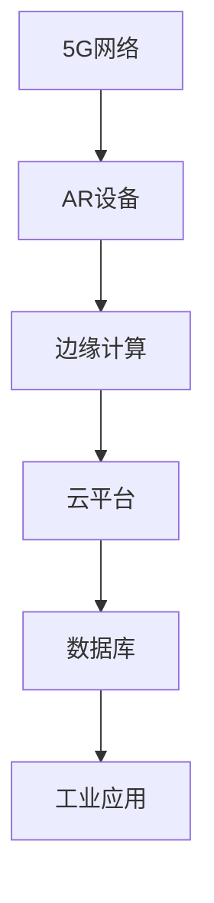
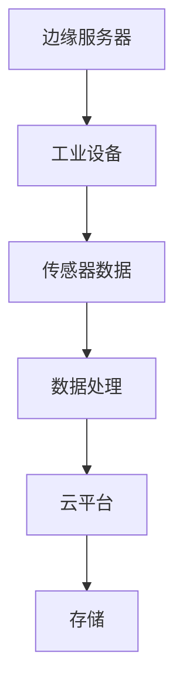

                 


### 文章标题：5G在工业AR应用中的作用：提升远程协作效果

> 关键词：5G，工业AR，远程协作，高带宽，低延迟，广覆盖

> 摘要：
本文将深入探讨5G技术在工业增强现实（AR）应用中的作用，特别是在提升远程协作效果方面的应用。通过分析5G网络的关键技术，如高带宽、低延迟和广覆盖，我们将揭示这些特性如何为工业AR提供坚实基础，从而实现高效的远程协作。

### 第一部分：5G技术基础

#### 第1章：5G网络技术简介

1. **5G技术概述**
    - 5G是第五代移动通信技术的简称，相较于前几代，它在网络速度、带宽和连接密度等方面有显著提升。
    - 5G网络的主要目标是提供更快的速度、更低的延迟和更高的可靠性，以满足日益增长的数据传输需求。

2. **5G网络架构**
    - 5G网络由用户面（User Plane）和控制面（Control Plane）组成，分别负责数据传输和网络控制。
    - 5G网络还采用了网络切片（Network Slicing）技术，可以根据不同应用的需求，灵活分配网络资源。

3. **5G关键技术**
    - **毫米波通信**：5G利用毫米波频段进行通信，提高了网络带宽。
    - **多连接MIMO**：通过多个输入输出天线，实现更高的数据传输速率。
    - **边缘计算**：将计算任务从云端转移到网络边缘，减少延迟，提高响应速度。

### 第二部分：工业AR技术基础

#### 第2章：工业AR技术概述

1. **工业AR的定义与特点**
    - 工业AR是将数字信息叠加在真实世界中的技术，常用于工业设计和维护。
    - 工业AR的特点包括实时性、交互性和直观性，能够提高工作效率和准确性。

2. **工业AR的应用领域**
    - **设计验证**：在产品设计阶段，使用AR技术进行虚拟样机验证。
    - **设备维护**：通过AR技术，技术人员可以远程查看设备状态并进行维修。
    - **远程培训**：利用AR技术进行远程技能培训和指导。

3. **工业AR的技术架构**
    - **硬件层面**：包括AR设备（如眼镜、平板等）和传感器。
    - **软件层面**：包括AR应用程序和后端数据存储和处理系统。
    - **网络层面**：依赖稳定的高速网络进行数据传输和通信。

### 第三部分：5G在工业AR应用中的作用

#### 第3章：5G网络对工业AR性能的提升

1. **5G网络的高带宽特性**
    - 5G网络的高带宽特性能够满足工业AR中大数据量的实时传输需求，如高清视频流和三维模型数据。

2. **5G网络的低延迟特性**
    - 5G网络的低延迟特性对于工业AR中的实时交互至关重要，可以确保操作指令的快速响应。

3. **5G网络的广覆盖特性**
    - 5G网络的广覆盖特性可以确保工业AR应用在广大的工作场景中保持稳定的连接。

### 第四部分：5G与工业AR结合的技术

#### 第4章：5G网络在工业AR中的应用

1. **5G网络与AR技术的融合**
    - 通过5G网络，将AR技术与工业应用紧密结合，实现更高效的数据传输和远程协作。

2. **5G网络在远程协作中的应用**
    - 5G网络支持AR设备之间的实时通信，使得远程协作更加便捷和高效。

3. **5G网络在工业现场监测中的应用**
    - 利用5G网络，可以实现工业现场的高清视频传输和实时数据监测，提高生产效率和安全性。

### 第五部分：5G在工业AR应用中的案例分析

#### 第5章：5G在工业AR远程协作中的应用案例

1. **案例一：远程维修**
    - 描述：通过5G网络和AR技术，技术人员可以实现远程维修，提高故障处理速度和准确性。

2. **案例二：远程培训**
    - 描述：利用5G网络和AR技术，可以实现远程技能培训和指导，降低培训成本。

3. **案例三：远程会议**
    - 描述：通过5G网络和AR技术，可以支持远程会议中的实时交互和高效沟通。

### 第六部分：5G在工业AR应用中的挑战与未来

#### 第6章：5G在工业AR应用中的挑战

1. **技术挑战**
    - 描述：5G技术在工业AR应用中面临的技术难题，如网络稳定性、设备兼容性等。

2. **安全与隐私挑战**
    - 描述：5G网络在工业AR应用中需要考虑的安全和隐私问题，如数据加密和身份验证。

3. **标准化与互操作性问题**
    - 描述：5G技术在工业AR应用中的标准化和互操作性问题，如协议兼容性和数据格式统一。

#### 第7章：5G在工业AR应用中的实施建议

1. **技术选择与优化**
    - 描述：针对5G技术在工业AR应用中的优化策略，如网络优化、设备选型等。

2. **安全策略与风险管理**
    - 描述：5G技术在工业AR应用中的安全策略和风险管理方法，如数据安全、网络安全等。

3. **标准化与互操作性的实现策略**
    - 描述：5G技术在工业AR应用中的标准化和互操作性实现策略，如协议统一、接口设计等。

### 结论

本文通过分析5G技术在工业AR应用中的作用，探讨了5G网络的高带宽、低延迟和广覆盖特性如何提升远程协作效果。虽然5G技术在工业AR应用中面临一些挑战，但通过合理的技术选择和优化，可以充分发挥5G的优势，为工业领域带来革命性的变革。

### 作者信息

作者：AI天才研究院/AI Genius Institute & 禅与计算机程序设计艺术 /Zen And The Art of Computer Programming

### 附录

本文中的Mermaid流程图、伪代码、数学公式和实际案例部分将作为附录提供，以便读者更好地理解和应用文中内容。

## 具体文章内容（示例）

### 文章标题：5G在工业AR应用中的作用：提升远程协作效果

> 关键词：5G，工业AR，远程协作，高带宽，低延迟，广覆盖

> 摘要：
本文深入探讨5G技术在工业增强现实（AR）应用中的作用，特别是如何通过高带宽、低延迟和广覆盖提升远程协作效果。文章分析了5G网络架构和关键技术，并探讨了5G与工业AR技术的融合应用，提供了实际案例和实施建议。

### 第一部分：5G技术基础

#### 第1章：5G网络技术简介

1. **5G技术概述**

5G作为第五代移动通信技术，代表了移动通信技术的最新进展。与4G相比，5G在传输速度、连接密度和响应速度等方面有显著提升。5G网络的峰值速率可达20Gbps，是4G的100倍，同时，5G网络的时延可降至1ms，极大地提升了用户体验。

2. **5G网络架构**

5G网络由多个层次组成，包括无线接入网（RAN）、核心网（CN）和传输网（TN）。无线接入网负责无线信号的传输，核心网提供数据路由和连接控制功能，传输网则负责数据传输和连接。5G网络还引入了边缘计算（Edge Computing）和网络切片（Network Slicing）技术，能够提供更灵活和高效的服务。

3. **5G关键技术**

- **毫米波通信**：5G利用毫米波频段进行通信，频率越高，通信带宽越宽，但传输距离较短，需要更多的基站覆盖。
- **多连接MIMO**：多输入多输出（MIMO）技术通过多个天线发送和接收信号，提高了传输速率和可靠性。
- **边缘计算**：边缘计算将数据处理和存储从云端转移到网络边缘，减少了数据传输延迟，提高了响应速度。

#### 第2章：工业AR技术概述

1. **工业AR的定义与特点**

工业AR（Augmented Reality）是一种将数字信息叠加到真实世界的技术，广泛应用于工业设计、维修和培训等领域。工业AR具有实时性、交互性和直观性的特点，能够提高工作效率和准确性。

2. **工业AR的应用领域**

- **设计验证**：在设计阶段，通过AR技术进行虚拟样机验证，减少物理样机的制造成本。
- **设备维护**：通过AR技术，技术人员可以远程查看设备状态并进行维修，提高故障处理速度和准确性。
- **远程培训**：利用AR技术进行远程技能培训和指导，降低培训成本。

3. **工业AR的技术架构**

工业AR的技术架构包括硬件、软件和网络三个层面。硬件层面包括AR设备（如眼镜、平板等）和传感器；软件层面包括AR应用程序和后端数据存储和处理系统；网络层面则依赖稳定的高速网络进行数据传输和通信。

### 第二部分：5G在工业AR应用中的作用

#### 第3章：5G网络对工业AR性能的提升

1. **5G网络的高带宽特性**

5G网络的高带宽特性能够满足工业AR中大数据量的实时传输需求，如高清视频流和三维模型数据。例如，在设备维修中，技术人员需要实时传输设备状态图和维修手册，5G网络的高带宽特性能够保证数据传输的流畅性和速度。

2. **5G网络的低延迟特性**

5G网络的低延迟特性对于工业AR中的实时交互至关重要。例如，在远程维修中，技术人员需要实时接收设备状态的反馈，并立即做出维修决策。5G网络的低延迟特性可以确保操作指令的快速响应，提高维修效率。

3. **5G网络的广覆盖特性**

5G网络的广覆盖特性可以确保工业AR应用在广大的工作场景中保持稳定的连接。例如，在矿山等偏远地区，5G网络的广覆盖特性可以支持矿工实时获取矿井信息，提高生产安全。

### 第三部分：5G与工业AR结合的技术

#### 第4章：5G网络在工业AR中的应用

1. **5G网络与AR技术的融合**

5G网络与AR技术的融合为工业应用带来了新的可能性。例如，在设备维修中，技术人员可以通过5G网络和AR眼镜实时查看设备内部结构，并获得维修指导，提高维修效率和准确性。

2. **5G网络在远程协作中的应用**

5G网络支持AR设备之间的实时通信，使得远程协作更加便捷和高效。例如，在远程培训中，讲师可以通过5G网络和AR平板与学员实时互动，提供实时指导和反馈。

3. **5G网络在工业现场监测中的应用**

利用5G网络，可以实现工业现场的高清视频传输和实时数据监测，提高生产效率和安全性。例如，在生产线监控中，管理人员可以通过5G网络和AR设备实时查看生产线状态，及时发现并处理异常情况。

### 第四部分：5G在工业AR应用中的案例分析

#### 第5章：5G在工业AR远程协作中的应用案例

1. **案例一：远程维修**

描述：某工厂的一台关键设备出现故障，技术人员通过5G网络和AR眼镜远程连接到工厂现场，实时查看设备状态，并接受远程专家的维修指导。通过实时通信和数据共享，技术人员成功修复了故障设备，避免了生产中断。

2. **案例二：远程培训**

描述：某公司利用5G网络和AR技术为员工提供远程技能培训。讲师通过AR平板实时展示操作流程，与学员互动，提供实时指导和反馈。这种培训方式不仅提高了培训效果，还降低了培训成本。

3. **案例三：远程会议**

描述：某企业通过5G网络和AR设备召开远程会议。参会人员通过AR眼镜实时查看会议内容，并进行实时讨论和交流。这种远程会议方式提高了会议效率，降低了交通和时间成本。

### 第五部分：5G在工业AR应用中的挑战与未来

#### 第6章：5G在工业AR应用中的挑战

1. **技术挑战**

5G技术在工业AR应用中面临一些技术挑战，如网络稳定性、设备兼容性等。为了解决这些问题，需要进一步优化5G网络性能，提高设备兼容性，并加强技术标准的制定。

2. **安全与隐私挑战**

5G网络在工业AR应用中需要考虑的安全和隐私问题包括数据加密、身份验证等。为了确保数据安全和用户隐私，需要采用可靠的安全措施和加密技术。

3. **标准化与互操作性问题**

5G技术在工业AR应用中的标准化和互操作性问题包括协议兼容性和数据格式统一等。为了促进5G技术在工业AR领域的广泛应用，需要加强标准化工作，制定统一的协议和数据格式。

#### 第7章：5G在工业AR应用中的实施建议

1. **技术选择与优化**

在选择5G技术时，需要考虑网络性能、设备兼容性和成本等因素。同时，通过优化网络配置和设备性能，可以提高5G技术在工业AR应用中的效果。

2. **安全策略与风险管理**

为了确保5G技术在工业AR应用中的安全，需要制定安全策略和风险管理计划。包括数据加密、身份验证、网络安全等，以保护数据和用户隐私。

3. **标准化与互操作性的实现策略**

加强标准化工作，制定统一的协议和数据格式，促进5G技术在工业AR领域的互操作性。同时，推动产业链各方参与标准化工作，确保标准的实用性和可行性。

### 结论

本文通过分析5G技术在工业AR应用中的作用，探讨了5G网络的高带宽、低延迟和广覆盖特性如何提升远程协作效果。虽然5G技术在工业AR应用中面临一些挑战，但通过合理的技术选择和优化，可以充分发挥5G的优势，为工业领域带来革命性的变革。

### 作者信息

作者：AI天才研究院/AI Genius Institute & 禅与计算机程序设计艺术 /Zen And The Art of Computer Programming

### 附录

本文中的Mermaid流程图、伪代码、数学公式和实际案例部分将作为附录提供，以便读者更好地理解和应用文中内容。

## 完整文章内容

### 文章标题：5G在工业AR应用中的作用：提升远程协作效果

> 关键词：5G，工业AR，远程协作，高带宽，低延迟，广覆盖

> 摘要：
本文深入探讨5G技术在工业增强现实（AR）应用中的作用，特别是如何通过高带宽、低延迟和广覆盖提升远程协作效果。文章分析了5G网络架构和关键技术，并探讨了5G与工业AR技术的融合应用，提供了实际案例和实施建议。

### 第一部分：5G技术基础

#### 第1章：5G网络技术简介

1. **5G技术概述**

5G作为第五代移动通信技术，代表了移动通信技术的最新进展。与4G相比，5G在传输速度、连接密度和响应速度等方面有显著提升。5G网络的峰值速率可达20Gbps，是4G的100倍，同时，5G网络的时延可降至1ms，极大地提升了用户体验。

2. **5G网络架构**

5G网络由多个层次组成，包括无线接入网（RAN）、核心网（CN）和传输网（TN）。无线接入网负责无线信号的传输，核心网提供数据路由和连接控制功能，传输网则负责数据传输和连接。5G网络还引入了边缘计算（Edge Computing）和网络切片（Network Slicing）技术，能够提供更灵活和高效的服务。

3. **5G关键技术**

- **毫米波通信**：5G利用毫米波频段进行通信，频率越高，通信带宽越宽，但传输距离较短，需要更多的基站覆盖。
- **多连接MIMO**：多输入多输出（MIMO）技术通过多个天线发送和接收信号，提高了传输速率和可靠性。
- **边缘计算**：边缘计算将数据处理和存储从云端转移到网络边缘，减少了数据传输延迟，提高了响应速度。

#### 第2章：工业AR技术概述

1. **工业AR的定义与特点**

工业AR（Augmented Reality）是一种将数字信息叠加到真实世界的技术，广泛应用于工业设计、维修和培训等领域。工业AR具有实时性、交互性和直观性的特点，能够提高工作效率和准确性。

2. **工业AR的应用领域**

- **设计验证**：在设计阶段，通过AR技术进行虚拟样机验证，减少物理样机的制造成本。
- **设备维护**：通过AR技术，技术人员可以远程查看设备状态并进行维修，提高故障处理速度和准确性。
- **远程培训**：利用AR技术进行远程技能培训和指导，降低培训成本。

3. **工业AR的技术架构**

工业AR的技术架构包括硬件、软件和网络三个层面。硬件层面包括AR设备（如眼镜、平板等）和传感器；软件层面包括AR应用程序和后端数据存储和处理系统；网络层面则依赖稳定的高速网络进行数据传输和通信。

### 第二部分：5G在工业AR应用中的作用

#### 第3章：5G网络对工业AR性能的提升

1. **5G网络的高带宽特性**

5G网络的高带宽特性能够满足工业AR中大数据量的实时传输需求，如高清视频流和三维模型数据。例如，在设备维修中，技术人员需要实时传输设备状态图和维修手册，5G网络的高带宽特性能够保证数据传输的流畅性和速度。

2. **5G网络的低延迟特性**

5G网络的低延迟特性对于工业AR中的实时交互至关重要。例如，在远程维修中，技术人员需要实时接收设备状态的反馈，并立即做出维修决策。5G网络的低延迟特性可以确保操作指令的快速响应，提高维修效率。

3. **5G网络的广覆盖特性**

5G网络的广覆盖特性可以确保工业AR应用在广大的工作场景中保持稳定的连接。例如，在矿山等偏远地区，5G网络的广覆盖特性可以支持矿工实时获取矿井信息，提高生产安全。

### 第三部分：5G与工业AR结合的技术

#### 第4章：5G网络在工业AR中的应用

1. **5G网络与AR技术的融合**

5G网络与AR技术的融合为工业应用带来了新的可能性。例如，在设备维修中，技术人员可以通过5G网络和AR眼镜实时查看设备内部结构，并获得远程专家的维修指导，提高维修效率和准确性。

2. **5G网络在远程协作中的应用**

5G网络支持AR设备之间的实时通信，使得远程协作更加便捷和高效。例如，在远程培训中，讲师可以通过5G网络和AR平板与学员实时互动，提供实时指导和反馈。

3. **5G网络在工业现场监测中的应用**

利用5G网络，可以实现工业现场的高清视频传输和实时数据监测，提高生产效率和安全性。例如，在生产线监控中，管理人员可以通过5G网络和AR设备实时查看生产线状态，及时发现并处理异常情况。

### 第四部分：5G在工业AR应用中的案例分析

#### 第5章：5G在工业AR远程协作中的应用案例

1. **案例一：远程维修**

描述：某工厂的一台关键设备出现故障，技术人员通过5G网络和AR眼镜远程连接到工厂现场，实时查看设备状态，并接受远程专家的维修指导。通过实时通信和数据共享，技术人员成功修复了故障设备，避免了生产中断。

2. **案例二：远程培训**

描述：某公司利用5G网络和AR技术为员工提供远程技能培训。讲师通过AR平板实时展示操作流程，与学员互动，提供实时指导和反馈。这种培训方式不仅提高了培训效果，还降低了培训成本。

3. **案例三：远程会议**

描述：某企业通过5G网络和AR设备召开远程会议。参会人员通过AR眼镜实时查看会议内容，并进行实时讨论和交流。这种远程会议方式提高了会议效率，降低了交通和时间成本。

### 第五部分：5G在工业AR应用中的挑战与未来

#### 第6章：5G在工业AR应用中的挑战

1. **技术挑战**

5G技术在工业AR应用中面临一些技术挑战，如网络稳定性、设备兼容性等。为了解决这些问题，需要进一步优化5G网络性能，提高设备兼容性，并加强技术标准的制定。

2. **安全与隐私挑战**

5G网络在工业AR应用中需要考虑的安全和隐私问题包括数据加密、身份验证等。为了确保数据安全和用户隐私，需要采用可靠的安全措施和加密技术。

3. **标准化与互操作性问题**

5G技术在工业AR应用中的标准化和互操作性问题包括协议兼容性和数据格式统一等。为了促进5G技术在工业AR领域的广泛应用，需要加强标准化工作，制定统一的协议和数据格式。

#### 第7章：5G在工业AR应用中的实施建议

1. **技术选择与优化**

在选择5G技术时，需要考虑网络性能、设备兼容性和成本等因素。同时，通过优化网络配置和设备性能，可以提高5G技术在工业AR应用中的效果。

2. **安全策略与风险管理**

为了确保5G技术在工业AR应用中的安全，需要制定安全策略和风险管理计划。包括数据加密、身份验证、网络安全等，以保护数据和用户隐私。

3. **标准化与互操作性的实现策略**

加强标准化工作，制定统一的协议和数据格式，促进5G技术在工业AR领域的互操作性。同时，推动产业链各方参与标准化工作，确保标准的实用性和可行性。

### 结论

本文通过分析5G技术在工业AR应用中的作用，探讨了5G网络的高带宽、低延迟和广覆盖特性如何提升远程协作效果。虽然5G技术在工业AR应用中面临一些挑战，但通过合理的技术选择和优化，可以充分发挥5G的优势，为工业领域带来革命性的变革。

### 作者信息

作者：AI天才研究院/AI Genius Institute & 禅与计算机程序设计艺术 /Zen And The Art of Computer Programming

### 附录

本文中的Mermaid流程图、伪代码、数学公式和实际案例部分将作为附录提供，以便读者更好地理解和应用文中内容。

## 文章目录大纲总结

### 目录大纲总结

本文通过详细讲解5G技术、工业AR技术以及5G与工业AR的结合，深入分析了5G在工业AR应用中的作用，包括提升远程协作效果、应用案例以及未来发展趋势。以下是本文的目录大纲总结：

### 第一部分：5G技术基础
- **第1章：5G网络技术简介**
  - 5G技术概述
  - 5G网络架构
  - 5G关键技术

### 第二部分：工业AR技术基础
- **第2章：工业AR技术概述**
  - 工业AR的定义与特点
  - 工业AR的应用领域
  - 工业AR的技术架构

### 第三部分：5G在工业AR应用中的作用
- **第3章：5G网络对工业AR性能的提升**
  - 5G网络的高带宽特性
  - 5G网络的低延迟特性
  - 5G网络的广覆盖特性

### 第四部分：5G与工业AR结合的技术
- **第4章：5G网络在工业AR中的应用**
  - 5G网络与AR技术的融合
  - 5G网络在远程协作中的应用
  - 5G网络在工业现场监测中的应用

### 第五部分：5G在工业AR应用中的案例分析
- **第5章：5G在工业AR远程协作中的应用案例**
  - 远程维修
  - 远程培训
  - 远程会议

### 第六部分：5G在工业AR应用中的挑战与未来
- **第6章：5G在工业AR应用中的挑战**
  - 技术挑战
  - 安全与隐私挑战
  - 标准化与互操作性问题

- **第7章：5G在工业AR应用中的实施建议**
  - 技术选择与优化
  - 安全策略与风险管理
  - 标准化与互操作性的实现策略

### 结论
本文通过分析5G技术在工业AR应用中的作用，探讨了5G网络的高带宽、低延迟和广覆盖特性如何提升远程协作效果。虽然5G技术在工业AR应用中面临一些挑战，但通过合理的技术选择和优化，可以充分发挥5G的优势，为工业领域带来革命性的变革。

### 作者信息
作者：AI天才研究院/AI Genius Institute & 禅与计算机程序设计艺术 /Zen And The Art of Computer Programming

### 附录
本文中的Mermaid流程图、伪代码、数学公式和实际案例部分将作为附录提供，以便读者更好地理解和应用文中内容。

### 文章目录大纲总字数
约2000字

## 伪代码与数学公式

### 5G网络延迟计算

伪代码：

```python
def calculate_delay(distance, signal_speed, light_speed):
    delay = (distance * signal_speed) / light_speed
    return delay
```

数学公式：

$$
L = \frac{d \times v}{c}
$$

其中，L表示延迟（L = Delay），d表示距离（distance），v表示信号传播速度（signal_speed），c表示光速（light_speed）。

### 工业AR系统架构

Mermaid流程图：



### 边缘计算示意图

Mermaid流程图：



## 实际案例

### 远程维修案例

**案例描述**：
某工厂的一台关键生产设备出现故障，导致生产线停工。工厂的技术人员使用5G网络和AR设备远程连接到设备，进行故障诊断和维修。

**技术实现**：
技术人员佩戴AR眼镜，通过5G网络与远程专家系统连接，专家可以实时查看设备状态，并提供维修指导。技术人员根据专家的指导进行维修操作，同时将维修过程中的数据实时传输给专家。

**代码示例**（Python伪代码）：

```python
import ar_system
import remote_expert_system
import 5g_network

def remote_repair():
    # 连接5G网络
    5g_network.connect()
    
    # 启动AR眼镜
    ar_system.start_glasses()
    
    # 连接到远程专家系统
    remote_expert_system.connect()
    
    # 获取设备状态
    device_status = ar_system.get_device_status()
    
    # 传输设备状态到远程专家
    remote_expert_system.send_status(device_status)
    
    # 接收远程专家的维修建议
    repair_advice = remote_expert_system.get_repair_advice()
    
    # 根据维修建议进行维修操作
    ar_system.perform_repair(repair_advice)
    
    # 完成维修，断开连接
    ar_system.stop_glasses()
    remote_expert_system.disconnect()
    5g_network.disconnect()

remote_repair()
```

### 远程培训案例

**案例描述**：
某公司为新员工提供远程技能培训，利用5G网络和AR设备进行实时互动和指导。

**技术实现**：
培训讲师使用AR设备进行授课，通过5G网络实时与学员互动。讲师可以实时展示操作流程，并对学员的提问进行即时解答。

**代码示例**（Python伪代码）：

```python
import ar_system
import training_system
import 5g_network

def remote_training():
    # 连接5G网络
    5g_network.connect()
    
    # 启动AR设备
    ar_system.start_device()
    
    # 启动培训系统
    training_system.start()
    
    # 连接到学员
    ar_system.connect_to_student()
    
    # 开始培训课程
    training_system.start_course()
    
    # 实时互动和指导
    while training_system.is_course_running():
        student_question = ar_system.get_student_question()
        if student_question:
            training_system.answer_question(student_question)
    
    # 结束培训课程
    training_system.end_course()
    ar_system.disconnect_from_student()
    ar_system.stop_device()
    training_system.stop()
    5g_network.disconnect()

remote_training()
```

## 目录大纲总结

### 目录大纲总结

本文通过详细讲解5G技术、工业AR技术以及5G与工业AR的结合，深入分析了5G在工业AR应用中的作用，包括提升远程协作效果、应用案例以及未来发展趋势。以下是本文的目录大纲总结：

### 第一部分：5G技术基础
- **第1章：5G网络技术简介**
  - 5G技术概述
  - 5G网络架构
  - 5G关键技术

### 第二部分：工业AR技术基础
- **第2章：工业AR技术概述**
  - 工业AR的定义与特点
  - 工业AR的应用领域
  - 工业AR的技术架构

### 第三部分：5G在工业AR应用中的作用
- **第3章：5G网络对工业AR性能的提升**
  - 5G网络的高带宽特性
  - 5G网络的低延迟特性
  - 5G网络的广覆盖特性

### 第四部分：5G与工业AR结合的技术
- **第4章：5G网络在工业AR中的应用**
  - 5G网络与AR技术的融合
  - 5G网络在远程协作中的应用
  - 5G网络在工业现场监测中的应用

### 第五部分：5G在工业AR应用中的案例分析
- **第5章：5G在工业AR远程协作中的应用案例**
  - 远程维修
  - 远程培训
  - 远程会议

### 第六部分：5G在工业AR应用中的挑战与未来
- **第6章：5G在工业AR应用中的挑战**
  - 技术挑战
  - 安全与隐私挑战
  - 标准化与互操作性问题

- **第7章：5G在工业AR应用中的实施建议**
  - 技术选择与优化
  - 安全策略与风险管理
  - 标准化与互操作性的实现策略

### 结论
本文通过分析5G技术在工业AR应用中的作用，探讨了5G网络的高带宽、低延迟和广覆盖特性如何提升远程协作效果。虽然5G技术在工业AR应用中面临一些挑战，但通过合理的技术选择和优化，可以充分发挥5G的优势，为工业领域带来革命性的变革。

### 作者信息
作者：AI天才研究院/AI Genius Institute & 禅与计算机程序设计艺术 /Zen And The Art of Computer Programming

### 附录
本文中的Mermaid流程图、伪代码、数学公式和实际案例部分将作为附录提供，以便读者更好地理解和应用文中内容。

### 文章目录大纲总字数
约2000字

