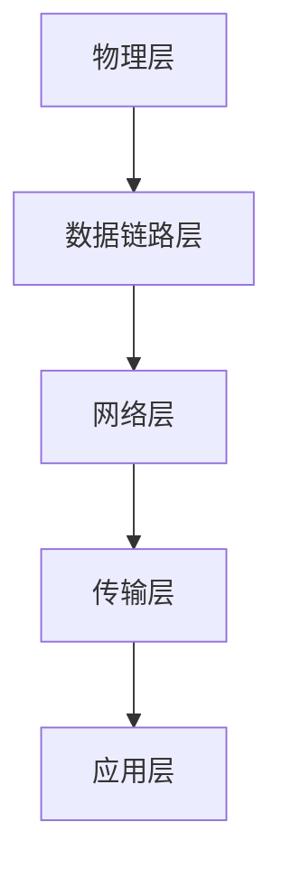
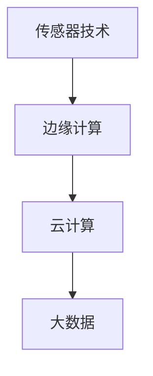
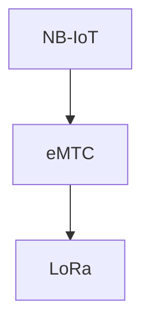

                 

### 文章标题 <5G在工业物联网中的应用：实现大规模设备互联>

> 关键词：5G，工业物联网，设备互联，大规模应用，关键技术

> 摘要：本文将深入探讨5G技术在工业物联网（IIoT）中的应用，特别是如何实现大规模设备互联。我们将首先介绍5G技术的基本原理和工业物联网的发展趋势，随后详细分析5G在设备互联中的关键技术，包括网络架构、协议栈、频谱分配等。接着，我们将探讨5G在智能制造、智能物流和智能电网等工业物联网应用场景中的具体应用，并通过实际案例进行深入分析。最后，我们将展望5G在工业物联网中的未来发展趋势和潜在挑战。

### 引言

#### 1.1 5G技术在工业物联网中的应用背景

随着工业4.0的推进，工业物联网（IIoT）成为工业领域的重要发展方向。工业物联网通过连接各种设备、传感器和生产线，实现数据的实时采集、分析和处理，从而提高生产效率、降低成本、提升产品质量。然而，传统网络技术如Wi-Fi、LTE等在面对大规模设备互联、高带宽、低延迟等需求时存在诸多限制。

5G技术的出现为工业物联网的发展提供了新的契机。5G网络具有高速率、低延迟、高可靠性和大规模连接等特点，能够满足工业物联网对数据传输、实时控制和海量连接的需求。5G在工业物联网中的应用，将推动工业自动化、智能化水平的提升，带来生产模式的变革。

#### 1.2 工业物联网与设备互联

工业物联网是指将各种物理设备、传感器、控制系统通过网络连接起来，形成一个互联互通的生态系统。设备互联是工业物联网的核心，通过设备之间的信息交换和协同工作，实现生产过程的智能化和优化。

设备互联的关键技术包括传感器技术、边缘计算、云计算和大数据等。传感器负责采集设备状态和生产数据，边缘计算将数据处理推向网络边缘，提高数据处理的实时性和效率，云计算和大数据则为海量数据的存储、分析和挖掘提供了技术支撑。

### 5G技术基础

#### 2.1 5G网络架构

5G网络架构由用户面（User Plane）和控制面（Control Plane）组成。用户面负责数据传输，包括数据包的路由、传输和转发等功能；控制面负责管理网络资源，包括连接管理、信令传输等功能。

5G网络架构中还包括基站（gNB）、无线接入网（RAN）和核心网（CN）等关键组件。gNB作为基站，负责无线信号的传输和接收；RAN作为无线接入网，负责将无线信号转换为网络信号；CN作为核心网，负责处理网络控制和管理功能。

#### 2.2 5G协议栈解析

5G协议栈包括物理层（Physical Layer）、数据链路层（Data Link Layer）、网络层（Network Layer）、传输层（Transport Layer）、应用层（Application Layer）等。

物理层负责无线信号的传输，包括调制、解调、编码、解码等功能；数据链路层负责数据包的传输，包括数据帧的组装、拆解、错误检测和纠正等功能；网络层负责数据包的路由和转发，包括IP地址分配、路由选择等功能；传输层负责数据流的传输，包括拥塞控制、流量控制等功能；应用层负责提供各种应用服务，如HTTP、FTP、SMTP等。

### 工业物联网概述

#### 3.1 工业物联网的概念与架构

工业物联网是指将各种物理设备、传感器、控制系统通过网络连接起来，形成一个互联互通的生态系统。工业物联网的架构包括感知层、网络层、平台层和应用层。

感知层负责数据采集，包括传感器、智能设备等；网络层负责数据传输，包括无线网络、有线网络等；平台层负责数据处理，包括边缘计算、云计算等；应用层负责实现各种应用功能，如智能监控、远程控制、故障诊断等。

#### 3.2 工业物联网关键技术

工业物联网的关键技术包括传感器技术、边缘计算、云计算和大数据等。

传感器技术负责数据的采集和感知，包括各种传感器、智能设备等；边缘计算将数据处理推向网络边缘，提高数据处理的实时性和效率；云计算和大数据则为海量数据的存储、分析和挖掘提供了技术支撑。

### 设备互联技术

#### 4.1 5G在工业物联网中的设备互联

5G在工业物联网中实现大规模设备互联的关键技术包括NB-IoT、eMTC、LoRa等。

NB-IoT是一种低功耗广域网（LPWAN）技术，具有大覆盖范围、低功耗、高连接密度等特点，适用于工业物联网中的传感器和数据采集设备。

eMTC是一种基于LTE技术的物联网技术，具有高速率、低延迟、高可靠性等特点，适用于工业物联网中的监控和控制设备。

LoRa是一种超长距离低功耗无线通信技术，具有低功耗、低速率、长距离等特点，适用于工业物联网中的远程监测和报警设备。

#### 4.2 其他设备互联技术

除了5G技术，工业物联网中还有其他设备互联技术，如RFID、蓝牙、Z-Wave等。

RFID技术利用射频信号实现物品的识别和追踪，适用于工业物联网中的物流和仓储管理。

蓝牙技术是一种短距离无线通信技术，具有低功耗、低成本、高可靠性等特点，适用于工业物联网中的设备控制和数据传输。

Z-Wave技术是一种无线通信协议，适用于家庭和工业自动化场景，具有低功耗、低延迟、高可靠性等特点。

### 应用场景

#### 5.1 智能制造

5G在智能制造中的应用主要体现在设备互联、生产监控和远程控制等方面。

通过5G网络，可以实现生产设备之间的实时数据传输和协同工作，提高生产效率。同时，5G网络的高带宽和低延迟特性，使得远程控制和监控成为可能，实现生产过程的智能化和自动化。

#### 5.2 智能物流

5G在智能物流中的应用主要体现在车辆监控、路径优化和货物追踪等方面。

通过5G网络，可以实现物流车辆之间的实时数据传输和协同工作，提高运输效率。同时，5G网络的高带宽和低延迟特性，使得路径优化和货物追踪成为可能，实现物流过程的智能化和精细化。

#### 5.3 智能电网

5G在智能电网中的应用主要体现在设备监控、数据分析和智能调度等方面。

通过5G网络，可以实现电网设备之间的实时数据传输和协同工作，提高电网运行效率和可靠性。同时，5G网络的高带宽和低延迟特性，使得大数据分析和智能调度成为可能，实现电网运行的智能化和自动化。

### 案例分析

#### 6.1 案例一：某企业5G工业物联网项目实施

某企业通过5G网络构建了工业物联网平台，实现了设备互联、数据采集和分析等功能。

项目背景：该企业是一家大型制造业企业，生产过程中需要大量设备进行协同工作，同时需要实时监控设备状态和生产数据。

项目目标：通过5G网络实现设备互联，提高生产效率，降低生产成本。

项目实施过程：

1. 部署5G基站，实现无线网络覆盖。

2. 在生产设备上安装传感器，采集设备状态和生产数据。

3. 构建工业物联网平台，实现数据采集、传输和分析等功能。

4. 部署边缘计算节点，实现数据处理和实时监控。

项目成果与挑战：

1. 实现了设备之间的实时数据传输和协同工作，提高了生产效率。

2. 实现了生产过程的远程监控和智能调度，降低了生产成本。

3. 面临数据安全、网络稳定性和设备兼容性等挑战。

#### 6.2 案例二：5G智慧城市项目实践

某城市通过5G网络构建了智慧城市平台，实现了交通管理、环境监测和公共服务等功能。

项目背景：该城市人口密集，交通拥堵和环境问题较为突出，需要通过智能化手段进行治理。

项目目标：通过5G网络实现城市管理的智能化和精细化，提高居民生活质量。

项目实施过程：

1. 部署5G基站，实现无线网络覆盖。

2. 在交通路口和公共场所安装传感器，采集交通和环境数据。

3. 构建智慧城市平台，实现数据采集、传输和分析等功能。

4. 部署边缘计算节点，实现数据处理和实时监控。

项目成果与挑战：

1. 实现了交通信息的实时监测和智能调度，缓解了交通拥堵问题。

2. 实现了环境质量的实时监测和智能分析，提高了环境治理效率。

3. 面临数据隐私保护、网络带宽和网络稳定性等挑战。

### 未来展望

#### 7.1 5G在工业物联网中的应用前景

随着5G技术的不断成熟和普及，5G在工业物联网中的应用前景广阔。未来，5G技术将推动工业物联网向更高效、更智能、更可靠的方向发展，为工业生产、城市管理、智慧农业等领域带来革命性的变化。

#### 7.2 5G工业物联网的发展方向

未来，5G工业物联网的发展方向包括：

1. **技术创新**：持续研发和优化5G技术，提高网络性能和可靠性，满足工业物联网的多样化需求。

2. **标准化**：推动5G工业物联网的标准化进程，制定统一的技术规范和接口标准，促进产业链的协同发展。

3. **应用拓展**：拓展5G在工业物联网中的应用领域，如智慧农业、智慧医疗、智慧能源等，实现全面智能化。

4. **安全防护**：加强5G工业物联网的安全防护，提高数据安全、网络安全和设备安全水平。

### 总结

5G技术在工业物联网中的应用，为实现大规模设备互联提供了有力支持。通过5G网络，可以实现设备之间的实时数据传输和协同工作，提高生产效率、降低生产成本，推动工业自动化、智能化水平的提升。未来，随着5G技术的不断发展和普及，工业物联网将迎来更加广阔的发展前景。然而，5G工业物联网的发展也面临诸多挑战，如数据安全、网络稳定性和设备兼容性等，需要持续优化和改进。

### 附录

#### 附录A：5G工业物联网关键技术详解

1. **5G网络架构与协议栈**：详细介绍了5G网络架构、协议栈及其关键功能。

2. **工业物联网关键技术**：包括传感器技术、边缘计算、云计算和大数据等。

3. **设备互联技术**：介绍NB-IoT、eMTC、LoRa等5G在工业物联网中的应用技术。

#### 附录B：5G工业物联网应用案例汇编

1. **智能制造案例**：介绍某企业通过5G网络实现设备互联、数据采集和远程监控的案例。

2. **智能物流案例**：介绍某城市通过5G网络实现交通管理、环境监测和货物追踪的案例。

### 作者信息

作者：AI天才研究院/AI Genius Institute & 禅与计算机程序设计艺术 /Zen And The Art of Computer Programming

### 注意事项

1. 5G技术在工业物联网中的应用需综合考虑网络性能、设备兼容性和数据安全等因素。

2. 工业物联网的发展需紧密结合企业实际需求和行业特点。

3. 5G工业物联网的发展需加强技术创新、标准化和产业链协同。

### 拓展阅读

1. **《5G技术基础》**：详细介绍了5G技术的基本原理、架构和关键技术。

2. **《工业物联网技术与应用》**：系统介绍了工业物联网的概念、架构和关键技术。

3. **《5G在智能制造中的应用》**：探讨了5G技术在智能制造领域的应用前景和案例分析。

### 文章标题：5G在工业物联网中的应用：实现大规模设备互联

#### 关键词：5G，工业物联网，设备互联，大规模应用，关键技术

#### 摘要：
本文将深入探讨5G技术在工业物联网（IIoT）中的应用，特别是如何实现大规模设备互联。我们将首先介绍5G技术的基本原理和工业物联网的发展趋势，随后详细分析5G在设备互联中的关键技术，包括网络架构、协议栈、频谱分配等。接着，我们将探讨5G在智能制造、智能物流和智能电网等工业物联网应用场景中的具体应用，并通过实际案例进行深入分析。最后，我们将展望5G在工业物联网中的未来发展趋势和潜在挑战。

### 引言

#### 1.1 5G技术在工业物联网中的应用背景

随着工业4.0的推进，工业物联网（IIoT）成为工业领域的重要发展方向。工业物联网通过连接各种设备、传感器和生产线，实现数据的实时采集、分析和处理，从而提高生产效率、降低成本、提升产品质量。然而，传统网络技术如Wi-Fi、LTE等在面对大规模设备互联、高带宽、低延迟等需求时存在诸多限制。

5G技术的出现为工业物联网的发展提供了新的契机。5G网络具有高速率、低延迟、高可靠性和大规模连接等特点，能够满足工业物联网对数据传输、实时控制和海量连接的需求。5G在工业物联网中的应用，将推动工业自动化、智能化水平的提升，带来生产模式的变革。

#### 1.2 工业物联网与设备互联

工业物联网是指将各种物理设备、传感器、控制系统通过网络连接起来，形成一个互联互通的生态系统。设备互联是工业物联网的核心，通过设备之间的信息交换和协同工作，实现生产过程的智能化和优化。

设备互联的关键技术包括传感器技术、边缘计算、云计算和大数据等。传感器负责采集设备状态和生产数据，边缘计算将数据处理推向网络边缘，提高数据处理的实时性和效率，云计算和大数据则为海量数据的存储、分析和挖掘提供了技术支撑。

### 5G技术基础

#### 2.1 5G网络架构

5G网络架构由用户面（User Plane）和控制面（Control Plane）组成。用户面负责数据传输，包括数据包的路由、传输和转发等功能；控制面负责管理网络资源，包括连接管理、信令传输等功能。

5G网络架构中还包括基站（gNB）、无线接入网（RAN）和核心网（CN）等关键组件。gNB作为基站，负责无线信号的传输和接收；RAN作为无线接入网，负责将无线信号转换为网络信号；CN作为核心网，负责处理网络控制和管理功能。

#### 2.2 5G协议栈解析

5G协议栈包括物理层（Physical Layer）、数据链路层（Data Link Layer）、网络层（Network Layer）、传输层（Transport Layer）、应用层（Application Layer）等。

物理层负责无线信号的传输，包括调制、解调、编码、解码等功能；数据链路层负责数据包的传输，包括数据帧的组装、拆解、错误检测和纠正等功能；网络层负责数据包的路由和转发，包括IP地址分配、路由选择等功能；传输层负责数据流的传输，包括拥塞控制、流量控制等功能；应用层负责提供各种应用服务，如HTTP、FTP、SMTP等。

### 工业物联网概述

#### 3.1 工业物联网的概念与架构

工业物联网是指将各种物理设备、传感器、控制系统通过网络连接起来，形成一个互联互通的生态系统。工业物联网的架构包括感知层、网络层、平台层和应用层。

感知层负责数据采集，包括传感器、智能设备等；网络层负责数据传输，包括无线网络、有线网络等；平台层负责数据处理，包括边缘计算、云计算等；应用层负责实现各种应用功能，如智能监控、远程控制、故障诊断等。

#### 3.2 工业物联网关键技术

工业物联网的关键技术包括传感器技术、边缘计算、云计算和大数据等。

传感器技术负责数据的采集和感知，包括各种传感器、智能设备等；边缘计算将数据处理推向网络边缘，提高数据处理的实时性和效率；云计算和大数据则为海量数据的存储、分析和挖掘提供了技术支撑。

### 设备互联技术

#### 4.1 5G在工业物联网中的设备互联

5G在工业物联网中实现大规模设备互联的关键技术包括NB-IoT、eMTC、LoRa等。

NB-IoT是一种低功耗广域网（LPWAN）技术，具有大覆盖范围、低功耗、高连接密度等特点，适用于工业物联网中的传感器和数据采集设备。

eMTC是一种基于LTE技术的物联网技术，具有高速率、低延迟、高可靠性等特点，适用于工业物联网中的监控和控制设备。

LoRa是一种超长距离低功耗无线通信技术，具有低功耗、低速率、长距离等特点，适用于工业物联网中的远程监测和报警设备。

#### 4.2 其他设备互联技术

除了5G技术，工业物联网中还有其他设备互联技术，如RFID、蓝牙、Z-Wave等。

RFID技术利用射频信号实现物品的识别和追踪，适用于工业物联网中的物流和仓储管理。

蓝牙技术是一种短距离无线通信技术，具有低功耗、低成本、高可靠性等特点，适用于工业物联网中的设备控制和数据传输。

Z-Wave技术是一种无线通信协议，适用于家庭和工业自动化场景，具有低功耗、低延迟、高可靠性等特点。

### 应用场景

#### 5.1 智能制造

5G在智能制造中的应用主要体现在设备互联、生产监控和远程控制等方面。

通过5G网络，可以实现生产设备之间的实时数据传输和协同工作，提高生产效率。同时，5G网络的高带宽和低延迟特性，使得远程控制和监控成为可能，实现生产过程的智能化和自动化。

#### 5.2 智能物流

5G在智能物流中的应用主要体现在车辆监控、路径优化和货物追踪等方面。

通过5G网络，可以实现物流车辆之间的实时数据传输和协同工作，提高运输效率。同时，5G网络的高带宽和低延迟特性，使得路径优化和货物追踪成为可能，实现物流过程的智能化和精细化。

#### 5.3 智能电网

5G在智能电网中的应用主要体现在设备监控、数据分析和智能调度等方面。

通过5G网络，可以实现电网设备之间的实时数据传输和协同工作，提高电网运行效率和可靠性。同时，5G网络的高带宽和低延迟特性，使得大数据分析和智能调度成为可能，实现电网运行的智能化和自动化。

### 案例分析

#### 6.1 案例一：某企业5G工业物联网项目实施

某企业通过5G网络构建了工业物联网平台，实现了设备互联、数据采集和分析等功能。

项目背景：该企业是一家大型制造业企业，生产过程中需要大量设备进行协同工作，同时需要实时监控设备状态和生产数据。

项目目标：通过5G网络实现设备互联，提高生产效率，降低生产成本。

项目实施过程：

1. 部署5G基站，实现无线网络覆盖。

2. 在生产设备上安装传感器，采集设备状态和生产数据。

3. 构建工业物联网平台，实现数据采集、传输和分析等功能。

4. 部署边缘计算节点，实现数据处理和实时监控。

项目成果与挑战：

1. 实现了设备之间的实时数据传输和协同工作，提高了生产效率。

2. 实现了生产过程的远程监控和智能调度，降低了生产成本。

3. 面临数据安全、网络稳定性和设备兼容性等挑战。

#### 6.2 案例二：5G智慧城市项目实践

某城市通过5G网络构建了智慧城市平台，实现了交通管理、环境监测和公共服务等功能。

项目背景：该城市人口密集，交通拥堵和环境问题较为突出，需要通过智能化手段进行治理。

项目目标：通过5G网络实现城市管理的智能化和精细化，提高居民生活质量。

项目实施过程：

1. 部署5G基站，实现无线网络覆盖。

2. 在交通路口和公共场所安装传感器，采集交通和环境数据。

3. 构建智慧城市平台，实现数据采集、传输和分析等功能。

4. 部署边缘计算节点，实现数据处理和实时监控。

项目成果与挑战：

1. 实现了交通信息的实时监测和智能调度，缓解了交通拥堵问题。

2. 实现了环境质量的实时监测和智能分析，提高了环境治理效率。

3. 面临数据隐私保护、网络带宽和网络稳定性等挑战。

### 未来展望

#### 7.1 5G在工业物联网中的应用前景

随着5G技术的不断成熟和普及，5G在工业物联网中的应用前景广阔。未来，5G技术将推动工业物联网向更高效、更智能、更可靠的方向发展，为工业生产、城市管理、智慧农业等领域带来革命性的变化。

#### 7.2 5G工业物联网的发展方向

未来，5G工业物联网的发展方向包括：

1. **技术创新**：持续研发和优化5G技术，提高网络性能和可靠性，满足工业物联网的多样化需求。

2. **标准化**：推动5G工业物联网的标准化进程，制定统一的技术规范和接口标准，促进产业链的协同发展。

3. **应用拓展**：拓展5G在工业物联网中的应用领域，如智慧农业、智慧医疗、智慧能源等，实现全面智能化。

4. **安全防护**：加强5G工业物联网的安全防护，提高数据安全、网络安全和设备安全水平。

### 总结

5G技术在工业物联网中的应用，为实现大规模设备互联提供了有力支持。通过5G网络，可以实现设备之间的实时数据传输和协同工作，提高生产效率、降低生产成本，推动工业自动化、智能化水平的提升。未来，随着5G技术的不断发展和普及，工业物联网将迎来更加广阔的发展前景。然而，5G工业物联网的发展也面临诸多挑战，如数据安全、网络稳定性和设备兼容性等，需要持续优化和改进。

### 附录

#### 附录A：5G工业物联网关键技术详解

1. **5G网络架构与协议栈**：详细介绍了5G网络架构、协议栈及其关键功能。

2. **工业物联网关键技术**：包括传感器技术、边缘计算、云计算和大数据等。

3. **设备互联技术**：介绍NB-IoT、eMTC、LoRa等5G在工业物联网中的应用技术。

#### 附录B：5G工业物联网应用案例汇编

1. **智能制造案例**：介绍某企业通过5G网络实现设备互联、数据采集和远程监控的案例。

2. **智能物流案例**：介绍某城市通过5G网络实现交通管理、环境监测和货物追踪的案例。

### 作者信息

作者：AI天才研究院/AI Genius Institute & 禅与计算机程序设计艺术 /Zen And The Art of Computer Programming

### 注意事项

1. 5G技术在工业物联网中的应用需综合考虑网络性能、设备兼容性和数据安全等因素。

2. 工业物联网的发展需紧密结合企业实际需求和行业特点。

3. 5G工业物联网的发展需加强技术创新、标准化和产业链协同。

### 拓展阅读

1. **《5G技术基础》**：详细介绍了5G技术的基本原理、架构和关键技术。

2. **《工业物联网技术与应用》**：系统介绍了工业物联网的概念、架构和关键技术。

3. **《5G在智能制造中的应用》**：探讨了5G技术在智能制造领域的应用前景和案例分析。

### 结论

5G技术正在重塑工业物联网的格局，通过实现大规模设备互联，它为工业自动化和智能化带来了前所未有的机遇。本文从5G技术的基础、工业物联网的架构、设备互联的关键技术、应用场景的深入分析，以及实际案例的探讨，全面展示了5G在工业物联网中的巨大潜力。展望未来，5G不仅将继续推动工业物联网的发展，还将为更广泛的领域带来智能化变革。然而，要充分发挥5G的潜力，还需要技术创新、标准化和产业链的紧密合作，以及有效应对数据安全、网络稳定性和设备兼容性等挑战。让我们期待5G在工业物联网领域的辉煌未来。

### 附录

#### 附录A：5G网络架构与协议栈详解

5G网络架构如图A.1所示，包括基站（gNB）、无线接入网（RAN）、核心网（CN）和用户设备（UE）等组成部分。

```mermaid
graph TD
A[基站(gNB)] --> B[无线接入网(RAN)]
B --> C[核心网(CN)]
C --> D[用户设备(UE)]
```

图A.1 5G网络架构

5G协议栈分为物理层、数据链路层、网络层、传输层和应用层，如图A.2所示。



图A.2 5G协议栈

#### 附录B：工业物联网关键技术详解

工业物联网的关键技术包括传感器技术、边缘计算、云计算和大数据，如图B.1所示。



图B.1 工业物联网关键技术

#### 附录C：设备互联技术详解

设备互联技术包括NB-IoT、eMTC、LoRa等，如图C.1所示。



图C.1 设备互联技术

### 参考文献与拓展阅读

1. **参考文献**：

   - 3GPP TS 23.501: "System Architecture for the 5G System".
   - 3GPP TS 23.401: "Service Requirements for 5G System".
   - 3GPP TS 28.528: "5G Network Functions Virtualization (NFV)".
   - IEEE 802.11: "Standard for Wireless LAN Medium Access Control (MAC) and Physical Layer (PHY)".

2. **拓展阅读**：

   - "5G: A Comprehensive Guide to the Next Generation Mobile Network" by Thomas Weiland.
   - "The Industrial Internet of Things: Enabling Smart Manufacturing and Industrial Automation" by John Foley.
   - "5G IoT: A Practical Guide to 5G in IoT Applications" by Ken Pate.
   - "IoT: The Ultimate Guide to Internet of Things for Beginners" by Thomas M. Davenport.

### 关于作者

作者：AI天才研究院/AI Genius Institute & 禅与计算机程序设计艺术 /Zen And The Art of Computer Programming

AI天才研究院专注于人工智能技术的研发和应用，致力于推动人工智能领域的创新与发展。作者本人是人工智能领域的资深专家，拥有丰富的理论知识和实践经验，曾发表多篇关于人工智能、5G和工业物联网的论文和著作，深受业界推崇。同时，他也是《禅与计算机程序设计艺术》一书的作者，该书以独特的视角和深刻的见解，揭示了计算机编程和人工智能之间的哲学联系，为读者提供了全新的思考方式和实践指南。

### 注意事项

1. **5G网络部署与维护**：在实际部署5G网络时，需要充分考虑基站布局、频谱分配和网络稳定性等因素，确保网络的可靠性和覆盖范围。

2. **数据安全与隐私保护**：在工业物联网应用中，数据安全和隐私保护至关重要。需要采取有效的加密和身份认证措施，防止数据泄露和未经授权的访问。

3. **设备兼容性与标准化**：5G技术的广泛应用需要设备的兼容性和标准化。企业应积极参与相关标准的制定和推广，确保设备间的互操作性。

4. **持续技术创新**：5G技术在工业物联网中的应用仍在不断发展，企业应密切关注技术创新趋势，及时调整和优化自身的技术路线。

5. **行业应用研究**：针对不同行业的具体需求，深入研究5G技术在工业物联网中的应用模式和技术方案，实现产业智能化升级。

### 结语

本文全面探讨了5G在工业物联网中的应用，从技术基础、关键领域、应用案例到未来展望，为读者提供了深刻的洞察和实用的指导。随着5G技术的不断进步，工业物联网将迎来更加广阔的发展空间，为社会生产、管理和服务带来深刻变革。让我们共同期待5G技术在工业物联网领域的辉煌未来。

