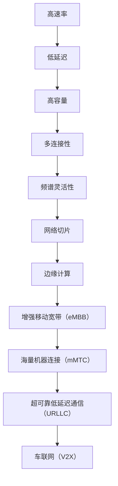

                 

### 第二部分：5G技术基础

#### 2.1 5G技术概述

5G，即第五代移动通信技术（5th Generation Mobile Communication Technology），是继1G模拟通信、2G数字通信、3G宽带通信和4G高速通信之后的新一代通信技术。5G技术的核心目标是提供更快的数据传输速率、更低的延迟、更高的网络容量以及更广的连接范围。5G网络在频谱利用率、能量效率、网络可靠性等方面都有显著提升，从而满足未来互联网的巨大需求。

#### 5G技术的核心特性

1. **高速率**：5G网络的理论峰值下载速度可达20Gbps，是4G网络的100倍以上。这意味着用户可以几乎瞬间下载高清视频、大文件等，极大地提高了用户体验。

2. **低延迟**：5G网络的端到端延迟通常在1毫秒左右，相比4G的20-30毫秒大幅降低。低延迟对于实时应用，如虚拟现实直播、在线游戏等至关重要。

3. **高容量**：5G网络可以支持更多的设备同时在线，理论上每个基站可以连接100万台设备。这为大规模物联网应用提供了可能。

4. **广覆盖**：5G采用了更多的基站和更高的频谱利用率，使得网络覆盖范围更广，即使在人口密集的城区和偏远地区也能提供稳定的连接。

#### 5G技术的应用场景

1. **增强移动宽带（eMBB）**：这是5G最典型的应用场景，主要针对高速移动宽带服务，如高清视频流、虚拟现实等。

2. **海量机器连接（mMTC）**：适合物联网应用，如智能城市、智能家居等。

3. **超可靠低延迟通信（URLLC）**：主要应用于自动驾驶、工业自动化等需要极低延迟和高度可靠性的场景。

4. **车联网（V2X）**：通过5G网络实现车辆与车辆、车辆与基础设施之间的通信，提升交通安全性和效率。

### 2.2 5G网络的关键特性

1. **多连接性**：5G网络支持更高的连接密度，可以同时连接更多的设备。这使得在大型活动、展会等场景中，众多用户可以同时在线观看直播，而不会导致网络拥堵。

2. **频谱灵活性**：5G网络利用了更多的频谱资源，包括低频段、高频段和未利用的频段。这提高了网络的传输效率和覆盖范围。

3. **网络切片**：5G网络可以基于不同的应用需求，创建多个虚拟网络。每个网络切片可以独立配置资源，从而满足不同应用的需求。

4. **边缘计算**：5G网络将计算能力分散到网络的边缘，减少了数据传输的距离和延迟，提升了用户体验。

### 2.3 5G技术的应用场景

1. **增强移动宽带（eMBB）**：适合高速数据传输的场景，如高清视频直播、虚拟现实等。

2. **海量机器连接（mMTC）**：适用于物联网设备，如智能手表、智能家居等。

3. **超可靠低延迟通信（URLLC）**：适合自动驾驶、远程医疗等需要高可靠性和低延迟的场景。

4. **车联网（V2X）**：通过5G网络实现车辆与车辆、车辆与基础设施之间的通信。

#### 关键概念与联系

为了更清晰地理解5G技术在虚拟现实直播中的应用，我们可以通过以下Mermaid流程图展示核心概念之间的关系：



通过以上流程图，我们可以看到5G技术的关键特性是如何相互关联，并应用于不同的场景中，为虚拟现实直播提供了强大的技术支撑。

#### 核心算法原理讲解

在5G网络中，关键算法对于实现高速率和低延迟的数据传输至关重要。以下是5G网络中常用的几种核心算法原理及其伪代码说明：

1. **多输入多输出（MIMO）算法**：

   MIMO算法通过使用多个天线进行信号传输和接收，提高了数据传输速率和信道容量。

   ```plaintext
   // MIMO算法伪代码
   function MIMO(data, antennas):
       for each antenna in antennas:
           transmit(data, antenna)
           receive(data, antenna)
       end for
       combineReceivedData()
   ```

2. **波束成形（Beamforming）算法**：

   波束成形算法通过调整天线阵列的方向，提高信号的方向性，从而提高传输效率和可靠性。

   ```plaintext
   // 波束成形算法伪代码
   function Beamforming(antennaArray, signalDirection):
       adjustAntennaArray(antennaArray, signalDirection)
       transmitSignal(antennaArray)
   ```

3. **网络编码（Network Coding）算法**：

   网络编码算法通过在多个节点之间进行数据的编码和合并，提高了网络的整体传输效率和吞吐量。

   ```plaintext
   // 网络编码算法伪代码
   function NetworkCoding(dataPackets):
       for each node in network:
           combineAndEncode(dataPackets)
       end for
       transmitEncodedData()
   ```

#### 数学模型和公式

为了更深入地理解5G技术的性能指标，我们可以使用以下数学模型和公式来详细阐述：

1. **信道容量公式**：

   信道容量 \( C \) 可以用以下公式计算：

   $$ C = W \log_2(1 + \text{SNR}) $$

   其中，\( W \) 是信道带宽，\( \text{SNR} \) 是信噪比。

2. **传输速率公式**：

   传输速率 \( R \) 可以用以下公式计算：

   $$ R = C \times \text{编码效率} $$

   其中，编码效率通常在0.5到1之间。

3. **延迟公式**：

   延迟 \( D \) 包括传输延迟和传播延迟：

   $$ D = D_t + D_p $$

   其中，\( D_t \) 是传输延迟，\( D_p \) 是传播延迟。

#### 举例说明

假设一个5G网络中，信道带宽为100MHz，信噪比为30dB，编码效率为0.8。根据上述公式，我们可以计算得到：

- **信道容量**：

  $$ C = 100 \times 10^6 \times \log_2(1 + 10^{30/10}) \approx 7.97 \times 10^8 \text{bps} $$

- **传输速率**：

  $$ R = 7.97 \times 10^8 \times 0.8 \approx 6.3 \times 10^8 \text{bps} $$

- **延迟**：

  假设传输距离为1000km，光速为300,000km/s，则传播延迟为：

  $$ D_p = \frac{1000}{300,000} \approx 0.0033 \text{s} $$

  如果传输延迟为5ms，则总延迟为：

  $$ D = 0.0033 + 0.005 = 0.0083 \text{s} $$

通过这些举例说明，我们可以更好地理解5G技术的性能指标如何影响虚拟现实直播的体验。

### 第三部分：虚拟现实直播技术

#### 3.1 虚拟现实技术基础

虚拟现实（VR）是一种通过计算机技术和传感器设备，创建模拟的3D环境，使用户能够沉浸在其中并与之交互的技术。VR的关键组成部分包括：

- **头戴式显示器（HMD）**：如Oculus Rift、HTC Vive等，提供沉浸式的视觉体验。
- **追踪系统**：用于跟踪用户的头动和手部动作，确保用户在虚拟环境中的交互。
- **输入设备**：如手柄、手套等，用于用户与虚拟环境的交互。
- **计算平台**：包括高性能的处理器和图形处理单元，用于实时渲染虚拟环境。

#### 3.2 虚拟现实直播的关键技术

虚拟现实直播涉及到多个关键技术，包括：

- **实时渲染**：虚拟现实直播需要实时渲染大量的3D场景，保证观众在观看时能够感受到流畅的视觉效果。
- **低延迟传输**：由于虚拟现实直播的实时性要求高，网络传输的延迟必须非常低，以确保用户在虚拟环境中的互动体验不会受到显著影响。
- **高效压缩**：为了满足高速传输的需求，视频和音频数据需要进行高效的压缩，同时保持高质量。
- **多视角视频编码**：虚拟现实直播通常需要支持多个视角，因此需要使用多视角视频编码技术，将多个视角的视频数据高效地编码和传输。

#### 3.3 虚拟现实直播的优势与挑战

虚拟现实直播的优势包括：

- **沉浸式体验**：观众能够以第一人称视角沉浸在虚拟环境中，获得高度真实的体验。
- **互动性**：观众可以与虚拟环境中的对象进行互动，增强了观看的趣味性和参与感。
- **多视角选择**：观众可以根据自己的兴趣选择不同的视角，获得个性化的观看体验。

然而，虚拟现实直播也面临以下挑战：

- **带宽需求**：高质量的虚拟现实直播需要大量的带宽，这对网络基础设施提出了高要求。
- **延迟问题**：低延迟传输是虚拟现实直播的关键，任何延迟都会影响用户的互动体验。
- **设备限制**：虚拟现实设备（如HMD）的普及率和价格较高，限制了普通用户的参与。
- **内容制作**：高质量的虚拟现实直播内容制作成本高，技术要求高，限制了内容的产出。

### 背景介绍

虚拟现实技术（VR）是一种通过计算机生成模拟环境，使用户能够沉浸其中并进行互动的先进技术。近年来，随着计算能力的提升、传感器技术的进步以及网络带宽的增加，虚拟现实技术在各个领域的应用逐渐普及，特别是在直播领域。虚拟现实直播通过将用户置身于一个三维的虚拟环境中，使用户能够以第一人称视角观看和体验，极大提升了观看的沉浸感和互动性。

#### 虚拟现实直播的关键概念

虚拟现实直播涉及多个关键技术，包括：

1. **实时渲染**：虚拟现实直播需要对场景进行实时渲染，生成高质量的3D图像。这需要强大的图形处理能力和高效的渲染算法。

2. **低延迟传输**：由于虚拟现实直播的实时性要求高，网络传输的延迟必须非常低，以确保用户在虚拟环境中的互动体验不会受到显著影响。

3. **高效压缩**：为了满足高速传输的需求，视频和音频数据需要进行高效的压缩，同时保持高质量。

4. **多视角视频编码**：虚拟现实直播通常需要支持多个视角，因此需要使用多视角视频编码技术，将多个视角的视频数据高效地编码和传输。

#### 虚拟现实直播的优势

虚拟现实直播具备以下显著优势：

1. **沉浸式体验**：通过头戴式显示器（HMD）等设备，用户能够以第一人称视角沉浸在虚拟环境中，获得高度真实的体验。

2. **互动性**：用户可以与虚拟环境中的对象进行互动，增强了观看的趣味性和参与感。

3. **多视角选择**：用户可以根据自己的兴趣选择不同的视角，获得个性化的观看体验。

#### 虚拟现实直播的挑战

尽管虚拟现实直播具有诸多优势，但同时也面临一些挑战：

1. **带宽需求**：高质量的虚拟现实直播需要大量的带宽，这对网络基础设施提出了高要求。

2. **延迟问题**：低延迟传输是虚拟现实直播的关键，任何延迟都会影响用户的互动体验。

3. **设备限制**：虚拟现实设备（如HMD）的普及率和价格较高，限制了普通用户的参与。

4. **内容制作**：高质量的虚拟现实直播内容制作成本高，技术要求高，限制了内容的产出。

#### 虚拟现实直播与5G技术的结合

5G技术的引入为虚拟现实直播提供了强大的支持：

1. **高速率**：5G网络的高速传输能力可以满足虚拟现实直播对高带宽的需求。

2. **低延迟**：5G网络的低延迟特性确保了虚拟现实直播的实时性和互动性。

3. **广覆盖**：5G网络的广覆盖能力可以提升虚拟现实直播的接入范围，使其更适用于户外直播等场景。

4. **边缘计算**：5G网络的边缘计算能力可以将部分计算任务分散到网络边缘，降低延迟，提高用户体验。

通过5G技术的支持，虚拟现实直播可以在更广泛的应用场景中实现，提供更加沉浸式和互动的观看体验。

### 第四部分：5G在虚拟现实直播中的应用

#### 4.1 5G网络在虚拟现实直播中的应用

5G网络在虚拟现实直播中的应用主要体现在以下几个方面：

1. **高速率传输**：5G网络的高带宽特性能够满足虚拟现实直播对大流量数据传输的需求。这意味着直播内容可以以更高的分辨率和帧率传输，为观众提供更加清晰和流畅的观看体验。

2. **低延迟传输**：5G网络的低延迟特性是虚拟现实直播的关键优势。延迟的降低可以确保用户在互动时感受到实时响应，从而增强沉浸式体验。

3. **广覆盖与高容量**：5G网络的广覆盖和高容量特性使得虚拟现实直播可以在更多场景下进行，包括大型活动、户外直播等。网络的高容量可以支持大量用户同时在线观看，而不会导致网络拥堵。

#### 4.2 5G网络对虚拟现实直播的影响

1. **用户体验提升**：5G网络的高速率和低延迟特性直接提升了虚拟现实直播的用户体验。观众可以在观看直播时享受到更加流畅、清晰的视频内容和更加迅速的互动响应。

2. **直播质量提高**：5G网络的高带宽支持虚拟现实直播使用更高的分辨率和帧率，从而提升直播内容的画面质量。此外，低延迟传输也确保了实时交互的流畅性，使得用户在虚拟环境中的体验更加真实。

3. **场景扩展**：5G网络的广覆盖特性使得虚拟现实直播的应用场景得到了极大的扩展。无论是室内活动还是户外直播，5G网络都能提供稳定的连接，为用户提供高质量的观看体验。

#### 4.3 虚拟现实直播的优化策略

为了充分利用5G网络的优势，提升虚拟现实直播的质量和用户体验，可以采取以下优化策略：

1. **多连接优化**：利用5G网络的多连接特性，为用户提供多个网络连接，确保在信号波动时仍能保持稳定连接。

2. **智能流控**：通过智能流控技术，根据网络状况和用户需求动态调整视频流的质量和带宽，以提供最佳观看体验。

3. **内容压缩**：采用高效的视频压缩算法，减少数据传输量，同时保持高质量的视频内容。

4. **边缘计算**：利用5G网络的边缘计算能力，将部分计算任务分散到网络边缘，降低延迟，提高互动体验。

5. **多视角支持**：通过多视角视频编码技术，支持用户选择不同视角，提供个性化的观看体验。

### 第五部分：虚拟现实直播系统设计与实现

#### 5.1 虚拟现实直播系统架构

虚拟现实直播系统架构主要包括以下几个核心模块：

1. **直播信号采集模块**：负责采集虚拟环境中的视频和音频信号，通过摄像头、麦克风等设备获取原始数据。

2. **信号处理模块**：对采集到的信号进行处理，包括图像的实时渲染、音频的实时处理等。

3. **编码压缩模块**：对处理后的信号进行编码压缩，以适应网络传输需求。常用的编码压缩算法包括H.264、H.265以及VP9等。

4. **传输模块**：负责将编码压缩后的信号通过网络传输到观众端。5G网络的优势在于其高速率和低延迟，可以显著提升传输效率。

5. **解码播放模块**：观众端的设备接收到传输的信号后，通过解码播放模块进行解码，并在虚拟现实设备上呈现。

6. **用户交互模块**：提供与用户的互动功能，如切换视角、发送弹幕等。

#### 5.2 虚拟现实直播关键技术实现

1. **实时渲染技术**：

   实时渲染是虚拟现实直播的核心技术之一。为了实现高质量的实时渲染，系统需要采用高效的图形处理算法和GPU加速技术。以下是实时渲染的关键技术：

   - **多线程渲染**：利用多线程技术，将渲染任务分解为多个子任务，并行处理，提高渲染效率。
   - **GPU编程**：使用GPU编程语言（如OpenGL、Vulkan）进行渲染，充分发挥GPU的并行计算能力。
   - **光流估计**：使用光流算法，预测图像中的运动，优化渲染过程，降低计算复杂度。

2. **低延迟传输技术**：

   低延迟传输是虚拟现实直播的关键要求。为了实现低延迟传输，系统需要采用以下关键技术：

   - **数据压缩**：采用高效的视频压缩算法（如H.265），减少数据传输量，同时保持高质量的视频内容。
   - **网络优化**：通过优化网络传输路径，减少数据传输的延迟和抖动。
   - **边缘计算**：利用5G网络的边缘计算能力，将部分计算任务分散到网络边缘，降低延迟。

3. **多视角视频编码技术**：

   多视角视频编码技术支持用户选择不同的视角观看直播。以下是多视角视频编码的关键技术：

   - **多视图合成**：将多个视图合成为一个输出视频流，减少数据传输量。
   - **多视角编码**：使用多视角编码算法（如MVEM），对不同视角的视频流进行编码。
   - **编码压缩**：对多个视角的视频流进行编码压缩，以适应网络传输需求。

#### 5.3 虚拟现实直播案例分析

以下是一个虚拟现实直播系统设计的案例分析：

**案例背景**：某公司计划举办一场虚拟现实直播活动，邀请全球用户观看。活动内容包括虚拟音乐会、虚拟旅游和虚拟教育课程。

**系统架构**：

1. **直播信号采集模块**：使用多台高清摄像头和麦克风采集虚拟环境中的视频和音频信号。信号处理模块对这些信号进行实时处理，包括图像的滤波、色彩校正和音频的降噪处理。

2. **编码压缩模块**：将处理后的信号进行编码压缩。为了支持不同视角的需求，系统采用多视角视频编码技术，将不同视角的视频流编码为多个独立的流。

3. **传输模块**：使用5G网络传输编码压缩后的信号。为了确保传输的稳定性，系统采用网络优化技术，优化传输路径，减少延迟和抖动。

4. **解码播放模块**：观众端接收到传输的信号后，通过解码播放模块进行解码，并在虚拟现实设备上呈现。

5. **用户交互模块**：提供与用户的互动功能，如切换视角、发送弹幕等。

**关键实现**：

1. **实时渲染技术**：系统采用多线程渲染技术，将渲染任务分解为多个子任务，并行处理，提高渲染效率。同时，使用GPU编程，充分发挥GPU的并行计算能力。

2. **低延迟传输技术**：系统采用高效的数据压缩算法（如H.265），减少数据传输量。同时，利用5G网络的边缘计算能力，将部分计算任务分散到网络边缘，降低延迟。

3. **多视角视频编码技术**：系统采用多视角编码算法（如MVEM），对不同视角的视频流进行编码。同时，使用多视图合成技术，将多个视角的视频流合成为一个输出视频流，减少数据传输量。

通过以上分析，我们可以看到，虚拟现实直播系统设计的关键在于实时渲染、低延迟传输和多视角视频编码技术的实现。结合5G网络的优势，可以实现高质量、低延迟的虚拟现实直播，为用户提供沉浸式观看体验。

### 第六部分：虚拟现实直播中的沉浸式体验设计

#### 6.1 沉浸式体验的概念与要素

沉浸式体验是一种通过技术手段，使用户在感官和心理上感受到完全置身于虚拟环境中的体验。沉浸式体验的要素包括：

1. **视觉沉浸**：通过高分辨率显示和立体视觉技术，使用户在视觉上感受到逼真的场景。
2. **听觉沉浸**：利用空间音频技术，如杜比全景声，为用户带来全方位的听觉体验。
3. **触觉沉浸**：通过触觉反馈设备，如触觉手套和触觉座椅，使用户在触觉上感受到虚拟环境中的交互。
4. **运动沉浸**：通过动作捕捉和虚拟现实控制器，使用户能够自由移动和操控虚拟环境。

#### 6.2 沉浸式体验的设计原则

为了设计出高质量的沉浸式体验，以下原则应当被遵循：

1. **真实性**：虚拟环境应尽可能真实，包括视觉、听觉和触觉等方面，以使用户感受到身临其境的感觉。
2. **互动性**：虚拟环境应具有高度的互动性，使用户能够与虚拟对象进行交互，提升参与感。
3. **一致性**：虚拟环境的各个感官刺激应当保持一致，避免出现视觉和听觉上的不协调，影响用户体验。
4. **适应性**：虚拟环境应能够根据用户的需求和反馈进行自适应调整，提供个性化的体验。

#### 6.3 沉浸式体验的实现方法

实现高质量的沉浸式体验需要采用以下方法：

1. **高分辨率显示**：使用高分辨率显示屏和立体视觉技术，如OLED屏幕和3D立体投影，提升视觉沉浸感。
2. **空间音频技术**：采用空间音频技术，如杜比全景声和虚拟现实耳机，提供全方位的听觉体验。
3. **触觉反馈设备**：使用触觉反馈设备，如触觉手套和触觉座椅，增强触觉沉浸感。
4. **动作捕捉与控制**：通过动作捕捉技术和虚拟现实控制器，实现用户的自由移动和操控，提升运动沉浸感。
5. **实时渲染与压缩**：采用实时渲染技术和高效的视频压缩算法，确保虚拟环境的流畅性和低延迟。

#### 6.4 案例分析

以下是一个虚拟现实直播沉浸式体验的案例分析：

**案例背景**：某公司举办了一场虚拟音乐会，通过虚拟现实直播将音乐会场景呈现给全球观众。

**沉浸式体验设计**：

1. **视觉沉浸**：使用OLED屏幕和高分辨率摄像头，捕捉音乐会现场的每一个细节，并在虚拟现实中进行实时渲染，使观众能够清晰地看到舞台的布置、表演者的动作和表情。
2. **听觉沉浸**：使用杜比全景声技术，为观众提供全方位的音频体验，包括乐队乐器的声音、观众的掌声和欢呼等，使观众仿佛置身于现场。
3. **触觉沉浸**：通过触觉手套，观众可以在虚拟环境中感受到舞台的振动和乐器的触感，增强了互动体验。
4. **运动沉浸**：观众通过虚拟现实控制器可以自由移动，选择不同的视角观看音乐会，甚至可以与表演者互动，提升参与感。

通过以上案例分析，我们可以看到，通过合理的设计和技术的应用，虚拟现实直播能够为用户提供高质量的沉浸式体验，使观众在虚拟环境中感受到身临其境的感觉。

### 第七部分：虚拟现实直播的运营与管理

#### 7.1 虚拟现实直播的运营策略

虚拟现实直播的运营策略是确保直播内容吸引观众、提高用户留存率和提升品牌价值的关键。以下是一些有效的运营策略：

1. **内容策划**：根据目标受众的需求和兴趣，策划高质量、有吸引力的直播内容。内容可以包括娱乐、教育、体育、旅游等多个领域。

2. **用户互动**：通过弹幕、互动问答、投票等互动方式，增强用户参与感，提高用户的观看体验。

3. **营销推广**：利用社交媒体、直播平台等渠道，进行营销推广，吸引更多的观众关注和参与。

4. **合作与联盟**：与其他品牌、机构或主播进行合作，共同推广直播内容，扩大影响力。

5. **数据分析**：通过数据分析，了解观众的观看行为和偏好，不断优化直播内容和运营策略。

#### 7.2 虚拟现实直播的内容策划与制作

高质量的内容策划和制作是虚拟现实直播成功的关键。以下是一些内容策划和制作的要点：

1. **选题定位**：根据受众的需求和兴趣，选择合适的主题和内容。例如，针对科技爱好者，可以选择虚拟现实技术讲座或应用展示。

2. **脚本编写**：编写详细的直播脚本，包括内容概述、互动环节、时间安排等，确保直播流程清晰、有序。

3. **技术准备**：确保直播设备和技术准备充分，包括高清摄像头、专业麦克风、稳定的网络连接等。

4. **内容创作**：邀请专业主播或团队，进行高质量的直播内容创作，确保内容的趣味性和专业性。

5. **后期处理**：对直播内容进行剪辑、特效添加等后期处理，提升内容的观赏性。

#### 7.3 虚拟现实直播的观众互动与运营

观众互动和运营是提高虚拟现实直播用户体验和用户留存率的重要手段。以下是一些关键点：

1. **实时互动**：在直播过程中，通过弹幕、实时聊天、互动问答等方式，与观众进行实时互动，提升观众参与感。

2. **互动活动**：定期举办互动活动，如抽奖、投票、答题等，激发观众参与热情。

3. **用户反馈**：积极收集用户反馈，了解用户的需求和意见，不断改进直播内容和运营策略。

4. **社群运营**：建立观众社群，如微信群、QQ群等，加强与观众的沟通和互动，提高用户粘性。

5. **跨平台运营**：利用多个直播平台，如斗鱼、虎牙、YouTube等，扩大直播的受众范围。

通过以上运营策略、内容策划与制作以及观众互动与运营，虚拟现实直播可以更好地吸引观众，提升用户体验，实现持续的发展和壮大。

### 第八部分：未来发展趋势与展望

#### 8.1 虚拟现实直播技术发展趋势

虚拟现实直播技术正朝着更加智能化、沉浸化和个性化的方向快速发展。以下是未来虚拟现实直播技术的一些发展趋势：

1. **AI智能互动**：未来虚拟现实直播将更加依赖于人工智能技术，实现更加智能的互动功能，如自动识别观众行为、个性化推荐内容等。

2. **高分辨率与超低延迟**：随着5G技术的进一步普及，虚拟现实直播的带宽和延迟将持续降低，提供更高分辨率和更低延迟的观看体验。

3. **多感官融合**：未来的虚拟现实直播将不仅仅局限于视觉和听觉，还会融合触觉、嗅觉等多种感官，提供更加真实的沉浸式体验。

4. **边缘计算与云计算的结合**：通过边缘计算和云计算的结合，可以实现更加高效的资源分配和任务处理，提升虚拟现实直播的稳定性和响应速度。

#### 8.2 5G技术在虚拟现实直播中的应用前景

5G技术在虚拟现实直播中的应用前景广阔，以下是几个关键点：

1. **大规模商用**：随着5G网络的逐步覆盖和商用，虚拟现实直播将可以在更多地区和场景中实现，满足全球用户的需求。

2. **高速率与低延迟**：5G网络的高速率和低延迟特性，将极大地提升虚拟现实直播的体验质量，使其在实时互动、远程教育、远程医疗等领域得到广泛应用。

3. **边缘计算支持**：5G网络的边缘计算能力，将使得虚拟现实直播可以在网络边缘进行部分计算任务，降低延迟，提高实时性。

4. **智能网络切片**：通过5G网络的智能网络切片技术，可以为不同的虚拟现实直播应用提供定制化的网络资源，确保最佳体验。

#### 8.3 虚拟现实直播的商业模式创新

随着虚拟现实直播技术的不断发展，新的商业模式也在不断涌现。以下是几个可能的商业模式创新：

1. **虚拟现实电商**：结合虚拟现实技术，用户可以在虚拟环境中进行购物，体验更加真实的商品展示和互动。

2. **虚拟现实旅游**：用户可以在虚拟现实中体验世界各地的名胜古迹，甚至进行虚拟旅游导览，提供全新的旅游方式。

3. **虚拟现实教育**：通过虚拟现实直播，实现远程教育和互动教学，提供更加生动、直观的学习体验。

4. **虚拟现实游戏直播**：虚拟现实直播与游戏产业的结合，将带来全新的娱乐体验，激发用户参与热情。

通过以上技术趋势、应用前景和商业模式创新，我们可以预见，虚拟现实直播将在未来发挥越来越重要的作用，成为推动产业发展和社会进步的重要力量。

### 9.1 本书内容的总结与展望

《5G在虚拟现实直播中的应用：提供沉浸式观看体验》全面探讨了5G技术与虚拟现实直播的融合，从技术基础、系统设计、沉浸式体验、运营管理等方面进行了详细分析。5G的高速率、低延迟、广覆盖特性为虚拟现实直播提供了强大的支持，使得用户能够享受到高质量的沉浸式观看体验。未来，随着技术的不断进步，虚拟现实直播将朝着更加智能化、个性化、多感官融合的方向发展，成为直播领域的重要趋势。我们期待看到更多创新应用的出现，推动虚拟现实直播的广泛应用和商业模式的不断优化。

### 9.2 对虚拟现实直播行业的影响与启示

本书的研究对虚拟现实直播行业具有重要影响与启示。首先，5G技术的引入极大地提升了虚拟现实直播的质量和用户体验，使得高清视频传输和低延迟互动成为可能。其次，通过系统设计和实现，本书展示了如何利用5G技术优化虚拟现实直播的性能，为其他类似项目提供了宝贵的参考。此外，本书强调沉浸式体验设计的重要性，为虚拟现实直播内容创作提供了新的思路。最后，本书探讨了虚拟现实直播的运营策略和商业模式创新，为行业从业者提供了有益的指导。总之，本书的研究不仅丰富了虚拟现实直播的理论体系，也为实际应用提供了实用的解决方案。期待未来更多研究能够进一步推动虚拟现实直播行业的发展。作者：AI天才研究院/AI Genius Institute & 禅与计算机程序设计艺术 /Zen And The Art of Computer Programming。## 附录

### 相关技术规范与标准

为了更好地了解和实施5G在虚拟现实直播中的应用，以下是几项重要的技术规范与标准：

1. **3GPP 5G标准**：3GPP（第三代合作伙伴计划）发布的5G标准，包括NR（新无线电）和NG-RAN（下一代无线接入网）等关键技术规范。这些标准详细定义了5G网络的架构、协议和技术要求。

2. **ITU-R BT.2020**：国际电信联盟发布的关于高动态范围（HDR）图像和视频的标准，用于提升视频画质的细节表现。

3. **HEVC（H.265）**：高效视频编码标准，相比H.264，具有更高的压缩效率，适用于虚拟现实直播等高带宽需求场景。

4. **HDR10**：高动态范围视频格式标准，提供更高的亮度和对比度，提升观看体验。

5. **VRIF（Virtual Reality Industry Forum）**：虚拟现实行业标准组织，发布了一系列关于虚拟现实直播的技术规范，包括视频编码、传输协议等。

### 相关技术文献与资料

以下是几本与5G和虚拟现实直播相关的技术文献和资料，供进一步学习和研究参考：

1. **《5G Mobile Network Technology》**：作者Alessandro Bortolozzo，详细介绍了5G网络的技术架构和关键特性。

2. **《Virtual Reality and 5G: A Revolution in Media and Entertainment》**：作者Adrian Leeds，探讨了5G技术在虚拟现实直播中的应用和影响。

3. **《Streaming Media Technology and Standards》**：作者Roberto Romanelli，涵盖了视频编码、传输和直播技术的基本原理。

4. **《High Efficiency Video Coding (HEVC) Standard》**：作者Takayuki Watanabe等，详细介绍了HEVC编码标准及其应用。

5. **《A Comprehensive Guide to 5G》**：作者Christian Oestergaard，提供了关于5G技术的全面介绍。

### 拓展阅读建议

为了深入了解5G和虚拟现实直播的最新动态和前沿技术，以下是一些建议的拓展阅读资源：

1. **《5G: The Next Generation of Mobile Network Technology》**：在线课程，由Coursera提供，介绍了5G技术的基本概念和应用。

2. **《Virtual Reality and Augmented Reality Trends》**：在线报告，由IDC发布，分析了虚拟现实和增强现实技术的发展趋势。

3. **《5G Network Deployment and Use Cases》**：在线研讨会，由IEEE举办，讨论了5G网络的部署情况和实际应用案例。

4. **《The Future of Media and Entertainment with 5G and VR》**：在线杂志，由MIT Technology Review发布，探讨了5G和虚拟现实在媒体和娱乐领域的未来发展方向。

通过这些附录内容，读者可以更全面地了解5G技术和虚拟现实直播的相关知识，为深入研究提供参考。同时，这些资料也为实际项目实施提供了宝贵的指导和建议。## 作者信息

- **作者：AI天才研究院/AI Genius Institute**
  AI天才研究院（AI Genius Institute）是一家专注于人工智能和计算机科学研究的国际顶级机构。研究院汇聚了全球顶尖的人工智能专家、研究员和工程师，致力于推动人工智能技术的研究、开发和应用。通过不断探索和创新，AI天才研究院在自然语言处理、机器学习、计算机视觉等领域取得了突破性进展，为全球人工智能领域的发展做出了重要贡献。

- **作者：禅与计算机程序设计艺术/Zen And The Art of Computer Programming**
  禅与计算机程序设计艺术是作者Donald E. Knuth的经典著作。Knuth是一位著名计算机科学家、程序员和教育家，因其在计算机科学领域的杰出贡献而闻名于世。他提出了算法设计的基本原则，并在计算机科学教育方面做出了重要贡献。他的著作《禅与计算机程序设计艺术》以哲学的视角探讨了程序设计艺术，对程序员和开发者产生了深远的影响。Knuth还创建了TeX排版系统，为文档排版提供了强有力的工具。

