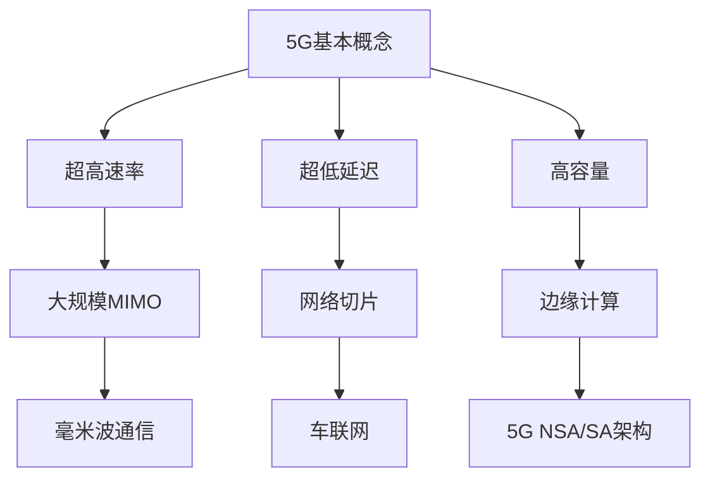

                 

### 5G技术概述

#### 1.1 5G网络技术的基本概念

5G（第五代移动通信技术）是当前移动通信技术的最新一代，与之前的4G相比，它带来了更快的速度、更低的延迟和更高的容量。5G网络的基本概念可以概括为以下三个方面：

- **超高速率**：5G的峰值下载速度可以达到每秒数十Gbps，是4G网络的数十倍。这意味着用户可以在几秒钟内下载高清电影，或者在云端进行实时数据处理和存储。

- **超低延迟**：5G网络将延迟降低到1毫秒以内，是4G的十分之一。这种低延迟对于实时应用，如自动驾驶、远程医疗手术等至关重要。

- **高容量**：5G网络能够支持更大规模的设备连接，包括手机、平板、智能手表、物联网设备等，预计达到每平方公里100万台设备。

#### 1.2 5G网络的关键特性

5G网络的关键特性包括：

- **大规模MIMO（Massive MIMO）**：通过使用大量天线进行数据传输，能够显著提高网络容量和频谱效率。

- **网络切片（Network Slicing）**：允许运营商根据不同应用的需求，创建多个虚拟网络，从而提供定制化的网络服务。

- **边缘计算（Edge Computing）**：将计算任务从云端转移到网络边缘，从而减少数据传输延迟，提高应用响应速度。

#### 1.3 5G网络的关键技术

5G网络的关键技术包括：

- **毫米波通信（Millimeter-Wave Communication）**：利用毫米波频段进行通信，提供更高速率和更大带宽。

- **车联网（V2X，Vehicle-to-Everything）**：通过5G网络实现车辆与车辆、车辆与基础设施之间的通信，提高交通安全性。

- **5G NSA（Non-Stand-Alone）和SA（Stand-Alone）架构**：NSA架构是4G LTE和5G NR的结合，SA架构则是独立的5G NR网络。

#### 1.4 5G网络的发展历程

5G网络的发展可以追溯到2000年代初，当时国际电信联盟（ITU）开始研究未来的移动通信技术。以下是5G网络的发展历程：

- **2012年**：ITU正式发布了5G的要求，包括峰值速率、连接密度和延迟等关键指标。

- **2015年**：3GPP启动了5G NR（New Radio）标准的制定工作。

- **2018年**：3GPP完成了5G NR标准的第一个版本。

- **2019年**：韩国、中国、美国等国家的运营商开始正式推出5G服务。

- **至今**：全球范围内的5G网络建设和应用正在迅速扩展，5G技术在各个领域的应用也在不断拓展。

### 关键概念与联系

为了更好地理解5G网络技术，我们可以使用Mermaid流程图来展示5G网络的核心概念及其相互关系：



通过这个流程图，我们可以清晰地看到5G网络的核心概念及其相互关联，这有助于我们更全面地理解5G技术。

### 伪代码示例

下面是一个简单的伪代码示例，用于说明5G网络中大规模MIMO技术的应用：

```plaintext
Algorithm: Massive MIMO Data Transmission

Inputs:
- User Equipment (UE)
- Base Station (BS)
- Number of Antennas (N)

Outputs:
- Transmitted Data (Tx)
- Received Data (Rx)

Procedure:
1. Initialize the array of transmitted signals (Tx) and received signals (Rx)
2. For each UE:
   a. Compute the beamforming vector using the channel state information
   b. Modulate the data onto the transmit antenna
   c. Add noise and other channel impairments to the transmitted signal
   d. For each receiving antenna at the BS:
      i. Compute the received signal using the beamforming vector and the channel matrix
      ii. Demodulate the received signal to recover the data
3. Calculate the bit error rate (BER) to measure the performance of the system
4. Output the BER and the received data (Rx)
```

这个伪代码展示了大规模MIMO技术中关键的步骤，包括信号的调制、传输、接收和误差计算，帮助读者理解5G网络中的关键算法原理。

### 数学公式和解释

在5G网络中，数学模型和公式广泛应用于信号处理、信道估计和资源分配等方面。以下是一个关于大规模MIMO系统中信道矩阵的数学公式，以及对其详细解释：

$$
H = \sum_{k=1}^{K} \alpha_k \cdot a_r^H \cdot a_s
$$

其中，\( H \) 代表信道矩阵，\( \alpha_k \) 是路径增益，\( a_r \) 和 \( a_s \) 分别代表接收天线和发送天线的阵列响应向量。这个公式描述了在多径传播环境下，接收天线阵列中每个元素接收到的信号是所有发送天线阵列元素信号的线性组合。

#### 解释：

1. **路径增益 (\( \alpha_k \))**：表示从发送天线到接收天线的路径上的信号衰减和相位变化，反映了路径的特性。

2. **接收天线阵列响应 (\( a_r^H \))**：表示接收天线的方向性，即每个天线对特定方向信号的敏感度。

3. **发送天线阵列响应 (\( a_s \))**：表示发送天线的方向性，即每个天线对特定方向信号的发射能力。

4. **线性组合**：将所有路径的信号按照路径增益加权后，通过接收天线阵列的加权求和得到最终的接收信号。

通过这个公式，我们可以定量地描述5G网络中多天线系统的信道特性，为信号处理和信道估计提供了理论基础。

### 实际案例分析和详细讲解

为了更深入地理解5G技术在远程医疗手术中的应用，我们可以通过一个实际案例来进行分析和讲解。

#### 案例背景

某次大型医疗活动中，一所顶级医院的医生团队需要在远程为偏远地区的患者进行一次高难度的手术。由于地理位置的限制，手术团队无法亲自前往现场。在这种背景下，5G技术被引入，以实现远程手术的操作。

#### 案例实现

1. **5G网络搭建**：在手术现场和远程控制中心分别搭建5G基站，确保高带宽和低延迟的网络连接。

2. **高清视频传输**：利用5G网络的高速率特性，实现高清视频信号的实时传输，让远程医生能够清晰地看到手术现场。

3. **实时数据传输**：通过5G网络，将患者的心电图、血压、血氧等实时医疗数据传输到远程控制中心，让医生可以实时监控患者状态。

4. **远程控制**：医生通过远程控制设备，操纵手术机器人进行手术。5G网络保证了操作的实时性和精准性。

5. **医生远程协作**：远程控制中心的医生与现场医生通过5G网络进行实时视频会议，交流手术意见和操作步骤。

#### 详细讲解

1. **高清视频传输**

   - **原理**：5G网络的高速率和低延迟特性，使得高清视频信号能够实时传输，保证手术现场的高清画面和音质。
   - **技术实现**：使用5G NR（新无线电）标准，通过大规模MIMO技术，实现多路高清视频信号的并行传输。

2. **实时数据传输**

   - **原理**：5G网络的低延迟特性，确保了实时医疗数据的高速传输，让医生能够实时了解患者的健康状况。
   - **技术实现**：使用网络切片技术，为实时医疗数据创建独立的网络通道，保证数据传输的稳定性和低延迟。

3. **远程控制**

   - **原理**：5G网络的低延迟和高可靠性，使得医生可以通过远程控制设备，精准操纵手术机器人进行操作。
   - **技术实现**：使用边缘计算技术，将部分计算任务转移到网络边缘，减少延迟，提高操作精度。

4. **医生远程协作**

   - **原理**：5G网络的低延迟和高带宽，使得医生可以通过实时视频会议系统，与现场医生进行实时交流和协作。
   - **技术实现**：使用5G网络构建高速、稳定的视频会议通道，支持多人实时视频通信和协作。

#### 案例总结

通过这个实际案例，我们可以看到5G技术在远程医疗手术中的重要作用。5G网络的高速率、低延迟和高可靠性，为远程医疗手术提供了坚实的技术保障。未来，随着5G技术的进一步发展和普及，远程医疗手术将变得更加高效、安全，为偏远地区患者提供更多的治疗机会。

### 最佳实践 Tips

在实际应用5G技术进行远程医疗手术时，以下是一些最佳实践建议：

1. **网络规划**：确保5G基站的合理布局和覆盖范围，为手术提供稳定、高速的网络连接。

2. **设备配置**：选择高性能、稳定的远程手术设备和手术机器人，保证手术操作的实时性和精准性。

3. **数据安全**：采用加密技术，确保传输数据的隐私和安全。

4. **人员培训**：加强对医生和手术团队的5G技术培训，提高他们对5G技术的应用能力和操作水平。

5. **实时监控**：建立完善的实时监控机制，确保手术过程的安全和顺利进行。

### 小结

5G技术在远程医疗手术中的应用，极大地突破了地理限制，为偏远地区患者提供了高质量的医疗服务。通过高清视频传输、实时数据传输、远程控制和医生远程协作等技术手段，5G网络为远程医疗手术提供了可靠的技术支持。未来，随着5G技术的进一步发展和普及，远程医疗手术将变得更加普及和高效，为更多患者带来福音。

### 拓展阅读

- [1] 《5G移动通信技术：架构与关键特性》
- [2] 《远程医疗手术的关键技术与应用》
- [3] 《边缘计算在5G网络中的应用》

通过这些文献，您可以进一步了解5G技术及其在远程医疗手术中的应用，以及相关领域的最新研究和进展。

