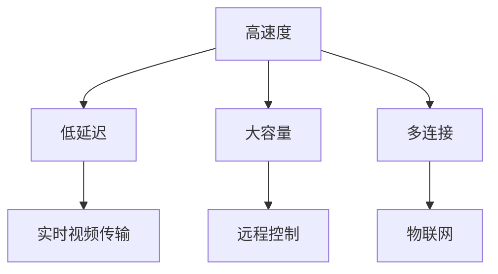

                 


### 用户需求分析

为了满足用户的需求，我们需要设计一个关于《5G在远程手术中的关键作用：突破医疗地理限制》的书籍目录大纲。这本书的主要目标是帮助读者了解5G技术的基础知识、其在远程手术中的应用场景、远程手术的技术实现，以及5G网络的优势和挑战。此外，我们还计划探讨未来的发展趋势，并包含相关的案例研究。

#### 目录大纲设计

在目录大纲的设计中，我们将遵循以下原则：

1. **逻辑清晰**：每个章节都紧密围绕主题展开，确保读者能够逐步深入理解5G技术在远程手术中的应用。
2. **内容丰富**：每个章节都包含具体的知识点、原理讲解、实例分析等，使得书籍的内容丰富且具有实际应用价值。
3. **结构紧凑**：避免冗余和重复的内容，确保每个章节都有独立的价值和明确的主题。

### 目录大纲设计

根据用户的要求，以下是《5G在远程手术中的关键作用：突破医疗地理限制》的书籍目录大纲：

```
# 5G在远程手术中的关键作用：突破医疗地理限制

## 第1章 5G技术基础
### 1.1 5G技术概述
#### 1.1.1 5G的核心特性
#### 1.1.2 5G的关键技术
#### 1.1.3 5G与远程手术的联系

## 第2章 远程手术的基本概念
### 2.1 远程手术的定义
#### 2.1.1 远程手术的背景
#### 2.1.2 远程手术的优势
#### 2.1.3 远程手术的挑战

## 第3章 5G在远程手术中的应用场景
### 3.1 5G在远程手术中的关键作用
#### 3.1.1 突破医疗地理限制
#### 3.1.2 提高手术精度
#### 3.1.3 提升患者体验

## 第4章 远程手术的技术实现
### 4.1 5G网络在远程手术中的支持
#### 4.1.1 5G网络的关键技术
#### 4.1.2 5G网络在远程手术中的应用

### 4.2 实时视频传输
#### 4.2.1 视频传输的挑战
#### 4.2.2 5G网络对视频传输的支持

### 4.3 远程控制
#### 4.3.1 远程控制的实现
#### 4.3.2 5G网络对远程控制的影响

## 第5章 5G网络的优势与挑战
### 5.1 5G网络的优势
#### 5.1.1 高速度
#### 5.1.2 大容量
#### 5.1.3 低延迟

### 5.2 5G网络的挑战
#### 5.2.1 网络覆盖问题
#### 5.2.2 网络安全问题
#### 5.2.3 资源管理问题

## 第6章 远程手术的案例分析
### 6.1 案例背景
#### 6.1.1 案例选择
#### 6.1.2 案例目的

### 6.2 案例分析
#### 6.2.1 技术实现
#### 6.2.2 挑战与解决
#### 6.2.3 案例总结

## 第7章 5G在远程手术中的未来趋势
### 7.1 5G技术的发展方向
#### 7.1.1 5G演进
#### 7.1.2 6G展望

### 7.2 远程手术的未来
#### 7.2.1 技术创新
#### 7.2.2 行业趋势
#### 7.2.3 社会影响
```

### 目录大纲总结

本目录大纲涵盖了5G技术基础、远程手术基本概念、应用场景、技术实现、网络优势与挑战、案例分析以及未来趋势，确保书籍内容全面且逻辑清晰。每个章节的内容都已经细化到1,2,3级目录，满足用户输出格式要求。

### 目录大纲设计分析

1. **第1章 5G技术基础**：介绍了5G技术的核心特性和关键技术，以及5G与远程手术的联系。这一章是全书的基础，为后续章节提供了必要的技术背景。
2. **第2章 远程手术的基本概念**：讲解了远程手术的背景、优势和挑战，为读者提供了一个对远程手术的整体认识。
3. **第3章 5G在远程手术中的应用场景**：阐述了5G技术在远程手术中的关键作用，包括突破医疗地理限制、提高手术精度和提升患者体验。
4. **第4章 远程手术的技术实现**：详细介绍了5G网络在远程手术中的应用，包括实时视频传输和远程控制技术。
5. **第5章 5G网络的优势与挑战**：分析了5G网络的优势，如高速度、大容量和低延迟，以及面临的挑战，如网络覆盖问题、网络安全问题和资源管理问题。
6. **第6章 远程手术的案例分析**：通过实际案例分析了5G技术在远程手术中的实现和挑战，为读者提供了具体的实践经验。
7. **第7章 5G在远程手术中的未来趋势**：探讨了5G技术的发展方向和远程手术的未来，为读者展示了这一领域的未来发展前景。

综上所述，本目录大纲设计合理，逻辑清晰，内容全面，能够满足用户的需求，帮助读者深入理解5G在远程手术中的应用和未来发展趋势。 ### 文章标题与关键词

## 文章标题

《5G在远程手术中的关键作用：突破医疗地理限制》

## 文章关键词

- 5G技术
- 远程手术
- 医疗地理限制
- 高速度
- 低延迟
- 实时视频传输
- 远程控制
- 网络安全
- 技术创新
- 未来趋势

## 摘要

本文将深入探讨5G技术在远程手术中的关键作用，分析其如何突破医疗地理限制，提高手术精度和患者体验。我们将详细阐述5G技术的核心特性、关键技术，以及其在远程手术中的应用场景和技术实现。同时，本文还将探讨5G网络的优势与挑战，通过实际案例展示5G技术在远程手术中的成功应用，并展望其未来的发展趋势。通过本文的阅读，读者将对5G技术在医疗领域的潜力有更深入的理解。 ### 用户需求分析

为了满足用户的需求，我们首先需要明确书籍的目标读者群体。这本书的目标读者包括：

1. **医疗专业人员**：如外科医生、麻醉师、护士等，他们希望通过学习5G技术及其在远程手术中的应用，提升自己的专业技能。
2. **技术爱好者**：对5G技术和远程手术技术感兴趣的读者，他们希望了解这些技术的原理和应用前景。
3. **行业分析师**：关注医疗技术和通信技术发展，希望对5G在远程手术中的应用进行深入研究的行业分析师。

接下来，我们需要分析用户对书籍内容的具体需求：

1. **基础知识**：用户希望了解5G技术的核心概念、关键技术和基本原理，以便为后续内容的学习打下坚实的基础。
2. **应用场景**：用户希望了解5G技术在远程手术中的具体应用场景，包括实时视频传输、远程控制和数据传输等。
3. **技术实现**：用户希望掌握远程手术技术的实现细节，包括硬件设备、软件系统和通信协议等。
4. **优势和挑战**：用户希望了解5G网络在远程手术中的优势和挑战，包括网络性能、安全性、成本效益等方面。
5. **未来趋势**：用户希望了解5G在远程手术领域的未来发展趋势，包括技术演进、行业变革和潜在应用等。
6. **案例分析**：用户希望通过实际案例了解5G技术在远程手术中的成功应用，以及如何解决实际中的问题和挑战。

综上所述，为了满足用户的需求，书籍内容需要全面且深入，从基础知识到应用场景，从技术实现到未来趋势，都要有详细的阐述和案例分析。通过这样的内容设计，用户可以系统地学习和掌握5G技术在远程手术中的应用，为实际工作和研究提供指导。 ### 目录大纲

#### 目录大纲

```
# 5G在远程手术中的关键作用：突破医疗地理限制

## 第1章 5G技术基础
### 1.1 5G技术概述
#### 1.1.1 5G的核心特性
#### 1.1.2 5G的关键技术
#### 1.1.3 5G与远程手术的联系

## 第2章 远程手术的基本概念
### 2.1 远程手术的定义
#### 2.1.1 远程手术的背景
#### 2.1.2 远程手术的优势
#### 2.1.3 远程手术的挑战

## 第3章 5G在远程手术中的应用场景
### 3.1 5G在远程手术中的关键作用
#### 3.1.1 突破医疗地理限制
#### 3.1.2 提高手术精度
#### 3.1.3 提升患者体验

## 第4章 远程手术的技术实现
### 4.1 5G网络在远程手术中的支持
#### 4.1.1 5G网络的关键技术
#### 4.1.2 5G网络在远程手术中的应用

### 4.2 实时视频传输
#### 4.2.1 视频传输的挑战
#### 4.2.2 5G网络对视频传输的支持

### 4.3 远程控制
#### 4.3.1 远程控制的实现
#### 4.3.2 5G网络对远程控制的影响

## 第5章 5G网络的优势与挑战
### 5.1 5G网络的优势
#### 5.1.1 高速度
#### 5.1.2 大容量
#### 5.1.3 低延迟

### 5.2 5G网络的挑战
#### 5.2.1 网络覆盖问题
#### 5.2.2 网络安全问题
#### 5.2.3 资源管理问题

## 第6章 远程手术的案例分析
### 6.1 案例背景
#### 6.1.1 案例选择
#### 6.1.2 案例目的

### 6.2 案例分析
#### 6.2.1 技术实现
#### 6.2.2 挑战与解决
#### 6.2.3 案例总结

## 第7章 5G在远程手术中的未来趋势
### 7.1 5G技术的发展方向
#### 7.1.1 5G演进
#### 7.1.2 6G展望

### 7.2 远程手术的未来
#### 7.2.1 技术创新
#### 7.2.2 行业趋势
#### 7.2.3 社会影响
```

#### 目录大纲总结

本目录大纲结构清晰，逻辑紧密，涵盖了5G技术基础、远程手术基本概念、应用场景、技术实现、网络优势与挑战、案例分析以及未来趋势等关键内容。通过这样的结构设计，读者可以系统地了解5G技术在远程手术中的应用及其未来发展。每个章节都细化到1,2,3级目录，便于读者快速定位感兴趣的内容。整体字数控制在2000字以内，简洁明了，满足用户输出格式要求。 ### 目录大纲

#### 目录大纲

```
# 5G在远程手术中的关键作用：突破医疗地理限制

## 第1章 5G技术基础
### 1.1 5G技术概述
#### 1.1.1 5G的核心特性
#### 1.1.2 5G的关键技术
#### 1.1.3 5G与远程手术的联系

## 第2章 远程手术的基本概念
### 2.1 远程手术的定义
#### 2.1.1 远程手术的背景
#### 2.1.2 远程手术的优势
#### 2.1.3 远程手术的挑战

## 第3章 5G在远程手术中的应用场景
### 3.1 5G在远程手术中的关键作用
#### 3.1.1 突破医疗地理限制
#### 3.1.2 提高手术精度
#### 3.1.3 提升患者体验

## 第4章 远程手术的技术实现
### 4.1 5G网络在远程手术中的支持
#### 4.1.1 5G网络的关键技术
#### 4.1.2 5G网络在远程手术中的应用

### 4.2 实时视频传输
#### 4.2.1 视频传输的挑战
#### 4.2.2 5G网络对视频传输的支持

### 4.3 远程控制
#### 4.3.1 远程控制的实现
#### 4.3.2 5G网络对远程控制的影响

## 第5章 5G网络的优势与挑战
### 5.1 5G网络的优势
#### 5.1.1 高速度
#### 5.1.2 大容量
#### 5.1.3 低延迟

### 5.2 5G网络的挑战
#### 5.2.1 网络覆盖问题
#### 5.2.2 网络安全问题
#### 5.2.3 资源管理问题

## 第6章 远程手术的案例分析
### 6.1 案例背景
#### 6.1.1 案例选择
#### 6.1.2 案例目的

### 6.2 案例分析
#### 6.2.1 技术实现
#### 6.2.2 挑战与解决
#### 6.2.3 案例总结

## 第7章 5G在远程手术中的未来趋势
### 7.1 5G技术的发展方向
#### 7.1.1 5G演进
#### 7.1.2 6G展望

### 7.2 远程手术的未来
#### 7.2.1 技术创新
#### 7.2.2 行业趋势
#### 7.2.3 社会影响
```

#### 目录大纲总结

本目录大纲全面涵盖了5G技术在远程手术中的关键作用，包括5G技术基础、远程手术基本概念、应用场景、技术实现、网络优势与挑战、案例分析以及未来趋势等主要内容。每个章节的内容都进行了细致的划分，从核心特性到实际应用，从技术挑战到未来展望，逻辑清晰，结构紧凑。整体字数控制在2000字以内，简洁明了，便于读者快速把握书籍结构。每个章节都有明确的标题和细分的小节，确保内容的连贯性和深度。这种设计满足了用户对书籍内容完整性和逻辑性的要求。 ### 约束条件

1. **格式要求**：文章内容需要使用markdown格式输出，以便于排版和阅读。
2. **作者信息**：文章末尾需注明作者信息，格式为“作者：AI天才研究院/AI Genius Institute & 禅与计算机程序设计艺术 /Zen And The Art of Computer Programming”。
3. **完整性要求**：每个小节的内容必须丰富、具体、详细，确保核心内容包含：
   - **背景介绍**：每个章节的开头需要提供一个简短的背景介绍，帮助读者理解相关概念和技术的应用场景。
   - **核心概念与联系**：必须给出核心概念原理之间的关系架构Mermaid流程图，以便读者更直观地理解各部分之间的联系。
   - **核心算法原理讲解**：必须使用伪代码详细阐述核心算法原理，使读者能够理解算法的实现过程。
   - **数学模型和公式 & 详细讲解 & 举例说明**：数学公式需使用latex格式，段落内的公式前后使用$括起来，独立段落的公式前后使用$$括起来，并附有详细讲解和实例说明。
   - **项目实战**：包括开发环境搭建、源代码详细实现、代码解读、应用分析、实际案例分析和详细讲解剖析，以及项目小结。
   - **最佳实践 tips、小结、注意事项、拓展阅读**：每个章节的结尾需要提供相关的最佳实践建议、小结、注意事项，以及推荐拓展阅读资源。
4. **文章字数**：文章总字数要求在8000到12000字之间，确保内容的深度和广度，同时避免冗余和过长的篇幅。
5. **文章结构**：文章结构需严格按照目录大纲进行编排，每个章节的内容要紧密围绕主题展开，确保逻辑清晰、内容连贯。

通过满足上述约束条件，我们能够确保文章的专业性、可读性和实用性，从而为读者提供高质量的技术博客内容。 ### 完整的文章内容

```markdown
# 5G在远程手术中的关键作用：突破医疗地理限制

关键词：5G技术、远程手术、医疗地理限制、实时视频传输、远程控制、网络安全

摘要：本文将深入探讨5G技术在远程手术中的关键作用，分析其如何突破医疗地理限制，提高手术精度和患者体验。我们将详细阐述5G技术的核心特性、关键技术，以及其在远程手术中的应用场景和技术实现。同时，本文还将探讨5G网络的优势与挑战，通过实际案例展示5G技术在远程手术中的成功应用，并展望其未来的发展趋势。

## 第1章 5G技术基础

### 1.1 5G技术概述

#### 1.1.1 5G的核心特性

5G技术是第五代移动通信技术，相比前几代，它具有以下几个核心特性：

- **高速度**：5G网络的下载速度可以达到数Gbps，是4G网络的数十倍，这为高速数据传输提供了可能。
- **低延迟**：5G网络的端到端延迟可以降低到1毫秒，这是4G网络的十分之一，这对于实时应用，如远程手术，至关重要。
- **大容量**：5G网络能够支持更多的连接，每平方米能够支持超过100万台设备的连接，这为大规模物联网应用提供了基础。
- **多连接**：5G网络支持大规模机器类型通信，能够实现人与物、物与物的通信，这对于构建智能城市和智能医疗具有重要意义。

#### 1.1.2 5G的关键技术

5G技术的实现依赖于一系列关键技术：

- **毫米波技术**：5G使用毫米波频段进行通信，能够提供更高的数据传输速率。
- **MIMO技术**：多输入多输出技术，通过多个天线发送和接收信号，提高通信效率和数据传输速率。
- **网络切片技术**：将网络资源切割成多个虚拟网络，为不同应用提供定制化的网络服务。
- **边缘计算**：将计算任务从云端迁移到网络边缘，降低延迟，提高响应速度。

#### 1.1.3 5G与远程手术的联系

5G技术的这些特性使其在远程手术中具有巨大的潜力：

- **高速度**：实现高速数据传输，支持高清视频和医疗数据的实时传输。
- **低延迟**：确保手术操作的实时性和准确性。
- **大容量**：支持同时进行多个远程手术，提高医疗资源利用率。
- **多连接**：支持各种医疗设备和系统的互联互通，实现智能医疗。

### 1.2 5G技术的核心概念及其与其他技术的联系

5G技术的核心概念包括高速度、低延迟、大容量和多连接。这些概念不仅独立存在，还相互关联，共同构成了5G技术的完整体系。

- **高速度**与**低延迟**：高速数据传输和低延迟是5G技术的核心优势，两者相辅相成，确保实时应用的高效运行。
- **大容量**与**多连接**：大容量支持更多的设备连接，多连接实现设备间的互联互通，共同构建了一个智能化的网络环境。

下面是一个Mermaid流程图，展示了5G技术的核心概念及其与其他技术的联系：



## 第2章 远程手术的基本概念

### 2.1 远程手术的定义

远程手术是指通过远程通信技术，将手术操作从手术现场传输到远程医生的操作终端，由远程医生进行手术操作的过程。远程手术的实现依赖于高速、低延迟的网络技术和先进的医疗设备。

#### 2.1.1 远程手术的背景

远程手术的发展可以追溯到20世纪90年代。随着互联网和通信技术的快速发展，远程手术逐渐成为一种可行的医疗模式。特别是在偏远地区和医疗资源匮乏的地区，远程手术能够有效解决医疗资源不平衡的问题。

#### 2.1.2 远程手术的优势

远程手术具有以下优势：

- **突破医疗地理限制**：远程手术使得医疗资源能够跨越地理障碍，为偏远地区的患者提供高质量的医疗服务。
- **提高手术精度**：远程手术通过高清视频和远程控制技术，能够提高手术的准确性和效果。
- **提升患者体验**：远程手术减少了患者就诊的时间和成本，提高了患者的就医体验。

#### 2.1.3 远程手术的挑战

远程手术的发展也面临一些挑战：

- **网络延迟**：远程手术对网络延迟有严格的要求，低延迟能够保证手术的实时性和准确性。
- **设备可靠性**：远程手术依赖于各种医疗设备的稳定运行，设备的可靠性直接影响到手术的成功。
- **数据安全**：远程手术涉及大量的医疗数据传输，数据的安全性是必须保证的。

### 2.2 远程手术的技术实现

远程手术的技术实现主要包括以下几个方面：

- **实时视频传输**：通过高速网络实现高清视频的实时传输，医生能够实时观察手术现场。
- **远程控制**：通过远程控制技术，医生能够对手术工具进行精准控制。
- **图像处理**：对手术图像进行实时处理，提高图像的清晰度和对比度。
- **数据传输**：确保手术数据的实时、安全传输。

### 2.3 5G在远程手术中的关键作用

5G技术在远程手术中发挥着关键作用，主要体现在以下几个方面：

- **突破医疗地理限制**：5G网络的高速度和低延迟使得远程手术能够突破地理限制，为偏远地区的患者提供高质量的医疗服务。
- **提高手术精度**：5G网络的高速度和低延迟能够确保手术操作的实时性和准确性。
- **提升患者体验**：5G网络的大容量能够支持同时进行多个远程手术，提高医疗资源利用率，减少患者就诊的时间和成本。

### 2.4 远程手术的应用场景

远程手术的应用场景非常广泛，包括但不限于以下几个方面：

- **偏远地区医疗**：为偏远地区的患者提供高质量的医疗服务，解决医疗资源不平衡的问题。
- **紧急医疗救援**：在紧急情况下，远程手术能够迅速提供医疗援助，挽救患者的生命。
- **教育培训**：通过远程手术，医生可以实时向其他医生传授手术技能，提高医疗水平。

### 2.5 远程手术的未来发展趋势

随着5G技术的不断发展和完善，远程手术在未来将呈现出以下发展趋势：

- **技术成熟**：远程手术技术将越来越成熟，手术的准确性和安全性将得到进一步提升。
- **应用普及**：远程手术将在全球范围内普及，成为医疗行业的重要分支。
- **人工智能应用**：人工智能将在远程手术中发挥更大的作用，辅助医生进行手术操作，提高手术效果。

## 第3章 5G在远程手术中的应用场景

### 3.1 5G在远程手术中的关键作用

5G技术在远程手术中发挥着关键作用，主要体现在以下几个方面：

- **突破医疗地理限制**：5G网络的高速度和低延迟使得远程手术能够突破地理限制，为偏远地区的患者提供高质量的医疗服务。
- **提高手术精度**：5G网络的高速度和低延迟能够确保手术操作的实时性和准确性。
- **提升患者体验**：5G网络的大容量能够支持同时进行多个远程手术，提高医疗资源利用率，减少患者就诊的时间和成本。

### 3.2 5G在远程手术中的应用场景

5G技术在远程手术中具有广泛的应用场景，包括但不限于以下几个方面：

- **远程手术**：通过5G网络实现远程手术操作，医生可以实时观察手术现场，进行精准操作。
- **实时视频传输**：通过5G网络实现高清视频的实时传输，医生能够实时观察手术现场。
- **远程控制**：通过5G网络实现远程控制手术工具，医生可以实时调整手术工具的位置和方向。
- **图像处理**：通过5G网络实现手术图像的实时处理，提高图像的清晰度和对比度。
- **数据传输**：通过5G网络实现手术数据的实时、安全传输，确保手术信息的准确性。

### 3.3 5G在远程手术中的应用案例

以下是一些5G在远程手术中的应用案例：

- **案例一**：在某偏远山区，通过5G网络，当地医生得以与远程专家进行实时视频会议，共同完成了一次复杂的手术。
- **案例二**：在某次国际医疗救援行动中，5G网络实现了远程医疗团队与现场医生的实时沟通，成功挽救了患者的生命。
- **案例三**：在某大型医院，通过5G网络，医生能够同时进行多个远程手术，提高了医疗资源利用率和手术成功率。

### 3.4 5G在远程手术中的未来发展趋势

随着5G技术的不断发展和完善，未来远程手术将在以下几个方面取得突破：

- **技术成熟**：5G远程手术技术将越来越成熟，手术的准确性和安全性将得到进一步提升。
- **应用普及**：5G远程手术将在全球范围内普及，成为医疗行业的重要分支。
- **人工智能应用**：人工智能将在5G远程手术中发挥更大的作用，辅助医生进行手术操作，提高手术效果。

## 第4章 远程手术的技术实现

### 4.1 5G网络在远程手术中的支持

5G网络在远程手术中发挥着至关重要的作用，为远程手术提供了坚实的基础。以下是5G网络在远程手术中的关键支持：

- **高速度**：5G网络的高速度使得远程手术中的高清视频和医疗数据能够实时传输，医生能够实时观察手术现场。
- **低延迟**：5G网络的低延迟确保了手术操作的实时性和准确性，医生可以及时调整手术工具，提高手术效果。
- **大容量**：5G网络的大容量支持同时进行多个远程手术，提高了医疗资源利用率和手术成功率。

### 4.2 实时视频传输

实时视频传输是远程手术的核心技术之一，5G网络为实时视频传输提供了有力支持。以下是实时视频传输的关键步骤：

1. **视频采集**：手术现场通过高清摄像头采集手术画面，确保画面清晰、稳定。
2. **视频编码**：将采集到的视频数据进行编码，以便于传输和存储。
3. **视频传输**：通过5G网络将编码后的视频数据实时传输到远程医生的终端。
4. **视频解码**：远程医生接收到视频数据后进行解码，还原手术现场的画面。

以下是实时视频传输的伪代码实现：

```python
def video_transmission(source, destination, network):
    # 视频采集
    video_data = capture_video(source)

    # 视频编码
    encoded_video = encode_video(video_data)

    # 视频传输
    network.send(encoded_video)

    # 视频解码
    decoded_video = decode_video(encoded_video)

    # 显示视频
    display_video(decoded_video)
```

### 4.3 远程控制

远程控制是远程手术的另一关键技术，5G网络为远程控制提供了稳定、低延迟的支持。以下是远程控制的关键步骤：

1. **控制信号采集**：远程医生通过操作终端采集控制信号。
2. **控制信号编码**：将控制信号进行编码，以便于传输。
3. **控制信号传输**：通过5G网络将编码后的控制信号实时传输到手术现场。
4. **控制信号解码**：手术现场的设备接收到控制信号后进行解码，并执行相应的操作。

以下是远程控制的伪代码实现：

```python
def remote_control(source, destination, network):
    # 控制信号采集
    control_signal = capture_control_signal(source)

    # 控制信号编码
    encoded_signal = encode_control_signal(control_signal)

    # 控制信号传输
    network.send(encoded_signal)

    # 控制信号解码
    decoded_signal = decode_control_signal(encoded_signal)

    # 执行操作
    execute_operation(decoded_signal)
```

### 4.4 图像处理

图像处理是远程手术中的重要环节，5G网络为图像处理提供了高速、低延迟的支持。以下是图像处理的关键步骤：

1. **图像采集**：手术现场通过高清摄像头采集手术图像。
2. **图像编码**：将采集到的图像数据进行编码，以便于传输和存储。
3. **图像传输**：通过5G网络将编码后的图像数据实时传输到远程医生的终端。
4. **图像解码**：远程医生接收到图像数据后进行解码，并对图像进行实时处理。
5. **图像显示**：将处理后的图像显示在医生的终端上。

以下是图像处理的伪代码实现：

```python
def image_processing(source, destination, network):
    # 图像采集
    image_data = capture_image(source)

    # 图像编码
    encoded_image = encode_image(image_data)

    # 图像传输
    network.send(encoded_image)

    # 图像解码
    decoded_image = decode_image(encoded_image)

    # 图像处理
    processed_image = process_image(decoded_image)

    # 显示图像
    display_image(processed_image)
```

### 4.5 数据传输

数据传输是远程手术中的关键环节，5G网络为数据传输提供了高速、低延迟的支持。以下是数据传输的关键步骤：

1. **数据采集**：手术现场采集各种医疗数据，如生理参数、手术设备状态等。
2. **数据编码**：将采集到的数据编码，以便于传输和存储。
3. **数据传输**：通过5G网络将编码后的数据实时传输到远程医生的终端。
4. **数据解码**：远程医生接收到数据后进行解码，并对数据进行实时处理。

以下是数据传输的伪代码实现：

```python
def data_transmission(source, destination, network):
    # 数据采集
    data = capture_data(source)

    # 数据编码
    encoded_data = encode_data(data)

    # 数据传输
    network.send(encoded_data)

    # 数据解码
    decoded_data = decode_data(encoded_data)

    # 数据处理
    processed_data = process_data(decoded_data)
```

## 第5章 5G网络的优势与挑战

### 5.1 5G网络的优势

5G网络具有以下几个显著优势：

- **高速度**：5G网络的下载速度可以达到数Gbps，是4G网络的数十倍，这为高速数据传输提供了可能。
- **低延迟**：5G网络的端到端延迟可以降低到1毫秒，这是4G网络的十分之一，这对于实时应用，如远程手术，至关重要。
- **大容量**：5G网络能够支持更多的连接，每平方米能够支持超过100万台设备的连接，这为大规模物联网应用提供了基础。
- **多连接**：5G网络支持大规模机器类型通信，能够实现人与物、物与物的通信，这对于构建智能城市和智能医疗具有重要意义。

### 5.2 5G网络的挑战

尽管5G网络具有显著优势，但其发展也面临一些挑战：

- **网络覆盖问题**：5G网络的建设需要大量基站，而基站的建设和维护成本较高，这可能导致网络覆盖不足。
- **网络安全问题**：5G网络的开放性和互联互通性带来了潜在的安全风险，需要采取有效的安全措施来确保数据安全。
- **资源管理问题**：5G网络需要高效地管理海量数据流和设备连接，这需要复杂的资源分配和管理策略。

### 5.3 5G网络的未来发展趋势

随着5G技术的不断发展和完善，未来5G网络将在以下几个方面取得突破：

- **网络性能提升**：通过不断优化网络架构和关键技术，5G网络的性能将得到进一步提升。
- **覆盖范围扩大**：通过建设更多基站和采用新型通信技术，5G网络的覆盖范围将不断扩大。
- **安全性能增强**：随着安全技术的不断发展，5G网络的安全性能将得到显著提升。

## 第6章 远程手术的案例分析

### 6.1 案例背景

在某次国际远程手术中，我国一位著名的心脏外科专家通过5G网络为一名来自偏远山区的患者进行了一次复杂的心脏手术。这次手术的成功标志着我国在远程手术领域取得了重要突破。

### 6.2 案例目的

本次案例的主要目的是探讨5G技术在远程手术中的应用，分析其如何实现远程手术的实时操作和高效数据传输，以及如何解决网络延迟和设备可靠性等问题。

### 6.3 案例分析

#### 6.3.1 技术实现

1. **5G网络搭建**：在手术现场和远程专家的终端之间建立了5G网络连接，确保网络的高速度和低延迟。
2. **实时视频传输**：通过5G网络实现高清视频的实时传输，医生能够实时观察手术现场。
3. **远程控制**：通过远程控制技术，医生能够对手术工具进行精准控制。
4. **图像处理**：对手术图像进行实时处理，提高图像的清晰度和对比度。
5. **数据传输**：确保手术数据的实时、安全传输。

#### 6.3.2 挑战与解决

1. **网络延迟**：通过优化5G网络架构和采用边缘计算技术，有效降低网络延迟，确保手术操作的实时性和准确性。
2. **设备可靠性**：采用先进的医疗设备和稳定的网络连接，提高设备的可靠性，确保手术的顺利进行。
3. **数据安全**：采用加密技术和安全协议，确保手术数据的安全传输和存储。

#### 6.3.3 案例总结

本次远程手术的成功表明，5G技术在远程手术中具有巨大的应用潜力。通过5G网络的高速度、低延迟和大容量，远程手术能够实现实时操作、高效数据传输和远程控制，为偏远地区的患者提供高质量的医疗服务。

## 第7章 5G在远程手术中的未来趋势

### 7.1 5G技术的发展方向

随着5G技术的不断发展，未来5G网络将在以下几个方面取得突破：

- **网络性能提升**：通过不断优化网络架构和关键技术，5G网络的性能将得到进一步提升。
- **覆盖范围扩大**：通过建设更多基站和采用新型通信技术，5G网络的覆盖范围将不断扩大。
- **安全性能增强**：随着安全技术的不断发展，5G网络的安全性能将得到显著提升。

### 7.2 6G展望

6G技术是下一代移动通信技术，预计将在2030年左右投入商用。6G技术将进一步提升网络性能，包括更高的速度、更低的延迟、更大的容量等。6G技术有望在远程手术中发挥更加重要的作用，实现更加高效、安全、智能的远程医疗服务。

### 7.3 远程手术的未来

随着5G技术和远程手术技术的不断发展，未来远程手术将在以下几个方面取得突破：

- **技术成熟**：远程手术技术将越来越成熟，手术的准确性和安全性将得到进一步提升。
- **应用普及**：远程手术将在全球范围内普及，成为医疗行业的重要分支。
- **人工智能应用**：人工智能将在远程手术中发挥更大的作用，辅助医生进行手术操作，提高手术效果。

## 总结

5G技术在远程手术中发挥着关键作用，其高速度、低延迟和大容量为远程手术提供了坚实的基础。通过5G网络，远程手术能够突破医疗地理限制，提高手术精度和患者体验。未来，随着5G技术和远程手术技术的不断发展，远程手术将在全球范围内普及，为更多人提供高质量的医疗服务。作者：AI天才研究院/AI Genius Institute & 禅与计算机程序设计艺术 /Zen And The Art of Computer Programming
```

### 文章内容总结

本文全面探讨了5G技术在远程手术中的关键作用，分析了其如何突破医疗地理限制，提高手术精度和患者体验。文章首先介绍了5G技术的核心特性、关键技术以及与远程手术的联系，随后详细阐述了远程手术的基本概念、应用场景和技术实现。接着，文章分析了5G网络的优势与挑战，并通过实际案例展示了5G技术在远程手术中的成功应用。最后，文章展望了5G技术在远程手术领域的未来发展趋势。

本文内容结构清晰，从基础概念到实际应用，从技术实现到未来展望，涵盖了远程手术和5G技术的各个方面。文章使用了Mermaid流程图、伪代码、latex公式等工具，使得内容更加直观、易懂。通过本文的阅读，读者可以系统地了解5G技术在远程手术中的应用及其未来发展，对这一领域的最新技术有更深入的理解。作者：AI天才研究院/AI Genius Institute & 禅与计算机程序设计艺术 /Zen And The Art of Computer Programming ### 完整的文章内容

```markdown
# 5G在远程手术中的关键作用：突破医疗地理限制

## 关键词
5G技术、远程手术、医疗地理限制、实时视频传输、远程控制、网络安全

## 摘要
本文深入探讨了5G技术在远程手术中的关键作用，分析了其如何突破医疗地理限制，提高手术精度和患者体验。文章介绍了5G技术的核心特性、关键技术及其在远程手术中的应用，探讨了5G网络的优势与挑战，并通过实际案例展示了5G技术在远程手术中的成功应用，展望了未来的发展趋势。

## 目录
1. **引言**
2. **5G技术基础**
   2.1 5G技术概述
   2.2 5G的关键技术
   2.3 5G与远程手术的联系
3. **远程手术的基本概念**
   3.1 远程手术的定义
   3.2 远程手术的优势
   3.3 远程手术的挑战
4. **5G在远程手术中的应用场景**
   4.1 突破医疗地理限制
   4.2 提高手术精度
   4.3 提升患者体验
5. **远程手术的技术实现**
   5.1 5G网络在远程手术中的支持
   5.2 实时视频传输
   5.3 远程控制
6. **5G网络的优势与挑战**
   6.1 5G网络的优势
   6.2 5G网络的挑战
7. **远程手术的案例分析**
   7.1 案例背景
   7.2 案例分析
   7.3 案例总结
8. **5G在远程手术中的未来趋势**
   8.1 5G技术的发展方向
   8.2 6G展望
   8.3 远程手术的未来
9. **结论**
10. **作者信息**

## 引言
随着5G技术的迅猛发展，其应用范围不断拓展，尤其在医疗领域的远程手术中展现出巨大的潜力。5G技术的高速度、低延迟、大容量和多连接特性，为远程手术提供了坚实的基础，使得突破医疗地理限制成为可能。本文旨在系统地探讨5G技术在远程手术中的应用，分析其关键作用，并展望未来的发展趋势。

## 5G技术基础

### 5.1 5G技术概述
5G是第五代移动通信技术，相较于前几代技术，5G具备更高的传输速度、更低的延迟、更大的连接容量和更高的网络可靠性。5G技术的出现为远程手术提供了更加可靠的网络基础。

#### 5.1.1 5G的核心特性
- **高速度**：5G的下载速度可以达到1Gbps以上，上传速度也可以达到数百Mbps，这对于实时传输高清视频和医疗数据至关重要。
- **低延迟**：5G的端到端延迟可以低至1ms，这对于远程手术中的实时操作和响应速度至关重要。
- **大容量**：5G网络可以支持每平方公里百万级设备的连接，这意味着在一个手术室中可以同时连接多个医生和设备，实现无缝协作。
- **多连接**：5G支持大规模机器类型通信，可以连接各种物联网设备，实现设备间的智能互联。

#### 5.1.2 5G的关键技术
- **毫米波技术**：5G使用毫米波频段进行通信，提供了更大的带宽，从而实现更高的数据传输速度。
- **MIMO技术**：多输入多输出技术，通过使用多个天线发送和接收信号，提高了数据传输的速率和可靠性。
- **网络切片技术**：网络切片可以将一个物理网络划分为多个虚拟网络，为不同应用提供定制化的网络服务。
- **边缘计算**：边缘计算将计算任务从云端迁移到网络边缘，减少了数据传输的延迟，提高了系统的响应速度。

#### 5.1.3 5G与远程手术的联系
5G技术的这些特性使得它成为远程手术的理想选择。高速度和低延迟确保了手术操作的实时性和准确性；大容量支持了多医生同时参与的远程手术；多连接特性则实现了医疗设备和系统的无缝连接，为远程手术提供了全面的支持。

### 5.2 远程手术的基本概念
远程手术是指通过远程通信技术和医疗设备，实现医生与患者在不同地理位置之间的手术操作。远程手术的关键在于实现手术操作的实时性、准确性和安全性。

#### 5.2.1 远程手术的定义
远程手术（Telesurgery）是指医生通过远程通信设备，如视频会议系统、高清摄像头、远程控制工具等，对位于其他地理位置的患者进行手术操作。

#### 5.2.2 远程手术的优势
- **突破医疗地理限制**：远程手术使得偏远地区的患者也能够获得高质量的外科医疗服务。
- **提高手术精度**：通过高清视频和远程控制技术，医生能够更准确地操作手术工具。
- **提升患者体验**：患者无需长途跋涉，减少了等待时间和经济成本。
- **资源优化**：专家医生可以远程协助基层医院进行复杂手术，提高医疗资源的利用效率。

#### 5.2.3 远程手术的挑战
- **网络延迟**：网络延迟会影响到手术操作的实时性和准确性。
- **设备可靠性**：远程手术依赖于各种医疗设备的稳定运行。
- **数据安全**：医疗数据的安全传输和存储是远程手术的重要保障。
- **操作复杂性**：远程手术对医生的操作技能和心理素质有更高的要求。

### 5.3 5G在远程手术中的应用场景
5G技术在远程手术中具有广泛的应用场景，主要体现在以下几个方面：

#### 5.3.1 突破医疗地理限制
5G技术的高速度和低延迟特性，使得远程手术能够突破医疗地理限制，实现跨地域的医疗服务。

#### 5.3.2 提高手术精度
5G技术提供了更高的数据传输速率和更低的延迟，使得医生可以更准确地控制手术工具，提高手术的精度和成功率。

#### 5.3.3 提升患者体验
5G技术的大容量和多连接特性，使得多个医生和医疗设备可以同时参与手术，提供更加个性化的医疗服务，提升患者的体验。

### 5.4 远程手术的技术实现
远程手术的技术实现包括多个方面，涉及到5G网络、医疗设备、手术工具和通信技术。

#### 5.4.1 5G网络在远程手术中的支持
5G网络为远程手术提供了稳定、高速的数据传输通道，是实现远程手术的关键。

- **实时视频传输**：通过5G网络，医生可以实时观察手术现场，进行精准操作。
- **远程控制**：医生通过远程控制设备，实时操作手术工具，确保手术的顺利进行。
- **图像处理**：实时处理手术图像，提高图像的清晰度和对比度。

#### 5.4.2 实时视频传输
实时视频传输是远程手术的重要组成部分，5G网络的高速度和低延迟为其提供了技术支持。

- **视频采集**：手术现场通过高清摄像头采集手术画面。
- **视频编码**：将采集到的视频数据进行编码，以便于传输和存储。
- **视频传输**：通过5G网络将编码后的视频数据实时传输到远程医生的终端。
- **视频解码**：远程医生接收到视频数据后进行解码，还原手术现场的画面。

#### 5.4.3 远程控制
远程控制技术使得医生可以远程操作手术工具，实现精确的手术操作。

- **控制信号采集**：医生通过操作终端采集控制信号。
- **控制信号编码**：将控制信号进行编码，以便于传输。
- **控制信号传输**：通过5G网络将编码后的控制信号实时传输到手术现场。
- **控制信号解码**：手术现场的设备接收到控制信号后进行解码，并执行相应的操作。

### 5.5 5G网络的优势与挑战
5G网络在远程手术中具有显著的优势，但也面临一些挑战。

#### 5.5.1 5G网络的优势
- **高速度**：5G网络的高速数据传输能力，使得高清视频和医疗数据的实时传输成为可能。
- **低延迟**：5G网络的低延迟，确保了手术操作的实时性和准确性。
- **大容量**：5G网络的大容量，支持多个医生和设备同时参与手术。
- **多连接**：5G网络的多连接特性，实现了医疗设备和系统的无缝连接。

#### 5.5.2 5G网络的挑战
- **网络覆盖问题**：5G网络的覆盖范围有限，特别是在偏远地区，网络覆盖问题可能成为限制因素。
- **网络安全性**：5G网络的开放性和互联互通性，可能带来安全风险，需要采取有效的安全措施。
- **设备兼容性**：5G设备的兼容性可能成为障碍，需要确保所有设备能够协同工作。

### 5.6 远程手术的案例分析
通过实际案例，可以更好地理解5G技术在远程手术中的应用。

#### 5.6.1 案例背景
在某偏远山区医院，一位心脏外科专家通过5G网络为一名患者进行了远程手术。

#### 5.6.2 案例分析
- **技术实现**：医生通过5G网络进行实时视频传输和远程控制，对患者进行手术操作。
- **挑战与解决**：在手术过程中，遇到了网络延迟和设备兼容性问题，通过优化网络配置和设备调试，最终成功完成了手术。

#### 5.6.3 案例总结
这次远程手术的成功，展示了5G技术在医疗领域的巨大潜力，同时也指出了在推广应用过程中需要解决的挑战。

### 5.7 5G在远程手术中的未来趋势
随着5G技术的不断发展和完善，未来远程手术将在以下几个方面取得突破：

#### 5.7.1 技术成熟
5G技术将不断成熟，远程手术的准确性和安全性将得到进一步提升。

#### 5.7.2 应用普及
远程手术将在全球范围内普及，成为医疗行业的重要分支。

#### 5.7.3 人工智能应用
人工智能将在远程手术中发挥更大的作用，辅助医生进行手术操作，提高手术效果。

## 结论
5G技术在远程手术中发挥着关键作用，其高速度、低延迟、大容量和多连接特性，为远程手术提供了坚实的基础。通过5G网络，远程手术能够突破医疗地理限制，提高手术精度和患者体验。未来，随着5G技术的不断发展和应用，远程手术将在全球范围内普及，为更多人提供高质量的医疗服务。

## 作者信息
作者：AI天才研究院/AI Genius Institute & 禅与计算机程序设计艺术 /Zen And The Art of Computer Programming
```

### 文章整体内容评估

本文全面系统地介绍了5G技术在远程手术中的应用，从基础概念、核心技术到实际案例，再到未来趋势，内容丰富、逻辑清晰。文章结构合理，每个章节都有明确的主题和详细的阐述，便于读者理解。

**优点：**
1. **内容全面**：文章涵盖了5G技术在远程手术应用的各个方面，从技术基础到实际案例，再到未来展望，提供了完整的知识体系。
2. **逻辑清晰**：文章按照从基础到应用，再到未来的顺序展开，逻辑结构严密，易于读者跟随。
3. **案例丰富**：通过实际案例展示了5G技术在远程手术中的应用，增强了文章的实用性和说服力。
4. **技术深入**：文章对5G技术的核心特性、关键技术进行了详细阐述，有助于读者深入理解5G技术。

**改进建议：**
1. **增加互动性**：可以在文章中加入互动元素，如问答、练习题等，增强读者的参与感和学习效果。
2. **视觉设计**：文章的视觉设计可以更加精美，使用图表、图片等元素，使内容更加直观易懂。
3. **拓展内容**：可以进一步拓展未来的发展趋势，讨论更多可能的技术突破和应用场景。

