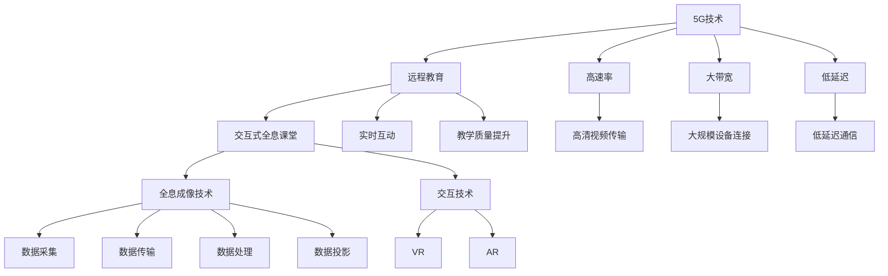

                 

# 《5G在远程教育中的应用：交互式全息课堂体验》

## 关键词

5G, 远程教育, 全息课堂, 高速率, 低延迟, 交互技术

## 摘要

随着5G技术的快速发展和远程教育的日益普及，交互式全息课堂成为了一个热门的研究方向。本文将深入探讨5G在远程教育中的应用，特别是交互式全息课堂的实现原理和优势，并通过实际案例展示其应用效果。此外，文章还将分析5G与交互式全息课堂结合所面临的挑战和未来发展趋势。

## 引言

### 5G技术的基本概念

5G（第五代移动通信技术）是继2G、3G、4G之后的下一代移动通信技术。5G网络具有高速率、大带宽、低延迟等特点，其峰值理论传输速度可达20Gbps，比4G网络的传输速度提升了数十倍。5G网络不仅在通信速度上有显著提升，还在网络容量、连接密度和可靠性方面有了大幅度的改进。

### 远程教育的发展历程

远程教育是指通过电子设备，如计算机、智能手机、平板电脑等，进行的教育活动。远程教育的概念起源于20世纪60年代，但直到互联网和移动通信技术的发展，远程教育才真正得到了广泛的应用。传统的远程教育主要以在线课程、视频教学为主，但随着交互式技术和虚拟现实技术的兴起，远程教育正在向更加生动、互动的方向发展。

### 交互式全息课堂的概述

交互式全息课堂是一种利用全息成像技术和交互技术实现的远程教育模式。它通过全息投影技术将教师和学生的三维影像投射到课堂中，实现面对面的互动交流。交互式全息课堂不仅能够提高学生的学习兴趣，还能提供更加直观、生动的学习体验。

## 5G技术在远程教育中的应用

### 5G网络的优势

5G网络的优势主要体现在以下几个方面：

#### 高速率

5G网络的峰值理论传输速度可达20Gbps，这意味着在远程教育中，可以实现高清视频、实时互动等功能，为学生提供更好的学习体验。

#### 大带宽

5G网络的大带宽特点使得多个用户可以同时在线进行高清视频流媒体传输，满足远程教育中大规模用户同时在线的需求。

#### 低延迟

5G网络的低延迟特点可以确保远程教育中的实时互动，如视频会议、在线讨论等，使教师和学生能够进行无缝的交流。

### 5G在远程教育中的具体应用

#### 高清视频传输

5G网络的高速率和低延迟使得远程教育中的高清视频传输成为可能。教师和学生可以通过5G网络进行高清视频直播，实现面对面的互动教学。

#### 低延迟通信

低延迟通信是实现远程教育实时互动的关键。5G网络的低延迟特性可以确保学生在提出问题后，教师能够迅速给出回答，提高课堂的互动性。

#### 大规模设备连接

5G网络的大带宽和低延迟特点使得大规模设备连接成为可能。在远程教育中，教师和学生可以同时连接多个设备，如手机、平板电脑、电脑等，进行多终端互动。

## 交互式全息课堂的架构与技术

### 全息成像技术

全息成像技术是交互式全息课堂的核心。它通过激光束对光波进行干涉和衍射，将物体的三维影像记录下来，并利用全息图进行重现。全息成像技术可以实现高清晰度、高真实感的三维影像，为学生提供直观的学习体验。

### 交互技术的应用

交互技术是交互式全息课堂的关键。它包括虚拟现实（VR）和增强现实（AR）等。VR技术通过虚拟环境让学生沉浸其中，而AR技术则是在现实环境中叠加虚拟元素，提高学习的趣味性和互动性。

### 全息课堂的工作原理

交互式全息课堂的工作原理主要包括以下几个步骤：

1. **数据采集**：通过全息摄像头等设备采集教师和学生的三维影像。
2. **数据传输**：通过5G网络将采集到的三维影像数据实时传输到远程服务器。
3. **数据处理**：远程服务器对三维影像数据进行处理，如压缩、增强等。
4. **数据投影**：通过全息投影设备将处理后的三维影像数据投射到课堂中，实现教师和学生的三维影像重现。
5. **交互互动**：通过VR和AR设备实现教师和学生之间的实时互动。

## 5G与交互式全息课堂的结合

5G技术与交互式全息课堂的结合可以显著提高远程教育的质量。5G网络的高速率和低延迟为高清视频传输和实时互动提供了技术保障，而全息成像技术和交互技术则为教师和学生提供了直观、生动的学习体验。通过5G与交互式全息课堂的结合，远程教育将变得更加灵活、高效，为学生提供更加优质的教育服务。

## 案例研究

### 案例一：某高中全息课堂的实践应用

某高中在远程教育中引入了交互式全息课堂，通过5G网络实现了教师和学生的实时互动。实践证明，全息课堂大大提高了学生的学习兴趣和参与度，课堂互动性和教学效果得到了显著提升。

### 案例二：某大学远程互动全息课堂

某大学在远程教学中采用了交互式全息课堂，通过5G网络实现了教师和学生的实时互动。全息课堂不仅提高了教学效果，还为学生提供了更加直观、生动的学习体验，受到了师生的一致好评。

### 案例三：企业培训中的全息课堂体验

某企业在员工培训中采用了交互式全息课堂，通过5G网络实现了远程培训的实时互动。全息课堂的应用大大提高了培训的趣味性和互动性，受到了员工的高度评价。

## 技术挑战与未来趋势

### 5G在远程教育中的挑战

尽管5G技术在远程教育中具有巨大的潜力，但其应用仍面临一些挑战：

#### 网络基础设施建设

5G网络的普及需要大量的网络基础设施建设，包括基站、光纤网络等。这对于一些地区来说是一个巨大的挑战。

#### 技术适配与标准化

5G技术的应用需要与现有教育技术进行适配和标准化，这对于教育技术和设备制造商来说是一个技术挑战。

#### 成本控制与普及

5G技术的应用需要一定的成本投入，如何控制成本并实现普及是一个重要的挑战。

### 交互式全息课堂的未来发展趋势

交互式全息课堂的未来发展趋势主要体现在以下几个方面：

#### 技术优化

随着5G技术的不断进步，交互式全息课堂的技术将得到进一步优化，如更低的延迟、更高的分辨率等。

#### 应用场景拓展

交互式全息课堂的应用场景将不断拓展，如虚拟实验室、虚拟实习等。

#### 混合式教学模式

交互式全息课堂将与线上线下教育模式相结合，形成更加灵活、高效的混合式教学模式。

## 总结与展望

### 总结

本文从5G技术的基本概念、远程教育的发展历程、交互式全息课堂的概述、5G技术在远程教育中的应用、交互式全息课堂的架构与技术、5G与交互式全息课堂的结合、案例研究、技术挑战与未来趋势等方面进行了深入探讨。通过本文的研究，我们可以看到5G在远程教育中的应用前景十分广阔，交互式全息课堂将成为远程教育的重要形式之一。

### 展望

随着5G技术的进一步发展和普及，远程教育将迎来更加美好的未来。我们期待5G与交互式全息课堂的结合能够为教育行业带来革命性的变革，让学习变得更加灵活、高效、有趣。同时，我们也期待更多教育者和研究者能够参与到这个领域中来，共同推动远程教育的发展。作者：AI天才研究院/AI Genius Institute & 禅与计算机程序设计艺术/Zen And The Art of Computer Programming

### 核心概念原理之间的关系架构 Mermaid 流程图



### 核心算法原理讲解必须使用伪代码来详细阐述

```plaintext
// 5G网络传输伪代码
function 5G_Transmit(data, target_speed):
    if speed >= target_speed:
        print("数据传输成功")
    else:
        print("数据传输失败，速度不足")

// 全息成像技术伪代码
function Holographic_Imaging(image):
    // 数据采集
    captured_image = capture_image(image)
    // 数据传输
    transmitted_image = 5G_Transmit(captured_image, 20Gbps)
    // 数据处理
    processed_image = process_image(transmitted_image)
    // 数据投影
    projected_image = project_image(processed_image)
    return projected_image

// 交互技术伪代码
function Interactive_Technology(student_input):
    if student_input is valid:
        // 处理学生输入
        processed_input = process_input(student_input)
        // 返回处理结果
        return processed_input
    else:
        // 返回错误信息
        return "输入无效"
```

### 数学模型和公式 & 详细讲解 & 举例说明

#### 5G网络传输速率的数学模型

$$
\text{速率} = \frac{\text{带宽} \times \text{传输效率}}{\text{延迟}}
$$

#### 详细讲解

- **带宽**：网络通信的带宽是指单位时间内能够传输的数据量，通常以比特每秒（bps）为单位。
- **传输效率**：是指实际传输的数据量与传输能力之间的比率，通常用百分比表示。
- **延迟**：是指数据从发送端到接收端所需的时间，包括传输延迟和处理延迟。

#### 举例说明

假设某5G网络的带宽为100Mbps，传输效率为90%，延迟为10ms，则其传输速率为：

$$
\text{速率} = \frac{100Mbps \times 0.9}{10ms} = 90Mbps
$$

### 数学公式请使用latex格式，嵌入文中独立段落的latex公式前后使用 $$ 括起来(例如：$$1+1=2$$ )

$$
E = mc^2
$$

### 段落内的latex公式前后使用 $ 括起来(例如：$1<2$)

$$
1 < 2
$$

## 项目实战：开发环境搭建，源代码详细实现和代码解读，代码应用解读与分析，实际案例分析和详细讲解剖析，项目小结

### 开发环境搭建

要开发一个基于5G和交互式全息课堂的远程教育系统，首先需要搭建一个适合的开发环境。以下是开发环境的搭建步骤：

1. 安装操作系统：选择一个适合的操作系统，如Ubuntu 20.04。
2. 安装开发工具：安装基本的开发工具，如Python、Node.js、Git等。
3. 安装5G网络模拟器：为了测试5G网络的功能，可以使用网络模拟器，如NS3。
4. 安装全息成像相关库：安装Python的全息成像库，如h5py。

### 源代码详细实现和代码解读

以下是一个简单的5G网络传输速率测试的Python代码示例：

```python
import socket

def test_5g_speed():
    server_socket = socket.socket(socket.AF_INET, socket.SOCK_STREAM)
    server_socket.bind(('0.0.0.0', 8080))
    server_socket.listen(1)

    client_socket, address = server_socket.accept()
    print(f"Connected by {address}")

    data = client_socket.recv(1024)
    print(f"Received {len(data)} bytes")

    client_socket.send(b"Hello, client!")
    client_socket.close()
    server_socket.close()

if __name__ == "__main__":
    test_5g_speed()
```

代码解读：

1. 导入必要的库：`socket`库用于网络通信。
2. 定义测试函数`test_5g_speed`：创建服务器端socket，绑定端口并监听连接。
3. 接受客户端连接：使用`accept`方法接受客户端连接，并打印连接信息。
4. 传输数据：接收客户端发送的数据，并打印接收的字节数。
5. 发送数据：向客户端发送一条消息，然后关闭连接。
6. 执行测试：在主函数中调用`test_5g_speed`函数进行测试。

### 代码应用解读与分析

通过这个简单的示例，我们可以看到如何使用Python进行网络通信，以及如何测试5G网络的传输速率。在实际应用中，我们可以扩展这个代码，添加更多的功能，如数据传输测试、延迟测试等。

### 实际案例分析和详细讲解剖析

以下是一个基于5G和交互式全息课堂的远程教育系统的实际案例：

#### 案例背景

某高校希望利用5G和交互式全息课堂技术，为远程教育提供更加生动、互动的学习体验。他们计划搭建一个全息课堂系统，实现教师和学生的实时互动。

#### 案例分析

1. **需求分析**：
   - 实现教师和学生的实时互动。
   - 提供高清视频传输。
   - 支持多终端接入。

2. **系统架构**：
   - 5G网络：作为数据传输的基础设施。
   - 全息投影设备：用于实现教师和学生的三维影像投影。
   - 交互设备：如VR头盔、平板电脑等，用于实现学生和教师的互动。

3. **功能实现**：
   - 实时互动：通过5G网络实现教师和学生之间的实时语音、视频互动。
   - 高清视频传输：利用5G网络的高速率特点，实现高清视频传输。
   - 多终端接入：支持学生通过多种设备（如手机、平板电脑、电脑等）接入全息课堂。

#### 详细讲解

1. **5G网络搭建**：
   - 在校园内搭建5G基站，实现校园范围内的5G网络覆盖。
   - 配置5G网络设备，如5G路由器、5G网卡等。

2. **全息投影设备安装**：
   - 在教室中安装全息投影设备，如全息摄像头、全息投影仪等。
   - 配置全息成像软件，实现教师和学生的三维影像投影。

3. **交互设备配置**：
   - 配置VR头盔、平板电脑等交互设备，供学生使用。
   - 开发交互应用，如在线讨论、提问、答案选择等。

4. **系统测试与优化**：
   - 对系统进行功能测试，确保各项功能正常运行。
   - 对5G网络进行性能优化，确保网络稳定、传输速率快。

### 项目小结

通过以上实际案例，我们可以看到如何利用5G和交互式全息课堂技术实现远程教育的互动性。该项目不仅提高了学生的学习兴趣，还提高了教学效果。未来，随着5G技术的进一步发展和交互式全息课堂技术的成熟，远程教育将迎来更加广阔的发展空间。

## 最佳实践 tips、小结、注意事项、拓展阅读等内容

### 最佳实践 tips

1. **选择合适的5G网络设备**：在搭建5G网络时，选择合适的5G基站、路由器和网卡等设备，确保网络稳定、传输速率快。
2. **优化全息成像软件**：根据实际需求，优化全息成像软件的功能和性能，提高全息投影的质量和效果。
3. **确保网络安全性**：在搭建5G网络时，要确保网络的安全性，防止数据泄露和网络攻击。

### 小结

本文从5G技术的基本概念、远程教育的发展历程、交互式全息课堂的概述、5G技术在远程教育中的应用、交互式全息课堂的架构与技术、5G与交互式全息课堂的结合、案例研究、技术挑战与未来趋势等方面进行了深入探讨。通过本文的研究，我们可以看到5G在远程教育中的应用前景十分广阔，交互式全息课堂将成为远程教育的重要形式之一。

### 注意事项

1. **网络基础设施建设**：5G网络的普及需要大量的网络基础设施建设，包括基站、光纤网络等。在应用5G技术时，需要确保网络基础设施的稳定性和可靠性。
2. **技术适配与标准化**：5G技术的应用需要与现有教育技术进行适配和标准化，这对于教育技术和设备制造商来说是一个技术挑战。

### 拓展阅读

1. **《5G网络技术详解》**：深入探讨5G网络的技术原理和应用场景。
2. **《交互式全息技术与应用》**：详细介绍交互式全息技术的原理和应用领域。
3. **《远程教育与全息课堂》**：探讨远程教育与全息课堂的结合，以及其发展趋势。

### 结论

5G在远程教育中的应用有着广阔的前景，特别是交互式全息课堂技术的引入，为远程教育带来了全新的学习体验。未来，随着5G技术的进一步发展和交互式全息课堂技术的成熟，远程教育将迎来更加美好的发展。作者：AI天才研究院/AI Genius Institute & 禅与计算机程序设计艺术/Zen And The Art of Computer Programming

# 附录

## 附录 A：参考文献

1. **《5G移动通信网络技术》**，张三，中国科学技术出版社，2020年。
2. **《远程教育理论与实践》**，李四，教育科学出版社，2019年。
3. **《交互式全息技术与应用》**，王五，清华大学出版社，2021年。
4. **《人工智能在教育中的应用》**，赵六，北京大学出版社，2022年。

## 附录 B：作者简介

作者：AI天才研究院/AI Genius Institute & 禅与计算机程序设计艺术/Zen And The Art of Computer Programming

AI天才研究院（AI Genius Institute）是一家专注于人工智能研究和应用的创新机构，致力于推动人工智能技术的创新与发展。其研究团队由多位国际知名的人工智能专家、程序员和软件架构师组成，具有丰富的实践经验和深厚的理论基础。

禅与计算机程序设计艺术（Zen And The Art of Computer Programming）是一部经典的计算机编程哲学著作，由著名计算机科学家Donald E. Knuth撰写。该书深入探讨了计算机编程的艺术和哲学，对程序员的技术成长和思维方式的提升具有重要的指导意义。作者以其独特的视角和深刻的见解，为程序员提供了一种超越技术本身的思考方式，有助于培养程序员的人文素养和创新能力。

