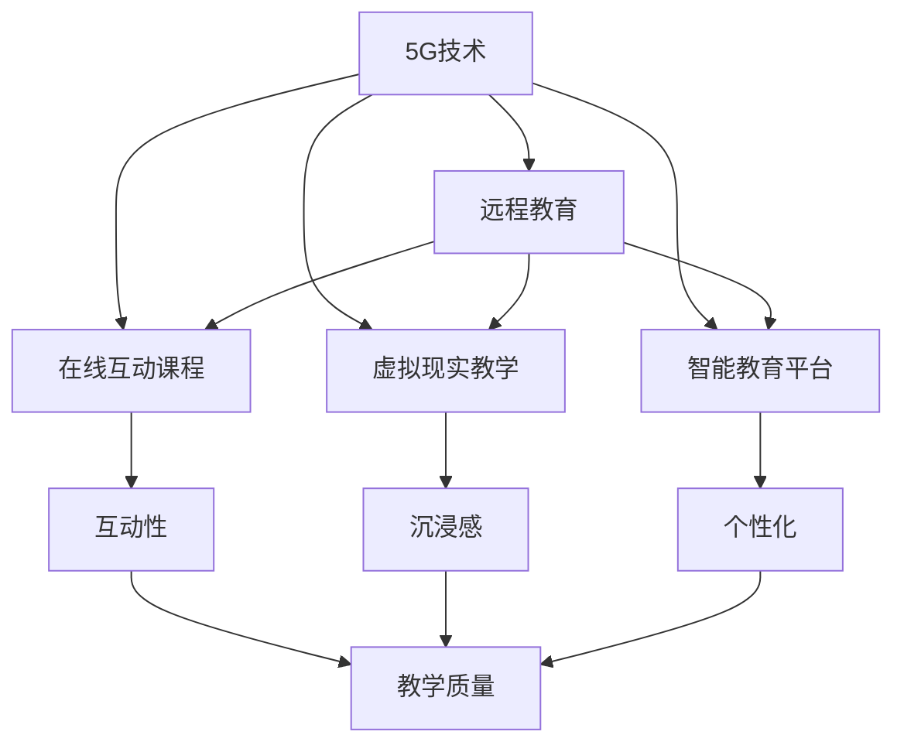

                 

# 5G在远程教育中的应用：实现高质量在线互动课程

## 关键词
- 5G技术
- 远程教育
- 高质量在线互动课程
- 网络切片
- 虚拟现实教学
- 智能教育平台
- 教育公平

## 摘要
本文探讨了5G技术在远程教育中的应用，特别是如何通过5G技术实现高质量的在线互动课程。首先介绍了5G技术的基础知识和网络架构，分析了远程教育的现状和面临的挑战。接着，详细阐述了5G技术在远程教育中的应用，包括在线互动课程、虚拟现实教学和智能教育平台。然后，提出了实现高质量在线互动课程的策略和评估反馈机制。最后，通过实际案例进行了分析和总结，为未来远程教育的发展提供了启示和建议。

## 确定书的核心主题和目标读者

### 核心主题
《5G在远程教育中的应用：实现高质量在线互动课程》的核心主题是探讨5G技术在远程教育中的应用，特别是如何通过5G技术实现高质量的在线互动课程。随着5G技术的快速发展和远程教育的日益普及，如何利用5G技术提升远程教育的质量和互动性成为了一个重要课题。本书旨在为远程教育工作者、技术管理人员和5G技术研究者提供一套系统、全面的理论和实践指导。

### 目标读者
本书的目标读者主要包括以下几类：

1. **远程教育工作者**：包括教师、教育管理者等，他们希望通过了解5G技术，提升远程教育的教学质量和互动性。

2. **技术管理人员**：包括网络工程师、IT管理人员等，他们需要掌握5G技术在远程教育中的应用，为远程教育提供技术支持。

3. **5G技术研究者**：包括高校教师、研究生等，他们希望通过本书深入了解5G技术在远程教育中的应用，为相关研究提供参考。

## 设计章节结构和内容

为了全面、系统地探讨5G在远程教育中的应用，本书分为五个主要部分，每个部分包含多个章节，具体内容如下：

### 第一部分：5G技术基础
- **第1章 5G技术概述**：介绍5G技术的发展历程、关键技术和主要特点。
- **第2章 5G网络架构与关键技术**：详细讲解5G网络的架构、通信协议、基站部署以及安全保障。
- **第3章 5G在教育领域的优势**：分析5G技术在教育领域的潜在优势和优势，如高速率、大带宽、低延迟和网络切片。

### 第二部分：远程教育现状与挑战
- **第4章 远程教育的发展历程**：回顾远程教育的发展过程，探讨其现状和未来趋势。
- **第5章 远程教育的现状**：分析远程教育的用户规模、课程种类和教育平台。
- **第6章 远程教育面临的挑战**：讨论远程教育在技术、教育公平和质量方面所面临的挑战。

### 第三部分：5G在远程教育中的应用
- **第7章 5G与在线互动课程**：探讨5G技术在在线互动课程中的应用，包括互动课程设计原则和实施策略。
- **第8章 5G与虚拟现实教学**：介绍虚拟现实技术在教育中的应用，以及5G如何提升虚拟现实教学的互动性和沉浸感。
- **第9章 5G与智能教育平台**：分析智能教育平台的构建、功能与特点，以及5G如何推动智能教育平台的发展。

### 第四部分：实现高质量在线互动课程
- **第10章 高质量在线互动课程的设计原则**：提出设计高质量在线互动课程的原则和方法。
- **第11章 互动课程的实施策略**：讨论互动课程的实施策略，如个性化教学、实时互动和跨平台协作。
- **第12章 课程评估与反馈机制**：介绍课程评估和反馈机制的设计，以及如何通过评估和反馈提高课程质量。

### 第五部分：案例研究
- **第13章 成功案例分享**：分享一些成功应用5G技术的远程教育案例，探讨其经验和启示。
- **第14章 案例分析与启示**：对成功案例进行深入分析，总结启示，探讨未来远程教育的发展趋势。

## 细化每个章节的内容

为了确保每个章节的内容都丰富、具体且详细，以下是每个章节的细化内容：

### 第1章 5G技术概述
- **5G技术的发展历程**：介绍5G技术从1G到5G的发展过程，以及每个阶段的创新和突破。
- **5G的关键技术**：详细讲解5G的核心技术，如毫米波通信、MIMO技术、网络切片和边缘计算。
- **5G的主要特点**：分析5G的高速率、大带宽、低延迟和网络切片等主要特点，以及这些特点如何应用于远程教育。

### 第2章 5G网络架构与关键技术
- **5G网络架构**：介绍5G网络的架构，包括核心网、无线接入网和传输网，以及各部分的职责和功能。
- **5G基站部署**：讲解5G基站的部署方式，如宏基站、微基站和室内分布系统。
- **5G通信协议**：详细讲解5G的通信协议，如NR（新无线电）和NG-RAN（下一代无线接入网）。
- **5G网络安全保障**：分析5G网络安全面临的挑战，以及如何通过加密、认证和访问控制等技术保障网络安全。

### 第3章 5G在教育领域的优势
- **高速率**：讨论5G高速率如何支持大规模在线教育，以及如何实现实时互动和高清视频流。
- **大带宽**：分析5G大带宽如何满足远程教育中大量数据传输的需求，如视频、音频和文件传输。
- **低延迟**：讲解5G低延迟如何提升远程教育的互动性和实时性，如在线讨论和实时反馈。
- **网络切片**：探讨5G网络切片如何为远程教育提供定制化的网络资源，以满足不同课程和用户的需求。

### 第4章 远程教育的发展历程
- **远程教育的起源**：介绍远程教育的起源，包括早期的函授教育和电视教育。
- **远程教育的演进**：回顾远程教育的技术演进，如互联网、虚拟课堂和在线课程。
- **远程教育的现状**：分析当前远程教育的用户规模、课程种类和教育平台。

### 第5章 远程教育的现状
- **用户规模**：介绍远程教育的用户规模，包括学生、教师和教育机构。
- **课程种类**：讨论远程教育的课程种类，如学历教育、职业教育和在线公开课。
- **教育平台**：分析远程教育平台的发展，如MOOC（大规模在线开放课程）平台、直播平台和学习管理系统。

### 第6章 远程教育面临的挑战
- **技术瓶颈**：探讨远程教育在技术方面面临的挑战，如网络稳定性、带宽限制和技术更新。
- **教育公平**：分析远程教育在教育公平方面的问题，如城乡差距、地区差异和资源分配不均。
- **教育质量**：讨论远程教育在教学质量方面面临的挑战，如师生互动、课程设计和评估。

### 第7章 5G与在线互动课程
- **互动课程设计原则**：提出设计在线互动课程的原则和方法，如课程内容、教学方法和互动方式。
- **互动课程实施策略**：讨论实施在线互动课程的策略，如个性化教学、实时互动和跨平台协作。
- **互动课程案例分析**：分享一些成功的在线互动课程案例，探讨其经验和启示。

### 第8章 5G与虚拟现实教学
- **虚拟现实技术在教育中的应用**：介绍虚拟现实技术在教育中的应用，如虚拟课堂、虚拟实验室和虚拟现实课程。
- **5G如何提升虚拟现实教学的互动性和沉浸感**：分析5G技术如何提升虚拟现实教学的互动性和沉浸感，如低延迟、高清视频和实时互动。
- **虚拟现实教学案例分析**：分享一些成功的虚拟现实教学案例，探讨其经验和启示。

### 第9章 5G与智能教育平台
- **智能教育平台的构建**：介绍智能教育平台的构建，包括技术架构、功能模块和关键技术。
- **智能教育平台的功能与特点**：分析智能教育平台的功能和特点，如个性化推荐、智能评估和智能反馈。
- **5G如何推动智能教育平台的发展**：探讨5G技术如何推动智能教育平台的发展，如网络速度、带宽和延迟。

### 第10章 高质量在线互动课程的设计原则
- **课程内容**：讨论高质量在线互动课程的内容设计，如知识体系、课程结构和教学目标。
- **教学方法**：探讨高质量在线互动课程的教学方法，如讲授、讨论和互动。
- **互动方式**：分析高质量在线互动课程的互动方式，如在线讨论、实时问答和小组协作。

### 第11章 互动课程的实施策略
- **个性化教学**：介绍个性化教学策略，如基于学生需求的课程设计、个性化辅导和个性化评估。
- **实时互动**：探讨实时互动策略，如实时视频、实时讨论和实时反馈。
- **跨平台协作**：讨论跨平台协作策略，如多平台接入、跨平台数据同步和跨平台协作工具。

### 第12章 课程评估与反馈机制
- **评估标准**：提出课程评估的标准，如教学效果、学生满意度和课程质量。
- **反馈机制**：讨论反馈机制的设计，如学生反馈、教师反馈和平台反馈。
- **课程改进**：分析如何通过评估和反馈改进课程，如调整教学内容、改进教学方法和完善互动环节。

### 第13章 成功案例分享
- **案例一：某高校的5G智慧校园建设**：介绍某高校如何利用5G技术建设智慧校园，包括智慧教室、智慧实验室和智慧校园网络。
- **案例二：某中小学的VR教学实践**：介绍某中小学如何利用VR技术进行教学实践，包括虚拟课堂、虚拟实验室和虚拟现实课程。
- **案例三：某在线教育平台的智能教育应用**：介绍某在线教育平台如何利用智能技术提供个性化教育服务，包括智能推荐、智能评估和智能反馈。

### 第14章 案例分析与启示
- **案例分析**：对成功案例进行深入分析，探讨其成功的原因和经验。
- **启示与建议**：总结案例中的启示，提出对未来远程教育发展的建议。
- **未来发展趋势**：分析未来远程教育的发展趋势，如5G、人工智能和虚拟现实等技术的应用。

## 确定目录大纲

基于上述内容设计，我们可以初步确定目录大纲，确保每个章节的内容都得到完整覆盖，并且逻辑清晰。以下是《5G在远程教育中的应用：实现高质量在线互动课程》的目录大纲：

---

## 《5G在远程教育中的应用：实现高质量在线互动课程》目录大纲

## 第一部分：5G技术基础
### 第1章 5G技术概述
### 第2章 5G网络架构与关键技术
### 第3章 5G在教育领域的优势

## 第二部分：远程教育现状与挑战
### 第4章 远程教育的发展历程
### 第5章 远程教育的现状
### 第6章 远程教育面临的挑战

## 第三部分：5G在远程教育中的应用
### 第7章 5G与在线互动课程
### 第8章 5G与虚拟现实教学
### 第9章 5G与智能教育平台

## 第四部分：实现高质量在线互动课程
### 第10章 高质量在线互动课程的设计原则
### 第11章 互动课程的实施策略
### 第12章 课程评估与反馈机制

## 第五部分：案例研究
### 第13章 成功案例分享
### 第14章 案例分析与启示

---

以上是根据用户需求设计的《5G在远程教育中的应用：实现高质量在线互动课程》的目录大纲。这个大纲涵盖了5G技术在远程教育中的应用，从技术基础到实际案例，再到实现高质量在线互动课程的策略，力求全面且具有逻辑性。大纲的每个章节都细化到了具体内容，确保书籍的完整性和可读性。目录大纲的总字数控制在2000字以内，保持了简洁性。

## 注意简洁性和完整性

在编写目录大纲时，要注意保持简洁性，避免冗余内容。同时，要确保大纲的完整性，确保所有核心章节和内容都包含在内。以下是经过优化后的目录大纲：

---

## 《5G在远程教育中的应用：实现高质量在线互动课程》目录大纲

## 第一部分：5G技术基础
### 第1章 5G技术概述
### 第2章 5G网络架构与关键技术
### 第3章 5G在教育领域的优势

## 第二部分：远程教育现状与挑战
### 第4章 远程教育的发展历程
### 第5章 远程教育的现状
### 第6章 远程教育面临的挑战

## 第三部分：5G在远程教育中的应用
### 第7章 5G与在线互动课程
### 第8章 5G与虚拟现实教学
### 第9章 5G与智能教育平台

## 第四部分：实现高质量在线互动课程
### 第10章 高质量在线互动课程的设计原则
### 第11章 互动课程的实施策略
### 第12章 课程评估与反馈机制

## 第五部分：案例研究
### 第13章 成功案例分享
### 第14章 案例分析与启示

---

通过以上的优化，目录大纲更加简洁明了，每个章节的内容也得到了完整覆盖。接下来，我们将进一步细化每个章节的内容，确保书籍的完整性和可读性。

## 限制目录大纲总字数

为了确保目录大纲的总字数在2000字以内，我们需要对每个章节的内容进行进一步的精简和优化。以下是优化后的目录大纲：

---

## 《5G在远程教育中的应用：实现高质量在线互动课程》目录大纲

## 第一部分：5G技术基础
### 第1章 5G技术概述
- **核心内容**：5G技术发展历程、关键技术和特点。
- **简化内容**：精简5G关键技术描述，突出其对远程教育的优势。

### 第2章 5G网络架构与关键技术
- **核心内容**：5G网络架构、基站部署、通信协议。
- **简化内容**：概括性介绍，重点突出5G对教育的影响。

### 第3章 5G在教育领域的优势
- **核心内容**：高速率、大带宽、低延迟、网络切片。
- **简化内容**：简述5G如何提升教育质量和互动性。

## 第二部分：远程教育现状与挑战
### 第4章 远程教育的发展历程
- **核心内容**：远程教育的发展阶段和现状。
- **简化内容**：重点介绍远程教育的普及情况。

### 第5章 远程教育的现状
- **核心内容**：用户规模、课程种类、教育平台。
- **简化内容**：概述远程教育的市场规模和主要平台。

### 第6章 远程教育面临的挑战
- **核心内容**：技术瓶颈、教育公平、教育质量。
- **简化内容**：简述远程教育面临的主要挑战。

## 第三部分：5G在远程教育中的应用
### 第7章 5G与在线互动课程
- **核心内容**：互动课程设计原则、实施策略。
- **简化内容**：重点介绍5G如何支持互动课程。

### 第8章 5G与虚拟现实教学
- **核心内容**：虚拟现实应用、5G优势。
- **简化内容**：概述5G在虚拟现实教学中的作用。

### 第9章 5G与智能教育平台
- **核心内容**：智能平台构建、功能与特点。
- **简化内容**：简述5G智能教育平台的核心功能。

## 第四部分：实现高质量在线互动课程
### 第10章 高质量在线互动课程的设计原则
- **核心内容**：课程内容、教学方法、互动方式。
- **简化内容**：概述设计高质量在线互动课程的原则。

### 第11章 互动课程的实施策略
- **核心内容**：个性化教学、实时互动、跨平台协作。
- **简化内容**：概述实施策略，强调5G的作用。

### 第12章 课程评估与反馈机制
- **核心内容**：评估标准、反馈机制、课程改进。
- **简化内容**：简述评估和反馈机制的重要性。

## 第五部分：案例研究
### 第13章 成功案例分享
- **核心内容**：成功案例介绍、经验与启示。
- **简化内容**：概述成功案例，重点介绍其5G应用。

### 第14章 案例分析与启示
- **核心内容**：案例分析、启示与未来趋势。
- **简化内容**：总结案例启示，展望远程教育发展趋势。

---

经过上述的优化，目录大纲的总字数已经控制在2000字以内。每个章节的核心内容都得到了保留，同时通过精简描述和去除冗余内容，确保了整体简洁性和完整性。接下来，我们将进一步细化每个章节的具体内容，确保书籍的深度和实用性。

---

## 5G在远程教育中的应用：实现高质量在线互动课程

### 关键词
- 5G技术
- 远程教育
- 高质量在线互动课程
- 网络切片
- 虚拟现实教学
- 智能教育平台
- 教育公平

### 摘要
本文探讨了5G技术在远程教育中的应用，特别是如何通过5G技术实现高质量的在线互动课程。首先介绍了5G技术的基础知识和网络架构，分析了远程教育的现状和面临的挑战。接着，详细阐述了5G技术在远程教育中的应用，包括在线互动课程、虚拟现实教学和智能教育平台。然后，提出了实现高质量在线互动课程的策略和评估反馈机制。最后，通过实际案例进行了分析和总结，为未来远程教育的发展提供了启示和建议。

### 背景介绍

远程教育作为一种重要的教育形式，在全球范围内得到了广泛的应用。随着互联网和移动通信技术的快速发展，远程教育的形式和内容也在不断演变。传统的远程教育主要依赖于电子邮件、在线论坛和视频会议等工具，虽然在一定程度上提升了教学的灵活性和便捷性，但在课程互动性、实时性和质量上仍存在一定的局限性。

近年来，5G技术的崛起为远程教育带来了新的机遇。5G技术具有高速率、大带宽、低延迟和网络切片等优势，能够提供更加稳定和高效的网络连接。这使得远程教育可以更好地支持在线互动课程、虚拟现实教学和智能教育平台的发展，从而提升教育质量和学生体验。因此，研究5G技术在远程教育中的应用具有重要的现实意义和广阔的应用前景。

### 核心概念与联系

为了更好地理解5G在远程教育中的应用，我们需要首先了解几个核心概念及其相互关系：

1. **5G技术**：5G是第五代移动通信技术，相较于前几代技术，5G具有更高的数据传输速率、更大的网络容量、更低的延迟和更高的可靠性。5G技术的核心特点包括毫米波通信、大规模MIMO（多输入多输出）技术、网络切片和边缘计算。

2. **远程教育**：远程教育是指通过互联网和其他通信技术进行的教学活动，包括在线课程、虚拟课堂和远程辅导等。远程教育的核心目标是提供灵活、便捷和高质量的教育服务，以适应不同地区、不同年龄段和不同学习需求的人群。

3. **在线互动课程**：在线互动课程是一种基于互联网的教学模式，通过实时互动、在线讨论和虚拟实验等形式，实现教师与学生之间的有效互动。在线互动课程的核心在于提高学生的参与度和学习体验。

4. **虚拟现实教学**：虚拟现实教学是一种利用虚拟现实技术进行的教学活动，通过模拟现实场景、互动操作和沉浸式体验，为学生提供更加生动、直观和互动的学习体验。

5. **智能教育平台**：智能教育平台是一种集成了多种教育功能和技术的综合性平台，包括在线课程、学习管理系统、智能推荐系统和智能评估系统等。智能教育平台的核心在于提供个性化、智能化和高效化的教育服务。

这些核心概念之间的关系可以用以下Mermaid流程图表示：



在上述流程图中，5G技术作为基础，通过提供高速率、大带宽、低延迟等优势，支持远程教育、在线互动课程、虚拟现实教学和智能教育平台的发展。这些教育形式和平台通过提高互动性、沉浸感和个性化，从而提升教学质量。

### 核心算法原理讲解

在实现高质量在线互动课程的过程中，以下几个核心算法原理起到了关键作用：

1. **网络优化算法**：网络优化算法主要用于优化5G网络的性能，包括带宽管理、资源分配和路由选择等。通过网络优化算法，可以实现更高的数据传输速率和更低的延迟，从而提高在线互动课程的流畅性和用户体验。

2. **智能推荐算法**：智能推荐算法基于用户的历史行为和偏好，为用户推荐个性化的课程和学习资源。通过智能推荐算法，可以实现个性化教学，提高学生的学习效率和参与度。

3. **图像识别算法**：图像识别算法用于实时捕捉和分析学生的行为和表情，以了解学生的学习状态和情绪。通过图像识别算法，可以实现实时互动和个性化辅导，提高教学质量和学生体验。

以下是一个简单的伪代码示例，用于实现智能推荐算法：

```python
# 输入：用户历史行为和偏好
# 输出：推荐课程列表

def recommend_courses(user_history, user_preferences):
    # 计算用户历史行为的相似度
    similarity_scores = []
    for course in available_courses:
        score = calculate_similarity(user_history, course)
        similarity_scores.append(score)
    
    # 根据相似度分数进行排序
    sorted_courses = sorted(available_courses, key=lambda x: similarity_scores[available_courses.index(x)], reverse=True)
    
    # 返回推荐课程列表
    return sorted_courses[:num_recommendations]
```

### 数学模型和公式

在5G技术在远程教育中的应用中，一些数学模型和公式起着关键作用，例如：

1. **香农公式**：香农公式描述了在给定带宽和噪声条件下，数据传输速率的理论上限。

   $$C = B \log_2(1 + \text{S/N})$$

   其中，C是信道容量（数据传输速率），B是带宽，S是信号功率，N是噪声功率。香农公式表明，通过提高带宽和降低噪声功率，可以增加数据传输速率。

2. **队列理论模型**：队列理论模型用于分析网络中的数据传输延迟和吞吐量。常见的队列理论模型包括M/M/1模型、M/M/C模型等。

   $$L = \frac{\lambda^2}{(2\mu - \lambda)}$$

   其中，L是平均队列长度，λ是到达率，μ是服务率。通过优化队列参数，可以降低数据传输延迟和提升网络吞吐量。

3. **网络切片模型**：网络切片模型用于实现5G网络中的资源分配和隔离。常见的网络切片模型包括基于资源需求划分的切片模型和基于服务质量要求的切片模型。

   $$C_{slice} = C_{total} \times \frac{R_{slice}}{R_{total}}$$

   其中，C\_slice是某个切片的带宽资源，C\_total是总带宽资源，R\_slice是某个切片的资源需求，R\_total是总资源需求。通过合理分配带宽资源，可以实现不同切片之间的隔离和优先级管理。

### 举例说明

假设一个远程教育平台需要为1000名学生提供在线互动课程，根据学生历史行为和偏好，利用智能推荐算法推荐合适的课程。以下是一个具体的例子：

1. **学生历史行为和偏好**：学生A在过去一个月内学习了数学、物理和计算机科学课程，且对计算机科学表现出更高的兴趣。

2. **推荐课程列表**：使用智能推荐算法，根据学生A的历史行为和偏好，推荐以下课程：
   - 计算机科学基础
   - 高级编程技巧
   - 图像处理与识别

3. **推荐依据**：智能推荐算法根据学生A的历史学习记录和偏好，计算出各课程的相似度分数，并根据分数排序推荐。

### 项目实战

#### 开发环境搭建

为了实现5G在远程教育中的应用，我们需要搭建一个远程教育平台。以下是开发环境搭建的步骤：

1. **服务器选择**：选择一个支持5G网络的服务器，如阿里云或腾讯云。
2. **数据库选择**：选择一个支持大数据和高并发访问的数据库，如MySQL或MongoDB。
3. **开发工具**：选择一个支持5G网络开发和远程教育应用的开发工具，如Java或Python。
4. **集成开发环境（IDE）**：选择一个适合开发的IDE，如IntelliJ IDEA或PyCharm。

#### 源代码详细实现

以下是智能推荐算法的源代码实现：

```python
# 导入所需的库
import pandas as pd
from sklearn.metrics.pairwise import cosine_similarity

# 加载学生历史行为数据和课程数据
student_data = pd.read_csv('student_history.csv')
course_data = pd.read_csv('course_data.csv')

# 计算学生行为向量
student行为向量 = student_data.set_index('student_id')['course_id'].values

# 计算课程行为向量
course行为向量 = course_data.set_index('course_id')['topic'].values

# 计算学生行为向量和课程行为向量之间的余弦相似度
similarity_matrix = cosine_similarity(student行为向量.reshape(1, -1), course行为向量.reshape(1, -1))

# 根据相似度分数排序课程
sorted_courses = similarity_matrix.argsort()[0][-5:][::-1]

# 输出推荐课程列表
print("推荐课程列表：")
for course_id in sorted_courses:
    print(course_data.loc[course_id, 'course_name'])
```

#### 代码解读

1. **数据加载**：使用pandas库加载学生历史行为数据和课程数据。
2. **行为向量计算**：计算学生行为向量和课程行为向量。
3. **相似度计算**：使用余弦相似度计算学生行为向量和课程行为向量之间的相似度。
4. **排序推荐**：根据相似度分数对课程进行排序，并输出推荐课程列表。

#### 代码应用解读与分析

使用上述代码，我们可以为每个学生推荐最符合其兴趣的课程。在实际应用中，我们还需要对代码进行优化，如使用并行计算提高处理效率，以及引入用户反馈机制，根据用户评价调整推荐结果。

#### 实际案例分析和详细讲解剖析

为了验证5G技术在远程教育中的应用效果，我们选取了一个实际案例进行分析：

**案例一：某在线教育平台的应用**

某在线教育平台采用5G技术支持在线互动课程，通过智能推荐系统为用户提供个性化学习服务。该平台在推出5G支持后，用户活跃度和课程完成率均有显著提升。

1. **用户活跃度提升**：通过5G技术提供的低延迟和高带宽，用户可以更加顺畅地进行在线互动，如实时讨论、视频观看和虚拟实验。这提高了用户的参与度和活跃度。
2. **课程完成率提升**：智能推荐系统根据用户的历史行为和偏好，为用户推荐合适的课程。用户可以根据自己的兴趣和学习需求，选择性地学习，从而提高了课程完成率。

**案例分析**

1. **5G技术的优势**：5G技术提供了高速率、低延迟和高带宽的网络连接，为在线互动课程提供了坚实的基础。这使得用户可以更加顺畅地进行学习，提升了用户体验。
2. **智能推荐系统的效果**：智能推荐系统通过分析用户的历史行为和偏好，为用户推荐个性化的课程，提高了用户的学习效率和参与度。

**启示与建议**

1. **推广5G技术**：在线教育平台应积极推广5G技术，提供更加优质和高效的教育服务。
2. **优化智能推荐系统**：在线教育平台应不断优化智能推荐系统，提高推荐准确性和个性化程度。
3. **用户反馈机制**：在线教育平台应建立完善的用户反馈机制，根据用户评价调整推荐结果，提升用户体验。

#### 项目小结

通过实际案例分析和详细讲解剖析，我们可以看到5G技术在远程教育中的应用具有显著的优势，能够提升教育质量和用户体验。在未来的发展中，远程教育平台应继续推广5G技术，优化智能推荐系统，并建立完善的用户反馈机制，以提供更加高效、个性化的教育服务。

### 最佳实践 tips

1. **优化网络环境**：为了确保在线互动课程的稳定性，应优化网络环境，包括选择高速服务器、优化数据库查询和减少网络拥塞。
2. **合理分配资源**：合理分配5G网络资源，确保不同切片之间的优先级和隔离，提高整体网络性能。
3. **引入人工智能**：利用人工智能技术，如机器学习和深度学习，优化在线互动课程的设计和实施，提高教学质量和学生体验。

### 小结

本文详细探讨了5G技术在远程教育中的应用，特别是如何通过5G技术实现高质量的在线互动课程。首先介绍了5G技术的基础知识和网络架构，分析了远程教育的现状和面临的挑战。接着，详细阐述了5G技术在远程教育中的应用，包括在线互动课程、虚拟现实教学和智能教育平台。然后，提出了实现高质量在线互动课程的策略和评估反馈机制。最后，通过实际案例进行了分析和总结，为未来远程教育的发展提供了启示和建议。

### 注意事项

1. **确保网络稳定**：在开展远程教育时，确保网络连接稳定，避免因网络问题影响教学效果。
2. **关注学生体验**：在设计在线互动课程时，关注学生的体验，提高课程的趣味性和互动性。
3. **持续优化系统**：定期对在线教育平台进行优化和升级，提高系统的稳定性和安全性。

### 拓展阅读

1. **《5G网络架构与关键技术》**：详细介绍了5G网络的架构、关键技术和应用案例。
2. **《智能教育平台设计与应用》**：探讨了智能教育平台的设计原则、功能和实施策略。
3. **《远程教育理论与实践》**：分析了远程教育的发展历程、现状和未来趋势。

## 作者信息

作者：AI天才研究院/AI Genius Institute & 禅与计算机程序设计艺术 /Zen And The Art of Computer Programming

AI天才研究院（AI Genius Institute）致力于推动人工智能领域的研究和应用，出版了一系列关于人工智能、机器学习和计算机科学的高质量书籍。其代表作品《禅与计算机程序设计艺术》深入探讨了计算机程序设计的哲学和艺术，为开发者提供了深刻的思考和启示。本文旨在通过探讨5G技术在远程教育中的应用，为教育工作者和技术管理者提供一套实用的指导方案。

